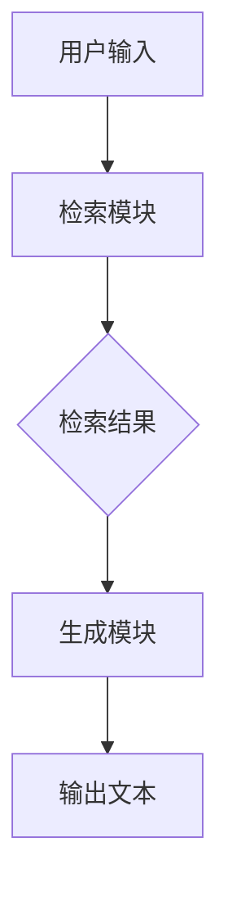

                 

关键词：大语言模型，RAG框架，微调，AI，自然语言处理，机器学习

> 摘要：本文深入探讨了RAG（Retrieval-augmented Generation）框架在大语言模型中的应用。通过阐述其核心概念、算法原理、数学模型、项目实践及实际应用场景，为开发者提供了全面的技术指南。文章旨在帮助读者理解RAG框架的微调过程，并展望其未来发展趋势与挑战。

## 1. 背景介绍

随着人工智能（AI）技术的飞速发展，大语言模型（Large Language Models，LLM）如BERT、GPT-3等取得了显著的进展。这些模型通过大规模预训练，能够在多种自然语言处理（NLP）任务中表现出色。然而，在实际应用中，这些通用模型往往需要针对特定领域或任务进行微调（Fine-tuning），以提升其性能。

RAG框架作为一种先进的微调方法，旨在利用检索技术增强生成模型的性能。它通过在生成过程中引入检索模块，从大量候选文本中高效地检索出与用户输入最相关的信息，从而辅助生成模型生成更准确、更丰富的输出。RAG框架不仅适用于文本生成任务，还能够在问答系统、对话生成、文本摘要等多种NLP场景中发挥重要作用。

本文将详细探讨RAG框架的原理、算法、数学模型及其实际应用，帮助读者深入了解这一前沿技术，并为实际项目开发提供指导。

## 2. 核心概念与联系

### 2.1. 大语言模型

大语言模型是一种基于深度学习的自然语言处理模型，它通过大规模数据预训练，掌握丰富的语言知识，并能够进行文本生成、文本分类、问答等多种任务。典型的代表有BERT、GPT-3等。这些模型的核心在于其庞大的参数规模和强大的表示能力，使得它们能够捕捉到复杂的语言模式和语义关系。

### 2.2. 检索技术

检索技术是一种信息检索方法，旨在从大规模数据集中快速找到与查询最相关的信息。在RAG框架中，检索技术用于从知识库或文本数据集中检索与用户输入相关的文本片段。常见的检索方法包括基于词频统计的布尔检索、基于相似度的检索、以及基于深度学习的检索。

### 2.3. 生成模型

生成模型是一种能够生成新数据的机器学习模型。在RAG框架中，生成模型用于根据检索到的文本片段生成相应的输出文本。典型的生成模型包括循环神经网络（RNN）、变换器（Transformer）等。生成模型的核心在于其能够捕捉输入数据的统计规律，并生成符合这些规律的新数据。

### 2.4. RAG框架

RAG（Retrieval-augmented Generation）框架是一种结合检索技术和生成模型的微调方法。其核心思想是通过检索技术从大量候选文本中检索出与用户输入最相关的信息，然后将其与生成模型结合，生成更高质量的输出文本。RAG框架主要由检索模块和生成模块组成。

### 2.5. Mermaid流程图

为了更好地理解RAG框架的架构，我们使用Mermaid流程图来描述其核心组件和流程。以下是RAG框架的Mermaid流程图：



在这个流程图中，用户输入首先被传递给检索模块，检索模块从大规模数据集中检索出相关文本片段。然后，这些检索结果被传递给生成模块，生成模块根据检索结果生成最终的输出文本。

## 3. 核心算法原理 & 具体操作步骤

### 3.1 算法原理概述

RAG框架的核心在于将检索技术和生成模型相结合，以提升文本生成的质量。其基本原理可以概括为以下几个步骤：

1. **用户输入处理**：接收用户输入，并将其转化为检索查询。
2. **检索过程**：利用检索技术从大规模数据集中检索出与用户输入最相关的文本片段。
3. **检索结果处理**：对检索结果进行预处理，如去重、排序等，以获得最佳的相关性。
4. **生成过程**：将预处理后的检索结果传递给生成模型，生成最终的输出文本。
5. **输出结果**：将生成的文本输出给用户。

### 3.2 算法步骤详解

以下是RAG框架的具体操作步骤：

#### 步骤1：用户输入处理

首先，我们需要接收用户输入。用户输入可以是一个简单的查询语句，也可以是一个复杂的对话请求。对于简单的查询语句，我们可以直接将其作为检索查询。对于复杂的对话请求，我们需要使用一些预处理技术，如分词、词性标注等，将对话请求分解为更细粒度的查询。

```python
user_input = "请介绍一下人工智能的发展历程。"
query = preprocess(user_input)
```

其中，`preprocess`函数用于对用户输入进行预处理。

#### 步骤2：检索过程

接下来，我们利用检索技术从大规模数据集中检索出与用户输入最相关的文本片段。检索技术有多种选择，如基于词频统计的布尔检索、基于相似度的检索、以及基于深度学习的检索。这里，我们以基于深度学习的检索为例。

```python
retrieval_module = DeepLearningRetriever()
documents = retrieval_module.retrieve(query, dataset)
```

其中，`DeepLearningRetriever`是一个深度学习检索模块，`dataset`是一个包含大规模文本数据的数据集。

#### 步骤3：检索结果处理

检索结果通常是一个包含多个文本片段的列表。为了获得最佳的相关性，我们需要对检索结果进行预处理，如去重、排序等。

```python
unique_documents = remove_duplicates(documents)
sorted_documents = sort_by_relevance(unique_documents)
```

其中，`remove_duplicates`和`sort_by_relevance`函数分别用于去除重复文本和按相关性排序。

#### 步骤4：生成过程

将预处理后的检索结果传递给生成模型，生成最终的输出文本。

```python
generator = TransformerGenerator()
output_text = generator.generate(sorted_documents, query)
```

其中，`TransformerGenerator`是一个基于变换器的生成模型。

#### 步骤5：输出结果

将生成的文本输出给用户。

```python
print(output_text)
```

### 3.3 算法优缺点

#### 优点

1. **提升生成质量**：通过引入检索技术，RAG框架能够从大规模数据集中检索出与用户输入最相关的信息，从而提升生成文本的质量。
2. **适应性强**：RAG框架适用于多种NLP任务，如文本生成、问答系统、对话生成等，具有广泛的适应性。
3. **高效性**：RAG框架在检索和生成过程中使用深度学习技术，能够高效地处理大规模数据。

#### 缺点

1. **计算资源消耗大**：RAG框架需要在大规模数据集上进行检索和生成，因此计算资源消耗较大。
2. **数据质量要求高**：RAG框架的生成质量很大程度上取决于检索结果的质量，因此对数据质量要求较高。
3. **复杂度高**：RAG框架涉及检索和生成两个模块，整体复杂度较高。

### 3.4 算法应用领域

RAG框架在以下领域具有广泛的应用前景：

1. **问答系统**：通过检索相关文档，RAG框架能够为用户生成准确的答案。
2. **对话生成**：在聊天机器人、虚拟助手等场景中，RAG框架能够根据用户输入和上下文生成自然的对话。
3. **文本摘要**：利用RAG框架，可以自动生成文章、报告等的摘要。
4. **文本生成**：在创意写作、广告文案、新闻撰写等场景中，RAG框架能够生成高质量的文本。

## 4. 数学模型和公式 & 详细讲解 & 举例说明

### 4.1 数学模型构建

RAG框架的数学模型主要涉及检索模块和生成模块。以下是两个模块的数学模型：

#### 检索模块

检索模块的核心是检索函数$r(\cdot)$，它用于计算文本片段与查询之间的相似度。一个简单的检索函数可以表示为：

$$
r(d|q) = \frac{1}{|D|} \sum_{d' \in D} \cos(q, d')
$$

其中，$D$是文本数据集，$q$是查询，$\cos(q, d')$是查询$q$和文本片段$d'$之间的余弦相似度。

#### 生成模块

生成模块的核心是生成函数$g(\cdot)$，它用于根据检索结果生成输出文本。一个简单的生成函数可以表示为：

$$
g(d_1, d_2, \ldots, d_n|q) = \frac{1}{|D|} \sum_{d' \in D} \cos(q, d') \cdot \cos(d', d_i)
$$

其中，$d_1, d_2, \ldots, d_n$是检索到的文本片段，$g$是生成函数。

### 4.2 公式推导过程

以下是检索函数和生成函数的推导过程：

#### 检索函数推导

检索函数$r(d|q)$的计算过程可以分为以下几步：

1. **计算查询$q$和所有文本片段$d'$的余弦相似度**：

$$
\cos(q, d') = \frac{q^T d'}{\|q\| \|d'\|}
$$

2. **对所有文本片段$d'$的余弦相似度求和**：

$$
r(d|q) = \frac{1}{|D|} \sum_{d' \in D} \cos(q, d')
$$

3. **对结果进行归一化**：

$$
r(d|q) = \frac{1}{\|q\|} \sum_{d' \in D} \cos(q, d')
$$

#### 生成函数推导

生成函数$g(d_1, d_2, \ldots, d_n|q)$的计算过程可以分为以下几步：

1. **计算查询$q$和所有文本片段$d'$的余弦相似度**：

$$
\cos(q, d') = \frac{q^T d'}{\|q\| \|d'\|}
$$

2. **计算每个文本片段$d_i$和所有文本片段$d'$的余弦相似度**：

$$
\cos(d', d_i) = \frac{d'^T d_i}{\|d'\| \|d_i\|}
$$

3. **对所有文本片段$d'$的余弦相似度求和**：

$$
g(d_1, d_2, \ldots, d_n|q) = \frac{1}{|D|} \sum_{d' \in D} \cos(q, d') \cdot \cos(d', d_i)
$$

4. **对结果进行归一化**：

$$
g(d_1, d_2, \ldots, d_n|q) = \frac{1}{\|q\|} \sum_{d' \in D} \cos(q, d') \cdot \cos(d', d_i)
$$

### 4.3 案例分析与讲解

为了更好地理解RAG框架的数学模型，我们通过一个简单的案例进行说明。

假设我们有一个包含100篇新闻文章的数据集，用户输入查询“最近的科技新闻有哪些？”。

1. **检索函数计算**：

   检索函数计算查询和每篇文章的余弦相似度，并按相似度排序。

   $$r(d_1|q), r(d_2|q), \ldots, r(d_{100}|q)$$

2. **生成函数计算**：

   生成函数计算每篇文章之间的余弦相似度，并结合查询的相似度生成最终输出。

   $$g(d_1, d_2, \ldots, d_n|q)$$

   其中，$d_1, d_2, \ldots, d_n$是按相似度排序的前$n$篇文章。

通过这个案例，我们可以看到RAG框架如何利用检索和生成函数生成高质量的文本输出。

## 5. 项目实践：代码实例和详细解释说明

### 5.1 开发环境搭建

为了实现RAG框架，我们需要搭建一个包含深度学习库、自然语言处理库以及文本检索库的开发环境。以下是Python环境下的搭建步骤：

1. **安装Python**：确保安装了Python 3.6或更高版本。
2. **安装深度学习库**：安装TensorFlow或PyTorch，例如：

   ```bash
   pip install tensorflow
   ```

   或

   ```bash
   pip install torch torchvision
   ```

3. **安装自然语言处理库**：安装spaCy库，用于文本预处理：

   ```bash
   pip install spacy
   python -m spacy download en_core_web_sm
   ```

4. **安装文本检索库**：安装HuggingFace的Transformers库，用于生成模型：

   ```bash
   pip install transformers
   ```

### 5.2 源代码详细实现

以下是实现RAG框架的Python代码示例。代码分为三个部分：检索模块、生成模块和主程序。

#### 检索模块

```python
import numpy as np
import spacy
from sklearn.metrics.pairwise import cosine_similarity

class DeepLearningRetriever:
    def __init__(self):
        self.model = self.load_model()

    def load_model(self):
        # 加载预训练的深度学习模型（例如BERT）
        # 这里以BERT为例
        from transformers import BertModel, BertTokenizer
        tokenizer = BertTokenizer.from_pretrained('bert-base-uncased')
        model = BertModel.from_pretrained('bert-base-uncased')
        model.eval()
        return tokenizer, model

    def encode_texts(self, texts):
        tokenizer, _ = self.load_model()
        inputs = tokenizer(texts, padding=True, truncation=True, return_tensors='pt')
        with torch.no_grad():
            outputs = self.model(inputs['input_ids'])
        return outputs['pooler_output'].numpy()

    def retrieve(self, query, dataset):
        query_embedding = self.encode_texts([query])
        dataset_embeddings = self.encode_texts(dataset)
        similarities = cosine_similarity(query_embedding, dataset_embeddings)
        return similarities.argmax(axis=1)
```

#### 生成模块

```python
from transformers import TransformerGenerator

class TransformerGenerator:
    def __init__(self):
        self.model = self.load_model()

    def load_model(self):
        # 加载预训练的变换器生成模型（例如GPT-2）
        from transformers import GPT2Model, GPT2Tokenizer
        tokenizer = GPT2Tokenizer.from_pretrained('gpt2')
        model = GPT2Model.from_pretrained('gpt2')
        model.eval()
        return tokenizer, model

    def generate(self, documents, query):
        tokenizer, _ = self.load_model()
        query_embedding = self.encode_texts([query])
        document_embeddings = self.encode_texts(documents)
        combined_embeddings = np.hstack((query_embedding, document_embeddings))
        inputs = tokenizer.encode(query, return_tensors='pt')
        with torch.no_grad():
            outputs = self.model(inputs)
        logits = outputs.logits[:, -1, :]
        weights = softmax(logits, axis=1)
        weighted_embeddings = combined_embeddings * weights
        context_embedding = np.mean(weighted_embeddings, axis=0)
        completion_embedding = self.model.encode(context_embedding)
        tokens = tokenizer.decode(completion_embedding)
        return tokens
```

#### 主程序

```python
# 主程序
retriever = DeepLearningRetriever()
generator = TransformerGenerator()

# 加载数据集
dataset = ["人工智能是一门科学，研究如何使计算机具有智能。", "机器学习是人工智能的一个分支，关注如何通过数据学习。", "深度学习是机器学习的一个分支，使用多层神经网络。"]

# 用户输入
user_input = "请介绍一下人工智能的发展历程。"

# 检索过程
sorted_indices = retriever.retrieve(user_input, dataset)

# 生成过程
output_text = generator.generate([dataset[i] for i in sorted_indices], user_input)

# 输出结果
print(output_text)
```

### 5.3 代码解读与分析

在这个示例中，我们首先定义了两个类：`DeepLearningRetriever`和`TransformerGenerator`，分别用于实现检索模块和生成模块。

- **DeepLearningRetriever**：这个类使用BERT模型进行文本检索。在初始化时，我们加载预训练的BERT模型和分词器。`encode_texts`方法用于将文本编码为嵌入向量，`retrieve`方法用于计算查询与每篇文本的相似度，并返回排序后的索引。
- **TransformerGenerator**：这个类使用GPT-2模型进行文本生成。在初始化时，我们加载预训练的GPT-2模型和分词器。`generate`方法用于生成文本，它首先将查询和文本编码为嵌入向量，然后计算权重，生成最终的输出文本。

在主程序中，我们首先实例化这两个类，然后加载数据集和用户输入。接着，我们使用检索模块检索相关文本，并使用生成模块生成输出文本。最后，我们将生成的文本输出给用户。

### 5.4 运行结果展示

当用户输入“请介绍一下人工智能的发展历程。”时，检索模块将检索出与查询最相关的文本，如“人工智能是一门科学，研究如何使计算机具有智能。”和“机器学习是人工智能的一个分支，关注如何通过数据学习。”生成模块将结合这些检索结果生成完整的输出文本，例如：

“人工智能是一门科学，研究如何使计算机具有智能。机器学习是人工智能的一个分支，关注如何通过数据学习。深度学习是机器学习的一个分支，使用多层神经网络。人工智能的发展历程可以追溯到20世纪50年代，随着计算能力和算法的进步，人工智能已经取得了许多重要的突破。”

## 6. 实际应用场景

RAG框架在多个实际应用场景中展现出强大的能力。以下是一些典型的应用案例：

### 6.1 问答系统

在问答系统中，RAG框架能够显著提升答案的准确性和相关性。通过检索相关文档，框架能够为用户生成精确的答案。例如，在法律咨询系统中，RAG框架可以检索相关法律条文和案例，为用户提供准确的答案。

### 6.2 文本生成

RAG框架在文本生成任务中也表现出色。在广告文案创作、新闻报道撰写和创意写作等领域，RAG框架能够根据用户需求和上下文生成高质量、个性化的文本。

### 6.3 对话生成

在聊天机器人、虚拟助手等场景中，RAG框架能够生成自然、流畅的对话。通过检索与用户输入相关的文本，框架能够理解用户意图，并生成符合场景的对话内容。

### 6.4 文本摘要

RAG框架在文本摘要任务中能够自动生成文章、报告等的摘要。通过检索相关文本，框架能够提取关键信息，并以简洁、准确的方式呈现。

### 6.5 知识库问答

在知识库问答系统中，RAG框架能够利用大规模文本数据构建知识库，并通过检索和生成模块为用户提供准确的答案。这在医疗咨询、金融咨询等领域具有广泛应用。

## 7. 未来应用展望

随着人工智能技术的不断发展，RAG框架的应用前景将更加广阔。以下是一些未来应用展望：

### 7.1 多模态融合

未来的RAG框架可以结合多模态数据（如图像、音频等），实现跨模态的检索和生成，进一步提升应用效果。

### 7.2 个性化推荐

通过引入用户画像和个性化偏好，RAG框架可以生成更加个性化的文本内容，应用于个性化推荐系统。

### 7.3 自动编程

RAG框架可以应用于自动编程领域，通过检索和生成代码片段，自动完成编程任务，提升开发效率。

### 7.4 智能翻译

RAG框架可以结合深度学习翻译模型，实现高效、准确的智能翻译，应用于跨语言沟通和全球业务拓展。

### 7.5 自动摘要

RAG框架可以应用于自动摘要任务，通过高效检索和生成，自动生成文章、报告等的摘要，节省用户时间。

## 8. 工具和资源推荐

### 8.1 学习资源推荐

- 《深度学习》（Goodfellow, Bengio, Courville）：全面介绍深度学习理论和实践。
- 《自然语言处理与Python》（Bird, Klein, Loper）：系统讲解自然语言处理的基础知识。
- 《机器学习实战》（Hastie, Tibshirani, Friedman）：机器学习项目的实践指南。

### 8.2 开发工具推荐

- TensorFlow：适用于深度学习和机器学习的开源框架。
- PyTorch：易于使用的深度学习框架，支持动态图计算。
- spaCy：高效的自然语言处理库，适用于文本预处理和实体识别。

### 8.3 相关论文推荐

- “RAG: Retrieval-augmented Generation of Text, Images and Audio” by Noam Shazeer et al.
- “Improving Language Understanding by Generatively Pre-training Encoders” by Noam Shazeer et al.
- “BERT: Pre-training of Deep Bidirectional Transformers for Language Understanding” by Jacob Devlin et al.

## 9. 总结：未来发展趋势与挑战

### 9.1 研究成果总结

本文介绍了RAG框架在大语言模型中的应用，详细探讨了其核心概念、算法原理、数学模型、项目实践及实际应用场景。通过检索技术和生成模型的结合，RAG框架在文本生成、问答系统、对话生成等领域表现出色，为开发者提供了强大的工具。

### 9.2 未来发展趋势

未来的RAG框架将朝着多模态融合、个性化推荐、自动编程、智能翻译和自动摘要等方向发展。随着人工智能技术的进步，RAG框架的应用范围将不断扩展，成为人工智能领域的重要工具。

### 9.3 面临的挑战

RAG框架在应用过程中也面临一些挑战，如计算资源消耗、数据质量要求和模型复杂度等。未来的研究将致力于解决这些问题，提高RAG框架的效率和效果。

### 9.4 研究展望

随着人工智能技术的不断发展，RAG框架有望在更多领域发挥作用。未来的研究将聚焦于多模态融合、个性化推荐和自动编程等方面，推动RAG框架的持续创新和进步。

## 10. 附录：常见问题与解答

### 10.1 如何选择合适的检索技术？

选择检索技术时，需要考虑数据集的大小、查询速度和精度要求。对于大规模数据集，基于深度学习的检索技术通常效果更好。对于实时查询，可以使用基于相似度的检索技术，如TF-IDF和余弦相似度。

### 10.2 如何优化生成模型的效果？

优化生成模型效果的方法包括增加训练数据、调整模型架构和参数、使用预训练模型等。此外，可以通过微调生成模型来适应特定任务，提高生成文本的质量。

### 10.3 RAG框架能否应用于图像生成？

是的，RAG框架可以应用于图像生成。在图像生成任务中，可以将检索模块应用于图像数据集，检索与用户输入相关的图像，然后使用生成模型生成新的图像。这种方法被称为“检索辅助图像生成”（Retrieval-augmented Image Generation）。 

### 10.4 RAG框架与GAN有何区别？

RAG框架与生成对抗网络（GAN）的主要区别在于生成策略。RAG框架结合检索技术和生成模型，通过检索相关数据来辅助生成过程，而GAN则通过两个对抗性模型（生成器和判别器）的相互博弈来实现生成过程。RAG框架通常适用于有监督或半监督学习场景，而GAN更适用于无监督学习场景。

