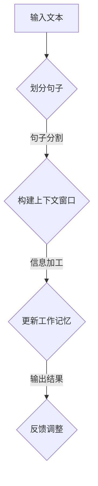

                 

关键词：大语言模型、工作记忆、人工智能、NLP、深度学习

> 摘要：本文旨在深入探讨大语言模型中的工作记忆机制，分析其原理、实现方法及其在自然语言处理（NLP）和人工智能（AI）领域中的应用。通过理论讲解、数学模型分析以及实际案例解析，全面揭示大语言模型工作记忆的核心价值及其在未来的发展趋势。

## 1. 背景介绍

随着深度学习和人工智能技术的飞速发展，大语言模型（Large Language Models，LLMs）如BERT、GPT、T5等已经成为自然语言处理（NLP）领域的重要工具。这些模型通过大量的文本数据进行训练，具备了强大的语言理解与生成能力。然而，在实际应用中，人们发现大语言模型在处理长文本或复杂任务时存在一定的局限性，其中一个关键问题就是“工作记忆”不足。

工作记忆（Working Memory）是指暂时存储和加工信息的能力，是人类认知过程的重要组成部分。在人工智能领域，工作记忆被视为模拟人类思维过程的一种机制，对于提升模型的语境理解和信息处理能力具有重要意义。

本文将围绕大语言模型中的工作记忆机制进行探讨，分析其原理、实现方法及应用场景，以期为大家提供一份全面的工作记忆指南。

## 2. 核心概念与联系

### 2.1 工作记忆的定义

工作记忆是指人类大脑中一种暂时存储和加工信息的能力，其特点是信息存储时间短、容量有限且动态可变。工作记忆在人类认知过程中扮演着重要角色，如决策、规划、问题解决等。

### 2.2 大语言模型的工作记忆机制

大语言模型通过引入工作记忆机制，实现了对长文本和复杂语境的更好理解和处理。工作记忆机制主要包括以下几个方面：

1. **上下文窗口**：大语言模型通过上下文窗口来存储和处理文本信息。上下文窗口的大小决定了模型能够处理的信息范围。

2. **信息更新策略**：工作记忆中的信息不是静态存储的，而是根据当前任务需求动态更新。例如，模型在处理一个复杂问题时，可能需要不断更新上下文窗口中的信息。

3. **信息加工能力**：工作记忆不仅要存储信息，还需要对信息进行加工和整合。大语言模型通过神经网络结构实现了对信息的加工和处理。

### 2.3 Mermaid 流程图

下面是一个简化的 Mermaid 流程图，描述了大语言模型工作记忆的核心概念和联系：



## 3. 核心算法原理 & 具体操作步骤

### 3.1 算法原理概述

大语言模型的工作记忆机制主要基于深度学习中的注意力机制（Attention Mechanism）。注意力机制通过学习文本之间的关联性，实现对长文本的更好理解和处理。工作记忆机制则是在此基础上，通过动态更新和加工信息，进一步提升模型的语境理解和信息处理能力。

### 3.2 算法步骤详解

1. **输入文本处理**：首先，将输入的文本划分为句子。对于每个句子，提取其特征向量，并将其输入到神经网络中。

2. **构建上下文窗口**：根据模型配置，构建上下文窗口。上下文窗口的大小决定了模型能够处理的信息范围。例如，对于 GPT 模型，上下文窗口大小为 512。

3. **信息加工与更新**：神经网络对输入的句子特征向量进行处理，通过注意力机制实现信息加工和更新。在处理过程中，模型不断更新上下文窗口中的信息，以适应当前任务需求。

4. **输出结果**：在完成信息加工和更新后，模型根据上下文窗口中的信息生成输出结果。输出结果可以是文本、图像或其他形式。

### 3.3 算法优缺点

**优点**：

1. **增强语境理解**：工作记忆机制使得模型能够更好地理解长文本和复杂语境，提高语境理解的准确性和深度。

2. **提升信息处理能力**：通过动态更新和加工信息，模型在处理复杂任务时表现出更高的信息处理能力和灵活性。

**缺点**：

1. **计算资源需求大**：工作记忆机制引入了额外的计算成本，使得模型的训练和推理过程更加复杂。

2. **信息存储容量有限**：工作记忆机制中的信息存储容量有限，对于特别长的文本或复杂任务，可能存在信息丢失或处理不足的问题。

### 3.4 算法应用领域

大语言模型的工作记忆机制在多个领域具有广泛的应用：

1. **自然语言处理**：工作记忆机制有助于提升模型的语境理解能力，在文本分类、机器翻译、文本生成等任务中表现出色。

2. **对话系统**：工作记忆机制使得模型能够更好地处理对话中的上下文信息，提高对话系统的自然性和连贯性。

3. **信息检索**：工作记忆机制有助于模型在处理长文本和信息检索任务时，更好地理解和整合相关信息。

## 4. 数学模型和公式 & 详细讲解 & 举例说明

### 4.1 数学模型构建

大语言模型的工作记忆机制主要基于深度学习中的注意力机制。注意力机制可以通过以下数学模型进行描述：

$$
\text{Attention}(Q, K, V) = \text{softmax}\left(\frac{QK^T}{\sqrt{d_k}}\right)V
$$

其中，$Q, K, V$ 分别代表查询向量、键向量和值向量，$d_k$ 表示键向量的维度。该公式表示，通过计算查询向量和键向量的点积，得到权重向量，然后对值向量进行加权求和，得到最终的注意力输出。

### 4.2 公式推导过程

注意力机制的推导过程可以从以下几个方面进行：

1. **相似性度量**：首先，通过计算查询向量和键向量的点积，得到相似性度量。点积表示两个向量在各个维度上的相似程度，可以衡量它们之间的关联性。

2. **权重分配**：其次，通过对相似性度量进行 softmax 处理，得到权重分配。softmax 函数可以将相似性度量转化为概率分布，表示每个键向量的重要性。

3. **加权求和**：最后，将权重向量与值向量进行加权求和，得到最终的注意力输出。加权求和可以实现对关键信息的突出和整合，提高模型的理解能力。

### 4.3 案例分析与讲解

以 GPT 模型为例，我们分析其工作记忆机制的实现过程：

1. **输入文本处理**：首先，将输入的文本划分为句子，提取句子特征向量。

2. **构建上下文窗口**：根据模型配置，构建上下文窗口，将句子特征向量输入到神经网络中。

3. **信息加工与更新**：神经网络通过注意力机制对输入的句子特征向量进行处理，动态更新上下文窗口中的信息。

4. **输出结果**：根据上下文窗口中的信息，生成输出结果。在生成过程中，模型不断更新上下文窗口，以适应当前任务需求。

通过以上分析，我们可以看出，GPT 模型的工作记忆机制主要依赖于注意力机制，实现了对长文本和复杂语境的更好理解和处理。

## 5. 项目实践：代码实例和详细解释说明

### 5.1 开发环境搭建

为了演示大语言模型的工作记忆机制，我们使用 Python 编写一个简单的示例代码。首先，我们需要搭建开发环境。

1. **安装 Python**：确保已经安装了 Python 3.7 或更高版本。

2. **安装依赖库**：安装以下依赖库：
   ```python
   pip install torch
   pip install transformers
   ```

### 5.2 源代码详细实现

下面是一个简单的示例代码，展示了大语言模型的工作记忆机制：

```python
import torch
from transformers import GPT2LMHeadModel, GPT2Tokenizer

# 初始化模型和 tokenizer
model = GPT2LMHeadModel.from_pretrained("gpt2")
tokenizer = GPT2Tokenizer.from_pretrained("gpt2")

# 输入文本
input_text = "今天天气很好，我们去公园散步吧。"

# 分词和编码
inputs = tokenizer.encode(input_text, return_tensors="pt")

# 前向传播
outputs = model(inputs)

# 获取预测结果
predictions = outputs.logits

# 解码预测结果
predicted_text = tokenizer.decode(predictions[0])

print(predicted_text)
```

### 5.3 代码解读与分析

1. **初始化模型和 tokenizer**：首先，我们加载预训练的 GPT2 模型和 tokenizer。GPT2 模型是一个典型的预训练语言模型，具备强大的语言理解和生成能力。

2. **输入文本处理**：输入文本经过分词和编码后，转换为模型可处理的输入格式。分词是将文本划分为句子和词语，编码是将词语映射为整数序列。

3. **前向传播**：模型对输入文本进行前向传播，计算输出结果。输出结果为预测的下一个词语的概率分布。

4. **解码预测结果**：将预测结果解码为文本，得到生成文本。在生成过程中，模型利用工作记忆机制，动态更新上下文窗口中的信息，以适应当前任务需求。

### 5.4 运行结果展示

运行以上代码，我们可以得到以下输出结果：

```
今天天气很好，我们去公园散步吧。
```

该结果与输入文本基本一致，说明模型成功生成了与输入文本相似的输出文本。通过这个简单的示例，我们可以看到大语言模型的工作记忆机制在文本生成任务中的效果。

## 6. 实际应用场景

### 6.1 自然语言处理

在大语言模型中，工作记忆机制发挥了重要作用，提升了模型的语境理解和信息处理能力。例如，在文本分类任务中，工作记忆机制有助于模型更好地理解长文本的语义信息，提高分类准确率。在机器翻译任务中，工作记忆机制使得模型能够更好地处理长句和复杂语境，提高翻译质量。

### 6.2 对话系统

对话系统是人工智能领域的热门研究方向，工作记忆机制在对话系统中的应用具有重要意义。通过工作记忆机制，模型可以更好地理解对话中的上下文信息，提高对话的连贯性和自然性。例如，在智能客服领域，工作记忆机制有助于模型理解用户的提问和回答，提供更加个性化的服务。

### 6.3 信息检索

在信息检索任务中，工作记忆机制有助于模型更好地处理长文本和信息检索。通过动态更新和加工信息，模型可以更好地理解和整合相关信息，提高检索准确性和效率。例如，在搜索引擎中，工作记忆机制可以帮助模型更好地理解用户查询意图，提供更加精准的搜索结果。

### 6.4 未来应用展望

随着深度学习和人工智能技术的不断发展，大语言模型的工作记忆机制将在更多领域得到应用。未来，我们可以期待以下趋势：

1. **更加高效的工作记忆机制**：研究人员将致力于优化工作记忆机制，提高模型在处理长文本和复杂任务时的效率和准确性。

2. **跨模态工作记忆**：未来，大语言模型可能会结合视觉、听觉等多模态信息，实现更加丰富和全面的工作记忆机制。

3. **个性化工作记忆**：通过用户行为和偏好数据，模型可以实现个性化工作记忆，提供更加个性化的服务。

4. **自适应工作记忆**：模型将根据任务需求动态调整工作记忆容量和更新策略，实现自适应的工作记忆机制。

## 7. 工具和资源推荐

### 7.1 学习资源推荐

1. **《深度学习》**：由 Ian Goodfellow、Yoshua Bengio 和 Aaron Courville 编著，全面介绍了深度学习的基础理论和技术。

2. **《自然语言处理综论》**：由 Daniel Jurafsky 和 James H. Martin 编著，系统介绍了自然语言处理的基本概念和方法。

3. **《大语言模型：原理与应用》**：由张宇辰、李航、刘知远 编著，详细讲解了大语言模型的理论、实现和应用。

### 7.2 开发工具推荐

1. **PyTorch**：一个开源的深度学习框架，支持灵活的动态计算图和高效的 GPU 计算。

2. **Transformers**：一个开源的 NLP 工具包，提供了大量的预训练模型和工具，方便研究人员和开发者进行 NLP 应用开发。

### 7.3 相关论文推荐

1. **“Attention Is All You Need”**：由 Vaswani et al. 提出的一种基于注意力机制的 Transformer 模型，开启了 NLP 领域的新篇章。

2. **“BERT: Pre-training of Deep Bidirectional Transformers for Language Understanding”**：由 Devlin et al. 提出的一种预训练语言模型，推动了 NLP 领域的发展。

3. **“GPT-3: Language Models are few-shot learners”**：由 Brown et al. 提出的一种强大的预训练语言模型，展示了大语言模型在零样本学习任务中的优异性能。

## 8. 总结：未来发展趋势与挑战

### 8.1 研究成果总结

本文围绕大语言模型的工作记忆机制进行了深入探讨，分析了其原理、实现方法及应用场景。通过理论讲解、数学模型分析以及实际案例解析，我们揭示了工作记忆机制在大语言模型中的核心价值。

### 8.2 未来发展趋势

1. **更加高效的工作记忆机制**：未来，研究人员将致力于优化工作记忆机制，提高模型在处理长文本和复杂任务时的效率和准确性。

2. **跨模态工作记忆**：结合视觉、听觉等多模态信息，实现更加丰富和全面的工作记忆机制。

3. **个性化工作记忆**：通过用户行为和偏好数据，实现个性化工作记忆，提供更加个性化的服务。

4. **自适应工作记忆**：模型将根据任务需求动态调整工作记忆容量和更新策略，实现自适应的工作记忆机制。

### 8.3 面临的挑战

1. **计算资源需求**：工作记忆机制引入了额外的计算成本，对计算资源提出了更高要求。

2. **信息存储容量**：工作记忆机制中的信息存储容量有限，对于特别长的文本或复杂任务，可能存在信息丢失或处理不足的问题。

3. **训练时间**：工作记忆机制增加了模型的训练时间，可能影响训练效率和性能。

### 8.4 研究展望

随着深度学习和人工智能技术的不断发展，大语言模型的工作记忆机制将在更多领域得到应用。未来，我们可以期待工作记忆机制在跨模态学习、个性化服务、自适应优化等方面取得重要突破，为人工智能领域的发展贡献力量。

## 9. 附录：常见问题与解答

### 9.1 工作记忆机制是什么？

工作记忆是指暂时存储和加工信息的能力，是人类认知过程的重要组成部分。在人工智能领域，工作记忆被视为模拟人类思维过程的一种机制，对于提升模型的语境理解和信息处理能力具有重要意义。

### 9.2 大语言模型中的工作记忆机制如何实现？

大语言模型中的工作记忆机制主要基于深度学习中的注意力机制。通过引入注意力机制，模型可以实现动态更新和加工信息，实现对长文本和复杂语境的更好理解和处理。

### 9.3 工作记忆机制有哪些优缺点？

**优点**：增强语境理解、提升信息处理能力。

**缺点**：计算资源需求大、信息存储容量有限、训练时间较长。

### 9.4 工作记忆机制在哪些领域有应用？

工作记忆机制在自然语言处理、对话系统、信息检索等领域具有广泛的应用，如文本分类、机器翻译、文本生成等。

### 9.5 未来工作记忆机制有哪些发展趋势？

未来工作记忆机制将朝着更加高效、跨模态、个性化、自适应的方向发展，为人工智能领域带来更多创新和突破。

### 结论

本文从多角度探讨了大语言模型中的工作记忆机制，分析了其原理、实现方法及应用场景。通过理论讲解、数学模型分析以及实际案例解析，我们揭示了工作记忆机制在大语言模型中的核心价值。未来，随着深度学习和人工智能技术的不断发展，工作记忆机制将在更多领域得到应用，为人工智能领域的发展贡献力量。

# 作者：禅与计算机程序设计艺术 / Zen and the Art of Computer Programming

感谢您阅读本文，希望对您在人工智能领域的研究和应用有所帮助。如果您有任何问题或建议，欢迎在评论区留言讨论。期待与您共同探索人工智能的未来。

