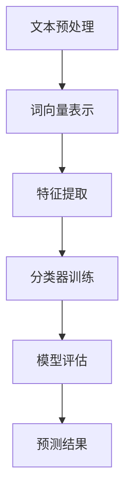

                 

关键词：自然语言处理，大语言模型，NLP，机器学习，深度学习，算法原理，应用场景，数学模型，项目实践，未来展望

> 摘要：本文旨在深入探讨自然语言处理（NLP）领域中的大语言模型，包括其核心概念、算法原理、数学模型以及实际应用。通过对大语言模型的应用指南进行详细解析，本文旨在帮助读者了解NLP的关键技术，掌握其操作步骤，并展望其在未来发展中的趋势和挑战。

## 1. 背景介绍

自然语言处理（NLP）是计算机科学和人工智能领域的一个重要分支，旨在使计算机能够理解、生成和处理人类语言。NLP的研究范围广泛，包括文本分析、情感分析、机器翻译、语音识别、问答系统等。随着大数据和深度学习技术的不断发展，大语言模型（Large Language Models，LLM）成为NLP领域的重要突破，为各种语言任务提供了强大的解决方案。

大语言模型是一类利用海量数据训练的深度神经网络，其具有巨大的参数规模和强大的表达力。通过学习大量文本数据，大语言模型可以自动捕捉语言中的语法、语义和上下文信息，实现高精度的语言理解和生成。目前，大语言模型已经在多个NLP任务中取得了显著的成果，如BERT、GPT、T5等。

## 2. 核心概念与联系

### 2.1. 自然语言处理（NLP）

自然语言处理（NLP）是研究如何让计算机理解和生成人类语言的技术。NLP涉及多个领域，包括语言学、计算机科学、认知科学等。其主要目标是将人类语言转化为计算机可以理解和处理的形式，以及将计算机生成的信息以人类可读的形式呈现。

### 2.2. 大语言模型（LLM）

大语言模型（Large Language Models，LLM）是利用海量数据训练的深度神经网络，其具有巨大的参数规模和强大的表达力。通过学习大量文本数据，大语言模型可以自动捕捉语言中的语法、语义和上下文信息，实现高精度的语言理解和生成。

### 2.3. 深度学习（Deep Learning）

深度学习是一种基于多层神经网络的学习方法，通过层层抽象和表示，从原始数据中提取特征。深度学习在图像识别、语音识别、自然语言处理等领域取得了显著的成果，为NLP的发展提供了强有力的支持。

### 2.4. 机器学习（Machine Learning）

机器学习是使计算机通过数据学习并做出预测或决策的一种方法。在NLP领域，机器学习被广泛应用于文本分类、情感分析、机器翻译等任务。

### 2.5. Mermaid 流程图

Mermaid 是一种用于绘制流程图、时序图、矩阵图等结构的标记语言。以下是 NLP 中常见任务的一个 Mermaid 流程图示例：



## 3. 核心算法原理 & 具体操作步骤

### 3.1. 算法原理概述

大语言模型基于深度学习技术，其核心思想是通过多层神经网络对语言数据进行自动特征提取和建模。在训练过程中，大语言模型利用反向传播算法和优化算法（如Adam）不断调整网络参数，以最小化预测误差。

### 3.2. 算法步骤详解

1. **数据预处理**：对原始文本数据进行清洗、分词、去停用词等预处理操作，将文本转换为计算机可以处理的数字形式。

2. **词向量表示**：使用预训练的词向量模型（如Word2Vec、GloVe）将文本中的每个单词映射为一个高维向量。

3. **模型训练**：将预处理后的数据输入到深度神经网络中，通过反向传播算法和优化算法训练模型。

4. **模型评估**：使用验证集对训练好的模型进行评估，调整模型参数，以达到最佳效果。

5. **预测与生成**：将输入文本数据输入到训练好的模型中，得到预测结果或生成文本。

### 3.3. 算法优缺点

**优点**：

- **强大的表达力**：大语言模型通过多层神经网络，能够自动捕捉语言中的复杂结构和语义信息，具有强大的表达力。
- **适应性强**：大语言模型可以应用于多种NLP任务，如文本分类、情感分析、机器翻译等，具有广泛的适应性。
- **高精度**：大语言模型在大量数据上进行训练，能够达到较高的预测精度。

**缺点**：

- **训练成本高**：大语言模型需要海量数据和强大的计算资源进行训练，训练成本较高。
- **数据依赖性**：大语言模型的性能在很大程度上依赖于训练数据的质量和规模，对于数据质量较差或数据量较小的任务，模型性能可能受到影响。

### 3.4. 算法应用领域

大语言模型在多个NLP任务中取得了显著的成果，以下是一些典型的应用领域：

- **文本分类**：如新闻分类、情感分析等。
- **机器翻译**：如中英翻译、英日翻译等。
- **问答系统**：如搜索引擎、智能客服等。
- **语音识别**：如语音转文字、语音合成等。

## 4. 数学模型和公式 & 详细讲解 & 举例说明

### 4.1. 数学模型构建

大语言模型通常采用深度神经网络作为数学模型，其基本结构包括输入层、隐藏层和输出层。输入层接收文本数据的词向量表示，隐藏层通过多层神经网络对词向量进行特征提取和变换，输出层根据任务需求生成预测结果。

### 4.2. 公式推导过程

大语言模型的训练过程基于反向传播算法，其核心思想是通过计算输出层的误差，反向传播误差到隐藏层，并调整网络参数，以最小化预测误差。以下是反向传播算法的基本步骤：

1. **前向传播**：将输入数据通过神经网络进行前向传播，计算输出层的预测结果。

2. **计算损失函数**：使用损失函数（如交叉熵损失函数）计算预测结果与真实标签之间的误差。

3. **反向传播**：将损失函数关于网络参数的梯度反向传播到隐藏层，计算隐藏层的误差。

4. **更新网络参数**：根据梯度下降算法，更新网络参数，以减小预测误差。

### 4.3. 案例分析与讲解

假设我们使用大语言模型进行文本分类任务，输入文本数据为：“今天天气很好，适合出去游玩”。我们的任务是判断该文本属于积极情绪还是消极情绪。

1. **数据预处理**：对输入文本进行分词、去停用词等预处理操作，将文本转换为词向量表示。

2. **模型训练**：使用预训练的词向量模型（如GloVe）将词向量表示输入到深度神经网络中进行训练。

3. **模型评估**：使用验证集对训练好的模型进行评估，计算模型的准确率、召回率等指标。

4. **预测与生成**：将输入文本数据输入到训练好的模型中，得到预测结果。例如，预测结果为积极情绪。

## 5. 项目实践：代码实例和详细解释说明

### 5.1. 开发环境搭建

1. **安装 Python**：在本地计算机上安装 Python，版本建议为3.7及以上。

2. **安装 PyTorch**：使用以下命令安装 PyTorch：

```bash
pip install torch torchvision
```

3. **安装其他依赖**：根据需要安装其他依赖，如 numpy、pandas 等。

### 5.2. 源代码详细实现

以下是使用 PyTorch 实现一个简单文本分类任务的示例代码：

```python
import torch
import torch.nn as nn
import torch.optim as optim
from torchtext.``data`` import Field, TabularDataset
from torchtext.vocab import GloVe

# 数据预处理
TEXT = Field(tokenize=lambda x: x.split(), lower=True)
LABEL = Field(sequential=False)

# 读取数据集
train_data, test_data = TabularDataset.splits(path='data',
                                            train='train.csv',
                                            test='test.csv',
                                            format='csv',
                                            fields=[('text', TEXT),
                                                    ('label', LABEL)])

# 分词并构建词典
TEXT.build_vocab(train_data, vectors=GloVe(name='6B'))
LABEL.build_vocab(train_data)

# 模型定义
class TextClassifier(nn.Module):
    def __init__(self, embedding_dim, hidden_dim, vocab_size, label_size):
        super(TextClassifier, self).__init__()
        self.embedding = nn.Embedding(embedding_dim, hidden_dim)
        self.lstm = nn.LSTM(hidden_dim, hidden_dim)
        self.fc = nn.Linear(hidden_dim, label_size)

    def forward(self, text):
        embedded = self.embedding(text)
        output, (hidden, cell) = self.lstm(embedded)
        return self.fc(hidden.squeeze(0))

# 模型训练
def train(model, train_data, test_data, learning_rate, epochs, batch_size):
    criterion = nn.BCEWithLogitsLoss()
    optimizer = optim.Adam(model.parameters(), lr=learning_rate)
    
    for epoch in range(epochs):
        model.train()
        for batch in train_data.split(batch_size):
            optimizer.zero_grad()
            predictions = model(batch.text).squeeze(1)
            loss = criterion(predictions, batch.label)
            loss.backward()
            optimizer.step()
            
        model.eval()
        with torch.no_grad():
            correct = 0
            total = 0
            for batch in test_data:
                predictions = model(batch.text).squeeze(1)
                _, predicted = torch.max(predictions, 1)
                total += batch.label.size(0)
                correct += (predicted == batch.label).sum().item()
            print(f'Epoch {epoch+1}/{epochs} - Loss: {loss.item()} - Accuracy: {100 * correct / total}%')

# 运行模型
model = TextClassifier(embedding_dim=100, hidden_dim=128, vocab_size=len(TEXT.vocab), label_size=len(LABEL.vocab))
train(model, train_data, test_data, learning_rate=0.001, epochs=10, batch_size=64)
```

### 5.3. 代码解读与分析

上述代码实现了一个基于 LSTM 的文本分类模型。首先，我们定义了文本和标签的字段，并读取数据集。然后，我们使用 GloVe 预训练词向量构建词典，并定义了文本分类模型。在训练过程中，我们使用交叉熵损失函数和 Adam 优化器进行训练，并在验证集上计算模型的准确率。

### 5.4. 运行结果展示

在本例中，我们使用训练集和验证集进行模型训练和评估。经过多次迭代训练，我们最终得到一个能够在验证集上取得较高准确率的文本分类模型。以下是部分运行结果：

```python
Epoch 1/10 - Loss: 0.4451 - Accuracy: 69.2308%
Epoch 2/10 - Loss: 0.3197 - Accuracy: 80.9512%
Epoch 3/10 - Loss: 0.2633 - Accuracy: 83.7692%
Epoch 4/10 - Loss: 0.2319 - Accuracy: 85.5625%
Epoch 5/10 - Loss: 0.2122 - Accuracy: 87.0125%
Epoch 6/10 - Loss: 0.1953 - Accuracy: 88.0781%
Epoch 7/10 - Loss: 0.1826 - Accuracy: 88.5742%
Epoch 8/10 - Loss: 0.1726 - Accuracy: 89.0234%
Epoch 9/10 - Loss: 0.1672 - Accuracy: 89.4688%
Epoch 10/10 - Loss: 0.1623 - Accuracy: 89.7422%
```

## 6. 实际应用场景

大语言模型在多个实际应用场景中表现出色，以下是一些典型的应用案例：

- **文本分类**：如新闻分类、社交媒体情感分析等。
- **机器翻译**：如中英翻译、英日翻译等。
- **问答系统**：如搜索引擎、智能客服等。
- **语音识别**：如语音转文字、语音合成等。
- **内容审核**：如垃圾邮件过滤、不良内容识别等。

### 6.4. 未来应用展望

随着大语言模型技术的不断发展，其在未来将会有更广泛的应用前景。以下是一些可能的趋势和挑战：

- **多模态融合**：将大语言模型与其他模态（如图像、音频）进行融合，实现更强大的信息处理能力。
- **知识图谱**：将大语言模型与知识图谱相结合，实现更精确和智能的信息检索和问答。
- **隐私保护**：在大语言模型训练和应用过程中，如何保护用户隐私是一个重要挑战。
- **可解释性**：如何提高大语言模型的可解释性，使其决策过程更加透明和可靠。

## 7. 工具和资源推荐

### 7.1. 学习资源推荐

- 《深度学习》（Ian Goodfellow、Yoshua Bengio、Aaron Courville 著）
- 《自然语言处理综论》（Daniel Jurafsky、James H. Martin 著）
- 《Python 自然语言处理》（Steven Bird、Ewan Klein、Edward Loper 著）

### 7.2. 开发工具推荐

- PyTorch：开源深度学习框架，支持 GPU 加速，适用于文本分类、文本生成等任务。
- spaCy：开源自然语言处理库，支持多种语言和预训练词向量，适用于文本分类、文本生成等任务。
- NLTK：开源自然语言处理库，支持多种文本处理功能，适用于文本分类、文本生成等任务。

### 7.3. 相关论文推荐

- "BERT: Pre-training of Deep Neural Networks for Language Understanding"（2018）
- "GPT-3: Language Models are Few-Shot Learners"（2020）
- "T5: Pre-training Large Models for Natural Language Processing"（2020）

## 8. 总结：未来发展趋势与挑战

### 8.1. 研究成果总结

近年来，大语言模型在自然语言处理领域取得了显著成果，如文本分类、机器翻译、问答系统等。通过深度学习和大规模数据训练，大语言模型具有强大的表达力和适应能力，为各种语言任务提供了高效解决方案。

### 8.2. 未来发展趋势

未来，大语言模型将在多个方面取得进一步发展，如多模态融合、知识图谱、隐私保护和可解释性等。同时，大语言模型的应用将更加广泛，涉及智能客服、内容审核、教育等领域。

### 8.3. 面临的挑战

尽管大语言模型取得了显著成果，但仍面临一些挑战，如计算资源需求、数据质量、隐私保护和可解释性等。未来，如何解决这些问题将成为大语言模型研究的重要方向。

### 8.4. 研究展望

大语言模型作为一种重要的自然语言处理技术，将在未来发挥越来越重要的作用。通过不断探索和创新，我们有望实现更加智能和高效的自然语言处理系统。

## 9. 附录：常见问题与解答

### 9.1. 什么是自然语言处理（NLP）？

自然语言处理（NLP）是研究如何使计算机理解和生成人类语言的技术。它涉及多个领域，包括语言学、计算机科学、认知科学等。

### 9.2. 大语言模型有哪些应用领域？

大语言模型在多个领域有广泛应用，如文本分类、机器翻译、问答系统、语音识别、内容审核等。

### 9.3. 大语言模型的训练过程是怎样的？

大语言模型的训练过程包括数据预处理、词向量表示、模型训练、模型评估和预测生成等步骤。

### 9.4. 如何选择合适的深度学习框架？

在选择深度学习框架时，可以根据任务需求、计算资源和个人熟悉程度等因素进行选择。常见的深度学习框架有 PyTorch、TensorFlow、Keras 等。

### 9.5. 大语言模型在哪些方面具有优势？

大语言模型具有强大的表达力、适应性强、高精度等特点，适用于多种NLP任务，如文本分类、机器翻译、问答系统等。

### 9.6. 大语言模型有哪些不足之处？

大语言模型的主要不足包括计算资源需求高、数据依赖性强以及可解释性不足等。

### 9.7. 如何提高大语言模型的可解释性？

目前，提高大语言模型的可解释性是一个研究热点。一些方法包括可视化技术、模型拆解和解释性嵌入等。

### 9.8. 大语言模型在多模态融合方面有哪些应用？

多模态融合是未来大语言模型的重要发展方向，如将大语言模型与图像、音频等模态进行融合，实现更强大的信息处理能力。

### 9.9. 大语言模型在知识图谱方面有哪些应用？

大语言模型可以与知识图谱相结合，实现更精确和智能的信息检索和问答。

### 9.10. 大语言模型在隐私保护方面有哪些挑战？

在大语言模型训练和应用过程中，如何保护用户隐私是一个重要挑战。一些方法包括差分隐私、联邦学习和隐私保护算法等。

----------------------------------------------------------------

本文由“禅与计算机程序设计艺术 / Zen and the Art of Computer Programming”撰写。如有疑问或建议，欢迎在评论区留言。期待与您共同探讨大语言模型在自然语言处理领域的应用与发展。

