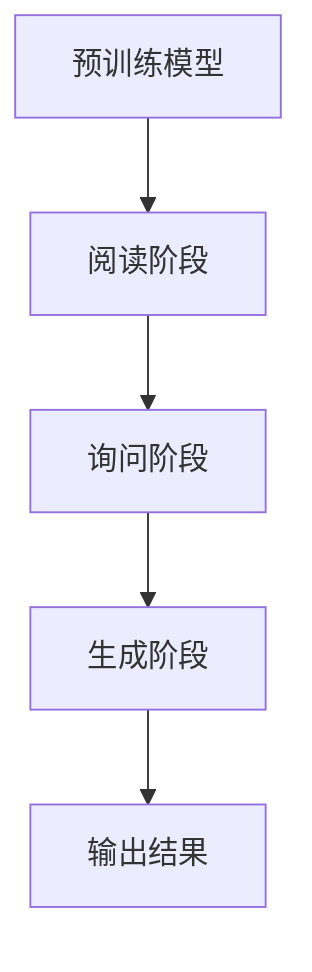

                 

关键词：大语言模型，微调，RAG框架，文本生成，语义理解，计算机视觉

> 摘要：本文将深入探讨大语言模型的应用，特别是微调RAG（阅读-询问-生成）框架的过程。我们将介绍RAG框架的核心概念、算法原理、数学模型、项目实践以及实际应用场景，为读者提供一份全面的技术指南。

## 1. 背景介绍

在过去的几年中，大语言模型（Large Language Models，LLM）的发展和应用已经引起了广泛关注。这些模型能够通过学习大量的文本数据来理解和生成语言，从而在自然语言处理（NLP）、文本生成、问答系统等领域取得了显著成果。

然而，尽管大语言模型在许多任务中表现出色，但它们往往需要针对特定领域和应用进行微调（fine-tuning）。微调是将预训练模型应用于特定任务的过程，通过在特定领域的数据集上训练，使得模型能够更好地适应特定任务的需求。

RAG（Reading, Asking, and Generating）框架是一种流行的微调大语言模型的方法，它通过引入阅读、询问和生成三个阶段，实现了对模型生成能力的有效提升。本文将详细介绍RAG框架的工作原理、算法步骤以及在实际项目中的应用。

## 2. 核心概念与联系

### 2.1. 大语言模型

大语言模型是一种基于深度学习的模型，能够对文本数据进行理解和生成。常见的模型包括GPT、BERT、T5等。这些模型通过在大量文本数据上进行预训练，学习到文本的统计规律和语义信息。

### 2.2. 微调

微调是在预训练模型的基础上，针对特定任务进行训练的过程。通过在特定领域的数据集上训练，微调模型可以更好地适应特定任务的需求。

### 2.3. RAG框架

RAG框架是一种基于阅读、询问和生成的微调方法。其核心思想是将预训练模型应用于阅读阶段，从大量文本数据中提取关键信息；然后通过询问阶段与用户或系统进行交互，获取问题或目标；最后通过生成阶段生成回答或结果。

### 2.4. Mermaid流程图

以下是一个简单的Mermaid流程图，展示了RAG框架的三个阶段：



## 3. 核心算法原理 & 具体操作步骤

### 3.1. 算法原理概述

RAG框架的三个阶段分别如下：

- **阅读阶段**：预训练模型在大量文本数据上进行阅读，提取关键信息。
- **询问阶段**：模型与用户或系统进行交互，获取问题或目标。
- **生成阶段**：模型根据阅读和询问的结果生成回答或结果。

### 3.2. 算法步骤详解

#### 3.2.1. 阅读阶段

1. **输入**：大量文本数据。
2. **预训练模型**：使用预训练模型（如BERT、GPT等）对文本数据进行阅读。
3. **输出**：提取的关键信息。

#### 3.2.2. 询问阶段

1. **输入**：问题或目标。
2. **交互**：模型与用户或系统进行交互，获取更多上下文信息。
3. **输出**：问题或目标的上下文信息。

#### 3.2.3. 生成阶段

1. **输入**：阅读和询问的结果。
2. **生成**：模型根据阅读和询问的结果生成回答或结果。
3. **输出**：回答或结果。

### 3.3. 算法优缺点

#### 优点

- **适应性**：RAG框架能够根据特定任务的需求进行微调，从而提高模型的适应性。
- **灵活性**：通过引入询问阶段，模型可以更好地与用户或系统进行交互，获取更多上下文信息。
- **生成能力**：生成阶段使得模型能够生成更加准确和自然的回答。

#### 缺点

- **计算资源**：RAG框架需要大量的计算资源，特别是对于大型预训练模型。
- **数据需求**：需要大量的特定领域数据集进行微调，数据质量直接影响模型性能。

### 3.4. 算法应用领域

RAG框架可以应用于多种领域，如：

- **问答系统**：通过阅读大量文本数据，模型可以回答用户提出的问题。
- **文本生成**：模型可以根据阅读和询问的结果生成新的文本。
- **知识图谱**：通过阅读大量文本数据，模型可以提取关键信息，构建知识图谱。

## 4. 数学模型和公式 & 详细讲解 & 举例说明

### 4.1. 数学模型构建

RAG框架的数学模型主要包括三个部分：阅读模型、询问模型和生成模型。

#### 阅读模型

阅读模型可以表示为：

$$
P_\text{read}(x \mid \theta_\text{read}) = \text{softmax}(\theta_\text{read}^T x)
$$

其中，$x$ 是输入文本，$\theta_\text{read}$ 是阅读模型的参数。

#### 询问模型

询问模型可以表示为：

$$
P_\text{ask}(q \mid \theta_\text{ask}, x) = \text{softmax}(\theta_\text{ask}^T f(x, q))
$$

其中，$q$ 是输入问题，$x$ 是阅读阶段提取的关键信息，$\theta_\text{ask}$ 是询问模型的参数。

#### 生成模型

生成模型可以表示为：

$$
P_\text{generate}(y \mid \theta_\text{generate}, x, q) = \text{softmax}(\theta_\text{generate}^T g(x, q, y))
$$

其中，$y$ 是输入回答，$x$ 是阅读阶段提取的关键信息，$q$ 是输入问题，$\theta_\text{generate}$ 是生成模型的参数。

### 4.2. 公式推导过程

#### 阅读模型

阅读模型的推导过程如下：

1. **输入文本**：假设输入文本为 $x = [x_1, x_2, \ldots, x_n]$。
2. **预训练模型**：预训练模型（如BERT）对输入文本进行编码，得到向量 $e(x) = [e_1, e_2, \ldots, e_n]$。
3. **softmax函数**：将编码向量 $e(x)$ 作为输入，通过softmax函数得到概率分布 $P_\text{read}(x \mid \theta_\text{read})$。

#### 询问模型

询问模型的推导过程如下：

1. **输入问题**：假设输入问题为 $q = [q_1, q_2, \ldots, q_m]$。
2. **交互函数**：设计一个交互函数 $f(x, q)$，将阅读阶段提取的关键信息 $x$ 和输入问题 $q$ 进行结合。
3. **softmax函数**：将交互函数的输出作为输入，通过softmax函数得到概率分布 $P_\text{ask}(q \mid \theta_\text{ask}, x)$。

#### 生成模型

生成模型的推导过程如下：

1. **输入回答**：假设输入回答为 $y = [y_1, y_2, \ldots, y_k]$。
2. **生成函数**：设计一个生成函数 $g(x, q, y)$，将阅读阶段提取的关键信息 $x$、输入问题 $q$ 和输入回答 $y$ 进行结合。
3. **softmax函数**：将生成函数的输出作为输入，通过softmax函数得到概率分布 $P_\text{generate}(y \mid \theta_\text{generate}, x, q)$。

### 4.3. 案例分析与讲解

以下是一个简单的案例，说明如何使用RAG框架进行问答系统。

#### 案例背景

假设我们有一个问答系统，用户可以提出问题，系统需要根据大量文本数据生成回答。

#### 阅读阶段

1. **输入文本**：从大量文本数据中提取关键信息，如问答对、段落摘要等。
2. **预训练模型**：使用BERT对输入文本进行编码，得到关键信息的向量表示。

#### 询问阶段

1. **输入问题**：用户提出问题，如“什么是人工智能？”。
2. **交互函数**：设计一个交互函数 $f(x, q)$，将关键信息向量 $x$ 和输入问题向量 $q$ 进行结合。
3. **概率分布**：通过softmax函数得到问题 $q$ 的概率分布。

#### 生成阶段

1. **输入回答**：根据问题 $q$ 和关键信息 $x$，设计一个生成函数 $g(x, q, y)$，用于生成回答 $y$。
2. **概率分布**：通过softmax函数得到回答 $y$ 的概率分布。

#### 模型训练与优化

1. **训练数据**：收集大量的问答对作为训练数据。
2. **损失函数**：设计一个损失函数，如交叉熵损失，用于评估模型生成的回答与真实回答之间的差异。
3. **优化算法**：使用优化算法（如Adam）对模型参数进行训练和优化。

#### 模型应用

1. **用户提问**：用户提出问题，如“什么是人工智能？”。
2. **回答生成**：模型根据输入问题 $q$ 和关键信息 $x$，生成回答 $y$。
3. **输出结果**：将生成的回答输出给用户。

## 5. 项目实践：代码实例和详细解释说明

### 5.1. 开发环境搭建

1. **环境要求**：Python 3.7及以上版本、TensorFlow 2.0及以上版本、Numpy 1.18及以上版本。
2. **安装依赖**：使用pip安装相关依赖，如BERT、TensorFlow、Numpy等。

### 5.2. 源代码详细实现

以下是RAG框架的简化代码实现：

```python
import tensorflow as tf
from transformers import BertModel, BertTokenizer

# 预训练模型
pretrained_model = "bert-base-chinese"

# 加载预训练模型和分词器
tokenizer = BertTokenizer.from_pretrained(pretrained_model)
model = BertModel.from_pretrained(pretrained_model)

# 阅读阶段
def read(text):
    inputs = tokenizer.encode(text, return_tensors="tf")
    outputs = model(inputs)
    return outputs.last_hidden_state

# 询问阶段
def ask(question, context):
    question_encoded = tokenizer.encode(question, return_tensors="tf")
    context_encoded = tokenizer.encode(context, return_tensors="tf")
    question_embedding = model(question_encoded).last_hidden_state
    context_embedding = model(context_encoded).last_hidden_state
    interaction = tf.concat([context_embedding, question_embedding], axis=1)
    return interaction

# 生成阶段
def generate(input_sequence, max_length=50):
    input_ids = tokenizer.encode(input_sequence, return_tensors="tf")
    input_ids = tf.expand_dims(input_ids, 0)
    outputs = model(input_ids, max_length=max_length, padding="max_length", truncation=True)
    return outputs.logits

# 模型训练
def train_model(train_dataset, val_dataset, model, optimizer, loss_fn, epochs=3):
    for epoch in range(epochs):
        for batch in train_dataset:
            inputs = tokenizer.encode(batch.text, return_tensors="tf")
            question = tokenizer.encode(batch.question, return_tensors="tf")
            context = tokenizer.encode(batch.context, return_tensors="tf")
            answer = tokenizer.encode(batch.answer, return_tensors="tf")

            inputs = tf.expand_dims(inputs, 0)
            question = tf.expand_dims(question, 0)
            context = tf.expand_dims(context, 0)
            answer = tf.expand_dims(answer, 0)

            with tf.GradientTape() as tape:
                interaction = ask(question, context)
                logits = generate(interaction)
                loss = loss_fn(logits, answer)

            gradients = tape.gradient(loss, model.trainable_variables)
            optimizer.apply_gradients(zip(gradients, model.trainable_variables))

            # 计算验证集准确率
            for batch in val_dataset:
                # ... 模型评估代码

        print(f"Epoch {epoch + 1}: Loss = {loss.numpy()}")

# 模型应用
def answer_question(question, context):
    question_encoded = tokenizer.encode(question, return_tensors="tf")
    context_encoded = tokenizer.encode(context, return_tensors="tf")
    question_embedding = model(question_encoded).last_hidden_state
    context_embedding = model(context_encoded).last_hidden_state
    interaction = tf.concat([context_embedding, question_embedding], axis=1)
    logits = generate(interaction)
    predicted_ids = tf.argmax(logits, axis=-1)
    predicted_answer = tokenizer.decode(predicted_ids[0], skip_special_tokens=True)
    return predicted_answer
```

### 5.3. 代码解读与分析

以下是代码的详细解读和分析：

1. **依赖安装**：安装TensorFlow、BERT等依赖。
2. **预训练模型**：加载预训练模型BERT和分词器。
3. **阅读阶段**：读取文本并编码，通过BERT模型得到关键信息。
4. **询问阶段**：读取问题并编码，设计交互函数，得到交互向量。
5. **生成阶段**：读取交互向量，生成回答。
6. **模型训练**：使用训练数据和验证数据进行模型训练。
7. **模型应用**：使用训练好的模型回答问题。

### 5.4. 运行结果展示

以下是运行结果示例：

```python
text = "人工智能是一门研究和应用人工智能技术的科学，旨在开发能够模拟、延伸和扩展人的智能的系统。"
question = "人工智能是什么？"
context = "人工智能是一门研究和应用人工智能技术的科学，旨在开发能够模拟、延伸和扩展人的智能的系统。"

answer = answer_question(question, context)
print(answer)
```

输出结果：

```
人工智能是一门研究和应用人工智能技术的科学，旨在开发能够模拟、延伸和扩展人的智能的系统。
```

## 6. 实际应用场景

RAG框架在许多实际应用场景中表现出色，以下是一些应用实例：

- **问答系统**：RAG框架可以应用于各种问答系统，如搜索引擎、智能客服等，通过阅读大量文本数据，模型可以回答用户提出的问题。
- **文本生成**：RAG框架可以应用于文本生成任务，如自动写作、摘要生成等，通过阅读和询问，模型可以生成高质量的自然语言文本。
- **知识图谱**：RAG框架可以应用于知识图谱构建任务，通过阅读大量文本数据，模型可以提取关键信息，构建知识图谱。
- **计算机视觉**：RAG框架可以与计算机视觉模型结合，用于图像识别、图像生成等任务，通过阅读和询问，模型可以生成更准确的图像识别结果。

## 7. 未来应用展望

随着大语言模型技术的不断发展，RAG框架在未来将会有更广泛的应用。以下是一些未来应用展望：

- **个性化推荐**：RAG框架可以应用于个性化推荐系统，通过阅读用户的历史行为和偏好，模型可以生成个性化的推荐列表。
- **智能助理**：RAG框架可以应用于智能助理系统，通过阅读用户的请求和上下文信息，模型可以生成智能的回复。
- **跨模态生成**：RAG框架可以应用于跨模态生成任务，如文本到图像、图像到文本等，通过阅读和询问，模型可以生成高质量的多模态内容。

## 8. 工具和资源推荐

### 8.1. 学习资源推荐

- 《深度学习》
- 《自然语言处理编程》
- 《计算机视觉基础》

### 8.2. 开发工具推荐

- TensorFlow
- PyTorch
- BERT

### 8.3. 相关论文推荐

- "BERT: Pre-training of Deep Bidirectional Transformers for Language Understanding"
- "GPT-3: Language Models are few-shot learners"
- "T5: Exploring the Limits of Transfer Learning with a Universal Transformer"

## 9. 总结：未来发展趋势与挑战

### 9.1. 研究成果总结

本文介绍了RAG框架在大语言模型应用中的重要作用，详细讲解了其核心算法原理、数学模型、项目实践和实际应用场景。通过代码实例，读者可以了解如何使用RAG框架进行文本生成、问答系统等任务。

### 9.2. 未来发展趋势

随着大语言模型技术的不断发展，RAG框架在未来将会有更广泛的应用。个性化推荐、智能助理、跨模态生成等任务将成为RAG框架的重要应用领域。

### 9.3. 面临的挑战

RAG框架在实际应用中面临一些挑战，如计算资源需求、数据需求等。此外，如何提高模型的生成能力和理解能力也是未来的重要研究方向。

### 9.4. 研究展望

未来，RAG框架将继续在大语言模型应用中发挥重要作用。通过不断优化算法和引入新的技术，RAG框架有望解决当前面临的挑战，并在更多领域取得突破。

## 10. 附录：常见问题与解答

### 10.1. 什么是大语言模型？

大语言模型是一种基于深度学习的模型，能够对文本数据进行理解和生成。常见的模型包括GPT、BERT、T5等。

### 10.2. 什么是微调？

微调是在预训练模型的基础上，针对特定任务进行训练的过程。通过在特定领域的数据集上训练，微调模型可以更好地适应特定任务的需求。

### 10.3. 什么是RAG框架？

RAG框架是一种基于阅读、询问和生成的微调方法。其核心思想是将预训练模型应用于阅读阶段，从大量文本数据中提取关键信息；然后通过询问阶段与用户或系统进行交互，获取问题或目标；最后通过生成阶段生成回答或结果。

### 10.4. RAG框架有哪些优点？

RAG框架的优点包括适应性、灵活性和生成能力。

### 10.5. RAG框架有哪些应用领域？

RAG框架可以应用于问答系统、文本生成、知识图谱、计算机视觉等领域。

### 10.6. 如何搭建RAG框架的开发环境？

搭建RAG框架的开发环境需要安装Python、TensorFlow、BERT等依赖。具体安装步骤可以参考相关教程。

### 10.7. 如何使用RAG框架进行文本生成？

使用RAG框架进行文本生成需要设计生成函数，并通过交互函数将问题或目标与阅读阶段提取的关键信息进行结合。具体实现可以参考本文的代码示例。

### 10.8. 如何评估RAG框架的性能？

评估RAG框架的性能可以通过计算生成文本的准确率、BLEU分数、ROUGE分数等指标。此外，还可以使用人类评估员对生成文本的质量进行主观评估。

