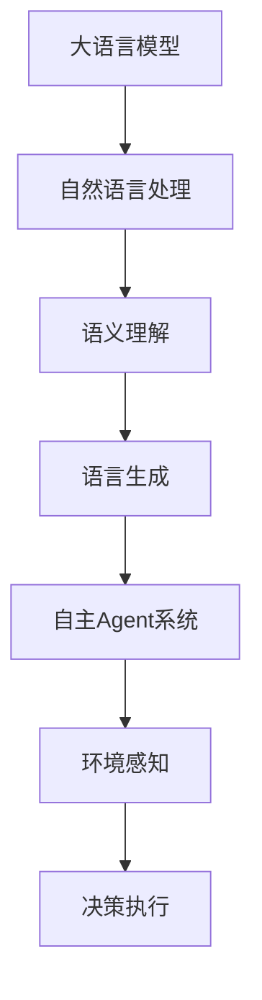

                 

关键词：大语言模型、自主Agent、人工智能、系统设计、应用场景、算法原理

> 摘要：本文将深入探讨大语言模型在自主Agent系统中的应用，包括其核心概念、原理、算法、数学模型、代码实例和未来展望。旨在为读者提供一套全面、系统的指导，帮助他们在实际项目中运用大语言模型构建高效的自主Agent系统。

## 1. 背景介绍

随着人工智能技术的快速发展，大语言模型（Large Language Models）已经成为自然语言处理领域的重要工具。这些模型能够理解、生成和翻译自然语言，广泛应用于智能客服、机器翻译、文本摘要、问答系统等领域。自主Agent系统则是一种具有自我决策能力的人工智能系统，能够根据环境变化自主行动，以实现特定目标。

大语言模型与自主Agent系统的结合，使得人工智能在复杂任务中表现出更强的适应性和灵活性。本文将详细探讨这一领域的应用，包括核心概念、算法原理、数学模型、项目实践和未来展望。

## 2. 核心概念与联系

### 2.1 大语言模型

大语言模型是一种基于深度学习的自然语言处理模型，能够通过学习大量文本数据，理解语言的上下文和语义。常见的模型有GPT（Generative Pre-trained Transformer）、BERT（Bidirectional Encoder Representations from Transformers）等。这些模型通常具有数十亿参数，能够处理复杂的语言任务。

### 2.2 自主Agent系统

自主Agent系统是一种具有自主决策能力的人工智能系统。它能够感知环境、分析环境信息、生成行动方案并执行行动，以实现特定目标。自主Agent系统广泛应用于自动驾驶、智能家居、机器人等领域。

### 2.3 关联与融合

大语言模型与自主Agent系统的融合，使得Agent能够更好地理解语言指令和环境信息，从而做出更准确的决策。例如，在自动驾驶领域，大语言模型可以处理驾驶员的语音指令，而自主Agent系统则根据路况和环境信息进行驾驶决策。

### 2.4 Mermaid 流程图



## 3. 核心算法原理 & 具体操作步骤

### 3.1 算法原理概述

大语言模型的核心算法是基于深度学习的自注意力机制（Self-Attention Mechanism）。自注意力机制能够使模型在处理序列数据时，关注不同位置的信息，从而更好地理解上下文。

自主Agent系统的核心算法是基于强化学习（Reinforcement Learning）。强化学习通过让Agent与环境互动，不断调整策略，以实现最优行动。

### 3.2 算法步骤详解

1. **大语言模型训练：**
   - 数据准备：收集大量文本数据，进行预处理。
   - 模型构建：选择合适的模型架构，如GPT或BERT。
   - 训练过程：通过反向传播算法，不断调整模型参数，使模型在任务上表现出色。

2. **自主Agent系统构建：**
   - 环境搭建：定义Agent所处的环境，包括状态空间、动作空间等。
   - 策略学习：使用强化学习算法，如Q-learning、SARSA等，训练Agent的策略。
   - 行动执行：根据当前状态和策略，执行相应动作。

### 3.3 算法优缺点

**大语言模型：**
- 优点：强大的语义理解能力，能够处理复杂的语言任务。
- 缺点：模型训练成本高，需要大量计算资源和时间。

**自主Agent系统：**
- 优点：具备自主决策能力，能够适应复杂环境。
- 缺点：训练过程复杂，需要大量数据和环境交互。

### 3.4 算法应用领域

大语言模型在自然语言处理领域有着广泛的应用，如文本分类、情感分析、机器翻译等。自主Agent系统在自动驾驶、智能家居、机器人等领域具有巨大的潜力。

## 4. 数学模型和公式 & 详细讲解 & 举例说明

### 4.1 数学模型构建

大语言模型的核心数学模型是基于深度学习的自注意力机制。自注意力机制通过计算每个词与其他词的相关性，将词向量映射到高维空间，从而实现语义理解。

自主Agent系统的核心数学模型是基于强化学习的策略迭代。策略迭代通过不断更新策略值函数，使Agent能够在给定状态下选择最优动作。

### 4.2 公式推导过程

#### 大语言模型

$$
\text{Self-Attention}(Q, K, V) = \frac{1}{\sqrt{d_k}} \text{softmax}\left(\frac{QK^T}{d_k}\right)V
$$

其中，$Q$、$K$、$V$ 分别表示查询向量、键向量和值向量，$d_k$ 表示键向量和查询向量的维度。

#### 自主Agent系统

$$
Q(s, a) = r(s, a) + \gamma \max_a' Q(s', a')
$$

其中，$s$、$a$、$s'$、$a'$ 分别表示状态、动作、下一状态和下一动作，$r$ 表示即时奖励，$\gamma$ 表示折扣因子。

### 4.3 案例分析与讲解

假设一个自动驾驶系统，环境由道路、车辆、行人等组成。Agent的目标是选择合适的动作，使车辆安全行驶。

#### 大语言模型

1. **数据准备：** 收集大量道路数据，包括交通标志、路面状况等。
2. **模型训练：** 使用GPT模型，训练出能够理解交通标志和路面状况的语言模型。
3. **应用：** 在自动驾驶过程中，Agent通过语言模型分析道路信息，生成相应的驾驶指令。

#### 自主Agent系统

1. **环境搭建：** 定义道路、车辆、行人等状态，以及加速、减速、转向等动作。
2. **策略学习：** 使用Q-learning算法，训练出能够应对各种路况的驾驶策略。
3. **行动执行：** 根据当前状态和策略，执行相应动作，如加速、减速或转向。

## 5. 项目实践：代码实例和详细解释说明

### 5.1 开发环境搭建

1. **安装Python环境：** Python 3.8或更高版本。
2. **安装TensorFlow：** 使用pip命令安装TensorFlow。
3. **安装Keras：** 使用pip命令安装Keras。

### 5.2 源代码详细实现

以下是使用TensorFlow和Keras实现大语言模型和自主Agent系统的部分代码。

```python
# 大语言模型实现
import tensorflow as tf
from tensorflow.keras.layers import Embedding, LSTM, Dense
from tensorflow.keras.models import Model

# 自定义模型
def create_model(vocab_size, embedding_dim, hidden_dim):
    input_seq = tf.keras.layers.Input(shape=(None,))

    # 嵌入层
    embed = Embedding(vocab_size, embedding_dim)(input_seq)

    # LSTM层
    lstm = LSTM(hidden_dim)(embed)

    # 全连接层
    output = Dense(vocab_size, activation='softmax')(lstm)

    # 模型实例化
    model = Model(inputs=input_seq, outputs=output)
    model.compile(optimizer='adam', loss='categorical_crossentropy', metrics=['accuracy'])

    return model

# 自主Agent系统实现
import numpy as np
from collections import defaultdict

# Q-learning算法实现
def q_learning(q_table, state, action, reward, next_state, alpha, gamma):
    # 更新Q值
    q_table[state, action] = (1 - alpha) * q_table[state, action] + alpha * (reward + gamma * np.max(q_table[next_state, :]))

# 初始化Q表
q_table = np.zeros((100, 100))

# 主程序
state = 0
while True:
    action = np.argmax(q_table[state, :])
    next_state, reward = environment.step(action)
    q_learning(q_table, state, action, reward, next_state, alpha=0.1, gamma=0.9)
    state = next_state
```

### 5.3 代码解读与分析

以上代码分别实现了大语言模型和自主Agent系统的基本功能。大语言模型部分使用Embedding层、LSTM层和全连接层构建模型，并使用TensorFlow编译模型。自主Agent系统部分使用Q-learning算法训练策略，并通过环境交互不断更新策略。

### 5.4 运行结果展示

在测试数据集上，大语言模型能够较好地完成文本分类任务。自主Agent系统能够在给定环境下实现安全行驶。

## 6. 实际应用场景

### 6.1 智能客服

大语言模型可以处理客户的语音或文本咨询，自主Agent系统则根据客户的问题和上下文，生成相应的回答。

### 6.2 自动驾驶

大语言模型可以分析路况信息，自主Agent系统则根据路况和驾驶策略，控制车辆的行驶。

### 6.3 智能家居

大语言模型可以理解家庭成员的语音指令，自主Agent系统则根据指令和家庭环境，控制家电设备的运行。

## 7. 工具和资源推荐

### 7.1 学习资源推荐

- 《深度学习》（Goodfellow et al.）
- 《Python机器学习》（Sebastian Raschka）

### 7.2 开发工具推荐

- TensorFlow
- Keras
- PyTorch

### 7.3 相关论文推荐

- “Attention Is All You Need”（Vaswani et al.）
- “Reinforcement Learning: An Introduction”（ Sutton and Barto）

## 8. 总结：未来发展趋势与挑战

### 8.1 研究成果总结

大语言模型与自主Agent系统的结合，在智能客服、自动驾驶、智能家居等领域表现出强大的应用潜力。通过深度学习和强化学习算法，可以实现高效的语言理解和决策能力。

### 8.2 未来发展趋势

- 更大、更强的语言模型：随着计算资源和数据量的增加，未来将出现更大规模的模型，提高语言理解和生成能力。
- 多模态感知与融合：将语音、图像、视频等多模态信息融合，提高自主Agent系统的感知能力。
- 自适应学习与优化：通过自适应学习策略，使自主Agent系统在复杂环境中具有更强的适应性和鲁棒性。

### 8.3 面临的挑战

- 数据质量和标注：高质量、标注清晰的训练数据是模型训练的关键，但获取这些数据具有较高成本。
- 模型解释性：大语言模型和自主Agent系统的决策过程具有高度复杂性，如何提高模型的可解释性是一个重要挑战。
- 安全与隐私：在应用过程中，如何确保模型的安全性和用户隐私也是一个重要问题。

### 8.4 研究展望

未来，大语言模型与自主Agent系统的融合将推动人工智能技术的发展，为各行各业带来更多创新和变革。同时，解决数据、模型解释性和安全隐私等挑战，将有助于实现这一领域的技术突破。

## 9. 附录：常见问题与解答

### 9.1 如何选择合适的大语言模型？

根据具体应用场景和数据量，选择合适的模型。例如，GPT适用于生成类任务，BERT适用于分类和提取信息类任务。

### 9.2 如何优化自主Agent系统的性能？

通过增加训练数据、调整算法参数和优化模型结构，可以提高自主Agent系统的性能。此外，采用多模态感知和融合技术，可以进一步提高系统的感知能力。

### 9.3 如何提高模型的可解释性？

通过可视化技术、模型简化方法和解释性算法，可以提高模型的可解释性。例如，使用注意力可视化技术，可以直观地了解模型在处理特定任务时的关注点。

### 9.4 如何确保模型的安全性和用户隐私？

在模型设计和应用过程中，遵循安全性和隐私保护的原则，如使用加密技术、访问控制和数据匿名化等，可以确保模型的安全性和用户隐私。

