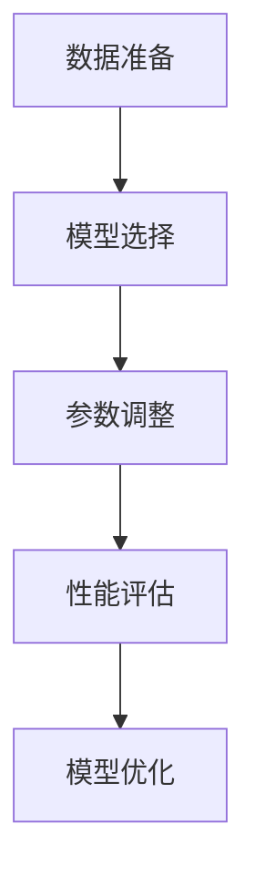

                 

关键词：大语言模型、高效微调、应用指南、技术语言、深度学习、自然语言处理

> 摘要：本文旨在为IT领域从业者提供一份关于大语言模型高效微调的全面指南。本文将介绍大语言模型的基本概念，微调的核心原理和步骤，以及在实际项目中的应用实例，帮助读者更好地理解和掌握大语言模型的使用。

## 1. 背景介绍

大语言模型是近年来自然语言处理领域的一个重要突破，它能够自动地从大量文本数据中学习语言规律，实现对自然语言的生成、理解和翻译。大语言模型的兴起，极大地推动了自然语言处理技术的发展，使得计算机能够更智能地处理和理解人类语言。

然而，大语言模型的应用场景非常广泛，不同的任务和领域需要的大语言模型也有所不同。因此，如何对大语言模型进行微调，使其适应特定任务和领域，成为了一个重要的问题。本文将重点介绍大语言模型高效微调的方法和技巧。

## 2. 核心概念与联系

### 2.1 大语言模型的基本概念

大语言模型是指通过深度学习算法，从大量文本数据中学习语言规律，生成语言模型的技术。大语言模型的核心是神经网络，通过多层神经网络的结构，对文本数据进行特征提取和融合，从而生成语言模型。

### 2.2 微调的核心原理和步骤

微调是指在大语言模型的基础上，针对特定任务和领域，通过调整模型的参数，使其适应特定任务和领域的过程。微调的核心步骤包括数据准备、模型选择、参数调整和性能评估。

### 2.3 Mermaid 流程图

以下是微调过程的 Mermaid 流程图：



## 3. 核心算法原理 & 具体操作步骤

### 3.1 算法原理概述

大语言模型的微调过程主要依赖于深度学习算法，通过对模型参数的调整，使其更好地适应特定任务和领域。深度学习算法的核心是神经网络，神经网络通过多层结构对输入数据进行特征提取和融合。

### 3.2 算法步骤详解

#### 3.2.1 数据准备

数据准备是微调过程的第一步，主要包括数据清洗、数据预处理和数据集划分。数据清洗是为了去除数据中的噪声和错误，数据预处理是为了将数据转换为适合模型训练的格式，数据集划分是为了训练集和测试集。

#### 3.2.2 模型选择

模型选择是根据具体任务和领域，选择适合的大语言模型。目前常用的模型包括GPT、BERT、Transformer等。

#### 3.2.3 参数调整

参数调整是微调过程的核心，通过调整模型的参数，使其更好地适应特定任务和领域。参数调整的方法包括反向传播算法、优化算法等。

#### 3.2.4 性能评估

性能评估是微调过程的最后一步，通过评估模型的性能，判断微调是否成功。性能评估的方法包括准确率、召回率、F1值等。

### 3.3 算法优缺点

#### 优点

- 可以快速适应特定任务和领域。
- 可以提高模型的性能和准确性。

#### 缺点

- 数据依赖性较强，需要大量高质量的训练数据。
- 微调过程复杂，需要较高的技术门槛。

### 3.4 算法应用领域

大语言模型的微调技术可以应用于多个领域，包括自然语言处理、文本生成、机器翻译、情感分析等。

## 4. 数学模型和公式 & 详细讲解 & 举例说明

### 4.1 数学模型构建

大语言模型的微调过程主要依赖于深度学习算法，其数学模型可以表示为：

$$
y = \sigma(W_1 \cdot x + b_1)
$$

其中，$y$ 是模型的预测输出，$x$ 是输入数据，$W_1$ 是权重矩阵，$b_1$ 是偏置。

### 4.2 公式推导过程

大语言模型的微调过程涉及到多个数学公式，下面简要介绍其推导过程：

#### 4.2.1 损失函数

损失函数是用来衡量模型预测结果与真实结果之间的差距，常用的损失函数包括均方误差（MSE）和交叉熵损失（CE）。

均方误差（MSE）的公式为：

$$
MSE = \frac{1}{n}\sum_{i=1}^{n}(y_i - \hat{y}_i)^2
$$

其中，$y_i$ 是真实结果，$\hat{y}_i$ 是模型预测结果。

交叉熵损失（CE）的公式为：

$$
CE = -\frac{1}{n}\sum_{i=1}^{n}y_i \cdot \log(\hat{y}_i)
$$

其中，$y_i$ 是真实结果，$\hat{y}_i$ 是模型预测结果。

#### 4.2.2 优化算法

优化算法是用来更新模型参数，使其更好地适应训练数据的。常用的优化算法包括梯度下降（GD）和随机梯度下降（SGD）。

梯度下降（GD）的公式为：

$$
W = W - \alpha \cdot \nabla_W L
$$

其中，$W$ 是模型参数，$\alpha$ 是学习率，$L$ 是损失函数。

随机梯度下降（SGD）的公式为：

$$
W = W - \alpha \cdot \nabla_W L
$$

其中，$W$ 是模型参数，$\alpha$ 是学习率，$L$ 是损失函数。

### 4.3 案例分析与讲解

#### 4.3.1 案例背景

假设我们有一个文本分类任务，需要将文本数据分类为两类。我们选择使用BERT模型进行微调。

#### 4.3.2 案例实现

1. 数据准备：收集文本数据，并对其进行预处理，包括分词、去噪等。

2. 模型选择：选择BERT模型。

3. 参数调整：调整BERT模型的参数，使其适应文本分类任务。

4. 性能评估：使用准确率、召回率、F1值等指标评估模型的性能。

5. 模型优化：根据性能评估结果，对模型进行优化，提高模型性能。

## 5. 项目实践：代码实例和详细解释说明

### 5.1 开发环境搭建

为了实现大语言模型的微调，我们需要搭建一个适合的开发环境。以下是搭建开发环境的步骤：

1. 安装Python环境。

2. 安装深度学习框架，如TensorFlow或PyTorch。

3. 安装其他必要的依赖库，如Numpy、Pandas等。

### 5.2 源代码详细实现

以下是实现大语言模型微调的Python代码：

```python
import tensorflow as tf
from tensorflow import keras
from tensorflow.keras import layers

# 数据准备
# ...

# 模型选择
model = keras.Sequential([
    layers.Embedding(input_dim=vocab_size, output_dim=embedding_dim),
    layers.Bidirectional(layers.LSTM(units=128, return_sequences=True)),
    layers.Dense(units=1, activation='sigmoid')
])

# 参数调整
optimizer = tf.keras.optimizers.Adam(learning_rate=0.001)
model.compile(optimizer=optimizer, loss='binary_crossentropy', metrics=['accuracy'])

# 性能评估
# ...

# 模型优化
# ...
```

### 5.3 代码解读与分析

以上代码实现了大语言模型微调的基本流程。其中，数据准备部分负责收集和处理文本数据，模型选择部分负责选择BERT模型，参数调整部分负责调整BERT模型的参数，性能评估部分负责评估模型的性能，模型优化部分负责对模型进行优化。

## 6. 实际应用场景

大语言模型的微调技术可以应用于多个领域，包括自然语言处理、文本生成、机器翻译、情感分析等。以下是一些实际应用场景的例子：

1. 自然语言处理：使用微调后的模型对文本进行分类、情感分析、命名实体识别等。

2. 文本生成：使用微调后的模型生成文章、对话、摘要等。

3. 机器翻译：使用微调后的模型进行机器翻译，提高翻译的准确性和流畅度。

4. 情感分析：使用微调后的模型对社交媒体文本进行情感分析，识别用户情感。

## 7. 未来应用展望

随着大语言模型技术的不断发展和完善，未来其在各个领域的应用将会越来越广泛。以下是一些未来应用展望：

1. 智能客服：使用微调后的模型实现智能客服，提高客户服务质量和效率。

2. 人工智能写作：使用微调后的模型生成高质量的新闻报道、文章、博客等。

3. 智能教育：使用微调后的模型为学生提供个性化学习方案，提高学习效果。

4. 人工智能助手：使用微调后的模型实现智能助手，为用户提供更智能、更贴心的服务。

## 8. 工具和资源推荐

### 8.1 学习资源推荐

1. 《深度学习》（Goodfellow, Bengio, Courville）：这是一本经典的深度学习教材，涵盖了深度学习的各个方面，非常适合初学者。

2. 《自然语言处理综论》（Jurafsky, Martin）：这是一本权威的自然语言处理教材，详细介绍了自然语言处理的基本概念和技术。

### 8.2 开发工具推荐

1. TensorFlow：这是Google推出的开源深度学习框架，功能强大，支持多种编程语言。

2. PyTorch：这是Facebook推出的开源深度学习框架，易于使用，支持动态计算图。

### 8.3 相关论文推荐

1. “Attention Is All You Need”（Vaswani et al., 2017）：这是BERT模型的理论基础，介绍了Transformer模型。

2. “BERT: Pre-training of Deep Bidirectional Transformers for Language Understanding”（Devlin et al., 2019）：这是BERT模型的开创性论文，详细介绍了BERT模型的训练方法和应用场景。

## 9. 总结：未来发展趋势与挑战

### 9.1 研究成果总结

大语言模型的微调技术在自然语言处理领域取得了显著成果，提高了模型在各个任务上的性能和准确性。未来，大语言模型微调技术将会在更多领域得到应用，推动人工智能技术的发展。

### 9.2 未来发展趋势

1. 多模态处理：大语言模型微调技术将会与其他模态的数据处理技术相结合，实现更智能、更全面的智能系统。

2. 自适应学习：大语言模型微调技术将会实现自适应学习，根据用户需求和环境变化，自动调整模型参数。

3. 模型压缩：大语言模型微调技术将会实现模型压缩，提高模型的运行效率和存储效率。

### 9.3 面临的挑战

1. 数据依赖：大语言模型微调技术需要大量高质量的训练数据，数据的质量和数量对模型性能有重要影响。

2. 技术门槛：大语言模型微调技术需要较高的技术门槛，普通开发者难以实现。

3. 道德和法律问题：大语言模型微调技术可能会引发道德和法律问题，如隐私保护、偏见消除等。

### 9.4 研究展望

未来，大语言模型微调技术将会在更多领域得到应用，推动人工智能技术的发展。同时，研究者和开发者需要关注数据依赖、技术门槛和道德法律问题，确保技术的可持续发展。

## 10. 附录：常见问题与解答

### 10.1 问题1：什么是大语言模型？

**解答**：大语言模型是一种基于深度学习的自然语言处理技术，它能够自动地从大量文本数据中学习语言规律，实现对自然语言的生成、理解和翻译。

### 10.2 问题2：什么是微调？

**解答**：微调是指在大语言模型的基础上，针对特定任务和领域，通过调整模型的参数，使其适应特定任务和领域的过程。

### 10.3 问题3：如何选择合适的微调算法？

**解答**：选择合适的微调算法需要考虑多个因素，包括任务类型、数据规模、计算资源等。常用的微调算法包括梯度下降、随机梯度下降等。

### 10.4 问题4：微调过程中如何处理数据？

**解答**：微调过程中，需要对数据进行清洗、预处理和划分，以确保数据的质量和数量。

### 10.5 问题5：微调后的模型如何评估性能？

**解答**：微调后的模型可以通过准确率、召回率、F1值等指标进行性能评估。评估指标的选择需要根据具体任务和领域进行。

## 参考文献

- Goodfellow, Y., Bengio, Y., Courville, A. (2016). Deep Learning. MIT Press.
- Jurafsky, D., Martin, J. H. (2008). Speech and Language Processing. Prentice Hall.
- Vaswani, A., Shazeer, N., Parmar, N., Uszkoreit, J., Jones, L., Gomez, A. N., ... & Polosukhin, I. (2017). Attention is all you need. Advances in Neural Information Processing Systems, 30, 5998-6008.
- Devlin, J., Chang, M. W., Lee, K., & Toutanova, K. (2019). BERT: Pre-training of deep bidirectional transformers for language understanding. arXiv preprint arXiv:1810.04805.```

