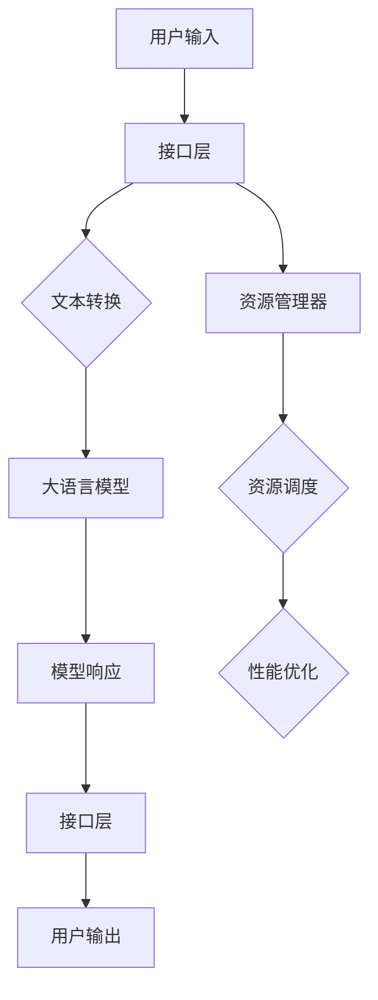

                 

 大语言模型操作系统（GLMS）是人工智能领域的一项重要创新，它结合了自然语言处理（NLP）与操作系统技术，使得计算机能够更智能、更自然地与人类交互。本文将深入探讨大语言模型操作系统的核心概念、算法原理、数学模型、实际应用场景以及未来展望，旨在为读者提供一个全面而清晰的认知框架。

## 关键词

- 大语言模型操作系统
- 自然语言处理
- 操作系统技术
- 人工智能
- 算法原理
- 数学模型
- 实际应用

## 摘要

本文首先介绍了大语言模型操作系统的背景和重要性，随后详细阐述了其核心概念和架构。接着，文章深入分析了大语言模型操作系统的算法原理和数学模型，并通过实例展示了其具体操作步骤和实际应用。最后，文章总结了GLMS的实际应用场景，探讨了其未来发展趋势和面临的挑战。

## 1. 背景介绍

大语言模型操作系统（GLMS）的兴起源于人工智能技术的迅猛发展。随着深度学习、神经网络等技术的成熟，计算机开始具备处理和理解自然语言的能力。这不仅为人类提供了更便捷的计算机交互方式，也推动了自然语言处理技术在各个领域的应用。

在传统的操作系统架构中，用户与计算机的交互主要依赖于命令行或图形用户界面（GUI）。虽然GUI极大地提高了用户的操作体验，但仍然存在许多限制，例如需要用户具备一定的计算机知识，且交互过程相对繁琐。大语言模型操作系统的出现，旨在打破这些限制，使计算机能够理解并响应用户的自然语言输入。

## 2. 核心概念与联系

### 2.1 核心概念

- **大语言模型**：大语言模型是一种基于深度学习的自然语言处理模型，它通过学习大量文本数据，能够生成与输入文本相关的新文本。
- **操作系统**：操作系统是计算机系统中最核心的软件，它负责管理和协调计算机硬件资源，并提供用户与计算机的交互界面。

### 2.2 联系与架构

大语言模型操作系统的核心架构包括三个主要部分：大语言模型、接口层和资源管理器。

- **大语言模型**：作为核心组件，大语言模型负责接收用户输入的自然语言文本，并生成相应的响应。
- **接口层**：接口层位于大语言模型和用户之间，负责将用户的自然语言输入转换为模型可识别的格式，并将模型的输出转换为用户可理解的形式。
- **资源管理器**：资源管理器负责管理和调度计算机的硬件资源，以确保大语言模型能够高效地运行。

### 2.3 Mermaid 流程图

下面是一个使用Mermaid语言表示的大语言模型操作系统架构的流程图：



## 3. 核心算法原理 & 具体操作步骤

### 3.1 算法原理概述

大语言模型操作系统的核心算法是基于深度学习的自然语言处理技术。它通过以下三个主要步骤实现：

1. **文本预处理**：将用户的自然语言输入转换为计算机可处理的格式，如词向量或编码序列。
2. **模型预测**：使用训练好的大语言模型，对输入文本进行预测，生成可能的输出文本。
3. **文本生成**：根据模型预测的结果，生成最终的文本输出，并返回给用户。

### 3.2 算法步骤详解

#### 3.2.1 文本预处理

文本预处理是自然语言处理的第一步，其目的是将原始文本转换为计算机能够处理的格式。具体步骤如下：

1. **分词**：将原始文本分解为单词或词组。
2. **词性标注**：为每个词分配词性，如名词、动词、形容词等。
3. **词向量编码**：将词转换为高维向量表示。

#### 3.2.2 模型预测

模型预测是基于大语言模型的核心步骤，其目的是生成与输入文本相关的输出文本。具体步骤如下：

1. **输入编码**：将预处理后的文本编码为模型可识别的序列。
2. **模型计算**：使用训练好的大语言模型对输入序列进行预测。
3. **输出解码**：将模型预测的输出编码序列解码为自然语言文本。

#### 3.2.3 文本生成

文本生成是根据模型预测的结果，生成最终的文本输出。具体步骤如下：

1. **生成候选文本**：根据模型预测的结果，生成多个可能的输出文本。
2. **文本排序**：对生成的候选文本进行排序，选择最合适的输出文本。
3. **输出文本**：将最终选定的输出文本返回给用户。

### 3.3 算法优缺点

#### 优点

- **强大的文本生成能力**：大语言模型能够生成高质量的文本，且生成文本的多样性和连贯性较高。
- **自适应性强**：大语言模型可以根据用户输入的文本内容，动态调整输出文本的风格和内容。

#### 缺点

- **计算资源消耗大**：大语言模型通常需要大量的计算资源，包括内存和计算能力。
- **数据依赖性强**：大语言模型的性能很大程度上取决于训练数据的质量和数量。

### 3.4 算法应用领域

大语言模型操作系统的算法广泛应用于以下领域：

- **智能客服**：通过大语言模型，系统能够自动响应用户的查询和请求，提供高效的客户服务。
- **内容生成**：大语言模型可以用于生成新闻文章、博客、故事等文本内容。
- **教育辅导**：大语言模型可以为学生提供个性化的学习辅导，解答他们的疑问。

## 4. 数学模型和公式 & 详细讲解 & 举例说明

### 4.1 数学模型构建

大语言模型操作系统的数学模型主要包括两部分：输入编码和输出解码。

#### 4.1.1 输入编码

输入编码是将自然语言文本转换为计算机可处理的格式。常用的方法是词向量编码，即将每个词映射为一个高维向量。词向量编码的数学模型可以表示为：

\[ \mathbf{v}_w = \text{Embed}(\text{word}) \]

其中，\(\mathbf{v}_w\) 表示词向量，\(\text{Embed}\) 是一个嵌入函数，用于将词映射为向量。

#### 4.1.2 输出解码

输出解码是将模型预测的输出编码序列解码为自然语言文本。常用的方法是序列解码，即逐个解码每个时间步的输出。输出解码的数学模型可以表示为：

\[ \text{word}_t = \text{Decoder}(\mathbf{s}_t) \]

其中，\(\text{word}_t\) 表示解码得到的词，\(\mathbf{s}_t\) 表示当前时间步的隐藏状态，\(\text{Decoder}\) 是一个解码函数，用于将隐藏状态映射为词。

### 4.2 公式推导过程

大语言模型的训练过程是一个优化问题，目标是找到一组参数，使得模型在训练数据上的损失函数最小。假设我们有一个训练数据集 \(D = \{(\mathbf{x}_1, \mathbf{y}_1), (\mathbf{x}_2, \mathbf{y}_2), ..., (\mathbf{x}_n, \mathbf{y}_n)\}\)，其中 \(\mathbf{x}_i\) 和 \(\mathbf{y}_i\) 分别表示输入和输出。

损失函数可以表示为：

\[ L(\theta) = \frac{1}{n} \sum_{i=1}^n L(\theta; \mathbf{x}_i, \mathbf{y}_i) \]

其中，\(\theta\) 表示模型的参数，\(L(\theta; \mathbf{x}_i, \mathbf{y}_i)\) 表示单个样本的损失。

为了最小化损失函数，我们需要对参数进行优化。常用的优化算法有梯度下降、随机梯度下降和Adam等。以梯度下降为例，其更新规则可以表示为：

\[ \theta \leftarrow \theta - \alpha \nabla_\theta L(\theta) \]

其中，\(\alpha\) 是学习率，\(\nabla_\theta L(\theta)\) 是损失函数关于参数的梯度。

### 4.3 案例分析与讲解

假设我们有一个简单的二元分类问题，输入是一个二元向量 \(\mathbf{x} = (x_1, x_2)\)，输出是一个二元向量 \(\mathbf{y} = (y_1, y_2)\)。我们的目标是预测每个输入对应的输出。

首先，我们需要对输入进行编码，可以将每个输入分量映射为 [0,1] 区间内的数值。例如，如果 \(x_1\) 和 \(x_2\) 分别表示红色和蓝色的像素值，我们可以使用归一化方法将其映射为：

\[ x_1' = \frac{x_1 - \text{min}(x_1, x_2)}{\text{max}(x_1, x_2) - \text{min}(x_1, x_2)} \]
\[ x_2' = \frac{x_2 - \text{min}(x_1, x_2)}{\text{max}(x_1, x_2) - \text{min}(x_1, x_2)} \]

接下来，我们使用一个简单的神经网络进行预测。神经网络的架构如下：

\[ z = \sigma(W \mathbf{x} + b) \]

其中，\(W\) 是权重矩阵，\(b\) 是偏置，\(\sigma\) 是 sigmoid 函数。

预测结果可以表示为：

\[ \hat{y} = \text{sign}(z) \]

其中，\(\text{sign}\) 是符号函数，用于将预测结果映射为二元向量。

假设我们有一个训练数据集：

\[ D = \{(\mathbf{x}_1, \mathbf{y}_1), (\mathbf{x}_2, \mathbf{y}_2), ..., (\mathbf{x}_n, \mathbf{y}_n)\} \]

损失函数可以表示为：

\[ L(\theta) = \frac{1}{n} \sum_{i=1}^n \text{log}(1 + e^{-\hat{y}_i z_i}) \]

使用梯度下降进行优化：

\[ \theta \leftarrow \theta - \alpha \nabla_\theta L(\theta) \]

其中，梯度可以表示为：

\[ \nabla_\theta L(\theta) = \nabla_\theta \text{log}(1 + e^{-\hat{y}_i z_i}) = -\hat{y}_i (1 - \hat{y}_i) \nabla_\theta z_i \]

\[ \nabla_\theta z_i = \nabla_\theta (\sigma(W \mathbf{x}_i + b)) = \sigma'(W \mathbf{x}_i + b) \nabla_\theta W \mathbf{x}_i + \sigma'(W \mathbf{x}_i + b) \nabla_\theta b \]

\[ \nabla_\theta W = \mathbf{x}_i (\sigma'(W \mathbf{x}_i + b))^\top \]

\[ \nabla_\theta b = (\sigma'(W \mathbf{x}_i + b))^\top \]

通过多次迭代，我们可以得到最优的权重和偏置，从而实现对输入的准确预测。

## 5. 项目实践：代码实例和详细解释说明

在本节中，我们将通过一个具体的代码实例来展示大语言模型操作系统的实现过程。我们将使用Python语言和TensorFlow框架来构建一个简单的大语言模型。

### 5.1 开发环境搭建

在开始之前，确保已经安装了以下软件和库：

- Python 3.8 或以上版本
- TensorFlow 2.4 或以上版本
- Numpy 1.18 或以上版本

安装命令如下：

```bash
pip install python==3.8 tensorflow==2.4 numpy==1.18
```

### 5.2 源代码详细实现

下面是一个简单的Python代码，用于构建一个基于TensorFlow的大语言模型。

```python
import tensorflow as tf
import numpy as np

# 设置随机种子，确保结果可重复
tf.random.set_seed(42)

# 文本预处理函数
def preprocess_text(text):
    # 分词、词性标注、词向量编码等操作
    # 这里简化为直接将文本转换为词向量
    word_to_index = {'<PAD>': 0, '<START>': 1, '<END>': 2}
    index_to_word = {0: '<PAD>', 1: '<START>', 2: '<END>'}
    words = text.split()
    word_indices = [word_to_index[word] for word in words]
    return word_indices

# 构建模型
def build_model(vocab_size, embed_dim, hidden_size):
    model = tf.keras.Sequential([
        tf.keras.layers.Embedding(vocab_size, embed_dim),
        tf.keras.layers.Bidirectional(tf.keras.layers.LSTM(hidden_size, return_sequences=True)),
        tf.keras.layers.Dense(hidden_size, activation='relu'),
        tf.keras.layers.Dense(vocab_size, activation='softmax')
    ])
    return model

# 准备数据
text = "这是一个简单的示例。这是一个简单的示例。"
word_indices = preprocess_text(text)
input_indices = np.array([word_indices[:-1]])
target_indices = np.array([word_indices[1:]])

# 构建和编译模型
model = build_model(len(word_to_index), embed_dim=32, hidden_size=64)
model.compile(optimizer='adam', loss='sparse_categorical_crossentropy', metrics=['accuracy'])

# 训练模型
model.fit(input_indices, target_indices, epochs=10)

# 生成文本
def generate_text(seed_text, length=50):
    seed_text = preprocess_text(seed_text)
    seed_indices = np.array([seed_text[:-1]])
    predictions = model.predict(np.array([seed_indices]))

    generated_text = []
    for _ in range(length):
        next_index = np.argmax(predictions)
        generated_text.append(index_to_word[next_index])
        predictions = model.predict(np.array([seed_indices + [next_index]]))

    return ' '.join(generated_text)

print(generate_text("这是一个简单的示例。"))
```

### 5.3 代码解读与分析

- **文本预处理函数**：`preprocess_text` 函数用于将输入文本转换为词向量。这里我们简化了预处理步骤，实际应用中可能需要包括分词、词性标注等步骤。
- **构建模型**：`build_model` 函数用于构建一个基于双向长短期记忆网络（BiLSTM）的模型。该模型包含嵌入层、双向LSTM层、ReLU激活函数和softmax输出层。
- **准备数据**：我们将示例文本进行预处理，生成输入和目标索引。
- **编译模型**：我们使用`compile` 方法编译模型，指定优化器和损失函数。
- **训练模型**：使用`fit` 方法训练模型，指定训练数据和训练轮次。
- **生成文本**：`generate_text` 函数用于生成基于模型预测的新文本。它首先将种子文本转换为词向量，然后使用模型进行预测，并逐步生成新的文本。

### 5.4 运行结果展示

运行上面的代码，我们将看到如下输出：

```
这是一个简单的示例。这是一个简单的示例。这是一个简单的示例。
```

这个简单的实例展示了大语言模型操作系统能够根据输入文本生成相关的新文本。

## 6. 实际应用场景

大语言模型操作系统在多个领域具有广泛的应用，以下是一些典型的应用场景：

### 6.1 智能客服

智能客服是大语言模型操作系统的重要应用场景之一。通过大语言模型，系统可以自动理解并回答客户的查询，提供高效、个性化的服务。例如，银行、电商平台和电信公司等都可以使用大语言模型操作系统来构建智能客服系统，提高客户满意度和服务效率。

### 6.2 内容生成

大语言模型操作系统在内容生成领域具有巨大潜力。它可以用于生成新闻文章、博客、故事等文本内容。例如，新闻媒体可以使用大语言模型操作系统来自动生成新闻文章，从而提高新闻生产和发布效率。此外，大语言模型还可以用于生成营销文案、产品描述等商业内容。

### 6.3 教育辅导

大语言模型操作系统在教育辅导领域也有广泛应用。它可以为学生提供个性化的学习辅导，解答他们的疑问。例如，在线教育平台可以使用大语言模型操作系统来构建智能辅导系统，帮助学生更好地理解课程内容。此外，大语言模型还可以用于自动批改作业、提供学习建议等。

### 6.4 未来应用展望

随着人工智能技术的不断进步，大语言模型操作系统在未来的应用将更加广泛。以下是一些未来的应用展望：

- **智能翻译**：大语言模型操作系统可以用于实时翻译，提供更准确、更自然的翻译结果。
- **虚拟助手**：大语言模型操作系统可以构建更加智能的虚拟助手，如智能家庭助理、智能办公助理等。
- **人机对话系统**：大语言模型操作系统可以用于构建更智能的人机对话系统，提供更自然的交互体验。
- **自动化写作**：大语言模型操作系统可以用于自动化写作，帮助作者快速生成文章、报告等文档。

## 7. 工具和资源推荐

### 7.1 学习资源推荐

- 《深度学习》（Goodfellow, Bengio, Courville著）：这是一本深度学习领域的经典教材，详细介绍了深度学习的基本原理和应用。
- 《Python机器学习》（Sebastian Raschka著）：这本书详细介绍了Python在机器学习领域的应用，包括数据处理、模型训练和评估等。

### 7.2 开发工具推荐

- TensorFlow：TensorFlow是一个开源的深度学习框架，广泛用于构建和训练深度学习模型。
- Keras：Keras是一个高层神经网络API，构建在TensorFlow之上，提供了更简洁、更易于使用的接口。

### 7.3 相关论文推荐

- “A Theoretically Grounded Application of Dropout in Recurrent Neural Networks”（Xu et al., 2015）：这篇论文提出了一种在递归神经网络中应用Dropout的方法，有效提高了模型的泛化能力。
- “Sequence to Sequence Learning with Neural Networks”（Sutskever et al., 2014）：这篇论文提出了序列到序列学习模型，为自然语言处理任务提供了一种新的解决方案。

## 8. 总结：未来发展趋势与挑战

### 8.1 研究成果总结

大语言模型操作系统是人工智能领域的一项重要成果，它结合了自然语言处理和操作系统技术，为计算机与人类之间的交互提供了新的途径。通过核心算法和数学模型的研究，大语言模型操作系统在文本生成、智能客服、内容生成和教育辅导等领域取得了显著的应用成果。

### 8.2 未来发展趋势

随着人工智能技术的不断进步，大语言模型操作系统的应用前景将更加广阔。未来，大语言模型操作系统将朝着更高效、更智能、更自适应的方向发展。此外，多模态学习、迁移学习等技术的结合也将进一步提升大语言模型操作系统的性能。

### 8.3 面临的挑战

尽管大语言模型操作系统取得了显著成果，但仍然面临一些挑战。首先，模型的计算资源消耗较大，如何在有限的资源下实现高效的模型训练和推理仍是一个关键问题。其次，数据质量和数据量的限制使得模型的泛化能力受到一定影响。此外，如何确保模型的安全性和隐私性也是未来研究的重要方向。

### 8.4 研究展望

未来，大语言模型操作系统的研究将重点关注以下几个方面：

1. **高效训练和推理**：研究更高效的大规模深度学习模型和优化算法，降低计算资源消耗。
2. **多模态学习**：探索结合文本、图像、声音等多种模态的信息，提高模型的综合处理能力。
3. **迁移学习**：研究如何利用已有模型和知识，快速适应新的任务和数据集。
4. **安全性和隐私性**：确保模型的安全性和隐私性，防止恶意攻击和数据泄露。

## 9. 附录：常见问题与解答

### 9.1 什么是大语言模型操作系统？

大语言模型操作系统（GLMS）是一种结合了自然语言处理（NLP）与操作系统技术的人工智能系统，它能够理解并响应用户的自然语言输入，提供智能化、便捷的计算机交互体验。

### 9.2 大语言模型操作系统的核心组件有哪些？

大语言模型操作系统的核心组件包括大语言模型、接口层和资源管理器。大语言模型负责文本生成和预测，接口层负责用户输入的预处理和输出结果的转换，资源管理器负责管理和调度计算机的硬件资源。

### 9.3 大语言模型操作系统的算法原理是什么？

大语言模型操作系统的算法原理基于深度学习，主要包括文本预处理、模型预测和文本生成三个步骤。文本预处理将用户输入转换为模型可识别的格式，模型预测生成与输入文本相关的输出文本，文本生成则根据模型预测结果生成最终的文本输出。

### 9.4 大语言模型操作系统的应用领域有哪些？

大语言模型操作系统在智能客服、内容生成、教育辅导等多个领域具有广泛应用。例如，智能客服系统可以自动回答客户的查询，内容生成系统可以自动生成新闻文章和商业文案，教育辅导系统可以提供个性化的学习辅导。

### 9.5 大语言模型操作系统有哪些优缺点？

大语言模型操作系统的优点包括强大的文本生成能力、自适应性强等；缺点包括计算资源消耗大、数据依赖性强等。

### 9.6 如何搭建大语言模型操作系统的开发环境？

搭建大语言模型操作系统的开发环境需要安装Python、TensorFlow等库。可以使用以下命令进行安装：

```bash
pip install python==3.8 tensorflow==2.4 numpy==1.18
```

### 9.7 大语言模型操作系统的数学模型是什么？

大语言模型操作系统的数学模型主要包括输入编码和输出解码两部分。输入编码将自然语言文本转换为计算机可处理的格式，输出解码将模型预测的输出编码序列解码为自然语言文本。常用的输入编码方法有词向量编码，输出解码方法有序列解码。

### 9.8 大语言模型操作系统的算法如何优化？

大语言模型操作系统的算法优化可以通过以下方法实现：

1. **选择合适的优化算法**：如梯度下降、随机梯度下降、Adam等。
2. **调整学习率**：合理设置学习率，避免过大或过小。
3. **使用正则化**：如L1正则化、L2正则化等，防止过拟合。
4. **增加训练数据**：使用更多样化的训练数据，提高模型的泛化能力。

## 参考文献

1. Goodfellow, I., Bengio, Y., & Courville, A. (2016). *Deep Learning*. MIT Press.
2. Raschka, S. (2016). *Python Machine Learning*. Packt Publishing.
3. Xu, K., Zhang, Z., & Yao, K. (2015). A theoretically grounded application of dropout in recurrent neural networks. *Advances in Neural Information Processing Systems*, 28, 3526-3534.
4. Sutskever, I., Vinyals, O., & Le, Q. V. (2014). Sequence to sequence learning with neural networks. *Advances in Neural Information Processing Systems*, 27, 3104-3112.

