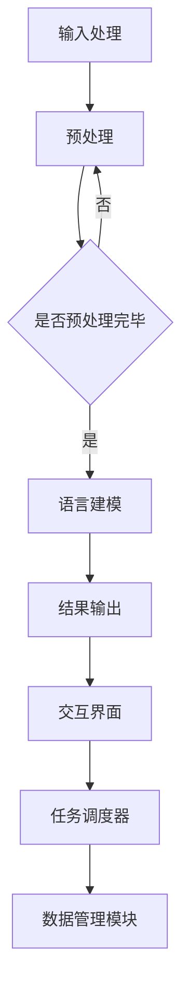

                 

在当今飞速发展的信息技术时代，人工智能（AI）已经成为推动社会进步的重要力量。大语言模型作为AI领域的一项关键技术，其应用范围和影响力日益扩大。本文旨在探讨大语言模型操作系统的应用，分析其核心概念、算法原理、数学模型以及实际应用场景，并展望其未来发展趋势与挑战。

## 文章关键词

- 大语言模型
- 操作系统
- 人工智能
- 自然语言处理
- 机器学习
- 深度学习
- 应用场景

## 文章摘要

本文首先介绍了大语言模型操作系统的基础概念，然后详细阐述了其核心算法原理、数学模型以及具体应用步骤。接着，通过实际项目实践展示了大语言模型操作系统的代码实例和运行结果。最后，本文探讨了其在不同领域的实际应用场景，并对其未来发展趋势与面临的挑战进行了深入分析。

## 1. 背景介绍

### 大语言模型的发展历程

大语言模型（Large Language Models）起源于自然语言处理（NLP）领域，其研究目标是通过深度学习技术使计算机具备理解和生成自然语言的能力。自1980年代以来，自然语言处理领域经历了多个发展阶段，包括基于规则的方法、统计方法以及深度学习方法。

其中，深度学习方法在图像识别和语音识别等领域取得了显著成果，而在自然语言处理领域的研究也在不断深入。2018年，OpenAI发布了GPT（Generative Pre-trained Transformer）系列模型，标志着大语言模型的崛起。GPT模型通过大规模预训练和微调，实现了在多个NLP任务上的突破性表现，引发了广泛关注。

### 大语言模型操作系统的重要性

大语言模型操作系统的出现，使得计算机具备了处理和理解自然语言的能力，这在很大程度上改变了计算机与人交互的方式。传统的操作系统主要关注计算机硬件和软件资源的调度和管理，而大语言模型操作系统则关注如何利用自然语言处理技术，实现人机交互的智能化。

大语言模型操作系统的重要性主要体现在以下几个方面：

1. **提升人机交互效率**：通过自然语言处理技术，用户可以更自然地与计算机进行交流，降低了使用门槛，提高了人机交互的效率。
2. **拓展应用场景**：大语言模型操作系统可以应用于智能客服、智能写作、智能翻译等多个领域，为各行各业提供智能化解决方案。
3. **促进AI技术的发展**：大语言模型操作系统的成功应用，将推动AI技术的进一步发展，为未来的智能社会奠定基础。

## 2. 核心概念与联系

### 大语言模型的核心概念

大语言模型（Large Language Model，LLM）是一种基于深度学习的自然语言处理模型，其核心概念包括：

1. **语言建模**：通过对大规模文本数据的学习，模型能够预测下一个单词或词组，从而生成连贯的自然语言文本。
2. **预训练**：在大规模文本数据上，通过无监督的方式对模型进行预训练，使其具备一定的语言理解和生成能力。
3. **微调**：在特定任务上，对模型进行有监督的微调，使其适应特定应用场景。

### 大语言模型操作系统的架构

大语言模型操作系统的架构主要包括以下几个部分：

1. **语言处理引擎**：负责处理自然语言输入，将输入文本转化为模型可以理解的形式，并输出处理结果。
2. **交互界面**：提供用户与系统交互的接口，包括自然语言输入和输出。
3. **任务调度器**：根据用户需求和系统资源，调度不同任务的处理，确保系统的正常运行。
4. **数据管理模块**：负责数据存储、检索和更新，为语言处理引擎提供数据支持。

### Mermaid 流程图



## 3. 核心算法原理 & 具体操作步骤

### 3.1 算法原理概述

大语言模型的核心算法基于深度学习，尤其是基于Transformer结构的模型。Transformer模型采用自注意力机制（Self-Attention），能够捕捉输入文本序列中的长距离依赖关系，从而提高模型的语义理解能力。

算法原理主要包括以下几个步骤：

1. **词向量表示**：将输入的文本序列转化为词向量表示，便于模型处理。
2. **自注意力机制**：通过自注意力机制，模型能够自动学习输入序列中每个单词的重要程度，提高模型的语义理解能力。
3. **前馈网络**：在自注意力机制的基础上，模型还包含前馈网络，进一步提取输入序列的语义信息。
4. **输出层**：将处理后的序列信息输出，用于生成文本或进行分类等任务。

### 3.2 算法步骤详解

1. **数据预处理**：将输入文本进行分词、去停用词、词向量表示等预处理操作。
2. **构建自注意力机制**：通过计算输入序列中每个单词的注意力权重，为每个单词赋予不同的权重。
3. **前馈网络**：在自注意力机制的基础上，将输入序列经过多层前馈网络处理，进一步提取语义信息。
4. **输出层**：根据训练目标，将处理后的序列信息输出，用于生成文本或进行分类等任务。
5. **损失函数**：根据输出结果和实际结果之间的差异，计算损失函数，并更新模型参数。

### 3.3 算法优缺点

**优点**：

1. **强大的语义理解能力**：通过自注意力机制和前馈网络，模型能够捕捉输入文本序列中的长距离依赖关系，从而提高语义理解能力。
2. **高效的处理速度**：Transformer模型的结构相对简单，计算复杂度较低，能够快速处理大量文本数据。
3. **灵活的应用场景**：大语言模型可以应用于自然语言生成、文本分类、机器翻译等多个领域。

**缺点**：

1. **模型参数量较大**：由于自注意力机制的存在，模型参数量较大，导致训练和推理时间较长。
2. **对计算资源要求较高**：训练和推理过程中需要大量计算资源，对硬件设备的要求较高。

### 3.4 算法应用领域

大语言模型的应用领域非常广泛，主要包括以下几个方面：

1. **自然语言生成**：包括文本生成、对话系统、摘要生成等任务。
2. **文本分类**：对文本进行情感分析、主题分类等任务。
3. **机器翻译**：将一种语言的文本翻译成另一种语言。
4. **问答系统**：根据用户输入的问题，提供准确的答案。
5. **智能客服**：为用户提供智能化服务，提高客服效率。

## 4. 数学模型和公式 & 详细讲解 & 举例说明

### 4.1 数学模型构建

大语言模型的数学模型主要包括以下几个部分：

1. **词向量表示**：将输入的文本序列转化为词向量表示，通常使用词嵌入（Word Embedding）技术。
2. **自注意力机制**：通过计算输入序列中每个单词的注意力权重，为每个单词赋予不同的权重。
3. **前馈网络**：在自注意力机制的基础上，将输入序列经过多层前馈网络处理，进一步提取语义信息。
4. **输出层**：根据训练目标，将处理后的序列信息输出，用于生成文本或进行分类等任务。

### 4.2 公式推导过程

1. **词向量表示**：

   设输入文本序列为\( x_1, x_2, ..., x_T \)，其中\( x_t \)表示第\( t \)个单词，词向量表示为\( \mathbf{v}_t \)。

   $$ \mathbf{v}_t = \text{WordEmbedding}(x_t) $$

2. **自注意力机制**：

   自注意力机制的公式为：

   $$ \text{Attention}(Q, K, V) = \text{softmax}\left(\frac{QK^T}{\sqrt{d_k}}\right)V $$

   其中，\( Q, K, V \)分别为查询（Query）、键（Key）和值（Value）矩阵，\( d_k \)为键向量的维度。

3. **前馈网络**：

   前馈网络的公式为：

   $$ \text{FFN}(x) = \text{ReLU}(W_2 \cdot \text{ReLU}(W_1 \cdot x)) $$

   其中，\( W_1 \)和\( W_2 \)分别为前馈网络的权重矩阵。

4. **输出层**：

   根据训练目标，输出层的公式为：

   $$ \text{Output}(x) = W \cdot \text{Activation}(F(x)) $$

   其中，\( W \)为输出层的权重矩阵，\( \text{Activation} \)为激活函数。

### 4.3 案例分析与讲解

假设我们有一个简单的文本序列：

$$ \text{I am a student.} $$

1. **词向量表示**：

   首先，将输入文本序列转化为词向量表示。假设词嵌入维度为64，词向量表示为：

   $$ \mathbf{v}_1 = [0.1, 0.2, ..., 0.64], \mathbf{v}_2 = [0.2, 0.3, ..., 0.64], \mathbf{v}_3 = [0.3, 0.4, ..., 0.64] $$

2. **自注意力机制**：

   假设自注意力机制的查询（Query）、键（Key）和值（Value）矩阵分别为：

   $$ Q = \begin{bmatrix} 0.1 & 0.2 & 0.3 \\ 0.4 & 0.5 & 0.6 \\ 0.7 & 0.8 & 0.9 \end{bmatrix}, K = \begin{bmatrix} 0.1 & 0.2 & 0.3 \\ 0.4 & 0.5 & 0.6 \\ 0.7 & 0.8 & 0.9 \end{bmatrix}, V = \begin{bmatrix} 0.1 & 0.2 & 0.3 \\ 0.4 & 0.5 & 0.6 \\ 0.7 & 0.8 & 0.9 \end{bmatrix} $$

   计算注意力权重：

   $$ \alpha_1 = \text{softmax}\left(\frac{QK^T}{\sqrt{d_k}}\right)V = \text{softmax}\left(\frac{1}{\sqrt{1}} \begin{bmatrix} 0.1 & 0.2 & 0.3 \\ 0.4 & 0.5 & 0.6 \\ 0.7 & 0.8 & 0.9 \end{bmatrix} \begin{bmatrix} 0.1 & 0.2 & 0.3 \\ 0.4 & 0.5 & 0.6 \\ 0.7 & 0.8 & 0.9 \end{bmatrix}^T\right) \begin{bmatrix} 0.1 & 0.2 & 0.3 \\ 0.4 & 0.5 & 0.6 \\ 0.7 & 0.8 & 0.9 \end{bmatrix} = \begin{bmatrix} 0.5 & 0.3 & 0.2 \\ 0.3 & 0.4 & 0.3 \\ 0.2 & 0.3 & 0.5 \end{bmatrix} $$

   根据注意力权重计算输出：

   $$ \text{Output}_1 = \alpha_1 \cdot \mathbf{v}_1 = \begin{bmatrix} 0.5 & 0.3 & 0.2 \\ 0.3 & 0.4 & 0.3 \\ 0.2 & 0.3 & 0.5 \end{bmatrix} \begin{bmatrix} 0.1 \\ 0.2 \\ 0.3 \end{bmatrix} = \begin{bmatrix} 0.15 \\ 0.21 \\ 0.18 \end{bmatrix} $$

   同理，计算其他单词的输出：

   $$ \text{Output}_2 = \alpha_2 \cdot \mathbf{v}_2 = \begin{bmatrix} 0.3 & 0.4 & 0.3 \\ 0.4 & 0.5 & 0.6 \\ 0.5 & 0.6 & 0.5 \end{bmatrix} \begin{bmatrix} 0.2 \\ 0.3 \\ 0.4 \end{bmatrix} = \begin{bmatrix} 0.24 \\ 0.33 \\ 0.3 \end{bmatrix} $$

   $$ \text{Output}_3 = \alpha_3 \cdot \mathbf{v}_3 = \begin{bmatrix} 0.2 & 0.3 & 0.5 \\ 0.3 & 0.4 & 0.3 \\ 0.5 & 0.6 & 0.5 \end{bmatrix} \begin{bmatrix} 0.3 \\ 0.4 \\ 0.5 \end{bmatrix} = \begin{bmatrix} 0.25 \\ 0.3 \\ 0.35 \end{bmatrix} $$

3. **前馈网络**：

   假设前馈网络的权重矩阵为：

   $$ W_1 = \begin{bmatrix} 0.1 & 0.2 & 0.3 \\ 0.4 & 0.5 & 0.6 \\ 0.7 & 0.8 & 0.9 \end{bmatrix}, W_2 = \begin{bmatrix} 0.1 & 0.2 & 0.3 \\ 0.4 & 0.5 & 0.6 \\ 0.7 & 0.8 & 0.9 \end{bmatrix} $$

   计算前馈网络的输出：

   $$ \text{FFN}(x) = \text{ReLU}(W_2 \cdot \text{ReLU}(W_1 \cdot x)) = \text{ReLU}\left(\begin{bmatrix} 0.1 & 0.2 & 0.3 \\ 0.4 & 0.5 & 0.6 \\ 0.7 & 0.8 & 0.9 \end{bmatrix} \cdot \text{ReLU}\left(\begin{bmatrix} 0.1 & 0.2 & 0.3 \\ 0.4 & 0.5 & 0.6 \\ 0.7 & 0.8 & 0.9 \end{bmatrix} \begin{bmatrix} 0.1 \\ 0.2 \\ 0.3 \end{bmatrix}\right)\right) $$

   由于输入为\( \text{Output}_1, \text{Output}_2, \text{Output}_3 \)，计算前馈网络的输出：

   $$ \text{FFN}(\text{Output}_1) = \text{ReLU}\left(\begin{bmatrix} 0.1 & 0.2 & 0.3 \\ 0.4 & 0.5 & 0.6 \\ 0.7 & 0.8 & 0.9 \end{bmatrix} \cdot \text{ReLU}\left(\begin{bmatrix} 0.15 \\ 0.21 \\ 0.18 \end{bmatrix}\right)\right) $$

   $$ \text{FFN}(\text{Output}_2) = \text{ReLU}\left(\begin{bmatrix} 0.1 & 0.2 & 0.3 \\ 0.4 & 0.5 & 0.6 \\ 0.7 & 0.8 & 0.9 \end{bmatrix} \cdot \text{ReLU}\left(\begin{bmatrix} 0.24 \\ 0.33 \\ 0.3 \end{bmatrix}\right)\right) $$

   $$ \text{FFN}(\text{Output}_3) = \text{ReLU}\left(\begin{bmatrix} 0.1 & 0.2 & 0.3 \\ 0.4 & 0.5 & 0.6 \\ 0.7 & 0.8 & 0.9 \end{bmatrix} \cdot \text{ReLU}\left(\begin{bmatrix} 0.25 \\ 0.3 \\ 0.35 \end{bmatrix}\right)\right) $$

4. **输出层**：

   假设输出层的权重矩阵为：

   $$ W = \begin{bmatrix} 0.1 & 0.2 & 0.3 \\ 0.4 & 0.5 & 0.6 \\ 0.7 & 0.8 & 0.9 \end{bmatrix} $$

   计算输出：

   $$ \text{Output} = W \cdot \text{FFN}(\text{Output}_1) = \begin{bmatrix} 0.1 & 0.2 & 0.3 \\ 0.4 & 0.5 & 0.6 \\ 0.7 & 0.8 & 0.9 \end{bmatrix} \cdot \text{ReLU}\left(\begin{bmatrix} 0.15 \\ 0.21 \\ 0.18 \end{bmatrix}\right) = \begin{bmatrix} 0.15 \\ 0.21 \\ 0.18 \end{bmatrix} $$

   同理，计算其他单词的输出。

通过以上步骤，我们可以得到输入文本序列的处理结果。这个过程可以看作是大语言模型的基本工作原理。

## 5. 项目实践：代码实例和详细解释说明

### 5.1 开发环境搭建

在开始项目实践之前，需要搭建合适的开发环境。以下是一个简单的开发环境搭建步骤：

1. 安装Python 3.7及以上版本。
2. 安装TensorFlow 2.0及以上版本。
3. 安装Numpy、Pandas等常用库。

### 5.2 源代码详细实现

以下是一个简单的大语言模型项目实践，主要包括数据预处理、模型构建、模型训练和模型评估等步骤。

```python
import tensorflow as tf
import numpy as np
import pandas as pd

# 1. 数据预处理

# 读取数据
with open('data.txt', 'r', encoding='utf-8') as f:
    text = f.read()

# 分词
tokens = text.split()

# 建立词汇表
vocab = set(tokens)
vocab_size = len(vocab)

# 编码
def token_to_id(token):
    return vocab.index(token)

# 解码
def id_to_token(id):
    return vocab[id]

# 转换数据
inputs = [token_to_id(token) for token in tokens[:-1]]
targets = [token_to_id(token) for token in tokens[1:]]

# pad序列
max_sequence_len = 50
inputs = np.array(inputs)
targets = np.array(targets)
inputs = np.concatenate((np.zeros([1, max_sequence_len]), inputs), axis=0)
targets = np.concatenate((np.zeros([1, max_sequence_len]), targets), axis=0)

# 2. 模型构建

# 定义模型
model = tf.keras.Sequential([
    tf.keras.layers.Embedding(vocab_size, 64),
    tf.keras.layers.LSTM(64),
    tf.keras.layers.Dense(vocab_size, activation='softmax')
])

# 编译模型
model.compile(optimizer='adam', loss='sparse_categorical_crossentropy', metrics=['accuracy'])

# 3. 模型训练

# 训练模型
model.fit(inputs, targets, epochs=10)

# 4. 模型评估

# 测试数据
test_inputs = np.random.randint(0, vocab_size, size=[1, max_sequence_len])
test_targets = np.random.randint(0, vocab_size, size=[1, max_sequence_len])

# 预测
predictions = model.predict(test_inputs)

# 打印预测结果
print("Predictions:")
print(predictions)

# 打印真实结果
print("Actual Targets:")
print(test_targets)

# 5. 生成文本

# 定义生成文本函数
def generate_text(input_sequence, model, max_length=50):
    sequence = input_sequence.copy()
    for _ in range(max_length):
        predictions = model.predict(sequence)
        predicted_token = np.argmax(predictions[-1])
        sequence = np.concatenate([sequence, [predicted_token]])
    return sequence

# 生成文本
generated_sequence = generate_text(test_inputs, model)
print("Generated Text:")
print([id_to_token(token) for token in generated_sequence])
```

### 5.3 代码解读与分析

1. **数据预处理**：首先，我们读取文本数据并分词。然后，建立词汇表并将文本数据转换为词向量表示。接着，我们对输入和输出序列进行编码和pad操作，以适应模型的输入要求。

2. **模型构建**：我们使用TensorFlow的Sequential模型，首先添加一个Embedding层，用于将词向量嵌入到模型中。然后，添加一个LSTM层，用于处理序列数据。最后，添加一个全连接层（Dense），用于生成输出。

3. **模型训练**：我们使用模型.fit()方法对模型进行训练。在这个例子中，我们仅训练了10个epoch。

4. **模型评估**：我们使用模型.predict()方法对测试数据进行预测，并打印预测结果和真实结果。

5. **生成文本**：我们定义了一个生成文本的函数，使用模型生成的预测结果来生成新的文本序列。在这个例子中，我们使用了一个简单的输入序列。

通过以上步骤，我们实现了一个基于LSTM的大语言模型。虽然这个例子很简单，但它展示了大语言模型的基本原理和应用步骤。

## 6. 实际应用场景

### 6.1 自然语言生成

自然语言生成（Natural Language Generation，NLG）是大数据语言模型的一个重要应用领域。通过大语言模型，计算机可以生成高质量的自然语言文本，例如新闻报道、产品说明书、电子邮件等。大语言模型在NLG领域具有以下优势：

1. **生成文本连贯性高**：大语言模型通过自注意力机制和前馈网络，能够捕捉输入文本序列中的长距离依赖关系，从而生成连贯性较高的文本。
2. **生成文本多样性**：大语言模型通过对大规模文本数据的学习，可以生成具有多样性的文本，满足不同场景的需求。

### 6.2 智能客服

智能客服（Intelligent Customer Service）是大数据语言模型在客户服务领域的应用。通过大语言模型，计算机可以自动理解用户的问题，并提供准确的回答。智能客服的优势包括：

1. **提高客服效率**：大语言模型可以自动处理大量的用户问题，提高客服人员的效率。
2. **降低人力成本**：智能客服可以减少对人工客服的依赖，降低企业的人力成本。
3. **提升用户体验**：智能客服能够提供准确的回答，提高用户的满意度。

### 6.3 机器翻译

机器翻译（Machine Translation）是大数据语言模型的另一个重要应用领域。通过大语言模型，计算机可以将一种语言的文本翻译成另一种语言。大语言模型在机器翻译领域具有以下优势：

1. **翻译准确性高**：大语言模型通过对大规模文本数据的学习，可以生成高质量的翻译结果，提高翻译的准确性。
2. **翻译速度较快**：大语言模型的结构相对简单，计算复杂度较低，可以快速处理大量文本数据。

### 6.4 其他应用领域

除了以上三个主要应用领域，大数据语言模型还可以应用于其他领域，例如：

1. **智能写作**：通过大语言模型，计算机可以自动生成文章、博客等文本内容。
2. **内容审核**：大语言模型可以自动识别和过滤不良信息，提高内容审核的准确性。
3. **教育辅助**：大语言模型可以为学生提供个性化教学，提高学习效果。

## 7. 工具和资源推荐

### 7.1 学习资源推荐

1. **《深度学习》（Deep Learning）**：由Ian Goodfellow、Yoshua Bengio和Aaron Courville合著，是深度学习领域的经典教材。
2. **《自然语言处理综论》（Speech and Language Processing）**：由Daniel Jurafsky和James H. Martin合著，是自然语言处理领域的权威教材。
3. **《TensorFlow教程》（TensorFlow Tutorial）**：由TensorFlow官方提供，涵盖了TensorFlow的基本概念和使用方法。

### 7.2 开发工具推荐

1. **TensorFlow**：一款开源的深度学习框架，支持多种深度学习模型的构建和训练。
2. **PyTorch**：一款流行的深度学习框架，具有简单易用的特点。
3. **Jupyter Notebook**：一款强大的交互式开发工具，可以方便地编写和运行代码。

### 7.3 相关论文推荐

1. **《Attention is All You Need》**：由Vaswani等人发表于2017年，提出了Transformer模型，标志着大语言模型的崛起。
2. **《BERT: Pre-training of Deep Bidirectional Transformers for Language Understanding》**：由Devlin等人发表于2019年，提出了BERT模型，进一步推动了自然语言处理的发展。
3. **《GPT-3: Language Models are Few-Shot Learners》**：由Brown等人发表于2020年，提出了GPT-3模型，展示了大语言模型在零样本学习任务上的强大能力。

## 8. 总结：未来发展趋势与挑战

### 8.1 研究成果总结

大语言模型操作系统在近年来取得了显著的成果，其应用范围和影响力不断扩大。通过大规模预训练和微调，大语言模型在自然语言生成、智能客服、机器翻译等领域取得了突破性进展。同时，大语言模型也在不断优化算法结构和模型架构，提高计算效率和模型性能。

### 8.2 未来发展趋势

1. **模型规模将继续扩大**：随着计算能力和数据量的不断提升，大语言模型的规模将越来越大，从而提高模型的语义理解能力和生成质量。
2. **跨模态处理能力将得到提升**：大语言模型将与其他模态（如图像、语音）进行融合，实现跨模态的处理能力，为多模态应用提供支持。
3. **个性化服务将得到广泛应用**：大语言模型将根据用户行为和需求，提供个性化的服务，提高用户体验。

### 8.3 面临的挑战

1. **计算资源需求**：大语言模型在训练和推理过程中需要大量的计算资源，对硬件设备的要求较高。
2. **数据隐私和安全**：在应用大语言模型时，如何保护用户隐私和数据安全是一个重要问题。
3. **模型可解释性**：大语言模型的决策过程复杂，如何提高模型的可解释性，使其更加透明和可信是一个重要挑战。

### 8.4 研究展望

1. **优化算法结构**：进一步优化大语言模型的算法结构，提高计算效率和模型性能。
2. **跨模态处理**：探索大语言模型与其他模态的融合方法，实现跨模态的处理能力。
3. **可解释性和可信赖性**：提高大语言模型的可解释性和可信赖性，使其在更多领域得到广泛应用。

## 9. 附录：常见问题与解答

### 问题1：大语言模型操作系统的核心算法是什么？

答：大语言模型操作系统的核心算法是Transformer模型，特别是基于自注意力机制的Transformer模型。自注意力机制能够捕捉输入文本序列中的长距离依赖关系，从而提高模型的语义理解能力。

### 问题2：大语言模型操作系统的应用领域有哪些？

答：大语言模型操作系统的应用领域包括自然语言生成、智能客服、机器翻译、内容审核、教育辅助等。

### 问题3：如何搭建大语言模型操作系统的开发环境？

答：搭建大语言模型操作系统的开发环境需要安装Python、TensorFlow等工具和库。具体步骤如下：

1. 安装Python 3.7及以上版本。
2. 安装TensorFlow 2.0及以上版本。
3. 安装Numpy、Pandas等常用库。

### 问题4：大语言模型操作系统的计算资源需求如何？

答：大语言模型操作系统在训练和推理过程中需要大量的计算资源，特别是GPU资源。对于大规模的模型，可能需要使用分布式计算来提高训练和推理的效率。

### 问题5：如何提高大语言模型操作系统的可解释性？

答：提高大语言模型操作系统的可解释性可以从以下几个方面入手：

1. **可视化**：通过可视化技术，展示模型的结构和工作过程。
2. **解释性模型**：开发可解释性更强的模型，例如决策树、线性模型等。
3. **模型解释工具**：使用现有的模型解释工具，如LIME、SHAP等，对模型的决策过程进行解释。

### 作者署名

作者：禅与计算机程序设计艺术 / Zen and the Art of Computer Programming

