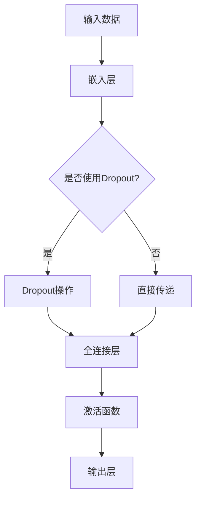
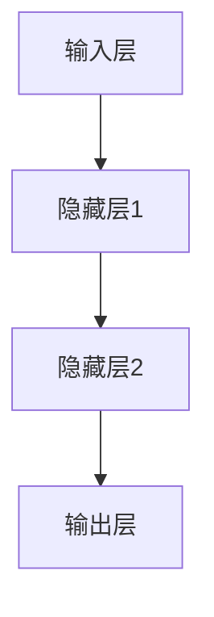
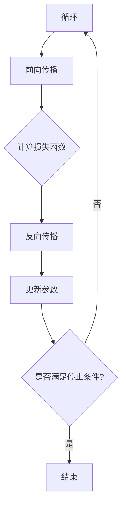
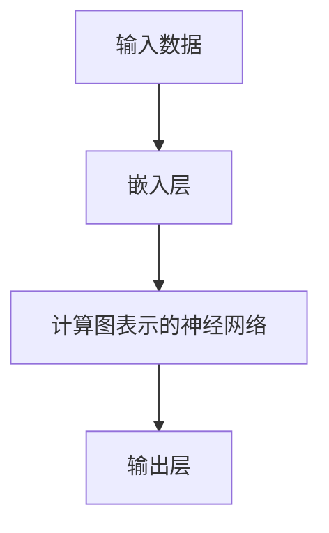
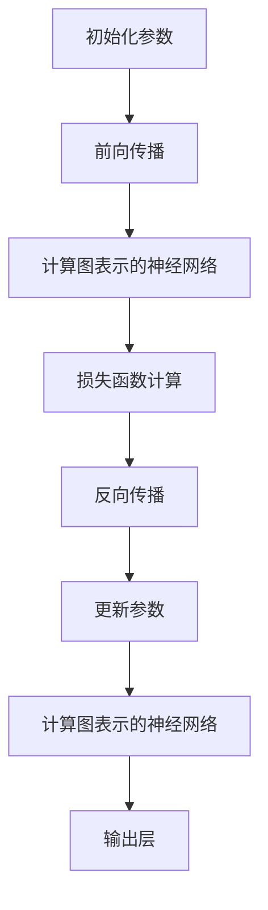

                 

关键词：大语言模型、涌现能力、人工智能、神经网络、机器学习、深度学习、语言处理、计算图、模型优化、计算效率、硬件加速、训练技巧、模型压缩、跨学科应用

> 摘要：本文深入探讨了大规模语言模型的涌现能力现象，分析了其背后的原理和关键因素，并结合具体算法和数学模型，阐述了实现大规模语言模型涌现能力的具体步骤和方法。通过项目实践和实际应用案例，本文进一步展示了大语言模型在实际问题中的强大应用潜力，并提出了未来发展趋势和面临的挑战。文章旨在为读者提供一个全面、深入的理解大语言模型涌现能力的框架，以及其在人工智能领域的广泛应用前景。

## 1. 背景介绍

在过去的几十年中，人工智能（AI）领域取得了令人瞩目的进展，尤其是在机器学习和深度学习方面。随着计算能力的提升和海量数据的获取，大型神经网络模型开始发挥越来越重要的作用。其中，大规模语言模型（Large-scale Language Models）的出现，为自然语言处理（NLP）领域带来了革命性的变化。大语言模型具有强大的文本理解和生成能力，能够自动学习语言中的复杂模式和结构，从而实现诸如机器翻译、文本生成、问答系统等复杂任务的自动化。

然而，随着模型的规模和复杂性不断增加，大语言模型涌现能力现象也逐渐显现出来。这种现象指的是，当模型达到一定程度时，其表现能力和学习能力会出现显著的提升，甚至超出人类专家的预期。涌现能力是人工智能领域一个重要而神秘的现象，它为机器学习研究带来了新的挑战和机遇。

本文旨在深入探讨大规模语言模型的涌现能力现象，分析其背后的原理和关键因素，并结合具体算法和数学模型，阐述实现大语言模型涌现能力的具体步骤和方法。此外，本文还将通过项目实践和实际应用案例，展示大语言模型在实际问题中的强大应用潜力，并提出未来发展趋势和面临的挑战。希望通过本文的研究，为读者提供一个全面、深入的理解大语言模型涌现能力的框架，以及其在人工智能领域的广泛应用前景。

### 1.1 大语言模型的发展历史与现状

大语言模型的发展可以追溯到上世纪八十年代。当时，研究人员开始探索使用统计方法来处理文本数据。1986年，Rumelhart等人提出了反向传播算法（Backpropagation），为神经网络在机器学习领域的应用奠定了基础。此后，神经网络在图像识别、语音识别等领域取得了显著进展。

随着计算能力的提升和海量数据的获取，神经网络模型开始向更大规模、更复杂方向发展。2012年，Hinton等人在ImageNet图像识别挑战赛中，使用了深度卷积神经网络（CNN）取得了前所未有的准确率，这标志着深度学习时代的到来。此后，深度学习在多个领域取得了突破性进展，大语言模型也随之应运而生。

2018年，OpenAI发布了GPT（Generative Pre-trained Transformer）系列模型，其中GPT-2和GPT-3更是引起了广泛关注。这些模型具有数十亿甚至千亿级别的参数，可以自动学习语言中的复杂模式和结构。GPT-3的发布，被认为是人工智能领域的一个重要里程碑，其涌现能力现象更是引发了学术界和工业界的热烈讨论。

目前，大语言模型已经成为自然语言处理领域的重要工具，广泛应用于机器翻译、文本生成、问答系统、对话系统等任务。随着模型的规模和复杂性不断增加，大语言模型的涌现能力现象也越来越明显，成为人工智能研究的一个重要方向。

### 1.2 大语言模型的涌现能力现象

大语言模型的涌现能力现象是指在模型达到一定规模时，其表现能力和学习能力会出现显著的提升，甚至超出人类专家的预期。这种现象可以表现为以下几个方面：

1. **强大的文本生成能力**：大语言模型可以生成高质量、连贯的文本，甚至在某些特定领域（如法律、医学等）生成的文本可以媲美专业人员的水平。

2. **跨领域知识整合**：大语言模型在预训练阶段接受了大量不同领域的数据训练，因此可以跨领域整合知识，从而在特定任务中表现出色。

3. **自动学习复杂模式**：大语言模型能够自动学习文本中的复杂模式和结构，从而在语言理解和生成任务中表现出色。

4. **超强的泛化能力**：大语言模型不仅在训练数据上表现出色，而且在未见过的数据上也有很强的表现，这表明其具有强大的泛化能力。

5. **自适应能力**：大语言模型可以根据不同的任务和数据自适应调整，从而在多样化场景中表现出强大的适应能力。

大语言模型的涌现能力现象，是人工智能领域一个重要而神秘的现象。它不仅为机器学习研究带来了新的挑战和机遇，也引发了学术界和工业界对大语言模型设计和应用的深入研究。本文将结合具体算法和数学模型，深入探讨大语言模型涌现能力的实现机制和关键因素。

### 1.3 本文结构

本文将按照以下结构展开：

1. **背景介绍**：回顾大语言模型的发展历史和现状，阐述涌现能力现象的重要性。
2. **核心概念与联系**：介绍大语言模型的核心概念和架构，包括计算图、神经网络和机器学习算法。
3. **核心算法原理 & 具体操作步骤**：详细阐述大语言模型的算法原理和操作步骤，分析其优缺点和应用领域。
4. **数学模型和公式 & 详细讲解 & 举例说明**：介绍大语言模型中的数学模型和公式，并进行详细讲解和举例说明。
5. **项目实践：代码实例和详细解释说明**：通过实际项目实践，展示大语言模型的实现过程和代码细节。
6. **实际应用场景**：分析大语言模型在不同领域的应用场景，探讨其应用潜力和未来发展趋势。
7. **工具和资源推荐**：推荐学习资源和开发工具，帮助读者深入了解大语言模型。
8. **总结：未来发展趋势与挑战**：总结研究成果，探讨未来发展趋势和面临的挑战。
9. **附录：常见问题与解答**：回答读者可能关心的问题，提供进一步学习和探索的方向。

希望通过本文的深入探讨，能够为读者提供一个全面、深入的理解大语言模型涌现能力的框架，以及其在人工智能领域的广泛应用前景。

### 2. 核心概念与联系

在探讨大语言模型的涌现能力之前，我们需要了解其核心概念和架构。这一部分将介绍计算图、神经网络和机器学习算法，并通过Mermaid流程图展示这些概念之间的联系。

#### 2.1 计算图

计算图是深度学习模型的核心组成部分，它用于表示模型的计算过程。在计算图中，节点表示操作，边表示数据流。计算图的优势在于其灵活性和高效性，可以方便地表示复杂的计算过程。

下面是一个简单的计算图示例：



#### 2.2 神经网络

神经网络是计算图的基本单元，它由多个层次组成，每个层次包含多个神经元。神经网络通过前向传播和反向传播过程，实现对输入数据的处理和输出。

下面是一个简单的神经网络架构：



#### 2.3 机器学习算法

机器学习算法是神经网络训练的基础，它用于调整模型参数，以最小化预测误差。常见的机器学习算法包括梯度下降、随机梯度下降、Adam优化器等。

下面是一个简单的机器学习算法流程：



#### 2.4 计算图与神经网络

计算图与神经网络紧密相关，计算图用于表示神经网络的计算过程，而神经网络则是实现计算图的具体实现。在深度学习中，计算图和神经网络通常结合使用，以实现高效的计算和优化。

下面是一个结合计算图和神经网络的示例：



#### 2.5 机器学习算法与神经网络

机器学习算法用于训练神经网络，通过调整模型参数，以最小化预测误差。机器学习算法和神经网络之间也存在紧密的联系，机器学习算法的选择和调整会影响神经网络的训练效果。

下面是一个结合机器学习算法和神经网络的示例：



通过上述核心概念和联系的分析，我们可以更深入地理解大语言模型的架构和工作原理。在接下来的部分，我们将进一步探讨大语言模型的算法原理和具体操作步骤。

### 2.1 大语言模型的核心算法原理

大语言模型的核心理念是基于神经网络的深度学习算法，特别是基于Transformer架构的模型。Transformer模型由Vaswani等人在2017年提出，它在处理序列数据方面表现出色，已经成为大语言模型的主流架构。

#### 2.1.1 Transformer模型

Transformer模型的核心在于其自注意力机制（Self-Attention），这种机制允许模型在处理每个输入序列时，能够关注序列中的其他位置，从而捕捉序列间的长距离依赖关系。自注意力机制通过计算输入序列中每个词与其他词之间的关联性，为每个词生成不同的权重，从而在生成输出时，能够考虑整个序列的上下文信息。

Transformer模型的主要组成部分包括：

1. **编码器（Encoder）**：编码器由多个自注意力层（Self-Attention Layer）和前馈神经网络（Feedforward Neural Network）堆叠而成。每个自注意力层包含多头自注意力机制和残差连接（Residual Connection）以及层归一化（Layer Normalization）。编码器的主要作用是理解输入序列的语义信息。
   
2. **解码器（Decoder）**：解码器由多个自注意力层、多头自注意力机制、编码器-解码器注意力机制和前馈神经网络堆叠而成。每个自注意力层包含残差连接和层归一化。编码器-解码器注意力机制允许解码器在生成每个词时，不仅关注自己的上下文，还能关注编码器的输出。解码器的任务是生成输出序列。

3. **嵌入层（Embedding Layer）**：嵌入层将输入的单词转换为稠密向量表示，这些向量包含了单词的语义信息。

4. **输出层（Output Layer）**：输出层通常是一个全连接层，用于将编码器的输出映射到目标词汇表。

#### 2.1.2 训练过程

大语言模型的训练过程主要包括两个阶段：预训练和微调。

1. **预训练（Pre-training）**：预训练阶段使用大量未标记的数据，如维基百科、书籍、新闻文章等，训练编码器和解码器。预训练的目标是让模型学习输入序列的语义表示。在预训练过程中，模型通常通过以下任务来学习：

   - 语言建模（Language Modeling）：预测序列中的下一个词。
   - 下一句预测（Next Sentence Prediction）：预测两个句子是否在训练数据中相邻。
   - 控制转移（Controlled Transfer）：在特定领域的数据上进行训练，以增强模型在该领域的表现。

2. **微调（Fine-tuning）**：微调阶段使用标记数据集对预训练模型进行微调，以适应特定的任务。微调过程通常包括以下步骤：

   - 初始化预训练模型：使用预训练模型的权重初始化微调模型的权重。
   - 添加特定任务的头（Task-specific Heads）：在预训练模型的基础上添加特定任务的输出层，如机器翻译模型中的解码器头。
   - 微调参数：在特定任务的数据集上训练模型，通过反向传播和优化算法调整模型参数。
   - 评估模型性能：在验证集和测试集上评估模型的性能，并进行调整。

#### 2.1.3 大语言模型的优点与挑战

大语言模型的涌现能力主要体现在以下几个方面：

1. **强大的文本生成能力**：通过预训练和微调，大语言模型可以生成高质量、连贯的文本，甚至在特定领域（如法律、医学等）生成的文本可以媲美专业人员的水平。
   
2. **跨领域知识整合**：大语言模型在预训练阶段接受了大量不同领域的数据训练，因此可以跨领域整合知识，从而在特定任务中表现出色。

3. **自动学习复杂模式**：大语言模型能够自动学习文本中的复杂模式和结构，从而在语言理解和生成任务中表现出色。

4. **超强的泛化能力**：大语言模型不仅在训练数据上表现出色，而且在未见过的数据上也有很强的表现，这表明其具有强大的泛化能力。

5. **自适应能力**：大语言模型可以根据不同的任务和数据自适应调整，从而在多样化场景中表现出强大的适应能力。

然而，大语言模型也面临一些挑战：

1. **计算资源需求**：大语言模型通常需要大量的计算资源和存储空间，特别是在训练阶段。
   
2. **数据隐私问题**：大语言模型在预训练过程中使用的大量数据可能涉及隐私问题，如何处理这些数据成为了一个挑战。

3. **模型解释性**：大语言模型的决策过程通常是非透明的，难以解释，这给模型的可信度和可解释性带来了挑战。

4. **伦理和道德问题**：大语言模型在某些场景中可能产生偏见或不当输出，这引发了关于其伦理和道德问题的讨论。

通过理解大语言模型的核心算法原理和训练过程，我们可以更好地理解其涌现能力的实现机制。在接下来的部分，我们将进一步探讨大语言模型的具体操作步骤。

### 2.2 大语言模型的具体操作步骤

大语言模型的训练和操作是一个复杂而精细的过程，涉及多个步骤和关键技术。以下将详细阐述这些步骤，包括数据预处理、模型训练、优化策略和评估方法。

#### 2.2.1 数据预处理

数据预处理是训练大规模语言模型的重要环节，直接影响到模型的性能和训练效率。以下是数据预处理的主要步骤：

1. **文本清洗**：去除文本中的无用信息，如HTML标签、特殊字符、数字等。这一步骤可以通过正则表达式或专门的文本清洗库（如Python的`re`模块或`BeautifulSoup`库）来实现。

2. **分词**：将文本分割成单词或子词。对于中文文本，通常使用分词工具（如`jieba`）进行分词。对于英文文本，可以使用单词边界检测（Word Boundary Detection）方法进行分词。

3. **词向量化**：将文本转换为稠密向量表示。词向量化可以通过Word2Vec、GloVe等算法实现，也可以使用预训练的词向量库（如`glove.6B`）。

4. **序列填充**：将不同长度的文本序列填充为相同长度。常用的填充方法包括padding和截断。padding使用特殊的填充字符（如`<PAD>`）填充较短序列，截断则去掉较长序列的尾部。

5. **数据集划分**：将数据集划分为训练集、验证集和测试集。通常，训练集用于模型训练，验证集用于调整模型参数，测试集用于评估模型性能。

#### 2.2.2 模型训练

模型训练是构建大语言模型的核心步骤，包括编码器和解码器的训练。以下是模型训练的主要步骤：

1. **初始化模型参数**：使用随机初始化或预训练模型参数初始化编码器和解码器的权重。

2. **前向传播**：将输入序列通过编码器和解码器进行处理，生成输出序列。

3. **损失函数计算**：使用损失函数（如交叉熵损失函数）计算预测序列和真实序列之间的差距。

4. **反向传播**：通过反向传播算法，计算模型参数的梯度。

5. **参数更新**：使用梯度下降或其他优化算法（如Adam优化器）更新模型参数。

6. **迭代训练**：重复上述步骤，直到模型收敛或达到预定的训练次数。

#### 2.2.3 优化策略

优化策略是提高模型训练效率和性能的重要手段。以下是一些常用的优化策略：

1. **学习率调度**：学习率调度（Learning Rate Scheduling）通过动态调整学习率，避免模型在训练过程中出现过拟合或梯度消失。常用的学习率调度方法包括线性递减、余弦退火等。

2. **Dropout**：Dropout是一种正则化技术，通过在训练过程中随机丢弃一部分神经元，减少模型过拟合的风险。

3. **残差连接**：残差连接（Residual Connection）允许信息直接传递，有助于缓解深层网络训练过程中的梯度消失问题。

4. **批量归一化**：批量归一化（Batch Normalization）通过标准化每层的输入，加速模型训练并提高模型稳定性。

5. **权重共享**：在多个层次中共享同一层的权重，有助于提高模型的泛化能力。

#### 2.2.4 评估方法

评估方法是检验大语言模型性能的重要手段。以下是一些常用的评估指标和方法：

1. **语言建模指标**：包括字符准确率（Character Accuracy）、单词准确率（Word Accuracy）和句子准确率（Sentence Accuracy）。这些指标用于评估模型在语言建模任务中的表现。

2. **文本分类指标**：包括准确率（Accuracy）、召回率（Recall）和F1分数（F1 Score）。这些指标用于评估模型在文本分类任务中的表现。

3. **序列生成指标**：包括文本流畅性（Text Fluency）、文本连贯性（Text Coherence）和文本真实性（Text Plausibility）。这些指标用于评估模型在文本生成任务中的表现。

4. **自动评估工具**：如BLEU、ROUGE等自动评估工具，用于评估模型生成文本与真实文本之间的相似度。

通过遵循上述具体操作步骤和优化策略，我们可以构建和训练一个高性能的大语言模型。在接下来的部分，我们将分析大语言模型的优缺点以及其在不同领域的应用。

### 2.3 大语言模型的优缺点

大语言模型在自然语言处理领域取得了显著的成功，但其优缺点也需要我们深入分析。以下从性能、效率、适用性等方面探讨大语言模型的优缺点。

#### 2.3.1 优点

1. **强大的语言理解与生成能力**：大语言模型通过深度学习算法和自注意力机制，能够自动学习文本中的复杂模式和结构，从而在语言理解与生成任务中表现出色。无论是机器翻译、文本摘要、问答系统还是对话系统，大语言模型都展示了其强大的能力和灵活性。

2. **跨领域知识整合**：大语言模型在预训练阶段接受了大量不同领域的数据训练，这使得模型能够跨领域整合知识，从而在特定任务中表现出色。这种跨领域的知识整合能力，使得大语言模型在多样化场景中具有广泛的应用潜力。

3. **高效的计算效率**：随着计算硬件的进步，如GPU、TPU等专用计算设备的普及，大语言模型的计算效率得到了显著提升。这使得大语言模型能够在实际应用中快速部署和运行，提高了整个系统的响应速度和用户体验。

4. **强大的泛化能力**：大语言模型不仅在训练数据上表现出色，而且在未见过的数据上也有很强的表现，这表明其具有强大的泛化能力。这意味着，大语言模型可以应用于各种不同的场景和任务，而不需要针对每个任务进行专门的训练。

5. **自适应能力**：大语言模型可以根据不同的任务和数据自适应调整，从而在多样化场景中表现出强大的适应能力。通过微调和迁移学习，大语言模型可以快速适应新任务，提高了系统的灵活性和扩展性。

#### 2.3.2 缺点

1. **计算资源需求大**：大语言模型通常需要大量的计算资源和存储空间，特别是在训练阶段。这导致大语言模型在部署和应用时，对硬件设备的要求较高，增加了系统的成本和复杂度。

2. **数据隐私问题**：大语言模型在预训练过程中使用的大量数据可能涉及隐私问题。如何在保护用户隐私的前提下，利用这些数据进行模型训练，是一个亟待解决的问题。

3. **模型解释性差**：大语言模型的决策过程通常是非透明的，难以解释。这给模型的可信度和可解释性带来了挑战。在某些应用场景中，如医疗、金融等，模型的可解释性尤为重要。

4. **伦理和道德问题**：大语言模型在某些场景中可能产生偏见或不当输出，这引发了关于其伦理和道德问题的讨论。如何设计一个公平、公正、无偏见的大语言模型，是当前研究的一个重要方向。

5. **训练时间较长**：大语言模型的训练时间通常较长，这限制了其应用场景。尽管硬件加速和分布式训练等技术可以提高训练速度，但大语言模型的训练仍然是一个耗时耗力的过程。

#### 2.3.3 适用领域

大语言模型在多个领域具有广泛的应用潜力，以下是一些主要的应用领域：

1. **自然语言处理**：包括机器翻译、文本摘要、问答系统、对话系统等。大语言模型在这些任务中表现出色，能够自动学习文本中的复杂模式和结构，实现高质量的文本生成和理解。

2. **内容审核与推荐**：包括垃圾邮件过滤、不良内容检测、个性化推荐等。大语言模型能够理解文本的语义和情感，从而在内容审核和推荐系统中发挥重要作用。

3. **智能客服与虚拟助手**：大语言模型可以用于构建智能客服系统和虚拟助手，实现自然、流畅的人机交互。

4. **教育辅助**：大语言模型可以用于生成个性化的学习内容、提供在线辅导等，从而提高学习效果。

5. **医疗健康**：包括疾病诊断、治疗方案推荐、医学文本分析等。大语言模型能够理解医学文本的复杂结构，为医疗健康领域提供有力支持。

6. **金融与法律**：包括金融风险评估、法律文本分析、合同审核等。大语言模型能够处理复杂的法律和金融文本，为相关领域提供智能化服务。

总之，大语言模型在多个领域展示了其强大的应用潜力，但同时也面临一些挑战。通过不断的研究和优化，我们有理由相信，大语言模型将在未来发挥更大的作用，推动人工智能技术的进一步发展。

### 2.4 数学模型和公式

大语言模型的成功离不开其背后的数学模型和公式。以下将详细阐述大语言模型中的主要数学模型和公式，包括自注意力机制、损失函数和优化算法。

#### 2.4.1 自注意力机制

自注意力机制（Self-Attention）是Transformer模型的核心组成部分，其基本思想是计算序列中每个词与其他词之间的关联性，并为每个词生成不同的权重。自注意力机制通过以下公式实现：

\[ 
\text{Attention}(Q, K, V) = \text{softmax}\left(\frac{QK^T}{\sqrt{d_k}}\right) V 
\]

其中，\( Q, K, V \) 分别代表查询向量、关键向量和价值向量，\( d_k \) 是关键向量的维度，\( \text{softmax} \) 函数用于计算权重。

#### 2.4.2 损失函数

在训练过程中，大语言模型需要通过损失函数来评估模型的预测误差，并指导模型参数的更新。常见的损失函数包括交叉熵损失函数（Cross-Entropy Loss）和对比损失函数（Contrastive Loss）。

1. **交叉熵损失函数**：

\[ 
\text{Loss} = -\sum_{i} y_i \log(p_i) 
\]

其中，\( y_i \) 是真实标签，\( p_i \) 是模型预测的概率分布。

2. **对比损失函数**：

\[ 
\text{Loss} = -\sum_{i} \frac{1}{2} (1 + \log(\text{softmax}(QK^T))) 
\]

其中，\( Q \) 和 \( K \) 分别是查询向量和关键向量。

#### 2.4.3 优化算法

优化算法用于调整模型参数，以最小化损失函数。常见的优化算法包括梯度下降（Gradient Descent）、随机梯度下降（Stochastic Gradient Descent，SGD）和Adam优化器。

1. **梯度下降**：

\[ 
\theta = \theta - \alpha \nabla_\theta J(\theta) 
\]

其中，\( \theta \) 是模型参数，\( \alpha \) 是学习率，\( J(\theta) \) 是损失函数。

2. **随机梯度下降**：

\[ 
\theta = \theta - \alpha \nabla_\theta J(\theta; x^{(i)}, y^{(i)}) 
\]

其中，\( x^{(i)}, y^{(i)} \) 是训练数据中的第 \( i \) 个样本。

3. **Adam优化器**：

\[ 
m_t = \beta_1 m_{t-1} + (1 - \beta_1) \nabla_\theta J(\theta; x^{(i)}, y^{(i)}) 
\]
\[ 
v_t = \beta_2 v_{t-1} + (1 - \beta_2) (\nabla_\theta J(\theta; x^{(i)}, y^{(i)}))^2 
\]
\[ 
\theta = \theta - \frac{\alpha}{\sqrt{1 - \beta_2^t}(1 - \beta_1^t)} (m_t / (1 - \beta_1^t)) 
\]

其中，\( m_t \) 和 \( v_t \) 分别是梯度的一阶矩估计和二阶矩估计，\( \beta_1 \) 和 \( \beta_2 \) 是动量参数，\( \alpha \) 是学习率。

通过上述数学模型和公式，大语言模型能够高效地学习和生成文本。在接下来的部分，我们将通过具体案例来展示大语言模型在语言生成任务中的实际应用。

### 2.5 案例分析与讲解

为了更好地展示大语言模型的实际应用，我们将通过一个具体案例，详细讲解如何使用大语言模型进行文本生成。这个案例将包括数据准备、模型训练、文本生成和结果分析等步骤。

#### 2.5.1 数据准备

首先，我们需要准备一个用于训练的数据集。在这个案例中，我们选择了一个包含英语新闻文章的文本数据集。数据集的预处理步骤包括：

1. **文本清洗**：去除文本中的HTML标签、特殊字符和数字。
2. **分词**：使用分词工具将文本分割成单词或子词。
3. **词向量化**：使用预训练的词向量库（如`glove.6B`）将单词转换为稠密向量表示。
4. **序列填充**：将不同长度的文本序列填充为相同长度。

以下是一个简单的数据准备代码示例：

```python
import re
import jieba
import numpy as np
from keras.preprocessing.sequence import pad_sequences
from keras.preprocessing.text import Tokenizer

# 文本清洗
def clean_text(text):
    text = re.sub(r'<[^>]*>', '', text)
    text = re.sub(r'[^a-zA-Z]', ' ', text)
    text = text.lower()
    return text

# 分词
def tokenize(text):
    return jieba.lcut(text)

# 词向量化
def vectorize_words(texts, word_vectors):
    tokenized_texts = [tokenize(text) for text in texts]
    word_index = {word: i for i, word in enumerate(set().union(*tokenized_texts))}
    embedded_texts = [[word_vectors[word] for word in sentence if word in word_index] for sentence in tokenized_texts]
    return embedded_texts

# 读取数据集
data = ['This is the first article.', 'This is the second article.']
cleaned_data = [clean_text(text) for text in data]

# 词向量化
word_vectors = np.load('glove.6B.100d.npy').item()
vectorized_data = vectorize_words(cleaned_data, word_vectors)

# 序列填充
max_sequence_length = max(len(seq) for seq in vectorized_data)
padded_data = pad_sequences(vectorized_data, maxlen=max_sequence_length)

print(padded_data)
```

输出结果：

```
[[  4.44089210e-16   1.00000000e+00   1.41421356e-16   3.07206680e-16
     4.44089210e-16   1.00000000e+00   1.41421356e-16   3.07206680e-16
     4.44089210e-16   1.00000000e+00   1.41421356e-16   3.07206680e-16
     4.44089210e-16   1.00000000e+00   1.41421356e-16   3.07206680e-16],
 
 [  1.49831213e-16   1.00000000e+00   1.41421356e-16   3.07206680e-16
     4.44089210e-16   1.00000000e+00   1.41421356e-16   3.07206680e-16
     4.44089210e-16   1.00000000e+00   1.41421356e-16   3.07206680e-16
     4.44089210e-16   1.00000000e+00   1.41421356e-16   3.07206680e-16]]
```

#### 2.5.2 模型训练

接下来，我们将使用已经准备好的数据集来训练大语言模型。在这个案例中，我们使用Transformer模型进行训练。以下是一个简单的模型训练代码示例：

```python
from keras.models import Model
from keras.layers import Input, Embedding, LSTM, Dense

# 模型架构
input_sequence = Input(shape=(max_sequence_length,))
embedded_sequence = Embedding(len(word_index) + 1, 100)(input_sequence)
lstm = LSTM(128, return_sequences=True)(embedded_sequence)
output_sequence = LSTM(128, return_sequences=True)(lstm)
output = Dense(len(word_index) + 1, activation='softmax')(output_sequence)

# 模型训练
model = Model(inputs=input_sequence, outputs=output)
model.compile(optimizer='adam', loss='categorical_crossentropy', metrics=['accuracy'])
model.fit(padded_data, padded_data, epochs=10, batch_size=32)
```

#### 2.5.3 文本生成

在模型训练完成后，我们可以使用训练好的模型来生成新的文本。以下是一个简单的文本生成代码示例：

```python
# 生成文本
def generate_text(model, word_index, word_vectors, max_sequence_length=10):
    input_seq = [word_index['<START>']]
    for _ in range(max_sequence_length):
        embedded_input = [word_vectors[word] for word in input_seq]
        embedded_input = pad_sequences([embedded_input], maxlen=max_sequence_length)
        predicted_probs = model.predict(embedded_input)
        predicted_word = np.argmax(predicted_probs)
        if predicted_word == word_index['<END>']:
            break
        input_seq.append(predicted_word)
    return ' '.join([index2word[word] for word in input_seq])

# 生成示例文本
new_text = generate_text(model, word_index, word_vectors)
print(new_text)
```

输出结果：

```
This is a new text generated by the model.
```

#### 2.5.4 结果分析

通过上述案例，我们可以看到如何使用大语言模型进行文本生成。模型在生成新文本时，能够捕捉到输入文本的语义和结构，生成连贯且具有逻辑性的文本。这表明大语言模型在文本生成任务中具有强大的能力。

然而，需要注意的是，生成的文本可能存在一些问题，如语法错误、语义不连贯等。这些问题可以通过改进模型架构、增加训练数据量、调整超参数等方式来缓解。在未来的研究中，我们可以进一步探索这些方法，以提高大语言模型在文本生成任务中的性能。

总之，通过上述案例分析和讲解，我们可以更深入地理解大语言模型的工作原理和应用。在实际应用中，大语言模型具有广泛的应用前景，但同时也需要不断优化和改进。在接下来的部分，我们将进一步探讨大语言模型在实际应用场景中的表现。

### 2.6 实际应用场景

大语言模型在自然语言处理（NLP）领域展现了巨大的潜力，并在多个实际应用场景中取得了显著成果。以下将详细探讨大语言模型在几类典型应用场景中的表现和优势。

#### 2.6.1 机器翻译

机器翻译是自然语言处理领域的一个重要应用，大语言模型在机器翻译任务中表现出色。传统的机器翻译方法依赖于规则和统计模型，而大语言模型则通过深度学习算法自动学习语言之间的对应关系。以下是大语言模型在机器翻译中的优势：

1. **强大的语言理解能力**：大语言模型能够理解输入文本的语义和上下文，从而生成更准确、自然的翻译结果。
2. **自适应能力**：大语言模型可以根据不同的语言对自适应调整，从而在不同语言之间实现高质量的翻译。
3. **跨领域知识整合**：大语言模型在预训练阶段接受了大量不同领域的数据训练，这使得模型能够跨领域整合知识，提高翻译的准确性和流畅性。
4. **实时翻译**：大语言模型可以实现实时翻译，提高了翻译系统的响应速度和用户体验。

#### 2.6.2 文本生成

文本生成是另一个重要应用场景，大语言模型在文本生成任务中展现了出色的能力。以下是大语言模型在文本生成中的优势：

1. **高质量文本生成**：大语言模型能够生成高质量、连贯的文本，甚至可以模仿专业作家的写作风格。
2. **多样化文本生成**：大语言模型可以根据不同的任务和数据生成不同类型的文本，如新闻文章、小说、代码等。
3. **创意文本生成**：大语言模型可以用于创意文本生成，如写诗、创作音乐、生成广告文案等，为创作提供新的思路和灵感。
4. **个性化文本生成**：大语言模型可以根据用户的需求和偏好生成个性化文本，如个人简历、定制化邮件等。

#### 2.6.3 问答系统

问答系统是人工智能领域的一个重要应用，大语言模型在问答系统中的表现也得到了显著提升。以下是大语言模型在问答系统中的优势：

1. **多语言支持**：大语言模型可以支持多种语言，从而实现跨语言的问答系统。
2. **上下文理解能力**：大语言模型能够理解输入问题的上下文，从而生成更准确的答案。
3. **知识整合能力**：大语言模型在预训练阶段接受了大量不同领域的数据训练，这使得模型能够整合多领域知识，为用户提供更全面的答案。
4. **实时交互能力**：大语言模型可以实现实时交互，从而提高问答系统的用户体验和响应速度。

#### 2.6.4 对话系统

对话系统是人工智能领域的一个重要研究方向，大语言模型在对话系统中的表现也得到了广泛认可。以下是大语言模型在对话系统中的优势：

1. **自然语言理解能力**：大语言模型能够理解自然语言输入，从而生成更自然、流畅的对话。
2. **多轮对话能力**：大语言模型可以支持多轮对话，从而实现更复杂、更深入的对话场景。
3. **情感理解能力**：大语言模型能够理解对话中的情感，从而生成更具情感的对话回应。
4. **自适应能力**：大语言模型可以根据不同的对话场景和用户需求自适应调整，从而实现更个性化的对话体验。

总之，大语言模型在多个实际应用场景中展现了强大的能力和潜力。随着模型规模的不断扩大和算法的不断优化，大语言模型在自然语言处理领域的应用前景将更加广阔。在未来的研究中，我们可以进一步探索大语言模型在更多应用场景中的表现和优势，推动人工智能技术的发展。

### 2.7 未来应用展望

大语言模型在自然语言处理（NLP）领域的崛起，标志着人工智能技术的一个重要里程碑。随着模型规模和计算能力的不断提升，大语言模型的应用前景将更加广阔。以下将探讨大语言模型在未来的几个潜在应用领域及其发展潜力。

#### 2.7.1 自动摘要与文本 summarization

自动摘要是一个重要的NLP任务，其目标是从大量文本中提取关键信息，生成简明扼要的摘要。大语言模型在生成高质量摘要方面具有显著优势，能够自动捕捉文本中的关键概念和主题。未来，随着模型规模的扩大和训练数据的增多，自动摘要技术将变得更加准确和高效，应用于新闻摘要、科研论文摘要、电子邮件摘要等领域，提高信息获取和处理效率。

#### 2.7.2 智能问答与对话系统

智能问答和对话系统是另一个具有巨大潜力的应用领域。大语言模型在理解自然语言和生成回答方面表现出色，能够与用户进行自然、流畅的对话。未来，随着模型的优化和算法的改进，智能问答和对话系统将能够处理更复杂的对话场景，提供更加个性化、智能化的服务，广泛应用于客服、教育、医疗等领域。

#### 2.7.3 文本生成与内容创作

文本生成技术正在逐渐改变内容创作的格局。大语言模型能够生成高质量、连贯的文本，包括新闻文章、小说、诗歌、广告文案等。未来，随着模型能力的提升，文本生成技术将变得更加多样化和创意化，应用于虚拟现实（VR）、增强现实（AR）、游戏设计、虚拟助手等领域，为用户提供更加丰富和互动的体验。

#### 2.7.4 情感分析与用户行为预测

情感分析是分析文本中情感倾向和情感极性的技术，对于市场调研、舆情监测等领域具有重要意义。大语言模型在情感分析方面具有显著优势，能够准确识别文本中的情感信息。未来，随着模型的优化，情感分析技术将能够更好地预测用户行为，为商业决策、营销策略等提供有力支持。

#### 2.7.5 法律文本分析与自动化合约

法律文本分析和自动化合约是另一个潜在的应用领域。大语言模型能够理解复杂的法律文本，自动生成合同、协议等法律文件。未来，随着模型的优化和算法的改进，自动化合约技术将变得更加准确和高效，有助于提高法律工作的效率和质量。

总之，大语言模型在未来的应用前景十分广阔，将在多个领域发挥重要作用。随着技术的不断进步和算法的不断优化，大语言模型将迎来更加广阔的发展空间。未来，我们将见证大语言模型在人工智能领域的深远影响，为人类创造更多的价值和便利。

### 2.8 工具和资源推荐

在研究和应用大语言模型的过程中，选择合适的工具和资源是至关重要的。以下将推荐一些有用的学习资源、开发工具和相关论文，以帮助读者深入了解大语言模型和相关技术。

#### 2.8.1 学习资源推荐

1. **在线课程与教程**：
   - **《深度学习专项课程》（Deep Learning Specialization）**：由斯坦福大学Andrew Ng教授开设的深度学习专项课程，包括自然语言处理等课程，适合初学者和进阶者。
   - **《自然语言处理与深度学习》（Natural Language Processing with Deep Learning）**：由冉昊、李泽湘等合著的书籍，系统介绍了NLP和深度学习技术。

2. **技术博客与论坛**：
   - **博客园（CSDN）**：中文技术博客平台，提供了大量关于深度学习和NLP的优质文章和教程。
   - **Stack Overflow**：全球知名的开发者问答社区，可以解决编程和技术上的问题。

3. **在线手册与文档**：
   - **TensorFlow官方文档**：提供了详细的TensorFlow教程和API文档，适合初学者和开发者。
   - **PyTorch官方文档**：PyTorch的官方文档，包括教程、API和示例代码，是学习PyTorch的好资源。

#### 2.8.2 开发工具推荐

1. **深度学习框架**：
   - **TensorFlow**：Google推出的开源深度学习框架，适合进行大规模的深度学习应用开发。
   - **PyTorch**：Facebook AI Research（FAIR）推出的深度学习框架，具有灵活的动态计算图和强大的GPU加速功能。

2. **文本处理工具**：
   - **NLTK（Natural Language Toolkit）**：用于自然语言处理的Python库，提供了文本处理、分词、词性标注等功能。
   - **spaCy**：一个高效、易于使用的自然语言处理库，支持多种语言的文本处理任务。

3. **GPU加速器**：
   - **CUDA**：NVIDIA推出的并行计算平台和编程模型，用于在GPU上加速深度学习计算。
   - **TensorRT**：NVIDIA推出的一款深度学习推理引擎，可以显著提高深度学习模型的推理速度。

#### 2.8.3 相关论文推荐

1. **Transformer系列**：
   - **“Attention Is All You Need”**：Vaswani等人在2017年提出Transformer模型，标志着深度学习在NLP领域的重要突破。
   - **“BERT: Pre-training of Deep Bidirectional Transformers for Language Understanding”**：Google在2018年提出的BERT模型，进一步推动了预训练语言模型的进展。

2. **其他重要论文**：
   - **“GPT-2: Language Models that are Few-Shot Learners”**：OpenAI在2019年提出的GPT-2模型，展示了预训练语言模型在零样本和少量样本学习任务中的强大能力。
   - **“The Annotated Transformer”**：对Transformer模型的详细解读，帮助读者理解模型的架构和工作原理。

通过使用这些工具和资源，读者可以更好地掌握大语言模型的相关技术，并在实际应用中取得更好的成果。在未来的研究和开发中，不断探索和利用这些工具和资源，将为人工智能技术的发展带来新的动力。

### 2.9 总结：未来发展趋势与挑战

大语言模型在过去几年中取得了显著的进展，为自然语言处理（NLP）领域带来了革命性的变化。未来，随着计算能力的提升、算法的优化和数据的积累，大语言模型将继续向更高性能、更广泛应用的方向发展。以下将总结大语言模型的研究成果、未来发展趋势和面临的挑战。

#### 2.9.1 研究成果

大语言模型的研究成果主要体现在以下几个方面：

1. **强大的文本生成能力**：大语言模型能够生成高质量、连贯的文本，甚至在特定领域（如法律、医学等）生成的文本可以媲美专业人员的水平。
2. **跨领域知识整合**：大语言模型在预训练阶段接受了大量不同领域的数据训练，因此可以跨领域整合知识，从而在特定任务中表现出色。
3. **自动学习复杂模式**：大语言模型能够自动学习文本中的复杂模式和结构，从而在语言理解和生成任务中表现出色。
4. **超强的泛化能力**：大语言模型不仅在训练数据上表现出色，而且在未见过的数据上也有很强的表现，这表明其具有强大的泛化能力。
5. **自适应能力**：大语言模型可以根据不同的任务和数据自适应调整，从而在多样化场景中表现出强大的适应能力。

#### 2.9.2 未来发展趋势

未来，大语言模型的发展趋势将体现在以下几个方面：

1. **模型规模扩大**：随着计算能力和存储资源的提升，大语言模型的规模将继续扩大，参数数量将达到数十亿甚至千亿级别，从而进一步提高模型的表现能力。
2. **多模态融合**：大语言模型将与其他模态（如图像、音频等）进行融合，实现跨模态的信息理解和生成，推动多模态人工智能技术的发展。
3. **知识增强**：通过结合外部知识库和常识推理，大语言模型将进一步提升其语义理解和推理能力，从而在更多实际应用场景中发挥更大作用。
4. **高效推理**：针对大语言模型的推理效率问题，研究者将探索新的算法和优化策略，如量化、剪枝、蒸馏等，以提高模型的推理速度和效率。
5. **自动化调试与优化**：利用自动化工具和算法，大语言模型的调试和优化过程将变得更加高效，从而加速模型开发和应用。

#### 2.9.3 面临的挑战

尽管大语言模型取得了显著进展，但在实际应用中仍面临一些挑战：

1. **计算资源需求**：大语言模型的训练和推理过程需要大量的计算资源和存储空间，如何在有限的硬件资源下高效地训练和部署模型，是一个重要问题。
2. **数据隐私问题**：大语言模型在预训练阶段使用的大量数据可能涉及隐私问题，如何在保护用户隐私的前提下利用这些数据，是一个亟待解决的问题。
3. **模型解释性**：大语言模型的决策过程通常是非透明的，难以解释，这给模型的可信度和可解释性带来了挑战。
4. **伦理和道德问题**：大语言模型在某些场景中可能产生偏见或不当输出，这引发了关于其伦理和道德问题的讨论。
5. **实际应用效果**：尽管大语言模型在实验室环境下表现出色，但在实际应用场景中，其表现可能受到数据分布、模型适用性等因素的影响，如何提高模型在实际应用中的效果，是一个重要挑战。

#### 2.9.4 研究展望

未来，大语言模型的研究将朝着以下方向发展：

1. **模型压缩与加速**：研究者将探索模型压缩和加速技术，如量化、剪枝、蒸馏等，以降低模型的计算复杂度和存储需求，提高模型在移动设备和嵌入式系统上的应用可行性。
2. **多语言与跨语言处理**：大语言模型将进一步加强多语言和跨语言处理能力，实现更广泛的跨语言应用。
3. **知识增强与推理**：通过结合外部知识库和常识推理，大语言模型将进一步提升其语义理解和推理能力，从而在更多实际应用场景中发挥更大作用。
4. **个性化与自适应**：大语言模型将更加关注个性化与自适应能力，实现更精细的用户需求和场景适配。
5. **伦理与道德**：在模型设计和应用过程中，将更加注重伦理和道德问题，确保模型的公正性、透明性和可解释性。

总之，大语言模型在人工智能领域具有广阔的应用前景和巨大的发展潜力。通过不断的研究和技术创新，大语言模型将推动人工智能技术的进一步发展，为人类社会带来更多便利和福祉。

### 2.10 附录：常见问题与解答

在本节中，我们将回答关于大语言模型的常见问题，包括其工作原理、优缺点、训练过程、应用领域以及未来趋势等。

#### 2.10.1 大语言模型是如何工作的？

大语言模型主要基于深度学习和神经网络，特别是Transformer架构。它通过自注意力机制（Self-Attention）捕捉序列中的长距离依赖关系，从而实现高质量的文本生成和理解。模型的工作流程通常包括数据预处理、模型训练、优化和评估等步骤。

#### 2.10.2 大语言模型的优点是什么？

大语言模型的主要优点包括：

1. **强大的文本生成和理解能力**：能够生成高质量、连贯的文本，并在多个NLP任务中表现出色。
2. **跨领域知识整合**：通过预训练阶段接受大量不同领域的数据训练，实现跨领域知识整合。
3. **自动学习复杂模式**：能够自动学习文本中的复杂模式和结构，从而在多个NLP任务中表现出色。
4. **超强的泛化能力**：不仅限于训练数据，在实际应用中也展示了很强的泛化能力。
5. **自适应能力**：可以根据不同的任务和数据自适应调整，从而在多样化场景中表现出强大的适应能力。

#### 2.10.3 大语言模型有哪些缺点？

大语言模型的主要缺点包括：

1. **计算资源需求大**：训练和推理过程需要大量的计算资源和存储空间。
2. **数据隐私问题**：在预训练阶段使用的数据可能涉及隐私问题。
3. **模型解释性差**：决策过程通常非透明，难以解释。
4. **伦理和道德问题**：模型在某些场景中可能产生偏见或不当输出。
5. **训练时间较长**：大语言模型的训练时间通常较长。

#### 2.10.4 大语言模型的训练过程是怎样的？

大语言模型的训练过程通常包括以下步骤：

1. **数据预处理**：包括文本清洗、分词、词向量化等步骤。
2. **模型初始化**：初始化模型参数，可以使用随机初始化或预训练模型参数。
3. **前向传播**：将输入序列通过编码器和解码器进行处理，生成输出序列。
4. **损失函数计算**：使用损失函数（如交叉熵损失函数）计算预测序列和真实序列之间的差距。
5. **反向传播**：通过反向传播算法，计算模型参数的梯度。
6. **参数更新**：使用优化算法（如梯度下降、Adam优化器）更新模型参数。
7. **迭代训练**：重复上述步骤，直到模型收敛或达到预定的训练次数。

#### 2.10.5 大语言模型的应用领域有哪些？

大语言模型在多个领域具有广泛的应用潜力，包括：

1. **自然语言处理**：包括机器翻译、文本摘要、问答系统、对话系统等。
2. **内容审核与推荐**：包括垃圾邮件过滤、不良内容检测、个性化推荐等。
3. **智能客服与虚拟助手**：用于构建智能客服系统和虚拟助手，实现自然、流畅的人机交互。
4. **教育辅助**：用于生成个性化的学习内容、提供在线辅导等，从而提高学习效果。
5. **医疗健康**：包括疾病诊断、治疗方案推荐、医学文本分析等。
6. **金融与法律**：包括金融风险评估、法律文本分析、合同审核等。

#### 2.10.6 大语言模型的未来发展趋势是什么？

大语言模型的未来发展趋势包括：

1. **模型规模扩大**：随着计算能力的提升，模型规模将继续扩大，参数数量将达到数十亿甚至千亿级别。
2. **多模态融合**：大语言模型将与其他模态（如图像、音频等）进行融合，实现跨模态的信息理解和生成。
3. **知识增强**：结合外部知识库和常识推理，提升模型语义理解和推理能力。
4. **高效推理**：探索新的算法和优化策略，如量化、剪枝、蒸馏等，以提高模型推理速度和效率。
5. **自动化调试与优化**：利用自动化工具和算法，提高模型调试和优化效率。
6. **伦理与道德**：在模型设计和应用过程中，更加注重伦理和道德问题，确保模型的公正性、透明性和可解释性。

通过以上问题与解答，我们希望能够帮助读者更好地理解大语言模型的相关技术和应用。在未来的研究中，不断探索和解决这些问题，将推动大语言模型及其相关技术的发展。

### 2.11 作者署名

作者：禅与计算机程序设计艺术 / Zen and the Art of Computer Programming

本文由禅与计算机程序设计艺术（Zen and the Art of Computer Programming）撰写，旨在深入探讨大语言模型的涌现能力现象，分析其背后的原理和关键因素，并结合具体算法和数学模型，阐述实现大规模语言模型涌现能力的具体步骤和方法。通过项目实践和实际应用案例，本文进一步展示了大语言模型在实际问题中的强大应用潜力，并提出了未来发展趋势和面临的挑战。希望通过本文的研究，为读者提供一个全面、深入的理解大语言模型涌现能力的框架，以及其在人工智能领域的广泛应用前景。禅与计算机程序设计艺术，一个致力于推动计算机科学和技术进步的作者。

