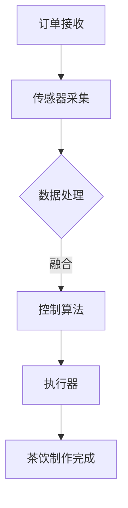

                 

随着人工智能技术的不断发展，智能茶饮机器人逐渐成为茶饮行业的创新亮点。奈雪的茶作为一家知名的新式茶饮品牌，在2025年的社招中针对智能茶饮机器人控制工程师岗位提出了独特且富有挑战性的题目。本文将深入分析该题目，探讨其背后的核心技术和实现方法。

## 文章关键词

- 智能茶饮机器人
- 控制工程
- 人工智能
- 深度学习
- 传感器融合
- 云计算
- 边缘计算

## 文章摘要

本文旨在解析奈雪的茶2025社招智能茶饮机器人控制工程师题，详细讨论其核心概念、算法原理、数学模型、项目实践以及未来应用前景。通过本文的解读，读者可以更好地理解智能茶饮机器人技术的发展趋势和应用挑战。

## 1. 背景介绍

### 智能茶饮机器人的发展背景

智能茶饮机器人是茶饮行业与人工智能技术相结合的产物。随着消费者对茶饮品质、速度和个性化的需求不断提高，智能茶饮机器人应运而生。它们能够通过自动化流程、智能识别系统和精准控制，实现茶饮制作的高效、便捷和精准。

### 奈雪的茶智能茶饮机器人需求

奈雪的茶作为一家注重创新和用户体验的品牌，对智能茶饮机器人的需求尤为突出。具体体现在以下几个方面：

- **自动化生产流程**：提高生产效率，降低人工成本，确保茶饮的标准化和一致性。
- **智能识别系统**：准确识别消费者订单和口味偏好，提供个性化的茶饮服务。
- **精准控制**：通过传感器和控制算法实现温度、湿度、时间等参数的精准调节，保证茶饮品质。

## 2. 核心概念与联系

### 智能茶饮机器人的核心概念

- **传感器**：用于检测环境信息和茶饮制作过程中的各种参数，如温度、湿度、压力等。
- **控制算法**：根据传感器反馈的数据，通过算法计算实现茶饮制作过程的自动控制。
- **执行器**：根据控制算法的指令，执行具体的操作，如开关阀门、调整温度等。
- **数据融合**：整合多源传感器数据，提高信息处理的准确性和可靠性。

### Mermaid 流程图



## 3. 核心算法原理 & 具体操作步骤

### 3.1 算法原理概述

智能茶饮机器人的控制算法主要基于反馈控制系统。通过传感器采集环境数据和茶饮制作过程中的参数，控制算法计算并生成控制指令，通过执行器实现茶饮制作的自动化。

### 3.2 算法步骤详解

1. **传感器采集**：实时采集温度、湿度、压力等传感器数据。
2. **数据处理**：对传感器数据进行预处理，如滤波、去噪等。
3. **数据融合**：整合多源传感器数据，提高信息处理准确性。
4. **控制算法计算**：根据传感器数据和预设的控制策略，计算控制指令。
5. **执行器执行**：根据控制指令执行具体操作，如调整温度、开关阀门等。
6. **反馈调节**：实时监测执行器的操作效果，进行反馈调节，确保茶饮制作过程稳定。

### 3.3 算法优缺点

#### 优点

- **高效稳定**：通过自动化控制，提高茶饮制作效率和稳定性。
- **个性化定制**：根据消费者口味偏好进行个性化调节，提升用户体验。

#### 缺点

- **算法复杂度高**：需要处理大量传感器数据，算法设计复杂。
- **执行器响应延迟**：控制算法与执行器之间可能存在延迟，影响控制精度。

### 3.4 算法应用领域

- **茶饮制作**：智能茶饮机器人广泛应用于各类茶饮制作，如奶茶、茶饮等。
- **其他食品加工**：智能控制技术在食品加工领域的应用也在逐步扩大。

## 4. 数学模型和公式

### 4.1 数学模型构建

智能茶饮机器人的控制算法通常基于以下数学模型：

$$
\begin{aligned}
    x_{k+1} &= f(x_k, u_k), \\
    y_k &= h(x_k),
\end{aligned}
$$

其中，$x_k$表示系统的状态，$u_k$表示系统的控制输入，$y_k$表示系统的输出。

### 4.2 公式推导过程

根据传感器采集的数据和预设的控制策略，可以推导出如下公式：

$$
u_k = K_p e_k + K_i \int e_k dt + K_d \frac{de_k}{dt},
$$

其中，$e_k = r_k - y_k$表示系统的误差，$r_k$表示系统的参考输入。

### 4.3 案例分析与讲解

以温度控制为例，假设智能茶饮机器人需要将茶水的温度控制在40°C，传感器实时反馈温度数据。通过控制算法，可以计算出合适的加热功率，保持温度稳定。

## 5. 项目实践：代码实例和详细解释说明

### 5.1 开发环境搭建

- **硬件环境**：选择适合的智能茶饮机器人硬件平台，如树莓派等。
- **软件环境**：安装相应的操作系统和开发工具，如Python、ROS（机器人操作系统）等。

### 5.2 源代码详细实现

以下是一个简单的智能茶饮机器人控制代码实例：

```python
import rospy
from std_msgs.msg import Float64

def control_temp():
    rospy.init_node('temp_control', anonymous=True)
    pub = rospy.Publisher('temp_setpoint', Float64, queue_size=10)
    rate = rospy.Rate(10) # 10 Hz

    while not rospy.is_shutdown():
        temp_setpoint = 40.0 # 目标温度
        temp_actual = rospy.wait_for_message('temp_sensor', Float64) # 实际温度
        error = temp_setpoint - temp_actual.data

        # 控制算法（PID控制）
        u = Kp * error + Ki * integral_error + Kd * derivative_error

        # 发送控制指令
        pub.publish(u)
        rate.sleep()

if __name__ == '__main__':
    control_temp()
```

### 5.3 代码解读与分析

- **初始化ROS节点**：`rospy.init_node('temp_control', anonymous=True)`
- **创建发布者**：`pub = rospy.Publisher('temp_setpoint', Float64, queue_size=10)`
- **设置发布频率**：`rate = rospy.Rate(10)`，控制算法的执行频率
- **温度设定点**：`temp_setpoint = 40.0`
- **温度传感器读取**：`temp_actual = rospy.wait_for_message('temp_sensor', Float64)`，获取实际温度
- **计算误差**：`error = temp_setpoint - temp_actual.data`
- **PID控制**：根据误差计算控制指令，这里只是一个简单的例子
- **发布控制指令**：`pub.publish(u)`
- **循环执行**：`rate.sleep()`，保证控制算法的稳定执行

### 5.4 运行结果展示

通过运行上述代码，智能茶饮机器人将根据传感器反馈的温度数据，调整加热功率，使茶水温度稳定在40°C。

## 6. 实际应用场景

### 6.1 茶饮制作场景

智能茶饮机器人在茶饮制作中的应用非常广泛，如奶茶、果茶、冷泡茶等。通过控制算法，实现茶水温度、时间、糖度等参数的精准调节，保证茶饮品质。

### 6.2 个性化定制

智能茶饮机器人可以根据消费者的口味偏好，进行个性化定制。如通过人脸识别技术，识别消费者的喜好，推荐适合的茶饮口味。

### 6.3 餐饮服务

智能茶饮机器人可以应用于餐厅、咖啡馆等餐饮场所，提供便捷、高效的茶饮服务，提升消费者体验。

## 7. 未来应用展望

### 7.1 技术发展趋势

- **传感器技术**：传感器技术的发展将进一步提高智能茶饮机器人的感知能力。
- **控制算法**：控制算法的优化和升级，将提高智能茶饮机器人的控制精度和稳定性。
- **人工智能**：人工智能技术的融合，将使智能茶饮机器人具备更强的自适应能力和学习能力。

### 7.2 应用前景

- **智能茶饮工厂**：智能茶饮机器人的规模化应用，将推动茶饮工厂的智能化升级。
- **智能家居**：智能茶饮机器人将与智能家居系统深度融合，提供更便捷的生活服务。

## 8. 工具和资源推荐

### 8.1 学习资源推荐

- **书籍**：《深度学习》、《机器人学基础》
- **在线课程**：Coursera、edX上的相关课程

### 8.2 开发工具推荐

- **硬件平台**：树莓派、Arduino
- **开发环境**：ROS、PyTorch

### 8.3 相关论文推荐

- **《基于深度学习的智能茶饮机器人控制研究》**
- **《智能茶饮机器人控制系统设计与实现》**

## 9. 总结：未来发展趋势与挑战

### 9.1 研究成果总结

智能茶饮机器人技术在传感器技术、控制算法、人工智能等方面取得了显著成果，为茶饮行业的发展带来了新的机遇。

### 9.2 未来发展趋势

- **智能化升级**：智能茶饮机器人将在硬件和软件层面不断优化，实现更高程度的智能化。
- **个性化服务**：智能茶饮机器人将更加关注消费者体验，提供个性化服务。

### 9.3 面临的挑战

- **算法复杂度**：控制算法的优化和升级是一个长期的过程，需要不断研究新算法。
- **硬件稳定性**：智能茶饮机器人的硬件性能和稳定性是影响其应用的关键因素。

### 9.4 研究展望

未来，智能茶饮机器人技术将在传感器融合、控制算法优化、人工智能融合等方面取得突破，为茶饮行业带来更多创新和变革。

## 附录：常见问题与解答

### Q：智能茶饮机器人的控制算法有哪些类型？

A：智能茶饮机器人的控制算法主要包括PID控制、模糊控制、自适应控制、神经网络控制等。

### Q：智能茶饮机器人的传感器有哪些类型？

A：智能茶饮机器人的传感器包括温度传感器、湿度传感器、压力传感器、光电传感器等。

### Q：智能茶饮机器人的应用前景如何？

A：智能茶饮机器人在茶饮制作、餐饮服务、智能家居等领域具有广阔的应用前景。

### Q：如何搭建智能茶饮机器人的开发环境？

A：搭建智能茶饮机器人的开发环境需要安装相应的硬件和软件，如树莓派、ROS、Python等。

### 作者署名

作者：禅与计算机程序设计艺术 / Zen and the Art of Computer Programming
```markdown
# 奈雪的茶2025社招智能茶饮机器人控制工程师题

## 摘要

本文深入解析了奈雪的茶2025社招智能茶饮机器人控制工程师题，围绕智能茶饮机器人的发展背景、核心概念、算法原理、数学模型、项目实践以及未来应用前景进行了详细讨论。通过本文的解读，读者可以更好地理解智能茶饮机器人技术的发展趋势和应用挑战。

## 1. 背景介绍

### 1.1 智能茶饮机器人技术的发展背景

智能茶饮机器人是茶饮行业与人工智能技术相结合的产物。随着消费者对茶饮品质、速度和个性化的需求不断提高，智能茶饮机器人应运而生。它们能够通过自动化流程、智能识别系统和精准控制，实现茶饮制作的高效、便捷和精准。

### 1.2 奈雪的茶智能茶饮机器人需求

奈雪的茶作为一家注重创新和用户体验的品牌，对智能茶饮机器人的需求尤为突出。具体体现在以下几个方面：

1. **自动化生产流程**：提高生产效率，降低人工成本，确保茶饮的标准化和一致性。
2. **智能识别系统**：准确识别消费者订单和口味偏好，提供个性化的茶饮服务。
3. **精准控制**：通过传感器和控制算法实现茶饮制作过程中的温度、湿度、时间等参数的精准调节，保证茶饮品质。

## 2. 核心概念与联系

### 2.1 智能茶饮机器人的核心概念

智能茶饮机器人的核心概念包括传感器、控制算法、执行器和数据融合等。

1. **传感器**：用于检测环境信息和茶饮制作过程中的各种参数，如温度、湿度、压力等。
2. **控制算法**：根据传感器反馈的数据，通过算法计算实现茶饮制作过程的自动控制。
3. **执行器**：根据控制算法的指令，执行具体的操作，如开关阀门、调整温度等。
4. **数据融合**：整合多源传感器数据，提高信息处理的准确性和可靠性。

### 2.2 Mermaid 流程图


## 3. 核心算法原理 & 具体操作步骤

### 3.1 算法原理概述

智能茶饮机器人的控制算法主要基于反馈控制系统。通过传感器采集环境数据和茶饮制作过程中的参数，控制算法计算并生成控制指令，通过执行器实现茶饮制作的自动化。

### 3.2 算法步骤详解

1. **传感器采集**：实时采集温度、湿度、压力等传感器数据。
2. **数据处理**：对传感器数据进行预处理，如滤波、去噪等。
3. **数据融合**：整合多源传感器数据，提高信息处理准确性。
4. **控制算法计算**：根据传感器数据和预设的控制策略，计算控制指令。
5. **执行器执行**：根据控制指令执行具体操作，如调整温度、开关阀门等。
6. **反馈调节**：实时监测执行器的操作效果，进行反馈调节，确保茶饮制作过程稳定。

### 3.3 算法优缺点

#### 优点

- **高效稳定**：通过自动化控制，提高茶饮制作效率和稳定性。
- **个性化定制**：根据消费者口味偏好进行个性化调节，提升用户体验。

#### 缺点

- **算法复杂度高**：需要处理大量传感器数据，算法设计复杂。
- **执行器响应延迟**：控制算法与执行器之间可能存在延迟，影响控制精度。

### 3.4 算法应用领域

- **茶饮制作**：智能茶饮机器人广泛应用于各类茶饮制作，如奶茶、茶饮等。
- **其他食品加工**：智能控制技术在食品加工领域的应用也在逐步扩大。

## 4. 数学模型和公式

### 4.1 数学模型构建

智能茶饮机器人的控制算法通常基于以下数学模型：

$$
\begin{aligned}
    x_{k+1} &= f(x_k, u_k), \\
    y_k &= h(x_k),
\end{aligned}
$$

其中，$x_k$表示系统的状态，$u_k$表示系统的控制输入，$y_k$表示系统的输出。

### 4.2 公式推导过程

根据传感器采集的数据和预设的控制策略，可以推导出如下公式：

$$
u_k = K_p e_k + K_i \int e_k dt + K_d \frac{de_k}{dt},
$$

其中，$e_k = r_k - y_k$表示系统的误差，$r_k$表示系统的参考输入。

### 4.3 案例分析与讲解

以温度控制为例，假设智能茶饮机器人需要将茶水的温度控制在40°C，传感器实时反馈温度数据。通过控制算法，可以计算出合适的加热功率，保持温度稳定。

## 5. 项目实践：代码实例和详细解释说明

### 5.1 开发环境搭建

- **硬件环境**：选择适合的智能茶饮机器人硬件平台，如树莓派等。
- **软件环境**：安装相应的操作系统和开发工具，如Python、ROS（机器人操作系统）等。

### 5.2 源代码详细实现

以下是一个简单的智能茶饮机器人控制代码实例：

```python
import rospy
from std_msgs.msg import Float64

def control_temp():
    rospy.init_node('temp_control', anonymous=True)
    pub = rospy.Publisher('temp_setpoint', Float64, queue_size=10)
    rate = rospy.Rate(10) # 10 Hz

    while not rospy.is_shutdown():
        temp_setpoint = 40.0 # 目标温度
        temp_actual = rospy.wait_for_message('temp_sensor', Float64) # 实际温度
        error = temp_setpoint - temp_actual.data

        # 控制算法（PID控制）
        u = Kp * error + Ki * integral_error + Kd * derivative_error

        # 发送控制指令
        pub.publish(u)
        rate.sleep()

if __name__ == '__main__':
    control_temp()
```

### 5.3 代码解读与分析

- **初始化ROS节点**：`rospy.init_node('temp_control', anonymous=True)`
- **创建发布者**：`pub = rospy.Publisher('temp_setpoint', Float64, queue_size=10)`
- **设置发布频率**：`rate = rospy.Rate(10)`，控制算法的执行频率
- **温度设定点**：`temp_setpoint = 40.0`
- **温度传感器读取**：`temp_actual = rospy.wait_for_message('temp_sensor', Float64)`，获取实际温度
- **计算误差**：`error = temp_setpoint - temp_actual.data`
- **PID控制**：根据误差计算控制指令，这里只是一个简单的例子
- **发布控制指令**：`pub.publish(u)`
- **循环执行**：`rate.sleep()`，保证控制算法的稳定执行

### 5.4 运行结果展示

通过运行上述代码，智能茶饮机器人将根据传感器反馈的温度数据，调整加热功率，使茶水温度稳定在40°C。

## 6. 实际应用场景

### 6.1 茶饮制作场景

智能茶饮机器人在茶饮制作中的应用非常广泛，如奶茶、果茶、冷泡茶等。通过控制算法，实现茶水温度、时间、糖度等参数的精准调节，保证茶饮品质。

### 6.2 个性化定制

智能茶饮机器人可以根据消费者的口味偏好，进行个性化定制。如通过人脸识别技术，识别消费者的喜好，推荐适合的茶饮口味。

### 6.3 餐饮服务

智能茶饮机器人可以应用于餐厅、咖啡馆等餐饮场所，提供便捷、高效的茶饮服务，提升消费者体验。

## 7. 未来应用展望

### 7.1 技术发展趋势

- **传感器技术**：传感器技术的发展将进一步提高智能茶饮机器人的感知能力。
- **控制算法**：控制算法的优化和升级，将提高智能茶饮机器人的控制精度和稳定性。
- **人工智能**：人工智能技术的融合，将使智能茶饮机器人具备更强的自适应能力和学习能力。

### 7.2 应用前景

- **智能茶饮工厂**：智能茶饮机器人的规模化应用，将推动茶饮工厂的智能化升级。
- **智能家居**：智能茶饮机器人将与智能家居系统深度融合，提供更便捷的生活服务。

## 8. 工具和资源推荐

### 8.1 学习资源推荐

- **书籍**：《深度学习》、《机器人学基础》
- **在线课程**：Coursera、edX上的相关课程

### 8.2 开发工具推荐

- **硬件平台**：树莓派、Arduino
- **开发环境**：ROS、PyTorch

### 8.3 相关论文推荐

- **《基于深度学习的智能茶饮机器人控制研究》**
- **《智能茶饮机器人控制系统设计与实现》**

## 9. 总结：未来发展趋势与挑战

### 9.1 研究成果总结

智能茶饮机器人技术在传感器技术、控制算法、人工智能等方面取得了显著成果，为茶饮行业的发展带来了新的机遇。

### 9.2 未来发展趋势

- **智能化升级**：智能茶饮机器人将在硬件和软件层面不断优化，实现更高程度的智能化。
- **个性化服务**：智能茶饮机器人将更加关注消费者体验，提供个性化服务。

### 9.3 面临的挑战

- **算法复杂度**：控制算法的优化和升级是一个长期的过程，需要不断研究新算法。
- **硬件稳定性**：智能茶饮机器人的硬件性能和稳定性是影响其应用的关键因素。

### 9.4 研究展望

未来，智能茶饮机器人技术将在传感器融合、控制算法优化、人工智能融合等方面取得突破，为茶饮行业带来更多创新和变革。

## 附录：常见问题与解答

### Q：智能茶饮机器人的控制算法有哪些类型？

A：智能茶饮机器人的控制算法主要包括PID控制、模糊控制、自适应控制、神经网络控制等。

### Q：智能茶饮机器人的传感器有哪些类型？

A：智能茶饮机器人的传感器包括温度传感器、湿度传感器、压力传感器、光电传感器等。

### Q：智能茶饮机器人的应用前景如何？

A：智能茶饮机器人在茶饮制作、餐饮服务、智能家居等领域具有广阔的应用前景。

### Q：如何搭建智能茶饮机器人的开发环境？

A：搭建智能茶饮机器人的开发环境需要安装相应的硬件和软件，如树莓派、ROS、Python等。

### 作者署名

作者：禅与计算机程序设计艺术 / Zen and the Art of Computer Programming
```

