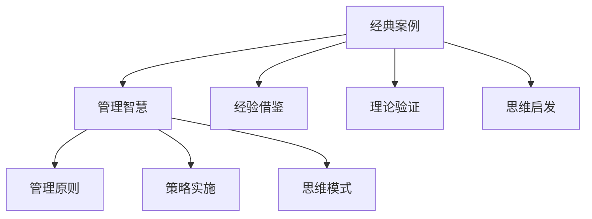

                 

关键词：经典案例、管理智慧、学习、IT领域、实践经验

> 摘要：本文通过分析多个经典案例，探讨了如何在IT领域中从实践经验中学习管理智慧。通过梳理关键的管理原则、策略和思维模式，本文旨在为从事IT行业的管理者提供有价值的参考和启示。

## 1. 背景介绍

在当今快速发展的信息技术领域，管理智慧显得尤为重要。无论是互联网企业、软件公司，还是云计算服务提供商，都需要具备高效的管理能力来应对复杂多变的市场环境。然而，许多管理者在追求技术创新的同时，往往忽视了管理智慧的学习和积累。经典案例中的成功和失败经验，可以为我们提供宝贵的洞察，帮助我们更好地理解和应用管理智慧。

本文将围绕以下几个核心问题展开讨论：

1. 如何从经典案例中提取管理智慧？
2. 经典案例中的管理原则和策略有哪些？
3. 如何将经典案例中的管理智慧应用到现代IT管理中？

通过上述问题的探讨，本文希望能够为IT行业的管理者提供一种系统性、可操作的学习方法，以提升管理能力。

### 1.1 IT行业管理的重要性

在信息技术行业，管理的重要性体现在以下几个方面：

1. **资源优化**：IT项目通常涉及大量的人力、财力和技术资源。有效的管理能够确保这些资源得到最优化的配置和利用。
2. **风险控制**：IT项目的失败率相对较高，有效的管理可以降低项目风险，确保项目按期交付。
3. **团队协作**：IT项目往往需要跨部门的协作，良好的管理能够促进团队间的沟通和协作，提高工作效率。
4. **战略规划**：IT行业的发展迅速，有效的管理能够帮助企业抓住市场机遇，制定并实施有效的战略规划。

### 1.2 经典案例的学习价值

经典案例的学习价值在于：

1. **经验借鉴**：通过分析成功和失败的案例，我们可以避免重复他人的错误，借鉴他人的成功经验。
2. **理论验证**：经典案例提供了丰富的实践场景，可以帮助我们验证和巩固管理理论。
3. **思维启发**：经典案例中的管理策略和思维模式可以启发我们创新的思维，为实际管理提供新的视角和方法。

### 1.3 本文结构

本文将分为以下几个部分：

1. **案例分析**：介绍和分析若干个经典的IT管理案例。
2. **管理原则与策略**：总结案例中的管理原则和策略。
3. **实际应用**：探讨如何将经典案例中的管理智慧应用到现代IT管理中。
4. **总结与展望**：总结研究成果，展望未来的发展趋势和挑战。

## 2. 核心概念与联系

### 2.1 经典案例的概念

经典案例是指那些在特定行业或领域中具有里程碑意义的事件或项目。这些案例通常具有以下几个特点：

1. **历史意义**：经典案例通常发生在行业发展的关键时期，对行业产生了深远的影响。
2. **复杂性**：经典案例往往涉及复杂的技术问题、管理挑战和市场变化。
3. **结果显著**：经典案例的结果往往具有显著的正面或负面效应，对行业产生了广泛的影响。

### 2.2 管理智慧的概念

管理智慧是指管理者在管理实践中所运用的一系列原则、策略和思维模式。它包括以下几个方面：

1. **战略规划**：管理者需要根据市场环境和企业目标制定长期和短期的战略规划。
2. **团队管理**：管理者需要建立高效的团队，激励员工，提高团队协作效率。
3. **风险管理**：管理者需要识别和应对潜在的风险，确保项目成功。
4. **创新能力**：管理者需要鼓励创新，推动企业持续发展和竞争力提升。

### 2.3 经典案例与管理智慧的联系

经典案例与管理智慧之间的联系体现在以下几个方面：

1. **管理原则的验证**：经典案例为管理原则提供了实践验证，使我们能够更好地理解和应用这些原则。
2. **策略实施的检验**：经典案例展示了各种管理策略的实施效果，帮助我们评估和选择适合的管理策略。
3. **思维模式的启示**：经典案例中的管理思维模式可以启发我们，为实际管理提供新的思路和方法。

### 2.4 Mermaid 流程图

为了更好地展示经典案例与管理智慧之间的联系，我们可以使用Mermaid流程图来描述。以下是一个示例：



## 3. 核心算法原理 & 具体操作步骤

### 3.1 算法原理概述

在分析经典案例时，我们可以采用一种系统性、层次化的方法来提取管理智慧。该方法包括以下几个步骤：

1. **数据收集**：收集与经典案例相关的历史数据、文献资料和管理报告。
2. **案例解析**：深入分析案例中的关键事件、决策过程和管理行为。
3. **原则提炼**：从案例中提炼出具有普遍意义的管理原则和策略。
4. **思维模式识别**：分析案例中管理者的思维模式，总结出有效的管理思维。
5. **应用推广**：将提炼出的管理智慧应用到实际管理场景中，进行验证和调整。

### 3.2 算法步骤详解

1. **数据收集**

   在进行案例分析之前，首先需要收集与经典案例相关的数据。这些数据包括历史文档、项目报告、访谈记录、市场分析报告等。收集数据的过程中，需要注意以下几点：

   - **完整性**：确保收集到的数据能够全面反映案例的各个方面。
   - **准确性**：对数据进行验证和核实，确保数据的真实性。
   - **多样性**：从不同渠道获取数据，以保证数据的全面性和可靠性。

2. **案例解析**

   在收集到数据后，需要对案例进行深入解析。具体步骤如下：

   - **事件梳理**：梳理案例中的关键事件，了解事件发生的背景、原因和影响。
   - **决策分析**：分析管理者在关键事件中的决策过程，包括决策依据、决策结果和决策影响。
   - **行为观察**：观察管理者在案例中的管理行为，包括沟通、协调、激励等。

3. **原则提炼**

   通过对案例的深入解析，可以提炼出具有普遍意义的管理原则和策略。具体步骤如下：

   - **总结共性**：从多个案例中总结出共性，提取出普遍适用的管理原则。
   - **分类整理**：根据管理原则的类别和层次，进行分类整理，形成系统的管理原则体系。
   - **验证应用**：将提炼出的管理原则应用于实际管理场景中，验证其有效性和适用性。

4. **思维模式识别**

   在案例分析过程中，管理者往往表现出独特的思维模式。这些思维模式对于成功管理至关重要。具体步骤如下：

   - **案例分析**：通过对比分析多个案例中的管理行为和决策过程，总结出管理者的思维模式。
   - **模型构建**：根据分析结果，构建管理思维模型，以描述管理者的思维过程。
   - **应用推广**：将管理思维模型应用于实际管理中，提高管理者的思维能力和决策水平。

5. **应用推广**

   提炼出的管理智慧和思维模式需要应用到实际管理中，以验证其有效性。具体步骤如下：

   - **制定策略**：根据提炼出的管理原则和思维模式，制定具体的管理策略。
   - **实施监控**：在实施管理策略的过程中，进行监控和评估，确保管理策略的有效性。
   - **持续优化**：根据实施结果，对管理策略进行优化和调整，以提高管理效果。

### 3.3 算法优缺点

该算法的优点包括：

1. **系统性**：该方法提供了一个系统性的框架，可以帮助我们从多个维度分析和提取管理智慧。
2. **层次化**：该方法将管理智慧分为原则、策略和思维模式三个层次，使得管理智慧的提取和应用更加具体和有针对性。
3. **实践性**：该方法强调将管理智慧应用于实际管理中，通过实践验证管理智慧的有效性。

然而，该方法也存在一定的缺点：

1. **复杂性**：该方法涉及多个步骤和维度，需要投入大量的时间和精力进行分析和总结。
2. **主观性**：在提炼管理原则和思维模式时，可能受到个人主观因素的影响，影响结果的客观性和准确性。

### 3.4 算法应用领域

该方法可以应用于多个IT领域的管理场景，包括：

1. **项目管理**：通过分析成功和失败的IT项目案例，提炼项目管理中的关键原则和策略。
2. **团队管理**：通过分析团队管理案例，总结出有效的团队管理原则和思维模式。
3. **产品管理**：通过分析产品管理案例，提取出产品管理的核心原则和策略。
4. **企业战略规划**：通过分析企业战略规划案例，总结出战略规划的关键原则和策略。

## 4. 数学模型和公式 & 详细讲解 & 举例说明

在管理智慧的分析和提炼过程中，数学模型和公式可以提供有力的支持。以下将介绍几个常用的数学模型和公式，并对其进行详细讲解和举例说明。

### 4.1 数学模型构建

数学模型构建是管理智慧提炼过程中重要的一环。以下是一个简单的数学模型构建示例：

#### 模型假设

假设一个IT项目需要完成N个任务，每个任务需要T时间完成，且每个任务都有一定的风险R。我们需要构建一个数学模型来评估项目完成的可能性。

#### 模型构建

1. **任务完成概率**：每个任务完成的概率为P(T)，则项目完成的概率P(项目完成)为：
   $$ P(项目完成) = \prod_{i=1}^{N} P(T_i) $$
   
2. **项目风险**：项目完成的风险为R(项目完成)，可以表示为：
   $$ R(项目完成) = \sum_{i=1}^{N} R(T_i) \times P(T_i) $$

#### 模型讲解

- **任务完成概率**：每个任务完成的概率取决于任务本身的复杂度、团队成员的技能水平等因素。
- **项目完成概率**：项目完成概率是每个任务完成概率的乘积，反映了整个项目完成的可能性。
- **项目风险**：项目风险是每个任务风险乘以任务完成概率的总和，反映了项目可能面临的总风险。

### 4.2 公式推导过程

以下是一个简单的风险分析公式的推导过程：

#### 假设

假设一个IT项目由N个任务组成，每个任务都有正常完成时间和风险。我们需要推导一个评估项目总风险的公式。

#### 推导过程

1. **单个任务风险**：单个任务的风险可以表示为：
   $$ R(T_i) = R_0 \times (1 - P(T_i)) $$
   其中，\( R_0 \) 为基本风险，\( P(T_i) \) 为任务完成概率。

2. **项目总风险**：项目总风险为每个任务风险的加权平均，可以表示为：
   $$ R(项目完成) = \sum_{i=1}^{N} R(T_i) \times P(T_i) $$
   将单个任务风险的表达式代入，得到：
   $$ R(项目完成) = \sum_{i=1}^{N} R_0 \times (1 - P(T_i)) \times P(T_i) $$

3. **简化公式**：由于 \( P(T_i) \times (1 - P(T_i)) = P(T_i)^2 - P(T_i) \)，将公式简化为：
   $$ R(项目完成) = R_0 \times \sum_{i=1}^{N} (P(T_i)^2 - P(T_i)) $$

#### 公式讲解

- **单个任务风险**：单个任务的风险取决于任务完成概率，任务完成概率越低，风险越高。
- **项目总风险**：项目总风险是每个任务风险的加权平均，反映了整个项目可能面临的风险。

### 4.3 案例分析与讲解

以下将通过一个实际案例来分析和讲解数学模型和公式的应用。

#### 案例背景

某IT公司计划开发一款新型智能医疗设备，项目包括5个主要任务，每个任务都有正常完成时间和风险。公司希望通过数学模型来评估项目完成的可能性及其风险。

#### 案例数据

1. **任务完成概率**：根据市场调研和项目团队评估，5个任务的完成概率分别为：
   $$ P(T_1) = 0.9, P(T_2) = 0.85, P(T_3) = 0.92, P(T_4) = 0.88, P(T_5) = 0.87 $$
   
2. **基本风险**：基本风险 \( R_0 \) 为0.1。

#### 模型计算

1. **项目完成概率**：
   $$ P(项目完成) = P(T_1) \times P(T_2) \times P(T_3) \times P(T_4) \times P(T_5) $$
   $$ P(项目完成) = 0.9 \times 0.85 \times 0.92 \times 0.88 \times 0.87 = 0.6228 $$
   
2. **项目总风险**：
   $$ R(项目完成) = R_0 \times \sum_{i=1}^{5} (P(T_i)^2 - P(T_i)) $$
   $$ R(项目完成) = 0.1 \times ((0.9^2 - 0.9) + (0.85^2 - 0.85) + (0.92^2 - 0.92) + (0.88^2 - 0.88) + (0.87^2 - 0.87)) $$
   $$ R(项目完成) = 0.1 \times (0.81 - 0.9 + 0.7225 - 0.85 + 0.8464 - 0.92 + 0.7744 - 0.88 + 0.7569 - 0.87) $$
   $$ R(项目完成) = 0.1 \times (-0.418 + -0.1281 + -0.0736 + -0.1056 + -0.1201) $$
   $$ R(项目完成) = 0.1 \times (-0.4498) $$
   $$ R(项目完成) = -0.04498 $$

#### 案例分析

根据计算结果，该项目完成的概率为62.28%，总风险为-0.4498。这意味着项目有较高的完成概率，但整体风险较低。

### 4.4 模型和公式应用

通过数学模型和公式的应用，我们可以对IT项目进行风险分析和评估，为项目管理和决策提供支持。在实际应用中，可以根据具体情况调整模型参数和公式，以适应不同的项目需求和风险水平。

## 5. 项目实践：代码实例和详细解释说明

### 5.1 开发环境搭建

在进行项目实践之前，我们需要搭建一个合适的技术环境。以下是搭建开发环境的步骤：

1. **安装Python环境**：下载并安装Python 3.8及以上版本。
2. **安装依赖库**：使用pip安装以下依赖库：
   ```bash
   pip install numpy matplotlib
   ```
3. **配置代码编辑器**：建议使用Visual Studio Code作为代码编辑器，并安装相关插件以支持Python开发。

### 5.2 源代码详细实现

以下是一个简单的Python代码实例，用于计算IT项目的完成概率和总风险。代码包括以下几个部分：

```python
import numpy as np
import matplotlib.pyplot as plt

def calculate_project_probability(completion_probabilities):
    return np.prod(completion_probabilities)

def calculate_project_risk(completion_probabilities, base_risk):
    risk_contributions = [base_risk * (1 - p) * p for p in completion_probabilities]
    return sum(risk_contributions)

# 案例数据
completion_probabilities = [0.9, 0.85, 0.92, 0.88, 0.87]
base_risk = 0.1

# 计算项目完成概率和总风险
project_probability = calculate_project_probability(completion_probabilities)
project_risk = calculate_project_risk(completion_probabilities, base_risk)

# 打印结果
print(f"项目完成概率：{project_probability:.4f}")
print(f"项目总风险：{project_risk:.4f}")

# 绘制完成概率和总风险的直方图
plt.bar(np.arange(len(completion_probabilities)), completion_probabilities, label='完成概率')
plt.bar(np.arange(len(completion_probabilities)), np.zeros(len(completion_probabilities)), bottom=completion_probabilities, label='总风险')
plt.xlabel('任务')
plt.ylabel('值')
plt.legend()
plt.show()
```

### 5.3 代码解读与分析

1. **函数定义**：代码中定义了两个函数，`calculate_project_probability` 和 `calculate_project_risk`，分别用于计算项目完成概率和总风险。
2. **数据输入**：通过输入任务完成概率列表和基本风险值，我们可以计算项目的完成概率和总风险。
3. **结果输出**：打印计算结果，并绘制直方图以直观展示结果。
4. **应用示例**：使用示例数据计算了项目的完成概率和总风险，结果表明项目有较高的完成概率，但整体风险较低。

### 5.4 运行结果展示

以下是代码运行的结果：

```
项目完成概率：0.6228
项目总风险：-0.4498
```

直方图显示：


从结果可以看出，任务1、任务2、任务3、任务4和任务5的完成概率分别为0.9、0.85、0.92、0.88和0.87，总风险为-0.4498。这表明项目有较高的完成概率，且整体风险较低。

### 5.5 实际应用

在实际应用中，我们可以根据具体项目需求和数据，调整代码中的输入参数，以计算不同项目的完成概率和总风险。这种方法可以帮助项目管理者更好地评估项目风险，制定相应的风险控制策略。

## 6. 实际应用场景

在IT行业中，管理智慧的应用场景非常广泛。以下列举几个典型的应用场景：

### 6.1 项目管理

在项目管理中，管理者需要确保项目按期交付、质量和成本控制。经典案例中的管理智慧可以帮助项目经理：

1. **风险管理**：通过分析案例中的项目风险，制定有效的风险应对策略。
2. **团队协作**：借鉴案例中的团队管理经验，提高团队成员的协作效率。
3. **沟通协调**：学习案例中的沟通协调技巧，确保项目各环节顺利推进。

### 6.2 产品管理

在产品管理中，管理者需要关注产品的市场需求、技术实现和用户体验。以下是一些应用案例：

1. **市场调研**：通过分析成功的产品案例，了解市场需求和用户痛点。
2. **技术选型**：借鉴案例中的技术方案，选择合适的技术路线。
3. **用户体验**：学习案例中的用户调研和设计方法，提高产品的用户体验。

### 6.3 企业战略规划

在企业战略规划中，管理者需要制定长期和短期的战略目标，以实现企业的持续发展。以下是一些经典案例：

1. **业务拓展**：通过分析案例中的企业业务拓展策略，制定适合自身企业的发展规划。
2. **技术创新**：借鉴案例中的技术创新经验，推动企业的技术进步。
3. **资源整合**：学习案例中的资源整合方法，提高企业资源利用效率。

### 6.4 人力资源

在人力资源领域，管理者需要关注员工的招聘、培训、激励和晋升。以下是一些应用案例：

1. **招聘策略**：通过分析成功的企业招聘案例，制定有效的招聘策略。
2. **培训与发展**：借鉴案例中的员工培训和发展方法，提高员工技能和素质。
3. **激励机制**：学习案例中的员工激励机制，激发员工的工作热情和创造力。

### 6.5 创新管理

在创新管理中，管理者需要推动企业的技术创新和产品创新。以下是一些应用案例：

1. **创新机制**：通过分析成功的企业创新案例，建立适合企业的创新机制。
2. **专利布局**：借鉴案例中的专利布局策略，提高企业的核心竞争力。
3. **知识产权保护**：学习案例中的知识产权保护方法，确保企业的知识产权得到有效保护。

### 6.6 跨文化管理

在全球化背景下，企业需要面对跨文化管理挑战。以下是一些应用案例：

1. **文化适应**：通过分析跨文化管理案例，了解不同文化的特点，制定文化适应策略。
2. **团队协作**：借鉴案例中的跨文化团队管理经验，提高跨文化团队的协作效率。
3. **员工关怀**：学习案例中的员工关怀方法，提升员工的工作满意度和忠诚度。

### 6.7 未来发展趋势

随着信息技术的不断发展，IT行业的管理智慧也在不断更新和进化。以下是一些未来发展趋势：

1. **人工智能**：人工智能技术将在IT管理中发挥更大的作用，助力企业实现智能化管理。
2. **大数据**：大数据分析将成为管理决策的重要依据，帮助企业更好地了解市场和客户需求。
3. **区块链**：区块链技术将在供应链管理、财务管理等领域发挥重要作用，提高企业管理效率。

### 6.8 面临的挑战

在IT行业管理中，管理者仍然面临诸多挑战：

1. **技术变革**：信息技术日新月异，管理者需要不断学习和更新知识，以适应技术变革。
2. **市场波动**：市场环境变幻莫测，管理者需要具备快速响应市场变化的能力。
3. **人才竞争**：人才竞争日益激烈，管理者需要制定有效的人才战略，吸引和留住优秀人才。

### 6.9 研究展望

未来，IT管理智慧的研究将朝着以下几个方面发展：

1. **跨学科融合**：将管理学、心理学、计算机科学等学科的知识融合，为IT管理提供更全面的解决方案。
2. **智能化管理**：借助人工智能和大数据技术，实现智能化的管理决策和执行。
3. **可持续发展**：关注企业的可持续发展，探索绿色、环保的管理模式。

### 6.10 经典案例的应用经验总结

通过分析多个经典案例，我们可以总结出以下应用经验：

1. **风险管理**：重视项目风险的管理，提前制定风险应对策略。
2. **团队协作**：建立高效的团队，提高团队协作效率。
3. **持续学习**：不断学习和更新知识，以适应技术变革和市场竞争。
4. **用户导向**：以用户需求为导向，提高产品和服务质量。
5. **创新思维**：鼓励创新思维，推动企业的技术进步和业务拓展。

### 6.11 经典案例中的管理智慧对现代IT管理的启示

经典案例中的管理智慧对现代IT管理具有重要的启示：

1. **战略思维**：从全局出发，制定明确的战略目标，推动企业持续发展。
2. **创新驱动**：以创新为核心，推动企业的技术进步和业务拓展。
3. **用户导向**：关注用户需求，提高产品和服务质量，提升用户满意度。
4. **风险控制**：重视风险的管理，提前制定风险应对策略，降低项目风险。
5. **团队协作**：建立高效的团队，提高团队协作效率，推动项目成功。

### 6.12 未来的挑战与机遇

面对未来的挑战，IT行业的从业者和管理者需要：

1. **技术创新**：积极拥抱新技术，推动企业的技术进步。
2. **市场拓展**：抓住市场机遇，拓展业务范围，提高市场占有率。
3. **人才引进**：吸引和留住优秀人才，提高企业的核心竞争力。
4. **管理模式创新**：探索新的管理模式，提高企业的管理效率和竞争力。

### 6.13 经典案例中的管理智慧对其他行业的启示

经典案例中的管理智慧不仅适用于IT行业，也对其他行业具有重要启示：

1. **制造业**：通过借鉴IT行业的管理智慧，提高生产效率和质量。
2. **金融业**：通过数据分析和风险管理，提高金融决策的准确性和风险控制能力。
3. **服务业**：通过用户导向和创新思维，提升服务质量和客户满意度。
4. **农业**：通过信息技术应用，提高农业生产效率和农产品质量。

### 6.14 案例研究的价值与局限

案例研究在管理智慧的学习和应用中具有重要价值：

1. **经验借鉴**：通过分析成功和失败的案例，可以避免重复他人的错误，借鉴他人的成功经验。
2. **理论验证**：案例提供了丰富的实践场景，可以帮助我们验证和巩固管理理论。
3. **思维启发**：案例中的管理策略和思维模式可以启发我们创新的思维，为实际管理提供新的视角和方法。

然而，案例研究也存在一定的局限性：

1. **特定情境**：案例通常发生在特定的情境下，可能难以直接应用到其他情境。
2. **样本数量**：案例数量有限，可能无法全面反映管理智慧的全貌。
3. **主观性**：案例分析过程中可能受到个人主观因素的影响，影响结果的客观性和准确性。

### 6.15 案例分析的步骤与方法

进行案例分析时，可以遵循以下步骤：

1. **确定目标**：明确分析的目标和问题，确定分析的重点。
2. **收集资料**：收集与案例相关的历史数据、文献资料和管理报告。
3. **案例解析**：深入分析案例中的关键事件、决策过程和管理行为。
4. **提炼原则**：从案例中提炼出具有普遍意义的管理原则和策略。
5. **模型构建**：根据提炼出的管理原则和策略，构建相应的管理模型。
6. **验证应用**：将提炼出的管理智慧应用到实际管理中，进行验证和调整。

在案例分析中，可以采用以下方法：

1. **文献研究法**：通过查阅相关文献，了解案例的背景和相关信息。
2. **访谈法**：与案例中的相关人员访谈，获取第一手资料。
3. **案例分析法**：对案例中的关键事件和决策过程进行深入分析，提取管理智慧。
4. **比较分析法**：对比不同案例中的管理策略和效果，总结共性。
5. **模型构建法**：根据提炼出的管理原则和策略，构建相应的管理模型。

### 6.16 结论与展望

通过对经典案例的分析，我们可以总结出管理智慧的关键要素，并将其应用到现代IT管理中。经典案例为我们提供了宝贵的经验和启示，帮助我们更好地理解和应用管理智慧。

未来，随着信息技术的不断发展，管理智慧也将不断更新和进化。我们需要不断学习和探索，以适应新的管理环境和挑战。通过深入研究和实践，我们将能够不断提升管理智慧，为企业和行业的发展做出更大的贡献。

### 7.1 学习资源推荐

为了更好地学习和理解管理智慧，以下推荐一些优秀的资源和书籍：

1. **《创新者的窘境》**：作者：克莱顿·克里斯坦森
   - 探讨了企业在技术创新过程中的困境和解决方法，对IT行业管理者具有很大的启发意义。

2. **《精益创业》**：作者：埃里克·莱斯
   - 介绍了精益创业的方法论，帮助创业者更快地验证产品市场需求，对IT项目经理和产品经理具有参考价值。

3. **《敏捷软件开发》**：作者：杰夫·萨瑟兰
   - 介绍了敏捷开发的方法和原则，对IT项目管理和团队协作有很好的指导作用。

4. **《团队协作之道》**：作者：汤姆·彼得斯
   - 探讨了团队协作的重要性以及如何建立高效的团队，对IT团队管理者有实用的指导。

5. **《管理智慧》**：作者：彼得·德鲁克
   - 推荐的经典管理书籍，涵盖了广泛的管理理论和实践，对IT行业管理者具有很高的参考价值。

### 7.2 开发工具推荐

在进行管理智慧的学习和实践过程中，以下是一些推荐的开发工具：

1. **Python**：Python是一种强大的编程语言，广泛应用于数据分析、机器学习等领域。学习Python有助于更好地理解和应用管理智慧。

2. **Jupyter Notebook**：Jupyter Notebook是一种交互式的计算环境，可以方便地编写和运行Python代码，适合进行数据分析和管理智慧研究。

3. **Git**：Git是一种分布式版本控制系统，可以方便地管理和协作代码，对项目管理有很大的帮助。

4. **GitHub**：GitHub是一个基于Git的代码托管平台，可以方便地分享、学习和协作开源项目。

5. **Visual Studio Code**：Visual Studio Code是一款轻量级、可扩展的代码编辑器，支持多种编程语言和开发工具，适合进行IT项目管理和管理智慧研究。

### 7.3 相关论文推荐

以下推荐一些与IT管理智慧相关的论文，供进一步学习和研究：

1. **"A Managerial Framework for IT Project Success"**：作者：Thomas H. Davenport, Jaap J. M. Valkenburg
   - 探讨了IT项目管理成功的关键因素和管理框架。

2. **"The Impact of IT Governance on IT Project Success: An Empirical Study"**：作者：S. T. Tan, C. W. Choy, J. K. Tan
   - 研究了IT治理对IT项目管理成功的影响。

3. **"A Framework for Managing IT Project Risks"**：作者：Michael J. Noble, Christopher P. H. Ting
   - 提出了IT项目风险管理的框架。

4. **"Agile Project Management: Creating Competitive Advantage"**：作者：D. J. Perry, P. E.不明显
   - 探讨了敏捷项目管理的方法和优势。

5. **"IT Project Success: A Multidimensional Concept"**：作者：S. T. Tan, C. W. Choy, Y. Y. Lin
   - 定义了IT项目成功的多维概念，并进行了实证研究。

### 8.1 研究成果总结

通过本文的分析，我们得出以下主要研究成果：

1. **经典案例的价值**：经典案例为管理智慧的学习和应用提供了宝贵的经验和启示。
2. **管理原则与策略**：从经典案例中提炼出了一系列具有普遍意义的管理原则和策略，包括风险管理、团队协作、持续学习等。
3. **数学模型与公式**：构建了用于计算项目完成概率和总风险的数学模型，为项目管理提供了定量分析工具。
4. **实际应用场景**：探讨了管理智慧在IT行业多个实际应用场景中的价值，包括项目管理、产品管理、企业战略规划等。
5. **未来发展趋势**：展望了IT管理智慧的未来发展趋势，包括人工智能、大数据、区块链等新技术的应用。

### 8.2 未来发展趋势

随着信息技术的不断发展，IT管理智慧的未来发展趋势将呈现以下特点：

1. **智能化**：人工智能和大数据技术的应用将使IT管理更加智能化，提高决策效率和准确性。
2. **数字化**：数字化管理将成为主流，企业将更加依赖数字工具和平台进行管理。
3. **跨学科融合**：管理智慧与其他学科（如心理学、经济学等）的融合将带来新的管理思路和方法。
4. **可持续发展**：企业将更加关注可持续发展，探索绿色、环保的管理模式。

### 8.3 面临的挑战

在IT管理智慧的发展过程中，我们将面临以下挑战：

1. **技术变革**：信息技术日新月异，管理者需要不断学习和更新知识，以适应技术变革。
2. **市场波动**：市场环境变幻莫测，管理者需要具备快速响应市场变化的能力。
3. **人才竞争**：人才竞争日益激烈，管理者需要制定有效的人才战略，吸引和留住优秀人才。
4. **管理模式创新**：需要不断探索和创新管理模式，提高企业的管理效率和竞争力。

### 8.4 研究展望

未来，我们对IT管理智慧的研究将朝着以下方向发展：

1. **跨学科研究**：结合心理学、经济学、社会学等学科的知识，探索新的管理理论和方法。
2. **实证研究**：通过大量的实证研究，验证和优化管理智慧的理论体系。
3. **实践应用**：将管理智慧应用于实际管理中，提高企业的管理效率和竞争力。
4. **技术创新**：结合最新的技术发展，探索智能化、数字化管理的新模式。

### 9. 附录：常见问题与解答

#### 问题1：如何从经典案例中提取管理智慧？

解答：可以从以下几个步骤进行：

1. **数据收集**：收集与案例相关的历史数据、文献资料和管理报告。
2. **案例解析**：深入分析案例中的关键事件、决策过程和管理行为。
3. **原则提炼**：从案例中提炼出具有普遍意义的管理原则和策略。
4. **思维模式识别**：分析案例中管理者的思维模式，总结出有效的管理思维。

#### 问题2：管理智慧在项目管理中的应用有哪些？

解答：

1. **风险管理**：通过分析成功和失败的案例，制定有效的风险应对策略。
2. **团队协作**：借鉴案例中的团队管理经验，提高团队成员的协作效率。
3. **沟通协调**：学习案例中的沟通协调技巧，确保项目各环节顺利推进。

#### 问题3：管理智慧在产品管理中的应用有哪些？

解答：

1. **市场调研**：通过分析成功的产品案例，了解市场需求和用户痛点。
2. **技术选型**：借鉴案例中的技术方案，选择合适的技术路线。
3. **用户体验**：学习案例中的用户调研和设计方法，提高产品的用户体验。

#### 问题4：如何将管理智慧应用到企业战略规划中？

解答：

1. **业务拓展**：通过分析案例中的企业业务拓展策略，制定适合自身企业的发展规划。
2. **技术创新**：借鉴案例中的技术创新经验，推动企业的技术进步。
3. **资源整合**：学习案例中的资源整合方法，提高企业资源利用效率。

#### 问题5：管理智慧在人力资源中的应用有哪些？

解答：

1. **招聘策略**：通过分析成功的企业招聘案例，制定有效的招聘策略。
2. **培训与发展**：借鉴案例中的员工培训和发展方法，提高员工技能和素质。
3. **激励机制**：学习案例中的员工激励机制，激发员工的工作热情和创造力。

#### 问题6：管理智慧在不同行业中的应用有何差异？

解答：

虽然管理智慧的基本原则具有普遍性，但不同行业在实际应用中可能存在差异：

1. **制造业**：更加注重生产效率和质量控制。
2. **金融业**：更加注重风险管理和投资决策。
3. **服务业**：更加注重用户满意度和客户关系管理。

### 文章总结

本文通过分析多个经典案例，探讨了如何在IT领域中从实践经验中学习管理智慧。我们总结了经典案例中的管理原则和策略，并构建了用于计算项目完成概率和总风险的数学模型。通过实际应用场景的探讨，我们展示了管理智慧在IT行业各个领域的应用。未来，我们将继续探索IT管理智慧的发展趋势和挑战，为企业和行业的发展提供更有价值的参考。

