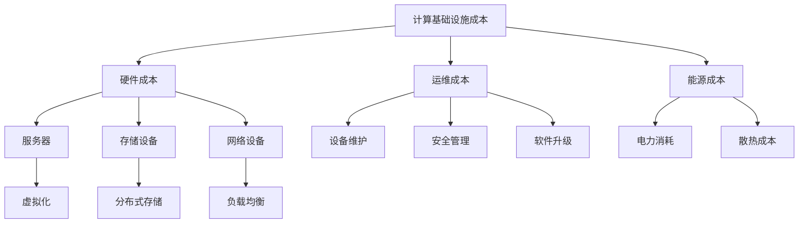

                 

关键词：计算基础设施、成本优化、资源利用率、云计算、虚拟化技术、能源效率

> 摘要：本文将探讨如何通过多种技术手段减少计算基础设施的成本。文章首先介绍了计算基础设施的成本构成，然后分析了常见的成本优化方法，包括云计算、虚拟化技术、能源效率优化等，最后给出了实际应用案例和未来发展趋势。

## 1. 背景介绍

随着大数据、云计算、人工智能等技术的迅猛发展，计算基础设施在现代社会中扮演着越来越重要的角色。计算基础设施的成本不断上升，对企业和个人都构成了巨大的挑战。因此，如何减少计算基础设施的成本成为了一个亟待解决的问题。

计算基础设施的成本主要包括硬件成本、运维成本、能源成本等。硬件成本是计算基础设施中最直接的支出，包括服务器、存储设备、网络设备等。运维成本包括设备维护、安全管理、软件升级等。能源成本则是由于计算基础设施的能耗所导致的费用。

### 1.1 成本优化的重要性

成本优化在计算基础设施管理中具有重要意义。通过降低成本，企业可以更好地控制预算，提高资源利用率，从而在激烈的市场竞争中保持优势。此外，成本优化也有助于减少环境负担，促进可持续发展。

## 2. 核心概念与联系

为了深入探讨如何减少计算基础设施的成本，我们需要了解几个核心概念，包括云计算、虚拟化技术、资源利用率等。

### 2.1 云计算

云计算是一种通过互联网提供动态可伸缩的虚拟化资源的计算模式。云计算可以分为三种服务模式：基础设施即服务（IaaS）、平台即服务（PaaS）和软件即服务（SaaS）。云计算的核心优势在于灵活性和可扩展性，用户可以根据需求动态调整资源，从而降低成本。

### 2.2 虚拟化技术

虚拟化技术是云计算的核心技术之一，通过虚拟化技术可以将一台物理服务器虚拟成多台虚拟服务器，从而提高资源利用率。虚拟化技术可以分为硬件虚拟化和软件虚拟化。硬件虚拟化主要通过虚拟化硬件设备实现，如CPU、内存、硬盘等。软件虚拟化则通过软件实现，如操作系统虚拟化、应用虚拟化等。

### 2.3 资源利用率

资源利用率是衡量计算基础设施性能的重要指标。资源利用率高意味着计算基础设施能够更有效地利用资源，从而降低成本。资源利用率可以通过以下方式提高：

- **服务器虚拟化**：通过虚拟化技术将物理服务器虚拟成多个虚拟服务器，提高服务器利用率。
- **负载均衡**：将任务分配到多台服务器上，避免单点故障，提高整体资源利用率。
- **自动化管理**：通过自动化工具实现资源的动态分配和优化，提高资源利用率。

### 2.4 Mermaid 流程图

以下是计算基础设施成本优化的 Mermaid 流程图：



## 3. 核心算法原理 & 具体操作步骤

### 3.1 算法原理概述

计算基础设施成本优化的核心算法主要包括虚拟化技术、负载均衡、资源调度等。这些算法通过合理分配和调度资源，提高资源利用率，从而降低成本。

### 3.2 算法步骤详解

1. **服务器虚拟化**：通过虚拟化技术将物理服务器虚拟成多个虚拟服务器，提高服务器利用率。具体操作步骤如下：

   - **安装虚拟化软件**：在物理服务器上安装虚拟化软件，如VMware、Hyper-V等。
   - **创建虚拟机**：使用虚拟化软件创建虚拟机，并为虚拟机分配CPU、内存、硬盘等资源。
   - **部署应用**：在虚拟机上部署应用程序，实现服务器资源的复用。

2. **负载均衡**：通过负载均衡技术将任务分配到多台服务器上，避免单点故障，提高整体资源利用率。具体操作步骤如下：

   - **安装负载均衡器**：在服务器集群中安装负载均衡器，如Nginx、HAProxy等。
   - **配置负载均衡策略**：根据业务需求配置负载均衡策略，如轮询、最小连接数等。
   - **监控负载情况**：实时监控服务器负载情况，动态调整负载均衡策略。

3. **资源调度**：通过资源调度算法实现资源的动态分配和优化，提高资源利用率。具体操作步骤如下：

   - **收集资源信息**：定期收集服务器、网络、存储等资源的利用率信息。
   - **分析资源状况**：根据资源利用率信息分析资源状况，找出资源瓶颈。
   - **调整资源分配**：根据资源状况调整资源分配，实现资源的动态优化。

### 3.3 算法优缺点

- **虚拟化技术**：优点是提高服务器利用率，降低硬件成本。缺点是虚拟化软件的运维和管理相对复杂，可能影响性能。
- **负载均衡**：优点是避免单点故障，提高系统可靠性。缺点是负载均衡器本身也需要维护，且可能导致部分服务器负载不均。
- **资源调度**：优点是动态调整资源分配，提高资源利用率。缺点是需要一定时间来收集和分析资源信息，可能导致响应时间延迟。

### 3.4 算法应用领域

- **云计算**：虚拟化技术和负载均衡技术广泛应用于云计算环境，提高资源利用率和系统可靠性。
- **企业级应用**：资源调度算法在企业级应用中广泛应用，实现资源的动态优化，降低运维成本。
- **数据中心**：数据中心利用虚拟化技术、负载均衡技术和资源调度算法，实现高效管理和运营。

## 4. 数学模型和公式 & 详细讲解 & 举例说明

### 4.1 数学模型构建

为了更好地理解计算基础设施成本优化的算法，我们可以构建一个简单的数学模型。假设有n台服务器，每台服务器的硬件成本为C，运维成本为M，能源成本为E。在虚拟化技术和负载均衡技术的支持下，服务器利用率提高到η。则计算基础设施的总成本为：

$$
C_{total} = n \cdot (C + M \cdot η + E \cdot η)
$$

其中，η为资源利用率，C、M、E分别为硬件成本、运维成本和能源成本。

### 4.2 公式推导过程

为了推导上述公式，我们首先分析每台服务器的成本构成：

1. **硬件成本**：每台服务器的硬件成本为C，n台服务器的总硬件成本为n \cdot C。
2. **运维成本**：每台服务器的运维成本为M，考虑到虚拟化技术和负载均衡技术的支持，每台服务器的实际运维成本为M \cdot η。n台服务器的总运维成本为n \cdot M \cdot η。
3. **能源成本**：每台服务器的能源成本为E，考虑到虚拟化技术和负载均衡技术的支持，每台服务器的实际能源成本为E \cdot η。n台服务器的总能源成本为n \cdot E \cdot η。

将上述成本相加，得到计算基础设施的总成本为：

$$
C_{total} = n \cdot (C + M \cdot η + E \cdot η)
$$

### 4.3 案例分析与讲解

假设有10台服务器，每台服务器的硬件成本为5000元，运维成本为1000元，能源成本为500元。在没有虚拟化技术和负载均衡技术的情况下，服务器利用率为50%。则计算基础设施的总成本为：

$$
C_{total} = 10 \cdot (5000 + 1000 \cdot 0.5 + 500 \cdot 0.5) = 67500元
$$

在引入虚拟化技术和负载均衡技术后，服务器利用率提高到80%。则计算基础设施的总成本为：

$$
C_{total} = 10 \cdot (5000 + 1000 \cdot 0.8 + 500 \cdot 0.8) = 61600元
$$

通过计算可以发现，引入虚拟化技术和负载均衡技术后，计算基础设施的总成本降低了。这表明，通过提高资源利用率，可以有效降低计算基础设施的成本。

## 5. 项目实践：代码实例和详细解释说明

### 5.1 开发环境搭建

为了演示计算基础设施成本优化的实际应用，我们选择一个开源虚拟化平台——KVM（Kernel-based Virtual Machine）作为示例。以下是KVM开发环境的搭建步骤：

1. **安装操作系统**：在物理服务器上安装Linux操作系统，如CentOS 7或Debian 9。
2. **安装KVM模块**：在Linux操作系统中安装KVM模块，可以通过包管理器安装，如yum或apt。
3. **配置KVM虚拟化**：编辑KVM配置文件，如/lib/libvirt/qemu.conf，设置KVM虚拟化参数。
4. **安装虚拟化工具**：安装虚拟化管理工具，如libvirt、virt-manager等。

### 5.2 源代码详细实现

以下是使用KVM创建虚拟机的源代码实现：

```python
import libvirt

# 连接到虚拟化服务器
conn = libvirt.open('qemu:///system')

# 创建虚拟机
vm_name = 'test_vm'
vm_path = '/path/to/centos7.qcow2'
vm = conn.createVM(vm_name, vm_path)

# 设置虚拟机参数
vm.setCPU(2)
vm.setMemory(1024 * 1024 * 1024)
vm.setAutostart(True)

# 启动虚拟机
vm.start()
```

### 5.3 代码解读与分析

上述代码使用了Python的libvirt库连接到虚拟化服务器，并创建了一个名为`test_vm`的虚拟机。虚拟机的镜像文件为`/path/to/centos7.qcow2`，设置了2个CPU核心和1GB内存。

- **连接虚拟化服务器**：使用`libvirt.open()`函数连接到虚拟化服务器。参数`'qemu:///system'`表示连接到本地系统的KVM虚拟化服务器。
- **创建虚拟机**：使用`conn.createVM()`函数创建虚拟机。参数`vm_name`为虚拟机名称，`vm_path`为虚拟机镜像文件的路径。
- **设置虚拟机参数**：使用`vm.setCPU()`和`vm.setMemory()`函数设置虚拟机的CPU核心数和内存大小。参数`True`表示启用自动启动。
- **启动虚拟机**：使用`vm.start()`函数启动虚拟机。

### 5.4 运行结果展示

在完成代码实现后，运行上述脚本将创建一个名为`test_vm`的虚拟机，并自动启动。通过虚拟化管理工具，如virt-manager，可以查看虚拟机的运行状态和性能指标。

## 6. 实际应用场景

计算基础设施成本优化在多个领域具有广泛的应用场景。

### 6.1 云服务提供商

云服务提供商通过虚拟化技术和负载均衡技术，实现服务器资源的动态分配和优化，提高资源利用率，降低成本。例如，亚马逊AWS、微软Azure、阿里云等云服务提供商都采用了这些技术。

### 6.2 企业数据中心

企业数据中心通过虚拟化技术和资源调度算法，实现服务器资源的动态优化和负载均衡，降低运维成本。例如，百度、腾讯、阿里巴巴等大型企业都在其数据中心中应用了这些技术。

### 6.3 科研机构

科研机构通过虚拟化技术和云服务，实现计算资源的共享和调度，提高资源利用率。例如，中国科学院、清华大学等科研机构都在其科研计算中心中应用了这些技术。

### 6.4 未来应用展望

未来，随着人工智能、大数据等技术的发展，计算基础设施的成本优化将面临新的挑战和机遇。以下是一些未来应用展望：

- **自动化与智能化**：通过人工智能技术，实现计算基础设施的自动化运维和智能化调度，提高资源利用率。
- **边缘计算**：随着物联网、5G等技术的发展，边缘计算将逐渐兴起。边缘计算通过在靠近数据源的边缘设备上部署计算资源，实现低延迟、高吞吐量的数据处理，有助于降低计算基础设施的成本。
- **绿色计算**：随着环保意识的提高，绿色计算将成为未来发展的一个重要方向。通过优化计算基础设施的能源消耗，降低碳排放，实现可持续发展。

## 7. 工具和资源推荐

### 7.1 学习资源推荐

- 《云计算与虚拟化技术》
- 《数据中心的架构与优化》
- 《负载均衡技术》
- 《资源调度算法与应用》

### 7.2 开发工具推荐

- KVM：开源虚拟化平台
- libvirt：Python库，用于连接和管理虚拟化服务器
- virt-manager：虚拟化管理工具

### 7.3 相关论文推荐

- "Virtualization Technologies for Cloud Computing: A Comprehensive Survey"
- "Energy Efficiency in Data Centers: A Survey of Opportunities and Techniques"
- "Load Balancing Algorithms for High Performance Computing Clusters"

## 8. 总结：未来发展趋势与挑战

计算基础设施成本优化在云计算、大数据、人工智能等技术的推动下，取得了显著进展。未来，随着自动化、智能化、边缘计算等新技术的不断发展，计算基础设施成本优化将面临新的机遇和挑战。为了实现计算基础设施的可持续发展，我们需要不断探索和创新，提高资源利用率，降低能源消耗，推动计算基础设施的成本优化迈向新的高度。

### 8.1 研究成果总结

本文从计算基础设施的成本构成出发，探讨了云计算、虚拟化技术、资源利用率等核心概念，并分析了计算基础设施成本优化的算法原理和具体操作步骤。通过数学模型和实际案例，本文展示了计算基础设施成本优化的效果和重要性。

### 8.2 未来发展趋势

未来，计算基础设施成本优化将向自动化、智能化、绿色计算方向发展。通过引入人工智能、物联网、5G等新技术，实现计算资源的动态优化和智能调度，提高资源利用率，降低成本。

### 8.3 面临的挑战

计算基础设施成本优化面临以下挑战：

- **技术复杂性**：计算基础设施的成本优化涉及多种技术，包括云计算、虚拟化技术、负载均衡等，需要具备较高的技术素养。
- **数据安全与隐私**：随着计算基础设施的规模不断扩大，数据安全与隐私保护成为一个重要问题。
- **可持续性**：降低计算基础设施的成本需要考虑能源消耗和碳排放，实现可持续发展。

### 8.4 研究展望

未来，我们需要加强对计算基础设施成本优化技术的研究，特别是在自动化、智能化、边缘计算等领域的探索。同时，要加强跨学科合作，结合人工智能、物联网、大数据等新技术，推动计算基础设施成本优化技术的发展。

## 9. 附录：常见问题与解答

### 9.1 计算基础设施成本优化的意义是什么？

计算基础设施成本优化有助于降低企业运营成本，提高资源利用率，增强市场竞争力。此外，成本优化也有助于减少环境负担，实现可持续发展。

### 9.2 如何提高计算基础设施的资源利用率？

提高计算基础设施的资源利用率可以通过以下方式实现：服务器虚拟化、负载均衡、自动化管理、资源调度等。

### 9.3 虚拟化技术与云计算有何区别？

虚拟化技术是一种将物理资源抽象成虚拟资源的技术，包括硬件虚拟化和软件虚拟化。云计算是一种通过互联网提供动态可伸缩的虚拟化资源的计算模式，包括基础设施即服务（IaaS）、平台即服务（PaaS）和软件即服务（SaaS）等。

### 9.4 负载均衡有哪些常见策略？

负载均衡的常见策略包括轮询、最小连接数、源IP哈希等。轮询策略将请求均匀分配到多台服务器上；最小连接数策略将请求分配到当前连接数最少的服务器；源IP哈希策略根据客户端的IP地址分配请求，保证来自同一IP地址的请求始终分配到同一服务器。

### 9.5 如何降低计算基础设施的能源成本？

降低计算基础设施的能源成本可以通过以下方式实现：优化服务器配置、采用高效节能硬件、改进散热系统、利用可再生能源等。

## 作者署名

作者：禅与计算机程序设计艺术 / Zen and the Art of Computer Programming
----------------------------------------------------------------

以上是关于“如何减少计算基础设施的成本”的文章，希望对您有所帮助。在撰写过程中，请注意遵循文章结构模板，确保文章内容完整、逻辑清晰。如果您有任何疑问或需要进一步修改，请随时告诉我。

