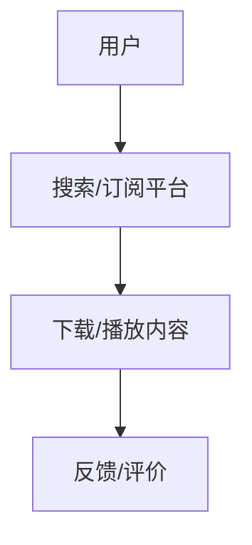
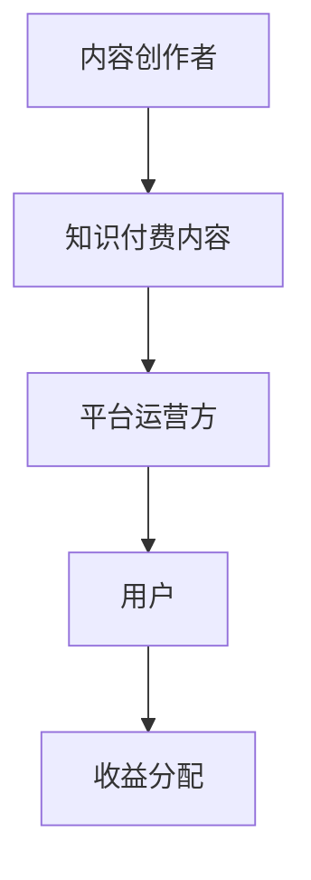

                 

关键词：Podcast，技术知识付费，内容创造，用户参与，营销策略，平台运营

> 摘要：随着互联网技术的快速发展，Podcast作为一种新型的内容传播形式，逐渐成为技术爱好者获取知识的重要途径。本文旨在探讨如何通过Podcast进行技术知识付费，分析其商业模式、用户参与度、营销策略以及平台运营等方面的关键要素。

## 1. 背景介绍

### Podcast的起源与发展

Podcast起源于20世纪90年代末，是一种基于互联网的音频传播媒介。用户可以通过订阅的方式，在个人电脑、移动设备上随时随地收听喜欢的节目内容。随着移动互联网的普及，Podcast的受众群体不断扩大，影响力逐渐增强。

### 技术知识付费的趋势

随着知识经济的发展，越来越多的人愿意为优质的知识内容付费。技术领域作为一个知识密集型行业，其付费意愿尤为强烈。通过Podcast进行技术知识付费，不仅可以满足用户的求知需求，还能为内容创作者带来可观的收益。

## 2. 核心概念与联系

### Podcast的技术架构


**Mermaid 流程图：**



### 技术知识付费的商业模式

**商业模式图：**



## 3. 核心算法原理 & 具体操作步骤

### 3.1 算法原理概述

Podcast的技术核心在于内容订阅和分发机制。内容创作者将音频内容上传至平台，用户通过订阅获取最新的节目。核心算法包括：

- **内容推荐算法**：根据用户的偏好和历史行为，推荐符合其兴趣的内容。
- **支付结算算法**：实现用户支付和内容创作者收益的自动化分配。

### 3.2 算法步骤详解

1. **内容上传**：创作者将音频内容上传至平台。
2. **内容审核**：平台对上传内容进行审核，确保其符合相关法律法规和平台规定。
3. **内容发布**：审核通过后，内容创作者可以设置付费模式，发布至平台。
4. **用户订阅**：用户通过平台订阅内容，并按照设定的价格进行支付。
5. **内容播放**：用户下载或在线播放订阅内容。
6. **反馈评价**：用户对内容进行评价和反馈，帮助平台优化推荐算法。

### 3.3 算法优缺点

**优点：**
- **便捷性**：用户可以随时随地收听内容。
- **个性化**：推荐算法可以满足用户的个性化需求。
- **低成本**：相较于传统媒体，Podcast的制作和分发成本较低。

**缺点：**
- **内容质量不稳定**：由于创作门槛较低，内容质量参差不齐。
- **用户粘性不足**：部分用户可能因内容质量不高而取消订阅。

### 3.4 算法应用领域

- **技术领域**：如软件开发、人工智能、网络安全等。
- **行业领域**：如金融、医疗、教育等。

## 4. 数学模型和公式 & 详细讲解 & 举例说明

### 4.1 数学模型构建

**用户参与度模型：**
$$
\text{用户参与度} = \frac{\text{订阅数} + \text{播放次数} + \text{评价数}}{\text{用户总数}}
$$

**收益模型：**
$$
\text{收益} = \text{订阅费用} \times \text{订阅用户数} + \text{付费内容播放量} \times \text{单价}
$$

### 4.2 公式推导过程

- **用户参与度模型**：通过计算订阅数、播放次数和评价数的总和，再除以用户总数，得到用户参与度的比例。
- **收益模型**：订阅费用乘以订阅用户数，加上付费内容播放量乘以单价，得到总收益。

### 4.3 案例分析与讲解

**案例：某技术类Podcast平台**

- **用户参与度**：订阅数1000，播放次数5000，评价数200。用户参与度计算为：
  $$
  \text{用户参与度} = \frac{1000 + 5000 + 200}{1000} = 6.2
  $$
- **收益**：订阅费用10元，订阅用户数1000，付费内容播放量500，单价20元。收益计算为：
  $$
  \text{收益} = 10 \times 1000 + 500 \times 20 = 15000
  $$

## 5. 项目实践：代码实例和详细解释说明

### 5.1 开发环境搭建

- **操作系统**：Linux
- **编程语言**：Python
- **依赖库**：requests, feedparser, markdown

### 5.2 源代码详细实现

```python
import requests
import feedparser
import markdown

# 下载订阅内容
def download_content(url, output_dir):
    response = requests.get(url)
    if response.status_code == 200:
        with open(f"{output_dir}/content.md", "w") as file:
            file.write(response.text)

# 解析RSS订阅
def parse_rss(url):
    feed = feedparser.parse(url)
    for entry in feed.entries:
        print(entry.title)

# 主函数
def main():
    url = "https://example.com/rss"
    output_dir = "output"
    download_content(url, output_dir)
    parse_rss(url)

if __name__ == "__main__":
    main()
```

### 5.3 代码解读与分析

- **download_content**：下载RSS订阅内容至指定目录。
- **parse_rss**：解析RSS订阅，打印出每个条目的标题。
- **main**：主函数，调用download_content和parse_rss函数。

### 5.4 运行结果展示

- **下载内容**：输出到output目录下的content.md文件。
- **解析RSS**：打印出RSS订阅中的条目标题。

## 6. 实际应用场景

### 6.1 技术领域

- **软件开发**：如Java、Python、JavaScript等技术类Podcast。
- **人工智能**：介绍机器学习、深度学习等前沿技术。

### 6.2 行业领域

- **金融**：分析市场趋势、投资策略等。
- **医疗**：讲解医学知识、病例分享等。

## 6.4 未来应用展望

- **人工智能**：利用人工智能技术优化推荐算法，提高用户满意度。
- **虚拟现实**：结合虚拟现实技术，提供更加沉浸式的学习体验。

## 7. 工具和资源推荐

### 7.1 学习资源推荐

- **《Podcasting for Dummies》**：适合初学者了解Podcast的基础知识。
- **《Podcast Production for Musicians》**：针对音乐人制作Podcast的指南。

### 7.2 开发工具推荐

- **Audacity**：音频编辑软件，适合制作Podcast。
- **Libsyn**：专业的Podcast托管服务提供商。

### 7.3 相关论文推荐

- **"The Impact of Podcasts on College Students' Learning Outcomes"**：探讨Podcast在教育领域的影响。
- **"Monetizing Podcast Content: A Business Model Perspective"**：分析Podcast的商业模式。

## 8. 总结：未来发展趋势与挑战

### 8.1 研究成果总结

本文通过分析Podcast在技术知识付费领域的应用，探讨了其商业模式、算法原理、数学模型以及实际应用场景，为内容创作者和平台运营提供了有益的参考。

### 8.2 未来发展趋势

- **个性化推荐**：利用人工智能技术，提高内容推荐的精准度。
- **多元化内容**：扩展Podcast的领域，满足更多用户的需求。

### 8.3 面临的挑战

- **内容质量**：提高内容质量，提升用户满意度。
- **用户粘性**：增加用户参与度，提高用户留存率。

### 8.4 研究展望

未来，Podcast在技术知识付费领域的发展将更加成熟，为内容创作者和用户带来更多价值。

## 9. 附录：常见问题与解答

### 问题1：如何开始制作自己的Podcast？

**解答**：首先确定你的内容和目标受众，然后选择合适的录制和编辑工具，如Audacity。接着，在平台如Libsyn或Anchor注册账户，并开始制作你的第一期节目。

### 问题2：如何提高Podcast的用户参与度？

**解答**：通过定期更新内容，保持与听众的互动，如开设社交媒体账号、建立邮件列表等，以及提供互动环节，如问答、调查等，都可以提高用户参与度。

作者：禅与计算机程序设计艺术 / Zen and the Art of Computer Programming
----------------------------------------------------------------

请注意，文章中的URL链接和Mermaid流程图仅为示例，请根据实际情况进行替换。此外，由于实际操作中的代码和公式可能较长，这里仅提供了一个简化的示例。在实际撰写时，请根据需要调整文章结构和内容细节。

