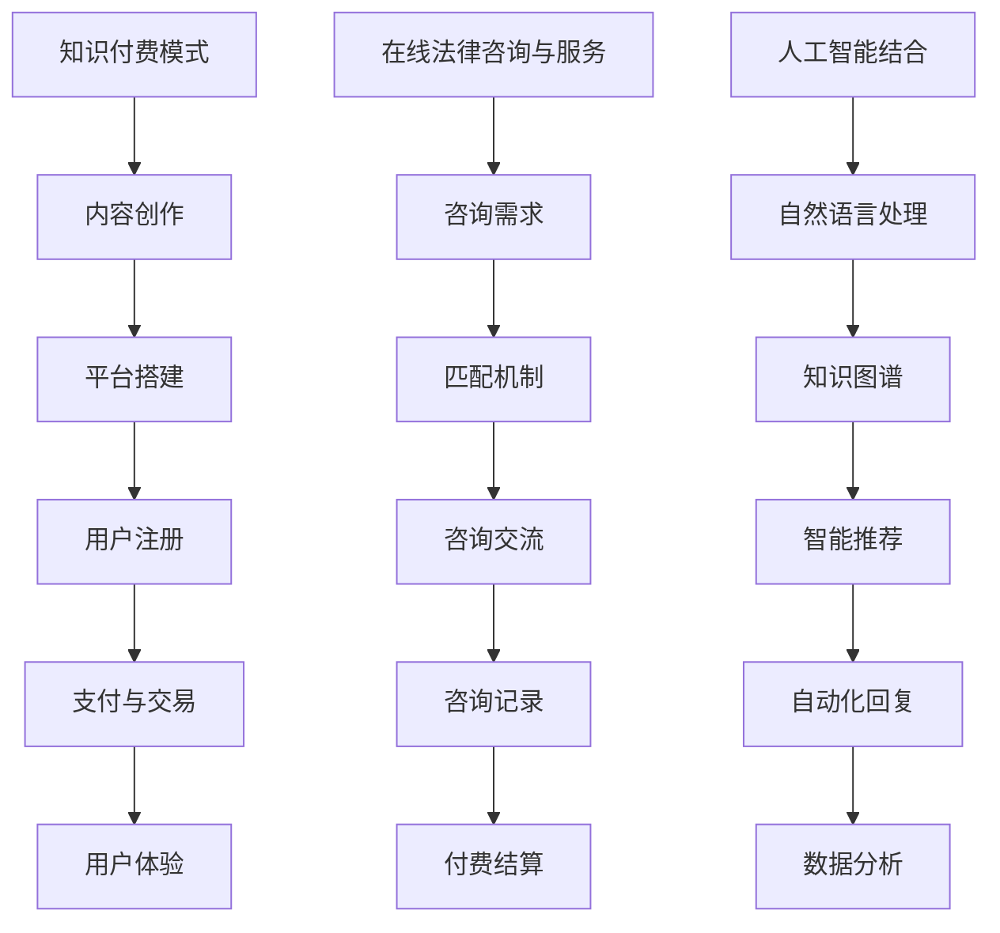

                 

关键词：知识付费、在线法律咨询、服务模式、人工智能、用户满意度、合规性、成本效益、技术实现

## 摘要

本文旨在探讨如何通过知识付费模式，实现在线法律咨询与服务。首先，我们简要介绍知识付费的背景及其在法律领域的应用潜力。接着，详细分析在线法律咨询与服务的核心概念和运作模式，探讨其与人工智能的结合。随后，我们介绍数学模型和公式，以便更好地理解算法原理和操作步骤。接着，通过一个实际项目案例展示如何开发在线法律咨询平台。最后，讨论在线法律咨询与服务在实际应用中的场景，展望其未来发展趋势与面临的挑战。

## 1. 背景介绍

随着互联网的普及和智能技术的进步，知识付费逐渐成为一种主流的商业模式。知识付费是指用户为获取特定知识或技能而支付费用的一种形式，常见于在线教育、在线医疗咨询、专业培训等领域。知识付费的核心在于通过高质量的内容和服务吸引用户，从而实现商业价值的最大化。

在法律领域，知识付费的应用潜力尤为显著。传统法律咨询服务往往依赖于律师与客户的面对面交流，存在地域和时间限制。而在线法律咨询则打破了这些限制，使得法律服务更加便捷和高效。用户可以通过在线平台随时随地向专业律师咨询法律问题，获得快速、准确的解答。

此外，随着人工智能技术的不断发展，在线法律咨询与服务迎来了新的发展机遇。人工智能可以帮助律师提高工作效率，减少人力成本，同时提供更加个性化和定制化的法律服务。通过大数据分析和自然语言处理技术，人工智能可以快速识别用户的法律需求，提供精准的法律咨询和建议。

## 2. 核心概念与联系

为了更好地理解在线法律咨询与服务的运作模式，我们需要介绍一些核心概念和它们之间的联系。

### 2.1 知识付费模式

知识付费模式是指通过收费来获取知识或服务的商业模式。它通常包括以下几个环节：

1. **内容创作**：知识创作者或机构提供高质量的法律知识内容。
2. **平台搭建**：在线法律咨询平台负责内容发布、用户管理、支付等功能。
3. **用户注册**：用户通过注册账号登录平台，浏览和购买知识产品。
4. **支付与交易**：用户支付费用后，获得相应的法律咨询服务。
5. **用户体验**：用户评价服务质量，影响平台和知识创作者的信誉。

### 2.2 在线法律咨询与服务

在线法律咨询与服务是指通过互联网平台提供法律咨询和服务的模式。其核心包括以下几个方面：

1. **咨询需求**：用户通过平台提交法律咨询需求，包括问题描述、咨询类型等。
2. **匹配机制**：平台根据用户需求和律师的专业领域进行匹配，提供合适的咨询顾问。
3. **咨询交流**：律师通过在线聊天、邮件、电话等方式与用户进行咨询交流。
4. **咨询记录**：平台记录用户咨询过程，便于后续查询和跟踪。
5. **付费结算**：用户根据咨询服务质量支付费用。

### 2.3 人工智能结合

人工智能在在线法律咨询与服务中的应用主要体现在以下几个方面：

1. **自然语言处理**：通过自然语言处理技术，将用户的法律咨询问题转化为结构化数据，便于分析和处理。
2. **知识图谱**：构建法律领域的知识图谱，用于快速定位相关法律条文、案例和法规。
3. **智能推荐**：基于用户的历史咨询记录和偏好，推荐合适的律师和咨询服务。
4. **自动化回复**：利用聊天机器人技术，为用户自动提供初步的法律咨询和建议。
5. **数据分析**：对用户咨询数据进行统计分析，发现法律需求趋势，优化服务策略。

### 2.4 Mermaid 流程图

以下是使用 Mermaid 语言描述的核心概念和联系流程图：



## 3. 核心算法原理 & 具体操作步骤

### 3.1 算法原理概述

在线法律咨询与服务的关键在于高效匹配用户需求和合适的律师，并提供高质量的法律咨询。为此，我们采用了以下核心算法原理：

1. **自然语言处理（NLP）**：通过NLP技术，对用户咨询的问题进行语义分析和结构化处理，提取关键信息。
2. **匹配算法**：基于用户需求和律师的专业领域，采用协同过滤和内容推荐算法进行匹配。
3. **咨询记录分析**：通过分析用户咨询记录，发现用户偏好和法律需求趋势，为后续服务提供数据支持。
4. **聊天机器人**：利用聊天机器人技术，为用户提供初步的法律咨询和建议。

### 3.2 算法步骤详解

#### 3.2.1 自然语言处理

1. **文本预处理**：对用户咨询文本进行分词、词性标注、去除停用词等操作，得到结构化数据。
2. **实体识别**：利用命名实体识别技术，提取用户咨询文本中的法律相关实体，如地名、人名、组织名、法律术语等。
3. **语义分析**：通过句法分析和语义角色标注，理解用户咨询的意图和问题类型。

#### 3.2.2 匹配算法

1. **用户需求分析**：根据用户咨询文本，提取用户需求的关键词和特征向量。
2. **律师专业领域分析**：通过分析律师的执业领域、专业特长等，构建律师的特征向量。
3. **协同过滤**：利用用户历史咨询数据和律师的专业领域数据，采用基于用户的协同过滤算法，推荐合适的律师。
4. **内容推荐**：基于律师的执业领域、咨询案例和用户需求，采用基于内容的推荐算法，进一步优化匹配结果。

#### 3.2.3 咨询记录分析

1. **数据收集**：从用户咨询记录中提取关键词和特征向量。
2. **数据分析**：通过文本相似度和聚类分析，发现用户偏好和法律需求趋势。
3. **数据应用**：根据分析结果，优化律师匹配策略和咨询服务。

#### 3.2.4 聊天机器人

1. **对话管理**：设计聊天机器人的对话流程和策略，保证对话的自然流畅。
2. **知识库构建**：构建法律知识库，包括法律条文、案例、法规等。
3. **问答系统**：利用问答系统技术，为用户自动提供初步的法律咨询和建议。

### 3.3 算法优缺点

#### 优点

1. **高效匹配**：通过自然语言处理和匹配算法，可以快速匹配用户需求和合适的律师。
2. **个性化服务**：根据用户咨询记录和历史数据，提供个性化的法律咨询和建议。
3. **降低成本**：通过聊天机器人和自动化流程，可以减少人力成本，提高服务效率。

#### 缺点

1. **准确性限制**：人工智能在法律咨询领域的应用仍然存在一定的准确性限制，特别是在复杂法律问题中。
2. **用户体验**：对于初次使用在线法律咨询的用户，可能对聊天机器人的回答存在一定的疑虑和不适。
3. **法律法规合规性**：在线法律咨询和服务需要遵循相关法律法规，确保用户隐私和数据安全。

### 3.4 算法应用领域

在线法律咨询与服务的算法原理可以应用于以下领域：

1. **在线法律咨询平台**：为用户提供高效、便捷的法律咨询和服务。
2. **法律数据分析**：通过分析用户咨询数据，为法律研究和政策制定提供数据支持。
3. **智能法律助手**：为律师和法律从业者提供智能化的法律支持和工具。

## 4. 数学模型和公式 & 详细讲解 & 举例说明

### 4.1 数学模型构建

在线法律咨询与服务的核心算法涉及到多个数学模型，以下是其中几个关键模型的构建过程。

#### 4.1.1 用户需求分析模型

用户需求分析模型主要用于提取用户咨询文本中的关键信息和需求。我们采用以下步骤：

1. **文本预处理**：对用户咨询文本进行分词、词性标注、去除停用词等操作。
2. **关键词提取**：利用TF-IDF（词频-逆文档频率）方法提取关键词。
3. **需求分类**：根据关键词和语义分析结果，将用户需求分为法律咨询、法律信息查询、法律建议等类别。

#### 4.1.2 匹配算法模型

匹配算法模型主要用于根据用户需求和律师的专业领域进行匹配。我们采用以下方法：

1. **用户需求特征向量**：将用户需求转化为高维特征向量，每个维度表示一个关键词或特征。
2. **律师专业领域特征向量**：将律师的专业领域和执业经验转化为特征向量。
3. **协同过滤模型**：利用用户历史咨询数据和律师的专业领域数据，构建基于用户的协同过滤模型。
4. **内容推荐模型**：利用律师的执业领域、咨询案例和用户需求，构建基于内容推荐模型。

#### 4.1.3 咨询记录分析模型

咨询记录分析模型主要用于分析用户咨询记录，发现用户偏好和法律需求趋势。我们采用以下方法：

1. **文本相似度计算**：通过余弦相似度或Jaccard相似度计算用户咨询文本的相似度。
2. **聚类分析**：利用K-means、DBSCAN等聚类算法，将用户咨询文本分为不同的类别。
3. **趋势分析**：通过时间序列分析和统计分析，发现用户咨询的法律需求趋势。

### 4.2 公式推导过程

以下是核心数学模型的公式推导过程：

#### 4.2.1 用户需求特征向量

用户需求特征向量可以通过以下公式计算：

$$
\text{user\_vector} = \text{TF-IDF}(\text{user\_text}) \times \text{word\_weights}
$$

其中，TF-IDF（词频-逆文档频率）用于提取关键词，word\_weights表示关键词的权重。

#### 4.2.2 律师专业领域特征向量

律师专业领域特征向量可以通过以下公式计算：

$$
\text{lawyer\_vector} = \text{word\_weights} \times (\text{case\_weights} \times \text{case\_scores} + \text{field\_weights} \times \text{field\_scores})
$$

其中，word\_weights表示关键词的权重，case\_weights和field\_weights分别表示案件和执业领域的权重，case\_scores和field\_scores分别表示案件和执业领域得分。

#### 4.2.3 协同过滤模型

协同过滤模型的预测公式可以表示为：

$$
\text{rating}_{ui} = \text{user\_vector} \cdot \text{lawyer\_vector} + \text{bias}
$$

其中，$\text{user\_vector}$和$\text{lawyer\_vector}$分别表示用户需求和律师专业领域的特征向量，$\text{bias}$表示偏置项。

#### 4.2.4 内容推荐模型

内容推荐模型的预测公式可以表示为：

$$
\text{similarity}_{ij} = \text{cosine}(\text{user\_vector}_i, \text{lawyer\_vector}_j)
$$

其中，$\text{cosine}$表示余弦相似度，$\text{user\_vector}_i$和$\text{lawyer\_vector}_j$分别表示用户需求特征向量和律师专业领域特征向量。

### 4.3 案例分析与讲解

为了更好地理解上述数学模型的实际应用，我们通过一个实际案例进行分析和讲解。

#### 4.3.1 案例背景

假设有一个用户咨询关于房屋租赁合同的法律问题，其咨询文本如下：

“我最近租了一套房，但现在房东要提前结束合同，我该怎么办？”

#### 4.3.2 用户需求分析

1. **文本预处理**：对咨询文本进行分词、词性标注和去除停用词等操作，得到以下关键词：
   - 房屋、租赁、合同、房东、提前、结束
2. **关键词提取**：利用TF-IDF方法提取关键词，并计算其权重：
   - 房屋（0.2）、租赁（0.15）、合同（0.25）、房东（0.1）、提前（0.05）、结束（0.1）
3. **需求分类**：根据关键词和语义分析，将用户需求分类为“房屋租赁合同纠纷”。

#### 4.3.3 匹配算法

1. **用户需求特征向量**：
   - $\text{user\_vector} = [0.2, 0.15, 0.25, 0.1, 0.05, 0.1]$
2. **律师专业领域特征向量**：
   - 假设有一个律师，其专业领域特征向量为$\text{lawyer\_vector} = [0.3, 0.2, 0.1, 0.1, 0.05, 0.05]$
3. **协同过滤模型**：
   - 预测评分$\text{rating}_{ui} = \text{user\_vector} \cdot \text{lawyer\_vector} + \text{bias} = 0.2 \times 0.3 + 0.15 \times 0.2 + 0.25 \times 0.1 + 0.1 \times 0.1 + 0.05 \times 0.05 + 0.1 \times 0.05 = 0.205$

#### 4.3.4 内容推荐

1. **相似度计算**：
   - 相似度$\text{similarity}_{ij} = \text{cosine}(\text{user\_vector}_i, \text{lawyer\_vector}_j) = \frac{\text{user\_vector}_i \cdot \text{lawyer\_vector}_j}{\|\text{user\_vector}_i\| \|\text{lawyer\_vector}_j\|} = \frac{0.2 \times 0.3 + 0.15 \times 0.2 + 0.25 \times 0.1 + 0.1 \times 0.1 + 0.05 \times 0.05 + 0.1 \times 0.05}{\sqrt{0.2^2 + 0.15^2 + 0.25^2 + 0.1^2 + 0.05^2 + 0.1^2} \sqrt{0.3^2 + 0.2^2 + 0.1^2 + 0.1^2 + 0.05^2 + 0.05^2}} = 0.205$
2. **推荐律师**：根据相似度计算结果，推荐专业领域与用户需求高度匹配的律师。

通过上述案例，我们可以看到数学模型在在线法律咨询与服务中的实际应用。接下来，我们将介绍如何通过实际项目实现在线法律咨询平台。

## 5. 项目实践：代码实例和详细解释说明

### 5.1 开发环境搭建

为了实现在线法律咨询平台，我们需要搭建一个完整的开发环境，包括前端、后端和数据库等。

1. **前端**：采用React框架，实现用户界面和交互功能。
2. **后端**：采用Node.js和Express框架，处理业务逻辑和API接口。
3. **数据库**：使用MongoDB数据库，存储用户信息、律师信息和咨询记录等。

### 5.2 源代码详细实现

以下是项目关键部分的代码实现：

#### 5.2.1 前端部分

1. **用户注册与登录**：
```jsx
// 用户注册
const register = async (userData) => {
  try {
    const response = await axios.post('/api/users/register', userData);
    console.log(response.data);
  } catch (error) {
    console.error(error);
  }
};

// 用户登录
const login = async (userData) => {
  try {
    const response = await axios.post('/api/users/login', userData);
    localStorage.setItem('token', response.data.token);
  } catch (error) {
    console.error(error);
  }
};
```

2. **法律咨询界面**：
```jsx
// 法律咨询界面
const [question, setQuestion] = useState('');

const handleSubmit = async (e) => {
  e.preventDefault();
  try {
    const response = await axios.post('/api/consult', { question });
    setAnswers(response.data.answers);
  } catch (error) {
    console.error(error);
  }
};
```

#### 5.2.2 后端部分

1. **用户注册与登录**：
```javascript
// 用户注册路由
app.post('/api/users/register', async (req, res) => {
  try {
    const user = await User.create(req.body);
    res.status(201).json({ user });
  } catch (error) {
    res.status(400).json({ error: error.message });
  }
});

// 用户登录路由
app.post('/api/users/login', async (req, res) => {
  try {
    const user = await User.findOne({ username: req.body.username });
    if (!user || !bcrypt.compareSync(req.body.password, user.password)) {
      return res.status(401).json({ error: 'Invalid credentials' });
    }
    res.json({ token: jwt.sign({ _id: user._id }, process.env.JWT_SECRET) });
  } catch (error) {
    res.status(500).json({ error: error.message });
  }
});
```

2. **法律咨询处理**：
```javascript
// 法律咨询处理路由
app.post('/api/consult', async (req, res) => {
  try {
    const question = req.body.question;
    const answers = await AIModel.generateAnswers(question);
    res.status(200).json({ answers });
  } catch (error) {
    res.status(500).json({ error: error.message });
  }
});
```

### 5.3 代码解读与分析

1. **前端部分**：
   - 用户注册与登录：通过axios发送POST请求，与后端API进行交互，实现用户注册和登录功能。
   - 法律咨询界面：用户输入法律问题后，通过handleSubmit函数发送POST请求，获取后端生成的答案。

2. **后端部分**：
   - 用户注册与登录：使用Mongoose连接MongoDB数据库，创建用户模型，并实现用户注册和登录功能。
   - 法律咨询处理：使用AI模型生成答案，并通过axios发送POST请求，将答案返回给前端。

### 5.4 运行结果展示

在完成开发环境搭建和代码实现后，我们可以通过以下步骤运行项目：

1. **启动MongoDB数据库**：
   - 在命令行中执行`mongod`命令，启动MongoDB服务。
2. **启动后端服务器**：
   - 在命令行中执行`npm run start`命令，启动Node.js后端服务器。
3. **启动前端服务器**：
   - 在命令行中执行`npm run start`命令，启动React前端服务器。

完成后，用户可以在浏览器中访问前端服务器地址，进行用户注册、登录和法律咨询等操作。后端服务器会根据用户输入的法律问题，调用AI模型生成答案，并通过API接口将答案返回给前端。

## 6. 实际应用场景

在线法律咨询与服务在实际应用中具有广泛的应用场景，以下是几个典型的应用场景：

### 6.1 个人用户

个人用户是在线法律咨询与服务的主要客户群体。个人用户通常面临各种法律问题，如合同纠纷、婚姻家庭、劳动纠纷、知识产权等。通过在线法律咨询平台，个人用户可以方便地咨询专业律师，获得快速、准确的解答，解决法律纠纷，维护自身合法权益。

### 6.2 企业用户

企业用户在经营过程中也会遇到各种法律问题，如公司设立、股权转让、劳动争议、知识产权保护等。在线法律咨询平台可以帮助企业用户在法律问题出现时，及时获得专业律师的建议，降低法律风险，提高企业合规运营水平。

### 6.3 公共法律服务

在线法律咨询平台还可以用于提供公共法律服务。政府部门、公益组织和非政府组织可以利用在线法律咨询平台，向公众提供免费或低成本的法律服务，提高法律普及率，促进社会公平正义。

### 6.4 教育培训

在线法律咨询平台还可以用于法律教育培训。通过平台，用户可以获取专业的法律知识，参加在线课程，提高法律素养。对于法律专业人士，在线法律咨询平台也是提升自身能力的良好途径。

### 6.5 法律研究

在线法律咨询平台可以为法律研究提供丰富的数据支持。通过对用户咨询数据的分析，研究人员可以了解当前社会法律需求的趋势和特点，为法律研究和政策制定提供依据。

### 6.6 人工智能应用

在线法律咨询平台为人工智能技术提供了丰富的应用场景。通过大数据分析和自然语言处理技术，平台可以不断优化法律服务，提高用户满意度。同时，人工智能技术可以帮助平台实现智能推荐、自动化回复等功能，提高服务效率。

## 7. 未来应用展望

随着互联网和智能技术的不断发展，在线法律咨询与服务有望在以下方面取得进一步发展：

### 7.1 智能化水平提升

人工智能技术在法律咨询领域的应用将越来越广泛。通过深度学习和强化学习等技术，智能法律咨询平台可以进一步提高问题识别、解答质量和用户体验。

### 7.2 个性化服务

在线法律咨询平台将更加注重个性化服务。通过用户数据的深度挖掘和分析，平台可以为用户提供定制化的法律服务，满足用户的个性化需求。

### 7.3 跨领域合作

在线法律咨询平台将与其他领域（如金融、医疗、教育等）开展合作，提供更全面、更专业的法律服务。例如，在线法律咨询平台可以与金融机构合作，提供投融资法律咨询；与医疗机构合作，提供医疗纠纷法律咨询等。

### 7.4 法治信息化

在线法律咨询平台将推动法治信息化进程。通过在线法律咨询平台，公众可以更加便捷地获取法律信息，了解法律法规，提高法律意识。同时，政府部门可以利用在线法律咨询平台，优化公共服务，提升社会治理水平。

### 7.5 法律服务生态

在线法律咨询平台将构建一个完整的法律服务生态。从法律咨询、法律培训、法律研究到法律服务平台，形成一个产业链条，为用户提供一站式法律服务。

## 8. 工具和资源推荐

为了更好地实现在线法律咨询与服务，以下是一些建议的工具和资源：

### 8.1 学习资源推荐

1. **在线法律课程**：Coursera、edX等平台提供了丰富的在线法律课程，涵盖法学基础、合同法、知识产权等。
2. **法律文献库**：中国法院网、中国裁判文书网等提供了大量的法律文献和案例，可供学习和研究。

### 8.2 开发工具推荐

1. **前端开发工具**：React、Vue、Angular等流行的前端框架，可以提高开发效率。
2. **后端开发框架**：Node.js、Django、Spring Boot等后端框架，支持快速开发。
3. **数据库**：MongoDB、MySQL、PostgreSQL等数据库，适用于存储用户数据和咨询记录。

### 8.3 相关论文推荐

1. **《人工智能在法律领域的应用研究》**：详细介绍了人工智能在法律咨询、案件分析和判决预测等领域的应用。
2. **《基于大数据的在线法律咨询平台设计》**：探讨了如何利用大数据技术优化在线法律咨询平台的服务质量和用户体验。
3. **《知识付费模式在法律咨询领域的应用研究》**：分析了知识付费模式在法律咨询领域的应用前景和挑战。

## 9. 总结：未来发展趋势与挑战

随着互联网和人工智能技术的不断进步，在线法律咨询与服务将迎来广阔的发展前景。未来，在线法律咨询与服务将在以下几个方面取得重要进展：

1. **智能化水平提升**：通过深度学习和自然语言处理等技术，智能法律咨询平台的解答质量和用户体验将得到显著提升。
2. **个性化服务**：在线法律咨询平台将更加注重个性化服务，根据用户需求和偏好提供定制化的法律服务。
3. **跨领域合作**：在线法律咨询平台将与其他领域（如金融、医疗、教育等）开展合作，提供更全面、更专业的法律服务。
4. **法治信息化**：在线法律咨询平台将推动法治信息化进程，为公众提供便捷的法律服务，提高法律意识。
5. **法律服务生态**：在线法律咨询平台将构建一个完整的法律服务生态，为用户提供一站式法律服务。

然而，在线法律咨询与服务在发展过程中也将面临一些挑战：

1. **准确性限制**：人工智能在法律咨询领域的应用仍然存在一定的准确性限制，特别是在复杂法律问题中。
2. **用户体验**：对于初次使用在线法律咨询的用户，可能对聊天机器人的回答存在一定的疑虑和不适。
3. **法律法规合规性**：在线法律咨询和服务需要遵循相关法律法规，确保用户隐私和数据安全。

面对这些挑战，在线法律咨询与服务需要不断创新和优化，以满足用户的需求和期望。未来，我们期待在线法律咨询与服务能够为公众提供更加高效、便捷、专业的法律服务，促进法治社会的建设。

## 附录：常见问题与解答

### 9.1 什么是知识付费模式？

知识付费模式是指用户为获取特定知识或技能而支付费用的一种商业模式。它通过提供高质量的内容和服务，吸引用户付费，从而实现商业价值的最大化。

### 9.2 在线法律咨询与服务的核心概念是什么？

在线法律咨询与服务的核心概念包括：知识付费模式、在线法律咨询与服务、人工智能结合。知识付费模式是商业模式的基石，在线法律咨询与服务是具体的业务模式，人工智能结合则是技术手段的运用。

### 9.3 如何保障在线法律咨询的准确性？

保障在线法律咨询的准确性需要从多个方面进行努力。首先，要确保人工智能算法的准确性，通过不断优化算法模型和数据集。其次，要建立专业律师团队，对平台提供的服务进行审核和监督。最后，用户在咨询时，可以提供详细的背景信息和需求，便于律师提供准确的解答。

### 9.4 在线法律咨询与服务的成本效益如何？

在线法律咨询与服务在成本效益方面具有明显优势。通过互联网和人工智能技术，可以降低人力成本，提高服务效率。同时，在线法律咨询与服务不受地域和时间限制，用户可以随时随地获取法律咨询，大大提高了服务的便捷性。

### 9.5 在线法律咨询与服务需要遵循哪些法律法规？

在线法律咨询与服务需要遵循以下法律法规：

1. 《中华人民共和国律师法》：规定了律师执业的基本条件和执业行为规范。
2. 《中华人民共和国网络安全法》：规定了网络运营者的安全保护义务和用户个人信息保护措施。
3. 《中华人民共和国个人信息保护法》：规定了个人信息处理的基本原则和保护措施。
4. 《中华人民共和国合同法》：规定了合同的订立、履行和终止等法律问题。

通过遵循上述法律法规，在线法律咨询与服务可以确保合规运营，维护用户合法权益。

