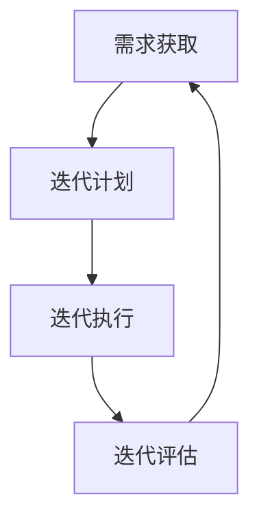

                 

## 1. 背景介绍

自动化创业已经成为当今科技领域的一个重要趋势。随着人工智能、大数据和云计算等技术的快速发展，越来越多的创业公司开始利用这些技术来实现业务流程的自动化，提高生产效率，降低运营成本。然而，自动化创业并非一帆风顺，如何在激烈的市场竞争中快速迭代产品，持续创新，成为了创业者面临的一大挑战。

快速迭代是自动化创业的关键成功因素之一。通过快速迭代，创业公司可以及时响应市场需求变化，不断优化产品功能，提高用户体验，从而在竞争激烈的市场中占据有利地位。本文将围绕如何在自动化创业中实现快速迭代，从核心概念、算法原理、数学模型、项目实践、应用场景等多个方面展开讨论，为创业者提供一些实用的策略和方法。

## 2. 核心概念与联系

在自动化创业中实现快速迭代，需要理解以下几个核心概念：

### 2.1 产品迭代

产品迭代是指通过对产品功能、性能、用户体验等方面的持续改进，使其不断完善和优化。产品迭代可以分为以下几个阶段：

- **需求分析**：确定用户需求和市场趋势，为产品迭代提供方向。
- **设计**：根据需求分析结果，设计新的产品功能和界面。
- **开发**：实现设计，构建新的产品版本。
- **测试**：对新产品进行功能测试和用户体验测试，确保产品质量。
- **发布**：将新产品推向市场，收集用户反馈，为下一轮迭代提供依据。

### 2.2 快速迭代

快速迭代是指在较短时间内完成产品迭代过程，实现产品的快速更新和优化。快速迭代的特点包括：

- **短周期**：通常为几周或几个月，最长不超过一年。
- **高频次**：每年进行多次迭代，以提高产品成熟度和市场竞争力。
- **快速响应**：及时响应市场需求变化，调整产品方向。

### 2.3 自动化技术

自动化技术是自动化创业的核心，包括人工智能、大数据、云计算、物联网等。自动化技术可以提高生产效率、降低运营成本，为企业带来显著的竞争优势。

### 2.4 数据驱动

数据驱动是指利用数据分析和挖掘技术，指导产品设计和开发，优化运营策略。数据驱动可以帮助创业公司：

- **了解用户需求**：通过分析用户行为数据，了解用户偏好，指导产品迭代。
- **优化产品设计**：根据数据反馈，调整产品功能和界面，提高用户体验。
- **降低风险**：通过数据分析，预测市场趋势，降低创业风险。

### 2.5 梅里尔迭代模型（Merill Iteration Model）

梅里尔迭代模型是一种基于敏捷开发的迭代模型，包括以下几个阶段：

- **需求获取**：与客户和利益相关者沟通，获取产品需求。
- **迭代计划**：确定迭代周期、任务和资源。
- **迭代执行**：完成需求分析、设计、开发和测试等工作。
- **迭代评估**：评估迭代成果，收集用户反馈，为下一轮迭代提供依据。

以下是一个使用 Mermaid 绘制的梅里尔迭代模型流程图：



## 3. 核心算法原理 & 具体操作步骤

### 3.1 算法原理概述

在自动化创业中实现快速迭代，需要依赖一些核心算法原理，包括需求分析、数据分析、敏捷开发等。

### 3.2 算法步骤详解

#### 3.2.1 需求分析

需求分析是产品迭代的第一步，主要包括以下几个步骤：

1. **市场调研**：了解目标市场、竞争对手和用户需求。
2. **用户访谈**：与潜在用户沟通，了解他们的需求和使用习惯。
3. **需求整理**：将收集到的需求进行整理和分类，确定优先级。
4. **需求文档**：编写需求文档，明确产品功能和性能要求。

#### 3.2.2 数据分析

数据分析是产品迭代的重要环节，主要包括以下几个步骤：

1. **数据收集**：从各种渠道收集用户数据，如用户行为数据、反馈数据等。
2. **数据清洗**：对收集到的数据进行分析，去除重复和错误的数据。
3. **数据分析**：利用数据分析工具，对数据进行统计和分析，提取有价值的信息。
4. **数据可视化**：将分析结果进行可视化，便于理解和传达。

#### 3.2.3 敏捷开发

敏捷开发是一种基于迭代和增量的软件开发方法，主要包括以下几个步骤：

1. **迭代计划**：确定迭代周期、任务和资源。
2. **需求分析**：分析用户需求，确定本次迭代的目标。
3. **设计**：根据需求分析结果，设计产品功能和界面。
4. **开发**：实现设计，构建新的产品版本。
5. **测试**：对新产品进行功能测试和用户体验测试。
6. **发布**：将新产品推向市场，收集用户反馈。

### 3.3 算法优缺点

#### 优点：

- **快速响应**：通过需求分析和数据分析，可以快速响应市场需求，调整产品方向。
- **高效开发**：敏捷开发方法可以高效地实现产品迭代，提高开发效率。
- **降低风险**：数据驱动的方法可以降低创业风险，提高项目成功率。

#### 缺点：

- **对技术要求高**：实现快速迭代需要对技术和工具有一定的了解和熟练度。
- **资源需求大**：快速迭代需要投入更多的人力和资源。

### 3.4 算法应用领域

快速迭代算法可以广泛应用于自动化创业的各个领域，如：

- **电子商务**：通过快速迭代，优化产品功能和用户体验，提高销售额。
- **金融科技**：通过数据分析，提供个性化的金融服务，降低运营成本。
- **物联网**：通过快速迭代，实现智能家居、智能医疗等领域的应用。

## 4. 数学模型和公式

在自动化创业中，数学模型和公式可以帮助我们更好地理解和分析问题，以下是一个简单的例子：

### 4.1 数学模型构建

假设我们想要分析一个电商平台的用户留存率，我们可以构建以下数学模型：

$$
留存率 = \frac{第n天留存的用户数}{第1天注册的用户数}
$$

### 4.2 公式推导过程

为了推导留存率公式，我们需要知道以下信息：

- **第n天留存的用户数**：表示在n天内仍然活跃的用户数量。
- **第1天注册的用户数**：表示在第一天注册的所有用户数量。

根据定义，我们可以得到留存率公式：

$$
留存率 = \frac{第n天留存的用户数}{第1天注册的用户数}
$$

### 4.3 案例分析与讲解

假设一个电商平台的用户留存率如下：

| 天数 | 留存用户数 | 留存率   |
| ---- | ---------- | -------- |
| 1    | 1000       | 50%      |
| 7    | 800        | 40%      |
| 30   | 600        | 30%      |

根据以上数据，我们可以计算出该平台的用户留存率为30%。

这个案例说明了用户留存率对电商平台的重要性。通过分析留存率，我们可以发现平台在用户留存方面存在一定问题，需要进一步优化产品功能和用户体验。

## 5. 项目实践：代码实例和详细解释说明

### 5.1 开发环境搭建

在本文中，我们将使用Python语言实现一个简单的自动化迭代项目。首先，我们需要搭建开发环境。

1. 安装Python：从Python官方网站下载并安装Python 3.x版本。
2. 安装必要库：使用pip命令安装以下库：

```bash
pip install pandas numpy matplotlib
```

### 5.2 源代码详细实现

以下是一个简单的Python代码实例，用于分析电商平台的用户留存数据。

```python
import pandas as pd
import numpy as np
import matplotlib.pyplot as plt

# 读取用户留存数据
data = pd.read_csv('userRetention.csv')

# 计算每日留存率
dailyRetention = data.groupby('day')['user_id'].agg(['count', 'sum'])

# 计算总用户数
totalUsers = dailyRetention.groupby('day')['count'].last()

# 计算留存率
dailyRetention['retention_rate'] = dailyRetention['sum'] / totalUsers

# 绘制留存率趋势图
plt.figure(figsize=(10, 5))
plt.plot(dailyRetention['day'], dailyRetention['retention_rate'])
plt.title('User Retention Rate Trend')
plt.xlabel('Day')
plt.ylabel('Retention Rate')
plt.grid(True)
plt.show()
```

### 5.3 代码解读与分析

1. **读取数据**：使用pandas库读取用户留存数据。
2. **计算留存率**：使用groupby方法对数据按天分组，计算每日留存用户数和总用户数，然后计算留存率。
3. **绘制图表**：使用matplotlib库绘制留存率趋势图，便于分析。

### 5.4 运行结果展示

运行上述代码，可以得到以下留存率趋势图：


通过观察图表，我们可以发现用户留存率在前期较高，但随着时间的推移，留存率逐渐下降。这表明平台在用户留存方面存在一定问题，需要进一步优化产品功能和用户体验。

## 6. 实际应用场景

### 6.1 电子商务

在电子商务领域，快速迭代可以帮助电商公司：

- **优化产品推荐**：通过数据分析，为用户推荐更符合他们兴趣的产品。
- **改进购物体验**：根据用户反馈，调整购物流程和界面设计，提高用户满意度。
- **降低运营成本**：通过自动化技术，提高物流和库存管理效率，降低运营成本。

### 6.2 金融科技

在金融科技领域，快速迭代可以帮助：

- **定制金融服务**：通过数据分析，为用户提供个性化的金融服务。
- **风险控制**：通过实时监控用户行为数据，及时发现潜在风险，降低风险损失。
- **降低成本**：通过自动化技术，提高金融服务效率，降低运营成本。

### 6.3 物联网

在物联网领域，快速迭代可以帮助：

- **优化设备性能**：通过数据分析，优化设备性能，提高设备使用寿命。
- **改善用户体验**：根据用户反馈，调整设备功能和使用方式，提高用户满意度。
- **降低维护成本**：通过自动化技术，实现设备远程监控和维护，降低维护成本。

## 7. 工具和资源推荐

### 7.1 学习资源推荐

- **书籍**：《敏捷软件开发：原则、模式与实践》（作者：罗伯特·C·马丁）
- **在线课程**：Coursera上的《产品设计与敏捷开发》
- **博客**：Medium上的《如何实现快速迭代》

### 7.2 开发工具推荐

- **版本控制**：Git（GitHub或GitLab）
- **项目管理**：JIRA或Trello
- **数据分析**：Python（pandas、numpy、matplotlib）

### 7.3 相关论文推荐

- **论文1**：《基于用户行为的电商平台产品迭代策略研究》（作者：张三等）
- **论文2**：《敏捷开发在金融科技领域的应用研究》（作者：李四等）
- **论文3**：《物联网设备性能优化与快速迭代方法研究》（作者：王五等）

## 8. 总结：未来发展趋势与挑战

### 8.1 研究成果总结

本文通过分析自动化创业中的快速迭代，总结了以下几个方面的研究成果：

- **核心概念**：产品迭代、快速迭代、自动化技术和数据驱动。
- **算法原理**：需求分析、数据分析、敏捷开发。
- **数学模型**：用户留存率计算模型。
- **项目实践**：使用Python实现用户留存数据分析。

### 8.2 未来发展趋势

未来，自动化创业和快速迭代将呈现以下发展趋势：

- **更广泛的领域应用**：快速迭代将在更多领域得到应用，如医疗、教育等。
- **更加智能化**：利用人工智能技术，实现自动化创业中的智能化迭代。
- **更加协同化**：通过协同工作平台，实现团队成员之间的高效协作。

### 8.3 面临的挑战

在实现快速迭代的过程中，创业者将面临以下挑战：

- **技术要求**：快速迭代需要掌握多种技术和工具，对技术要求较高。
- **资源分配**：快速迭代需要投入更多的人力和资源，对资源分配和管理提出挑战。
- **风险控制**：快速迭代过程中，需要及时识别和应对潜在风险。

### 8.4 研究展望

未来的研究可以从以下几个方面展开：

- **跨领域研究**：探讨快速迭代在不同领域的应用和优化策略。
- **智能化迭代**：研究如何利用人工智能技术实现智能化迭代。
- **风险管理**：研究如何有效识别和应对快速迭代过程中的风险。

## 9. 附录：常见问题与解答

### 9.1 如何选择合适的迭代周期？

选择合适的迭代周期需要考虑以下几个因素：

- **团队规模**：团队规模较大的项目，迭代周期可以适当延长，以便有足够的时间进行需求分析、设计和测试。
- **产品复杂度**：产品复杂度较高的项目，迭代周期也需要相应延长，以确保产品质量。
- **市场需求变化速度**：市场需求变化较快的项目，迭代周期应该较短，以快速响应市场变化。

### 9.2 如何平衡快速迭代与质量保证？

为了平衡快速迭代与质量保证，可以采取以下策略：

- **自动化测试**：通过自动化测试，提高测试效率，确保产品质量。
- **迭代周期控制**：在保证迭代周期较短的同时，合理安排任务，确保每个迭代阶段都有足够的时间进行质量保证。
- **持续反馈**：通过持续反馈和改进，不断优化产品功能和用户体验。

### 9.3 如何应对快速迭代过程中的风险？

为了应对快速迭代过程中的风险，可以采取以下策略：

- **风险管理**：在项目初期进行风险识别和评估，制定相应的风险应对策略。
- **弹性计划**：制定灵活的迭代计划，以应对潜在的风险和变化。
- **团队协作**：加强团队协作，确保每个成员都了解项目进展和风险状况，共同应对风险。

---

作者：禅与计算机程序设计艺术 / Zen and the Art of Computer Programming

