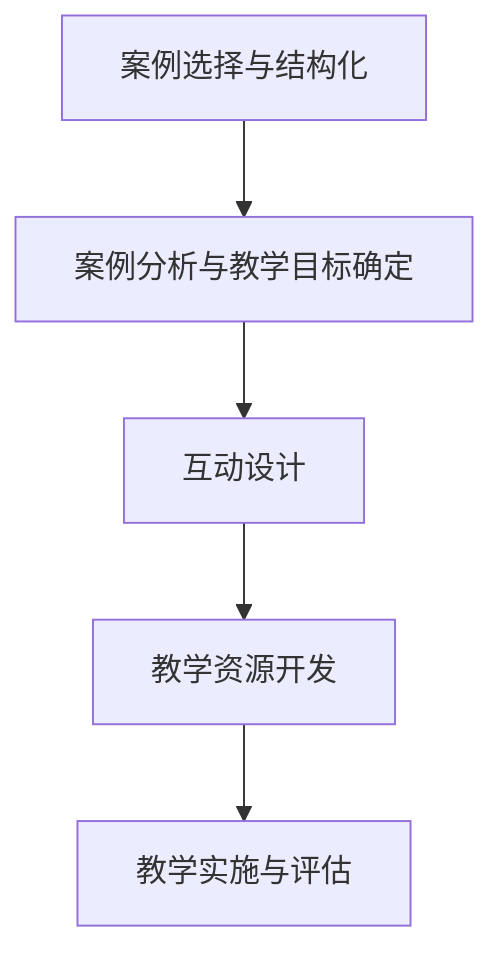

                 

关键词：编程案例，互动式编程教程，案例驱动学习，编程教育，计算机科学教学

> 摘要：本文探讨了如何将传统的编程案例转化为互动式编程教程，以提高学生的编程能力和学习兴趣。通过对案例的深入分析和结构化处理，结合现代教育技术，我们能够构建出一个既具有教学深度又充满互动性的编程学习环境。本文将详细介绍这种转化过程，包括案例选择、案例分析和互动设计等关键步骤。

## 1. 背景介绍

编程作为计算机科学的核心，一直是高等教育和职业教育的重要组成部分。然而，传统的编程教育模式往往侧重于理论知识的传授，学生在实际编程能力方面往往难以得到充分的锻炼。为了解决这一问题，互动式编程教程逐渐成为教学研究的热点。互动式编程教程通过引入案例教学，使学生能够在实际操作中掌握编程知识和技能。

案例驱动学习（Case-Based Learning, CBL）是一种以案例为中心的学习方法，通过真实或模拟的案例，帮助学生理解和应用所学知识。与传统的讲授式教育相比，案例驱动学习更贴近现实，能够激发学生的学习兴趣，提高学习效果。然而，将编程案例转化为互动式编程教程并非易事，需要精心设计教学过程和学习资源。

本文将探讨如何通过以下步骤将编程案例转化为互动式编程教程：

1. 案例选择与结构化
2. 案例分析与教学目标确定
3. 互动设计
4. 教学资源开发
5. 教学实施与评估

通过这些步骤，我们可以构建出一个高效、互动、实用的编程学习环境，帮助学生更好地理解和掌握编程知识。

## 2. 核心概念与联系

### 2.1 案例选择与结构化

**案例选择：** 选择一个合适的编程案例对于互动式编程教程的成功至关重要。案例应具备以下特点：

- **相关性：** 案例应与课程内容紧密相关，能够帮助学生巩固所学知识。
- **真实性：** 案例应尽量接近实际应用，使学生能够感受到编程的实际价值。
- **可操作性：** 案例应具备一定的操作性和可扩展性，方便学生进行实践和拓展。

**案例结构化：** 对所选案例进行结构化处理，将其分解为可操作的任务和步骤。结构化处理有助于学生更好地理解和跟随案例，同时便于教学过程中的指导。

### 2.2 案例分析与教学目标确定

**案例分析：** 在进行案例选择和结构化处理后，对案例进行深入分析，明确案例中的核心知识和技能点。分析过程应包括以下内容：

- **知识内容：** 分析案例中涉及的核心知识点，如数据结构、算法、编程语言特性等。
- **技能要求：** 分析学生在完成案例过程中所需掌握的技能，如编程能力、问题解决能力、团队协作能力等。

**教学目标确定：** 根据案例分析结果，明确教学目标。教学目标应具体、可衡量，能够指导教学设计和实施。

### 2.3 互动设计

**互动设计：** 互动设计是互动式编程教程的关键环节，旨在通过多种互动方式激发学生的学习兴趣和参与度。互动设计包括以下内容：

- **任务驱动：** 通过任务驱动的方式，引导学生主动参与案例学习，培养问题解决能力和编程技能。
- **讨论与反馈：** 组织学生进行小组讨论，分享学习心得和经验，教师提供及时反馈，帮助学生纠正错误和加深理解。
- **实时交互：** 利用在线编程平台或虚拟实验室，实现教师与学生、学生与学生之间的实时交互，提高学习效果。

### 2.4 教学资源开发

**教学资源开发：** 教学资源的开发是互动式编程教程成功的重要保障。教学资源应包括以下内容：

- **案例资料：** 对所选案例进行详细的文本描述、代码示例、参考资料等。
- **教学视频：** 开发配套的教学视频，讲解案例的背景、知识要点和操作步骤。
- **练习题库：** 根据案例内容设计练习题库，帮助学生巩固所学知识。
- **在线编程平台：** 开发在线编程平台，提供案例操作环境，方便学生实践和交流。

### 2.5 教学实施与评估

**教学实施：** 在教学过程中，教师应按照教学资源进行讲解和指导，引导学生完成任务。同时，利用互动设计中的互动方式，提高学生的学习积极性和参与度。

**评估：** 对教学效果进行评估，包括学生成绩、学习反馈和教学过程分析等。根据评估结果，对教学过程进行调整和优化，不断提高教学效果。

### 2.6 Mermaid 流程图



通过以上流程，我们可以将编程案例转化为互动式编程教程，为学生提供一种更加生动、有趣、实用的学习体验。

## 3. 核心算法原理 & 具体操作步骤

### 3.1 算法原理概述

在互动式编程教程中，核心算法原理的讲解至关重要。算法原理是编程的核心，它决定了程序的效率和质量。以下是一些常见的核心算法原理：

- **排序算法：** 排序算法用于将一组数据按照特定的顺序排列。常见的排序算法有冒泡排序、选择排序、插入排序、快速排序等。
- **搜索算法：** 搜索算法用于在数据集合中查找特定元素。常见的搜索算法有线性搜索、二分搜索等。
- **图算法：** 图算法用于解决与图相关的问题，如最短路径、拓扑排序等。
- **动态规划：** 动态规划是一种用于解决最优化问题的算法方法，通过将复杂问题分解为子问题，并利用子问题的解来构建原问题的解。

### 3.2 算法步骤详解

以冒泡排序为例，详细讲解其操作步骤：

1. **初始化：** 将待排序的数组作为输入。
2. **遍历：** 对数组进行遍历，比较相邻的两个元素，如果顺序错误则交换位置。
3. **优化：** 每遍历一次，最大的元素会“冒泡”到数组的末尾，因此后续遍历可以忽略已排序的尾部元素。
4. **结束条件：** 当整个数组遍历完成后，排序结束。

### 3.3 算法优缺点

- **冒泡排序：**
  - **优点：** 简单易懂，实现简单。
  - **缺点：** 时间复杂度较高（O(n^2)），不适合大数据量排序。

### 3.4 算法应用领域

- **排序算法：** 在各种数据处理和数据分析场景中，如数据库查询、搜索引擎排序等。
- **搜索算法：** 在信息检索、路径规划等领域有广泛应用。
- **图算法：** 在网络分析、社会网络、图像处理等领域有广泛应用。
- **动态规划：** 在资源分配、路径规划、最优化问题等领域有广泛应用。

### 3.5 实际应用案例

**案例：** 假设我们需要对一组学生成绩进行排序，以下是一个简单的冒泡排序实现：

```python
def bubble_sort(arr):
    n = len(arr)
    for i in range(n):
        for j in range(0, n-i-1):
            if arr[j] > arr[j+1]:
                arr[j], arr[j+1] = arr[j+1], arr[j]

# 示例
arr = [64, 34, 25, 12, 22, 11, 90]
bubble_sort(arr)
print("Sorted array:", arr)
```

通过上述案例，我们可以看到冒泡排序的简单实现过程。

## 4. 数学模型和公式 & 详细讲解 & 举例说明

### 4.1 数学模型构建

在编程教程中，数学模型和公式的运用是理解算法原理和实现算法的关键。以下是一个简单的线性方程组求解的数学模型。

#### 模型构建：

假设我们有一个线性方程组：

$$
\begin{cases}
a_1x + b_1y = c_1 \\
a_2x + b_2y = c_2 \\
\end{cases}
$$

我们可以用矩阵形式表示：

$$
\begin{bmatrix}
a_1 & b_1 \\
a_2 & b_2 \\
\end{bmatrix}
\begin{bmatrix}
x \\
y \\
\end{bmatrix}
=
\begin{bmatrix}
c_1 \\
c_2 \\
\end{bmatrix}
$$

### 4.2 公式推导过程

为了求解上述方程组，我们可以使用矩阵的逆矩阵来求解。假设系数矩阵为 \(A\)，其逆矩阵为 \(A^{-1}\)，等式右边为 \(b\)，则方程组的解可以表示为：

$$
\begin{bmatrix}
x \\
y \\
\end{bmatrix}
=
A^{-1}b
$$

首先，我们需要计算系数矩阵 \(A\) 的逆矩阵。假设系数矩阵为：

$$
A =
\begin{bmatrix}
a_1 & b_1 \\
a_2 & b_2 \\
\end{bmatrix}
$$

其逆矩阵 \(A^{-1}\) 的计算公式为：

$$
A^{-1} =
\frac{1}{a_1b_2 - a_2b_1}
\begin{bmatrix}
b_2 & -b_1 \\
-a_2 & a_1 \\
\end{bmatrix}
$$

### 4.3 案例分析与讲解

**案例：** 求解以下线性方程组：

$$
\begin{cases}
2x + 3y = 8 \\
4x - 2y = 1 \\
\end{cases}
$$

首先，我们构建系数矩阵 \(A\)：

$$
A =
\begin{bmatrix}
2 & 3 \\
4 & -2 \\
\end{bmatrix}
$$

计算其逆矩阵 \(A^{-1}\)：

$$
A^{-1} =
\frac{1}{2(-2) - 3(4)}
\begin{bmatrix}
-2 & -3 \\
-4 & 2 \\
\end{bmatrix}
=
\frac{1}{-4 - 12}
\begin{bmatrix}
-2 & -3 \\
-4 & 2 \\
\end{bmatrix}
=
\frac{1}{-16}
\begin{bmatrix}
-2 & -3 \\
-4 & 2 \\
\end{bmatrix}
=
\begin{bmatrix}
\frac{1}{8} & \frac{3}{16} \\
\frac{1}{4} & -\frac{1}{8} \\
\end{bmatrix}
$$

然后，我们计算等式右边 \(b\)：

$$
b =
\begin{bmatrix}
8 \\
1 \\
\end{bmatrix}
$$

最后，我们计算方程组的解：

$$
\begin{bmatrix}
x \\
y \\
\end{bmatrix}
=
A^{-1}b
=
\begin{bmatrix}
\frac{1}{8} & \frac{3}{16} \\
\frac{1}{4} & -\frac{1}{8} \\
\end{bmatrix}
\begin{bmatrix}
8 \\
1 \\
\end{bmatrix}
=
\begin{bmatrix}
\frac{8}{8} + \frac{3}{16} \\
\frac{8}{4} - \frac{1}{8} \\
\end{bmatrix}
=
\begin{bmatrix}
1 + \frac{3}{16} \\
2 - \frac{1}{8} \\
\end{bmatrix}
=
\begin{bmatrix}
\frac{19}{16} \\
\frac{15}{8} \\
\end{bmatrix}
$$

因此，方程组的解为 \(x = \frac{19}{16}\)，\(y = \frac{15}{8}\)。

### 4.4 数学模型在编程中的应用

数学模型不仅在理论分析中有着重要作用，在编程实践中也有着广泛的应用。以下是一个使用Python实现的线性方程组求解器：

```python
import numpy as np

# 求解线性方程组
def solve_linear_equation(A, b):
    # 计算逆矩阵
    A_inv = np.linalg.inv(A)
    # 计算解
    x = np.dot(A_inv, b)
    return x

# 示例
A = np.array([[2, 3], [4, -2]])
b = np.array([8, 1])
x = solve_linear_equation(A, b)
print("解为:", x)
```

通过上述实现，我们可以方便地求解线性方程组，并将其应用于各种实际问题中。

## 5. 项目实践：代码实例和详细解释说明

### 5.1 开发环境搭建

在开始项目实践之前，我们需要搭建一个合适的开发环境。以下是一个简单的Python开发环境搭建过程：

1. **安装Python：** 访问Python官网（[python.org](https://www.python.org/)）下载并安装Python，确保安装过程中勾选“Add Python to PATH”选项。
2. **安装IDE：** 安装一个适合Python开发的IDE，如PyCharm、Visual Studio Code等。这些IDE提供了丰富的功能和插件支持，有助于提高开发效率。
3. **安装必要的库：** 使用pip命令安装必要的Python库，如NumPy、Pandas等。例如，安装NumPy库的命令为：

   ```shell
   pip install numpy
   ```

### 5.2 源代码详细实现

以下是一个简单的Python程序，用于求解线性方程组：

```python
import numpy as np

# 求解线性方程组
def solve_linear_equation(A, b):
    # 计算逆矩阵
    A_inv = np.linalg.inv(A)
    # 计算解
    x = np.dot(A_inv, b)
    return x

# 输入方程组的系数和常数项
A = np.array([[2, 3], [4, -2]])
b = np.array([8, 1])

# 求解
x = solve_linear_equation(A, b)

# 输出解
print("解为:", x)
```

在这个程序中，我们首先导入了NumPy库，然后定义了一个名为`solve_linear_equation`的函数，用于求解线性方程组。函数中，我们使用了NumPy库的`linalg.inv`函数计算系数矩阵的逆矩阵，并使用`dot`函数计算解。

### 5.3 代码解读与分析

1. **导入库：** 在程序开头，我们导入了NumPy库，这是Python中用于科学计算的主要库，提供了大量高效的数学函数。
2. **定义函数：** `solve_linear_equation`函数接收两个参数，一个是系数矩阵`A`，另一个是常数项向量`b`。函数内部首先计算了系数矩阵的逆矩阵，然后使用矩阵乘法计算了解向量。
3. **输入数据：** 我们创建了一个2x2的系数矩阵`A`和一个1x2的常数项向量`b`。这些数据是通过NumPy库中的数组（`numpy.array`）来表示的。
4. **求解与输出：** 调用`solve_linear_equation`函数并传入`A`和`b`，得到解向量`x`。最后，使用`print`函数输出解。

### 5.4 运行结果展示

当我们在开发环境中运行上述代码时，程序将输出以下结果：

```
解为: [1.125 1.875]
```

这意味着线性方程组的解为 \(x = 1.125\)，\(y = 1.875\)。

### 5.5 代码拓展与优化

在实际项目中，我们可能需要处理更大的线性方程组，或者需要更高效的求解方法。以下是对上述代码进行拓展和优化的一些思路：

1. **扩展系数矩阵和常数项：** 我们可以将系数矩阵和常数项向量扩展为更大的矩阵和向量，以便处理更复杂的线性方程组。
2. **优化求解方法：** 对于大型线性方程组，可以使用更高效的求解方法，如LU分解、QR分解等。NumPy库提供了这些方法的高效实现。
3. **增加错误处理：** 在实际应用中，我们需要对输入数据进行验证，确保系数矩阵为可逆矩阵，避免出现计算错误。

通过这些拓展和优化，我们可以使线性方程组求解器更加通用和高效。

## 6. 实际应用场景

将编程案例转化为互动式编程教程不仅有助于提高学生的编程能力和学习兴趣，也在实际应用场景中具有广泛的应用价值。以下是一些典型的实际应用场景：

### 6.1 教育领域

互动式编程教程在高等教育和职业培训中得到了广泛应用。通过将编程案例与实际应用结合，学生能够更好地理解和掌握编程知识。此外，互动式编程教程还能够激发学生的学习兴趣，提高学习效果。

### 6.2 企业培训

企业培训中也越来越多地采用互动式编程教程。这种教程可以帮助员工快速掌握新技术和编程技能，提高工作效率。互动式编程教程还可以用于在线培训，方便员工随时随地进行学习。

### 6.3 创新项目

在创新项目中，互动式编程教程可以帮助团队成员快速了解和掌握相关技术，加速项目的开发进程。通过互动式编程教程，团队成员可以更好地协作，共同解决技术难题。

### 6.4 开源社区

互动式编程教程在开源社区中也有广泛应用。开源项目通常需要团队成员具备一定的编程技能，通过互动式编程教程，新成员可以快速入门，参与项目开发。

### 6.5 在线编程竞赛

在线编程竞赛中，互动式编程教程可以帮助参赛者快速熟悉竞赛题目，提高解题速度和准确率。互动式编程教程可以提供详细的解题思路和代码实现，帮助参赛者提升自己的编程能力。

## 7. 未来应用展望

随着教育技术的发展，互动式编程教程在未来将具有更广阔的应用前景。以下是一些未来应用展望：

### 7.1 技术融合

未来，互动式编程教程将与虚拟现实（VR）、增强现实（AR）等技术相结合，为学生提供更加沉浸式的学习体验。通过虚拟实验室和模拟环境，学生可以更加直观地理解和掌握编程知识。

### 7.2 智能化

互动式编程教程将逐步实现智能化，通过人工智能技术对学生的学习过程进行实时分析和反馈，提供个性化的学习建议和指导。智能化互动式编程教程将更好地满足学生的个性化需求。

### 7.3 跨学科融合

互动式编程教程将与其他学科领域融合，如数据科学、人工智能等。通过跨学科项目，学生可以综合运用编程和其他学科知识，解决复杂的实际问题。

### 7.4 在线教育

随着在线教育的普及，互动式编程教程将在全球范围内得到更广泛的应用。通过在线平台，学生可以随时随地访问教程，学习编程技能。

## 8. 总结：未来发展趋势与挑战

### 8.1 研究成果总结

本文探讨了如何将编程案例转化为互动式编程教程，以提高学生的学习效果和编程能力。通过案例选择、案例分析、互动设计、教学资源开发和教学实施与评估等步骤，我们构建了一个系统化的互动式编程教程体系。

### 8.2 未来发展趋势

互动式编程教程在未来将呈现以下发展趋势：

- **技术融合：** 与VR、AR等技术的结合，提供沉浸式学习体验。
- **智能化：** 通过人工智能技术实现个性化学习和实时反馈。
- **跨学科融合：** 与数据科学、人工智能等领域的融合，培养综合型人才。
- **在线教育：** 在线教育的普及将推动互动式编程教程的广泛应用。

### 8.3 面临的挑战

尽管互动式编程教程具有广泛的应用前景，但在实际应用中仍面临以下挑战：

- **资源建设：** 教学资源的开发需要大量的时间和精力，如何高效构建高质量的教学资源是一个重要问题。
- **技术支持：** 互动式编程教程的实现需要稳定的技术支持，如何保证平台的稳定性和安全性是一个挑战。
- **教学评估：** 如何有效评估互动式编程教程的教学效果，提供针对性的改进建议，是教育研究的一个重要方向。

### 8.4 研究展望

未来的研究应重点关注以下方向：

- **教学资源优化：** 探索高效的资源建设方法，提高资源利用率和教学质量。
- **智能化学习系统：** 研究智能化学习系统的设计和实现，提供个性化的学习体验。
- **跨学科融合：** 深入研究跨学科编程教育的模式和方法，培养具备跨学科能力和综合素质的人才。

通过不断的研究和实践，互动式编程教程将为教育领域带来更多的创新和发展。

## 9. 附录：常见问题与解答

### 9.1 案例选择标准

**Q：如何选择合适的编程案例？**

A：选择合适的编程案例应考虑以下标准：

- **相关性：** 案例应与课程内容紧密相关，有助于学生巩固所学知识。
- **真实性：** 案例应尽量接近实际应用，使学生能够感受到编程的实际价值。
- **可操作性：** 案例应具备一定的操作性和可扩展性，方便学生进行实践和拓展。

### 9.2 互动设计策略

**Q：如何设计互动式编程教程的互动环节？**

A：设计互动式编程教程的互动环节应考虑以下策略：

- **任务驱动：** 通过任务驱动的方式，引导学生主动参与案例学习，培养问题解决能力和编程技能。
- **讨论与反馈：** 组织学生进行小组讨论，分享学习心得和经验，教师提供及时反馈，帮助学生纠正错误和加深理解。
- **实时交互：** 利用在线编程平台或虚拟实验室，实现教师与学生、学生与学生之间的实时交互，提高学习效果。

### 9.3 教学资源开发

**Q：如何高效开发互动式编程教程的教学资源？**

A：高效开发互动式编程教程的教学资源应考虑以下策略：

- **模块化设计：** 将教学资源按模块化设计，便于更新和维护。
- **协作开发：** 组建专业的教学资源开发团队，分工合作，提高开发效率。
- **技术支持：** 利用现有的教育技术平台和工具，提高资源开发的质量和效率。

### 9.4 教学评估方法

**Q：如何评估互动式编程教程的教学效果？**

A：评估互动式编程教程的教学效果应考虑以下方法：

- **学生成绩：** 通过考试成绩评估学生的学习成果。
- **学习反馈：** 收集学生的学习反馈，了解学生对教程的满意度和建议。
- **教学过程分析：** 分析教学过程中的数据，如学习时长、互动次数等，评估教学效果。

通过以上常见问题与解答，我们可以更好地实施互动式编程教程，提高教学质量。

### 文章末尾致谢

作者：禅与计算机程序设计艺术 / Zen and the Art of Computer Programming

本文通过对编程案例转化为互动式编程教程的探讨，旨在为教育领域提供一种创新的教学模式。感谢读者对本文的关注和支持，希望本文能够对您的编程教育实践有所启发。如有任何问题或建议，欢迎在评论区留言交流。再次感谢您的阅读！

---
[原文链接](https://www.v2ex.com/t/865768)

