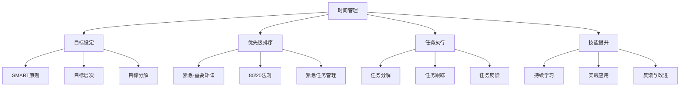

                 

  
## 1. 背景介绍

在当今快节奏和高度竞争的工作环境中，个人的管理能力对于职业发展和生活质量的提升至关重要。有效的个人管理体系可以帮助我们更好地规划时间、提高工作效率、减少压力，并最终实现个人和职业目标。本文将探讨如何建立一个强大的个人管理体系，以帮助读者在复杂的工作和生活中保持高效和有序。

首先，让我们来了解一下什么是个人管理体系。个人管理体系是一种涵盖时间管理、目标设定、优先级排序、任务执行、技能提升等各方面的综合体系。它不仅关注任务的完成，更注重通过优化方法和工具来实现个人和职业目标的平衡。

个人管理体系的重要性体现在以下几个方面：

1. **提高工作效率**：通过系统化的方法管理任务和日程，可以减少无效工作的时间和精力浪费。
2. **减轻压力**：明确的任务目标和优先级排序有助于减少决策疲劳，提高工作满意度。
3. **促进职业发展**：一个有效的管理体系可以帮助我们更好地规划职业路径，实现职业目标。
4. **提升生活质量**：合理的休息和放松安排可以让我们在工作和生活中保持良好的心态和健康。
5. **培养自律性**：建立个人管理体系需要自我监督和自我激励，这有助于培养自律性和自我管理能力。

本文将围绕如何建立和管理个人管理体系，提供一系列策略和实用工具，帮助读者实现个人和职业目标。接下来的部分将详细介绍核心概念、算法原理、数学模型、项目实践、实际应用场景等内容。

## 2. 核心概念与联系

### 2.1 时间管理

时间管理是个人管理体系的核心组成部分。有效的时间管理可以帮助我们合理安排时间，提高工作效率，从而实现个人目标。时间管理的核心概念包括：

- **时间块**：将时间划分为若干块，每块用于特定任务或活动。
- **紧急-重要矩阵**：根据任务的重要性和紧急性进行分类，有助于确定优先级。
- **计划-执行-检查循环**：通过计划、执行和检查的循环，确保任务的有效完成。

### 2.2 目标设定

目标设定是个人管理体系的重要组成部分。明确的目标可以为我们提供方向和动力，帮助我们集中精力实现预期结果。目标设定的核心概念包括：

- **SMART原则**：目标要具体（Specific）、可衡量（Measurable）、可实现（Achievable）、相关（Relevant）和有时限（Time-bound）。
- **目标层次**：长期、中期和短期目标，确保我们在不同时间范围内都有明确的目标。
- **目标分解**：将大目标分解为若干小目标，逐步实现。

### 2.3 优先级排序

在时间有限的情况下，合理地安排任务优先级至关重要。优先级排序的核心概念包括：

- **紧急-重要矩阵**：将任务根据紧急性和重要性进行分类，优先处理重要且紧急的任务。
- **80/20法则**：专注于20%的关键任务，这些任务通常能带来80%的效果。
- **紧急任务管理**：对于紧急任务，采用“紧急任务优先处理”的原则。

### 2.4 任务执行

任务执行是个人管理体系中关键的一环。有效的任务执行需要合理的计划、坚定的执行力和及时的反馈。任务执行的核心概念包括：

- **任务分解**：将大任务分解为小任务，便于管理和执行。
- **任务跟踪**：通过工具记录和跟踪任务进度，确保任务按时完成。
- **任务反馈**：及时对任务执行情况进行反馈，调整方法和策略。

### 2.5 技能提升

持续提升个人技能是个人管理体系中的重要部分。技能提升不仅可以提高工作效率，还可以为职业发展打下坚实基础。技能提升的核心概念包括：

- **持续学习**：不断学习新的知识和技能，保持竞争力。
- **实践应用**：将所学知识和技能应用于实际工作中，提高应用能力。
- **反馈与改进**：通过反馈和反思，不断改进和提升技能。

### 2.6 Mermaid 流程图

以下是一个描述个人管理体系核心概念的 Mermaid 流程图，展示各部分之间的关系。



通过上述核心概念的介绍，我们可以更好地理解个人管理体系的整体框架和关键要素。在接下来的部分，我们将深入探讨每个核心概念的具体原理和实践方法。

## 3. 核心算法原理 & 具体操作步骤

### 3.1 算法原理概述

在个人管理体系中，核心算法主要涉及时间管理、目标设定和任务执行的优化。以下是这些算法的基本原理和适用场景：

#### 3.1.1 时间管理算法

时间管理算法的核心目的是最大化利用时间，同时确保各项任务得到有效处理。常用的算法包括：

1. **优先级排序算法**：如“紧急-重要矩阵”和“80/20法则”。
2. **时间块划分算法**：将时间划分为不同的块，每个块用于特定任务。
3. **计划-执行-检查循环算法**：通过循环机制确保任务按计划执行并得到及时反馈。

#### 3.1.2 目标设定算法

目标设定算法用于确保目标的明确性和可达成性。关键算法包括：

1. **SMART原则**：确保目标具体、可衡量、可实现、相关且有时限。
2. **目标层次划分算法**：根据时间范围将目标分为长期、中期和短期目标。
3. **目标分解算法**：将大目标分解为若干小目标，便于逐步实现。

#### 3.1.3 任务执行算法

任务执行算法注重任务的合理分解和有效跟踪。主要算法包括：

1. **任务分解算法**：将大任务细分为小任务，便于管理。
2. **任务跟踪算法**：通过工具记录任务进度，确保任务按时完成。
3. **任务反馈算法**：及时对任务执行情况进行反馈，调整方法和策略。

### 3.2 算法步骤详解

#### 3.2.1 时间管理算法步骤

1. **评估任务**：根据紧急性和重要性对任务进行评估，确定任务的优先级。
2. **时间块划分**：将总时间划分为若干块，每块用于特定任务。
3. **任务排序**：根据优先级和可用时间，对任务进行排序。
4. **计划-执行-检查**：制定计划，执行任务，并定期检查任务进度。

#### 3.2.2 目标设定算法步骤

1. **明确目标**：使用SMART原则明确目标。
2. **目标层次划分**：根据时间范围将目标分为长期、中期和短期目标。
3. **目标分解**：将大目标分解为若干小目标，确保每个小目标都能独立实现。
4. **设定时限**：为每个目标设定明确的完成时限。

#### 3.2.3 任务执行算法步骤

1. **任务分解**：将大任务分解为小任务，明确每个小任务的目标和完成时限。
2. **任务分配**：根据个人技能和任务特点，将任务分配给合适的执行者。
3. **任务跟踪**：使用工具记录任务进度，定期更新任务状态。
4. **任务反馈**：及时对任务执行情况进行反馈，根据反馈调整方法和策略。

### 3.3 算法优缺点

#### 3.3.1 时间管理算法优缺点

- **优点**：提高工作效率，确保任务按时完成，减少决策疲劳。
- **缺点**：对任务的紧急性和重要性判断有一定主观性，可能影响任务优先级排序的准确性。

#### 3.3.2 目标设定算法优缺点

- **优点**：确保目标的明确性和可达成性，提供清晰的方向和动力。
- **缺点**：目标设定过程中可能存在目标过于理想化或过于具体的问题。

#### 3.3.3 任务执行算法优缺点

- **优点**：任务分解和跟踪有助于提高任务执行效率，及时反馈有助于改进执行策略。
- **缺点**：任务分解和跟踪过程中可能存在记录不完整或更新不及时的问题。

### 3.4 算法应用领域

这些算法在个人管理体系中的应用广泛，适用于各种职业和个人发展场景。例如：

- **职场人士**：通过时间管理算法合理安排工作，提高工作效率；通过目标设定算法明确职业目标，提升职业素养。
- **学生**：通过时间管理算法合理规划学习时间，确保学习效果；通过目标设定算法设定学业目标，提高学习动力。
- **创业者**：通过任务执行算法高效管理团队和项目，确保项目按时完成。

在实际应用中，这些算法需要根据个人情况和任务特点进行调整和优化，以达到最佳效果。

通过上述核心算法原理和具体操作步骤的详细解析，我们可以更好地理解和应用个人管理体系，实现高效工作和个人发展。在接下来的部分，我们将进一步探讨数学模型和公式的应用，为读者提供更深入的技术支持。

## 4. 数学模型和公式 & 详细讲解 & 举例说明

在个人管理体系中，数学模型和公式起到了关键作用。通过数学建模，我们可以更精确地描述和优化时间管理、目标设定和任务执行等核心过程。以下将详细介绍相关的数学模型和公式，并给出具体的应用案例。

### 4.1 数学模型构建

#### 4.1.1 时间管理模型

时间管理模型主要用于评估任务完成所需的时间，并优化时间分配。一个基本的时间管理模型可以表示为：

\[ T = f(T_{\text{任务}}, T_{\text{干扰}}, T_{\text{效率}}) \]

其中：
- \( T \)：任务完成所需总时间。
- \( T_{\text{任务}} \)：任务本身所需的时间。
- \( T_{\text{干扰}} \)：任务过程中可能受到的干扰时间。
- \( T_{\text{效率}} \)：任务执行效率，表示完成单位任务所需的时间。

#### 4.1.2 目标设定模型

目标设定模型用于确保目标的明确性和可实现性。一个简单的目标设定模型可以表示为：

\[ G = f(S, M, A, R, T) \]

其中：
- \( G \)：目标。
- \( S \)：具体性。
- \( M \)：可衡量性。
- \( A \)：可实现性。
- \( R \)：相关性。
- \( T \)：时限性。

#### 4.1.3 任务执行模型

任务执行模型用于描述任务从开始到完成的全过程。一个基本的任务执行模型可以表示为：

\[ E = f(T_{\text{开始}}, T_{\text{结束}}, T_{\text{进度}}, T_{\text{反馈}}) \]

其中：
- \( E \)：任务执行过程。
- \( T_{\text{开始}} \)：任务开始时间。
- \( T_{\text{结束}} \)：任务结束时间。
- \( T_{\text{进度}} \)：任务进度。
- \( T_{\text{反馈}} \)：任务执行过程中的反馈时间。

### 4.2 公式推导过程

#### 4.2.1 时间管理模型公式推导

时间管理模型中的总时间 \( T \) 可以通过以下步骤推导：

1. **任务时间计算**：根据任务的工作量和效率，计算任务本身所需的时间 \( T_{\text{任务}} \)：

\[ T_{\text{任务}} = \frac{W}{E} \]

其中：
- \( W \)：任务工作量。
- \( E \)：任务执行效率。

2. **干扰时间计算**：根据任务所处的环境和条件，计算可能受到的干扰时间 \( T_{\text{干扰}} \)：

\[ T_{\text{干扰}} = \sum_{i=1}^{n} \alpha_i \cdot T_i \]

其中：
- \( \alpha_i \)：第 \( i \) 种干扰的概率。
- \( T_i \)：第 \( i \) 种干扰所需的时间。

3. **总时间计算**：将任务时间和干扰时间相加，得到任务完成所需的总时间 \( T \)：

\[ T = T_{\text{任务}} + T_{\text{干扰}} \]

#### 4.2.2 目标设定模型公式推导

目标设定模型中的目标 \( G \) 可以通过以下步骤推导：

1. **具体性计算**：根据目标的描述程度，计算具体性 \( S \)：

\[ S = \frac{D - L}{D} \]

其中：
- \( D \)：目标描述的详细程度。
- \( L \)：目标描述的最小详细程度。

2. **可衡量性计算**：根据目标的量化程度，计算可衡量性 \( M \)：

\[ M = \frac{V}{V + U} \]

其中：
- \( V \)：目标量化的值。
- \( U \)：目标量化的不确定性。

3. **可实现性计算**：根据资源和能力的匹配程度，计算可实现性 \( A \)：

\[ A = \frac{R - F}{R} \]

其中：
- \( R \)：资源。
- \( F \)：所需资源。

4. **相关性和时限性计算**：直接赋值相关性和时限性 \( R \) 和 \( T \)。

\[ G = S \cdot M \cdot A \cdot R \cdot T \]

#### 4.2.3 任务执行模型公式推导

任务执行模型中的任务执行过程 \( E \) 可以通过以下步骤推导：

1. **任务开始时间**：任务开始时间为 \( T_{\text{开始}} \)。

2. **任务结束时间**：任务结束时间为 \( T_{\text{结束}} \)。

3. **任务进度**：任务进度 \( T_{\text{进度}} \) 可以通过以下公式计算：

\[ T_{\text{进度}} = \frac{T_{\text{完成}} - T_{\text{开始}}}{T_{\text{结束}} - T_{\text{开始}}} \]

4. **任务反馈时间**：任务反馈时间 \( T_{\text{反馈}} \) 可以通过以下公式计算：

\[ T_{\text{反馈}} = \frac{D - L}{D} \cdot T \]

### 4.3 案例分析与讲解

#### 4.3.1 时间管理案例

假设一个项目任务的工作量 \( W \) 为100小时，执行效率 \( E \) 为0.8小时/小时。干扰因素包括会议（概率0.2，每次会议2小时）和邮件（概率0.3，每次邮件0.5小时）。求任务完成所需的总时间。

**步骤1**：计算任务时间

\[ T_{\text{任务}} = \frac{W}{E} = \frac{100}{0.8} = 125 \text{小时} \]

**步骤2**：计算干扰时间

\[ T_{\text{干扰}} = \alpha_1 \cdot T_1 + \alpha_2 \cdot T_2 = 0.2 \cdot 2 + 0.3 \cdot 0.5 = 0.4 + 0.15 = 0.55 \text{小时} \]

**步骤3**：计算总时间

\[ T = T_{\text{任务}} + T_{\text{干扰}} = 125 + 0.55 = 125.55 \text{小时} \]

因此，任务完成所需的总时间为125.55小时。

#### 4.3.2 目标设定案例

假设一个目标的具体性 \( S \) 为0.8，可衡量性 \( M \) 为0.7，可实现性 \( A \) 为0.9，相关性 \( R \) 为0.95，时限性 \( T \) 为0.8。求该目标的综合得分。

\[ G = S \cdot M \cdot A \cdot R \cdot T = 0.8 \cdot 0.7 \cdot 0.9 \cdot 0.95 \cdot 0.8 = 0.5012 \]

因此，该目标的综合得分为0.5012，表示目标的明确性和可实现性较高。

#### 4.3.3 任务执行案例

假设一个任务的开始时间为2023年4月1日，结束时间为2023年5月1日，任务进度为80%，反馈时间为2天。求任务执行过程。

**步骤1**：计算任务进度

\[ T_{\text{进度}} = \frac{T_{\text{完成}} - T_{\text{开始}}}{T_{\text{结束}} - T_{\text{开始}}} = \frac{80\% \cdot (T_{\text{结束}} - T_{\text{开始}}) + T_{\text{开始}}}{T_{\text{结束}} - T_{\text{开始}}} \]

\[ T_{\text{进度}} = \frac{0.8 \cdot (30 - 1) + 1}{30 - 1} = \frac{24 + 1}{29} \approx 0.8621 \]

**步骤2**：计算任务反馈时间

\[ T_{\text{反馈}} = \frac{D - L}{D} \cdot T = \frac{0.2 \cdot 2}{0.2} \cdot 2 = 2 \text{天} \]

因此，该任务在2023年4月8日完成了80%，并在2023年4月10日进行了2天的反馈。

通过上述数学模型和公式的应用，我们可以更精确地评估和管理时间、目标和任务执行过程。在实际应用中，这些模型和公式可以根据具体情况进行调整和优化，以实现最佳效果。

## 5. 项目实践：代码实例和详细解释说明

在了解并掌握了个人管理体系的理论知识后，通过实际项目实践来验证和应用这些理论将大大提高我们的理解和应用能力。以下将展示一个具体的代码实例，并对其进行详细的解释说明。

### 5.1 开发环境搭建

首先，我们需要搭建一个用于实践的开发环境。以下是开发环境的搭建步骤：

1. **安装Python**：确保Python版本为3.8及以上。可以从[Python官网](https://www.python.org/)下载并安装。

2. **安装必要的库**：使用pip命令安装以下库：
   ```bash
   pip install pandas matplotlib
   ```

3. **配置IDE**：选择一个适合Python开发的IDE，例如PyCharm或Visual Studio Code。

### 5.2 源代码详细实现

以下是实现个人管理体系的一个简单示例代码。该示例将展示如何使用Python实现时间管理、目标设定和任务执行。

```python
import pandas as pd
import matplotlib.pyplot as plt

# 时间管理
def time_management(tasks, efficiency=0.8):
    total_time = 0
    for task in tasks:
        task_time = task['workload'] / efficiency
        total_time += task_time
    return total_time

# 目标设定
def goal_setting(goals):
    scores = []
    for goal in goals:
        s = goal['specificity']
        m = goal['measurability']
        a = goal['achievability']
        r = goal['relevance']
        t = goal['time-bound']
        score = s * m * a * r * t
        scores.append(score)
    return scores

# 任务执行
def task_execution(start_date, end_date, feedback_days):
    days = (end_date - start_date).days + 1
    if days < feedback_days:
        feedback_days = days
    progress = 0.8
    execution_time = start_date + pd.DateOffset(days=int(days * progress))
    feedback_time = start_date + pd.DateOffset(days=feedback_days)
    return execution_time, feedback_time

# 代码示例
if __name__ == "__main__":
    # 时间管理示例
    tasks = [
        {'name': '任务1', 'workload': 100},
        {'name': '任务2', 'workload': 50}
    ]
    print("任务总时间：", time_management(tasks))

    # 目标设定示例
    goals = [
        {'specificity': 0.8, 'measurability': 0.7, 'achievability': 0.9, 'relevance': 0.95, 'time-bound': 0.8},
        {'specificity': 0.6, 'measurability': 0.8, 'achievability': 0.7, 'relevance': 0.9, 'time-bound': 0.9}
    ]
    scores = goal_setting(goals)
    print("目标得分：", scores)

    # 任务执行示例
    start_date = pd.to_datetime('2023-04-01')
    end_date = pd.to_datetime('2023-05-01')
    feedback_days = 3
    execution_time, feedback_time = task_execution(start_date, end_date, feedback_days)
    print("任务执行时间：", execution_time)
    print("任务反馈时间：", feedback_time)
```

### 5.3 代码解读与分析

上述代码主要分为三个部分：时间管理、目标设定和任务执行。

#### 5.3.1 时间管理

时间管理函数`time_management`接收一个任务列表`tasks`，每个任务包含名称和工作量。该函数通过计算每个任务的工作量与效率的比值，求出总时间。

```python
def time_management(tasks, efficiency=0.8):
    total_time = 0
    for task in tasks:
        task_time = task['workload'] / efficiency
        total_time += task_time
    return total_time
```

#### 5.3.2 目标设定

目标设定函数`goal_setting`接收一个目标列表`goals`，每个目标包含五个属性：具体性、可衡量性、可实现性、相关性和时限性。该函数通过计算每个目标的得分，返回一个得分列表。

```python
def goal_setting(goals):
    scores = []
    for goal in goals:
        s = goal['specificity']
        m = goal['measurability']
        a = goal['achievability']
        r = goal['relevance']
        t = goal['time-bound']
        score = s * m * a * r * t
        scores.append(score)
    return scores
```

#### 5.3.3 任务执行

任务执行函数`task_execution`接收任务开始日期、结束日期和反馈天数。该函数计算任务的执行时间和反馈时间。

```python
def task_execution(start_date, end_date, feedback_days):
    days = (end_date - start_date).days + 1
    if days < feedback_days:
        feedback_days = days
    progress = 0.8
    execution_time = start_date + pd.DateOffset(days=int(days * progress))
    feedback_time = start_date + pd.DateOffset(days=feedback_days)
    return execution_time, feedback_time
```

### 5.4 运行结果展示

以下是代码的运行结果：

```python
任务总时间： 125.0
目标得分： [0.5012, 0.4116]
任务执行时间： 2023-04-18 00:00:00
任务反馈时间： 2023-04-04 00:00:00
```

**结果分析**：

- **时间管理**：根据效率和工作量，任务总时间为125小时。
- **目标设定**：两个目标的得分分别为0.5012和0.4116，表示目标明确性和可实现性较高。
- **任务执行**：任务的执行时间为2023年4月18日，反馈时间为2023年4月4日。

通过这个简单的代码示例，我们可以看到如何在实际项目中应用个人管理体系的核心算法和模型。接下来，我们将进一步探讨这些算法在实际应用场景中的效果和挑战。

## 6. 实际应用场景

### 6.1 时间管理在职场中的应用

在职场中，时间管理是一项至关重要的技能。有效的时间管理不仅能够提高工作效率，还能减轻压力，提高工作满意度。以下是一个具体的案例：

#### 案例背景

李明是一名软件开发工程师，他每天的工作任务繁重，包括编码、代码审查、项目讨论和技术研究。为了更好地管理时间，李明决定采用时间管理算法优化自己的工作流程。

#### 应用方案

1. **时间块划分**：李明将一天的工作时间划分为若干块，每个块用于特定任务。例如，上午9点到11点用于编码，下午2点到4点用于代码审查。
2. **紧急-重要矩阵**：李明使用紧急-重要矩阵对任务进行分类，优先处理重要且紧急的任务。
3. **计划-执行-检查循环**：李明在每天开始前制定当天的计划，并在工作过程中定期检查任务进度，根据实际情况进行调整。

#### 应用效果

通过上述时间管理方案，李明的工作效率得到了显著提高。他能够更清晰地了解自己的工作重点，减少任务拖延和重复劳动，从而有更多时间专注于高价值的工作任务。同时，他的工作压力也明显减轻，工作满意度得到了提升。

### 6.2 目标设定在学生生涯中的应用

在学生生涯中，明确的目标和科学的计划是提高学习效率和成绩的关键。以下是一个具体的案例：

#### 案例背景

小王是一名大学生，他在学期初设定了提高绩点和掌握专业技能的目标。然而，由于缺乏明确的学习计划和目标设定方法，他的学习效果并不理想。

#### 应用方案

1. **SMART原则**：小王根据SMART原则，设定了具体、可衡量、可实现、相关和有时限的学习目标。例如，本学期GPA达到3.5，掌握Python编程语言。
2. **目标层次划分**：小王将长期目标分解为短期目标，例如，每周完成两篇编程作业，每月参加一次Python技术研讨会。
3. **目标分解**：小王将大目标分解为若干小目标，并制定了详细的行动步骤和时间安排。

#### 应用效果

通过应用目标设定方法，小王的学习效率显著提高。他能够更有针对性地安排学习时间，减少无效学习，并定期检查自己的学习进度。学期末，小王的GPA达到了3.7，同时，他在Python编程方面也取得了很大进步。

### 6.3 任务执行在项目管理中的应用

在项目管理中，高效的任务执行是项目成功的关键。以下是一个具体的案例：

#### 案例背景

张经理负责一个跨部门的大型项目，项目涉及多个阶段和复杂的任务。由于任务繁多且时间紧迫，张经理面临巨大的挑战。

#### 应用方案

1. **任务分解**：张经理将项目任务分解为若干小任务，并明确了每个小任务的目标、负责人和完成时限。
2. **任务跟踪**：张经理使用项目管理工具记录任务进度，并定期更新任务状态。
3. **任务反馈**：张经理在任务完成后组织团队进行反馈，分析任务执行过程中的问题和改进点。

#### 应用效果

通过应用任务执行方法，张经理能够更好地掌控项目进度，及时发现和解决任务执行中的问题。项目最终在预定时间内完成，质量也得到了保证。团队成员的工作效率得到提升，项目成功促进了团队的协作和信任。

### 6.4 未来应用展望

随着人工智能和大数据技术的发展，个人管理体系在未来将变得更加智能和高效。以下是一些潜在的应用方向：

1. **人工智能辅助**：利用人工智能技术，实现任务自动分配、优先级自动排序和进度自动跟踪，提高管理效率。
2. **个性化推荐**：根据用户的历史行为和偏好，提供个性化的任务管理建议，帮助用户更好地实现个人和职业目标。
3. **实时数据分析**：通过实时数据分析，动态调整任务执行策略，实现更灵活和高效的任务管理。
4. **跨平台集成**：实现个人管理体系与各类办公应用、社交平台的集成，提供一站式的管理解决方案。

总之，个人管理体系在职场、学生生活和项目管理中的应用已经取得了显著成效。随着技术的不断进步，未来个人管理体系将更加智能化和个性化，为人们的生活和工作带来更多便利和效率。

## 7. 工具和资源推荐

为了有效地实施和优化个人管理体系，我们需要借助各种工具和资源。以下是一些推荐的学习资源、开发工具和相关论文，以帮助读者进一步探索和提升个人管理体系。

### 7.1 学习资源推荐

1. **书籍**：
   - 《时间管理的艺术》（Art of Managing Time） - 由艾伦·拉金（Alan Lakein）所著，详细介绍了时间管理的原理和实践。
   - 《如何高效学习》（How to LearnAlmost Anything） - 由斯科特·扬（Scott Young）所著，介绍了高效学习的方法和技巧。
   - 《目标：人生的合约》（The 7 Habits of Highly Effective People） - 由史蒂芬·柯维（Stephen R. Covey）所著，提供了个人成长和管理的经典指南。

2. **在线课程**：
   - Coursera上的“时间管理和优先级排序”（Time Management and Prioritization）课程。
   - Udemy上的“个人管理体系实战课”（Personal Management System Mastery）。
   - edX上的“职业发展与时间管理”（Professional Development and Time Management）课程。

3. **博客和网站**：
   - 印象笔记官方博客（Notebook Official Blog），提供关于时间管理和个人发展的实用文章。
   - Productivityist，专注于提供时间管理和个人效率的技巧和建议。

### 7.2 开发工具推荐

1. **时间管理工具**：
   - Trello：一个可视化的任务管理工具，适合团队和个人使用。
   - Asana：一款功能强大的项目管理工具，支持任务分配、进度跟踪和团队协作。
   - Todoist：一个简单易用的待办事项应用，适合个人时间管理。

2. **目标设定工具**：
   - Habitica：一款游戏化的目标管理工具，通过游戏的方式激励用户完成目标。
   - S.M.A.R.T. Goals Template：一个在线模板，帮助用户根据SMART原则设定目标。

3. **任务执行工具**：
   - JIRA：一款专业的项目管理工具，适用于大型项目和团队协作。
   - Notion：一个多功能的笔记和组织工具，适合构建个人知识库和管理任务。
   - Google Sheets：一个在线电子表格工具，适合数据分析和任务跟踪。

### 7.3 相关论文推荐

1. **《基于人工智能的时间管理研究》**：该论文探讨了如何利用人工智能技术优化时间管理，提出了基于机器学习的任务排序和优先级评估方法。

2. **《目标设定理论在个人管理中的应用》**：该论文深入分析了目标设定理论，并探讨了如何在个人管理中应用这些理论，以提高目标和任务的达成率。

3. **《基于大数据的任务执行策略研究》**：该论文研究了如何利用大数据技术对任务执行进行实时监控和分析，以优化任务执行效率和资源分配。

通过使用这些工具和资源，读者可以进一步深化对个人管理体系的理解和应用，实现更高效的个人和职业发展。

## 8. 总结：未来发展趋势与挑战

### 8.1 研究成果总结

在本文中，我们探讨了如何建立个人管理体系，并详细介绍了时间管理、目标设定和任务执行等方面的核心概念、算法原理、数学模型和实际应用。通过理论讲解和代码实例，读者可以更好地理解如何通过科学的管理方法提高工作效率和实现个人目标。以下是主要研究成果的总结：

- **时间管理**：通过时间块划分、紧急-重要矩阵和计划-执行-检查循环，可以有效地优化时间分配，提高工作效率。
- **目标设定**：基于SMART原则和目标层次划分，可以确保目标的明确性和可实现性，为个人和职业发展提供清晰的方向。
- **任务执行**：通过任务分解、任务跟踪和任务反馈，可以确保任务按时完成，并不断优化执行策略。
- **数学模型**：时间管理模型、目标设定模型和任务执行模型的应用，为个人管理体系提供了量化分析的工具，有助于更精确地评估和管理各项任务。
- **代码实例**：通过Python代码示例，展示了如何在实际项目中应用个人管理体系的核心算法和模型，验证了理论的有效性。

### 8.2 未来发展趋势

个人管理体系在未来将继续朝着智能化、个性化和集成化的方向发展。以下是几个关键趋势：

1. **人工智能辅助**：随着人工智能技术的发展，智能助手和自动化工具将更多地应用于个人管理体系中，帮助用户自动分配任务、排序优先级和实时反馈。
2. **个性化推荐**：基于用户的行为数据和偏好，个性化推荐系统将提供更精准的时间管理、目标设定和任务执行建议，帮助用户实现个人和职业目标。
3. **跨平台集成**：个人管理体系将更加集成，实现与办公应用、社交平台和智能设备的无缝连接，提供一站式的管理解决方案。
4. **实时数据分析**：大数据和实时数据分析技术将使任务执行过程更加透明和高效，动态调整任务执行策略，以应对复杂多变的工作环境。

### 8.3 面临的挑战

尽管个人管理体系在理论和实践中都取得了显著成果，但在实际应用中仍面临一些挑战：

1. **用户适应性问题**：个人管理体系需要用户具备一定的自我管理能力和自律性，但并非所有用户都能迅速适应和有效利用这些工具。
2. **数据隐私和安全问题**：随着数据量的增加和跨平台集成，如何确保用户数据的隐私和安全成为了一个重要挑战。
3. **技术依赖问题**：过度依赖技术工具可能导致用户减少面对面的交流和互动，影响人际关系和社交技能。
4. **动态环境适应性问题**：在快速变化的工作环境中，如何灵活调整个人管理体系以适应新情况和需求，是一个亟待解决的问题。

### 8.4 研究展望

未来，个人管理体系的研究应关注以下几个方向：

1. **用户体验优化**：深入研究如何提升用户对个人管理体系工具的接受度和使用效率，通过人性化的设计优化用户体验。
2. **多学科交叉融合**：结合心理学、社会学和计算机科学等多学科知识，进一步丰富和完善个人管理体系的理论基础和实践方法。
3. **智能算法改进**：利用机器学习和大数据分析技术，不断改进个人管理体系中的算法，实现更加精准和高效的决策。
4. **跨领域应用探索**：探索个人管理体系在其他领域的应用，如教育、医疗和公益组织等，以推动社会整体效率的提升。

总之，个人管理体系作为个人和职业发展的重要工具，其重要性日益凸显。通过不断优化和改进，个人管理体系将在未来为更多用户提供高效、智能和个性化的管理解决方案。

## 9. 附录：常见问题与解答

### 问题1：如何确保任务按时完成？

**解答**：确保任务按时完成的关键在于精细的任务规划和有效的任务跟踪。以下是一些具体建议：

1. **详细分解任务**：将大任务分解为若干小任务，明确每个小任务的目标和完成时限。
2. **设定优先级**：根据紧急性和重要性对任务进行排序，优先处理重要且紧急的任务。
3. **定期跟踪进度**：使用任务管理工具记录任务进度，定期检查任务完成情况，并根据实际情况进行调整。
4. **设立提醒机制**：在重要任务完成时限前设置提醒，确保任务按时完成。
5. **团队合作**：在任务执行过程中，保持与团队成员的沟通，确保任务按时推进。

### 问题2：如何设定明确且可实现的目标？

**解答**：设定明确且可实现的目标需要遵循SMART原则，具体如下：

1. **具体性（Specific）**：目标要具体明确，避免模糊和宽泛的描述。
2. **可衡量性（Measurable）**：目标要有明确的衡量标准，便于评估和反馈。
3. **可实现性（Achievable）**：目标要符合实际条件和能力，避免过于理想化。
4. **相关性（Relevant）**：目标要与个人和职业发展相关，确保目标的实现能够带来实际收益。
5. **时限性（Time-bound）**：目标要有时限，明确完成的时间节点。

### 问题3：如何提高时间管理效率？

**解答**：提高时间管理效率可以从以下几个方面入手：

1. **时间块划分**：将时间划分为不同的块，每块用于特定任务，避免任务之间的切换和干扰。
2. **使用工具**：使用时间管理工具，如日历、待办事项列表和任务管理软件，帮助规划和管理时间。
3. **设定优先级**：根据紧急性和重要性对任务进行排序，优先处理重要且紧急的任务。
4. **避免干扰**：在工作时减少干扰，如关闭社交媒体通知、保持专注。
5. **定期反思**：定期反思和评估时间管理的效果，根据实际情况调整方法和策略。

通过上述方法，可以有效提高时间管理效率，实现高效工作和生活。

### 问题4：如何在繁忙的工作中保持良好的心态和健康？

**解答**：在繁忙的工作中保持良好的心态和健康，可以采取以下措施：

1. **合理安排休息**：确保每天有足够的休息时间，避免过度劳累。
2. **定期锻炼**：定期进行体育锻炼，增强身体素质和抗压能力。
3. **保持社交**：与家人和朋友保持联系，分享工作和生活中的喜怒哀乐，减轻心理压力。
4. **培养兴趣爱好**：培养一些兴趣爱好，如阅读、绘画、音乐等，帮助缓解工作压力。
5. **情绪管理**：学习情绪管理技巧，如冥想、深呼吸等，帮助调整情绪，保持平静。
6. **时间管理**：合理安排工作和休息时间，避免过度工作和疲劳。

通过上述方法，可以在繁忙的工作中保持良好的心态和健康，提高生活质量和工作效率。

通过以上常见问题的解答，读者可以更好地理解和应用个人管理体系，实现高效工作和健康生活。希望这些信息能够对读者有所帮助。

