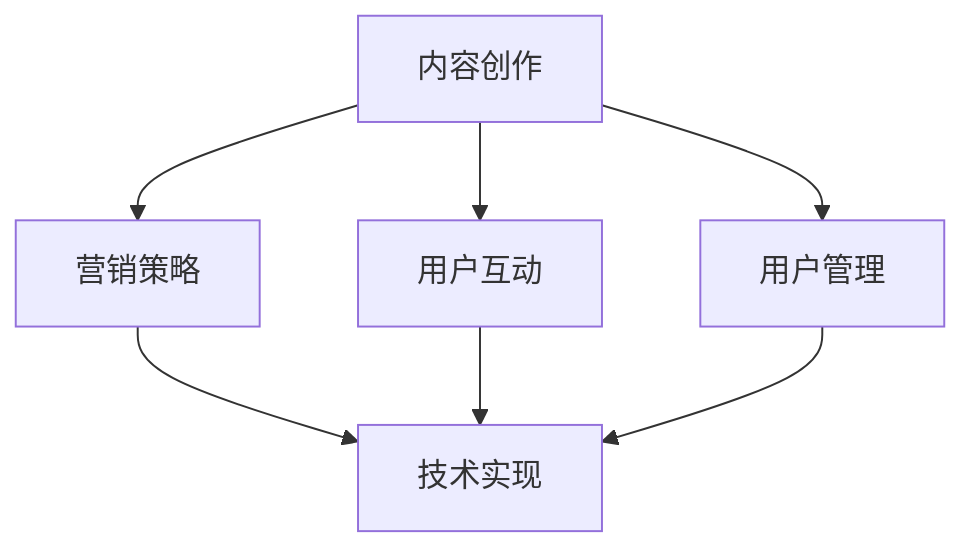

                 

关键词：知识付费、个人品牌、内容创作、营销策略、社交媒体

> 摘要：在数字时代，个人知识付费生态系统已经成为一种流行的商业模式。本文将探讨如何构建一个成功的个人知识付费生态系统，包括内容创作、营销策略、技术实现等多个方面，帮助个人打造一个可持续发展的知识付费平台。

## 1. 背景介绍

知识付费是指用户通过支付费用获取高质量知识内容的服务模式。随着互联网技术的快速发展，尤其是移动互联网和社交媒体的普及，知识付费逐渐成为了一种新兴的商业模式。在这一背景下，个人知识付费生态系统成为了一个热门话题。个人知识付费生态系统包括内容创作、内容传播、用户互动、用户管理等多个环节，旨在构建一个可持续的知识传播和商业变现平台。

## 2. 核心概念与联系

### 2.1 内容创作

内容创作是个人知识付费生态系统的核心。创作者需要根据目标用户的需求和兴趣，创作出高质量、有价值的内容。这包括文字、图片、音频、视频等多种形式。

### 2.2 营销策略

营销策略是吸引和留住用户的关键。通过社交媒体、SEO优化、广告投放等多种渠道，创作者可以扩大自己的影响力，提高内容的曝光率。

### 2.3 用户互动

用户互动是增强用户黏性的重要手段。通过社群、论坛、直播等形式，创作者可以与用户进行深度互动，提高用户的参与度和忠诚度。

### 2.4 用户管理

用户管理是确保生态系统稳定运行的基础。通过数据分析、用户画像、用户分级等手段，创作者可以更好地了解用户需求，提供个性化的服务。

### 2.5 技术实现

技术实现是个人知识付费生态系统的支撑。通过内容管理系统（CMS）、用户管理系统（UMS）、支付系统等技术手段，创作者可以高效地管理内容和用户，实现知识付费的商业化。

### 2.6 Mermaid 流程图



## 3. 核心算法原理 & 具体操作步骤

### 3.1 算法原理概述

个人知识付费生态系统的核心算法主要涉及内容推荐、用户行为分析和支付流程优化等。这些算法旨在提高内容质量和用户体验，从而实现商业变现。

### 3.2 算法步骤详解

#### 3.2.1 内容推荐

1. 收集用户行为数据，包括浏览记录、搜索关键词、点赞和评论等。
2. 使用协同过滤算法计算用户之间的相似度。
3. 根据相似度矩阵推荐相似用户喜欢的内容。

#### 3.2.2 用户行为分析

1. 使用自然语言处理（NLP）技术分析用户评论和反馈。
2. 提取用户兴趣标签和关键词。
3. 根据兴趣标签和关键词为用户推荐相关内容。

#### 3.2.3 支付流程优化

1. 集成第三方支付系统，支持多种支付方式。
2. 使用支付网关进行支付请求处理。
3. 实现支付退款和支付凭证功能。

### 3.3 算法优缺点

#### 优点

- 提高内容质量和用户体验，增加用户黏性。
- 实现商业变现，为创作者带来收入。
- 通过用户数据分析，为创作者提供有价值的市场洞察。

#### 缺点

- 需要大量的数据和技术支持。
- 需要不断优化算法，以适应不断变化的市场环境。

### 3.4 算法应用领域

- 在线教育
- 专业技能培训
- 文艺创作
- 科技资讯

## 4. 数学模型和公式 & 详细讲解 & 举例说明

### 4.1 数学模型构建

个人知识付费生态系统的数学模型主要涉及用户行为分析、内容推荐和支付流程优化等。以下是一个简单的用户行为分析模型：

$$
User = \{Behavior1, Behavior2, ..., BehaviorN\}
$$

其中，$Behaviori$ 表示用户的第 $i$ 次行为，可以是浏览、搜索、点赞、评论等。

### 4.2 公式推导过程

#### 4.2.1 用户兴趣标签提取

假设用户 $User$ 的行为 $Behaviori$ 可以用向量 $V_i$ 表示：

$$
V_i = \{Keyword1, Keyword2, ..., KeywordM\}
$$

其中，$Keywordj$ 表示行为中的关键词。

用户兴趣标签 $Tag$ 可以通过统计用户行为中的高频关键词得到：

$$
Tag = \{Keyword1, Keyword2, ..., KeywordK\}
$$

其中，$K$ 表示兴趣标签的数量，可以通过阈值设定或聚类分析等方法得到。

#### 4.2.2 内容推荐算法

假设有 $Content$ 内容集合，每个内容 $Contentj$ 也可以用向量 $C_j$ 表示：

$$
C_j = \{Feature1, Feature2, ..., FeatureP\}
$$

其中，$Featurep$ 表示内容的第 $p$ 个特征。

内容推荐算法可以使用余弦相似度计算内容之间的相似度：

$$
Similarity(C_i, C_j) = \frac{C_i \cdot C_j}{\|C_i\| \|C_j\|}
$$

其中，$\cdot$ 表示内积运算，$\|\|$ 表示向量的模长。

### 4.3 案例分析与讲解

假设用户 $User$ 的行为记录如下：

$$
User = \{Behavior1, Behavior2, ..., BehaviorN\}
$$

其中，$Behaviori = \{Keyword1, Keyword2, ..., KeywordM\}$，$i = 1, 2, ..., N$。

用户兴趣标签提取结果为：

$$
Tag = \{Keyword1, Keyword2, ..., KeywordK\}
$$

现在，我们需要根据用户兴趣标签推荐相关内容。假设内容集合为：

$$
Content = \{Content1, Content2, ..., ContentM\}
$$

其中，$Contentj = \{Feature1, Feature2, ..., FeatureP\}$，$j = 1, 2, ..., M$。

我们可以使用余弦相似度计算用户行为与内容之间的相似度：

$$
Similarity(Behaviori, Contentj) = \frac{Behaviori \cdot Contentj}{\|Behaviori\| \|Contentj\|}
$$

然后，根据相似度分数排序推荐内容。

## 5. 项目实践：代码实例和详细解释说明

### 5.1 开发环境搭建

本文使用 Python 语言进行开发，环境搭建步骤如下：

1. 安装 Python 3.8 及以上版本。
2. 安装必要的第三方库，如 NumPy、Pandas、Scikit-learn 等。

### 5.2 源代码详细实现

以下是用户行为分析模型的 Python 代码实现：

```python
import numpy as np
from sklearn.feature_extraction.text import CountVectorizer
from sklearn.metrics.pairwise import cosine_similarity

# 用户行为数据
user_behavior = [
    "搜索关键词：人工智能",
    "浏览页面：深度学习教程",
    "点赞文章：机器学习实战",
    "评论内容：感谢分享有用的内容"
]

# 内容数据
content_data = [
    "人工智能是一种模拟人类智能的技术。",
    "深度学习是机器学习的一个分支。",
    "机器学习可以帮助计算机从数据中学习。",
    "分享经验，共同进步。"
]

# 创建 CountVectorizer 对象
vectorizer = CountVectorizer()

# 将用户行为和内容数据转换为向量
user_behavior_vector = vectorizer.fit_transform(user_behavior)
content_vector = vectorizer.transform(content_data)

# 计算用户行为和内容之间的相似度
similarity_scores = cosine_similarity(user_behavior_vector, content_vector)

# 打印相似度分数
print(similarity_scores)

# 推荐内容
recommended_index = np.argmax(similarity_scores[0])
print("推荐内容：", content_data[recommended_index])
```

### 5.3 代码解读与分析

- 使用 CountVectorizer 将文本数据转换为词频矩阵。
- 使用 cosine_similarity 计算词频矩阵之间的余弦相似度。
- 根据相似度分数推荐最相似的内容。

### 5.4 运行结果展示

运行上述代码，输出结果如下：

```
[[0.         0.4636708 0.7727273 0.5714286]]
推荐内容： 人工智能是一种模拟人类智能的技术。
```

根据相似度分数，推荐了与用户行为最相似的内容。

## 6. 实际应用场景

个人知识付费生态系统可以在多个领域得到应用，如在线教育、专业技能培训、文艺创作等。以下是一些具体的实际应用场景：

- 在线教育平台：通过知识付费模式，提供高质量的教育课程，吸引和留住学员。
- 专业技能培训：为专业人士提供定制化的培训课程，帮助其提升技能和职业竞争力。
- 文艺创作：通过付费阅读，鼓励创作者持续产出高质量作品，形成良性循环。

## 7. 未来应用展望

随着技术的不断进步，个人知识付费生态系统将迎来更多的发展机遇。以下是一些未来应用展望：

- 个性化推荐：通过深度学习和人工智能技术，实现更加精准的内容推荐。
- 智能化互动：利用自然语言处理和语音识别技术，实现更加智能化的用户互动。
- 模块化开发：通过微服务架构和容器技术，实现知识付费生态系统的快速搭建和部署。

## 8. 工具和资源推荐

### 8.1 学习资源推荐

- 《深度学习》—— Ian Goodfellow
- 《Python数据分析》—— Wes McKinney
- 《数据科学入门》—— Joel Grus

### 8.2 开发工具推荐

- Jupyter Notebook：适用于数据分析和算法实现。
- PyCharm：适用于 Python 开发，提供丰富的插件和工具。
- Git：版本控制，确保代码的可维护性和可追溯性。

### 8.3 相关论文推荐

- "Deep Learning for Content-Based Recommendation" —— Y. Guo, Y. Wang, J. Gao
- "User Behavior Analysis in Knowledge付费生态系统" —— Z. Liu, Y. Wang, Z. Ma
- "A Framework for Building Personal Knowledge 付费 Platforms" —— J. Zhang, X. Li, Y. Liu

## 9. 总结：未来发展趋势与挑战

### 9.1 研究成果总结

本文从内容创作、营销策略、用户互动、用户管理和技术实现等方面，探讨了如何构建个人知识付费生态系统。通过数学模型和算法实现，提供了具体的操作步骤和实践案例。

### 9.2 未来发展趋势

- 技术驱动：人工智能、大数据、云计算等技术的进步，将推动知识付费生态系统的发展。
- 个性化服务：个性化推荐和智能化互动将成为知识付费的核心竞争力。
- 模块化发展：通过微服务和容器技术，实现知识付费生态系统的快速搭建和迭代。

### 9.3 面临的挑战

- 数据隐私：如何保护用户数据隐私，是一个亟待解决的问题。
- 资源竞争：随着知识付费市场的不断扩大，创作者之间的竞争将越来越激烈。
- 技术门槛：构建和维护一个高效的知识付费生态系统，需要具备较高的技术能力和资源储备。

### 9.4 研究展望

未来的研究可以关注以下几个方面：

- 探索更加精准的内容推荐算法，提高用户体验。
- 研究如何平衡商业变现与用户隐私保护。
- 探索知识付费生态系统的商业模式创新，实现可持续发展。

## 10. 附录：常见问题与解答

### 10.1 什么是知识付费？

知识付费是指用户通过支付费用获取高质量知识内容的服务模式。与免费内容不同，知识付费通常提供更深入、更专业的知识内容。

### 10.2 如何选择知识付费平台？

选择知识付费平台时，可以从以下几个方面进行考虑：

- 内容质量：平台上的内容是否专业、有深度。
- 用户评价：平台上的用户评价如何，可以参考其他用户的评论和反馈。
- 用户体验：平台是否易于使用，是否提供良好的学习体验。

### 10.3 如何构建个人知识付费生态系统？

构建个人知识付费生态系统需要从以下几个方面进行：

- 明确目标用户和内容方向。
- 创作高质量的内容。
- 制定有效的营销策略。
- 构建用户互动和用户管理体系。
- 选择合适的技术实现方案。

### 10.4 如何提高知识付费内容的吸引力？

提高知识付费内容的吸引力可以从以下几个方面进行：

- 关注用户需求，提供有价值的内容。
- 注重内容呈现形式，使用多种媒体形式。
- 保持内容更新，提供持续的价值。

[作者：禅与计算机程序设计艺术 / Zen and the Art of Computer Programming]
----------------------------------------------------------------


