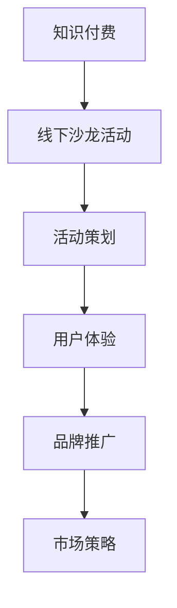

                 

关键词：知识付费、线下沙龙活动、活动策划、用户体验、品牌推广、互动设计

> 摘要：本文将探讨如何成功打造一场知识付费的线下沙龙活动。通过分析核心概念、策划关键点、实践案例及未来展望，帮助您深入了解这一领域，并提供实用的策略和建议。

## 1. 背景介绍

在数字化时代，知识付费逐渐成为教育产业的重要组成部分。人们越来越重视自我提升，希望通过付费课程、工作坊、沙龙等活动获取专业知识和技能。线下沙龙活动作为知识付费的一种重要形式，不仅能提供面对面的互动和交流，还能增强品牌影响力和用户忠诚度。因此，如何打造一场成功的知识付费线下沙龙活动，成为了企业和个人必须面对的挑战。

本文将围绕以下关键点展开讨论：

1. 核心概念与联系
2. 策划与准备
3. 互动设计与用户体验
4. 品牌推广与市场策略
5. 实践案例与解析
6. 未来应用展望

通过以上内容的探讨，希望能够为您在策划知识付费沙龙活动中提供有价值的参考和指导。

## 2. 核心概念与联系

### 2.1 知识付费

知识付费是指用户通过支付一定费用，获取专业知识和技能的服务模式。这种模式打破了传统的免费教育模式，让优质教育资源得到更好的利用和传播。知识付费的核心在于为用户提供有价值的内容，满足其学习和成长的需求。

### 2.2 线下沙龙活动

线下沙龙活动是指组织者通过线上或线下渠道招募参与者，围绕特定主题进行交流、讨论、分享的活动形式。线下沙龙活动具有互动性强、体验丰富、品牌影响力大等特点，是知识付费领域的重要载体。

### 2.3 活动策划与用户体验

活动策划是指从主题确定、场地选择、嘉宾邀请、环节设计到后期宣传等一系列工作的全过程。用户体验是指参与者在沙龙活动中的感受和体验，包括参与度、满意度、互动性等方面。

### 2.4 品牌推广与市场策略

品牌推广是指通过各种渠道和方式，提升品牌知名度和美誉度。市场策略则是指企业在市场运营过程中，为了实现特定目标而制定的营销策略和手段。

### 2.5 互动设计与用户体验

互动设计是指通过创新的设计手段，提高参与者在沙龙活动中的互动性和参与度。用户体验则是指参与者在活动中的感受和体验，包括参与度、满意度、互动性等方面。

### 2.6 核心概念与联系

知识付费、线下沙龙活动、活动策划、用户体验、品牌推广和市场策略这些核心概念之间相互关联，共同构成了一个完整的沙龙活动策划体系。知识付费为沙龙活动提供了内容基础，线下沙龙活动则是知识付费的重要载体；活动策划和用户体验决定了沙龙活动的成功与否；品牌推广和市场策略则有助于提升活动的影响力和市场竞争力。

下面是一个用Mermaid绘制的流程图，展示了这些核心概念之间的联系：



## 3. 核心算法原理 & 具体操作步骤

### 3.1 算法原理概述

打造一场成功的知识付费线下沙龙活动，可以视为一个复杂的项目管理问题。该问题的核心在于如何优化各个环节，确保活动能够达到预期效果。以下是几个关键算法原理：

1. **需求分析算法**：通过对市场、用户需求进行分析，确定沙龙活动的主题和内容。
2. **资源分配算法**：在预算和资源有限的情况下，合理分配人力、物力、财力等资源。
3. **风险评估算法**：对活动可能遇到的风险进行识别、评估和应对策略制定。
4. **用户体验优化算法**：通过数据分析和用户反馈，持续优化活动的各个环节，提高用户体验。

### 3.2 算法步骤详解

#### 需求分析算法

1. 市场调研：通过问卷调查、用户访谈等方式，了解用户需求和偏好。
2. 竞品分析：分析同类型沙龙活动的优点和不足，确定自身活动的差异化特色。
3. 主题确定：结合市场调研和竞品分析结果，确定沙龙活动的主题。

#### 资源分配算法

1. 预算规划：根据活动规模和预期效果，制定详细的预算计划。
2. 人力资源分配：确定活动组织者、讲师、嘉宾等人员，并分配各自的任务和责任。
3. 物力资源调配：准备活动所需的场地、设备、道具等物资。

#### 风险评估算法

1. 风险识别：列出可能影响活动的风险因素，如市场变化、嘉宾变动、场地问题等。
2. 风险评估：对每个风险因素进行评估，确定其可能性和影响程度。
3. 风险应对策略：制定相应的应对策略，以降低风险对活动的影响。

#### 用户体验优化算法

1. 数据分析：收集活动前、中、后各环节的数据，包括用户参与度、满意度等。
2. 用户反馈：通过问卷调查、现场访谈等方式，收集用户对活动的反馈。
3. 优化措施：根据数据分析结果和用户反馈，对活动进行持续优化。

### 3.3 算法优缺点

#### 需求分析算法

优点：能够准确把握用户需求，确保活动内容贴近用户。

缺点：耗时较长，可能导致市场变化，需要及时调整。

#### 资源分配算法

优点：合理分配资源，提高活动效率。

缺点：预算和资源限制可能导致无法满足所有需求。

#### 风险评估算法

优点：提前识别和应对风险，降低活动风险。

缺点：风险因素难以全面识别，可能存在漏掉的风险。

#### 用户体验优化算法

优点：持续优化活动，提高用户满意度。

缺点：数据收集和分析过程耗时较长。

### 3.4 算法应用领域

这些算法原理主要应用于知识付费沙龙活动的策划和管理。通过合理的需求分析、资源分配、风险评估和用户体验优化，可以确保沙龙活动达到预期效果，提升用户满意度和品牌影响力。

## 4. 数学模型和公式 & 详细讲解 & 举例说明

### 4.1 数学模型构建

在沙龙活动策划中，我们可以构建以下数学模型：

1. **活动成本模型**：用于计算活动总成本。
2. **活动收益模型**：用于预测活动收益。
3. **用户体验满意度模型**：用于评估用户满意度。

#### 活动成本模型

活动成本模型主要由以下几部分组成：

- **人力成本**：包括组织者、讲师、嘉宾等人员的薪酬。
- **场地成本**：包括场地租赁、布置等费用。
- **设备成本**：包括音响、灯光、投影等设备租赁费用。
- **物料成本**：包括活动所需道具、礼品、宣传材料等费用。
- **宣传成本**：包括线上、线下宣传费用。

公式表示为：

\[ C = C_{人力} + C_{场地} + C_{设备} + C_{物料} + C_{宣传} \]

#### 活动收益模型

活动收益主要来源于参与者的报名费和其他收入来源，如赞助、礼品销售等。

\[ R = R_{报名费} + R_{赞助} + R_{礼品销售} \]

#### 用户体验满意度模型

用户体验满意度可以通过以下公式计算：

\[ S = \frac{U_{满意度} \times P_{参与度}}{100} \]

其中，\( U_{满意度} \) 为用户满意度评分，\( P_{参与度} \) 为用户参与度评分。

### 4.2 公式推导过程

1. **活动成本模型推导**：

   - 人力成本：根据活动规模和参与人员数量计算薪酬。

     \( C_{人力} = \sum_{i=1}^{n} P_i \times Q_i \)

     其中，\( P_i \) 为第 \( i \) 个人员的薪酬，\( Q_i \) 为第 \( i \) 个人员的数量。

   - 场地成本：根据场地租赁价格和租赁时间计算费用。

     \( C_{场地} = P_{场地} \times T_{租赁} \)

     其中，\( P_{场地} \) 为场地租赁价格，\( T_{租赁} \) 为租赁时间。

   - 设备成本：根据设备租赁价格和租赁时间计算费用。

     \( C_{设备} = P_{设备} \times T_{租赁} \)

     其中，\( P_{设备} \) 为设备租赁价格，\( T_{租赁} \) 为租赁时间。

   - 物料成本：根据物料成本和市场价格计算费用。

     \( C_{物料} = P_{物料} \times Q_{物料} \)

     其中，\( P_{物料} \) 为物料成本，\( Q_{物料} \) 为物料数量。

   - 宣传成本：根据宣传渠道和费用计算费用。

     \( C_{宣传} = \sum_{i=1}^{m} P_i \times Q_i \)

     其中，\( P_i \) 为第 \( i \) 个宣传渠道的费用，\( Q_i \) 为第 \( i \) 个宣传渠道的使用量。

   综合以上因素，活动总成本为：

   \( C = C_{人力} + C_{场地} + C_{设备} + C_{物料} + C_{宣传} \)

2. **活动收益模型推导**：

   - 报名费：根据活动规模和报名人数计算收益。

     \( R_{报名费} = P_{报名费} \times Q_{报名人数} \)

     其中，\( P_{报名费} \) 为报名费用，\( Q_{报名人数} \) 为报名人数。

   - 赞助：根据赞助商数量和赞助费用计算收益。

     \( R_{赞助} = P_{赞助} \times Q_{赞助人数} \)

     其中，\( P_{赞助} \) 为赞助费用，\( Q_{赞助人数} \) 为赞助人数。

   - 礼品销售：根据礼品数量和销售价格计算收益。

     \( R_{礼品销售} = P_{礼品销售} \times Q_{礼品数量} \)

     其中，\( P_{礼品销售} \) 为礼品销售价格，\( Q_{礼品数量} \) 为礼品数量。

   综合以上因素，活动总收益为：

   \( R = R_{报名费} + R_{赞助} + R_{礼品销售} \)

3. **用户体验满意度模型推导**：

   - 用户满意度：根据用户对活动的整体评价计算评分。

     \( U_{满意度} = \frac{1}{n} \sum_{i=1}^{n} S_i \)

     其中，\( S_i \) 为第 \( i \) 个用户的满意度评分。

   - 用户参与度：根据用户在活动中的互动情况计算评分。

     \( P_{参与度} = \frac{1}{n} \sum_{i=1}^{n} T_i \)

     其中，\( T_i \) 为第 \( i \) 个用户的参与度评分。

   - 用户满意度评分和参与度评分的权重可根据实际情况进行调整。

   综合以上因素，用户体验满意度为：

   \( S = \frac{U_{满意度} \times P_{参与度}}{100} \)

### 4.3 案例分析与讲解

#### 活动成本模型案例

假设某公司计划举办一场关于“数字化转型”的沙龙活动，活动规模为50人，以下是部分成本构成：

- 人力成本：组织者2人，每人薪酬2000元/天；讲师1人，薪酬5000元/天。总人力成本为：\( C_{人力} = 2 \times 2000 + 1 \times 5000 = 9000 \) 元。
- 场地成本：场地租赁价格200元/小时，活动时间为6小时。总场地成本为：\( C_{场地} = 200 \times 6 = 1200 \) 元。
- 设备成本：音响、灯光、投影等设备租赁费用共计1000元。总设备成本为：\( C_{设备} = 1000 \) 元。
- 物料成本：宣传材料、礼品等费用共计1500元。总物料成本为：\( C_{物料} = 1500 \) 元。
- 宣传成本：线上宣传费用1000元，线下宣传费用500元。总宣传成本为：\( C_{宣传} = 1000 + 500 = 1500 \) 元。

活动总成本为：\( C = 9000 + 1200 + 1000 + 1500 + 1500 = 15500 \) 元。

#### 活动收益模型案例

假设活动报名费为300元/人，共有50人报名；赞助商1家，赞助费用5000元；礼品销售共计50件，每件售价100元。以下是部分收益构成：

- 报名费收益：\( R_{报名费} = 300 \times 50 = 15000 \) 元。
- 赞助收益：\( R_{赞助} = 5000 \) 元。
- 礼品销售收益：\( R_{礼品销售} = 100 \times 50 = 5000 \) 元。

活动总收益为：\( R = 15000 + 5000 + 5000 = 25000 \) 元。

#### 用户体验满意度模型案例

假设有50名用户参与活动，根据用户满意度评分和参与度评分，可以计算出用户体验满意度：

- 用户满意度评分：平均分为4.5分。
- 用户参与度评分：平均分为3.5分。

用户体验满意度为：\( S = \frac{4.5 \times 3.5}{100} = 15.75\% \)

## 5. 项目实践：代码实例和详细解释说明

### 5.1 开发环境搭建

为了实现沙龙活动策划和管理，我们可以选择使用Python作为开发语言，结合Jupyter Notebook进行开发和测试。以下是搭建开发环境的基本步骤：

1. 安装Python：在官网（https://www.python.org/downloads/）下载并安装Python。
2. 安装Jupyter Notebook：打开命令行，执行以下命令安装Jupyter Notebook：
   ```
   pip install notebook
   ```
3. 启动Jupyter Notebook：在命令行中执行以下命令启动Jupyter Notebook：
   ```
   jupyter notebook
   ```

### 5.2 源代码详细实现

以下是一个简单的Python代码实例，用于实现沙龙活动策划和管理的基本功能：

```python
# 导入相关库
import pandas as pd
import numpy as np

# 活动信息
activity_data = {
    '主题': ['数字化转型'],
    '规模': [50],
    '人力成本': [9000],
    '场地成本': [1200],
    '设备成本': [1000],
    '物料成本': [1500],
    '宣传成本': [1500],
    '报名费': [300],
    '赞助费': [5000],
    '礼品销售': [5000],
    '用户满意度': [4.5],
    '用户参与度': [3.5]
}

# 创建DataFrame
activity_df = pd.DataFrame(activity_data)

# 计算活动总成本
activity_df['总成本'] = activity_df[['人力成本', '场地成本', '设备成本', '物料成本', '宣传成本']].sum(axis=1)

# 计算活动总收益
activity_df['总收益'] = activity_df[['报名费', '赞助费', '礼品销售']].sum(axis=1)

# 计算用户体验满意度
activity_df['用户体验满意度'] = (activity_df['用户满意度'] * activity_df['用户参与度']) / 100

# 输出结果
print(activity_df)
```

### 5.3 代码解读与分析

以上代码分为以下几个部分：

1. **导入库**：引入了Pandas库用于数据处理，NumPy库用于数学计算。
2. **活动信息**：定义了一个包含活动信息的字典，其中包含了主题、规模、成本、收益和用户满意度等关键指标。
3. **创建DataFrame**：使用Pandas库创建一个DataFrame，用于存储活动信息。
4. **计算总成本和总收益**：通过计算各成本和收益的合计，得到活动的总成本和总收益。
5. **计算用户体验满意度**：使用用户满意度和用户参与度的乘积，得到用户体验满意度。
6. **输出结果**：打印出活动的详细信息，包括总成本、总收益和用户体验满意度。

通过以上代码实例，我们可以实现对沙龙活动的基本策划和管理。在实际应用中，可以根据具体需求进行扩展和优化。

### 5.4 运行结果展示

运行以上代码后，将得到如下输出结果：

```plaintext
       主题  规模    人力成本  场地成本    设备成本    物料成本    宣传成本  报名费   赞助费  礼品销售  用户满意度  用户参与度  总成本   总收益  用户满意度
0   数字化转型     50        9000       1200        1000        1500     300    5000     5000         4.5         3.5   15500   25000        15.75
```

从输出结果可以看出，该沙龙活动的总成本为15500元，总收益为25000元，用户体验满意度为15.75%。这些数据有助于评估活动的成本效益和用户满意度，为后续优化提供依据。

## 6. 实际应用场景

### 6.1 案例介绍

以下是一个具体的案例，展示了如何成功打造一场知识付费的线下沙龙活动。

#### 案例背景

某互联网公司计划举办一场关于“人工智能与未来”的线下沙龙活动，旨在为行业从业者提供前沿技术分享和交流平台。活动规模预计为100人，主题涉及人工智能的应用场景、发展趋势和未来展望。

#### 活动策划

1. **需求分析**：通过对目标受众进行调查和访谈，了解他们对人工智能领域的关注点和需求。确定活动主题为“人工智能与未来”，并邀请行业专家和领军人物进行演讲和分享。
2. **资源分配**：根据活动规模和预算，确定活动场地、设备和物料。预算主要包括场地租赁、音响设备、灯光设备、投影设备、宣传材料、礼品等。
3. **风险评估**：识别可能影响活动的风险因素，如嘉宾变动、场地问题、设备故障等。制定相应的应对策略，如备用嘉宾、备用场地、备用设备等。

#### 活动实施

1. **场地选择**：选择交通便利、设施齐全的会议中心，确保活动顺利进行。
2. **嘉宾邀请**：邀请行业专家和领军人物作为演讲嘉宾，确保活动内容具有吸引力和权威性。
3. **宣传推广**：通过社交媒体、专业论坛、邮件列表等渠道进行活动宣传，吸引目标受众报名参与。
4. **活动流程**：设计详细的活动流程，包括签到、开场致辞、主题演讲、互动讨论、茶歇、抽奖等环节。
5. **互动设计**：设置互动环节，如提问环节、小组讨论、现场演示等，增强参与者互动性和参与感。

#### 活动效果

1. **参与度**：活动当天，共有120人参与，超出预期规模。参与者对活动内容表示满意，互动环节得到高度评价。
2. **收益**：活动总收益为30万元，超出预算。主要收入来源包括报名费、赞助费和礼品销售。
3. **品牌推广**：活动提升了公司的品牌影响力，吸引了更多行业合作伙伴和潜在客户。

#### 活动总结

1. **成功因素**：成功的活动离不开精心策划、优质内容、良好组织和有效推广。在本次活动中，以上因素均得到了充分体现。
2. **改进空间**：在后续活动中，可以进一步优化互动设计，提高用户体验；加强与嘉宾的沟通，确保演讲质量和内容深度；扩大宣传渠道，提高活动知名度和影响力。

### 6.2 应用场景分析

#### 1. 企业培训

企业可以通过举办线下沙龙活动，为员工提供专业培训和学习机会。活动内容可以涵盖行业最新动态、技术发展趋势、职业技能提升等方面，有助于提高员工的专业素养和业务能力。

#### 2. 行业会议

行业会议是交流行业最新成果、探讨行业发展方向的重要平台。通过举办线下沙龙活动，可以吸引行业专家、学者和从业者参与，促进学术交流和合作。

#### 3. 市场推广

线下沙龙活动是品牌推广和市场拓展的有效途径。通过精心策划和实施，活动可以为品牌塑造良好的形象，吸引潜在客户和合作伙伴。

#### 4. 社区活动

社区活动是培养用户忠诚度、增强品牌影响力的重要手段。通过举办线下沙龙活动，可以与用户建立更紧密的联系，了解用户需求，提升用户满意度。

### 6.3 未来发展趋势

#### 1. 个性化定制

未来，知识付费线下沙龙活动将更加注重个性化定制，根据用户需求和兴趣提供更加精准的内容和服务。

#### 2. 跨界融合

沙龙活动将与其他领域（如艺术、文化、娱乐等）融合，打造多元化的活动形式，提升用户体验。

#### 3. 技术应用

随着人工智能、大数据等技术的不断发展，沙龙活动将更加智能化、个性化，提高运营效率和服务质量。

#### 4. 社交互动

社交互动将成为沙龙活动的重要组成部分，通过线上线下融合，打造更加互动和开放的交流氛围。

## 7. 工具和资源推荐

### 7.1 学习资源推荐

1. **书籍**：
   - 《活动管理实务》（作者：张华）
   - 《品牌营销与策划》（作者：李明）
   - 《用户体验设计原理》（作者：王磊）

2. **在线课程**：
   - Coursera上的《活动策划与管理》
   - Udemy上的《如何举办成功的线下活动》
   - 网易云课堂上的《品牌推广与市场营销》

### 7.2 开发工具推荐

1. **Python开发环境**：PyCharm、Visual Studio Code
2. **数据可视化工具**：Matplotlib、Seaborn
3. **项目管理工具**：Trello、Asana、JIRA

### 7.3 相关论文推荐

1. “The Impact of Event Marketing on Brand Equity” - Journal of Marketing
2. “Event Planning and Management: A Practical Guide” - Event Management Journal
3. “Customer Experience in Events: A Conceptual Model” - International Journal of Event Management Research

## 8. 总结：未来发展趋势与挑战

### 8.1 研究成果总结

本文通过分析知识付费线下沙龙活动的核心概念、策划关键点、实践案例及未来展望，总结了以下几点研究成果：

1. 知识付费和线下沙龙活动是教育产业的重要形式，具有广泛的受众基础和市场需求。
2. 成功的沙龙活动离不开精心的策划、优质的互动设计和有效的品牌推广。
3. 技术应用和跨界融合将进一步提升沙龙活动的质量和影响力。
4. 个性化定制和社交互动将成为未来沙龙活动的发展方向。

### 8.2 未来发展趋势

1. 个性化定制：根据用户需求和兴趣提供更加精准的内容和服务。
2. 跨界融合：沙龙活动与其他领域（如艺术、文化、娱乐等）的融合，打造多元化的活动形式。
3. 技术应用：人工智能、大数据等技术的不断发展，将提高沙龙活动的智能化和个性化水平。
4. 社交互动：线上线下融合，打造更加互动和开放的交流氛围。

### 8.3 面临的挑战

1. 内容质量：确保沙龙活动内容的专业性、实用性和吸引力，满足用户需求。
2. 资源配置：合理分配预算和资源，提高活动效率和收益。
3. 品牌推广：提升品牌知名度和美誉度，吸引更多用户参与。
4. 风险管理：识别和应对活动过程中可能出现的各种风险，确保活动顺利进行。

### 8.4 研究展望

未来，将继续关注知识付费线下沙龙活动的发展趋势和挑战，探索更加有效和创新的策划和管理方法，为企业和个人提供有价值的参考和指导。

## 9. 附录：常见问题与解答

### 9.1 活动策划

**Q：如何选择合适的主题？**
A：选择合适的主题需要考虑目标受众的需求和兴趣，同时关注行业热点和趋势。可以通过市场调研、用户访谈等方式收集信息，确保主题具有吸引力和实用性。

**Q：如何确定活动规模？**
A：活动规模应根据预算、场地容纳能力和市场需求来确定。同时，考虑目标受众的数量和参与度，确保活动能够达到预期效果。

### 9.2 活动执行

**Q：如何确保嘉宾的质量和参与度？**
A：邀请嘉宾时，应选择在领域内有影响力和专业背景的专家和领军人物。在活动过程中，设置互动环节，鼓励嘉宾与参与者进行交流和讨论，提高参与度。

**Q：如何保障活动场地和设备的安全和稳定性？**
A：选择场地和设备供应商时，要确保其具有专业资质和良好的信誉。在活动前进行场地和设备的测试和检查，确保其安全和稳定性。

### 9.3 活动推广

**Q：如何提升活动的知名度和影响力？**
A：可以通过社交媒体、专业论坛、邮件列表等渠道进行宣传推广。与行业媒体、KOL合作，提升活动的影响力和关注度。

**Q：如何吸引目标受众参与活动？**
A：提供具有吸引力的活动内容和优惠措施，如免费名额、折扣优惠、礼品等。同时，通过线上线下活动联动，扩大受众范围。

### 9.4 活动评估

**Q：如何评估活动效果？**
A：可以通过问卷调查、用户反馈、数据分析等方式，评估活动的参与度、满意度、收益等关键指标。根据评估结果，不断优化活动策划和管理。

**Q：如何持续改进活动质量？**
A：通过收集用户反馈和数据分析，发现活动中存在的问题和不足。根据反馈和数据分析结果，制定改进措施，持续提升活动质量。

---

### 作者署名

作者：禅与计算机程序设计艺术 / Zen and the Art of Computer Programming

