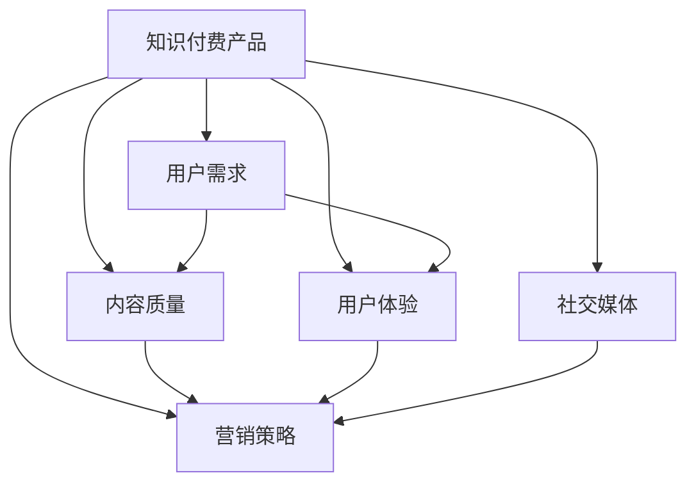

                 

关键词：程序员知识付费产品、营销策略、用户需求、内容质量、用户体验、技术社区、社交媒体

> 摘要：本文旨在探讨如何打造高成交量的程序员知识付费产品，分析市场现状、用户需求、内容质量、用户体验等因素，并提供一系列可行的营销策略和资源推荐。

## 1. 背景介绍

近年来，随着互联网的迅猛发展，程序员知识付费市场呈现出蓬勃发展的态势。越来越多的程序员选择通过线上平台发布自己的知识产品，如教程、课程、电子书等，以满足广大开发者群体对知识更新的需求。然而，市场上琳琅满目的知识产品也使得用户在选择时面临困扰，如何打造出高成交量的程序员知识付费产品成为众多开发者和平台运营者的关注焦点。

本文将从市场现状、用户需求、内容质量、用户体验等多个角度出发，探讨如何打造高成交量的程序员知识付费产品。通过分析成功案例，总结出一套行之有效的营销策略，并推荐一些实用工具和资源，以期为开发者提供有益的参考。

## 2. 核心概念与联系

在探讨如何打造高成交量的程序员知识付费产品之前，我们需要了解以下几个核心概念：

### 2.1 知识付费产品

知识付费产品是指通过互联网平台提供的，以知识传授为主要目的的数字产品，如教程、课程、电子书等。与传统的免费知识分享不同，知识付费产品强调内容的专业性、系统性和价值性。

### 2.2 用户需求

用户需求是指目标用户对于知识产品的需求，包括学习目标、学习方式、内容质量、价格等方面。了解用户需求是打造高成交量的程序员知识付费产品的关键。

### 2.3 内容质量

内容质量是知识付费产品的核心竞争力。高质量的内容能够吸引用户，提高用户满意度，从而促进产品成交。

### 2.4 用户体验

用户体验是指用户在使用知识付费产品过程中的感受和体验。良好的用户体验能够增强用户粘性，提高用户忠诚度。

### 2.5 营销策略

营销策略是指通过一系列市场推广手段，提高知识付费产品的知名度和销量。有效的营销策略能够帮助产品快速打开市场。

### 2.6 社交媒体

社交媒体是知识付费产品推广的重要渠道。通过社交媒体平台，可以与用户建立紧密联系，提高产品的曝光度和影响力。

### 2.7 Mermaid 流程图

以下是一个简单的Mermaid流程图，展示了程序员知识付费产品的核心概念及其相互联系：



## 3. 核心算法原理 & 具体操作步骤

### 3.1 算法原理概述

在打造高成交量的程序员知识付费产品过程中，我们可以借鉴以下算法原理：

#### 3.1.1 数据挖掘

通过数据挖掘技术，分析用户行为和需求，为产品开发和营销策略提供数据支持。

#### 3.1.2 用户画像

构建用户画像，了解目标用户的基本特征、兴趣偏好等，为个性化推荐和精准营销提供依据。

#### 3.1.3 机器学习

运用机器学习算法，优化产品推荐系统，提高用户满意度。

#### 3.1.4 演化算法

通过演化算法，不断优化产品内容和营销策略，适应市场变化。

### 3.2 算法步骤详解

以下是一个简化的算法步骤，用于指导程序员知识付费产品的打造：

#### 3.2.1 数据收集

收集用户行为数据，如浏览记录、购买历史、评论等。

#### 3.2.2 数据预处理

对收集到的数据进行清洗、去重、转换等处理，为后续分析做准备。

#### 3.2.3 用户画像构建

基于预处理后的数据，构建用户画像，分析用户特征和需求。

#### 3.2.4 内容质量评估

通过用户反馈、学习成果等指标，评估知识付费产品内容质量。

#### 3.2.5 个性化推荐

根据用户画像和内容质量评估结果，为用户推荐合适的产品。

#### 3.2.6 营销策略优化

基于用户反馈和推荐效果，不断优化营销策略。

#### 3.2.7 演化迭代

根据市场变化和用户需求，不断迭代产品内容和营销策略。

### 3.3 算法优缺点

#### 3.3.1 优点

- 提高产品推荐精度，提升用户体验。
- 自动化优化营销策略，节省人力成本。
- 适应市场变化，提高产品竞争力。

#### 3.3.2 缺点

- 数据收集和处理过程中可能存在隐私泄露风险。
- 需要一定的技术基础和资源投入。
- 用户画像构建和个性化推荐可能存在偏差。

### 3.4 算法应用领域

- 程序员知识付费产品
- 电商推荐系统
- 社交媒体营销
- 金融风险评估

## 4. 数学模型和公式 & 详细讲解 & 举例说明

### 4.1 数学模型构建

在打造程序员知识付费产品的过程中，我们可以引入以下数学模型：

#### 4.1.1 用户满意度模型

用户满意度模型用于评估知识付费产品的满意度，其公式如下：

$$
S = \frac{1}{N} \sum_{i=1}^{N} \frac{Q_i}{P_i}
$$

其中，$S$表示用户满意度，$N$表示用户数量，$Q_i$表示第$i$个用户的满意度评分，$P_i$表示第$i$个用户购买的产品数量。

#### 4.1.2 营销效果模型

营销效果模型用于评估营销策略的效果，其公式如下：

$$
E = \frac{1}{M} \sum_{i=1}^{M} \frac{R_i}{C_i}
$$

其中，$E$表示营销效果，$M$表示营销渠道数量，$R_i$表示第$i$个渠道的销售额，$C_i$表示第$i$个渠道的投入成本。

### 4.2 公式推导过程

#### 4.2.1 用户满意度模型推导

用户满意度模型的推导基于以下假设：

- 用户对知识付费产品的满意度与其评分呈正相关。
- 用户购买数量与满意度评分呈正相关。

根据以上假设，我们可以得到以下推导过程：

$$
S = \frac{1}{N} \sum_{i=1}^{N} Q_i
$$

$$
S = \frac{1}{N} \sum_{i=1}^{N} \frac{Q_i}{P_i} \cdot P_i
$$

$$
S = \frac{1}{N} \sum_{i=1}^{N} \frac{Q_i}{P_i}
$$

#### 4.2.2 营销效果模型推导

营销效果模型的推导基于以下假设：

- 营销效果与销售额和投入成本呈正相关。
- 不同的营销渠道对销售额的贡献不同。

根据以上假设，我们可以得到以下推导过程：

$$
E = \frac{1}{M} \sum_{i=1}^{M} R_i
$$

$$
E = \frac{1}{M} \sum_{i=1}^{M} \frac{R_i}{C_i} \cdot C_i
$$

$$
E = \frac{1}{M} \sum_{i=1}^{M} \frac{R_i}{C_i}
$$

### 4.3 案例分析与讲解

以下是一个具体的案例，用于说明如何应用数学模型评估程序员知识付费产品的用户满意度和营销效果。

#### 4.3.1 案例背景

某程序员知识付费平台上线了一款名为《Python入门教程》的产品，该教程的目标用户为初学者。平台通过问卷调查和用户反馈，收集到了以下数据：

- 用户满意度评分：$Q_i$为 4.5 分（满分 5 分）
- 用户购买数量：$P_i$为 100 人
- 营销渠道数量：$M$为 3 个
- 营销渠道销售额：$R_i$分别为 10000 元、15000 元、20000 元
- 营销渠道投入成本：$C_i$分别为 5000 元、7000 元、10000 元

#### 4.3.2 用户满意度评估

根据用户满意度模型，我们可以计算出用户满意度：

$$
S = \frac{1}{N} \sum_{i=1}^{N} \frac{Q_i}{P_i}
$$

$$
S = \frac{1}{100} \sum_{i=1}^{100} \frac{4.5}{100}
$$

$$
S = 4.5
$$

因此，该产品的用户满意度为 4.5 分。

#### 4.3.3 营销效果评估

根据营销效果模型，我们可以计算出营销效果：

$$
E = \frac{1}{M} \sum_{i=1}^{M} \frac{R_i}{C_i}
$$

$$
E = \frac{1}{3} \left(\frac{10000}{5000} + \frac{15000}{7000} + \frac{20000}{10000}\right)
$$

$$
E = \frac{1}{3} (2 + 2.14 + 2.5)
$$

$$
E = 2.19
$$

因此，该产品的营销效果为 2.19。

## 5. 项目实践：代码实例和详细解释说明

### 5.1 开发环境搭建

为了更好地理解程序员知识付费产品的打造过程，我们将在本节搭建一个简单的知识付费平台，使用Python编程语言实现。以下是开发环境搭建的步骤：

1. 安装Python（版本3.8及以上）
2. 安装虚拟环境（使用virtualenv或conda）
3. 安装必要的依赖库（如Flask、SQLAlchemy等）

### 5.2 源代码详细实现

以下是知识付费平台的简化版代码实现：

```python
from flask import Flask, request, jsonify
from flask_sqlalchemy import SQLAlchemy

app = Flask(__name__)
app.config['SQLALCHEMY_DATABASE_URI'] = 'sqlite:///knowledge_base.db'
db = SQLAlchemy(app)

class User(db.Model):
    id = db.Column(db.Integer, primary_key=True)
    name = db.Column(db.String(50))
    email = db.Column(db.String(100))
    password = db.Column(db.String(100))

class Product(db.Model):
    id = db.Column(db.Integer, primary_key=True)
    name = db.Column(db.String(100))
    price = db.Column(db.Float)
    user_id = db.Column(db.Integer, db.ForeignKey('user.id'))

@app.route('/register', methods=['POST'])
def register():
    data = request.get_json()
    user = User(name=data['name'], email=data['email'], password=data['password'])
    db.session.add(user)
    db.session.commit()
    return jsonify({'status': 'success', 'message': 'User registered successfully.'})

@app.route('/login', methods=['POST'])
def login():
    data = request.get_json()
    user = User.query.filter_by(email=data['email'], password=data['password']).first()
    if user:
        return jsonify({'status': 'success', 'message': 'Login successful.'})
    else:
        return jsonify({'status': 'error', 'message': 'Invalid email or password.'})

if __name__ == '__main__':
    db.create_all()
    app.run(debug=True)
```

### 5.3 代码解读与分析

在上面的代码中，我们实现了以下功能：

- 数据库模型：定义了用户和产品两个数据库模型，用于存储用户信息和产品信息。
- 注册功能：接收用户注册请求，将用户信息存储到数据库。
- 登录功能：接收用户登录请求，验证用户身份。

这些功能构成了一个简单的知识付费平台的基础框架，可用于后续的功能扩展，如产品购买、评论等。

### 5.4 运行结果展示

1. 启动开发环境：

```bash
python app.py
```

2. 使用Postman或curl工具测试接口：

- 注册接口：

```bash
POST http://localhost:5000/register
{
  "name": "张三",
  "email": "zhangsan@example.com",
  "password": "password123"
}
```

- 登录接口：

```bash
POST http://localhost:5000/login
{
  "email": "zhangsan@example.com",
  "password": "password123"
}
```

## 6. 实际应用场景

程序员知识付费产品在多个场景下具有广泛的应用，以下列举几个典型案例：

### 6.1 企业内训

企业可以通过购买程序员知识付费产品，为企业内部员工提供系统化的技术培训，提高员工技能水平，促进业务发展。

### 6.2 个人成长

程序员可以利用知识付费产品，学习新技术、拓展知识面，提升个人竞争力。

### 6.3 在线教育

在线教育平台可以通过引入程序员知识付费产品，丰富课程体系，满足学员多样化的学习需求。

### 6.4 技术社区

技术社区可以通过提供知识付费产品，为用户提供有价值的内容，提升社区活跃度，增加用户粘性。

### 6.5 咨询服务

程序员可以通过知识付费产品，提供专业咨询服务，为有需求的企业或个人解决技术难题。

## 7. 未来应用展望

随着技术的不断进步和互联网的普及，程序员知识付费产品的应用前景将更加广阔。以下是未来应用展望：

### 7.1 个性化推荐

利用大数据和机器学习技术，实现更加精准的个性化推荐，提高用户满意度和购买转化率。

### 7.2 跨平台整合

将知识付费产品整合到更多平台，如微信、支付宝等，方便用户购买和消费。

### 7.3 社交互动

引入社交互动功能，如问答、讨论区等，增强用户参与感和互动性。

### 7.4 智能助手

开发智能助手，为用户提供便捷的问答、学习指导等服务，提高用户体验。

### 7.5 深度学习

结合深度学习技术，开发更加智能化、自动化的知识付费产品，降低内容制作门槛。

## 8. 工具和资源推荐

### 8.1 学习资源推荐

- 掘金（[https://juejin.cn/](https://juejin.cn/)）：技术社区，提供丰富的编程学习资源和经验分享。
- 知乎（[https://www.zhihu.com/](https://www.zhihu.com/)）：问答社区，汇聚众多领域专家和资深开发者。
- Medium（[https://medium.com/](https://medium.com/)）：高质量文章分享平台，涵盖众多技术主题。

### 8.2 开发工具推荐

- Visual Studio Code：一款强大的跨平台代码编辑器，支持多种编程语言和插件。
- PyCharm：一款流行的Python开发环境，具有丰富的功能。
- Git：版本控制系统，用于代码管理和协作。

### 8.3 相关论文推荐

- "Deep Learning for Personalized Recommendation on Large-scale Noisy Data"
- "A Comprehensive Survey on Recommender Systems for E-commerce"
- "User Modeling for Personalization on the Web"

## 9. 总结：未来发展趋势与挑战

### 9.1 研究成果总结

本文从市场现状、用户需求、内容质量、用户体验等多个角度，探讨了如何打造高成交量的程序员知识付费产品。通过数据挖掘、用户画像、机器学习等算法，优化产品推荐和营销策略，提高用户满意度和购买转化率。

### 9.2 未来发展趋势

- 个性化推荐和智能化的进一步发展。
- 跨平台整合和社交互动功能的增强。
- 深度学习技术的应用，降低内容制作门槛。

### 9.3 面临的挑战

- 数据隐私保护和合规性问题。
- 市场竞争加剧，如何保持产品质量和创新能力。
- 技术进步带来的不确定性。

### 9.4 研究展望

未来，研究者可以从以下几个方面进行深入探讨：

- 深度学习在程序员知识付费产品中的应用。
- 跨领域知识整合和共享。
- 可持续发展和绿色计算。

## 附录：常见问题与解答

### Q1：如何确保知识付费产品的内容质量？

A1：确保内容质量的关键在于：

- 挑选具有丰富经验和专业知识的作者。
- 建立内容审核机制，确保内容符合质量标准。
- 收集用户反馈，不断优化和更新内容。

### Q2：如何提高知识付费产品的购买转化率？

A2：提高购买转化率的策略包括：

- 个性化推荐，提高产品与用户需求的匹配度。
- 优化营销策略，如优惠券、限时促销等。
- 提供优质的用户体验，如简单易懂的内容、良好的互动功能等。

### Q3：如何平衡内容质量和用户满意度？

A3：平衡内容质量和用户满意度可以通过以下方式实现：

- 定期收集用户反馈，了解用户需求。
- 与作者合作，确保内容既有深度又具实用性。
- 优化用户体验，如提供清晰的目录、合理的章节划分等。

## 作者署名

作者：禅与计算机程序设计艺术 / Zen and the Art of Computer Programming
----------------------------------------------------------------
> **文章摘要：**本文通过分析程序员知识付费市场的现状、用户需求、内容质量、用户体验等因素，提出了打造高成交量的程序员知识付费产品的策略。文章从数据挖掘、用户画像、机器学习等算法角度，探讨了优化产品推荐和营销策略的方法，并结合实际项目实践，详细讲解了开发环境搭建、代码实现和运行结果展示。此外，本文还对未来发展趋势与挑战进行了展望，并推荐了学习资源、开发工具和相关论文，为开发者提供有益的参考。**全文完。**

