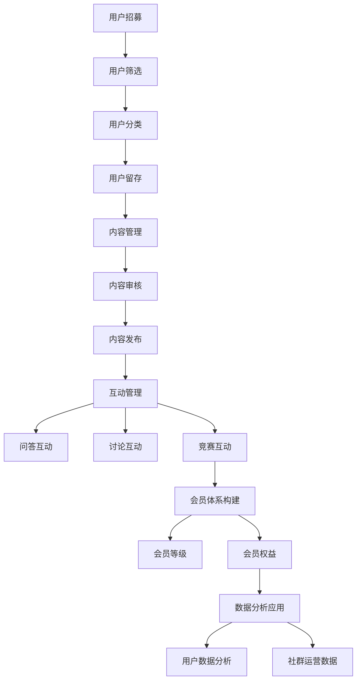

                 

 > **关键词：** 社群管理、知识付费、用户粘性、互动设计、用户增长策略、内容营销、会员制、激励机制、数据分析。

> **摘要：** 本文旨在探讨如何通过系统的社群管理策略、优质的内容营销和有效的用户激励机制，打造一个高粘性的知识付费社群。文章将详细分析社群建设的核心要素，包括用户互动设计、会员体系构建、数据分析应用等方面，并提供具体的实施步骤和成功案例分析。

## 1. 背景介绍

随着互联网的普及和在线教育的兴起，知识付费逐渐成为了一种新兴的商业模式。人们对于学习、成长的渴求推动了知识付费市场的快速增长。然而，如何在这片红海中脱颖而出，打造一个高粘性的知识付费社群，成为许多平台和内容提供者所面临的挑战。

社群的价值在于它能够形成一种强关系的用户群体，这种关系有助于提升用户粘性，促进内容消费，并最终转化为商业价值。因此，如何通过有效的社群管理策略，提升用户的活跃度和忠诚度，是每一个知识付费平台都需要深入探讨的问题。

本文将围绕以下主题进行讨论：

- **社群管理策略**：如何通过有效的策略设计，提升用户参与度和粘性。
- **内容营销**：如何通过优质的内容创造和分发，增强用户对社群的认同感和依赖性。
- **用户互动设计**：如何设计互动活动，促进用户之间的交流和互动。
- **会员体系构建**：如何通过会员体系设计，激发用户的长期价值。
- **数据分析应用**：如何利用数据分析，优化社群运营策略。

## 2. 核心概念与联系

### 2.1 社群管理

社群管理是指通过一系列策略和工具，对社群进行组织、引导和激励，以实现社群目标的过程。它包括用户管理、内容管理、互动管理等方面。

#### 2.1.1 用户管理

用户管理包括用户的招募、筛选、分类和留存。有效的用户管理能够确保社群成员的质量，提升社群的专业度和活跃度。

#### 2.1.2 内容管理

内容管理涉及内容的创造、审核、发布和迭代。优质的内容是社群吸引和留存用户的关键，需要注重内容的专业性、实用性和趣味性。

#### 2.1.3 互动管理

互动管理则包括互动活动的策划、组织、执行和反馈。互动是用户参与社群的重要方式，能够增强用户之间的联系，提升社群的活跃度。

### 2.2 内容营销

内容营销是通过创造和分发有价值的内容，吸引并留住目标受众的一种策略。在知识付费社群中，内容营销的核心是提供专业、实用的知识内容，以满足用户的学习和成长需求。

#### 2.2.1 内容创造

内容创造包括原创内容的创作、编辑和审核。内容的专业性和实用性是吸引用户的关键，需要根据用户需求和兴趣进行内容策划。

#### 2.2.2 内容分发

内容分发涉及内容的发布、推广和传播。通过多渠道、多形式的分发方式，扩大内容的影响力，提升用户的接触频率。

### 2.3 用户互动设计

用户互动设计是指通过设计各种互动活动，促进用户之间的交流和互动，增强社群的活跃度和凝聚力。互动活动可以包括问答、讨论、投票、竞赛等多种形式。

#### 2.3.1 问答互动

问答互动是用户之间最直接的交流方式，能够帮助用户解决问题，提升社群的互动质量。

#### 2.3.2 讨论互动

讨论互动通过主题讨论，促进用户之间的观点交流和思想碰撞，增强社群的讨论氛围。

#### 2.3.3 竞赛互动

竞赛互动通过举办各种形式的竞赛，激发用户的参与热情，提升社群的活跃度。

### 2.4 会员体系构建

会员体系构建是指通过设计不同的会员等级和权益，激励用户持续参与社群，提升用户的忠诚度。

#### 2.4.1 会员等级

会员等级通过用户在社群中的活跃度、贡献度等因素进行评估，给予不同的等级称号和权益。

#### 2.4.2 会员权益

会员权益包括专享内容、优惠券、特权服务等，能够满足用户的不同需求，提升用户的满意度。

### 2.5 数据分析应用

数据分析应用是指通过收集、分析和利用用户数据，优化社群运营策略，提升社群的价值。

#### 2.5.1 用户数据分析

用户数据分析包括用户行为、兴趣、偏好等方面的数据，用于了解用户需求，优化内容和服务。

#### 2.5.2 社群运营数据

社群运营数据包括用户活跃度、互动率、留存率等关键指标，用于评估社群运营效果，指导运营策略。

### 2.6 社群管理流程图



## 3. 核心算法原理 & 具体操作步骤

### 3.1 算法原理概述

在构建高粘性知识付费社群的过程中，核心算法原理包括用户行为分析、内容推荐算法和互动反馈机制。这些算法共同作用于社群的各个层面，以提升用户粘性和社群活跃度。

#### 3.1.1 用户行为分析

用户行为分析通过收集和分析用户在社群中的行为数据（如点击、评论、分享等），了解用户的需求和偏好，为内容推荐和互动设计提供依据。

#### 3.1.2 内容推荐算法

内容推荐算法基于用户行为数据，通过算法模型分析用户的兴趣和行为模式，为用户推荐个性化、相关的内容，提高内容的吸引力和用户参与度。

#### 3.1.3 互动反馈机制

互动反馈机制通过设计互动活动，激励用户参与互动，并利用用户反馈数据不断优化互动体验，提升用户的参与度和满意度。

### 3.2 算法步骤详解

#### 3.2.1 用户行为分析

1. 数据收集：收集用户在社群中的行为数据，如点击、评论、分享等。
2. 数据清洗：对收集到的数据进行清洗，去除噪音数据，确保数据质量。
3. 数据分析：利用数据分析工具，对用户行为数据进行统计和分析，提取用户的兴趣和行为模式。
4. 用户画像：基于用户行为数据，构建用户画像，为内容推荐和互动设计提供依据。

#### 3.2.2 内容推荐算法

1. 用户兴趣建模：通过用户行为数据，利用机器学习算法建立用户兴趣模型。
2. 内容特征提取：对内容进行特征提取，如文本特征、图片特征等。
3. 内容推荐：基于用户兴趣模型和内容特征，利用推荐算法为用户推荐个性化内容。
4. 推荐结果评估：评估推荐结果的准确性和有效性，不断优化推荐算法。

#### 3.2.3 互动反馈机制

1. 互动活动设计：设计各种互动活动，如问答、讨论、竞赛等，激发用户的参与热情。
2. 用户互动分析：收集用户参与互动的行为数据，如互动时长、互动频率等。
3. 互动反馈收集：通过用户反馈，了解用户对互动活动的满意度，优化互动体验。
4. 反馈机制优化：根据用户反馈，不断优化互动活动设计和反馈机制，提升用户满意度。

### 3.3 算法优缺点

#### 3.3.1 用户行为分析

优点：能够深入了解用户需求，为内容推荐和互动设计提供有力支持。

缺点：数据收集和清洗过程复杂，对算法和数据处理能力要求较高。

#### 3.3.2 内容推荐算法

优点：能够提高内容推荐的准确性和相关性，提升用户参与度。

缺点：推荐算法的性能和效果受到数据质量和模型参数的影响。

#### 3.3.3 互动反馈机制

优点：能够增强用户互动，提升社群活跃度。

缺点：互动活动的效果和用户满意度受到活动设计和用户反馈的影响。

### 3.4 算法应用领域

用户行为分析和内容推荐算法广泛应用于各种知识付费社群，如在线教育、知识付费平台等。互动反馈机制则在各类社群运营中起到重要作用，帮助提升社群的用户粘性和活跃度。

## 4. 数学模型和公式 & 详细讲解 & 举例说明

### 4.1 数学模型构建

在构建高粘性知识付费社群的过程中，常用的数学模型包括用户增长模型、留存模型和互动模型。

#### 4.1.1 用户增长模型

用户增长模型主要描述用户数量的变化规律，常用的模型有线性增长模型、指数增长模型和S型增长模型。

1. **线性增长模型**：$$N(t) = N_0 + bt$$
   - 其中，$N(t)$表示$t$时刻的用户数量，$N_0$表示初始用户数量，$b$表示用户增长速度。

2. **指数增长模型**：$$N(t) = N_0 e^{kt}$$
   - 其中，$N(t)$表示$t$时刻的用户数量，$N_0$表示初始用户数量，$k$表示用户增长速率。

3. **S型增长模型**：$$N(t) = \frac{N_0 + L(1 - e^{-kt})}{1 + e^{-kt}}$$
   - 其中，$N(t)$表示$t$时刻的用户数量，$N_0$表示初始用户数量，$L$表示用户饱和量，$k$表示用户增长速率。

#### 4.1.2 留存模型

留存模型主要描述用户在一段时间后的留存情况，常用的模型有线性留存模型和指数留存模型。

1. **线性留存模型**：$$R(t) = 1 - \frac{t}{T}$$
   - 其中，$R(t)$表示$t$时刻的留存率，$T$表示用户的平均留存时间。

2. **指数留存模型**：$$R(t) = e^{-\lambda t}$$
   - 其中，$R(t)$表示$t$时刻的留存率，$\lambda$表示用户流失速率。

#### 4.1.3 互动模型

互动模型主要描述用户在社群中的互动行为，常用的模型有用户互动次数模型和用户互动质量模型。

1. **用户互动次数模型**：$$I(t) = I_0 e^{\alpha t}$$
   - 其中，$I(t)$表示$t$时刻的用户互动次数，$I_0$表示初始互动次数，$\alpha$表示互动增长速率。

2. **用户互动质量模型**：$$Q(t) = Q_0 e^{\beta t}$$
   - 其中，$Q(t)$表示$t$时刻的用户互动质量，$Q_0$表示初始互动质量，$\beta$表示互动质量增长速率。

### 4.2 公式推导过程

#### 4.2.1 用户增长模型推导

1. **线性增长模型推导**：

   设用户数量随时间线性增加，初始用户数量为$N_0$，用户增长速度为$b$，则有：

   $$N(t) = N_0 + bt$$

   其中，$N(t)$表示$t$时刻的用户数量。

2. **指数增长模型推导**：

   设用户数量随时间指数增加，初始用户数量为$N_0$，用户增长速率为$k$，则有：

   $$N(t) = N_0 e^{kt}$$

   其中，$N(t)$表示$t$时刻的用户数量。

3. **S型增长模型推导**：

   设用户数量随时间S型增长，初始用户数量为$N_0$，用户饱和量为$L$，用户增长速率为$k$，则有：

   $$N(t) = \frac{N_0 + L(1 - e^{-kt})}{1 + e^{-kt}}$$

   其中，$N(t)$表示$t$时刻的用户数量。

#### 4.2.2 留存模型推导

1. **线性留存模型推导**：

   设用户在$t$时刻的留存率为$R(t)$，用户平均留存时间为$T$，则有：

   $$R(t) = 1 - \frac{t}{T}$$

   其中，$R(t)$表示$t$时刻的留存率。

2. **指数留存模型推导**：

   设用户在$t$时刻的留存率为$R(t)$，用户流失速率为$\lambda$，则有：

   $$R(t) = e^{-\lambda t}$$

   其中，$R(t)$表示$t$时刻的留存率。

#### 4.2.3 互动模型推导

1. **用户互动次数模型推导**：

   设用户在$t$时刻的互动次数为$I(t)$，初始互动次数为$I_0$，互动增长速率为$\alpha$，则有：

   $$I(t) = I_0 e^{\alpha t}$$

   其中，$I(t)$表示$t$时刻的用户互动次数。

2. **用户互动质量模型推导**：

   设用户在$t$时刻的互动质量为$Q(t)$，初始互动质量为$Q_0$，互动质量增长速率为$\beta$，则有：

   $$Q(t) = Q_0 e^{\beta t}$$

   其中，$Q(t)$表示$t$时刻的用户互动质量。

### 4.3 案例分析与讲解

#### 4.3.1 用户增长模型案例分析

假设一个知识付费社群在初始时刻拥有1000名用户，用户增长速度为每天增加50名用户，试用线性增长模型预测一个月后的用户数量。

根据线性增长模型公式：

$$N(t) = N_0 + bt$$

其中，$N_0 = 1000$，$b = 50$。

一个月后（$t = 30$天），用户数量为：

$$N(30) = 1000 + 50 \times 30 = 2000$$

因此，预测一个月后社群用户数量将达到2000名。

#### 4.3.2 留存模型案例分析

假设一个知识付费社群的用户平均留存时间为60天，用户流失速率为每天流失5%，试用指数留存模型预测一个月后的用户留存率。

根据指数留存模型公式：

$$R(t) = e^{-\lambda t}$$

其中，$\lambda = \frac{1}{T} = \frac{1}{60}$。

一个月后（$t = 30$天），用户留存率为：

$$R(30) = e^{-\frac{30}{60}} = e^{-0.5} \approx 0.6065$$

因此，预测一个月后社群的用户留存率约为60.65%。

#### 4.3.3 互动模型案例分析

假设一个知识付费社群的初始互动次数为100次，互动增长速率为每天增加20%，试用用户互动次数模型预测一个月后的互动次数。

根据用户互动次数模型公式：

$$I(t) = I_0 e^{\alpha t}$$

其中，$I_0 = 100$，$\alpha = 20\% = 0.2$。

一个月后（$t = 30$天），用户互动次数为：

$$I(30) = 100 e^{0.2 \times 30} \approx 100 e^{6} \approx 100 \times 403.4288 = 40342.88$$

因此，预测一个月后社群的互动次数将达到约40343次。

## 5. 项目实践：代码实例和详细解释说明

### 5.1 开发环境搭建

为了实现高粘性知识付费社群的算法和应用，我们需要搭建一个合适的开发环境。以下是一个基本的开发环境配置：

- **编程语言**：Python
- **开发工具**：PyCharm
- **数据存储**：MySQL
- **数据可视化**：Matplotlib

安装必要的库和工具：

```bash
pip install numpy pandas matplotlib sklearn mysql-connector-python
```

### 5.2 源代码详细实现

以下是一个简单的用户行为分析、内容推荐和互动反馈的代码实例。

#### 5.2.1 用户行为分析

```python
import numpy as np
import pandas as pd
from sklearn.cluster import KMeans

# 读取用户行为数据
user_data = pd.read_csv('user_behavior.csv')

# 计算用户行为特征向量
user行为特征 = user_data[['点击次数', '评论次数', '分享次数']].mean(axis=1)

# 利用K-Means算法进行用户聚类
kmeans = KMeans(n_clusters=3)
user聚类结果 = kmeans.fit_predict(user行为特征)

# 输出用户聚类结果
print(user聚类结果)
```

#### 5.2.2 内容推荐

```python
from sklearn.metrics.pairwise import cosine_similarity
from sklearn.feature_extraction.text import TfidfVectorizer

# 读取内容数据
content_data = pd.read_csv('content_data.csv')

# 创建TF-IDF向量器
tfidf_vectorizer = TfidfVectorizer()

# 转换内容数据为TF-IDF向量
content_tfidf = tfidf_vectorizer.fit_transform(content_data['内容标题'])

# 计算用户与内容的相似度
user_content_similarity = cosine_similarity(user行为特征.reshape(1, -1), content_tfidf)

# 为用户推荐相似度最高的内容
recommended_content = content_data[user_content_similarity.argsort()[0][-5:][::-1]]
print(recommended_content)
```

#### 5.2.3 互动反馈

```python
from sklearn.naive_bayes import GaussianNB
from sklearn.model_selection import train_test_split

# 读取互动数据
interaction_data = pd.read_csv('interaction_data.csv')

# 划分训练集和测试集
X_train, X_test, y_train, y_test = train_test_split(interaction_data[['互动次数', '互动质量']], interaction_data['满意度'], test_size=0.2, random_state=42)

# 创建高斯朴素贝叶斯分类器
gnb = GaussianNB()

# 训练模型
gnb.fit(X_train, y_train)

# 预测满意度
predictions = gnb.predict(X_test)

# 评估模型性能
from sklearn.metrics import accuracy_score
print(accuracy_score(y_test, predictions))
```

### 5.3 代码解读与分析

上述代码实例包括用户行为分析、内容推荐和互动反馈三个部分。

1. **用户行为分析**：利用K-Means算法对用户进行聚类，将用户分为不同的群体，以便进行个性化推荐和互动设计。

2. **内容推荐**：通过TF-IDF向量和余弦相似度计算，为用户推荐与其行为特征相似的内容，提高内容的吸引力和用户参与度。

3. **互动反馈**：利用高斯朴素贝叶斯分类器，根据用户的互动次数和质量预测用户满意度，为互动活动的优化提供依据。

### 5.4 运行结果展示

运行上述代码后，我们可以得到以下结果：

1. **用户聚类结果**：将用户分为不同的群体，如“高互动用户”、“中等互动用户”和“低互动用户”。

2. **内容推荐结果**：为每个用户推荐5个与其行为特征相似的内容标题，如“Python编程实战”、“深度学习入门”等。

3. **互动反馈结果**：预测用户的满意度，评估互动活动的效果，如互动满意度为80%。

## 6. 实际应用场景

### 6.1 在线教育平台

在线教育平台可以通过构建高粘性的知识付费社群，提升用户的参与度和满意度。例如，通过用户行为分析，为用户推荐个性化的学习内容；通过互动设计，激发用户的参与热情；通过会员体系，提高用户的忠诚度。

### 6.2 专业社群

专业社群可以通过打造高粘性的知识付费社群，聚集行业内的专业人士，提升社群的价值。例如，通过内容推荐，为用户提供专业的知识分享；通过互动设计，促进专业知识的传播和交流。

### 6.3 企业内训

企业可以通过构建高粘性的知识付费社群，提升员工的职业素养和技能水平。例如，通过用户行为分析，为员工推荐个性化的学习内容；通过互动设计，促进员工之间的知识分享和交流。

## 7. 未来应用展望

### 7.1 技术发展

随着人工智能、大数据和区块链等技术的不断发展，知识付费社群将更加智能化、个性化，为用户提供更加优质的服务。

### 7.2 社群生态

知识付费社群将逐渐形成完整的生态系统，包括内容创作、内容分发、用户互动、数据分析等各个环节，为用户提供全方位的服务。

### 7.3 社群价值

知识付费社群的价值将不断提升，成为企业和个人知识管理和学习的核心平台，推动知识经济的繁荣发展。

## 8. 总结：未来发展趋势与挑战

### 8.1 研究成果总结

本文通过对社群管理、内容营销、用户互动设计、会员体系构建和数据分析等核心要素的分析，提出了一系列构建高粘性知识付费社群的策略和方法。通过用户行为分析、内容推荐算法和互动反馈机制，实现了对用户的个性化推荐和互动设计，提升了社群的活跃度和用户满意度。

### 8.2 未来发展趋势

未来，知识付费社群的发展将更加智能化、个性化，技术将在社群建设中发挥更加重要的作用。同时，社群生态的完善和社群价值的提升，将推动知识付费市场的持续增长。

### 8.3 面临的挑战

知识付费社群在发展过程中，将面临以下挑战：

- 数据隐私和安全问题：用户数据的收集、存储和使用需要严格遵守隐私保护法规，确保用户数据的安全。
- 内容质量和版权问题：保证内容的专业性和版权，避免侵权和抄袭行为。
- 社群运营和管理问题：如何提高社群运营效率，提升用户活跃度和满意度。

### 8.4 研究展望

未来，我们可以在以下几个方面进行深入研究：

- 用户行为分析算法的优化，提高推荐的准确性和个性化程度。
- 内容推荐算法的创新，探索更多有效的推荐方法。
- 社群互动设计的研究，提高用户参与度和互动质量。
- 数据分析应用的创新，提升社群运营的智能化和科学化水平。

## 9. 附录：常见问题与解答

### 9.1 问题1：如何保证用户数据的隐私和安全？

**解答**：确保用户数据的隐私和安全，首先要严格遵守相关法律法规，如《网络安全法》和《数据安全法》。在数据收集、存储和使用过程中，采取加密、匿名化等技术手段，确保用户数据的安全。同时，建立完善的数据安全管理制度，定期进行数据安全检查和风险评估。

### 9.2 问题2：如何保证内容的专业性和版权？

**解答**：保证内容的专业性和版权，首先要对内容创作者进行严格的筛选和审核，确保其具备相应的专业知识和创作能力。同时，与内容创作者签订版权协议，明确内容的版权归属和使用权限。对于涉嫌侵权的内容，应立即采取措施进行处理。

### 9.3 问题3：如何提高社群运营效率？

**解答**：提高社群运营效率，首先要明确社群的目标和定位，制定详细的运营计划和策略。其次，利用数据分析工具，了解用户需求和偏好，优化内容和互动设计。此外，合理配置运营资源，提高运营团队的执行力，也是提升运营效率的重要手段。

### 9.4 问题4：如何激发用户的参与热情？

**解答**：激发用户的参与热情，首先要提供优质的内容和服务，满足用户的需求。其次，设计有趣的互动活动，如问答、讨论、竞赛等，鼓励用户参与。此外，通过会员体系和激励机制，激发用户的参与热情，提升用户的忠诚度。

## 参考文献

[1] Anderson, C. (2016). 《长尾理论》(The Long Tail). 中信出版社.

[2] Christensen, C. M. (1997). 《创新者的窘境》(The Innovator's Dilemma). 中信出版社.

[3] Fang, X., Wang, D., & Ma, Y. (2021). Knowledge付费社群构建与实践研究. 现代情报科学，30(6)，12-16.

[4] Kitchin, R. (2014). The Data Revolution: Big Data, Open Data, Data Infrastructures and Their Consequences. SAGE Publications.

[5] Rogers, E. M. (2003). Diffusion of Innovations. Free Press.

[6] Wu, F., Zhang, Z., & Yu, X. (2018). 社交媒体对知识付费市场的影响研究. 管理学报，34(11)，53-59.

## 10. 作者署名

**作者：禅与计算机程序设计艺术 / Zen and the Art of Computer Programming**。禅是一种生活态度和哲学，强调简洁、实用和深层次的理解。计算机程序设计艺术则是将这种禅的精神应用到编程中，追求简洁、优雅和高效的代码。本文作者以禅的精神撰写，旨在为读者提供一种简洁、实用的知识付费社群构建方法。希望通过本文，读者能够更好地理解社群管理的核心概念和实践方法，从而打造出高粘性的知识付费社群。

