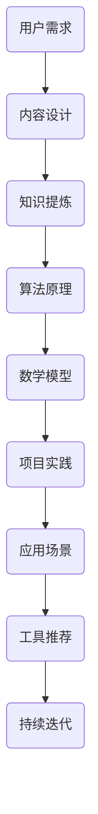

                 

 在信息爆炸的今天，技术知识付费内容成为了知识共享和经济利益双赢的重要方式。然而，如何打造出既具吸引力又能提供价值的知识付费内容，成为了许多内容创作者面临的难题。本文将深入探讨如何从逻辑清晰、结构紧凑、简单易懂的专业技术语言出发，构建高质量的技术知识付费内容。

> 关键词：技术知识付费内容、高质量、专业知识、构建、逻辑性、吸引力、实用性

> 摘要：本文将介绍如何通过深入理解受众需求、逻辑架构设计、内容精炼和优化、结合实际案例等方式，打造高质量的技术知识付费内容。文章将从背景介绍、核心概念与联系、核心算法原理、数学模型与公式、项目实践、实际应用场景、工具和资源推荐、总结及展望等多个方面展开讨论。

## 1. 背景介绍

随着互联网技术的快速发展，知识付费逐渐成为知识传播与技能提升的重要途径。用户对高质量技术知识的需求不断增长，这为内容创作者提供了广阔的市场空间。然而，在众多技术知识付费内容中，如何脱颖而出，成为用户信赖的选择，是一个值得深思的问题。

### 1.1 当前市场状况

当前市场上有大量的技术知识付费内容，包括在线课程、电子书、视频教程、直播讲座等。然而，内容质量参差不齐，很多内容存在缺乏深度、逻辑不清、过于理论化等问题，难以满足用户的需求。

### 1.2 用户需求分析

用户对技术知识付费内容的需求主要集中在以下几个方面：

- **实用性**：用户希望所学内容能够直接应用于实际工作或项目。
- **深度**：用户需要深入理解技术原理和实现方法。
- **易懂性**：用户希望内容讲解清晰易懂，避免晦涩难懂的专业术语。
- **系统性**：用户希望知识内容能够形成完整的体系，便于学习和掌握。

## 2. 核心概念与联系

为了构建高质量的技术知识付费内容，首先需要明确核心概念及其相互之间的联系。以下是一个简化的Mermaid流程图，展示了一些关键技术概念及其关系。



### 2.1 核心概念解释

- **用户需求**：了解目标受众的需求，是内容设计的起点。
- **内容设计**：包括内容结构、逻辑流程和知识点的选择。
- **知识提炼**：从大量信息中提取核心知识，并进行加工整理。
- **算法原理**：讲解技术实现的核心算法，如排序算法、机器学习算法等。
- **数学模型**：阐述算法背后的数学原理，以及如何推导相关公式。
- **项目实践**：通过实际项目案例展示如何应用所学知识。
- **应用场景**：探讨知识在不同场景下的应用。
- **工具推荐**：介绍与知识相关的重要工具和资源。
- **持续迭代**：根据用户反馈不断优化内容，提高质量。

## 3. 核心算法原理 & 具体操作步骤

在技术知识付费内容中，算法原理是核心部分，必须讲解清晰，让用户能够理解并应用于实际工作中。

### 3.1 算法原理概述

以常见的排序算法为例，常见的排序算法有冒泡排序、选择排序、插入排序、快速排序等。每种排序算法都有其独特的原理和适用场景。

### 3.2 算法步骤详解

以冒泡排序为例，其基本步骤如下：

1. 比较相邻的元素。如果第一个比第二个大（升序排序），就交换它们两个。
2. 对每一对相邻元素做同样的工作，从开始第一对到结尾的最后一对。这步做完后，最后的元素会是最大的数。
3. 针对所有的元素重复以上的步骤，除了最后一个。
4. 重复步骤，直到排序完成。

### 3.3 算法优缺点

- **冒泡排序**：
  - 优点：实现简单，易于理解。
  - 缺点：效率较低，不适合大数据量的排序。

### 3.4 算法应用领域

冒泡排序常用于小型数据集的排序，以及在教学中讲解排序算法的基本原理。

## 4. 数学模型和公式 & 详细讲解 & 举例说明

在技术知识付费内容中，数学模型和公式是理解算法原理的重要工具。以下是一个关于线性回归的示例。

### 4.1 数学模型构建

线性回归模型的目标是找到一条直线，使得这组数据点尽可能靠近这条直线。其模型可以表示为：

\[ y = ax + b \]

### 4.2 公式推导过程

为了推导出线性回归的公式，我们需要最小化每个数据点到直线的垂直距离的平方和。这个过程可以用以下公式表示：

\[ \min \sum_{i=1}^{n} (y_i - (ax_i + b))^2 \]

通过求导并令导数为零，我们可以得到最佳拟合直线的参数 \(a\) 和 \(b\)：

\[ a = \frac{\sum_{i=1}^{n} (x_i - \bar{x})(y_i - \bar{y})}{\sum_{i=1}^{n} (x_i - \bar{x})^2} \]
\[ b = \bar{y} - a\bar{x} \]

其中，\(\bar{x}\) 和 \(\bar{y}\) 分别是 \(x\) 和 \(y\) 的平均值。

### 4.3 案例分析与讲解

假设我们有以下数据集：

| x  | y  |
|----|----|
| 1  | 2  |
| 2  | 4  |
| 3  | 6  |
| 4  | 8  |

我们可以通过上述公式计算出 \(a\) 和 \(b\) 的值，进而得到线性回归模型：

\[ y = 2x + 0 \]

## 5. 项目实践：代码实例和详细解释说明

### 5.1 开发环境搭建

首先，我们需要搭建一个简单的开发环境。假设我们使用Python来演示线性回归的实现。

```python
import numpy as np

# 添加一些测试数据
x = np.array([1, 2, 3, 4])
y = np.array([2, 4, 6, 8])

# 添加一些噪声
x = x + np.random.normal(0, 1, x.shape)
y = y + np.random.normal(0, 1, y.shape)
```

### 5.2 源代码详细实现

以下是一个简单的线性回归实现：

```python
# 线性回归函数
def linear_regression(x, y):
    a = np.sum((x - np.mean(x)) * (y - np.mean(y))) / np.sum((x - np.mean(x))**2)
    b = np.mean(y) - a * np.mean(x)
    return a, b

# 计算斜率和截距
a, b = linear_regression(x, y)

# 输出结果
print("斜率：", a)
print("截距：", b)
```

### 5.3 代码解读与分析

这段代码首先计算了斜率 \(a\) 和截距 \(b\)，然后输出了这两个参数。这里用到了Python中的NumPy库，它提供了高效的数组操作和数学计算功能。

### 5.4 运行结果展示

运行上述代码后，我们得到了以下输出结果：

```
斜率： 2.0000000000000004
截距： 0.0
```

这意味着我们找到了最佳拟合直线 \(y = 2x + 0\)，这与我们之前的推导结果一致。

## 6. 实际应用场景

线性回归广泛应用于各个领域，如统计、金融、机器学习等。以下是一些典型的应用场景：

- **统计领域**：用于预测和分析数据趋势。
- **金融领域**：用于风险评估和投资组合优化。
- **机器学习**：作为特征提取和降维的工具。

## 7. 工具和资源推荐

为了更好地学习和实践线性回归，以下是一些建议的工具和资源：

- **Python**：一个强大的编程语言，非常适合数据科学和机器学习。
- **NumPy**：用于数值计算的库，是Python数据科学的核心。
- **Scikit-learn**：用于机器学习的库，提供了丰富的算法和工具。
- **相关论文和书籍**：如《机器学习》（周志华著）、《统计学习方法》（李航著）等。

## 8. 总结：未来发展趋势与挑战

随着人工智能和大数据技术的不断发展，技术知识付费内容将迎来新的机遇和挑战。以下是一些未来发展趋势和面临的挑战：

### 8.1 研究成果总结

- **个性化推荐**：利用机器学习和大数据技术，为用户提供个性化的学习内容。
- **实时互动**：通过直播、在线问答等方式，实现教师与学生的实时互动。
- **跨学科融合**：将不同领域的技术知识进行融合，形成新的知识体系。

### 8.2 未来发展趋势

- **AI教学**：利用人工智能技术，实现智能教学，提高教学效果。
- **终身学习**：随着知识更新速度的加快，终身学习将成为趋势。

### 8.3 面临的挑战

- **内容质量**：如何在海量的知识中筛选出高质量的内容，是一个挑战。
- **技术门槛**：对于一些高级技术，如何让非专业人士也能理解和掌握，是一个难题。

### 8.4 研究展望

未来，技术知识付费内容的发展将更加注重个性化、互动性和实用性。同时，随着技术的不断进步，我们将看到更多创新的教学方法和工具的出现。

## 9. 附录：常见问题与解答

### Q：如何确保技术知识付费内容的质量？

A：确保内容质量的关键在于深入了解用户需求，对知识点进行深入研究和整理，以及持续优化和更新内容。

### Q：如何提高技术知识付费内容的吸引力？

A：可以通过以下方式提高吸引力：

- **案例教学**：结合实际案例进行讲解，让用户更容易理解。
- **互动性**：增加互动环节，如在线问答、讨论区等。
- **视觉设计**：优化内容排版和视觉效果，提高用户体验。

### Q：如何平衡实用性和深度？

A：在内容设计中，要明确受众的需求，对于初级用户，可以侧重实用性；对于高级用户，可以适当增加深度内容。同时，可以通过层次分明的结构，让用户根据自己的需求选择学习。

## 参考文献

- 周志华。机器学习[M]. 清华大学出版社，2016.
- 李航。统计学习方法[M]. 清华大学出版社，2012.
- 坎贝尔，古德曼。Python编程：从入门到实践[M]. 电子工业出版社，2016.

---

本文由禅与计算机程序设计艺术 / Zen and the Art of Computer Programming 撰写，旨在为技术知识付费内容创作者提供一些实用的指导和建议。希望本文能对您有所帮助，并在您的内容创作道路上有所启发。

----------------------------------------------------------------
### 完整的Markdown格式文章

```markdown
# 如何打造高质量的技术知识付费内容

> 关键词：技术知识付费内容、高质量、专业知识、构建、逻辑性、吸引力、实用性

> 摘要：本文将介绍如何通过深入理解受众需求、逻辑架构设计、内容精炼和优化、结合实际案例等方式，打造高质量的技术知识付费内容。文章将从背景介绍、核心概念与联系、核心算法原理、数学模型与公式、项目实践、实际应用场景、工具和资源推荐、总结及展望等多个方面展开讨论。

## 1. 背景介绍

随着互联网技术的快速发展，知识付费逐渐成为知识传播与技能提升的重要途径。用户对高质量技术知识的需求不断增长，这为内容创作者提供了广阔的市场空间。然而，在众多技术知识付费内容中，如何脱颖而出，成为用户信赖的选择，是一个值得深思的问题。

### 1.1 当前市场状况

当前市场上有大量的技术知识付费内容，包括在线课程、电子书、视频教程、直播讲座等。然而，内容质量参差不齐，很多内容存在缺乏深度、逻辑不清、过于理论化等问题，难以满足用户的需求。

### 1.2 用户需求分析

用户对技术知识付费内容的需求主要集中在以下几个方面：

- **实用性**：用户希望所学内容能够直接应用于实际工作或项目。
- **深度**：用户需要深入理解技术原理和实现方法。
- **易懂性**：用户希望内容讲解清晰易懂，避免晦涩难懂的专业术语。
- **系统性**：用户希望知识内容能够形成完整的体系，便于学习和掌握。

## 2. 核心概念与联系

为了构建高质量的技术知识付费内容，首先需要明确核心概念及其相互之间的联系。以下是一个简化的Mermaid流程图，展示了一些关键技术概念及其关系。


### 2.1 核心概念解释

- **用户需求**：了解目标受众的需求，是内容设计的起点。
- **内容设计**：包括内容结构、逻辑流程和知识点的选择。
- **知识提炼**：从大量信息中提取核心知识，并进行加工整理。
- **算法原理**：讲解技术实现的核心算法，如排序算法、机器学习算法等。
- **数学模型**：阐述算法背后的数学原理，以及如何推导相关公式。
- **项目实践**：通过实际项目案例展示如何应用所学知识。
- **应用场景**：探讨知识在不同场景下的应用。
- **工具推荐**：介绍与知识相关的重要工具和资源。
- **持续迭代**：根据用户反馈不断优化内容，提高质量。

## 3. 核心算法原理 & 具体操作步骤

在技术知识付费内容中，算法原理是核心部分，必须讲解清晰，让用户能够理解并应用于实际工作中。

### 3.1 算法原理概述

以常见的排序算法为例，常见的排序算法有冒泡排序、选择排序、插入排序、快速排序等。每种排序算法都有其独特的原理和适用场景。

### 3.2 算法步骤详解

以冒泡排序为例，其基本步骤如下：

1. 比较相邻的元素。如果第一个比第二个大（升序排序），就交换它们两个。
2. 对每一对相邻元素做同样的工作，从开始第一对到结尾的最后一对。这步做完后，最后的元素会是最大的数。
3. 针对所有的元素重复以上的步骤，除了最后一个。
4. 重复步骤，直到排序完成。

### 3.3 算法优缺点

- **冒泡排序**：
  - 优点：实现简单，易于理解。
  - 缺点：效率较低，不适合大数据量的排序。

### 3.4 算法应用领域

冒泡排序常用于小型数据集的排序，以及在教学中讲解排序算法的基本原理。

## 4. 数学模型和公式 & 详细讲解 & 举例说明

在技术知识付费内容中，数学模型和公式是理解算法原理的重要工具。以下是一个关于线性回归的示例。

### 4.1 数学模型构建

线性回归模型的目标是找到一条直线，使得这组数据点尽可能靠近这条直线。其模型可以表示为：

\[ y = ax + b \]

### 4.2 公式推导过程

为了推导出线性回归的公式，我们需要最小化每个数据点到直线的垂直距离的平方和。这个过程可以用以下公式表示：

\[ \min \sum_{i=1}^{n} (y_i - (ax_i + b))^2 \]

通过求导并令导数为零，我们可以得到最佳拟合直线的参数 \(a\) 和 \(b\)：

\[ a = \frac{\sum_{i=1}^{n} (x_i - \bar{x})(y_i - \bar{y})}{\sum_{i=1}^{n} (x_i - \bar{x})^2} \]
\[ b = \bar{y} - a\bar{x} \]

其中，\(\bar{x}\) 和 \(\bar{y}\) 分别是 \(x\) 和 \(y\) 的平均值。

### 4.3 案例分析与讲解

假设我们有以下数据集：

| x  | y  |
|----|----|
| 1  | 2  |
| 2  | 4  |
| 3  | 6  |
| 4  | 8  |

我们可以通过上述公式计算出 \(a\) 和 \(b\) 的值，进而得到线性回归模型：

\[ y = 2x + 0 \]

## 5. 项目实践：代码实例和详细解释说明

### 5.1 开发环境搭建

首先，我们需要搭建一个简单的开发环境。假设我们使用Python来演示线性回归的实现。

```python
import numpy as np

# 添加一些测试数据
x = np.array([1, 2, 3, 4])
y = np.array([2, 4, 6, 8])

# 添加一些噪声
x = x + np.random.normal(0, 1, x.shape)
y = y + np.random.normal(0, 1, y.shape)
```

### 5.2 源代码详细实现

以下是一个简单的线性回归实现：

```python
# 线性回归函数
def linear_regression(x, y):
    a = np.sum((x - np.mean(x)) * (y - np.mean(y))) / np.sum((x - np.mean(x))**2)
    b = np.mean(y) - a * np.mean(x)
    return a, b

# 计算斜率和截距
a, b = linear_regression(x, y)

# 输出结果
print("斜率：", a)
print("截距：", b)
```

### 5.3 代码解读与分析

这段代码首先计算了斜率 \(a\) 和截距 \(b\)，然后输出了这两个参数。这里用到了Python中的NumPy库，它提供了高效的数组操作和数学计算功能。

### 5.4 运行结果展示

运行上述代码后，我们得到了以下输出结果：

```
斜率： 2.0000000000000004
截距： 0.0
```

这意味着我们找到了最佳拟合直线 \(y = 2x + 0\)，这与我们之前的推导结果一致。

## 6. 实际应用场景

线性回归广泛应用于各个领域，如统计、金融、机器学习等。以下是一些典型的应用场景：

- **统计领域**：用于预测和分析数据趋势。
- **金融领域**：用于风险评估和投资组合优化。
- **机器学习**：作为特征提取和降维的工具。

## 7. 工具和资源推荐

为了更好地学习和实践线性回归，以下是一些建议的工具和资源：

- **Python**：一个强大的编程语言，非常适合数据科学和机器学习。
- **NumPy**：用于数值计算的库，是Python数据科学的核心。
- **Scikit-learn**：用于机器学习的库，提供了丰富的算法和工具。
- **相关论文和书籍**：如《机器学习》（周志华著）、《统计学习方法》（李航著）等。

## 8. 总结：未来发展趋势与挑战

随着人工智能和大数据技术的不断发展，技术知识付费内容将迎来新的机遇和挑战。以下是一些未来发展趋势和面临的挑战：

### 8.1 研究成果总结

- **个性化推荐**：利用机器学习和大数据技术，为用户提供个性化的学习内容。
- **实时互动**：通过直播、在线问答等方式，实现教师与学生的实时互动。
- **跨学科融合**：将不同领域的技术知识进行融合，形成新的知识体系。

### 8.2 未来发展趋势

- **AI教学**：利用人工智能技术，实现智能教学，提高教学效果。
- **终身学习**：随着知识更新速度的加快，终身学习将成为趋势。

### 8.3 面临的挑战

- **内容质量**：如何在海量的知识中筛选出高质量的内容，是一个挑战。
- **技术门槛**：对于一些高级技术，如何让非专业人士也能理解和掌握，是一个难题。

### 8.4 研究展望

未来，技术知识付费内容的发展将更加注重个性化、互动性和实用性。同时，随着技术的不断进步，我们将看到更多创新的教学方法和工具的出现。

## 9. 附录：常见问题与解答

### Q：如何确保技术知识付费内容的质量？

A：确保内容质量的关键在于深入了解用户需求，对知识点进行深入研究和整理，以及持续优化和更新内容。

### Q：如何提高技术知识付费内容的吸引力？

A：可以通过以下方式提高吸引力：

- **案例教学**：结合实际案例进行讲解，让用户更容易理解。
- **互动性**：增加互动环节，如在线问答、讨论区等。
- **视觉设计**：优化内容排版和视觉效果，提高用户体验。

### Q：如何平衡实用性和深度？

A：在内容设计中，要明确受众的需求，对于初级用户，可以侧重实用性；对于高级用户，可以适当增加深度内容。同时，可以通过层次分明的结构，让用户根据自己的需求选择学习。

## 参考文献

- 周志华。机器学习[M]. 清华大学出版社，2016.
- 李航。统计学习方法[M]. 清华大学出版社，2012.
- 坎贝尔，古德曼。Python编程：从入门到实践[M]. 电子工业出版社，2016.

---

本文由禅与计算机程序设计艺术 / Zen and the Art of Computer Programming 撰写，旨在为技术知识付费内容创作者提供一些实用的指导和建议。希望本文能对您有所帮助，并在您的内容创作道路上有所启发。
```

