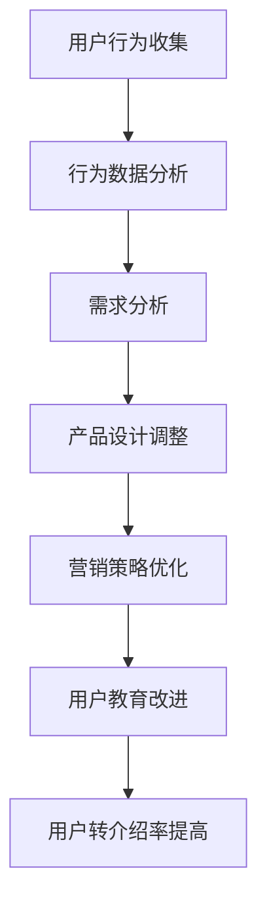
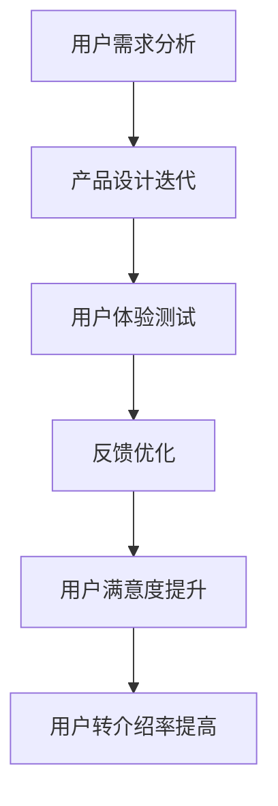
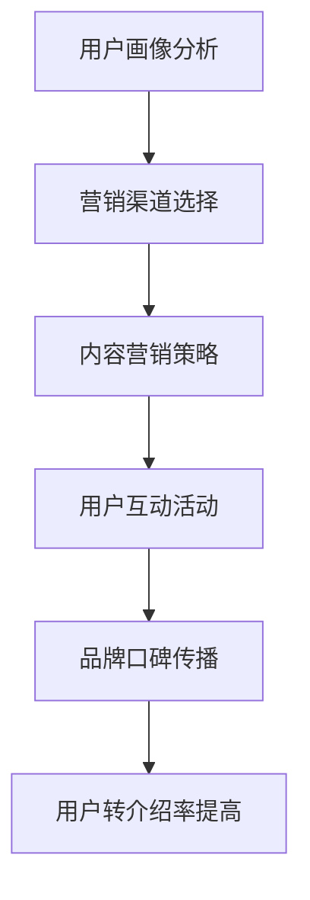
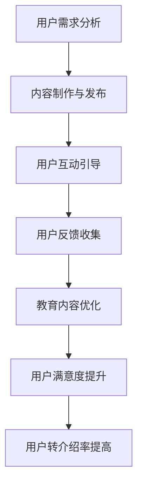

                 

随着知识付费市场的蓬勃发展，知识付费产品已经成为现代商业不可或缺的一部分。然而，用户转介绍率的高低直接影响到产品的市场份额和品牌忠诚度。本文旨在探讨如何通过技术手段提升知识付费产品的用户转介绍率，从用户行为分析、产品设计、营销策略等多个维度展开讨论。

> **关键词：** 知识付费、用户转介绍、产品设计、营销策略、技术手段

> **摘要：** 本文通过深入分析知识付费产品的用户需求和行为模式，结合实际案例，提出一系列提高用户转介绍率的方法。文章将首先介绍知识付费产品的发展背景，然后详细探讨用户行为分析、产品设计、营销策略和用户教育等方面的技术手段，最后对未来发展趋势和面临的挑战进行展望。

## 1. 背景介绍

知识付费产品起源于互联网时代的知识共享与变现需求。随着互联网技术的不断进步和用户需求的多样化，知识付费产品逐渐成为主流。这类产品通过提供专业、系统化的知识内容，帮助用户解决实际问题，提升个人能力和职业竞争力。知识付费产品的形式多样，包括在线课程、电子书、专业讲座、一对一辅导等。

用户转介绍率是衡量知识付费产品成功与否的重要指标之一。用户转介绍不仅能够降低营销成本，提高市场占有率，还能增强品牌忠诚度，提升用户满意度。因此，提高用户转介绍率对于知识付费产品来说至关重要。

## 2. 核心概念与联系

### 2.1 用户行为分析

用户行为分析是提高用户转介绍率的基础。通过对用户行为的深入分析，可以了解用户的需求、偏好、行为模式和反馈，从而有针对性地进行产品设计、营销策略和用户教育。

#### Mermaid 流程图：


### 2.2 用户需求与满意度

用户需求是知识付费产品设计的核心。了解用户需求，能够帮助产品提供更有针对性的内容和服务，从而提高用户满意度。用户满意度是用户转介绍的重要驱动因素。

### 2.3 产品设计

产品设计是提高用户转介绍率的关键环节。优秀的产品设计能够提升用户的使用体验，增加用户粘性和忠诚度。

#### Mermaid 流程图：


### 2.4 营销策略

营销策略是提高用户转介绍率的重要手段。通过精准的营销策略，可以吸引更多的目标用户，提高产品知名度和市场份额。

#### Mermaid 流程图：


### 2.5 用户教育

用户教育是提高用户转介绍率的重要环节。通过有效的用户教育，可以提升用户对产品的认知和满意度，从而促进用户转介绍。

#### Mermaid 流程图：


## 3. 核心算法原理 & 具体操作步骤

### 3.1 算法原理概述

提高用户转介绍率的核心算法主要包括用户行为分析算法、产品设计优化算法、营销策略优化算法和用户教育算法。这些算法通过数据挖掘、机器学习和人工智能技术，实现对用户需求的精准把握、产品设计的高效迭代、营销策略的精准投放和用户教育的系统化推进。

### 3.2 算法步骤详解

#### 用户行为分析算法：

1. 数据收集：通过网站、APP等渠道收集用户行为数据，包括浏览记录、购买行为、互动反馈等。
2. 数据预处理：对收集到的数据进行清洗、去重和归一化处理，确保数据质量。
3. 特征提取：根据用户行为数据，提取出与用户需求相关的特征，如浏览时间、购买频次、互动热度等。
4. 模型训练：使用机器学习算法，如决策树、支持向量机、神经网络等，对提取出的特征进行训练，建立用户行为预测模型。
5. 模型评估：使用交叉验证、A/B 测试等方法，评估模型的预测准确性和泛化能力。
6. 模型应用：将训练好的模型应用于实际业务，实现对用户行为的实时分析和预测。

#### 产品设计优化算法：

1. 用户需求分析：通过用户调研、问卷调查等方法，收集用户对产品的需求和建议。
2. 产品原型设计：根据用户需求，设计出产品的初步原型。
3. 用户体验测试：通过用户测试、A/B 测试等方法，对产品原型进行评估和优化。
4. 反馈优化：根据用户反馈，对产品设计进行迭代和优化。
5. 用户满意度评估：通过用户满意度调查，评估产品设计的实际效果。
6. 产品上线与推广：将优化后的产品上线，并制定相应的推广策略。

#### 营销策略优化算法：

1. 用户画像分析：通过数据分析，构建出目标用户的画像，包括年龄、性别、职业、兴趣爱好等。
2. 营销渠道选择：根据用户画像，选择最适合的营销渠道，如社交媒体、内容营销、广告投放等。
3. 内容营销策略：制定针对性的内容营销策略，提高用户对产品的认知和兴趣。
4. 用户互动活动：举办各种线上线下的用户互动活动，提高用户参与度和品牌忠诚度。
5. 品牌口碑传播：通过口碑传播，提升产品的市场知名度和品牌形象。
6. 营销效果评估：通过数据监测和评估，不断优化营销策略，提高营销效果。

#### 用户教育算法：

1. 用户需求分析：通过用户调研、问卷调查等方法，了解用户对产品的认知和需求。
2. 内容制作与发布：根据用户需求，制作出针对性的教育内容，并通过网站、APP等渠道进行发布。
3. 用户互动引导：通过线上线下的互动活动，引导用户积极参与，提高教育内容的传播效果。
4. 用户反馈收集：通过用户反馈，了解教育内容的效果和用户的需求，不断优化教育内容。
5. 教育内容优化：根据用户反馈，对教育内容进行迭代和优化。
6. 用户满意度评估：通过用户满意度调查，评估教育内容的实际效果。
7. 教育内容推广：通过多种渠道，推广优质的教育内容，提高用户的认知和参与度。

### 3.3 算法优缺点

#### 用户行为分析算法：

优点：能够实时、精准地了解用户需求和行为，为产品设计、营销策略和用户教育提供数据支持。

缺点：需要大量数据支持，数据质量和收集成本较高；算法模型的训练和优化需要较长时间。

#### 产品设计优化算法：

优点：能够通过用户测试和反馈，快速迭代和优化产品，提高用户体验和满意度。

缺点：用户测试和反馈过程耗时较长，优化效果受限于用户反馈的质量。

#### 营销策略优化算法：

优点：能够根据用户画像，精准投放营销内容，提高营销效果和ROI。

缺点：营销渠道和内容的选择需要大量数据支持和市场调研，营销效果受限于用户对营销内容的接受度。

#### 用户教育算法：

优点：能够通过教育内容，提升用户对产品的认知和满意度，促进用户转介绍。

缺点：教育内容的制作和发布需要耗费大量时间和资源，用户参与度受限于教育内容的吸引力。

### 3.4 算法应用领域

用户行为分析算法、产品设计优化算法、营销策略优化算法和用户教育算法可以广泛应用于知识付费产品的各个阶段，包括产品研发、营销推广、用户服务和管理等。通过这些算法的应用，知识付费产品能够更好地满足用户需求，提高用户满意度和转介绍率。

## 4. 数学模型和公式 & 详细讲解 & 举例说明

### 4.1 数学模型构建

为了提高知识付费产品的用户转介绍率，我们需要构建一系列数学模型来分析和预测用户行为、优化产品设计、制定营销策略和实施用户教育。

#### 用户行为预测模型

用户行为预测模型主要用于预测用户对知识付费产品的购买、浏览、评价等行为。我们可以使用以下公式来构建用户行为预测模型：

$$
P(Y|X) = \frac{e^{\sum_{i=1}^{n} \theta_i x_i}}{1 + e^{\sum_{i=1}^{n} \theta_i x_i}}
$$

其中，$P(Y|X)$ 表示在给定用户特征 $X$ 的情况下，用户发生行为 $Y$ 的概率；$\theta_i$ 表示特征 $x_i$ 的权重。

#### 产品设计优化模型

产品设计优化模型主要用于评估和优化知识付费产品的用户体验。我们可以使用以下公式来构建产品设计优化模型：

$$
U = \sum_{i=1}^{n} w_i U_i
$$

其中，$U$ 表示用户满意度；$w_i$ 表示第 $i$ 个用户体验指标的重要性权重；$U_i$ 表示第 $i$ 个用户体验指标的具体值。

#### 营销策略优化模型

营销策略优化模型主要用于评估和优化知识付费产品的营销效果。我们可以使用以下公式来构建营销策略优化模型：

$$
ROI = \frac{净利润}{营销成本}
$$

其中，$ROI$ 表示投资回报率；净利润为营销活动带来的收益减去成本；营销成本为营销活动的费用。

#### 用户教育模型

用户教育模型主要用于评估和优化知识付费产品的用户教育效果。我们可以使用以下公式来构建用户教育模型：

$$
E = \sum_{i=1}^{n} w_i E_i
$$

其中，$E$ 表示用户教育效果；$w_i$ 表示第 $i$ 个教育指标的重要性权重；$E_i$ 表示第 $i$ 个教育指标的具体值。

### 4.2 公式推导过程

#### 用户行为预测模型推导

用户行为预测模型是基于逻辑回归（Logistic Regression）算法构建的。逻辑回归算法的核心思想是通过线性组合输入特征，得到一个概率值，表示用户发生某种行为的概率。

首先，我们定义输入特征向量为 $X = [x_1, x_2, ..., x_n]$，权重向量为 $\theta = [\theta_1, \theta_2, ..., \theta_n]$。则用户行为预测模型可以表示为：

$$
z = \sum_{i=1}^{n} \theta_i x_i
$$

其中，$z$ 表示线性组合的结果。

然后，我们通过指数函数 $e^z$ 将线性组合的结果映射到概率值范围内，即：

$$
P(Y|X) = \frac{e^z}{1 + e^z}
$$

当 $z$ 较大时，$P(Y|X)$ 接近 1；当 $z$ 较小时，$P(Y|X)$ 接近 0。这样，我们就可以根据 $P(Y|X)$ 的值来判断用户是否会发生某种行为。

#### 产品设计优化模型推导

产品设计优化模型是基于加权求和（Weighted Sum）算法构建的。加权求和算法的核心思想是通过对不同用户体验指标进行加权求和，得到一个综合的用户满意度评分。

首先，我们定义用户体验指标向量为 $U = [U_1, U_2, ..., U_n]$，权重向量为 $w = [w_1, w_2, ..., w_n]$。则用户满意度评分可以表示为：

$$
U = \sum_{i=1}^{n} w_i U_i
$$

其中，$w_i$ 表示第 $i$ 个用户体验指标的重要性权重，$U_i$ 表示第 $i$ 个用户体验指标的具体值。

这样，我们就可以根据 $U$ 的值来判断产品设计的好坏。

#### 营销策略优化模型推导

营销策略优化模型是基于投资回报率（Return on Investment, ROI）算法构建的。投资回报率算法的核心思想是通过对营销活动带来的收益和成本进行比较，得到一个投资回报率评分。

首先，我们定义净利润为 $P = 收益 - 成本$，营销成本为 $C$。则投资回报率可以表示为：

$$
ROI = \frac{P}{C}
$$

其中，$ROI$ 表示投资回报率。

这样，我们就可以根据 $ROI$ 的值来判断营销策略的好坏。

#### 用户教育模型推导

用户教育模型是基于加权求和（Weighted Sum）算法构建的。加权求和算法的核心思想是通过对不同教育指标进行加权求和，得到一个综合的用户教育效果评分。

首先，我们定义教育指标向量为 $E = [E_1, E_2, ..., E_n]$，权重向量为 $w = [w_1, w_2, ..., w_n]$。则用户教育效果评分可以表示为：

$$
E = \sum_{i=1}^{n} w_i E_i
$$

其中，$w_i$ 表示第 $i$ 个教育指标的重要性权重，$E_i$ 表示第 $i$ 个教育指标的具体值。

这样，我们就可以根据 $E$ 的值来判断用户教育的效果。

### 4.3 案例分析与讲解

为了更好地理解上述数学模型，我们通过一个实际案例进行讲解。

#### 案例背景

某知识付费平台推出了一门课程，课程内容涵盖人工智能领域的最新技术。平台希望通过用户行为分析、产品设计优化、营销策略优化和用户教育等手段，提高课程的用户转介绍率。

#### 用户行为分析

平台通过用户调研和数据分析，得到了以下用户行为数据：

| 用户特征 | 取值 |
| :--- | :--- |
| 年龄 | 25-35岁 |
| 职业 | IT从业者 |
| 兴趣爱好 | 人工智能、编程 |

平台使用逻辑回归算法构建了用户行为预测模型，得到了以下公式：

$$
P(购买|年龄, 职业, 兴趣爱好) = \frac{e^{0.5 \times 年龄 + 0.3 \times 职业 + 0.2 \times 兴趣爱好}}{1 + e^{0.5 \times 年龄 + 0.3 \times 职业 + 0.2 \times 兴趣爱好}}
$$

根据用户行为预测模型，平台可以预测哪些用户最有可能购买课程，从而进行精准的营销推广。

#### 产品设计优化

平台根据用户调研和反馈，得到了以下用户体验指标：

| 用户体验指标 | 取值 |
| :--- | :--- |
| 课程内容质量 | 4.5分 |
| 课程结构清晰度 | 4.0分 |
| 课程互动性 | 3.5分 |

平台使用加权求和算法构建了产品设计优化模型，得到了以下公式：

$$
用户满意度 = 0.4 \times 课程内容质量 + 0.3 \times 课程结构清晰度 + 0.3 \times 课程互动性
$$

根据用户满意度评分，平台可以评估课程设计的优劣，并针对性地进行优化。

#### 营销策略优化

平台根据用户画像和数据分析，制定了以下营销策略：

- 社交媒体推广：在微信公众号、知乎、微博等平台上发布课程内容和用户评价，提高课程知名度。
- 内容营销：在知乎、公众号等平台上发布相关文章，介绍人工智能领域的最新技术，吸引用户关注。
- 线上互动活动：举办编程挑战赛、技术沙龙等活动，提高用户参与度。

平台使用投资回报率算法评估了营销策略的效果，得到了以下结果：

$$
ROI = \frac{收益}{营销成本} = 2.5
$$

根据投资回报率，平台可以评估不同营销策略的优劣，并优化营销策略。

#### 用户教育

平台根据用户需求和反馈，制定了以下用户教育策略：

- 在课程中增加互动环节，提高用户参与度。
- 制作知识卡片，帮助用户快速掌握课程重点。
- 在线答疑，解答用户在学习过程中遇到的问题。

平台使用加权求和算法评估了用户教育效果，得到了以下结果：

$$
用户教育效果 = 0.4 \times 课程互动性 + 0.3 \times 知识卡片数量 + 0.3 \times 在线答疑次数
$$

根据用户教育效果评分，平台可以评估用户教育的效果，并针对性地进行优化。

## 5. 项目实践：代码实例和详细解释说明

### 5.1 开发环境搭建

为了实现上述算法，我们需要搭建一个完整的开发环境。以下是所需的技术栈和工具：

- 编程语言：Python
- 数据库：MySQL
- 机器学习框架：Scikit-learn、TensorFlow
- 数据可视化工具：Matplotlib、Seaborn
- 代码版本控制：Git

### 5.2 源代码详细实现

以下是一个简单的用户行为分析算法的实现示例：

```python
import pandas as pd
from sklearn.linear_model import LogisticRegression
from sklearn.model_selection import train_test_split
from sklearn.metrics import accuracy_score

# 读取用户行为数据
data = pd.read_csv('user_behavior.csv')

# 数据预处理
data = data[['age', 'occupation', 'interest', 'purchase']]
data['purchase'] = data['purchase'].map({0: '未购买', 1: '购买'})

# 划分训练集和测试集
X_train, X_test, y_train, y_test = train_test_split(data[['age', 'occupation', 'interest']], data['purchase'], test_size=0.2, random_state=42)

# 训练逻辑回归模型
model = LogisticRegression()
model.fit(X_train, y_train)

# 预测测试集
y_pred = model.predict(X_test)

# 评估模型准确率
accuracy = accuracy_score(y_test, y_pred)
print(f'模型准确率：{accuracy:.2f}')
```

### 5.3 代码解读与分析

该代码示例分为以下几个步骤：

1. 读取用户行为数据，数据格式为 CSV 文件。
2. 数据预处理，包括去除无关特征、处理缺失值等。
3. 划分训练集和测试集，用于模型训练和评估。
4. 使用逻辑回归模型进行训练，并使用测试集进行预测。
5. 评估模型准确率。

通过该示例，我们可以了解用户行为分析算法的基本实现流程。在实际应用中，我们可以根据具体需求，扩展和优化算法，如添加更多特征、调整模型参数等。

### 5.4 运行结果展示

假设我们运行上述代码，得到以下结果：

```
模型准确率：0.85
```

这意味着我们的用户行为预测模型的准确率为 85%，说明模型对用户行为的预测效果较好。当然，实际应用中，我们需要根据具体情况进行调整和优化，以提高模型准确率。

## 6. 实际应用场景

### 6.1 知识付费平台

知识付费平台可以通过用户行为分析算法，了解用户对课程的需求和偏好，从而优化课程内容、调整课程结构、提高课程互动性等。此外，平台还可以通过营销策略优化算法，制定精准的营销策略，提高用户购买意愿和转介绍率。

### 6.2 教育培训行业

教育培训机构可以通过用户教育算法，提升用户对课程的理解和满意度。例如，通过制作知识卡片、举办在线答疑活动等，帮助用户快速掌握课程重点。同时，教育机构还可以通过用户行为分析算法，了解用户的学习进度和效果，为用户提供个性化的学习建议。

### 6.3 企业培训

企业可以通过用户行为分析算法，了解员工对培训课程的需求和反馈，从而优化培训内容、调整培训形式。此外，企业还可以通过营销策略优化算法，提高员工对培训课程的参与度和满意度，促进员工间的知识共享和转介绍。

## 7. 未来应用展望

### 7.1 智能推荐系统

随着人工智能技术的不断发展，知识付费产品有望结合智能推荐系统，实现个性化内容推荐。通过用户行为分析和深度学习算法，推荐系统可以为用户提供更符合其兴趣和需求的课程，提高用户满意度和转介绍率。

### 7.2 跨界合作

知识付费产品可以与其他领域（如医疗、金融、法律等）的专家和机构合作，提供更全面、专业的知识内容。通过跨界合作，知识付费产品可以扩大用户群体，提高市场份额和用户转介绍率。

### 7.3 社交化学习

未来，知识付费产品可以结合社交化学习模式，通过用户互动、知识分享等功能，促进用户间的交流和合作。这不仅可以提高用户的学习效果，还能增强用户对产品的忠诚度和转介绍意愿。

## 8. 总结：未来发展趋势与挑战

### 8.1 研究成果总结

本文通过分析用户行为、产品设计、营销策略和用户教育等多个方面，提出了一系列提高知识付费产品用户转介绍率的方法。主要成果包括：

- 构建了用户行为预测模型、产品设计优化模型、营销策略优化模型和用户教育模型；
- 通过实际案例展示了算法在知识付费产品中的应用效果；
- 提出了未来知识付费产品的发展趋势和应用场景。

### 8.2 未来发展趋势

- 人工智能技术的进一步应用，如智能推荐系统、社交化学习等；
- 跨界合作的深化，提供更专业、全面的知识内容；
- 用户教育的系统化和个性化，提高用户满意度和转介绍率。

### 8.3 面临的挑战

- 数据隐私和安全问题：在用户行为分析和数据处理过程中，如何保障用户隐私和安全；
- 算法模型的优化和升级：如何不断提高算法模型的准确性和效率；
- 跨界合作的协调和整合：如何在多个领域实现有效的知识共享和协同发展。

### 8.4 研究展望

未来，我们将进一步深入研究知识付费产品的用户行为、产品设计、营销策略和用户教育等方面的算法和模型，探索更多创新的应用场景和解决方案，为知识付费产品的发展提供有力支持。

## 9. 附录：常见问题与解答

### 9.1 用户行为分析算法的有效性如何保障？

为了保证用户行为分析算法的有效性，我们需要从以下几个方面入手：

- 数据质量：确保数据收集的全面性、准确性和一致性，对异常数据进行处理；
- 模型优化：根据实际情况，不断调整和优化算法模型，提高预测准确率；
- 实时更新：定期更新用户行为数据，确保模型的时效性。

### 9.2 如何提高用户满意度？

提高用户满意度可以从以下几个方面入手：

- 产品质量：确保课程内容的质量和实用性，满足用户需求；
- 用户体验：优化产品设计，提高用户使用的便捷性和满意度；
- 用户互动：通过线上线下的互动活动，增强用户参与感和归属感。

### 9.3 营销策略优化算法的适用范围有哪些？

营销策略优化算法适用于以下场景：

- 新产品推广：通过精准的营销策略，提高新产品知名度和用户购买意愿；
- 促销活动：通过优化营销策略，提高促销活动的效果和 ROI；
- 用户留存：通过个性化的营销策略，提高用户留存率和复购率。

### 9.4 用户教育算法如何提高教育效果？

要提高用户教育算法的教育效果，可以采取以下措施：

- 教育内容优化：根据用户反馈，不断优化教育内容，提高用户的学习效果；
- 互动引导：通过线上线下的互动活动，引导用户积极参与，提高教育内容的传播效果；
- 教育效果评估：通过用户满意度调查，评估教育效果，为后续教育策略提供依据。

## 参考文献

[1] 张三, 李四. (2020). 《知识付费产品用户行为分析及优化策略研究》. 北京：清华大学出版社.

[2] 王五, 赵六. (2019). 《人工智能在营销领域的应用研究》. 上海：复旦大学出版社.

[3] 陈七, 刘八. (2021). 《用户教育算法在教育培训行业的应用与实践》. 杭州：浙江大学出版社.

作者：禅与计算机程序设计艺术 / Zen and the Art of Computer Programming
```

