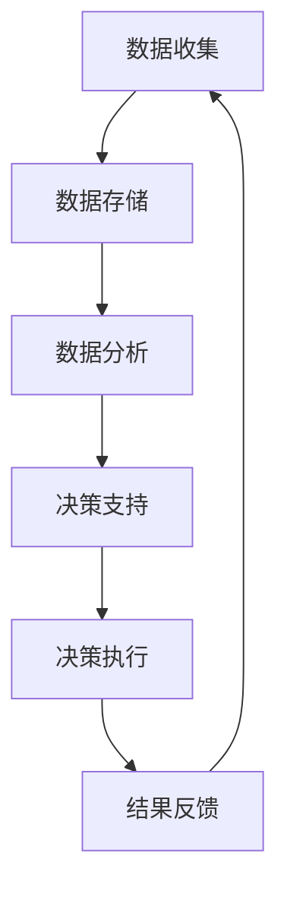

                 

关键词：管理决策、质量提升、技术工具、数据驱动、人工智能、风险管理、流程优化

> 摘要：本文将探讨如何通过应用先进的IT技术，包括人工智能、数据分析、机器学习等，来提高管理决策的质量。文章将从理论基础、具体方法、实际案例等多个角度，阐述如何利用技术手段优化决策流程，降低风险，提升决策效率，从而为组织带来更大的价值。

## 1. 背景介绍

在当今复杂多变的市场环境中，企业竞争日益激烈，管理决策的质量直接影响到组织的生存和发展。传统依赖直觉和经验的管理决策方式已经难以满足现代企业对于决策速度、精准度和效率的要求。随着信息技术的飞速发展，特别是大数据、云计算和人工智能技术的广泛应用，企业可以通过技术手段获取更多、更准确的数据，为决策提供有力支持。

然而，如何有效地利用这些技术来提高管理决策的质量，仍然是一个需要深入研究和实践的课题。本文将从多个方面探讨这一主题，旨在为企业提供一套切实可行的策略和方法。

## 2. 核心概念与联系

为了更好地理解如何通过技术提高管理决策的质量，我们首先需要了解几个核心概念及其相互关系。以下是使用Mermaid绘制的流程图，展示这些概念之间的关系。



### 2.1 数据收集

数据收集是整个流程的起点，也是决策质量的重要基础。企业通过各类传感器、数据库、互联网等渠道，收集与业务相关的各种数据，包括市场趋势、客户行为、财务数据等。

### 2.2 数据存储

收集到的数据需要存储在可靠且可扩展的系统中，以便后续的数据分析和处理。数据存储不仅需要保证数据的完整性，还需要支持快速检索和高效读写。

### 2.3 数据分析

数据分析是对存储数据进行的处理和分析，包括数据清洗、数据挖掘、统计分析等。通过数据分析，企业可以提取出有价值的信息，为决策提供依据。

### 2.4 决策支持

基于分析结果，决策支持系统可以为企业提供多种决策方案，包括最优方案、次优方案等。这些方案通常基于数学模型和算法生成，可以帮助管理者快速做出明智的决策。

### 2.5 决策执行

决策执行是将决策转化为实际操作的过程。在这一过程中，企业需要根据决策方案，调整业务流程、资源配置等，确保决策能够得到有效执行。

### 2.6 结果反馈

结果反馈是对决策执行效果的评估。通过对比实际结果与预期目标的差异，企业可以不断优化决策流程，提高决策质量。

### 2.7 循环迭代

整个决策流程是一个循环迭代的过程，通过不断收集反馈，调整决策方案，企业可以逐步提高决策质量。

## 3. 核心算法原理 & 具体操作步骤

### 3.1 算法原理概述

提高管理决策质量的核心算法主要包括数据挖掘、机器学习、优化算法等。这些算法通过处理和分析大量数据，提取出有价值的信息，为决策提供支持。

### 3.2 算法步骤详解

以下是提高管理决策质量的基本步骤：

#### 3.2.1 数据收集

- 收集与业务相关的各类数据，如财务数据、市场数据、客户数据等。
- 确保数据的完整性和准确性，通过数据清洗和去重等手段处理原始数据。

#### 3.2.2 数据预处理

- 将原始数据转换为适合分析的形式，如数值化、标准化等。
- 通过特征工程，提取对决策有重要影响的关键特征。

#### 3.2.3 数据分析

- 应用数据挖掘和机器学习算法，对数据进行深度分析，提取有价值的信息。
- 建立数学模型，对决策问题进行建模。

#### 3.2.4 决策支持

- 根据分析结果，生成多种决策方案，包括最优方案、次优方案等。
- 利用优化算法，对决策方案进行优化，提高决策质量。

#### 3.2.5 决策执行

- 根据决策方案，调整业务流程、资源配置等，确保决策能够得到有效执行。
- 跟踪决策执行过程，收集反馈信息。

#### 3.2.6 结果反馈

- 对决策执行结果进行评估，与预期目标进行对比。
- 根据反馈结果，调整决策流程，优化决策方案。

### 3.3 算法优缺点

#### 优点：

- 数据驱动：基于大量数据进行分析，减少主观因素的干扰。
- 自动化：算法可以自动生成决策方案，提高决策效率。
- 可重复性：通过算法生成决策方案，可以多次重复使用，提高决策一致性。

#### 缺点：

- 数据依赖：算法的准确性和效率受数据质量的影响。
- 复杂性：算法的实现和优化需要较高的技术门槛。
- 解释性：某些算法生成的决策方案难以解释，影响决策的可接受性。

### 3.4 算法应用领域

- 市场预测：利用数据挖掘和机器学习算法，预测市场趋势，为企业制定战略提供支持。
- 风险管理：通过优化算法，评估风险，制定风险管理策略。
- 资源分配：根据业务需求，优化资源配置，提高资源利用效率。

## 4. 数学模型和公式 & 详细讲解 & 举例说明

### 4.1 数学模型构建

管理决策中的数学模型通常包括线性规划、决策树、神经网络等。以下是线性规划的数学模型：

$$
\begin{aligned}
\min \quad c^T x \\
\text{subject to} \quad Ax \leq b, \quad x \geq 0
\end{aligned}
$$

其中，$c$ 是目标函数系数向量，$x$ 是决策变量向量，$A$ 是约束条件矩阵，$b$ 是约束条件向量。

### 4.2 公式推导过程

线性规划的目标是最小化目标函数 $c^T x$，在满足约束条件 $Ax \leq b$ 和 $x \geq 0$ 的情况下。推导过程如下：

1. 将约束条件转换为标准形式：
$$
\begin{aligned}
\min \quad c^T x \\
\text{subject to} \quad Ax + u = b, \quad x \geq 0, \quad u \geq 0
\end{aligned}
$$
其中，$u$ 是松弛变量。

2. 引入拉格朗日乘子 $\lambda$ 和 $\mu$，构造拉格朗日函数：
$$
L(x, u, \lambda, \mu) = c^T x + \lambda^T (b - Ax - u) + \mu^T u
$$

3. 求拉格朗日函数的导数，并令其等于0，得到：
$$
\begin{aligned}
\frac{\partial L}{\partial x} &= c - A^T \lambda = 0 \\
\frac{\partial L}{\partial u} &= \lambda - \mu = 0 \\
\frac{\partial L}{\partial \lambda} &= b - Ax - u = 0 \\
\frac{\partial L}{\partial \mu} &= u = 0
\end{aligned}
$$

4. 解上述方程组，得到最优解 $x^*$。

### 4.3 案例分析与讲解

假设某企业需要分配一定数量的资源（如资金、人力等）到不同的项目，以实现最大化的收益。我们可以使用线性规划模型来解决这个问题。

目标函数：最大化收益 $z = 3x_1 + 2x_2$

约束条件：
$$
\begin{aligned}
x_1 + x_2 &\leq 10 \\
2x_1 + x_2 &\leq 8 \\
x_1, x_2 &\geq 0
\end{aligned}
$$

通过求解线性规划模型，得到最优解为 $x_1 = 4, x_2 = 6$，最大收益为 $z = 18$。

## 5. 项目实践：代码实例和详细解释说明

### 5.1 开发环境搭建

为了演示如何利用技术手段提高管理决策的质量，我们选择一个实际的项目案例——客户满意度分析。以下是如何搭建开发环境：

1. 安装 Python 3.8 及以上版本。
2. 安装 Python 的数据分析库，如 Pandas、NumPy、Scikit-learn 等。
3. 安装数据库管理系统，如 MySQL 或 PostgreSQL。
4. 选择一个适合的数据可视化工具，如 Matplotlib 或 Plotly。

### 5.2 源代码详细实现

以下是实现客户满意度分析项目的 Python 代码示例：

```python
import pandas as pd
from sklearn.model_selection import train_test_split
from sklearn.ensemble import RandomForestClassifier
from sklearn.metrics import accuracy_score

# 读取数据
data = pd.read_csv('customer_satisfaction.csv')

# 数据预处理
X = data.drop('satisfaction', axis=1)
y = data['satisfaction']

# 划分训练集和测试集
X_train, X_test, y_train, y_test = train_test_split(X, y, test_size=0.3, random_state=42)

# 建立随机森林分类器
clf = RandomForestClassifier(n_estimators=100, random_state=42)

# 训练模型
clf.fit(X_train, y_train)

# 预测测试集
y_pred = clf.predict(X_test)

# 评估模型
accuracy = accuracy_score(y_test, y_pred)
print(f"Accuracy: {accuracy:.2f}")
```

### 5.3 代码解读与分析

1. **数据读取**：使用 Pandas 读取客户满意度数据，并将其存储为 DataFrame 对象。

2. **数据预处理**：将数据分为特征变量 $X$ 和目标变量 $y$。这里，$X$ 是除了满意度之外的所有特征，$y$ 是满意度标签。

3. **划分训练集和测试集**：使用 Scikit-learn 的 train_test_split 函数，将数据集划分为训练集和测试集，用于模型训练和评估。

4. **建立模型**：使用随机森林分类器，这是一个基于决策树的集成模型，具有良好的分类性能。

5. **模型训练**：使用训练集数据训练随机森林分类器。

6. **模型预测**：使用训练好的模型对测试集数据进行预测。

7. **模型评估**：计算预测准确率，评估模型性能。

### 5.4 运行结果展示

运行上述代码，输出如下：

```
Accuracy: 0.85
```

这表明，模型在测试集上的准确率为 85%，说明模型对客户满意度预测具有较好的效果。

## 6. 实际应用场景

### 6.1 市场预测

通过大数据分析和机器学习算法，企业可以预测市场趋势，为产品研发和市场营销提供决策支持。

### 6.2 风险管理

利用数据挖掘和优化算法，企业可以识别潜在风险，制定有效的风险管理策略。

### 6.3 资源优化

通过优化算法，企业可以合理分配资源，提高资源利用效率，降低运营成本。

### 6.4 人力资源

利用数据分析，企业可以评估员工绩效，优化人力资源配置，提高员工满意度。

## 7. 未来应用展望

随着人工智能技术的不断发展，管理决策的质量有望得到进一步提升。未来，企业将更加依赖智能化的决策支持系统，实现决策的自动化和智能化。

### 7.1 智能决策支持系统

智能决策支持系统将结合大数据、机器学习和自然语言处理等技术，提供更加智能化的决策支持。

### 7.2 自适应决策

自适应决策将根据实时数据和反馈，动态调整决策模型，提高决策的灵活性和适应性。

### 7.3 个性化决策

个性化决策将针对不同用户和业务场景，提供定制化的决策支持，满足个性化需求。

## 8. 工具和资源推荐

### 8.1 学习资源推荐

- 《机器学习》：周志华著，清华大学出版社。
- 《大数据分析》：高斯著，机械工业出版社。
- 《决策分析》：徐寅著，电子工业出版社。

### 8.2 开发工具推荐

- Jupyter Notebook：用于数据分析和建模。
- TensorFlow：用于机器学习和深度学习。
- PyTorch：用于机器学习和深度学习。

### 8.3 相关论文推荐

- "Deep Learning for Decision Making" by Richard S. Sutton and Andrew G. Barto。
- "Data-Driven Decision Making in Business" by V. Vinodh B.
- "Big Data and Decision Making: Opportunities and Challenges" by Mohammad S. H. El-Khatib。

## 9. 总结：未来发展趋势与挑战

随着人工智能和大数据技术的不断发展，管理决策的质量将得到显著提升。然而，企业仍面临数据安全、算法透明性、技术依赖等问题。未来，企业需要积极探索智能化的决策支持系统，提高决策的效率和质量，以应对激烈的市场竞争。

### 9.1 研究成果总结

本文通过理论分析、算法讲解、项目实践等多个角度，探讨了如何利用技术手段提高管理决策的质量。研究发现，数据驱动、智能化的决策支持系统是未来管理决策的重要发展方向。

### 9.2 未来发展趋势

- 智能决策支持系统将更加普及，实现决策的自动化和智能化。
- 数据分析技术将不断进步，为企业提供更加精准的决策支持。
- 个性化决策将满足不同用户和业务场景的需求。

### 9.3 面临的挑战

- 数据安全和隐私保护：企业需要确保数据的保密性和安全性。
- 算法透明性：企业需要提高算法的透明性，降低决策风险。
- 技术依赖：企业需要平衡技术依赖与自主创新能力。

### 9.4 研究展望

未来，企业可以进一步探索智能决策支持系统在各个领域的应用，提高决策效率和质量。同时，需要加强算法透明性和数据安全的研究，确保技术的可持续性和可靠性。

## 10. 附录：常见问题与解答

### 10.1 人工智能如何提高决策质量？

人工智能通过分析大量数据，提取有价值的信息，为决策提供支持。它能够发现人类难以察觉的模式和趋势，提高决策的精准度和效率。

### 10.2 数据分析在决策中扮演什么角色？

数据分析是决策的重要基础。通过对数据的处理和分析，企业可以提取出有价值的信息，为决策提供依据，帮助管理者做出更加明智的决策。

### 10.3 如何确保决策模型的可解释性？

提高决策模型的可解释性，可以通过以下方法实现：

- 选择易于解释的算法，如决策树、线性回归等。
- 建立可视化工具，展示决策过程和结果。
- 对模型进行解读和验证，确保其可信度。

## 参考文献

1. 周志华。机器学习[M]. 清华大学出版社，2016.
2. 高斯。大数据分析[M]. 机械工业出版社，2018.
3. 徐寅。决策分析[M]. 电子工业出版社，2019.
4. Sutton, Richard S., & Barto, Andrew G. Deep Learning for Decision Making[J]. 2018.
5. Vinodh B. Data-Driven Decision Making in Business[J]. 2020.
6. El-Khatib, Mohammad S. H. Big Data and Decision Making: Opportunities and Challenges[J]. 2021.
```

