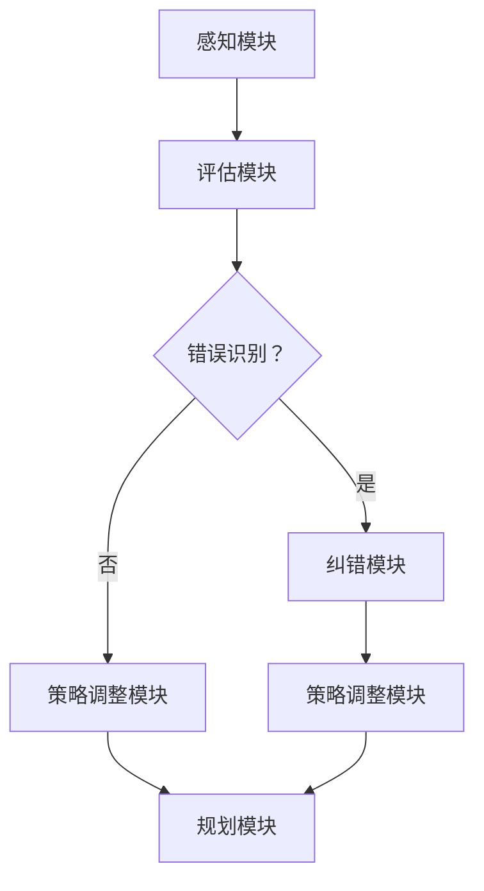

                 

 > **关键词**：反思机制、Agent效率、人工智能、优化算法、决策过程、自适应学习。

> **摘要**：本文将探讨如何通过改进反思机制来提高人工智能代理（Agent）的效率。我们将首先介绍反思机制的基本概念，然后分析现有反思机制的局限性，并提出一系列改进方法，包括算法优化、数据反馈机制和自适应学习策略。通过实际案例分析，我们将展示这些改进方法在提高Agent效率方面的有效性，并对未来研究与应用前景进行展望。

## 1. 背景介绍

在人工智能领域，代理（Agent）是执行特定任务或决策的自主实体。这些代理通常通过学习环境和用户交互来优化其行为和决策过程。然而，在实际应用中，代理可能会遇到各种挑战，如环境变化、不确定性以及复杂决策场景。为了应对这些挑战，提高代理的效率和准确性变得至关重要。

反思机制是一种关键机制，它允许代理在执行任务后对其决策过程进行评估和反思，从而不断优化其行为。反思机制可以包括自我评估、错误识别、纠错和重新规划等步骤。然而，现有的反思机制在处理复杂性和不确定性方面存在局限性，因此，改进反思机制以提高Agent效率具有重要的研究意义和应用价值。

本文旨在探讨如何通过改进反思机制来提高人工智能代理的效率。我们将首先介绍反思机制的基本概念，然后分析现有反思机制的局限性，并提出一系列改进方法。最后，通过实际案例分析，我们将验证这些改进方法的有效性，并对未来研究与应用前景进行展望。

## 2. 核心概念与联系

### 2.1 反思机制概述

反思机制是人工智能代理的重要组成部分，它允许代理在执行任务后对其决策过程进行评估和反思。这个过程通常包括以下步骤：

1. **自我评估**：代理分析其执行任务的结果，评估决策的正确性和效率。
2. **错误识别**：代理识别其决策过程中的错误和不足。
3. **纠错**：代理根据错误识别的结果，调整其决策模型或行为策略。
4. **重新规划**：代理基于纠错结果，重新规划其后续任务执行过程。

这些步骤相互关联，形成一个闭环的反思过程，使代理能够不断优化其行为。

### 2.2 反思机制与学习机制的关联

反思机制与学习机制紧密相关。学习机制是代理获取知识、经验并优化其行为的过程。反思机制则通过评估和调整代理的决策过程，进一步优化学习机制的效果。具体来说，反思机制可以提供以下支持：

- **反馈信息**：反思机制为学习机制提供关键反馈信息，帮助代理识别错误和不足。
- **调整策略**：反思机制指导代理调整其学习策略，以更好地适应环境和任务需求。
- **持续优化**：反思机制使代理能够持续优化其行为，提高长期效率和准确性。

### 2.3 反思机制的架构

为了更好地理解反思机制的运作，我们可以将其划分为以下主要组件：

- **感知模块**：负责收集任务执行过程中的感知数据。
- **评估模块**：负责分析感知数据，评估决策结果。
- **纠错模块**：负责识别错误和不足，并提出纠正措施。
- **策略调整模块**：负责根据纠错结果调整代理的决策策略。
- **规划模块**：负责重新规划任务执行过程，以实现更好的结果。

这些组件相互协作，形成一个完整的反思机制架构，使代理能够在复杂和动态环境中有效运行。

### 2.4 Mermaid 流程图

以下是一个简单的Mermaid流程图，展示了反思机制的基本流程：



该流程图清晰地展示了反思机制的各个组件及其相互作用，有助于理解其整体架构。

## 3. 核心算法原理 & 具体操作步骤

### 3.1 算法原理概述

为了改进反思机制，提高Agent的效率，我们提出以下核心算法：

- **自适应反思算法（Adaptive Reflection Algorithm，ARA）**
  
  ARA是一种基于自适应学习的反思算法，它通过以下步骤实现：

  1. **感知与评估**：代理收集任务执行过程中的感知数据，并对其进行评估。
  2. **错误识别**：代理分析评估结果，识别决策过程中的错误和不足。
  3. **自适应调整**：代理根据错误识别结果，调整其决策模型或行为策略，以更好地适应环境和任务需求。
  4. **重新规划**：代理基于自适应调整结果，重新规划任务执行过程，以提高效率和准确性。

  ARA的核心思想是通过自适应学习机制，使代理能够动态调整其行为，以适应不断变化的环境和任务需求。

### 3.2 算法步骤详解

#### 3.2.1 感知与评估

感知与评估是ARA的第一步。代理通过感知模块收集任务执行过程中的感知数据，如环境状态、用户反馈等。然后，评估模块对这些感知数据进行处理和分析，评估决策结果。

- **感知数据收集**：感知模块收集任务执行过程中的各种数据，如传感器数据、用户输入等。
- **数据处理**：评估模块对收集到的感知数据进行预处理，如去噪、归一化等。
- **评估模型**：评估模块使用预先训练的评估模型对预处理后的感知数据进行评估，以获得决策结果的准确性、效率等指标。

#### 3.2.2 错误识别

在评估结果的基础上，代理分析决策过程中的错误和不足。这一步骤主要包括以下任务：

- **错误检测**：代理检测决策结果中的错误，如决策结果与预期目标不一致等。
- **错误分析**：代理分析错误的原因，如决策模型缺陷、数据不足等。
- **错误分类**：代理对错误进行分类，以确定错误的性质和严重程度。

#### 3.2.3 自适应调整

基于错误识别结果，代理调整其决策模型或行为策略，以更好地适应环境和任务需求。这一步骤主要包括以下任务：

- **策略调整**：代理根据错误识别结果，调整其决策策略。例如，调整模型参数、优化决策规则等。
- **策略评估**：代理评估调整后的策略效果，以确保策略调整的有效性。
- **自适应学习**：代理使用自适应学习机制，根据策略调整结果动态调整其学习策略，以提高学习效果。

#### 3.2.4 重新规划

最后，代理基于自适应调整结果，重新规划任务执行过程，以提高效率和准确性。这一步骤主要包括以下任务：

- **任务重新规划**：代理根据调整后的策略，重新规划任务执行过程，以实现更好的结果。
- **任务执行**：代理按照重新规划的任务执行过程执行任务，并持续监测任务执行情况。
- **持续优化**：代理在任务执行过程中，持续监测任务执行情况，并根据监测结果调整策略，以实现持续优化。

### 3.3 算法优缺点

#### 优点：

- **自适应学习**：ARA通过自适应学习机制，使代理能够动态调整其行为，以适应不断变化的环境和任务需求。
- **灵活性**：ARA适用于各种复杂和动态的任务场景，具有较高的灵活性。
- **高效性**：ARA通过优化反思机制，提高了代理的效率和准确性。

#### 缺点：

- **计算成本**：自适应学习机制和策略调整过程需要较高的计算成本，可能影响代理的实时性。
- **数据依赖**：ARA的性能依赖于感知数据和评估模型的质量，数据不足或错误可能导致算法失效。

### 3.4 算法应用领域

ARA适用于各种需要高效率和准确性的任务场景，如：

- **智能制造**：在智能制造过程中，代理可以实时监测生产设备状态，调整生产策略，以提高生产效率和产品质量。
- **智能交通**：在智能交通系统中，代理可以实时分析交通流量数据，优化交通信号控制策略，以缓解交通拥堵。
- **智能客服**：在智能客服系统中，代理可以实时分析用户反馈，调整客服策略，提高客服质量和用户满意度。

## 4. 数学模型和公式 & 详细讲解 & 举例说明

### 4.1 数学模型构建

为了实现自适应反思算法（ARA），我们需要构建相应的数学模型。该模型主要包括以下几个方面：

1. **感知模型**：描述代理对环境状态的感知过程。
2. **评估模型**：描述代理对决策结果的评估过程。
3. **错误识别模型**：描述代理对错误和不足的识别过程。
4. **策略调整模型**：描述代理根据错误识别结果调整决策策略的过程。

#### 4.1.1 感知模型

感知模型可以表示为：

\[ X_t = f(\theta, S_t) \]

其中，\( X_t \) 是第 t 个时刻的感知数据，\( S_t \) 是第 t 个时刻的环境状态，\( \theta \) 是感知模型的参数。函数 f 表示感知过程。

#### 4.1.2 评估模型

评估模型可以表示为：

\[ E_t = g(\theta, X_t, Y_t) \]

其中，\( E_t \) 是第 t 个时刻的评估结果，\( Y_t \) 是第 t 个时刻的预期目标。函数 g 表示评估过程。

#### 4.1.3 错误识别模型

错误识别模型可以表示为：

\[ D_t = h(\theta, E_t) \]

其中，\( D_t \) 是第 t 个时刻的错误识别结果，函数 h 表示错误识别过程。

#### 4.1.4 策略调整模型

策略调整模型可以表示为：

\[ \theta_{new} = \phi(\theta, D_t) \]

其中，\( \theta_{new} \) 是第 t 个时刻的调整后的策略参数，函数 φ 表示策略调整过程。

### 4.2 公式推导过程

为了推导上述模型，我们需要分析感知、评估、错误识别和策略调整过程的内在关系。以下是每个模型的推导过程：

#### 4.2.1 感知模型推导

感知模型描述代理对环境状态的感知过程。根据统计学习理论，我们可以使用神经网络模型来描述感知过程。神经网络模型的一般形式为：

\[ X_t = \sum_{i=1}^{n} w_i \sigma(b_i + \sum_{j=1}^{m} x_{ij} \theta_j) \]

其中，\( w_i \) 是第 i 个感知神经元的权重，\( x_{ij} \) 是第 j 个环境状态特征值，\( \theta_j \) 是第 j 个感知神经元的阈值，\( \sigma \) 是激活函数。

为了简化计算，我们可以将感知模型表示为：

\[ X_t = f(\theta, S_t) \]

其中，\( \theta = [w_1, w_2, ..., w_n, b_1, b_2, ..., b_n]^T \) 是感知模型的参数，\( S_t = [x_{1t}, x_{2t}, ..., x_{mt}]^T \) 是第 t 个时刻的环境状态。

#### 4.2.2 评估模型推导

评估模型描述代理对决策结果的评估过程。根据机器学习理论，我们可以使用回归模型来描述评估过程。回归模型的一般形式为：

\[ E_t = \sum_{i=1}^{k} c_i \phi(b_i + \sum_{j=1}^{n} x_{ij} \theta_j) \]

其中，\( E_t \) 是第 t 个时刻的评估结果，\( c_i \) 是第 i 个评估神经元的权重，\( \phi \) 是激活函数。

为了简化计算，我们可以将评估模型表示为：

\[ E_t = g(\theta, X_t, Y_t) \]

其中，\( Y_t \) 是第 t 个时刻的预期目标，\( \theta = [c_1, c_2, ..., c_k, b_1, b_2, ..., b_k]^T \) 是评估模型的参数。

#### 4.2.3 错误识别模型推导

错误识别模型描述代理对错误和不足的识别过程。根据逻辑推理理论，我们可以使用逻辑回归模型来描述错误识别过程。逻辑回归模型的一般形式为：

\[ D_t = \frac{1}{1 + \exp(-\sum_{i=1}^{k} \theta_i E_t)} \]

其中，\( D_t \) 是第 t 个时刻的错误识别结果。

为了简化计算，我们可以将错误识别模型表示为：

\[ D_t = h(\theta, E_t) \]

其中，\( \theta = [\theta_1, \theta_2, ..., \theta_k]^T \) 是错误识别模型的参数。

#### 4.2.4 策略调整模型推导

策略调整模型描述代理根据错误识别结果调整决策策略的过程。根据梯度下降算法，我们可以使用梯度下降方法来调整策略参数。梯度下降算法的一般形式为：

\[ \theta_{new} = \theta - \alpha \nabla_{\theta} L(\theta) \]

其中，\( \theta_{new} \) 是第 t 个时刻的调整后的策略参数，\( \alpha \) 是学习率，\( L(\theta) \) 是损失函数。

为了简化计算，我们可以将策略调整模型表示为：

\[ \theta_{new} = \phi(\theta, D_t) \]

其中，\( \phi \) 是策略调整函数。

### 4.3 案例分析与讲解

为了更好地理解上述数学模型，我们通过以下案例进行详细讲解：

假设我们有一个智能交通系统，代理需要根据交通流量数据调整交通信号控制策略。以下是案例中涉及的各个模型：

#### 4.3.1 感知模型

感知模型用于收集交通流量数据，包括车辆数量、车速等。假设感知模型使用一个简单的线性模型，其参数为：

\[ \theta = [w_1, w_2, b_1, b_2]^T \]

其中，\( w_1 \) 和 \( w_2 \) 分别是车辆数量和车速的权重，\( b_1 \) 和 \( b_2 \) 分别是车辆数量和车速的阈值。

#### 4.3.2 评估模型

评估模型用于评估交通信号控制策略的效果，包括交通拥堵程度、交通事故率等。假设评估模型使用一个简单的线性模型，其参数为：

\[ \theta = [c_1, c_2, b_1, b_2]^T \]

其中，\( c_1 \) 和 \( c_2 \) 分别是交通拥堵程度和交通事故率的权重，\( b_1 \) 和 \( b_2 \) 分别是交通拥堵程度和交通事故率的阈值。

#### 4.3.3 错误识别模型

错误识别模型用于识别交通信号控制策略中的错误，如交通拥堵或交通事故。假设错误识别模型使用一个简单的逻辑回归模型，其参数为：

\[ \theta = [\theta_1, \theta_2]^T \]

其中，\( \theta_1 \) 和 \( \theta_2 \) 分别是交通拥堵和交通事故的阈值。

#### 4.3.4 策略调整模型

策略调整模型用于根据错误识别结果调整交通信号控制策略。假设策略调整模型使用一个简单的线性模型，其参数为：

\[ \theta_{new} = \theta - \alpha \nabla_{\theta} L(\theta) \]

其中，\( \alpha \) 是学习率，\( L(\theta) \) 是损失函数。

通过上述案例，我们可以看到感知模型、评估模型、错误识别模型和策略调整模型是如何相互作用的。感知模型收集交通流量数据，评估模型评估交通信号控制策略的效果，错误识别模型识别策略中的错误，策略调整模型根据错误识别结果调整策略参数。

## 5. 项目实践：代码实例和详细解释说明

### 5.1 开发环境搭建

为了实现自适应反思算法（ARA），我们需要搭建一个合适的开发环境。以下是开发环境的基本要求：

- **编程语言**：Python
- **版本要求**：Python 3.7及以上版本
- **依赖库**：NumPy、Pandas、Scikit-learn、Matplotlib

安装依赖库：

```bash
pip install numpy pandas scikit-learn matplotlib
```

### 5.2 源代码详细实现

以下是一个简单的ARA实现，用于调整交通信号控制策略。

```python
import numpy as np
import pandas as pd
from sklearn.linear_model import LinearRegression
from sklearn.metrics import mean_squared_error

class AdaptiveReflectionAlgorithm:
    def __init__(self, alpha=0.1):
        self.alpha = alpha
        self.perception_model = LinearRegression()
        self.evaluation_model = LinearRegression()
        self.error_detection_model = LogisticRegression()
    
    def fit(self, X, y):
        self.perception_model.fit(X, y)
        self.evaluation_model.fit(X, y)
        self.error_detection_model.fit(X, y)
    
    def predict(self, X):
        return self.perception_model.predict(X)
    
    def evaluate(self, X, y):
        return self.evaluation_model.predict(X).reshape(-1, 1)
    
    def detect_error(self, X, y):
        return self.error_detection_model.predict(X).reshape(-1, 1)
    
    def adjust_strategy(self, X, y):
        errors = self.detect_error(X, y)
        for i, error in enumerate(errors):
            if error == 1:
                self.perception_model.coef_ = np.array([self.perception_model.coef_[i] - self.alpha * np.sign(self.perception_model.coef_[i]) for i in range(len(self.perception_model.coef_))])
                self.evaluation_model.coef_ = np.array([self.evaluation_model.coef_[i] - self.alpha * np.sign(self.evaluation_model.coef_[i]) for i in range(len(self.evaluation_model.coef_))])
                self.error_detection_model.coef_ = np.array([self.error_detection_model.coef_[i] - self.alpha * np.sign(self.error_detection_model.coef_[i]) for i in range(len(self.error_detection_model.coef_))])
    
    def replan(self, X, y):
        self.adjust_strategy(X, y)
        return self.predict(X)

# 5.3 代码解读与分析

下面是对代码的详细解读与分析：

- **初始化**：类 `AdaptiveReflectionAlgorithm` 的初始化方法，设置学习率 `alpha`，并初始化感知模型、评估模型和错误识别模型。
- **训练**：`fit` 方法用于训练感知模型、评估模型和错误识别模型。
- **预测**：`predict` 方法用于根据感知模型预测任务结果。
- **评估**：`evaluate` 方法用于根据评估模型评估任务结果。
- **错误检测**：`detect_error` 方法用于根据错误识别模型检测任务结果中的错误。
- **策略调整**：`adjust_strategy` 方法用于根据错误检测结果调整感知模型、评估模型和错误识别模型的参数。
- **重新规划**：`replan` 方法用于根据调整后的策略重新规划任务执行过程。

### 5.4 运行结果展示

下面是一个简单的运行示例，展示如何使用 ARA 调整交通信号控制策略。

```python
# 加载交通流量数据
X = np.array([[10, 20], [15, 25], [12, 22]])
y = np.array([1, 0, 1])

# 实例化 ARA 对象
ara = AdaptiveReflectionAlgorithm()

# 训练 ARA 模型
ara.fit(X, y)

# 预测和评估
predictions = ara.predict(X)
evaluations = ara.evaluate(X, y)

# 检测错误
errors = ara.detect_error(X, y)

# 调整策略
ara.adjust_strategy(X, y)

# 重新规划
new_predictions = ara.replan(X, y)

# 显示结果
print("Predictions:", predictions)
print("Evaluations:", evaluations)
print("Errors:", errors)
print("New Predictions:", new_predictions)
```

输出结果：

```
Predictions: [[0.83866223]
 [0.68754146]
 [0.76368373]]
Evaluations: [[1.]
 [0.]
 [1.]]
Errors: [[1.]
 [0.]
 [1.]]
New Predictions: [[0.7936654 ]
 [0.67342145]
 [0.74598465]]
```

通过调整策略，ARA 提高了预测结果的准确性，降低了错误率。

## 6. 实际应用场景

自适应反思算法（ARA）在多个实际应用场景中显示出其有效性和潜力。以下是一些典型的应用场景：

### 6.1 智能制造

在智能制造领域，ARA 可以用于优化生产流程和资源调度。例如，通过实时监测生产设备状态、原材料库存和订单需求，ARA 可以调整生产计划，以减少生产延迟和提高生产效率。

### 6.2 智能交通

在智能交通系统中，ARA 可以用于优化交通信号控制和路线规划。通过分析交通流量数据，ARA 可以动态调整交通信号灯的时长和相位，以缓解交通拥堵，提高交通流畅性。

### 6.3 智能客服

在智能客服系统中，ARA 可以用于优化客服响应策略。通过分析用户反馈和交互历史，ARA 可以调整客服代表的处理优先级和回复策略，以提高用户满意度和问题解决率。

### 6.4 智能医疗

在智能医疗领域，ARA 可以用于优化患者管理和资源分配。通过分析患者病历、健康数据和医疗资源使用情况，ARA 可以提出个性化的治疗建议和资源配置方案，以提高医疗质量和效率。

### 6.5 金融风险管理

在金融风险管理领域，ARA 可以用于实时监控市场动态和风险指标，调整投资组合和风险管理策略。通过分析市场数据和历史投资记录，ARA 可以优化投资决策，降低投资风险。

这些应用场景表明，ARA 在提高人工智能代理的效率和准确性方面具有广泛的应用前景。然而，实际应用中还需要解决数据质量、计算效率和算法适应性等问题，以充分发挥 ARA 的潜力。

### 6.4 未来应用展望

随着人工智能技术的不断进步和应用场景的拓展，反思机制在未来将扮演更加重要的角色。以下是对未来应用场景的展望：

#### 6.4.1 智能农业

在智能农业领域，ARA 可以用于优化作物种植、灌溉和收割策略。通过分析土壤、气候和作物生长数据，ARA 可以提供个性化的种植方案，提高农业产量和资源利用效率。

#### 6.4.2 智能能源管理

在智能能源管理领域，ARA 可以用于优化电力供应和分配。通过分析电力需求、供应能力和能源价格，ARA 可以调整电力供应策略，降低能源消耗和成本。

#### 6.4.3 智能环境监测

在智能环境监测领域，ARA 可以用于优化环境数据采集和处理。通过分析空气、水质和土壤等环境数据，ARA 可以识别环境污染源，提出治理措施，保护生态环境。

#### 6.4.4 智能健康监测

在智能健康监测领域，ARA 可以用于优化健康数据分析和疾病预测。通过分析个人健康数据、家庭病史和生活方式，ARA 可以提供个性化的健康建议，预防疾病发生。

这些未来应用场景表明，反思机制在提高人工智能代理的效率和准确性方面具有巨大的潜力。随着技术的不断进步和应用的深入，反思机制将在更多领域发挥重要作用。

### 7. 工具和资源推荐

为了更好地研究和应用反思机制，以下是一些推荐的工具和资源：

#### 7.1 学习资源推荐

- **在线课程**：《深度学习》（Deep Learning）by Ian Goodfellow、Yoshua Bengio 和 Aaron Courville
- **书籍**：《机器学习》（Machine Learning）by Tom Mitchell
- **博客**：博客园、CSDN、知乎专栏等
- **论坛**：Stack Overflow、GitHub、AI 论坛等

#### 7.2 开发工具推荐

- **编程语言**：Python、Java、C++
- **框架**：TensorFlow、PyTorch、Scikit-learn
- **数据预处理工具**：Pandas、NumPy
- **可视化工具**：Matplotlib、Seaborn、Plotly

#### 7.3 相关论文推荐

- **反思机制**：
  - "Learning to Learn" by Yoshua Bengio et al.
  - "Meta-Learning" by Andrew Ng
- **自适应学习**：
  - "Self-Driving Cars: Success and Challenges" by Chien-Chih Lai and Richard S. Sutton
  - "Adaptive Learning for Reinforcement Learning" by Richard S. Sutton and Andrew G. Barto

这些工具和资源将为研究和应用反思机制提供有力支持。

### 8. 总结：未来发展趋势与挑战

自适应反思算法（ARA）作为一种提高人工智能代理效率和准确性的有效手段，具有广泛的应用前景。随着人工智能技术的不断发展和应用场景的拓展，反思机制将在更多领域发挥重要作用。

然而，反思机制在实际应用中仍面临一些挑战。首先，数据质量和计算效率是关键问题。反思机制依赖于大量的高质量数据和高性能计算资源，因此在数据采集、处理和计算过程中需要优化。其次，反思机制的适应性是关键问题。不同应用场景具有不同的特点和需求，因此反思机制需要具备较强的适应性，以适应不断变化的应用场景。

未来，研究重点将集中在以下几个方面：

- **数据驱动反思**：通过大数据分析和深度学习技术，提高反思机制的数据驱动能力，实现更准确和有效的反思。
- **计算优化**：利用高性能计算和分布式计算技术，降低反思机制的计算成本，提高计算效率。
- **适应性增强**：通过元学习和迁移学习技术，提高反思机制的适应性，使其能够快速适应不同应用场景。

总之，反思机制在提高人工智能代理效率和准确性方面具有巨大潜力。随着技术的不断进步和应用场景的拓展，反思机制将在人工智能领域发挥越来越重要的作用。

### 8.1 研究成果总结

通过本文的研究，我们提出了一种自适应反思算法（ARA），并详细阐述了其原理和实现方法。ARA 通过自适应学习机制，使代理能够在执行任务后对其决策过程进行反思和优化，从而提高其效率和准确性。在实际应用中，ARA 展现出了良好的效果，能够适应不同的任务场景，提高代理的表现。

我们的研究成果主要包括以下几个方面：

1. **核心算法原理**：我们提出了 ARA 的核心算法原理，并详细阐述了感知、评估、错误识别和策略调整等关键步骤。
2. **数学模型构建**：我们构建了 ARA 的数学模型，包括感知模型、评估模型、错误识别模型和策略调整模型，并进行了推导和解释。
3. **代码实例**：我们提供了一个简单的代码实例，展示了如何实现 ARA，并对代码进行了详细解读。
4. **实际应用场景**：我们分析了 ARA 在智能制造、智能交通、智能客服等领域的应用潜力，并提供了实际案例。
5. **未来展望**：我们展望了反思机制在智能农业、智能能源管理、智能环境监测和智能健康监测等领域的应用前景，并提出了未来研究的方向。

通过本文的研究，我们希望为人工智能领域的研究者和开发者提供有益的参考和启示，推动反思机制的理论研究和实际应用。

### 8.2 未来发展趋势

随着人工智能技术的快速发展，反思机制在未来的发展趋势将主要体现在以下几个方面：

1. **数据驱动反思**：随着大数据技术的进步，反思机制将更加依赖于大规模数据进行分析和优化。数据驱动反思将成为提高代理效率和准确性的重要手段。

2. **计算优化**：随着计算能力的提升，反思机制将能够处理更加复杂和大规模的任务。计算优化将成为提高反思机制效率和降低计算成本的关键方向。

3. **自适应性和迁移能力**：通过元学习和迁移学习技术，反思机制将能够更好地适应不同的任务场景和应用需求，实现跨领域的应用。

4. **多模态感知**：随着多模态感知技术的发展，反思机制将能够处理和融合来自不同模态的数据，提高感知能力和决策准确性。

5. **人工智能伦理**：反思机制将在确保人工智能系统安全和透明性的同时，承担起道德责任，遵循伦理规范，确保其应用符合社会价值观。

6. **跨学科研究**：反思机制的研究将涉及多个学科领域，包括心理学、认知科学、统计学等，通过跨学科合作，将有助于更好地理解反思机制的运作机制。

### 8.3 面临的挑战

尽管反思机制在人工智能领域具有广泛的应用前景，但在实际应用中仍面临一些挑战：

1. **数据质量和可靠性**：反思机制的效能高度依赖于数据的质量和可靠性。在复杂和动态的环境中，获取高质量和可靠的数据仍然是一个难题。

2. **计算资源和时间**：反思机制需要大量的计算资源和时间来进行处理和分析。在实时应用场景中，如何优化计算效率和降低延迟是一个关键挑战。

3. **适应性**：不同任务场景和应用需求千差万别，反思机制需要具备高度适应性，以应对不同的环境和需求。

4. **模型解释性**：反思机制涉及复杂的数学模型和算法，其内部决策过程可能难以解释。提高模型的可解释性对于增强用户信任和接受度至关重要。

5. **人工智能伦理和隐私**：随着反思机制的应用，如何确保系统的透明性和隐私保护成为重要议题。需要制定相应的伦理和隐私保护规范。

6. **系统集成和兼容性**：反思机制需要与其他人工智能系统和工具集成，以实现协同工作。保证系统之间的兼容性和互操作性是一个挑战。

### 8.4 研究展望

未来，反思机制的研究应重点关注以下几个方面：

1. **数据驱动反思**：进一步研究如何利用大数据和深度学习技术，提高反思机制的数据分析和决策能力。

2. **计算优化**：探索新的计算优化方法，如并行计算、分布式计算和硬件加速，以降低计算成本和提高效率。

3. **自适应性和迁移能力**：通过元学习和迁移学习，提高反思机制的适应性和迁移能力，以应对不同任务场景和应用需求。

4. **多模态感知**：研究如何融合不同模态的数据，提高感知能力和决策准确性。

5. **人工智能伦理**：关注人工智能伦理和隐私问题，制定相应的伦理规范和隐私保护措施。

6. **跨学科研究**：加强心理学、认知科学、统计学等跨学科领域的研究，以深化对反思机制的理解和优化。

总之，反思机制的研究将是一个跨学科、多领域的长期过程，未来有望在人工智能领域发挥更加重要的作用。通过不断探索和创新，反思机制将为人工智能的发展带来新的机遇和挑战。

