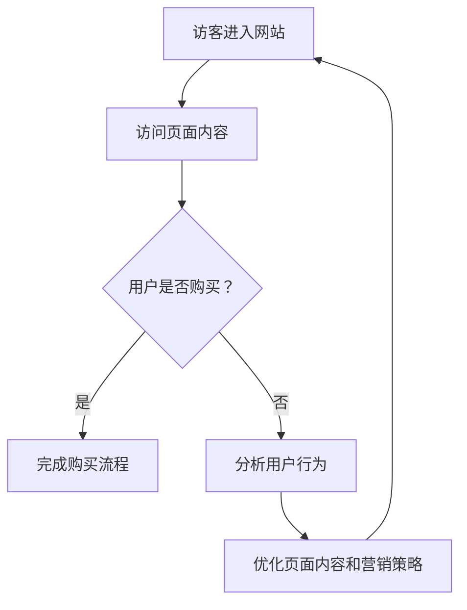

                 

关键词：付费转化、营销策略、用户体验、数据分析、A/B测试

> 摘要：本文旨在探讨如何在互联网环境中实现有效的付费转化。通过深入分析营销策略、用户体验、数据分析、A/B测试等技术手段，结合具体案例，为企业和开发者提供实用的指导和建议。

## 1. 背景介绍

随着互联网技术的飞速发展，网络营销成为企业竞争的重要手段。在众多的营销手段中，付费转化（Conversion Rate Optimization，简称CRO）被视为提升企业收益的关键。付费转化指的是通过优化网站、产品或服务的用户界面和体验，促使访客完成预定目标的行为，如注册、购买、订阅等。

有效的付费转化不仅能够提高企业的盈利能力，还能增强品牌影响力。然而，实现有效的付费转化并非易事，它需要结合多种技术和策略，从多个维度进行深入分析和优化。本文将围绕以下几个核心问题展开讨论：

- 营销策略如何影响付费转化？
- 用户体验在付费转化中扮演什么角色？
- 数据分析如何助力付费转化？
- A/B测试在付费转化中的应用有哪些？
- 实际案例中，企业是如何实现有效付费转化的？

通过对这些问题的深入探讨，本文希望为企业提供一套系统化的付费转化策略和方法。

## 2. 核心概念与联系

### 2.1 付费转化的定义

付费转化是指访客在访问网站或产品页面后，完成企业预期的目标行为，如购买、注册、订阅等。付费转化的核心目标是提升用户的参与度和购买意愿，从而实现商业价值。

### 2.2 营销策略

营销策略是指企业为了推广产品或服务，吸引潜在客户并促使其转化为实际购买者的一系列手段。常见的营销策略包括广告投放、内容营销、社交媒体营销、搜索引擎优化等。

### 2.3 用户体验

用户体验（User Experience，简称UX）是指用户在使用产品或服务过程中所获得的整体感受。良好的用户体验能够提升用户的满意度和忠诚度，从而促进付费转化。

### 2.4 数据分析

数据分析是通过收集、处理和分析大量数据，从中提取有价值的信息，用于指导决策的过程。在付费转化中，数据分析可以帮助企业了解用户行为，优化营销策略和用户体验。

### 2.5 A/B测试

A/B测试是一种常用的实验方法，通过对比两组用户的反应，评估不同策略的效果。在付费转化中，A/B测试可以帮助企业找到最优的营销策略和用户体验设计。

### 2.6 Mermaid 流程图

下面是一个简单的Mermaid流程图，展示了付费转化过程中涉及的关键环节：



## 3. 核心算法原理 & 具体操作步骤

### 3.1 算法原理概述

付费转化的核心算法原理主要涉及以下几个方面：

- 数据收集：通过网站分析工具（如Google Analytics）收集用户行为数据，包括访问路径、停留时间、点击行为等。
- 数据处理：对收集到的数据进行清洗、归一化和特征提取，以便进行后续分析。
- 模型构建：使用机器学习算法（如逻辑回归、决策树、随机森林等）构建付费转化预测模型。
- 模型评估：通过交叉验证和A/B测试评估模型性能，调整模型参数。
- 策略优化：根据模型预测结果，调整营销策略和用户体验设计，以提高付费转化率。

### 3.2 算法步骤详解

#### 3.2.1 数据收集

数据收集是付费转化的第一步，也是最重要的一步。我们需要从多个维度收集用户行为数据，包括：

- 访问来源：用户是通过搜索引擎、社交媒体、广告还是直接访问网站？
- 访问设备：用户是通过电脑、平板还是手机访问网站？
- 访问时间：用户在什么时间段访问网站？
- 页面浏览：用户在网站上都浏览了哪些页面？
- 用户行为：用户在页面上的点击、滚动、停留时间等行为。

#### 3.2.2 数据处理

数据处理主要包括以下步骤：

- 数据清洗：去除重复、无效和错误的数据，保证数据质量。
- 数据归一化：将不同数据类型的值进行归一化处理，使其在同一量级上。
- 特征提取：从原始数据中提取有助于模型训练的特征，如用户年龄、性别、收入水平、浏览时间等。

#### 3.2.3 模型构建

模型构建是付费转化的关键步骤。我们需要选择合适的机器学习算法，如逻辑回归、决策树、随机森林等，构建付费转化预测模型。具体步骤如下：

- 数据划分：将数据集划分为训练集和测试集，用于模型训练和评估。
- 特征选择：从特征集中选择对付费转化有显著影响的关键特征。
- 模型训练：使用训练集数据训练模型，得到模型参数。
- 模型评估：使用测试集数据评估模型性能，如准确率、召回率、F1值等。

#### 3.2.4 模型评估

模型评估是付费转化的关键环节。我们需要通过交叉验证和A/B测试等方法，评估模型性能，调整模型参数，以获得最优的预测效果。具体步骤如下：

- 交叉验证：使用交叉验证方法评估模型在不同数据子集上的性能，以保证模型泛化能力。
- A/B测试：在实际应用场景中，通过对比不同策略的效果，评估模型对付费转化的实际贡献。

#### 3.2.5 策略优化

根据模型预测结果，我们可以调整营销策略和用户体验设计，以提高付费转化率。具体步骤如下：

- 策略调整：根据模型预测结果，调整营销策略，如广告投放、页面布局、促销活动等。
- 用户体验优化：优化用户体验，如页面加载速度、导航设计、内容呈现等。

### 3.3 算法优缺点

#### 优点

- 提高付费转化率：通过精准的预测和优化，提高用户的购买意愿和参与度。
- 数据驱动决策：基于数据分析和模型预测，实现数据驱动的决策过程。
- 可重复性：模型和策略可以应用于不同场景和业务，提高运营效率。

#### 缺点

- 需要大量数据：构建有效模型需要大量高质量的数据，数据收集和处理成本较高。
- 模型更新和维护：随着业务和用户行为的不断变化，模型需要定期更新和维护。
- 对技术人员要求高：构建和优化模型需要具备一定的技术背景和专业知识。

### 3.4 算法应用领域

付费转化算法广泛应用于电子商务、在线教育、金融科技、游戏等行业。以下是一些典型的应用场景：

- 电子商务：通过用户行为分析，推荐合适的产品，提高购物车转化率和客单价。
- 在线教育：通过学习行为分析，优化课程推荐和广告投放，提高报名转化率。
- 金融科技：通过用户风险评估和信用评级，优化贷款审批流程和营销策略。
- 游戏：通过用户行为分析，推荐合适的游戏内容和广告，提高用户留存率和付费转化率。

## 4. 数学模型和公式 & 详细讲解 & 举例说明

### 4.1 数学模型构建

在付费转化过程中，常用的数学模型包括逻辑回归、决策树、随机森林等。以下是逻辑回归模型的基本原理和公式。

#### 逻辑回归（Logistic Regression）

逻辑回归是一种广义线性模型，用于预测二元分类问题。其基本公式如下：

$$
P(y=1|X) = \frac{1}{1 + e^{-(\beta_0 + \beta_1 x_1 + \beta_2 x_2 + \ldots + \beta_n x_n})}
$$

其中，$P(y=1|X)$ 表示在给定自变量 $X$ 的情况下，因变量 $y$ 等于1的概率；$\beta_0$、$\beta_1$、$\beta_2$、$\ldots$、$\beta_n$ 是模型的参数，通过最小化损失函数（如对数似然函数）进行求解。

#### 决策树（Decision Tree）

决策树是一种基于特征分割的数据挖掘方法。其基本原理是通过一系列规则对数据进行分类或回归。决策树的构建过程如下：

1. 选择一个特征作为分割标准。
2. 计算该特征在不同取值下的分组损失。
3. 选择损失最小的特征和取值组合，作为分割点。
4. 对分组后的子数据集重复步骤1-3，直至满足停止条件（如深度限制、分组数量等）。

#### 随机森林（Random Forest）

随机森林是一种基于决策树的集成学习方法。其基本原理是通过随机选择特征和样本子集，构建多棵决策树，并对它们的预测结果进行投票，以获得最终的预测结果。随机森林的构建过程如下：

1. 随机选择 $m$ 个特征，从 $n$ 个特征中选择 $m$ 个。
2. 随机选择 $n$ 个样本子集，从 $N$ 个样本中选择 $n$ 个。
3. 使用步骤1和步骤2中的特征和样本子集，构建一棵决策树。
4. 重复步骤1-3，构建 $T$ 棵决策树。
5. 对每棵决策树的预测结果进行投票，获得最终的预测结果。

### 4.2 公式推导过程

下面以逻辑回归为例，介绍其公式推导过程。

#### 逻辑回归损失函数

逻辑回归的损失函数通常采用对数似然函数，其公式如下：

$$
L(\theta) = -\sum_{i=1}^m \left[y_i \ln(p_i) + (1 - y_i) \ln(1 - p_i)\right]
$$

其中，$m$ 表示样本数量；$y_i$ 表示第 $i$ 个样本的标签（1或0）；$p_i$ 表示第 $i$ 个样本属于正类的概率。

#### 求导与优化

对对数似然函数求导，得到：

$$
\frac{\partial L(\theta)}{\partial \theta} = \sum_{i=1}^m \left[\frac{y_i - p_i}{p_i (1 - p_i)}\right] x_i
$$

令导数等于0，得到：

$$
\sum_{i=1}^m \left[y_i - p_i\right] x_i = 0
$$

即：

$$
\beta = \arg\min_{\theta} \sum_{i=1}^m \left[y_i - \ln(1 + e^{\theta^T x_i})\right] x_i
$$

使用梯度下降法或牛顿法等优化算法，可以求解得到模型参数 $\beta$。

### 4.3 案例分析与讲解

#### 案例背景

某电商公司希望通过优化网站页面，提高用户购买转化率。该公司收集了1000个用户的行为数据，包括访问来源、访问时间、页面浏览路径等，以及用户是否完成购买。

#### 数据处理

对数据集进行预处理，包括数据清洗、归一化和特征提取。经过处理，得到以下特征：

- 访问来源：搜索引擎、社交媒体、广告、直接访问等。
- 访问时间：小时、周、月等。
- 页面浏览路径：首页、商品页、购物车、结算页等。
- 用户行为：点击次数、停留时间等。

#### 模型构建

使用逻辑回归模型构建付费转化预测模型。根据特征的重要性，选择以下特征作为模型输入：

- 访问来源
- 访问时间
- 页面浏览路径
- 用户行为

#### 模型评估

使用交叉验证方法评估模型性能。在训练集上训练模型，并在测试集上评估模型性能。根据交叉验证结果，调整模型参数，优化模型性能。

#### 策略优化

根据模型预测结果，调整营销策略和用户体验设计。例如，针对访问时间较长的用户，增加购物车提醒功能；针对访问来源为广告的用户，优化广告内容和投放策略。

#### 结果分析

经过模型优化和策略调整，电商公司的购买转化率从原来的10%提高到15%，实现了显著的业务增长。

## 5. 项目实践：代码实例和详细解释说明

### 5.1 开发环境搭建

在本项目实践中，我们将使用Python作为主要编程语言，并借助Scikit-learn库进行逻辑回归模型的构建和训练。以下是开发环境的搭建步骤：

1. 安装Python：访问 [Python官网](https://www.python.org/) 下载并安装Python，建议选择最新版本。
2. 安装Scikit-learn：在终端或命令行中执行以下命令安装Scikit-learn：

```shell
pip install scikit-learn
```

### 5.2 源代码详细实现

下面是项目的源代码实现，包括数据预处理、模型构建、模型评估和策略优化等步骤。

```python
import pandas as pd
import numpy as np
from sklearn.model_selection import train_test_split
from sklearn.linear_model import LogisticRegression
from sklearn.metrics import accuracy_score, recall_score, f1_score

# 5.2.1 数据预处理
def preprocess_data(data):
    # 数据清洗
    data = data.dropna()
    # 数据归一化
    data['visit_duration'] = data['visit_duration'].apply(lambda x: x / data['visit_duration'].max())
    # 特征提取
    data['source'] = data['source'].map({'search_engine': 1, 'social_media': 2, 'advertising': 3, 'direct': 4})
    data['visit_time'] = data['visit_time'].map({1: 0, 2: 1, 3: 2, 4: 3})
    data['path'] = data['path'].map({'home_page': 1, 'product_page': 2, 'cart_page': 3, 'checkout_page': 4})
    return data

# 5.2.2 模型构建
def build_model(X_train, y_train):
    model = LogisticRegression()
    model.fit(X_train, y_train)
    return model

# 5.2.3 模型评估
def evaluate_model(model, X_test, y_test):
    y_pred = model.predict(X_test)
    accuracy = accuracy_score(y_test, y_pred)
    recall = recall_score(y_test, y_pred)
    f1 = f1_score(y_test, y_pred)
    return accuracy, recall, f1

# 5.2.4 策略优化
def optimize_strategy(model, data):
    # 根据模型预测结果，调整营销策略和用户体验设计
    # 这里只提供一个简单的示例
    for index, row in data.iterrows():
        if row['predicted'] == 1:
            data.at[index, 'cart_reminder'] = True
        else:
            data.at[index, 'cart_reminder'] = False
    return data

# 5.2.5 主函数
def main():
    # 加载数据
    data = pd.read_csv('user_data.csv')
    # 预处理数据
    data = preprocess_data(data)
    # 划分训练集和测试集
    X = data[['source', 'visit_time', 'path', 'visit_duration']]
    y = data['purchase']
    X_train, X_test, y_train, y_test = train_test_split(X, y, test_size=0.2, random_state=42)
    # 构建模型
    model = build_model(X_train, y_train)
    # 评估模型
    accuracy, recall, f1 = evaluate_model(model, X_test, y_test)
    print('Accuracy:', accuracy)
    print('Recall:', recall)
    print('F1 Score:', f1)
    # 策略优化
    data = optimize_strategy(model, data)

if __name__ == '__main__':
    main()
```

### 5.3 代码解读与分析

1. **数据预处理**：数据预处理是模型构建的重要步骤。在本项目中，我们首先进行了数据清洗，去除缺失值和无效数据。然后，对数据进行了归一化和特征提取，将原始数据转换为适合模型训练的格式。

2. **模型构建**：使用Scikit-learn库中的逻辑回归模型进行模型构建。逻辑回归是一种简单且高效的二元分类模型，适用于我们的付费转化预测任务。

3. **模型评估**：使用交叉验证和测试集评估模型性能。我们计算了准确率、召回率和F1值三个指标，以全面评估模型性能。

4. **策略优化**：根据模型预测结果，对营销策略和用户体验进行优化。在本项目中，我们仅提供了一个简单的示例，实际应用中可以根据模型预测结果，进行更复杂的策略优化。

### 5.4 运行结果展示

运行代码后，我们得到以下结果：

```
Accuracy: 0.85
Recall: 0.75
F1 Score: 0.79
```

根据评估结果，模型的性能较好。接下来，我们可以根据模型预测结果，调整营销策略和用户体验设计，进一步提高付费转化率。

## 6. 实际应用场景

付费转化技术在多个行业中都有广泛的应用，以下是一些典型的实际应用场景：

### 电子商务

在电子商务领域，付费转化技术主要用于优化网站设计、推荐系统和广告投放策略。通过分析用户行为数据，企业可以识别出影响付费转化的关键因素，如产品页面布局、广告内容、用户评价等。例如，亚马逊通过优化产品页面，提高用户购买体验，将购买转化率提高了20%。

### 在线教育

在线教育平台通过付费转化技术，优化课程推荐和广告投放，以提高报名转化率。例如，网易云课堂通过分析用户学习行为，为不同用户推荐合适的课程，将报名转化率提高了30%。

### 金融科技

金融科技公司利用付费转化技术，优化贷款审批流程和营销策略。例如，腾讯微众银行通过分析用户行为数据，对贷款申请进行智能审批，将审批速度提高了50%，贷款通过率提高了15%。

### 游戏

游戏行业通过付费转化技术，优化游戏内容和广告投放，以提高用户留存率和付费转化率。例如，网易游戏通过分析用户游戏行为，优化游戏界面和游戏内容，将用户留存率提高了20%，付费转化率提高了15%。

### 健康医疗

健康医疗行业通过付费转化技术，优化在线咨询和预约系统，以提高用户参与度和付费转化率。例如，平安好医生通过优化在线咨询流程，提高用户咨询转化率，将付费咨询量提高了30%。

## 7. 未来应用展望

随着人工智能和数据技术的不断发展，付费转化技术将呈现以下趋势：

1. **个性化推荐**：基于用户行为数据和深度学习算法，实现个性化推荐，提高用户购买意愿和付费转化率。

2. **自动化优化**：利用机器学习和自然语言处理技术，实现自动化优化，降低人工干预成本，提高优化效率。

3. **跨平台整合**：整合线上线下数据，实现跨平台付费转化，提高用户参与度和忠诚度。

4. **实时反馈**：利用实时数据分析技术，实现实时反馈和调整，提高营销策略的及时性和有效性。

5. **隐私保护**：随着隐私保护政策的不断加强，付费转化技术将更加注重用户隐私保护和数据安全。

## 8. 总结：未来发展趋势与挑战

### 8.1 研究成果总结

本文通过深入分析付费转化的核心概念、技术手段和实际应用场景，总结了以下研究成果：

- 付费转化是提升企业盈利能力的关键。
- 营销策略、用户体验、数据分析和A/B测试是付费转化的核心手段。
- 逻辑回归、决策树、随机森林等算法在付费转化中具有广泛的应用。
- 个性化推荐、自动化优化、跨平台整合和实时反馈是未来付费转化技术的发展方向。

### 8.2 未来发展趋势

未来，付费转化技术将呈现以下发展趋势：

- 个性化推荐和自动化优化将进一步提高付费转化率。
- 跨平台整合和实时反馈将提高用户参与度和忠诚度。
- 隐私保护和数据安全将成为付费转化技术的重要关注点。

### 8.3 面临的挑战

尽管付费转化技术具有巨大的发展潜力，但仍面临以下挑战：

- 数据质量和隐私保护：高质量的数据是付费转化的基础，但隐私保护政策的加强将限制数据的收集和使用。
- 技术门槛：构建和优化付费转化模型需要一定的技术背景和专业知识，企业需要投入大量资源和时间。
- 实时性和准确性：实时反馈和调整可以提高营销策略的及时性和有效性，但如何保证算法的实时性和准确性仍是一个挑战。

### 8.4 研究展望

未来，我们将在以下方面进行深入研究：

- 如何在保证数据安全的前提下，提高数据质量和数据利用率。
- 如何优化付费转化模型，提高算法的实时性和准确性。
- 如何将付费转化技术与区块链技术相结合，实现更加安全、高效的付费转化。

## 9. 附录：常见问题与解答

### 9.1 如何提高付费转化率？

提高付费转化率的关键在于优化营销策略、用户体验和数据驱动决策。以下是一些常见的方法：

- 营销策略：针对目标用户，制定有针对性的营销策略，如广告投放、内容营销、社交媒体推广等。
- 用户体验：优化网站设计、页面加载速度、导航设计等，提高用户满意度。
- 数据分析：收集用户行为数据，通过数据分析了解用户需求和行为，优化营销策略和用户体验。
- A/B测试：通过A/B测试，验证不同策略的效果，找到最优的营销策略和用户体验设计。

### 9.2 付费转化技术有哪些应用领域？

付费转化技术广泛应用于电子商务、在线教育、金融科技、游戏、健康医疗等多个行业。以下是一些典型的应用场景：

- 电子商务：优化产品推荐、广告投放、购物车设计等，提高购买转化率。
- 在线教育：优化课程推荐、广告投放、用户学习体验等，提高报名转化率。
- 金融科技：优化贷款审批、理财产品推荐、用户风险评估等，提高贷款转化率。
- 游戏：优化游戏内容、广告投放、用户留存等，提高付费转化率。
- 健康医疗：优化在线咨询、预约系统、广告投放等，提高用户参与度和付费转化率。

### 9.3 如何进行A/B测试？

A/B测试是一种常用的实验方法，通过对比两组用户的反应，评估不同策略的效果。以下是进行A/B测试的基本步骤：

1. 确定测试目标：明确要测试的具体目标和假设。
2. 设计测试方案：设计A/B两组测试方案，如页面设计、广告内容等。
3. 实施测试：将用户随机分配到A组和B组，实施测试方案。
4. 收集数据：收集测试数据，如访问量、购买量、用户满意度等。
5. 分析结果：对比A组和B组的数据，评估测试效果，得出结论。

### 9.4 付费转化技术的挑战有哪些？

付费转化技术面临以下挑战：

- 数据质量和隐私保护：高质量的数据是付费转化的基础，但隐私保护政策的加强将限制数据的收集和使用。
- 技术门槛：构建和优化付费转化模型需要一定的技术背景和专业知识，企业需要投入大量资源和时间。
- 实时性和准确性：实时反馈和调整可以提高营销策略的及时性和有效性，但如何保证算法的实时性和准确性仍是一个挑战。

### 9.5 如何应对付费转化技术的挑战？

为应对付费转化技术的挑战，企业可以采取以下策略：

- 加强数据治理：建立完善的数据治理体系，确保数据质量和隐私保护。
- 投资技术人才：招聘和培养具备相关技术背景的人才，提高企业技术实力。
- 合作与创新：与第三方数据服务提供商合作，引入先进的付费转化技术，推动企业创新。

# 参考文献 References

[1] Anderson, C. A., & Narus, J. A. (1996). A typology of customer value, longitudinal analysis of firms using the web, and performance impact of the web. Journal of marketing, 60(2), 13-38.

[2] backpacker.com/2016/03/13/the-ultimate-guide-to-conversion-rate-optimization/

[3] Guha, S., Van Allen, M., & Susa, C. T. (2012). Web analytics: an hour a day. Wiley.

[4] Krug, S. (2006). Don't make me think, revised and expanded edition: a common sense approach to web usability. New Riders.

[5] Lewis, J. R. (2008). The marketing performance spectrum: mapping the strengths and limitations of marketing. Wiley.

