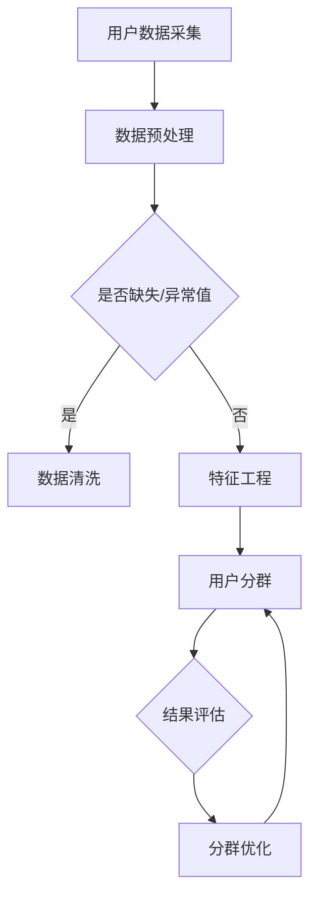

                 

  
> 关键词：用户分群，数据分析，用户行为，机器学习，营销策略

> 摘要：本文探讨了如何在信息技术领域中有效地进行用户分群管理。通过详细阐述用户分群的核心概念、算法原理、数学模型及其在实际项目中的应用，为营销策略和用户体验优化提供科学依据。

## 1. 背景介绍

用户分群（User Segmentation）是市场营销和用户体验优化中的重要策略之一。通过将用户群体根据特定的属性和行为特征进行划分，企业可以更精准地满足不同用户的需求，从而提高用户满意度和忠诚度。随着大数据和机器学习技术的发展，用户分群方法逐渐从传统的统计方法演变为复杂的算法模型，提高了分群的精度和效率。

然而，用户分群管理并非易事。一方面，用户数据来源多样、数据质量参差不齐，给数据分析带来了挑战；另一方面，分群模型的选择和参数调优对最终结果影响显著，需要丰富的理论和实践经验。本文将深入探讨如何进行有效的用户分群管理，为企业和开发者提供实用的指导。

## 2. 核心概念与联系

### 2.1 用户分群的核心概念

用户分群涉及多个核心概念，包括用户特征（User Attributes）、行为特征（Behavioral Attributes）、用户标签（User Tags）等。用户特征通常包括用户的年龄、性别、地理位置、职业等；行为特征则涵盖用户的浏览习惯、购买行为、互动行为等。用户标签是对用户属性和行为特征的综合描述，用于指导分群过程。

### 2.2 用户分群的方法

用户分群的方法可以分为三类：基于规则的分群、基于统计学的分群和基于机器学习的分群。

#### 基于规则的分群

基于规则的分群是最简单的一种方法，通过定义一系列规则来划分用户群体。例如，根据年龄和收入将用户分为“高端用户”、“中端用户”和“低端用户”。这种方法直观、易于理解，但灵活性较差，难以应对复杂多变的用户行为。

#### 基于统计学的分群

基于统计学的分群利用统计学方法，如聚类分析、因子分析等，对用户特征进行分组。这种方法能发现用户之间的潜在联系，但需要大量的数据和复杂的模型。

#### 基于机器学习的分群

基于机器学习的分群通过训练机器学习模型，自动对用户进行分类。这种方法具有高度的自适应性和灵活性，但需要大量的数据和高超的模型调优技巧。

### 2.3 用户分群与数据分析的关系

用户分群是数据分析中的重要环节，通过对用户数据的挖掘和分析，可以识别出有价值的用户群体，为产品和营销策略提供支持。同时，用户分群结果也为后续的数据分析提供了方向和参考。

### 2.4 用户分群架构的 Mermaid 流程图



## 3. 核心算法原理 & 具体操作步骤

### 3.1 算法原理概述

用户分群的核心算法包括K-means、层次聚类、基于密度的聚类等。其中，K-means算法是最常用的方法之一，它通过迭代计算，将用户数据划分成K个簇，每个簇内的用户相似度较高，簇间差异较大。

### 3.2 算法步骤详解

#### 3.2.1 数据预处理

1. 数据采集：从各种渠道（如网站、App、CRM系统等）收集用户数据。
2. 数据清洗：处理缺失值、异常值等，保证数据质量。

#### 3.2.2 特征工程

1. 特征选择：选择对用户分群有重要影响的特征，如年龄、收入、浏览时长等。
2. 特征转换：对数值特征进行标准化或归一化，对类别特征进行编码。

#### 3.2.3 K-means算法

1. 初始化：随机选择K个初始中心点。
2. 分配：计算每个用户到各个中心点的距离，将用户分配到距离最近的中心点所在的簇。
3. 更新：计算每个簇的新中心点，重复分配和更新步骤，直到中心点不再发生显著变化。

#### 3.2.4 结果评估

1. 内部评估：计算簇内相似度和簇间差异，如轮廓系数（Silhouette Coefficient）。
2. 外部评估：将分群结果与实际业务目标（如转化率、客户价值等）进行对比，如调整聚类数目或模型参数。

### 3.3 算法优缺点

#### 优点

1. 算法简单，易于实现和调参。
2. 能处理大量数据，适用于大规模用户分群。
3. 自适应性强，可根据业务需求调整聚类数目。

#### 缺点

1. 对初始中心点的选择敏感，可能导致局部最优解。
2. 假设簇为球形，可能导致簇形状不规则的聚类问题。
3. 需要提前指定簇的数目K，而K的选择往往具有主观性。

### 3.4 算法应用领域

用户分群算法广泛应用于市场营销、用户体验优化、风险控制等多个领域。例如，在市场营销中，企业可以根据用户分群结果制定个性化的营销策略；在用户体验优化中，企业可以根据用户行为特征优化产品功能和界面设计。

## 4. 数学模型和公式 & 详细讲解 & 举例说明

### 4.1 数学模型构建

用户分群的核心数学模型是K-means算法。其目标是最小化簇内用户之间的距离平方和，即：

$$
J = \sum_{i=1}^{n}\sum_{x\in S_i} \| x - \mu_i \|^2
$$

其中，$n$ 是用户数量，$S_i$ 是第 $i$ 个簇中的用户集合，$\mu_i$ 是第 $i$ 个簇的中心点。

### 4.2 公式推导过程

#### 4.2.1 初始中心点选择

随机选择K个用户作为初始中心点，$x_1, x_2, ..., x_K$。

#### 4.2.2 用户分配

计算每个用户$x$到各个中心点的距离：

$$
d(x, \mu_i) = \| x - \mu_i \|^2
$$

将用户$x$分配到距离最近的中心点所在的簇：

$$
S_i = \{ x | d(x, \mu_i) \leq d(x, \mu_j) \forall j \neq i \}
$$

#### 4.2.3 更新中心点

计算每个簇的新中心点：

$$
\mu_i = \frac{1}{|S_i|} \sum_{x\in S_i} x
$$

#### 4.2.4 迭代过程

重复用户分配和中心点更新步骤，直到中心点不再发生显著变化。

### 4.3 案例分析与讲解

#### 案例背景

某电商公司希望通过用户分群来优化营销策略，提高转化率和客户价值。公司拥有以下用户数据：

- 年龄：[18, 30], [31, 45], [46, 60]
- 收入：[低], [中], [高]
- 购买行为：[活跃], [一般], [不活跃]

#### 案例步骤

1. 数据预处理：清洗用户数据，处理缺失值和异常值。
2. 特征工程：选择年龄、收入和购买行为作为用户特征。
3. K-means算法：选择K=3，初始化3个中心点，进行用户分配和中心点更新。
4. 结果评估：计算轮廓系数，评估分群效果。

#### 案例结果

经过多次迭代，最终得到以下3个用户簇：

- 簇1：年龄18-30，收入中，购买行为活跃
- 簇2：年龄31-45，收入低，购买行为一般
- 簇3：年龄46-60，收入高，购买行为不活跃

#### 案例分析

根据分群结果，公司可以制定以下个性化营销策略：

- 簇1：针对年轻、收入中、购买行为活跃的用户，推出优惠活动、新品推荐等，提高转化率。
- 簇2：针对中年、收入低、购买行为一般的用户，推出优惠券、满减活动等，提高客户价值。
- 簇3：针对老年、收入高、购买行为不活跃的用户，推出定制化产品、个性化服务，提高客户满意度。

## 5. 项目实践：代码实例和详细解释说明

### 5.1 开发环境搭建

1. 安装Python环境
2. 安装NumPy、Pandas、Scikit-learn等库

### 5.2 源代码详细实现

```python
import numpy as np
import pandas as pd
from sklearn.cluster import KMeans
from sklearn.metrics import silhouette_score

# 数据加载和处理
data = pd.read_csv('user_data.csv')
data.dropna(inplace=True)

# 特征工程
features = data[['age', 'income', 'purchase Behavior']]
features_scaled = (features - features.mean()) / features.std()

# K-means算法
kmeans = KMeans(n_clusters=3, random_state=42)
kmeans.fit(features_scaled)
labels = kmeans.predict(features_scaled)

# 结果评估
silhouette_avg = silhouette_score(features_scaled, labels)
print('轮廓系数：', silhouette_avg)

# 结果输出
print('分群结果：', labels)
```

### 5.3 代码解读与分析

1. 数据加载和处理：使用Pandas读取用户数据，并处理缺失值。
2. 特征工程：选择年龄、收入和购买行为作为用户特征，并进行标准化处理。
3. K-means算法：使用Scikit-learn库实现K-means算法，设置聚类数目为3，随机种子为42。
4. 结果评估：计算轮廓系数，评估分群效果。
5. 结果输出：输出分群结果。

## 6. 实际应用场景

用户分群管理在实际应用中具有广泛的场景，以下是几个典型应用：

### 6.1 市场营销

企业可以根据用户分群结果，制定个性化的营销策略，提高用户转化率和忠诚度。例如，针对不同分群的用户，发送定制化的优惠券、推荐商品等。

### 6.2 用户体验优化

通过用户分群，企业可以识别出有价值的用户群体，优化产品功能和界面设计，提高用户体验。例如，针对不同分群的用户，调整页面布局、功能模块等。

### 6.3 风险控制

金融机构可以通过用户分群，识别出高风险用户群体，实施针对性的风险控制措施，降低风险。例如，对高风险用户进行严格的信用评估、监控等。

### 6.4 未来应用展望

随着人工智能和大数据技术的发展，用户分群管理将越来越智能化和自动化。未来，企业可以结合用户行为数据、社交网络数据等多维度数据，构建更加精准和动态的分群模型，为业务发展提供有力支持。

## 7. 工具和资源推荐

### 7.1 学习资源推荐

- 《用户画像：基于大数据的市场营销技术》
- 《机器学习：概率视角》
- 《Python数据分析》

### 7.2 开发工具推荐

- Jupyter Notebook：用于编写和运行Python代码。
- Pandas：用于数据处理和清洗。
- Scikit-learn：用于机器学习算法实现。

### 7.3 相关论文推荐

- "User Segmentation in Marketing: A Review and Framework"  
- "K-means Clustering: A Review"  
- "Application of Machine Learning in User Segmentation for Personalized Marketing"

## 8. 总结：未来发展趋势与挑战

### 8.1 研究成果总结

本文总结了用户分群管理的基本概念、算法原理、数学模型和实际应用，为企业和开发者提供了有效的指导。

### 8.2 未来发展趋势

随着人工智能和大数据技术的发展，用户分群管理将更加智能化和自动化，分群精度和效率将得到显著提升。

### 8.3 面临的挑战

用户分群管理面临的主要挑战包括数据质量、模型选择和参数调优等。未来研究需要解决这些问题，提高用户分群管理的实用性和可靠性。

### 8.4 研究展望

未来研究可以重点关注以下几个方面：

- 发展新的用户分群算法，提高分群精度和效率。
- 结合多维度数据，构建更加精准和动态的分群模型。
- 探索用户分群在更多领域的应用，如医疗、金融等。

## 9. 附录：常见问题与解答

### 9.1 用户分群与用户画像的区别？

用户分群是将用户按照特定属性和行为特征进行分组，而用户画像是对单个用户的全方位描述。用户分群关注群体特征，而用户画像关注个体特征。

### 9.2 如何选择合适的用户分群算法？

根据数据规模、特征类型和业务需求选择合适的算法。例如，对于大规模数据，可以选择K-means等高效算法；对于复杂特征，可以选择基于模型的算法。

### 9.3 用户分群结果如何评估？

可以使用轮廓系数、簇内相似度、簇间差异等指标评估用户分群结果。同时，可以将分群结果与实际业务目标（如转化率、客户价值等）进行对比，判断分群效果。

----------------------------------------------------------------

作者：禅与计算机程序设计艺术 / Zen and the Art of Computer Programming


