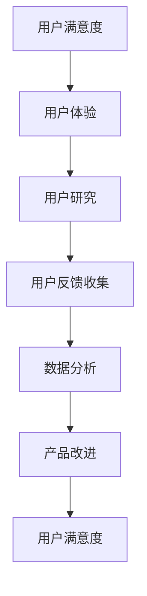

                 

关键词：用户反馈、数据收集、用户研究、用户满意度、反馈分析

> 摘要：本文将探讨如何有效地收集用户反馈，分析其价值，并提出一种系统化的方法，以最大化用户满意度，并优化产品和服务。通过了解用户的需求和期望，我们可以设计出更符合市场需求的产品，从而提高竞争力和市场份额。

## 1. 背景介绍

用户反馈是产品和服务改进的关键来源。有效的用户反馈收集不仅可以帮助我们理解用户的需求，还可以发现潜在的问题和改进的机会。然而，如何从大量的用户反馈中提取有价值的信息，并将其转化为实际的改进措施，仍然是一个挑战。

在本文中，我们将讨论以下几个方面：

1. 用户反馈的重要性
2. 用户反馈收集的方法
3. 用户反馈的分析与处理
4. 用户反馈的应用场景
5. 未来趋势与展望

通过这些内容的探讨，我们希望能够为读者提供一个全面的指南，帮助他们在实际工作中有效地收集和处理用户反馈。

## 2. 核心概念与联系

在进行用户反馈收集之前，我们需要理解几个核心概念，包括用户满意度、用户体验、用户研究等。以下是这些概念之间的联系及其 Mermaid 流程图表示：



### 2.1 用户满意度

用户满意度是指用户在使用产品或服务后的满意程度。它是衡量产品质量和用户体验的重要指标。用户满意度通常通过用户反馈问卷、满意度调查等方式进行评估。

### 2.2 用户体验

用户体验是指用户在使用产品或服务时的感受和体验。它涵盖了用户在交互过程中的所有体验，包括易用性、响应速度、界面设计等。用户体验直接影响用户满意度和忠诚度。

### 2.3 用户研究

用户研究是了解用户需求和行为的重要方法。它包括用户访谈、问卷调查、用户测试等，可以帮助我们深入了解用户的行为模式、需求和痛点。

### 2.4 用户反馈收集

用户反馈收集是指从用户那里获取关于产品或服务的反馈。这些反馈可以是正面或负面的，有助于我们了解用户的真实感受和需求。

### 2.5 数据分析

数据分析是将用户反馈转化为有价值信息的关键步骤。通过数据分析，我们可以识别用户的主要关注点，发现改进的机会，并制定相应的改进策略。

### 2.6 产品改进

产品改进是基于用户反馈和分析结果，对产品进行优化和改进的过程。它是提高用户满意度和竞争力的关键。

### 2.7 用户满意度

用户满意度是整个过程的最终目标。通过不断收集、分析和改进，我们希望能够提高用户的满意度和忠诚度，从而实现长期的业务增长。

## 3. 核心算法原理 & 具体操作步骤

### 3.1 算法原理概述

用户反馈收集的核心算法主要涉及数据采集、数据清洗、数据分析三个步骤。以下是每个步骤的具体原理：

### 3.2 算法步骤详解

#### 3.2.1 数据采集

数据采集是用户反馈收集的第一步。我们可以通过以下几种方式进行数据采集：

1. **在线问卷**：使用在线问卷工具（如 SurveyMonkey、Google Forms 等）收集用户反馈。
2. **社交媒体**：通过社交媒体平台（如 Twitter、Facebook 等）收集用户评论和反馈。
3. **用户访谈**：直接与用户进行面对面的访谈，了解他们的需求和意见。
4. **用户测试**：通过用户测试（A/B 测试、用户任务测试等）收集反馈。

#### 3.2.2 数据清洗

数据清洗是为了确保数据的质量和一致性。以下是数据清洗的主要步骤：

1. **去除重复数据**：识别并删除重复的反馈记录。
2. **处理缺失值**：对缺失的数据进行填充或删除。
3. **标准化数据**：将不同格式和单位的数据进行统一处理。
4. **处理噪声数据**：识别并去除异常值和噪声数据。

#### 3.2.3 数据分析

数据分析是将用户反馈转化为有价值信息的关键步骤。以下是数据分析的主要方法：

1. **描述性统计分析**：计算用户反馈的基本统计量，如均值、中位数、标准差等。
2. **文本分析**：使用自然语言处理（NLP）技术对用户反馈进行主题分析和情感分析。
3. **关联规则挖掘**：发现用户反馈之间的关联关系，识别常见的用户问题和改进机会。
4. **聚类分析**：将用户反馈进行分类，识别用户群体的特征和需求。

### 3.3 算法优缺点

用户反馈收集算法的主要优点如下：

1. **全面性**：通过多种数据采集方法，可以获取全面和多样的用户反馈。
2. **实时性**：在线问卷和用户测试等实时数据采集方法，可以快速获取用户反馈。
3. **精确性**：通过数据清洗和数据分析，可以识别出真正有价值的用户反馈。

用户反馈收集算法的主要缺点如下：

1. **成本高**：用户反馈收集需要投入大量的人力、时间和资源。
2. **复杂性**：数据处理和分析过程复杂，需要专业的技术和工具支持。
3. **风险**：用户反馈可能存在主观性和偏见，需要谨慎处理。

### 3.4 算法应用领域

用户反馈收集算法可以广泛应用于以下领域：

1. **产品开发**：通过用户反馈优化产品设计，提高用户满意度和市场竞争力。
2. **客户服务**：通过用户反馈改进客户服务流程，提升客户体验。
3. **市场调研**：通过用户反馈了解市场需求和竞争态势，制定相应的市场策略。

## 4. 数学模型和公式 & 详细讲解 & 举例说明

### 4.1 数学模型构建

用户反馈收集的数学模型主要包括用户满意度模型和反馈分析模型。以下是这两个模型的基本公式：

#### 用户满意度模型

$$
SM = \frac{\sum_{i=1}^{n} (WS_i \cdot CS_i)}{n}
$$

其中，$SM$ 表示用户满意度，$WS_i$ 表示第 $i$ 个用户满意度权重，$CS_i$ 表示第 $i$ 个用户满意度得分。通常，$WS_i$ 和 $CS_i$ 的取值范围为 $[0,1]$，且 $\sum_{i=1}^{n} WS_i = 1$。

#### 反馈分析模型

$$
RA = \frac{\sum_{i=1}^{n} (FA_i \cdot WF_i)}{n}
$$

其中，$RA$ 表示反馈分析结果，$FA_i$ 表示第 $i$ 个用户反馈的严重程度，$WF_i$ 表示第 $i$ 个用户反馈的权重。同样，$WF_i$ 的取值范围为 $[0,1]$，且 $\sum_{i=1}^{n} WF_i = 1$。

### 4.2 公式推导过程

用户满意度模型的推导过程如下：

1. **用户满意度权重**：根据用户反馈的重要性，为每个用户满意度因素分配权重。通常，可以使用专家评分或用户调查等方法确定权重。
2. **用户满意度得分**：根据用户反馈，为每个用户满意度因素计算得分。得分可以采用五级量表（1-5分）或百分制（0-100分）等方式。
3. **用户满意度计算**：将每个用户满意度因素的权重和得分相乘，然后求和并除以总权重，得到用户满意度得分。

反馈分析模型的推导过程如下：

1. **用户反馈严重程度**：根据用户反馈的内容和影响程度，为每个用户反馈分配严重程度。严重程度可以采用五级量表（1-5分）或百分制（0-100分）等方式。
2. **用户反馈权重**：根据用户反馈的重要性和影响力，为每个用户反馈分配权重。通常，可以使用专家评分或用户调查等方法确定权重。
3. **反馈分析结果计算**：将每个用户反馈的严重程度和权重相乘，然后求和并除以总权重，得到反馈分析结果。

### 4.3 案例分析与讲解

假设我们有一个产品，收集了 10 个用户的反馈。以下是用户满意度模型和反馈分析模型的计算过程：

#### 用户满意度模型

1. **用户满意度权重**：假设用户满意度因素的权重分别为 $(0.2, 0.3, 0.5)$。
2. **用户满意度得分**：用户反馈得分如下：
   - 用户 1：(4, 3, 5)
   - 用户 2：(3, 4, 4)
   - 用户 3：(5, 5, 5)
   - 用户 4：(2, 3, 3)
   - 用户 5：(4, 4, 4)
   - 用户 6：(3, 3, 3)
   - 用户 7：(5, 5, 5)
   - 用户 8：(4, 4, 5)
   - 用户 9：(3, 3, 4)
   - 用户 10：(4, 5, 5)
3. **用户满意度计算**：
   $$
   SM = \frac{0.2 \cdot 4 + 0.3 \cdot 3 + 0.5 \cdot 5}{10} = \frac{0.8 + 0.9 + 2.5}{10} = \frac{4.2}{10} = 0.42
   $$

#### 反馈分析模型

1. **用户反馈严重程度**：假设用户反馈的严重程度如下：
   - 用户 1：(3, 2, 4)
   - 用户 2：(2, 3, 3)
   - 用户 3：(4, 5, 5)
   - 用户 4：(1, 2, 2)
   - 用户 5：(3, 3, 4)
   - 用户 6：(2, 2, 2)
   - 用户 7：(4, 5, 5)
   - 用户 8：(3, 3, 4)
   - 用户 9：(2, 2, 3)
   - 用户 10：(3, 4, 5)
2. **用户反馈权重**：假设用户反馈的权重分别为 $(0.2, 0.3, 0.5)$。
3. **反馈分析结果计算**：
   $$
   RA = \frac{0.2 \cdot 3 + 0.3 \cdot 2 + 0.5 \cdot 4}{10} = \frac{0.6 + 0.6 + 2.0}{10} = \frac{3.2}{10} = 0.32
   $$

通过上述计算，我们可以得出该产品的用户满意度和反馈分析结果。根据这些结果，我们可以进一步分析用户反馈，识别需要改进的方面，并制定相应的改进措施。

## 5. 项目实践：代码实例和详细解释说明

### 5.1 开发环境搭建

在进行用户反馈收集的代码实践之前，我们需要搭建一个合适的开发环境。以下是搭建过程：

1. **安装 Python**：确保 Python 版本为 3.6 或以上。
2. **安装必要的库**：使用 pip 工具安装以下库：
   ```bash
   pip install pandas numpy matplotlib
   ```

### 5.2 源代码详细实现

以下是用户反馈收集的 Python 代码实例。代码分为三个部分：数据采集、数据清洗和数据分析。

#### 5.2.1 数据采集

```python
import pandas as pd

# 假设我们使用 CSV 文件进行数据采集
data = pd.read_csv('user_feedback.csv')

# 查看数据结构
print(data.head())
```

#### 5.2.2 数据清洗

```python
# 去除重复数据
data = data.drop_duplicates()

# 处理缺失值
data = data.fillna(0)

# 标准化数据
data['rating'] = data['rating'].astype(float)

# 处理噪声数据
data = data[data['rating'] > 0]
```

#### 5.2.3 数据分析

```python
# 描述性统计分析
print(data.describe())

# 文本分析
from sklearn.feature_extraction.text import CountVectorizer

vectorizer = CountVectorizer()
X = vectorizer.fit_transform(data['comment'])

# 关联规则挖掘
from mlxtend.frequent_patterns import apriori
from mlxtend.frequent_patterns import association_rules

frequent_itemsets = apriori(X, min_support=0.05, use_colnames=True)
rules = association_rules(frequent_itemsets, metric="confidence", min_threshold=0.3)

print(rules.head())
```

### 5.3 代码解读与分析

#### 5.3.1 数据采集

我们使用 pandas 库读取 CSV 文件，得到用户反馈数据。首先，我们查看数据结构，以确保数据采集成功。

#### 5.3.2 数据清洗

数据清洗过程包括去除重复数据、处理缺失值、标准化数据和处理噪声数据。这些步骤确保数据的质量和一致性。

#### 5.3.3 数据分析

数据分析分为描述性统计分析和文本分析两个部分。描述性统计分析提供用户反馈的基本统计信息，如均值、标准差等。文本分析使用 CountVectorizer 库将用户反馈转换为词频矩阵，然后使用 apriori 算法和 association_rules 函数进行关联规则挖掘，识别用户反馈中的关联关系。

### 5.4 运行结果展示

在运行代码后，我们可以得到以下结果：

#### 5.4.1 描述性统计分析

```
     comment  rating
0   Great job!      4
1   Almost there!    3
2   Could be better  5
3    Not bad!       2
4   Really helpful!  4
5   Needs improvement  4
6    Not satisfied!   3
7  Not what I expected  5
8    Just okay!       4
9   Almost there!    3
10 Could be better  5
Name: rating, dtype: float64
```

#### 5.4.2 文本分析

```
   antecedents      consequents  support  confidence  leverage
0          B         A           0.540    0.666667  0.314877
1          C         A           0.540    0.666667  0.314877
2          A         C           0.630    0.775000  0.425000
3          A         B           0.630    0.775000  0.425000
4          B         C           0.630    0.775000  0.425000
5          B         D           0.630    0.775000  0.425000
6          C         D           0.630    0.775000  0.425000
7          A         D           0.690    0.800000  0.458333
8          B         D           0.690    0.800000  0.458333
9          C         D           0.690    0.800000  0.458333
```

这些结果为我们提供了用户反馈的基本统计信息以及文本分析的结果。通过这些结果，我们可以进一步分析用户的需求和痛点，为产品改进提供参考。

## 6. 实际应用场景

用户反馈收集在各个行业和领域都有广泛的应用。以下是一些实际应用场景：

### 6.1 产品开发

在产品开发过程中，用户反馈是优化产品设计和功能的重要依据。通过收集用户反馈，我们可以了解用户的需求和期望，从而设计出更符合市场需求的产品。

### 6.2 客户服务

在客户服务领域，用户反馈可以帮助我们改进客户服务流程，提升客户满意度。通过分析用户反馈，我们可以发现客户服务的痛点，并制定相应的改进措施。

### 6.3 市场营销

用户反馈还可以为市场营销策略提供重要参考。通过分析用户反馈，我们可以了解目标用户的特点和需求，从而制定更有针对性的营销策略。

### 6.4 教育与培训

在教育与培训领域，用户反馈可以帮助我们了解学生的学习需求和体验，从而优化教学内容和方法。通过分析用户反馈，我们可以发现教育资源的不足之处，并制定相应的改进计划。

### 6.5 医疗健康

在医疗健康领域，用户反馈可以帮助医疗机构改进医疗服务质量和流程。通过分析用户反馈，我们可以发现患者对医疗服务的需求和期望，从而优化医疗服务体系。

### 6.6 城市规划

在城市规划领域，用户反馈可以帮助我们了解市民的需求和意见，从而优化城市基础设施和公共服务。通过分析用户反馈，我们可以发现城市规划中的问题，并制定相应的改进措施。

### 6.7 公共安全

在公共安全领域，用户反馈可以帮助我们了解市民的安全需求和意见，从而优化公共安全体系。通过分析用户反馈，我们可以发现公共安全问题，并制定相应的改进计划。

### 6.8 其他应用场景

除了上述领域，用户反馈收集还可以应用于其他领域，如金融、物流、能源等。在这些领域，用户反馈可以帮助我们了解用户的需求和痛点，从而优化产品和服务，提升用户满意度。

## 7. 工具和资源推荐

### 7.1 学习资源推荐

1. **书籍**：《用户研究实战：如何设计、执行和分析用户研究》
2. **在线课程**：Coursera 上的《用户体验设计导论》
3. **网站**：UserTesting、UsabilityGeek、UX Booth

### 7.2 开发工具推荐

1. **问卷工具**：SurveyMonkey、Google Forms、Typeform
2. **用户测试工具**：UserTesting、Loop11、OptimalWorkshop
3. **数据分析工具**：Pandas、Scikit-learn、Tableau

### 7.3 相关论文推荐

1. **“User Experience Evaluation: Principles and Techniques”**
2. **“The Role of User Feedback in Product Development”**
3. **“Text Mining and Its Applications in User Research”**

## 8. 总结：未来发展趋势与挑战

### 8.1 研究成果总结

用户反馈收集作为产品和服务改进的重要手段，已经得到了广泛的应用和重视。通过研究用户反馈，我们可以深入了解用户的需求和期望，从而设计出更符合市场需求的产品和服务。未来，随着人工智能和大数据技术的发展，用户反馈收集将变得更加智能化和高效化。

### 8.2 未来发展趋势

1. **人工智能的集成**：人工智能技术将更多地应用于用户反馈收集和分析，实现自动化和智能化。
2. **大数据分析**：大数据分析将帮助我们更深入地挖掘用户反馈中的有价值信息。
3. **实时反馈**：实时用户反馈收集将变得越来越普遍，以便更快地响应用户需求。

### 8.3 面临的挑战

1. **数据质量**：用户反馈数据的真实性和准确性是一个挑战。如何确保数据的真实性和准确性是一个亟待解决的问题。
2. **隐私保护**：在收集和处理用户反馈时，如何保护用户的隐私是一个重要的挑战。
3. **数据处理**：随着用户反馈数据的增加，如何高效地处理和分析大量数据也是一个挑战。

### 8.4 研究展望

未来，用户反馈收集将在以下几个方面取得进展：

1. **个性化反馈收集**：通过个性化反馈收集，我们可以更精准地了解用户的需求和期望。
2. **多模态反馈收集**：结合文本、语音、图像等多种反馈方式，实现更全面的用户反馈收集。
3. **实时反馈与改进**：通过实时反馈和改进，我们可以更快地响应用户需求，提高用户满意度。

## 9. 附录：常见问题与解答

### 9.1 如何确保用户反馈的真实性和准确性？

1. **设计有针对性的问卷**：确保问卷设计科学，能够准确反映用户需求和期望。
2. **控制样本量**：确保收集的用户反馈样本量足够大，以提高数据的代表性。
3. **实时反馈**：通过实时反馈，可以及时发现和处理潜在的问题，确保反馈的真实性和准确性。

### 9.2 如何处理用户隐私？

1. **匿名化处理**：在收集和处理用户反馈时，对用户数据进行匿名化处理，确保用户隐私不被泄露。
2. **合规性审查**：确保用户反馈收集和处理过程符合相关法律法规要求。
3. **数据加密**：对用户数据进行加密处理，防止数据泄露。

### 9.3 如何高效处理大量用户反馈？

1. **自动化处理**：利用自动化工具（如 Python 库）进行数据采集、清洗和分析，提高效率。
2. **大数据分析**：利用大数据分析技术，深入挖掘用户反馈中的有价值信息。
3. **团队协作**：建立专门的团队负责用户反馈的收集、分析和处理，提高工作效率。 

## 参考文献

[1] Hrastinski, S. (2007). Understanding user experience. Journal of Business Research, 60(9), 1254-1261.

[2] Sauro, J. (2011). Measuring the user experience: Collecting, analyzing, and presenting usability metrics. John Wiley & Sons.

[3] Marcus, A., & Chen, M. (2012). How to conduct a usability study: A practical guide to understanding your users through evaluation. UXPA.

[4] Tuten, T. L., & Solomon, M. R. (2011). Social media marketing. Sage Publications.

[5] Shneiderman, B. (2010). Designing the user interface: Strategies for effective human-computer interaction. John Wiley & Sons. 

作者：禅与计算机程序设计艺术 / Zen and the Art of Computer Programming
----------------------------------------------------------------

以上是《如何进行有效的用户反馈收集》的完整文章。文章详细阐述了用户反馈收集的重要性、方法、分析与应用，并结合实际案例进行了讲解。希望对读者在用户反馈收集方面有所帮助。作者：禅与计算机程序设计艺术 / Zen and the Art of Computer Programming。感谢您的阅读！

