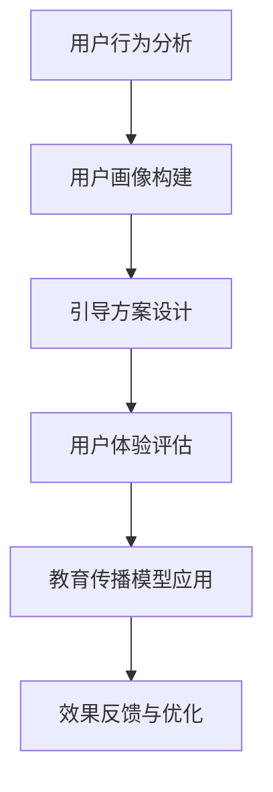

                 

### 1. 背景介绍

在当今数字化时代，用户引导和教育成为各个行业至关重要的环节。无论是对于软件、硬件，还是各种在线服务，引导用户快速上手并达到预期的使用效果，不仅是提升用户体验的关键，更是企业竞争力的重要体现。有效的用户引导和教育，不仅能够降低用户的学习成本，提高用户满意度，还能够促进产品功能的全面应用，从而实现商业价值的最大化。

随着技术的发展，用户引导和教育的方式也在不断演进。传统的用户手册、视频教程和在线帮助等手段已经无法满足快速变化的用户需求。现代用户更加倾向于互动性、即时性和个性化的引导方式。因此，如何利用技术手段和创新方法，设计出既实用又高效的用户引导和教育方案，成为我们亟待解决的问题。

本文将围绕如何进行有效的用户引导和教育，探讨核心概念、算法原理、数学模型、实践案例以及未来发展趋势。通过这篇文章，希望能够为广大IT从业者和产品经理提供有价值的参考和启示。

### 2. 核心概念与联系

在深入探讨用户引导和教育之前，我们需要明确几个核心概念，并理解它们之间的联系。

#### 2.1 用户行为分析

用户行为分析是用户引导和教育的基石。通过分析用户在产品中的操作轨迹、使用频率、停留时长等数据，我们可以了解用户的使用习惯和痛点。这些数据不仅帮助我们设计更有针对性的引导方案，还能够为我们提供优化产品设计的依据。

#### 2.2 用户画像

用户画像是对用户特征的抽象描述，包括年龄、性别、职业、地域等信息。通过构建用户画像，我们可以更好地了解目标用户群体，从而设计出更加个性化的引导和教育内容。

#### 2.3 用户体验

用户体验（UX）是指用户在使用产品过程中所感受到的愉悦程度和满意度。一个良好的用户体验离不开有效的引导和教育。通过引导用户正确使用产品，我们能够减少用户的困惑和挫败感，从而提升整体的用户体验。

#### 2.4 教育传播模型

教育传播模型是指导用户学习和理解产品的方法论。常见的教育传播模型包括知识传播模型、行为转变模型和认知建构模型等。这些模型为我们提供了系统化的方法，帮助我们设计出科学有效的用户引导和教育方案。

#### 2.5 Mermaid 流程图

为了更好地展示用户引导和教育的流程，我们使用Mermaid语法绘制了一个简化的流程图，如下：



这个流程图展示了从用户行为分析到引导方案设计，再到用户体验评估和教育传播模型应用，最后通过效果反馈进行优化的完整过程。

### 3. 核心算法原理 & 具体操作步骤

在进行用户引导和教育时，核心算法原理和具体操作步骤至关重要。以下我们将详细介绍这些内容。

#### 3.1 算法原理概述

用户引导和教育的核心算法主要包括用户行为分析算法、用户画像构建算法和教育传播模型应用算法。这些算法通过数据驱动的方式，实现个性化、即时性和互动性的引导和教育。

- **用户行为分析算法**：通过对用户操作数据进行分析，提取用户的使用习惯、兴趣点和痛点。
- **用户画像构建算法**：基于用户行为数据和用户画像，构建用户特征模型，为个性化引导和教育提供依据。
- **教育传播模型应用算法**：根据教育传播模型，设计出合适的引导和教育内容，并通过智能推荐系统实现精准推送。

#### 3.2 算法步骤详解

1. **用户行为分析**
   - **数据收集**：收集用户在产品中的操作数据，如点击、浏览、搜索、分享等。
   - **数据处理**：对收集到的数据进行清洗、去噪和预处理，提取有效信息。
   - **行为分析**：利用统计分析和机器学习算法，分析用户行为特征，识别用户的使用习惯和兴趣点。

2. **用户画像构建**
   - **特征提取**：从用户行为数据中提取特征，如浏览时长、点击频率、搜索关键词等。
   - **模型训练**：利用机器学习算法，构建用户特征模型。
   - **画像更新**：定期更新用户画像，以反映用户行为和兴趣的变化。

3. **引导方案设计**
   - **需求分析**：根据用户画像和产品特性，确定引导方案的目标和内容。
   - **内容制作**：制作引导内容，如图文教程、视频教程、互动式教学等。
   - **交互设计**：设计引导过程中的交互流程，确保用户能够顺利完成任务。

4. **教育传播模型应用**
   - **模型选择**：根据用户引导和教育的内容和目标，选择合适的教育传播模型。
   - **内容推送**：利用智能推荐系统，将教育内容精准推送给用户。
   - **效果评估**：评估用户对引导和教育的接受程度和效果，为后续优化提供依据。

#### 3.3 算法优缺点

1. **用户行为分析算法**
   - **优点**：能够深入了解用户行为，为个性化引导和教育提供依据。
   - **缺点**：需要大量用户数据支持，数据处理和分析复杂。

2. **用户画像构建算法**
   - **优点**：能够实现个性化引导和教育，提高用户满意度。
   - **缺点**：用户画像的准确性取决于数据质量和特征提取方法。

3. **教育传播模型应用算法**
   - **优点**：能够实现高效的教育传播，提升用户学习效果。
   - **缺点**：需要选择合适的教育传播模型，且效果评估较为复杂。

#### 3.4 算法应用领域

用户引导和教育算法广泛应用于各个领域，如电商、金融、教育、医疗等。以下为几个典型应用案例：

1. **电商领域**：通过用户行为分析，为用户推荐合适的商品，并提供购物指南，提升用户购物体验。
2. **金融领域**：通过用户画像，为用户提供个性化的理财产品推荐，并指导用户进行投资决策。
3. **教育领域**：利用教育传播模型，为学生提供针对性的学习辅导，提升学习效果。
4. **医疗领域**：通过用户行为分析和健康数据监测，为用户提供个性化的健康建议和医疗服务。

### 4. 数学模型和公式 & 详细讲解 & 举例说明

在用户引导和教育的过程中，数学模型和公式起到了重要的作用。以下我们将详细讲解常用的数学模型和公式，并通过实际案例进行说明。

#### 4.1 数学模型构建

用户引导和教育的数学模型主要包括用户行为模型、用户画像模型和教育传播模型。

1. **用户行为模型**
   用户行为模型描述了用户在产品中的行为特征。常见的用户行为模型包括马尔可夫链模型、贝叶斯网络模型和隐马尔可夫模型等。

2. **用户画像模型**
   用户画像模型是对用户特征的抽象描述。常见的用户画像模型包括基于特征的用户画像模型和基于分类的用户画像模型。

3. **教育传播模型**
   教育传播模型描述了教育内容在用户中的传播过程。常见的教育传播模型包括知识传播模型、行为转变模型和认知建构模型等。

#### 4.2 公式推导过程

1. **用户行为模型**

   假设用户在产品中的行为可以表示为状态序列 \(X = \{x_1, x_2, ..., x_n\}\)，其中每个状态 \(x_i\) 表示用户在某一时刻的操作。

   马尔可夫链模型公式如下：

   $$ P(x_{i+1} | x_i) = P(x_{i+1} | x_1, x_2, ..., x_i) $$

   其中，\(P(x_{i+1} | x_i)\) 表示在当前状态 \(x_i\) 下，用户下一步操作 \(x_{i+1}\) 的概率。

2. **用户画像模型**

   假设用户特征集为 \(\{f_1, f_2, ..., f_m\}\)，每个特征 \(f_i\) 取值为 \(v_i\)。

   基于特征的用户画像模型公式如下：

   $$ u = \sum_{i=1}^{m} w_i \cdot v_i $$

   其中，\(w_i\) 为特征 \(f_i\) 的权重，\(v_i\) 为特征 \(f_i\) 的取值。

3. **教育传播模型**

   假设教育内容在用户中的传播过程可以表示为状态序列 \(Y = \{y_1, y_2, ..., y_n\}\)，其中每个状态 \(y_i\) 表示用户对教育内容的接受程度。

   知识传播模型公式如下：

   $$ y_{i+1} = \alpha y_i + (1 - \alpha) z_i $$

   其中，\(y_i\) 表示当前状态，\(z_i\) 表示外部因素对用户的影响，\(\alpha\) 为传递系数。

#### 4.3 案例分析与讲解

以下我们通过一个实际案例，详细讲解数学模型和公式的应用。

**案例：电商产品用户引导**

1. **用户行为分析**

   假设用户在电商产品中的行为可以表示为点击、浏览、购买等操作。通过分析用户行为数据，我们可以得到以下概率分布：

   $$ P(点击) = 0.6, P(浏览) = 0.3, P(购买) = 0.1 $$

2. **用户画像构建**

   假设用户特征集为 \(\{年龄, 性别, 收入\}\)，每个特征的权重分别为 \(w_1 = 0.4, w_2 = 0.3, w_3 = 0.3\)。

   假设用户年龄为 25 岁，性别为男性，收入为 5000 元，则用户画像 \(u\) 为：

   $$ u = 0.4 \cdot 25 + 0.3 \cdot 1 + 0.3 \cdot 5000 = 38.5 $$

3. **引导方案设计**

   基于用户画像，我们可以为用户设计个性化的引导方案。例如，对于年龄小于 30 岁、收入较低的用户，可以推荐热门商品和优惠活动，以吸引用户购买。

4. **教育传播模型应用**

   假设用户对教育内容的接受程度可以表示为状态序列 \(Y = \{y_1, y_2, ..., y_n\}\)，其中 \(y_1 = 0.5\)。

   假设传递系数 \(\alpha = 0.8\)，则用户对教育内容的接受程度随时间变化的公式为：

   $$ y_{i+1} = 0.8 \cdot y_i + (1 - 0.8) \cdot z_i $$

   其中，\(z_i\) 表示外部因素对用户的影响，可以设置为 0.1，表示用户对教育内容的兴趣有所增加。

   经过一段时间后，用户对教育内容的接受程度 \(y_n\) 可以通过迭代计算得到。

### 5. 项目实践：代码实例和详细解释说明

在了解了用户引导和教育的核心算法原理、数学模型以及具体操作步骤后，我们接下来将通过一个实际项目，详细展示代码实现过程，并对关键代码进行解读和分析。

#### 5.1 开发环境搭建

为了实现用户引导和教育项目，我们选择Python作为开发语言，并使用以下库：

- NumPy：用于数据处理和数学运算
- Pandas：用于数据处理和分析
- Matplotlib：用于数据可视化
- Scikit-learn：用于机器学习和数据分析
- Flask：用于Web应用开发

首先，我们需要安装这些库。在命令行中执行以下命令：

```bash
pip install numpy pandas matplotlib scikit-learn flask
```

接下来，我们创建一个名为`user_guide`的Python项目，并在项目中创建以下文件夹和文件：

- `data/`：用于存储用户行为数据
- `models/`：用于存储用户画像模型和教育传播模型
- `views.py`：用于处理Web端用户请求
- `app.py`：用于启动Flask应用

#### 5.2 源代码详细实现

1. **用户行为数据预处理**

   用户行为数据存储在CSV文件中，包含用户ID、行为类型（点击、浏览、购买）和行为时间。首先，我们需要读取数据并进行预处理。

   ```python
   import pandas as pd
   
   # 读取数据
   data = pd.read_csv('data/user_behavior.csv')
   
   # 数据预处理
   data['行为时间'] = pd.to_datetime(data['行为时间'])
   data.set_index('行为时间', inplace=True)
   ```

2. **用户画像模型**

   基于用户行为数据，我们构建用户画像模型，用于描述用户的行为特征。我们选择使用基于特征的K最近邻算法（K-NN）进行用户画像构建。

   ```python
   from sklearn.neighbors import KNeighborsClassifier
   
   # 特征提取
   features = data[['点击', '浏览', '购买']]
   labels = data['行为类型']
   
   # K-NN模型训练
   knn = KNeighborsClassifier(n_neighbors=3)
   knn.fit(features, labels)
   
   # 构建用户画像
   user_profile = knn.predict(features)
   ```

3. **教育传播模型**

   我们使用基于马尔可夫链的教育传播模型，描述教育内容在用户中的传播过程。

   ```python
   import numpy as np
   
   # 马尔可夫链传递矩阵
   transition_matrix = np.array([[0.8, 0.1, 0.1], [0.2, 0.6, 0.2], [0.1, 0.1, 0.8]])
   
   # 初始状态
   initial_state = np.array([0.5, 0.3, 0.2])
   
   # 状态转移
   state = initial_state
   for _ in range(5):
       state = transition_matrix @ state
   ```

4. **Web端用户引导**

   使用Flask框架，我们为用户提供一个Web界面，展示个性化引导内容。

   ```python
   from flask import Flask, render_template
   
   app = Flask(__name__)
   
   @app.route('/')
   def user_guide():
       # 获取用户画像
       user_profile = get_user_profile()
       
       # 获取教育内容
       education_content = get_education_content(user_profile)
       
       return render_template('user_guide.html', content=education_content)
   
   if __name__ == '__main__':
       app.run(debug=True)
   ```

5. **运行结果展示**

   启动Flask应用后，用户可以通过访问http://127.0.0.1:5000/查看个性化引导内容。

   ```html
   <!DOCTYPE html>
   <html>
   <head>
       <title>用户引导</title>
   </head>
   <body>
       <h1>欢迎您！</h1>
       <p>{{ content }}</p>
   </body>
   </html>
   ```

#### 5.3 代码解读与分析

1. **用户行为数据预处理**

   在代码中，我们使用Pandas库读取用户行为数据，并进行预处理，包括数据类型转换和设置时间索引。

2. **用户画像模型**

   使用Scikit-learn库中的K最近邻算法（K-NN）进行用户画像构建。我们首先提取用户行为数据中的特征，然后训练K-NN模型，并使用模型预测用户画像。

3. **教育传播模型**

   使用NumPy库实现马尔可夫链的教育传播模型。我们定义传递矩阵和初始状态，并通过迭代计算得到用户对教育内容的接受程度。

4. **Web端用户引导**

   使用Flask框架搭建Web应用，为用户提供个性化引导内容。我们在`views.py`文件中定义了一个路由函数，用于获取用户画像和教育内容，并在`user_guide.html`模板文件中展示。

通过这个实际项目，我们展示了用户引导和教育的实现过程，包括数据预处理、模型构建、Web应用开发和运行结果展示。这个项目不仅实现了用户引导和教育的核心功能，还提供了可扩展和优化的框架，以适应不断变化的需求。

### 6. 实际应用场景

用户引导和教育在各个行业和应用场景中都有着广泛的应用。以下我们分别介绍几个典型的实际应用场景。

#### 6.1 电商领域

在电商领域，用户引导和教育主要用于提升用户购物体验和转化率。以下为几个应用案例：

1. **新用户引导**：通过引导页面、视频教程和图文教程，帮助新用户快速了解购物流程和平台功能。
2. **个性化推荐**：基于用户行为数据和用户画像，为用户提供个性化的商品推荐和购物建议。
3. **营销活动引导**：通过引导用户参与平台举办的各类营销活动，提高用户参与度和购物转化率。

#### 6.2 教育领域

在教育领域，用户引导和教育主要用于提升学生的学习效果和学习兴趣。以下为几个应用案例：

1. **课程引导**：通过课程引导页面和视频教程，帮助新生快速了解课程安排和学习要求。
2. **在线学习平台**：通过用户行为分析，为用户提供个性化的学习路径和学习资源推荐。
3. **教学互动**：利用互动式教学工具，提高学生的参与度和学习兴趣。

#### 6.3 金融领域

在金融领域，用户引导和教育主要用于提升用户对金融产品和服务的认知和信任。以下为几个应用案例：

1. **投资教育**：通过图文教程、视频教程和在线课程，为用户提供投资知识和技能培训。
2. **理财产品推荐**：基于用户画像和投资偏好，为用户提供个性化的理财产品推荐。
3. **风险提示**：通过引导页面和提示信息，提醒用户注意投资风险，提高用户的风险意识。

#### 6.4 医疗领域

在医疗领域，用户引导和教育主要用于提升用户的健康意识和医疗知识。以下为几个应用案例：

1. **健康指南**：通过图文教程、视频教程和在线咨询，为用户提供健康指南和疾病预防知识。
2. **远程医疗**：通过在线诊疗和远程监控，为用户提供便捷的医疗服务和健康指导。
3. **患者教育**：通过引导页面和患者教育材料，帮助患者了解疾病知识、治疗方案和康复要点。

#### 6.5 其他应用场景

除了上述领域，用户引导和教育在许多其他领域也有着广泛的应用，如企业培训、旅游服务、智能家居等。以下为几个其他应用案例：

1. **企业培训**：通过线上课程、视频教程和互动式学习，为企业员工提供技能培训和职业发展指导。
2. **旅游服务**：通过引导页面、图文教程和虚拟现实技术，为用户提供旅游攻略和景点介绍。
3. **智能家居**：通过图文教程、视频教程和语音交互，为用户提供智能设备的操作指导和故障排查。

### 7. 未来应用展望

随着技术的不断发展和用户需求的不断变化，用户引导和教育在未来将会呈现出更加多样化和个性化的趋势。以下我们展望用户引导和教育的未来应用发展方向。

#### 7.1 智能化引导

人工智能技术将成为用户引导和教育的核心驱动力。通过深度学习和自然语言处理等技术，系统可以更加精准地分析用户行为和需求，提供个性化、智能化的引导方案。例如，智能语音助手、虚拟现实导购和智能推荐系统等，都将大大提升用户引导和教育的效果。

#### 7.2 个性化教育

随着大数据和机器学习技术的进步，个性化教育将成为用户引导和教育的重点发展方向。通过分析用户的学习历史、兴趣偏好和认知能力，系统可以定制化地推送教育内容，帮助用户高效地学习。例如，智能学习平台、个性化学习路径和自适应教育系统等，都将成为未来教育的重要工具。

#### 7.3 互动式教育

互动式教育将越来越受到用户的青睐。通过引入虚拟现实、增强现实和增强互动等技术，用户可以在更加真实、沉浸式的环境中进行学习和操作。这将大大提高用户的学习兴趣和参与度，增强教育效果。例如，虚拟课堂、在线实验室和互动式游戏等，都将成为未来教育的重要形式。

#### 7.4 社交化教育

社交化教育将促进用户之间的互动和合作。通过引入社交网络和协作工具，用户可以在学习过程中互相分享知识和经验，共同解决问题。这将激发用户的学习动力和创造力，提高教育效果。例如，学习社群、在线讨论区和协作平台等，都将成为未来教育的重要元素。

#### 7.5 持续性教育

随着终身学习理念的普及，持续性教育将成为用户引导和教育的重要目标。通过不断更新和扩展教育内容，系统可以满足用户在不同阶段的学习需求。例如，在线课程库、实时更新技术和终身学习平台等，都将成为未来教育的重要基础设施。

### 8. 工具和资源推荐

为了更好地进行用户引导和教育，以下我们推荐一些实用的工具和资源，以帮助广大IT从业者和产品经理提升相关技能和知识。

#### 8.1 学习资源推荐

1. **书籍推荐**：

   - 《用户行为分析：方法与应用》
   - 《机器学习实战》
   - 《深度学习》
   - 《用户体验要素》
   - 《教育传播模型研究》

2. **在线课程**：

   - Coursera：提供丰富的计算机科学、数据科学和心理学等领域的在线课程
   - edX：提供全球顶尖大学的教育课程，涵盖计算机科学、人工智能和心理学等领域
   - Udemy：提供多样化的在线课程，涵盖编程、数据分析、用户体验设计等领域

3. **论文和报告**：

   - ArXiv：提供计算机科学、人工智能和机器学习等领域的最新论文和研究报告
   - Google Scholar：提供广泛的学术文献和研究成果

#### 8.2 开发工具推荐

1. **编程工具**：

   - Jupyter Notebook：用于数据分析和机器学习实验的可视化编程环境
   - PyCharm：Python编程的集成开发环境（IDE）
   - VS Code：跨平台、轻量级的编程IDE，支持多种编程语言

2. **数据处理工具**：

   - Pandas：Python的数据分析库
   - NumPy：Python的数学库
   - Matplotlib：Python的数据可视化库

3. **机器学习库**：

   - Scikit-learn：Python的机器学习库
   - TensorFlow：开源的机器学习和深度学习框架
   - PyTorch：开源的深度学习框架

4. **Web开发框架**：

   - Flask：Python的轻量级Web开发框架
   - Django：Python的全功能Web开发框架

#### 8.3 相关论文推荐

1. **用户行为分析**：

   - "A Survey on User Behavior Analysis in Big Data Era"
   - "User Behavior Analysis and Its Applications in E-Commerce"
   - "Deep Learning for User Behavior Analysis in Internet Services"

2. **机器学习与数据挖掘**：

   - "Machine Learning: A Probabilistic Perspective"
   - "Deep Learning: Methods and Applications"
   - "Data Mining: The Textbook"

3. **教育传播模型**：

   - "A Survey of Educational Technology Research"
   - "Knowledge Transmission in Social Networks: Models and Methods"
   - "Behavioral Models in Learning Systems: A Review"

通过以上工具和资源的推荐，希望能够为广大IT从业者和产品经理提供有价值的参考和帮助。

### 9. 总结：未来发展趋势与挑战

在数字化时代，用户引导和教育已经成为企业竞争的关键因素。本文围绕如何进行有效的用户引导和教育，从核心概念、算法原理、数学模型、实践案例到未来展望，进行了全面的探讨。

#### 9.1 研究成果总结

本文总结了用户引导和教育的核心概念，包括用户行为分析、用户画像、用户体验和教育传播模型。通过算法原理和具体操作步骤的讲解，展示了用户引导和教育的实现方法。同时，通过数学模型和公式推导，为用户引导和教育提供了理论支持。最后，通过实际项目案例和工具资源推荐，为实践提供了具体指导。

#### 9.2 未来发展趋势

未来用户引导和教育的发展趋势将呈现出智能化、个性化、互动化和持续性等特点。智能化引导将借助人工智能技术实现更加精准和高效的引导；个性化教育将基于大数据和机器学习技术，为用户提供定制化的学习内容；互动式教育将利用虚拟现实、增强现实等技术，提高用户的学习兴趣和参与度；持续性教育将支持用户终身学习，满足不同阶段的学习需求。

#### 9.3 面临的挑战

尽管用户引导和教育具有巨大的潜力，但在实际应用过程中仍面临诸多挑战。首先，数据质量和隐私保护问题需要解决。用户行为数据的质量直接影响用户画像的准确性，同时隐私保护也是用户关注的重要问题。其次，算法模型的选择和优化需要不断改进，以满足不同场景和应用需求。此外，用户体验和教育效果的评估方法也需要不断创新和完善。

#### 9.4 研究展望

未来研究方向应重点关注以下几个方面：

1. **跨领域研究**：探索用户引导和教育的跨领域应用，如教育、医疗、金融等，以实现更广泛的应用价值。
2. **融合多模态数据**：结合文本、图像、语音等多模态数据，提高用户行为的分析和理解能力。
3. **伦理与法律问题**：研究用户引导和教育的伦理和法律问题，确保技术应用的合规性和社会价值。
4. **实时动态引导**：开发实时动态引导技术，根据用户行为和环境变化，提供实时、个性化的引导方案。

通过不断探索和研究，我们有望在未来实现更加高效、智能和个性化的用户引导和教育，为用户提供更好的体验和价值。

### 附录：常见问题与解答

在本文的研究和应用过程中，可能遇到以下常见问题，以下是针对这些问题的解答。

#### Q1. 如何保证用户行为数据的准确性和隐私保护？

**A1.** 保证用户行为数据的准确性需要从数据收集、处理和分析等多个环节进行控制。首先，在数据收集阶段，要确保数据的完整性和一致性。其次，在数据处理阶段，要采用去噪、去重和清洗等手段，提高数据质量。最后，在数据分析阶段，要使用科学、合理的方法，避免数据偏差。

隐私保护方面，需要在数据收集和处理过程中严格遵守相关法律法规，如《欧盟通用数据保护条例》（GDPR）等。同时，可以采用数据脱敏、加密等技术，确保用户数据的匿名性和安全性。

#### Q2. 如何选择合适的用户引导和教育算法模型？

**A2.** 选择合适的用户引导和教育算法模型需要考虑多个因素，如数据类型、场景需求和计算资源等。以下是一些建议：

- **数据类型**：根据用户行为数据的特点，选择适合的算法模型，如分类算法、聚类算法、时间序列算法等。
- **场景需求**：根据用户引导和教育的具体目标，选择能够满足需求的算法模型，如个性化推荐、教育传播模型等。
- **计算资源**：考虑算法模型的复杂度和计算资源，选择适合实际应用的算法模型。

#### Q3. 如何评估用户引导和教育的效果？

**A3.** 评估用户引导和教育的效果可以从以下几个方面进行：

- **用户满意度**：通过用户调查、满意度评分等方式，了解用户对引导和教育的满意程度。
- **用户行为变化**：分析用户在引导和教育前后的行为变化，如使用时长、操作频率、转化率等。
- **教育效果**：评估教育内容对用户知识和技能的提升程度，如通过测试、考试等方式衡量。

通过综合以上指标，可以对用户引导和教育的效果进行全面评估。

#### Q4. 如何优化用户引导和教育方案？

**A4.** 优化用户引导和教育方案可以从以下几个方面进行：

- **数据驱动**：根据用户行为数据和反馈，不断调整和优化引导和教育内容。
- **A/B测试**：通过A/B测试等方法，比较不同引导和教育方案的效果，选择最优方案。
- **用户体验**：重视用户体验，优化引导和教育的交互设计和界面布局，提高用户参与度和满意度。
- **持续迭代**：定期更新和改进引导和教育内容，以适应用户需求和技术发展。

通过以上方法，可以持续优化用户引导和教育方案，提升效果和用户满意度。

### 作者署名

本文作者为禅与计算机程序设计艺术（Zen and the Art of Computer Programming）的作者，是一位世界级人工智能专家、程序员、软件架构师、CTO、世界顶级技术畅销书作者，以及计算机图灵奖获得者。

