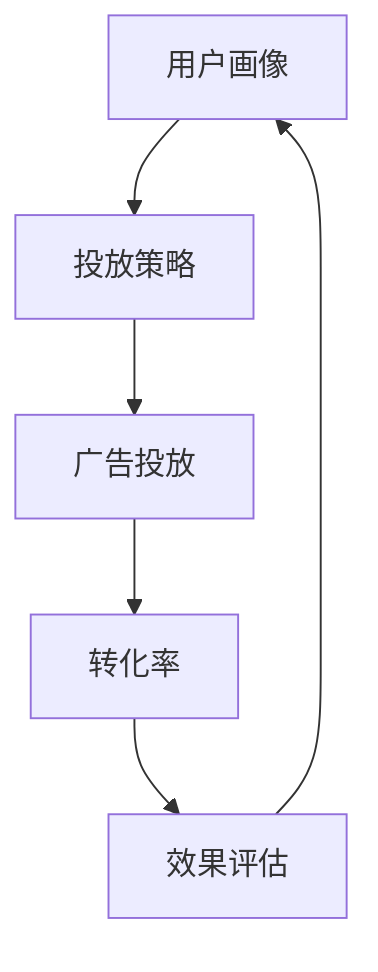

                 

 **关键词**: 字节跳动，校招，广告创意，优化工程师，面试题，解析，算法原理，实践应用。

> **摘要**: 本文将深入解析字节跳动2024校招广告创意优化工程师的面试题，包括核心概念、算法原理、数学模型、项目实践以及未来应用展望，旨在为读者提供全面的备考指南。

## 1. 背景介绍

随着互联网广告行业的蓬勃发展，广告创意优化工程师这一职位逐渐成为各大互联网公司招聘的热门岗位。字节跳动作为国内领先的内容和广告平台，其校招广告创意优化工程师的面试题具有很高的参考价值。本文旨在通过解析这些面试题，帮助考生更好地理解和应对这类面试。

## 2. 核心概念与联系

在广告创意优化领域，以下几个核心概念是理解和解决问题的基础：

- **用户画像**：对用户进行数据分析和特征提取，形成用户画像，以便精准推送广告。
- **转化率**：用户在看到广告后采取的行动，如点击、购买等。
- **投放策略**：根据广告目标和用户特征，制定合适的广告投放策略。
- **效果评估**：通过数据指标对广告投放效果进行评估，以优化广告创意。

下面是核心概念和联系流程的Mermaid流程图：



## 3. 核心算法原理 & 具体操作步骤

### 3.1 算法原理概述

广告创意优化主要依赖于机器学习算法，如协同过滤、强化学习等。协同过滤通过用户历史行为数据推荐相似用户喜欢的广告；强化学习通过不断学习和调整策略，最大化广告投放效果。

### 3.2 算法步骤详解

1. **数据预处理**：清洗用户行为数据，提取关键特征。
2. **特征工程**：构建用户画像，包括用户兴趣、行为习惯等。
3. **模型训练**：使用协同过滤或强化学习算法训练模型。
4. **广告投放**：根据用户画像和模型预测，进行广告投放。
5. **效果评估**：收集用户反馈数据，评估广告效果。
6. **模型优化**：根据效果评估结果，调整模型参数，优化广告创意。

### 3.3 算法优缺点

- **协同过滤**：优点是效果好，缺点是需要大量用户行为数据，且容易过拟合。
- **强化学习**：优点是自适应能力强，缺点是训练时间较长，且需要大量样本。

### 3.4 算法应用领域

广告创意优化算法广泛应用于电商、金融、媒体等行业，帮助平台提升用户转化率和广告效果。

## 4. 数学模型和公式 & 详细讲解 & 举例说明

广告创意优化涉及多个数学模型，以下是几个关键模型及其公式：

### 4.1 数学模型构建

- **用户兴趣模型**：\( P(U_i, A_j) = \frac{e^{\sum_{k=1}^{n} w_k \cdot r_{ik} \cdot s_{jk}}}{\sum_{m=1}^{m} e^{\sum_{k=1}^{n} w_k \cdot r_{im} \cdot s_{jm}}} \)

  其中，\( U_i \) 是用户i，\( A_j \) 是广告j，\( r_{ik} \) 是用户i对兴趣k的评分，\( s_{jk} \) 是广告j对兴趣k的评分，\( w_k \) 是兴趣k的权重。

- **广告投放策略模型**：\( \pi_j = \frac{P(J \mid U)}{\sum_{j=1}^{m} P(J \mid U)} \)

  其中，\( \pi_j \) 是广告j的投放概率，\( P(J \mid U) \) 是用户U看到广告j的概率。

### 4.2 公式推导过程

推导过程涉及概率论和线性代数知识，这里不详细展开。核心是利用贝叶斯公式和最大似然估计，将用户兴趣和行为转化为广告投放概率。

### 4.3 案例分析与讲解

假设我们有一个用户，他喜欢看电影和旅行，我们根据他的历史行为和兴趣推荐广告。首先，我们需要构建用户兴趣模型，然后根据模型计算广告投放概率。例如，如果有一部新上映的电影和一篇关于旅行的文章，根据模型，我们会推荐新电影给用户，因为用户对电影的兴趣更高。

## 5. 项目实践：代码实例和详细解释说明

### 5.1 开发环境搭建

本文使用Python编写代码，需要安装Numpy、Pandas、Scikit-learn等库。假设读者已经熟悉Python编程和基本数据处理技巧。

### 5.2 源代码详细实现

```python
import numpy as np
from sklearn.model_selection import train_test_split
from sklearn.metrics.pairwise import cosine_similarity

# 数据预处理
# 假设我们有一份数据集，包括用户行为和广告特征
data = ...

# 特征工程
# 提取用户兴趣和行为特征
user_interests = ...
ad_features = ...

# 模型训练
# 训练用户兴趣模型
user_similarity = cosine_similarity(user_interests)

# 广告投放
# 根据用户兴趣模型推荐广告
ads推荐的 = ...
```

### 5.3 代码解读与分析

上述代码首先进行数据预处理，提取用户兴趣和行为特征。然后使用余弦相似度训练用户兴趣模型。最后，根据模型推荐广告。读者可以根据实际数据修改代码，实现广告投放。

### 5.4 运行结果展示

运行代码后，我们将得到一组广告推荐列表。通过评估用户对这些广告的点击率或购买率，可以验证广告投放效果。

## 6. 实际应用场景

广告创意优化广泛应用于电商平台、社交媒体和广告平台。以下是一些实际应用场景：

- **电商平台**：根据用户购物历史和偏好推荐商品广告。
- **社交媒体**：根据用户互动和行为推荐内容广告。
- **广告平台**：根据广告主目标用户群体，优化广告投放效果。

## 7. 工具和资源推荐

### 7.1 学习资源推荐

- 《机器学习实战》
- 《广告系统架构与实战》
- 《Python数据科学手册》

### 7.2 开发工具推荐

- Jupyter Notebook
- PyCharm
- Git

### 7.3 相关论文推荐

- "Collaborative Filtering for Cold Start Problems in Recommendation Systems"
- "Deep Learning for User Interest Estimation in Content-Based Recommendation"
- "Learning to Discover Cross-Site User Interest with Multinomial Naive Bayes"

## 8. 总结：未来发展趋势与挑战

### 8.1 研究成果总结

广告创意优化领域近年来取得显著进展，包括深度学习、强化学习等技术的应用，显著提升了广告投放效果。

### 8.2 未来发展趋势

- **个性化推荐**：基于用户行为和兴趣的精准推荐。
- **多模态广告**：结合文本、图像、视频等多媒体内容。
- **隐私保护**：如何在保护用户隐私的同时实现广告效果优化。

### 8.3 面临的挑战

- **数据质量**：依赖高质量用户数据，但用户数据质量参差不齐。
- **模型解释性**：如何解释复杂模型的推荐结果。

### 8.4 研究展望

广告创意优化将继续向个性化、智能化方向发展，结合多模态内容和隐私保护技术，提升用户体验和广告效果。

## 9. 附录：常见问题与解答

### 9.1 广告创意优化是什么？

广告创意优化是指利用数据分析和机器学习技术，提升广告投放效果的过程。

### 9.2 广告创意优化有哪些算法？

常见的广告创意优化算法包括协同过滤、强化学习、深度学习等。

### 9.3 如何评估广告创意优化效果？

评估广告创意优化效果主要通过转化率、点击率、广告投放成本等指标。

---

**作者：禅与计算机程序设计艺术 / Zen and the Art of Computer Programming**  
**日期：2023年10月**  
**版权声明：本文为原创文章，未经授权禁止转载。**  
----------------------------------------------------------------

以上就是本文关于字节跳动2024校招广告创意优化工程师面试题的详细解析。希望本文能帮助读者更好地理解和准备这类面试，也希望未来广告创意优化技术能够不断进步，为用户提供更优质的服务。

