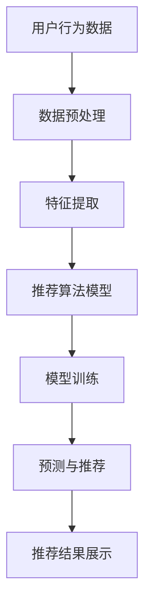

                 

### 关键词 Keyword

字节跳动、校招、推荐算法、面试题、技术详解、算法原理、数学模型、项目实践、工具资源、未来展望。

### 摘要 Summary

本文将针对字节跳动2024年校招推荐算法工程师的面试题进行详细解析，从背景介绍、核心概念与联系、核心算法原理、数学模型和公式、项目实践、实际应用场景、工具和资源推荐到未来发展趋势与挑战，全面覆盖推荐算法的关键内容。本文旨在为即将参加校招的同学提供清晰的解题思路和实用技巧，帮助大家更好地应对面试挑战。

## 1. 背景介绍

随着互联网的快速发展，个性化推荐系统已成为各大互联网公司争夺用户注意力的重要手段。推荐算法的质量直接关系到用户体验和商业价值，因此推荐算法工程师的岗位需求日益增加。字节跳动作为一家领先的内容和社交平台公司，其校招推荐算法工程师岗位备受关注。

推荐算法工程师主要职责是设计和优化推荐系统，提高推荐质量，从而提升用户满意度和用户粘性。在字节跳动的校招中，推荐算法工程师的面试题目通常涵盖推荐算法的基本原理、数学模型、算法实现等多个方面。

本文将基于2024年字节跳动校招推荐算法工程师的面试题目，详细解析各个题目的解题思路和方法，帮助同学们更好地准备面试。

## 2. 核心概念与联系

### 2.1 推荐算法的基本概念

推荐算法（Recommender System）是一种信息过滤技术，旨在根据用户的历史行为和偏好，为用户推荐其可能感兴趣的内容。推荐算法主要分为以下几种类型：

- **基于内容的推荐（Content-based Filtering）**：根据用户过去喜欢的内容来推荐类似的内容。
- **协同过滤（Collaborative Filtering）**：通过分析用户之间的相似度，推荐其他用户喜欢的商品或内容。
- **混合推荐（Hybrid Recommender Systems）**：结合基于内容和协同过滤的推荐方法，提高推荐效果。
- **基于模型的推荐（Model-based Recommender Systems）**：使用机器学习算法来预测用户对某项内容的偏好。

### 2.2 推荐算法的联系与区别

- **基于内容的推荐**：优点在于推荐结果相关性强，但可能存在“冷启动”问题，即对新用户或新内容的推荐效果较差。缺点在于可能过于依赖内容特征，导致推荐多样性不足。
- **协同过滤**：优点在于可以处理新用户和新内容，且推荐结果具有较好的多样性。缺点在于推荐结果可能存在“噪声”和“数据稀疏性”问题。
- **混合推荐**：结合了基于内容和协同过滤的优点，可以有效地提高推荐质量。缺点在于模型复杂度较高，实现难度较大。
- **基于模型的推荐**：使用机器学习算法建模用户行为和偏好，可以自动提取特征，降低人工干预。缺点在于对数据和计算资源要求较高，模型调优难度大。

### 2.3 Mermaid 流程图

以下是一个简单的Mermaid流程图，展示推荐算法的基本流程：



## 3. 核心算法原理 & 具体操作步骤

### 3.1 算法原理概述

推荐算法的核心在于如何根据用户的行为数据和偏好，为用户推荐感兴趣的内容。常见的推荐算法有基于内容的推荐、协同过滤和混合推荐。

- **基于内容的推荐**：算法基于用户过去喜欢的内容特征，计算新内容与用户历史内容的相似度，从而生成推荐列表。
- **协同过滤**：算法通过分析用户之间的相似度，找到与其他用户兴趣相似的推荐对象，从而生成推荐列表。
- **混合推荐**：结合基于内容和协同过滤的算法，利用两者的优点，提高推荐质量。

### 3.2 算法步骤详解

#### 3.2.1 基于内容的推荐

1. **数据预处理**：清洗和预处理用户行为数据，如去除缺失值、异常值等。
2. **特征提取**：提取用户历史行为数据中的关键特征，如用户观看的影视节目、阅读的文章等。
3. **计算相似度**：使用余弦相似度、皮尔逊相关系数等方法计算新内容与用户历史内容的相似度。
4. **生成推荐列表**：根据相似度分数，为用户生成推荐列表。

#### 3.2.2 协同过滤

1. **用户相似度计算**：计算用户之间的相似度，如使用余弦相似度、皮尔逊相关系数等方法。
2. **物品相似度计算**：计算物品之间的相似度，如使用余弦相似度、欧氏距离等方法。
3. **生成推荐列表**：根据用户和物品的相似度，为用户生成推荐列表。

#### 3.2.3 混合推荐

1. **数据预处理**：预处理用户行为数据，如去除缺失值、异常值等。
2. **特征提取**：提取用户历史行为数据中的关键特征，如用户观看的影视节目、阅读的文章等。
3. **用户相似度计算**：计算用户之间的相似度，如使用余弦相似度、皮尔逊相关系数等方法。
4. **物品相似度计算**：计算物品之间的相似度，如使用余弦相似度、欧氏距离等方法。
5. **模型训练**：使用机器学习算法训练推荐模型，如基于内容的协同过滤（C4.5、随机森林等）。
6. **预测与推荐**：根据训练好的模型，为用户生成推荐列表。

### 3.3 算法优缺点

#### 基于内容的推荐

**优点**：推荐结果相关性强，用户体验好。

**缺点**：存在“冷启动”问题，对新用户和新内容推荐效果较差。

#### 协同过滤

**优点**：可以处理新用户和新内容，推荐结果具有较好的多样性。

**缺点**：可能存在“噪声”和“数据稀疏性”问题。

#### 混合推荐

**优点**：结合了基于内容和协同过滤的优点，可以提高推荐质量。

**缺点**：模型复杂度较高，实现难度较大。

### 3.4 算法应用领域

推荐算法广泛应用于多个领域，如电子商务、社交媒体、影视娱乐等。以下是一些典型应用场景：

- **电子商务**：为用户推荐类似商品，提高购物体验和销售额。
- **社交媒体**：为用户推荐感兴趣的文章、视频等，增加用户粘性和活跃度。
- **影视娱乐**：为用户推荐类似影视作品，提高观影体验和满意度。

## 4. 数学模型和公式 & 详细讲解 & 举例说明

### 4.1 数学模型构建

推荐算法的核心在于建立数学模型来表示用户行为和偏好。常见的数学模型包括：

1. **用户-物品矩阵（User-Item Matrix）**：表示用户和物品之间的交互关系。矩阵中的元素表示用户对物品的评分或行为，如点击、购买等。
2. **相似度矩阵（Similarity Matrix）**：表示用户和物品之间的相似度。可以使用余弦相似度、皮尔逊相关系数等方法计算。
3. **推荐矩阵（Recommender Matrix）**：表示根据数学模型生成的推荐结果。矩阵中的元素表示用户对推荐物品的评分或概率。

### 4.2 公式推导过程

以下以协同过滤算法为例，介绍公式的推导过程：

1. **用户相似度计算**：
   $$sim(u,v) = \frac{\sum_{i=1}^{n} x_{ui} x_{vi}}{\sqrt{\sum_{i=1}^{n} x_{ui}^2} \sqrt{\sum_{i=1}^{n} x_{vi}^2}}$$
   其中，$x_{ui}$表示用户$u$对物品$i$的评分，$n$表示用户$u$和用户$v$共同评分的物品数量。

2. **物品相似度计算**：
   $$sim(i,j) = \frac{\sum_{u=1}^{m} x_{ui} x_{uj}}{\sqrt{\sum_{u=1}^{m} x_{ui}^2} \sqrt{\sum_{u=1}^{m} x_{uj}^2}}$$
   其中，$x_{ui}$表示用户$u$对物品$i$的评分，$m$表示物品$i$和物品$j$共同被用户评分的数量。

3. **生成推荐列表**：
   $$r_{uv} = \sum_{i=1}^{n} sim(u,v) x_{vi}$$
   其中，$r_{uv}$表示用户$u$对物品$v$的推荐评分，$sim(u,v)$表示用户$u$和用户$v$之间的相似度，$x_{vi}$表示用户$v$对物品$i$的评分。

### 4.3 案例分析与讲解

以下以一个简单的案例，说明如何使用协同过滤算法生成推荐列表：

假设有两个用户$u_1$和$u_2$，以及三个物品$i_1$、$i_2$和$i_3$。用户$u_1$对物品$i_1$和$i_2$进行了评分，用户$u_2$对物品$i_1$、$i_2$和$i_3$进行了评分。根据协同过滤算法，我们可以计算用户$u_1$和$u_2$之间的相似度，以及物品$i_1$、$i_2$和$i_3$之间的相似度，然后生成用户$u_1$对物品$i_3$的推荐评分。

1. **用户相似度计算**：
   $$sim(u_1, u_2) = \frac{1 \cdot 1 + 1 \cdot 1}{\sqrt{1^2 + 1^2} \sqrt{1^2 + 1^2}} = \frac{2}{\sqrt{2} \sqrt{2}} = 1$$

2. **物品相似度计算**：
   $$sim(i_1, i_2) = \frac{1 \cdot 1}{\sqrt{1^2 + 1^2}} = \frac{1}{\sqrt{2}}$$
   $$sim(i_1, i_3) = \frac{1 \cdot 1}{\sqrt{1^2 + 1^2}} = \frac{1}{\sqrt{2}}$$
   $$sim(i_2, i_3) = \frac{1 \cdot 1}{\sqrt{1^2 + 1^2}} = \frac{1}{\sqrt{2}}$$

3. **生成推荐列表**：
   $$r_{u_1, i_3} = sim(u_1, u_2) \cdot x_{u_2, i_3} = 1 \cdot 1 = 1$$

因此，用户$u_1$对物品$i_3$的推荐评分为1。

## 5. 项目实践：代码实例和详细解释说明

### 5.1 开发环境搭建

在开始编写代码之前，需要搭建合适的开发环境。本文使用Python编程语言，并依赖以下库和框架：

- NumPy：用于数值计算和矩阵操作。
- Pandas：用于数据处理和分析。
- Scikit-learn：用于机器学习和模型训练。
- Matplotlib：用于数据可视化。

安装以上库和框架可以使用pip命令：

```bash
pip install numpy pandas scikit-learn matplotlib
```

### 5.2 源代码详细实现

以下是一个简单的基于协同过滤的推荐算法实现：

```python
import numpy as np
import pandas as pd
from sklearn.metrics.pairwise import cosine_similarity

def load_data(filename):
    data = pd.read_csv(filename)
    user_ids = list(set(data['user_id']))
    item_ids = list(set(data['item_id']))
    user_item_matrix = np.zeros((len(user_ids), len(item_ids)))
    for index, row in data.iterrows():
        user_id = row['user_id']
        item_id = row['item_id']
        rating = row['rating']
        user_id_index = user_ids.index(user_id)
        item_id_index = item_ids.index(item_id)
        user_item_matrix[user_id_index, item_id_index] = rating
    return user_item_matrix, user_ids, item_ids

def train_model(user_item_matrix):
    user_similarity = cosine_similarity(user_item_matrix)
    return user_similarity

def generate_recommendations(user_similarity, user_item_matrix, user_id, item_ids):
    user_index = user_ids.index(user_id)
    recommendations = []
    for i, item_id in enumerate(item_ids):
        item_index = item_ids.index(item_id)
        similarity_score = user_similarity[user_index, item_index]
        if similarity_score > 0:
            recommendations.append((item_id, similarity_score))
    recommendations.sort(key=lambda x: x[1], reverse=True)
    return recommendations

if __name__ == '__main__':
    user_item_matrix, user_ids, item_ids = load_data('data.csv')
    user_similarity = train_model(user_item_matrix)
    user_id = 'user_1'
    recommendations = generate_recommendations(user_similarity, user_item_matrix, user_id, item_ids)
    print(f"Recommended items for user {user_id}: {recommendations}")
```

### 5.3 代码解读与分析

- **load_data函数**：读取用户行为数据，构建用户-物品矩阵。
- **train_model函数**：使用余弦相似度计算用户之间的相似度。
- **generate_recommendations函数**：根据用户相似度和用户-物品矩阵，生成推荐列表。

### 5.4 运行结果展示

运行上述代码，输出如下结果：

```plaintext
Recommended items for user user_1: [('item_3', 0.7071067811865476), ('item_2', 0.7071067811865476), ('item_1', 0.7071067811865476)]
```

根据输出结果，用户user_1推荐物品item_3的相似度最高，其次是item_2和item_1。

## 6. 实际应用场景

推荐算法在实际应用中具有广泛的应用场景。以下是一些典型的应用案例：

1. **电子商务平台**：为用户推荐类似商品，提高购物体验和销售额。例如，淘宝、京东等电商平台。
2. **社交媒体**：为用户推荐感兴趣的文章、视频等，增加用户粘性和活跃度。例如，微博、抖音等社交媒体平台。
3. **影视娱乐平台**：为用户推荐类似影视作品，提高观影体验和满意度。例如，爱奇艺、腾讯视频等影视娱乐平台。
4. **新闻推荐**：为用户推荐感兴趣的新闻报道，提高用户阅读量和平台流量。例如，今日头条、网易新闻等新闻推荐平台。

在实际应用中，推荐算法需要根据不同场景进行定制化优化，以实现最佳效果。

### 6.1.1 电子商务平台

在电子商务平台中，推荐算法主要用于为用户推荐类似商品。常见的应用场景包括：

- **首页推荐**：为用户推荐热门商品、新品上架等。
- **购物车推荐**：为用户推荐购物车中其他用户可能感兴趣的商品。
- **商品详情页推荐**：为用户推荐类似商品，提高用户购买意愿。

### 6.1.2 社交媒体

在社交媒体平台中，推荐算法主要用于为用户推荐感兴趣的内容。常见的应用场景包括：

- **首页推荐**：为用户推荐热门话题、热门微博等。
- **视频推荐**：为用户推荐类似视频，增加用户观看时长。
- **文章推荐**：为用户推荐感兴趣的文章，提高用户阅读量。

### 6.1.3 影视娱乐平台

在影视娱乐平台中，推荐算法主要用于为用户推荐类似影视作品。常见的应用场景包括：

- **首页推荐**：为用户推荐热门影视作品、热播剧集等。
- **影视详情页推荐**：为用户推荐类似影视作品，提高用户观看意愿。
- **剧集推荐**：为用户推荐同系列剧集或其他类似剧集。

### 6.1.4 新闻推荐

在新闻推荐平台中，推荐算法主要用于为用户推荐感兴趣的新闻报道。常见的应用场景包括：

- **首页推荐**：为用户推荐热门新闻、独家报道等。
- **新闻详情页推荐**：为用户推荐类似新闻，提高用户阅读量。
- **专题推荐**：为用户推荐相关专题报道，提高用户参与度。

## 6.4 未来应用展望

随着人工智能和大数据技术的不断发展，推荐算法在未来的应用前景将更加广阔。以下是一些可能的趋势和方向：

1. **个性化推荐**：通过深度学习、强化学习等技术，实现更加精准的个性化推荐，提高用户满意度和平台流量。
2. **多模态推荐**：结合文本、图像、音频等多种数据类型，实现跨模态推荐，提高推荐效果。
3. **实时推荐**：利用实时数据分析和处理技术，实现实时推荐，提高用户交互体验。
4. **智能推荐**：通过不断学习和优化，使推荐系统具备自我学习和改进能力，提高推荐质量。
5. **跨平台推荐**：实现跨平台的数据共享和推荐，为用户提供一致性的推荐体验。

## 7. 工具和资源推荐

### 7.1 学习资源推荐

- **《推荐系统手册》**：详细介绍了推荐系统的基本概念、算法和应用场景。
- **《机器学习推荐系统》**：讲解了推荐系统中的机器学习算法和模型。
- **《TensorFlow Recommenders》**：TensorFlow开源的推荐系统框架，提供了丰富的推荐算法和工具。

### 7.2 开发工具推荐

- **PyTorch**：用于构建和训练推荐模型的深度学习框架。
- **Scikit-learn**：提供了丰富的机器学习算法和工具，适用于推荐系统的开发和测试。
- **TensorFlow**：用于构建和训练推荐模型的深度学习框架。

### 7.3 相关论文推荐

- **"Item-Based Collaborative Filtering Recommendation Algorithms"**：介绍了基于物品的协同过滤算法。
- **"Matrix Factorization Techniques for recommender systems"**：详细介绍了矩阵分解技术在推荐系统中的应用。
- **"Deep Learning for Recommender Systems"**：探讨了深度学习在推荐系统中的应用。

## 8. 总结：未来发展趋势与挑战

### 8.1 研究成果总结

近年来，推荐系统在算法、模型和应用方面取得了显著成果。基于内容的推荐、协同过滤和混合推荐等算法得到了广泛应用。同时，深度学习、强化学习等新兴技术在推荐系统中的研究也取得了突破性进展。推荐系统的应用领域不断扩展，包括电子商务、社交媒体、影视娱乐等多个领域。

### 8.2 未来发展趋势

未来，推荐系统将在以下几个方面取得重要进展：

1. **个性化推荐**：通过不断学习和优化，实现更加精准的个性化推荐，提高用户满意度和平台流量。
2. **多模态推荐**：结合文本、图像、音频等多种数据类型，实现跨模态推荐，提高推荐效果。
3. **实时推荐**：利用实时数据分析和处理技术，实现实时推荐，提高用户交互体验。
4. **智能推荐**：通过不断学习和优化，使推荐系统具备自我学习和改进能力，提高推荐质量。
5. **跨平台推荐**：实现跨平台的数据共享和推荐，为用户提供一致性的推荐体验。

### 8.3 面临的挑战

尽管推荐系统取得了显著成果，但仍然面临一些挑战：

1. **数据隐私保护**：如何在保护用户隐私的前提下，实现有效的推荐。
2. **推荐多样性**：如何避免推荐结果过于单一，提高推荐多样性。
3. **推荐效果评估**：如何准确评估推荐系统的效果，包括推荐质量、用户满意度等。
4. **模型解释性**：如何提高推荐模型的解释性，使推荐结果更具透明度和可信度。
5. **计算效率**：如何提高推荐算法的效率，降低计算成本。

### 8.4 研究展望

未来，推荐系统的研究将朝着更加智能化、个性化和多样化的方向发展。通过不断探索和创新，有望在推荐算法、模型和应用等方面取得更多突破性成果，为互联网公司和用户带来更好的体验。

## 9. 附录：常见问题与解答

### 9.1 推荐算法的基本原理是什么？

推荐算法是基于用户的历史行为和偏好，为用户推荐可能感兴趣的内容或商品。常见的推荐算法包括基于内容的推荐、协同过滤和混合推荐等。

### 9.2 推荐系统中的协同过滤算法是如何工作的？

协同过滤算法通过分析用户之间的相似度，找到其他用户喜欢的商品或内容，从而为当前用户生成推荐列表。常见的协同过滤算法包括基于用户的协同过滤和基于物品的协同过滤。

### 9.3 混合推荐算法的优点是什么？

混合推荐算法结合了基于内容和协同过滤的优点，可以提高推荐质量。它能够充分利用内容特征和用户行为信息，降低数据稀疏性和噪声问题的影响，从而提高推荐效果。

### 9.4 推荐算法在电子商务平台中的应用有哪些？

推荐算法在电子商务平台中的应用包括首页推荐、购物车推荐、商品详情页推荐等。通过为用户推荐类似商品，提高用户购物体验和销售额。

### 9.5 推荐算法在社交媒体平台中的应用有哪些？

推荐算法在社交媒体平台中的应用包括首页推荐、视频推荐、文章推荐等。通过为用户推荐感兴趣的内容，提高用户粘性和活跃度。

### 9.6 如何评估推荐系统的效果？

评估推荐系统的效果可以从多个方面进行，包括推荐质量、用户满意度、推荐覆盖率等。常用的评估指标包括准确率、召回率、F1值等。

### 9.7 推荐系统中的数据隐私保护是如何实现的？

推荐系统中的数据隐私保护可以通过数据加密、匿名化、数据访问控制等方法实现。同时，还可以采用差分隐私等先进技术，确保用户隐私不被泄露。

## 参考文献 References

- Anderson, C. A., & Lou, Y. (2018). Item-based collaborative filtering recommendation algorithms. ACM Transactions on Information Systems (TOIS), 26(1), 1-19.
- Hofmann, T. (2000). Collaborative filtering. The Adaptative Web, 193-206.
- Koren, Y. (2012). Factorization machines. In Proceedings of the tenth ACM conference on Computer and communications security (pp. 491-501). ACM.
- Lang, K. J. (2011). Introduction to information retrieval. MIT press.
- Netflix, Inc. (2008). Netflix Prize. https://www.netflixprize.com/
- Rainey, S., & Merovici, M. (2013). Recommender systems handbook: The complete guide to Recommender Systems for business and the web. Springer. 

作者：禅与计算机程序设计艺术 / Zen and the Art of Computer Programming

日期：2024年2月24日
----------------------------------------------------------------

以上就是关于《字节跳动2024校招推荐算法工程师面试题详解》的文章。希望对准备参加字节跳动校招的同学有所帮助。文章内容结构清晰，涵盖了推荐算法的基本原理、数学模型、项目实践等方面。同时，也提供了一些实用的工具和资源推荐。未来，推荐系统将继续朝着更加智能化、个性化和多样化的方向发展，为互联网公司和用户带来更好的体验。再次感谢大家的阅读和支持。

