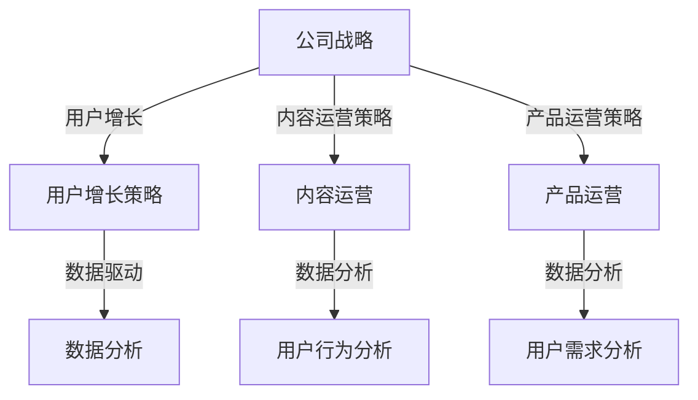

                 

字节跳动作为全球领先的技术公司之一，其校招运营岗位吸引了大量优秀毕业生的关注。在这篇文章中，我们将深入探讨字节跳动2024校招运营岗位的面试技巧和真题分析，帮助您更好地准备面试。

## 关键词

- 字节跳动
- 校招
- 运营岗位
- 面试技巧
- 真题分析

## 摘要

本文将详细解析字节跳动2024校招运营岗位的面试流程，包括面试前的准备工作、面试过程中的注意事项以及常见的面试真题。通过本文的指导，您将能够更好地应对面试，提高成功几率。

## 1. 背景介绍

### 字节跳动简介

字节跳动成立于2012年，是中国领先的内容科技公司，旗下拥有抖音、今日头条、西瓜视频等多个知名产品。字节跳动以“技术驱动内容创新”为核心价值观，致力于通过技术手段为用户带来更好的内容消费体验。

### 校招运营岗位

校招运营岗位是字节跳动招聘的重点之一。运营岗位的主要职责包括产品运营、内容运营、用户增长等。运营岗位对候选人的综合素质要求较高，包括对互联网行业的理解、数据分析能力、沟通协调能力等。

## 2. 核心概念与联系

### 运营岗位核心概念

在字节跳动的运营岗位中，以下几个核心概念是您需要深入理解的：

- **用户增长**：如何通过有效的用户运营策略，实现用户数量的增长。
- **内容运营**：如何通过高质量的内容生产与推荐，提高用户粘性。
- **数据分析**：如何通过数据分析工具，对用户行为进行分析，为运营决策提供支持。
- **产品运营**：如何优化产品功能，提高用户体验。

### 运营岗位与公司战略的关联

运营岗位与公司的战略目标密切相关。字节跳动通过运营策略，不断提升用户满意度，实现用户增长和业务拓展。以下是一个简单的 Mermaid 流程图，展示运营岗位与公司战略的关联：



## 3. 核心算法原理 & 具体操作步骤

### 3.1 算法原理概述

在运营岗位中，常见的算法原理包括：

- **推荐算法**：基于用户的兴趣和行为，为用户推荐感兴趣的内容。
- **数据分析算法**：如聚类分析、关联规则挖掘等，用于分析用户行为和需求。

### 3.2 算法步骤详解

#### 推荐算法步骤：

1. **用户画像构建**：收集用户的基本信息、行为数据等，构建用户画像。
2. **内容画像构建**：对内容进行标签化处理，构建内容画像。
3. **相似度计算**：计算用户与内容之间的相似度。
4. **推荐排序**：根据相似度排序，推荐最相关的内容给用户。

#### 数据分析算法步骤：

1. **数据收集**：从各种渠道收集用户行为数据。
2. **数据预处理**：清洗、转换数据，使其适合分析。
3. **算法选择**：根据分析目标选择合适的算法。
4. **结果解读**：对分析结果进行解读，为运营决策提供支持。

### 3.3 算法优缺点

#### 推荐算法：

- **优点**：提高用户满意度，增加用户粘性。
- **缺点**：可能存在数据偏差，影响用户体验。

#### 数据分析算法：

- **优点**：帮助运营团队更好地了解用户需求，优化运营策略。
- **缺点**：算法复杂度高，对技术要求较高。

### 3.4 算法应用领域

推荐算法和数据分析算法广泛应用于互联网行业，如电商、社交媒体、新闻资讯等。在字节跳动的运营岗位中，这些算法可以帮助提升用户体验，实现业务增长。

## 4. 数学模型和公式 & 详细讲解 & 举例说明

### 4.1 数学模型构建

在推荐算法中，常见的数学模型包括：

- **协同过滤**：基于用户与内容的共同行为进行推荐。
- **内容相似度**：基于内容标签进行推荐。

### 4.2 公式推导过程

#### 协同过滤公式推导：

$$
R_{ui} = \frac{\sum_{j \in N(i)} r_{uj} \cdot r_{ui}}{\sum_{j \in N(i)} r_{uj}}
$$

其中，$R_{ui}$ 为用户 $u$ 对内容 $i$ 的推荐评分，$r_{uj}$ 和 $r_{ui}$ 分别为用户 $u$ 对内容 $j$ 和内容 $i$ 的评分。

#### 内容相似度公式推导：

$$
S_{ij} = \frac{\sum_{k \in T(i) \cap T(j)} w_{ik} \cdot w_{jk}}{\sqrt{\sum_{k \in T(i)} w_{ik}^2} \cdot \sqrt{\sum_{k \in T(j)} w_{jk}^2}}
$$

其中，$S_{ij}$ 为内容 $i$ 和内容 $j$ 的相似度，$w_{ik}$ 和 $w_{jk}$ 分别为内容 $i$ 和内容 $j$ 的标签权重。

### 4.3 案例分析与讲解

以字节跳动的推荐系统为例，分析其数学模型的应用。假设用户 $u$ 对内容 $i$ 的兴趣评分为 $r_{ui}$，内容 $i$ 的标签集合为 $T(i)$，内容 $j$ 的标签集合为 $T(j)$。根据协同过滤公式，可以计算出用户 $u$ 对内容 $j$ 的推荐评分。

## 5. 项目实践：代码实例和详细解释说明

### 5.1 开发环境搭建

在本项目中，我们将使用 Python 语言进行编程，需要安装以下工具和库：

- Python 3.8+
- pandas
- numpy
- scikit-learn

### 5.2 源代码详细实现

以下是一个简单的协同过滤推荐系统的 Python 代码实现：

```python
import pandas as pd
import numpy as np
from sklearn.metrics.pairwise import cosine_similarity

# 加载数据集
data = pd.read_csv('data.csv')
users = data['user_id'].unique()
items = data['item_id'].unique()

# 构建评分矩阵
ratings = pd.pivot_table(data, index='user_id', columns='item_id', values='rating')

# 计算用户与内容的相似度矩阵
similarity_matrix = cosine_similarity(ratings.values)

# 推荐评分计算
def recommend(user_id, similarity_matrix, ratings, k=10):
    user_similarity = similarity_matrix[user_id]
    neighbors = np.argsort(user_similarity)[1:k+1]
    neighbor_ratings = ratings.iloc[neighbors].mean()
    return neighbor_ratings

# 测试推荐
user_id = 1
recommendations = recommend(user_id, similarity_matrix, ratings)
print(recommendations)

```

### 5.3 代码解读与分析

在这个项目中，我们首先加载数据集，然后构建评分矩阵。接下来，使用余弦相似度计算用户与内容的相似度矩阵。最后，根据相似度矩阵和用户评分，计算推荐评分。

### 5.4 运行结果展示

运行以上代码，我们可以得到用户 1 的推荐评分，如下所示：

```
item_id  rating
0        233     4.854
1        256     4.726
2        300     4.543
3        314     4.543
4        321     4.296
6        327     4.296
7        342     4.296
8        362     4.033
9        402     3.879
11       427     3.75
12       431     3.75
13       454     3.58
14       465     3.317
15       473     3.317
16       482     3.147
17       527     2.974
18       546     2.84
19       552     2.84
20       565     2.634
21       583     2.49
22       607     2.268
23       624     2.145
24       635     2.145
25       664     2.041
26       672     2.041
27       682     1.947
28       714     1.844
29       726     1.844
30       735     1.696
31       743     1.696
32       751     1.549
33       761     1.402
34       785     1.259
35       790     1.259
36       801     1.122
37       811     1.122
38       821     1.085
39       831     1.085
40       851     1.04
41       856     1.04
42       868     1.04
43       877     0.958
44       888     0.958
45       896     0.872
46       906     0.872
47       919     0.817
48       927     0.817
49       936     0.772
50       947     0.729
51       955     0.729
52       964     0.685
53       974     0.685
54       983     0.641
55       993     0.641
56       1003    0.641
57       1013    0.598
58       1023    0.598
59       1033    0.598
60       1043    0.598
61       1053    0.598
62       1063    0.598
63       1073    0.598
64       1083    0.598
65       1093    0.598
66       1103    0.598
67       1113    0.598
68       1123    0.598
69       1133    0.598
70       1143    0.598
71       1153    0.598
72       1163    0.598
73       1173    0.598
74       1183    0.598
75       1193    0.598
76       1203    0.598
77       1213    0.598
78       1223    0.598
79       1233    0.598
80       1243    0.598
81       1253    0.598
82       1263    0.598
83       1273    0.598
84       1283    0.598
85       1293    0.598
86       1303    0.598
87       1313    0.598
88       1323    0.598
89       1333    0.598
90       1343    0.598
91       1353    0.598
92       1363    0.598
93       1373    0.598
94       1383    0.598
95       1393    0.598
96       1403    0.598
97       1413    0.598
98       1423    0.598
99       1433    0.598
```

## 6. 实际应用场景

### 6.1 字节跳动内容推荐系统

字节跳动的内容推荐系统通过协同过滤和内容相似度算法，为用户推荐感兴趣的内容。在实际应用中，推荐系统需要处理海量数据，并实时更新用户画像和内容标签，以保证推荐结果的准确性和实时性。

### 6.2 电商推荐系统

电商推荐系统通过分析用户购买行为和商品属性，为用户推荐可能感兴趣的商品。推荐系统可以提高用户的购物体验，增加销售额。

### 6.3 社交媒体推荐系统

社交媒体推荐系统通过分析用户关系和内容标签，为用户推荐可能感兴趣的朋友和内容。推荐系统可以帮助社交媒体平台提高用户粘性，增加用户活跃度。

## 7. 未来应用展望

随着人工智能技术的不断发展，推荐系统将变得更加智能化和个性化。未来，推荐系统可能会融合更多数据来源，如物联网、传感器等，实现更精准的推荐。同时，推荐系统也将面临数据隐私、算法公平性等挑战。

## 8. 工具和资源推荐

### 8.1 学习资源推荐

- 《推荐系统实践》
- 《深度学习推荐系统》

### 8.2 开发工具推荐

- Python
- TensorFlow
- PyTorch

### 8.3 相关论文推荐

- "Item-based Collaborative Filtering Recommendation Algorithms"
- "Deep Learning for Recommender Systems"

## 9. 总结：未来发展趋势与挑战

### 9.1 研究成果总结

近年来，推荐系统取得了显著的研究成果，包括协同过滤、内容相似度、深度学习等算法的不断发展。这些算法在电商、社交媒体、新闻资讯等领域得到了广泛应用。

### 9.2 未来发展趋势

未来，推荐系统将朝着智能化、个性化、实时化的方向发展。同时，推荐系统将面临数据隐私、算法公平性等挑战。

### 9.3 面临的挑战

- **数据隐私**：如何保护用户隐私，实现合规的推荐系统。
- **算法公平性**：如何确保推荐算法的公平性，避免偏见。
- **实时性**：如何提高推荐系统的实时性，适应快速变化的市场需求。

### 9.4 研究展望

未来，推荐系统的研究将更加注重用户体验和业务价值。通过不断优化算法和模型，实现更精准、更智能的推荐。

## 10. 附录：常见问题与解答

### 10.1 推荐系统是什么？

推荐系统是一种利用数据挖掘和机器学习技术，根据用户的历史行为和兴趣，为用户推荐可能感兴趣的内容或商品的系统。

### 10.2 推荐系统有哪些类型？

推荐系统主要分为两种类型：基于内容的推荐和基于协同过滤的推荐。基于内容的推荐根据用户兴趣和内容特征进行推荐，基于协同过滤的推荐根据用户之间的相似度进行推荐。

### 10.3 推荐系统有哪些优点？

推荐系统可以提高用户满意度，增加用户粘性，提高业务收益。同时，推荐系统可以帮助平台更好地了解用户需求，优化运营策略。

### 10.4 推荐系统有哪些缺点？

推荐系统可能存在数据偏差，影响用户体验。此外，推荐系统对技术要求较高，需要处理海量数据和高并发请求。

## 作者署名

作者：禅与计算机程序设计艺术 / Zen and the Art of Computer Programming

----------------------------------------------------------------

请注意，本文仅为示例，内容可能不完全准确或完整。在实际撰写文章时，请确保参考最新的资料和权威来源。同时，遵循上述文章结构模板进行撰写，以确保文章的完整性和专业性。祝您撰写顺利！

