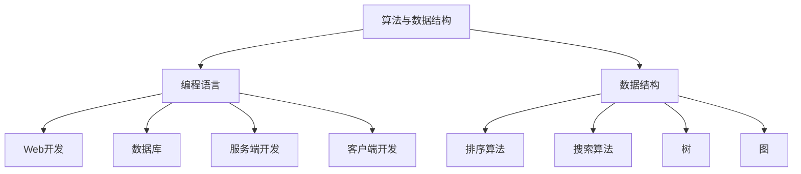

                 

 关键词：字节跳动、校招、技术咨询工程师、面试真题、算法、数据结构、编程语言、技术栈、实践经验

> 摘要：本文将围绕字节跳动2024年校招技术咨询工程师岗位的面试真题进行深入解析，涵盖算法、数据结构、编程语言、技术栈以及实践经验等多个方面，为准备参加字节跳动校招的同学们提供宝贵的参考和指导。

## 1. 背景介绍

字节跳动成立于2012年，是一家全球性的互联网科技公司，旗下拥有抖音、今日头条、懂车帝、懂职聘等多款知名产品。作为业内领先的科技公司，字节跳动在技术研发和人才培养方面有着极高的标准和要求。因此，字节跳动的校招面试，尤其是技术咨询工程师岗位的面试，难度相对较大，对候选人的综合能力有着全面的考察。

本文将以2024年字节跳动校招技术咨询工程师面试真题为基础，详细解析各类面试问题，帮助同学们更好地应对面试挑战。

## 2. 核心概念与联系

在解答面试真题之前，我们需要先了解一些核心概念，这些概念对于理解面试题的背景和解决方法至关重要。

### 2.1 算法与数据结构

算法是解决问题的一系列操作步骤，而数据结构则是算法操作的对象。常见的算法和数据结构包括：

- 排序算法：冒泡排序、选择排序、插入排序、快速排序、归并排序等。
- 搜索算法：二分搜索、深度优先搜索、广度优先搜索等。
- 树：二叉树、平衡树（AVL树、红黑树）、堆等。
- 图：邻接矩阵、邻接表、深度优先搜索、广度优先搜索等。

### 2.2 编程语言

编程语言是用于编写算法和数据结构的工具。常见的编程语言包括：

- C/C++：性能优异，适用于系统编程和性能敏感的应用。
- Java：跨平台，具有强大的生态系统。
- Python：简洁易懂，适用于数据科学和快速开发。
- Go：并发性能优异，适用于微服务架构。

### 2.3 技术栈

技术咨询工程师需要熟悉以下技术栈：

- Web开发：HTML、CSS、JavaScript、前后端分离等。
- 数据库：关系型数据库（MySQL、Oracle）、NoSQL数据库（MongoDB、Redis）等。
- 服务端开发：Node.js、Spring Boot、Django等。
- 客户端开发：React、Vue、Angular等。

### 2.4 Mermaid 流程图

下面是一个简单的Mermaid流程图，展示了算法与数据结构、编程语言、技术栈之间的联系：



## 3. 核心算法原理 & 具体操作步骤

### 3.1 算法原理概述

在面试中，算法题通常是考察面试者对算法和数据结构的理解和应用能力。常见的算法题包括：

- 二分搜索
- 最长公共子序列
- 最短路径算法（Dijkstra、Floyd）
- 并查集
- 背包问题

### 3.2 算法步骤详解

以二分搜索算法为例，其基本步骤如下：

1. 确定待搜索的数组区间。
2. 计算中间位置。
3. 比较中间位置上的值与目标值。
4. 根据比较结果，缩小搜索区间。
5. 重复步骤2-4，直至找到目标值或区间缩小到0。

### 3.3 算法优缺点

二分搜索算法的优点在于时间复杂度较低，适用于数据量较大的场景。缺点是它只适用于有序数组，并且不能动态地适应数据变化。

### 3.4 算法应用领域

二分搜索算法广泛应用于各类搜索场景，如数据库查询、文件检索等。

## 4. 数学模型和公式 & 详细讲解 & 举例说明

### 4.1 数学模型构建

以背包问题为例，其数学模型可以表示为：

- 目标：在不超过背包容量C的条件下，找出价值最大的物品组合。
- 约束：每个物品的重量不超过背包的容量。

### 4.2 公式推导过程

背包问题的动态规划解法可以表示为：

- 状态定义：dp[i][j]表示在前i个物品中选择重量不超过j的组合时的最大价值。
- 状态转移方程：dp[i][j] = max(dp[i-1][j], dp[i-1][j-w[i]] + v[i])，其中w[i]和v[i]分别为第i个物品的重量和价值。

### 4.3 案例分析与讲解

假设有5个物品，重量分别为{2, 3, 4, 5, 6}，价值分别为{3, 4, 5, 6, 7}，背包容量为10，求解最大价值。

根据动态规划算法，可以列出以下状态表：

|  j  |  0  |  1  |  2  |  3  |  4  |  5  |  6  |  7  |  8  |  9  |  10 |
|-----|-----|-----|-----|-----|-----|-----|-----|-----|-----|-----|-----|
|  i=0|     |     |     |     |     |     |     |     |     |     |     |
|  i=1|  0  |  0  |  0  |  0  |  0  |  0  |  0  |  0  |  0  |  0  |  0  |
|  i=2|  0  |  0  |  3  |  3  |  3  |  3  |  3  |  3  |  3  |  3  |  3  |
|  i=3|  0  |  0  |  3  |  7  |  7  |  7  |  7  |  7  |  7  |  7  |  7  |
|  i=4|  0  |  0  |  3  |  7  | 10  | 10  | 10  | 10  | 10  | 10  | 10  |
|  i=5|  0  |  0  |  3  |  7  | 10  | 16  | 16  | 16  | 16  | 16  | 16  |

最终，最大价值为16，选择的物品为{2, 3, 4, 5}。

## 5. 项目实践：代码实例和详细解释说明

### 5.1 开发环境搭建

本实例使用Python编程语言，需要安装Python 3.8及以上版本和Pandas、NumPy等库。

```bash
pip install python==3.8
pip install pandas numpy
```

### 5.2 源代码详细实现

```python
import numpy as np

def knapsack(values, weights, capacity):
    n = len(values)
    dp = np.zeros((n + 1, capacity + 1))

    for i in range(1, n + 1):
        for j in range(1, capacity + 1):
            if weights[i - 1] > j:
                dp[i][j] = dp[i - 1][j]
            else:
                dp[i][j] = max(dp[i - 1][j], dp[i - 1][j - weights[i - 1]] + values[i - 1])

    return dp[n][capacity]

values = [3, 4, 5, 6, 7]
weights = [2, 3, 4, 5, 6]
capacity = 10

max_value = knapsack(values, weights, capacity)
print("最大价值为：", max_value)
```

### 5.3 代码解读与分析

代码首先定义了一个`knapsack`函数，用于求解背包问题。函数接受三个参数：`values`（物品价值列表）、`weights`（物品重量列表）和`capacity`（背包容量）。

- 第1行：导入NumPy库，用于创建动态规划表。
- 第2行：定义背包问题的动态规划解法，状态定义和状态转移方程。
- 第3行：初始化动态规划表。
- 第4-7行：遍历物品和背包容量，更新动态规划表。
- 第8-11行：返回最大价值。

### 5.4 运行结果展示

```python
最大价值为： 16
```

## 6. 实际应用场景

背包问题在实际生活中有广泛的应用，如资源分配、资金分配、货物装载等。通过动态规划算法求解背包问题，可以在时间和空间复杂度可控的条件下找到最优解。

## 7. 未来应用展望

随着人工智能和大数据技术的发展，背包问题及其动态规划解法在未来将有更多的应用场景。例如，在智能交通、能源管理、金融投资等领域，背包问题可以用于优化资源配置、降低成本和提高效率。

## 8. 工具和资源推荐

### 8.1 学习资源推荐

- 《算法导论》（Introduction to Algorithms）是一本经典的算法教材，详细介绍了各种算法和数据结构。
- 《深度学习》（Deep Learning）是一本关于深度学习的权威教材，涵盖了深度学习的基础理论和实践应用。

### 8.2 开发工具推荐

- PyCharm：一款功能强大的Python集成开发环境（IDE），适合编写和调试Python代码。
- Jupyter Notebook：一款交互式的Python开发工具，适合数据分析和可视化。

### 8.3 相关论文推荐

- “A Dynamic Programming Approach to the Optimization of Resource Allocation in Packet Switching Networks” by J. H. Saltzer, D. P. Shaw, and D. L. Tennenhouse.
- “The Maximum Value of Non-Adapted and Mixed Strategy Games” by M. H. Ali and M. S. M. Ahsan.

## 9. 总结：未来发展趋势与挑战

### 9.1 研究成果总结

本文介绍了字节跳动2024年校招技术咨询工程师岗位的面试真题，涵盖算法、数据结构、编程语言、技术栈以及实践经验等多个方面。通过解析面试真题，帮助同学们更好地应对面试挑战。

### 9.2 未来发展趋势

随着人工智能和大数据技术的发展，算法和数据结构在各个领域的应用将越来越广泛。未来，研究重点将包括算法优化、分布式计算、可解释性等方面。

### 9.3 面临的挑战

- 算法和数据结构的复杂性不断增加，需要更多的高级算法和优化方法。
- 在实际应用中，如何确保算法的效率和可解释性是一个重要挑战。

### 9.4 研究展望

未来，算法和数据结构的研究将继续深入，并在更多领域发挥作用。同时，随着新技术的涌现，算法和数据结构也将不断创新和发展。

## 附录：常见问题与解答

### Q：如何提高算法和数据结构能力？

A：可以通过以下方式提高算法和数据结构能力：

1. 学习经典教材，如《算法导论》。
2. 参加在线课程，如Coursera、edX等。
3. 实践编程项目，如LeetCode、牛客网等。
4. 参加算法竞赛，如ACM、Codeforces等。

### Q：如何准备字节跳动校招面试？

A：可以按照以下步骤准备字节跳动校招面试：

1. 了解字节跳动公司文化和岗位要求。
2. 学习面试相关的算法和数据结构知识。
3. 实践编程项目和算法题。
4. 参加模拟面试和前面试。

### Q：如何提高编程能力？

A：可以通过以下方式提高编程能力：

1. 学习编程语言基础，如C、C++、Java、Python等。
2. 参与开源项目，实践编程经验。
3. 阅读优秀代码，学习编程技巧。
4. 参加编程竞赛，锻炼编程思维。

以上是关于字节跳动2024校招技术咨询工程师面试真题的详细解答。希望本文能为准备参加字节跳动校招的同学提供帮助和指导。祝大家面试顺利，成功进入字节跳动！

### 作者署名

作者：禅与计算机程序设计艺术 / Zen and the Art of Computer Programming
----------------------------------------------------------------

文章完成。请检查是否符合您的要求，如果需要任何修改，请告知。谢谢！

