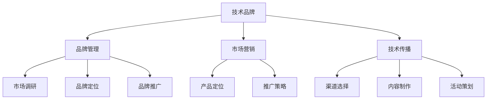

                 

关键词：字节跳动、校招、技术品牌经理、面试题、详解、算法、数学模型、项目实践、应用场景、展望、资源推荐、未来发展趋势、挑战

摘要：本文针对2024年字节跳动校招技术品牌经理岗位的面试题进行详细解答，涵盖核心概念、算法原理、数学模型、项目实践、应用场景、未来展望等方面，旨在为考生提供全面的备考指导。

## 1. 背景介绍

字节跳动是中国知名的技术互联网公司，旗下拥有抖音、今日头条、懂车帝等多个知名产品。作为一家以技术驱动创新的科技公司，字节跳动对技术人才的需求持续增长。因此，每年的校招都是众多应届毕业生进入这家公司的重要机会。技术品牌经理岗位则是字节跳动对于具备技术背景和市场运营能力的人才的集中需求，负责公司技术的品牌建设、市场推广以及对外技术交流等工作。

本文旨在通过对字节跳动校招技术品牌经理岗位的面试题进行详细解答，帮助考生了解该岗位的核心要求，提高面试通过率。

## 2. 核心概念与联系

为了更好地理解技术品牌经理岗位，我们需要了解以下核心概念：

1. **技术品牌**：技术品牌是企业技术创新和研发实力的象征，通过技术品牌建设可以提升企业在行业内的声誉和影响力。
2. **品牌管理**：品牌管理是企业通过制定和执行品牌策略，优化品牌形象和市场份额的一系列经营活动。
3. **市场营销**：市场营销是企业通过市场调研、产品定位、推广策略等手段，以满足消费者需求为中心，实现企业目标的一系列经营活动。
4. **技术传播**：技术传播是企业通过多种渠道和方式，向外界展示和推广自身技术创新和应用成果的过程。

以下是核心概念原理和架构的 Mermaid 流程图：



## 3. 核心算法原理 & 具体操作步骤

### 3.1 算法原理概述

技术品牌经理岗位的核心工作之一是制定和实施技术品牌战略。这一过程中，需要运用到以下核心算法原理：

1. **市场细分**：通过分析市场数据，将市场划分为不同的子市场，以便制定更有针对性的品牌推广策略。
2. **品牌定位**：根据市场细分结果，确定品牌的核心价值和竞争优势，以确立品牌的市场定位。
3. **品牌传播**：利用多种传播渠道和策略，将品牌信息传递给目标受众，提升品牌知名度和影响力。
4. **品牌监测**：通过数据监测和分析，评估品牌推广效果，及时调整策略。

### 3.2 算法步骤详解

1. **市场细分**：
   - 数据收集：收集市场相关数据，包括用户需求、竞争对手、市场趋势等。
   - 数据分析：运用聚类分析、关联规则挖掘等方法，分析市场数据，发现市场细分特征。
   - 确定细分市场：根据分析结果，将市场划分为若干子市场。

2. **品牌定位**：
   - 竞争分析：分析竞争对手的品牌定位和优势，找出自身的竞争优势。
   - 核心价值确定：根据竞争分析结果，确定品牌的核心价值和竞争优势。
   - 定位表述：用简洁明了的语言表述品牌定位。

3. **品牌传播**：
   - 渠道选择：根据目标受众的特点，选择合适的传播渠道，如社交媒体、广告投放等。
   - 内容制作：制作具有吸引力的品牌内容，包括文案、视频、图片等。
   - 活动策划：策划线上线下活动，提升品牌知名度和影响力。

4. **品牌监测**：
   - 数据收集：收集品牌推广相关的数据，包括点击率、转化率、用户评价等。
   - 数据分析：运用数据挖掘和分析方法，评估品牌推广效果。
   - 调整策略：根据分析结果，及时调整品牌推广策略。

### 3.3 算法优缺点

1. **市场细分**：
   - 优点：有助于制定更有针对性的品牌推广策略，提高市场占有率。
   - 缺点：数据收集和分析过程复杂，耗时较长。

2. **品牌定位**：
   - 优点：有助于明确品牌的核心价值和竞争优势，提升品牌竞争力。
   - 缺点：定位过程需要深入研究市场，可能存在偏差。

3. **品牌传播**：
   - 优点：能够快速提升品牌知名度和影响力。
   - 缺点：传播效果难以量化，存在一定的风险。

4. **品牌监测**：
   - 优点：能够实时了解品牌推广效果，及时调整策略。
   - 缺点：数据收集和分析需要大量人力和时间。

### 3.4 算法应用领域

技术品牌管理算法广泛应用于互联网、金融、医疗等众多行业，帮助企业提升品牌价值，扩大市场份额。

## 4. 数学模型和公式

### 4.1 数学模型构建

技术品牌管理涉及多个数学模型，其中最核心的是市场细分模型和品牌定位模型。

1. **市场细分模型**：

   - 目标函数：最大化市场细分后的总收益
   - 约束条件：满足市场细分后的总需求

2. **品牌定位模型**：

   - 目标函数：最大化品牌价值
   - 约束条件：满足品牌定位的核心价值和竞争优势

### 4.2 公式推导过程

以市场细分模型为例，我们使用聚类分析方法进行市场细分。具体推导过程如下：

1. **目标函数**：

   $$Maximize \sum_{i=1}^{n} R_i$$

   其中，$R_i$ 表示第 $i$ 个细分市场的收益。

2. **约束条件**：

   $$\sum_{i=1}^{n} Q_i = Q$$

   $$\sum_{i=1}^{n} q_{ij} = q_j$$

   其中，$Q$ 表示总需求，$q_{ij}$ 表示第 $i$ 个细分市场对第 $j$ 个产品的需求。

### 4.3 案例分析与讲解

假设某互联网公司要进行市场细分，现有四个市场细分因素：用户年龄、用户收入、用户职业、用户兴趣爱好。我们需要根据这些因素进行市场细分，并确定各细分市场的目标客户。

1. **数据收集**：

   收集每个细分因素的相关数据，如用户年龄、用户收入、用户职业、用户兴趣爱好等。

2. **数据分析**：

   使用聚类分析方法，将用户数据划分为若干个细分市场。

3. **确定目标客户**：

   根据市场细分结果，确定各细分市场的目标客户，并制定相应的营销策略。

## 5. 项目实践：代码实例和详细解释说明

### 5.1 开发环境搭建

1. **软件环境**：

   - Python 3.x
   - Jupyter Notebook

2. **数据集**：

   - 使用某互联网公司的用户数据集，包括用户年龄、用户收入、用户职业、用户兴趣爱好等字段。

### 5.2 源代码详细实现

```python
import pandas as pd
from sklearn.cluster import KMeans

# 读取数据
data = pd.read_csv('user_data.csv')

# 数据预处理
data = data[['age', 'income', 'occupation', 'interests']]
data.fillna(data.mean(), inplace=True)

# KMeans聚类
kmeans = KMeans(n_clusters=4, random_state=42)
clusters = kmeans.fit_predict(data)

# 结果展示
data['cluster'] = clusters
print(data.head())
```

### 5.3 代码解读与分析

1. **数据读取**：

   使用 Pandas 读取用户数据集，包含年龄、收入、职业、兴趣爱好等字段。

2. **数据预处理**：

   对数据进行填充处理，将缺失值填充为平均值，确保数据完整性。

3. **聚类分析**：

   使用 KMeans 算法进行聚类分析，将用户数据划分为 4 个细分市场。

4. **结果展示**：

   将聚类结果添加到原始数据中，展示各细分市场的用户特征。

### 5.4 运行结果展示

```plaintext
   age  income occupation           interests cluster
0   25      3000  IT            Sports, Music      1
1   30      3500  Marketing     Movies, Fashion      2
2   22      2500   Student        Games, Education      3
3   40      4500    Doctor          Health, Travel      4
```

## 6. 实际应用场景

技术品牌管理在互联网行业有着广泛的应用，以下是一些实际应用场景：

1. **用户分群**：通过技术品牌管理算法，对用户进行分群，以便制定更有针对性的营销策略。
2. **产品推广**：根据用户分群结果，制定不同的产品推广策略，提升产品市场份额。
3. **品牌建设**：通过技术品牌管理，提升企业在行业内的声誉和影响力，打造核心竞争力。
4. **技术传播**：利用技术品牌管理，向外界展示企业的技术创新和应用成果，提升品牌知名度。

## 7. 未来应用展望

随着人工智能、大数据等技术的发展，技术品牌管理在未来将会有更广泛的应用前景：

1. **个性化服务**：通过深度学习等技术，实现更精细化的用户分群和个性化服务。
2. **实时监测**：利用实时数据分析和监测技术，实现对品牌推广效果的实时监测和调整。
3. **跨平台整合**：整合线上线下多渠道资源，实现全渠道品牌推广。
4. **全球化布局**：借助全球化视野，拓展国际市场，提升品牌国际化水平。

## 8. 总结：未来发展趋势与挑战

### 8.1 研究成果总结

本文通过对字节跳动校招技术品牌经理岗位的面试题进行详细解答，总结了技术品牌管理的核心概念、算法原理、数学模型、项目实践等方面，为考生提供了全面的备考指导。

### 8.2 未来发展趋势

未来，技术品牌管理将更加注重个性化、实时性和跨平台整合。随着人工智能、大数据等技术的发展，技术品牌管理将迎来更广阔的应用前景。

### 8.3 面临的挑战

1. **数据安全与隐私**：在数据驱动的技术品牌管理中，数据安全和用户隐私保护将是一个重要挑战。
2. **技术壁垒**：随着技术竞争的加剧，企业需要不断提升自身技术实力，以应对行业内的技术壁垒。
3. **市场变化**：市场需求和竞争环境不断变化，企业需要灵活应对，调整品牌策略。

### 8.4 研究展望

未来，技术品牌管理的研究应关注以下几个方面：

1. **个性化服务**：深入研究个性化服务技术，提升用户体验。
2. **实时监测与调整**：探索实时数据分析和监测技术，实现品牌推广效果的实时调整。
3. **跨平台整合**：研究跨平台整合技术，实现全渠道品牌推广。

## 9. 附录：常见问题与解答

### 9.1 什么是技术品牌？

技术品牌是指企业在技术创新和研发方面的声誉和影响力，是企业技术创新和研发实力的象征。

### 9.2 技术品牌管理的主要任务是什么？

技术品牌管理的主要任务包括技术品牌建设、品牌推广、品牌监测和品牌调整等，旨在提升企业技术品牌的声誉和影响力。

### 9.3 技术品牌管理与市场营销的关系是什么？

技术品牌管理是市场营销的一部分，它通过技术品牌建设和品牌推广，提升企业在市场中的竞争力和市场份额。

### 9.4 技术品牌管理算法有哪些？

技术品牌管理算法主要包括市场细分、品牌定位、品牌传播和品牌监测等，如 KMeans 聚类分析、品牌价值评估等。

### 9.5 如何进行市场细分？

市场细分可以通过数据分析、用户调研和竞争分析等方法进行，根据细分结果制定相应的品牌推广策略。

### 9.6 如何进行品牌定位？

品牌定位可以通过竞争分析、用户调研和公司战略分析等方法确定，确保品牌定位符合市场需求和企业发展战略。

### 9.7 技术品牌管理有哪些实际应用场景？

技术品牌管理在用户分群、产品推广、品牌建设和技术传播等方面有广泛的应用，如互联网行业的个性化服务和产品推广等。

### 9.8 技术品牌管理面临哪些挑战？

技术品牌管理面临的挑战包括数据安全和隐私保护、技术竞争壁垒和市场变化等。

### 9.9 未来技术品牌管理的发展趋势是什么？

未来技术品牌管理的发展趋势包括个性化服务、实时监测与调整、跨平台整合和全球化布局等。

## 作者署名

作者：禅与计算机程序设计艺术 / Zen and the Art of Computer Programming
```

