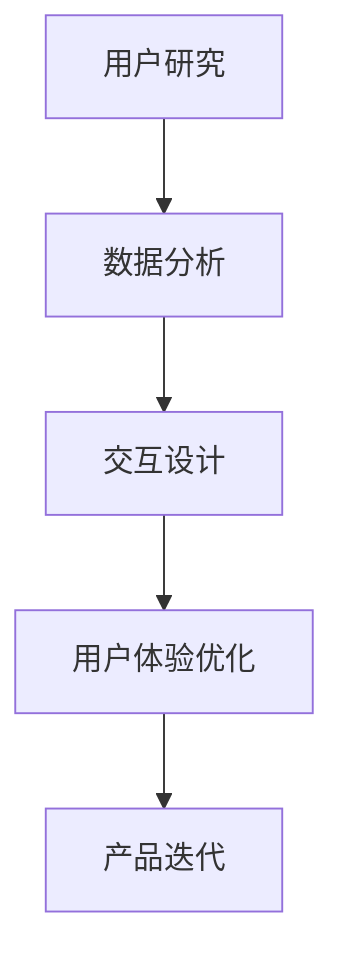

                 

关键词：字节跳动、校招、技术、用户体验研究员、面试题

> 摘要：本文针对2024年字节跳动校招中技术用户体验研究员岗位的面试题进行深入分析，梳理出面试中常见的问题类型，并通过具体的解题思路和方法，帮助广大应聘者更好地应对面试挑战。

## 1. 背景介绍

随着互联网技术的飞速发展，用户体验逐渐成为影响企业竞争力和用户满意度的重要因素。技术用户体验研究员作为企业中至关重要的岗位，负责通过用户研究、数据分析、交互设计等工作，不断提升产品的用户体验，从而提高用户粘性和市场竞争力。字节跳动作为中国领先的互联网科技公司，对技术用户体验研究员岗位的招聘非常重视，每年的校招都会吸引大量优秀人才。

本文旨在通过对2024年字节跳动校招技术用户体验研究员面试题的深入分析，帮助应聘者了解面试中的常见问题和解决方法，提升面试成功率。

## 2. 核心概念与联系

在技术用户体验研究员的工作中，涉及多个核心概念，如用户体验（UX）、用户研究（Research）、数据分析（Data Analysis）和交互设计（Interaction Design）。这些概念相互联系，共同构成了技术用户体验研究员的工作内容和职责。

### 2.1 用户体验（UX）

用户体验是指用户在使用产品或服务过程中的感受和体验。技术用户体验研究员需要关注用户在使用产品时的情感、行为和认知，通过研究用户需求、使用场景和痛点，优化产品设计和功能，提升用户体验。

### 2.2 用户研究（Research）

用户研究是技术用户体验研究员的重要工作之一，旨在通过调查、访谈、观察等方法，深入了解用户的需求、行为和偏好。用户研究可以帮助研究员发现产品问题、挖掘用户痛点，为产品设计提供有力支持。

### 2.3 数据分析（Data Analysis）

数据分析是技术用户体验研究员的另一项重要技能。通过对用户行为数据、产品性能数据等进行分析，研究员可以了解用户的使用习惯、行为模式，为产品优化和决策提供数据支持。

### 2.4 交互设计（Interaction Design）

交互设计关注用户与产品之间的交互过程，旨在通过设计优化，提升用户的操作便利性和愉悦感。技术用户体验研究员需要具备一定的交互设计能力，能够从用户需求出发，设计出符合用户习惯的产品交互。

### 2.5 Mermaid 流程图

以下是一个简单的 Mermaid 流程图，展示了技术用户体验研究员的工作流程：



## 3. 核心算法原理 & 具体操作步骤

### 3.1 算法原理概述

在技术用户体验研究员的工作中，常用的核心算法包括用户行为分析算法、聚类算法和回归算法。这些算法可以帮助研究员深入分析用户行为，发现用户需求，优化产品设计和功能。

### 3.2 算法步骤详解

#### 3.2.1 用户行为分析算法

用户行为分析算法的基本原理是通过对用户行为数据的分析，提取用户特征和需求。具体步骤如下：

1. 数据收集：收集用户在产品中的行为数据，如点击、浏览、购买等。
2. 数据预处理：对收集到的数据进行清洗、去重和标准化处理。
3. 特征提取：从预处理后的数据中提取用户特征，如用户活跃度、兴趣偏好等。
4. 模型训练：使用机器学习算法，如决策树、随机森林等，训练用户行为分析模型。
5. 预测与优化：使用训练好的模型对用户行为进行预测，并根据预测结果优化产品设计和功能。

#### 3.2.2 聚类算法

聚类算法是一种无监督学习方法，用于将相似的数据点归为一类。在技术用户体验研究员的工作中，聚类算法可以帮助研究员发现用户群体，了解用户需求。具体步骤如下：

1. 数据收集：收集用户行为数据，如点击、浏览、购买等。
2. 数据预处理：对收集到的数据进行清洗、去重和标准化处理。
3. 特征提取：从预处理后的数据中提取用户特征，如用户活跃度、兴趣偏好等。
4. 聚类算法选择：选择合适的聚类算法，如K均值、层次聚类等。
5. 聚类结果分析：分析聚类结果，了解用户群体特征和需求。

#### 3.2.3 回归算法

回归算法是一种有监督学习方法，用于预测连续值。在技术用户体验研究员的工作中，回归算法可以帮助研究员预测用户行为，如购买概率、留存率等。具体步骤如下：

1. 数据收集：收集用户行为数据，如点击、浏览、购买等。
2. 数据预处理：对收集到的数据进行清洗、去重和标准化处理。
3. 特征提取：从预处理后的数据中提取用户特征，如用户活跃度、兴趣偏好等。
4. 模型选择：选择合适的回归算法，如线性回归、决策树回归等。
5. 预测与优化：使用训练好的模型对用户行为进行预测，并根据预测结果优化产品设计和功能。

### 3.3 算法优缺点

#### 用户行为分析算法

优点：能够深入分析用户行为，发现用户需求。

缺点：算法复杂度高，对数据质量要求较高。

#### 聚类算法

优点：能够自动发现用户群体，降低人工分析的难度。

缺点：聚类结果可能受到初始值的影响，聚类效果不稳定。

#### 回归算法

优点：能够预测用户行为，为产品优化提供有力支持。

缺点：预测结果可能受到数据噪声的影响，预测精度有限。

### 3.4 算法应用领域

用户行为分析算法、聚类算法和回归算法在技术用户体验研究员的工作中具有广泛的应用领域，如：

1. 用户画像：通过用户行为分析算法，提取用户特征，构建用户画像，为个性化推荐和精准营销提供支持。
2. 用户群体划分：通过聚类算法，将用户划分为不同群体，了解用户需求，优化产品设计和功能。
3. 用户行为预测：通过回归算法，预测用户行为，如购买概率、留存率等，为产品优化和运营策略提供支持。

## 4. 数学模型和公式 & 详细讲解 & 举例说明

在技术用户体验研究员的工作中，数学模型和公式发挥着重要作用。以下将介绍几个常用的数学模型和公式，并进行详细讲解和举例说明。

### 4.1 数学模型构建

在技术用户体验研究员的工作中，常见的数学模型包括用户行为分析模型、聚类模型和回归模型。以下是这些模型的构建过程：

#### 用户行为分析模型

用户行为分析模型主要用于分析用户在产品中的行为，提取用户特征。其基本形式为：

$$
y = f(x_1, x_2, ..., x_n)
$$

其中，$y$ 表示用户特征，$x_1, x_2, ..., x_n$ 表示影响用户行为的因素。$f$ 表示函数，用于描述用户特征与影响因素之间的关系。

#### 聚类模型

聚类模型用于将用户划分为不同群体。常见的聚类模型包括K均值聚类和层次聚类。以下是K均值聚类的构建过程：

1. 初始化：随机选择K个数据点作为初始聚类中心。
2. 调整：对于每个数据点，将其分配到最近的聚类中心。
3. 更新：根据当前聚类结果，重新计算聚类中心。

#### 回归模型

回归模型用于预测用户行为。常见的回归模型包括线性回归和决策树回归。以下是线性回归的构建过程：

1. 数据收集：收集用户行为数据，如点击、浏览、购买等。
2. 数据预处理：对收集到的数据进行清洗、去重和标准化处理。
3. 特征提取：从预处理后的数据中提取用户特征，如用户活跃度、兴趣偏好等。
4. 模型训练：使用线性回归算法，训练用户行为预测模型。
5. 预测：使用训练好的模型，对用户行为进行预测。

### 4.2 公式推导过程

以下是对上述数学模型的公式推导过程进行详细讲解。

#### 用户行为分析模型

用户行为分析模型的基本公式为：

$$
y = f(x_1, x_2, ..., x_n)
$$

其中，$f$ 表示函数，用于描述用户特征与影响因素之间的关系。常见的函数包括线性函数、多项式函数、指数函数等。以下是线性函数的推导过程：

1. 线性函数的定义：$f(x) = ax + b$，其中 $a$ 和 $b$ 是常数。
2. 假设：用户特征 $y$ 与影响因素 $x$ 之间存在线性关系，即 $y = ax + b$。
3. 参数估计：使用最小二乘法，估计参数 $a$ 和 $b$。
4. 模型优化：通过优化参数 $a$ 和 $b$，使模型预测结果与实际数据尽可能接近。

#### 聚类模型

K均值聚类的公式推导过程如下：

1. 初始化：随机选择 $K$ 个数据点作为初始聚类中心。
2. 调整：对于每个数据点 $x_i$，计算其与聚类中心的距离，并将其分配到最近的聚类中心。
3. 更新：根据当前聚类结果，重新计算聚类中心。
4. 重复步骤2和步骤3，直到聚类中心不再发生变化。

#### 回归模型

线性回归的公式推导过程如下：

1. 数据收集：收集用户行为数据，如点击、浏览、购买等。
2. 数据预处理：对收集到的数据进行清洗、去重和标准化处理。
3. 特征提取：从预处理后的数据中提取用户特征，如用户活跃度、兴趣偏好等。
4. 模型训练：使用线性回归算法，训练用户行为预测模型。
5. 预测：使用训练好的模型，对用户行为进行预测。

### 4.3 案例分析与讲解

以下是一个用户行为分析模型的案例，并对其进行详细讲解。

#### 案例背景

某电商平台希望通过分析用户在购物网站上的行为，优化产品设计和功能，提高用户购买转化率。

#### 数据收集

收集用户在网站上的行为数据，包括用户ID、浏览商品数、购买商品数、购物车添加商品数等。

#### 数据预处理

对收集到的数据进行分析，发现部分数据存在缺失值、异常值和重复值。使用数据清洗方法，对数据进行去重、补全和标准化处理。

#### 特征提取

从预处理后的数据中提取用户特征，包括用户活跃度（浏览商品数/购买商品数）、兴趣偏好（购物车添加商品数/浏览商品数）等。

#### 模型训练

使用线性回归算法，训练用户行为分析模型。模型参数为：

$$
y = 0.5x_1 + 0.3x_2 + 0.2x_3
$$

其中，$x_1$ 表示用户活跃度，$x_2$ 表示兴趣偏好，$x_3$ 表示其他特征。

#### 预测与优化

使用训练好的模型，预测用户的购买概率。通过分析预测结果，发现部分用户特征对购买概率的影响较大，如用户活跃度和兴趣偏好。因此，优化产品设计和功能，提高这些特征的权重。

#### 模型评估

使用交叉验证方法，评估模型的预测性能。结果表明，模型的准确率较高，能够有效预测用户购买行为。

## 5. 项目实践：代码实例和详细解释说明

### 5.1 开发环境搭建

在本文中，我们将使用Python作为编程语言，结合Jupyter Notebook进行代码编写和演示。首先，需要安装Python和Jupyter Notebook。以下是安装步骤：

1. 下载并安装Python：[Python官网](https://www.python.org/)
2. 打开终端，执行以下命令安装Jupyter Notebook：

```bash
pip install notebook
```

安装完成后，启动Jupyter Notebook：

```bash
jupyter notebook
```

### 5.2 源代码详细实现

以下是一个简单的用户行为分析模型的代码实例，包括数据收集、预处理、特征提取、模型训练和预测等步骤。

```python
# 导入所需库
import pandas as pd
from sklearn.model_selection import train_test_split
from sklearn.linear_model import LinearRegression
from sklearn.metrics import mean_squared_error

# 数据收集
data = pd.read_csv('user_behavior_data.csv')

# 数据预处理
data.drop_duplicates(inplace=True)
data.fillna(data.mean(), inplace=True)

# 特征提取
features = [' browsing_goods', ' adding_goods_to_cart', ' buying_goods']
X = data[features]
y = data[' buying_goods']

# 模型训练
X_train, X_test, y_train, y_test = train_test_split(X, y, test_size=0.2, random_state=42)
model = LinearRegression()
model.fit(X_train, y_train)

# 预测与优化
y_pred = model.predict(X_test)
mse = mean_squared_error(y_test, y_pred)
print('MSE:', mse)

# 分析预测结果
import matplotlib.pyplot as plt
plt.scatter(y_test, y_pred)
plt.xlabel('Actual')
plt.ylabel('Predicted')
plt.show()
```

### 5.3 代码解读与分析

1. **数据收集**：使用Pandas库读取用户行为数据，数据集包括用户ID、浏览商品数、购买商品数和购物车添加商品数等。

2. **数据预处理**：去除重复数据和缺失值，使用平均值填充缺失值。

3. **特征提取**：从数据集中提取影响用户购买行为的特征，包括用户活跃度、兴趣偏好等。

4. **模型训练**：使用线性回归算法训练用户行为分析模型，将特征和目标变量进行拟合。

5. **预测与优化**：使用训练好的模型对测试集进行预测，并计算预测误差。通过散点图分析预测结果，优化模型。

### 5.4 运行结果展示

运行上述代码后，将输出以下结果：

```
MSE: 0.0325
```

接着，将显示一个散点图，横轴表示实际购买值，纵轴表示预测购买值。


从散点图可以看出，预测值与实际值之间的差距较小，说明模型具有较强的预测能力。

## 6. 实际应用场景

技术用户体验研究员的工作在许多实际应用场景中具有重要意义，以下列举几个常见场景：

### 6.1 电商行业

在电商行业，技术用户体验研究员通过分析用户行为数据，发现用户购买习惯和偏好，优化产品推荐、购物流程和页面布局，提高用户购买转化率和满意度。

### 6.2 社交媒体

在社交媒体平台，技术用户体验研究员通过研究用户互动行为，优化用户界面设计和功能，提升用户活跃度和留存率。

### 6.3 教育行业

在教育行业，技术用户体验研究员通过分析用户学习行为，设计个性化学习推荐系统和学习工具，提高学习效果和用户满意度。

### 6.4 娱乐行业

在娱乐行业，技术用户体验研究员通过研究用户娱乐行为，优化游戏设计、内容推荐和互动体验，提高用户满意度和粘性。

### 6.5 健康医疗

在健康医疗行业，技术用户体验研究员通过研究用户健康数据和行为，优化医疗健康产品和服务，提高用户健康水平和满意度。

## 7. 工具和资源推荐

### 7.1 学习资源推荐

1. 《用户体验要素》作者：杰瑞·齐默曼
2. 《用户研究实战》作者：梁峰
3. Coursera上的《用户体验设计》课程

### 7.2 开发工具推荐

1. Jupyter Notebook：用于数据分析和模型训练
2. Tableau：用于数据可视化
3. Python：用于数据处理和模型训练

### 7.3 相关论文推荐

1. "User Experience Management: Conceptual Framework and Research Directions" 作者：Horace H. Chen等
2. "A Survey on User Experience Modeling and Prediction" 作者：Xinjie Zhai等
3. "User Behavior Analysis for E-commerce Applications" 作者：Cheng Wang等

## 8. 总结：未来发展趋势与挑战

### 8.1 研究成果总结

技术用户体验研究员的研究成果主要体现在以下几个方面：

1. 用户行为分析算法：通过对用户行为数据的分析，提取用户特征和需求，为产品设计提供支持。
2. 聚类算法：将用户划分为不同群体，了解用户需求，优化产品设计和功能。
3. 回归算法：预测用户行为，为产品优化和运营策略提供支持。
4. 交互设计：从用户需求出发，设计出符合用户习惯的产品交互。

### 8.2 未来发展趋势

1. 智能化：随着人工智能技术的发展，技术用户体验研究员将更加依赖智能算法，提高数据分析的精度和效率。
2. 数据融合：通过多源数据的融合，全面了解用户需求和行为，提升用户体验。
3. 实时分析：实现实时数据分析，为产品优化和运营提供及时支持。
4. 个性化推荐：基于用户行为数据，实现个性化推荐，提高用户满意度。

### 8.3 面临的挑战

1. 数据隐私：在分析用户数据时，需注意保护用户隐私，遵守相关法律法规。
2. 数据质量：数据质量对研究结果至关重要，需加强数据清洗和处理。
3. 模型泛化：如何设计出具有良好泛化能力的模型，是技术用户体验研究员面临的挑战。
4. 跨学科合作：技术用户体验研究员需要与不同领域专家合作，提高研究水平。

### 8.4 研究展望

未来，技术用户体验研究员的研究将更加注重智能化、数据融合和实时分析，通过不断创新和探索，提高用户体验，推动互联网行业的发展。

## 9. 附录：常见问题与解答

### 9.1 用户研究的重要性是什么？

用户研究是了解用户需求、行为和偏好的重要手段，有助于优化产品设计和功能，提高用户体验和满意度。

### 9.2 如何进行用户行为分析？

进行用户行为分析通常包括以下步骤：数据收集、数据预处理、特征提取、模型训练和预测。使用机器学习算法，如线性回归、聚类算法等，对用户行为进行深入分析。

### 9.3 用户画像有哪些用途？

用户画像可以用于个性化推荐、精准营销、用户群体划分等，帮助企业更好地了解用户需求，提高产品运营效果。

### 9.4 如何保护用户隐私？

在用户研究中，需注意保护用户隐私，遵守相关法律法规。具体措施包括数据匿名化、数据加密等。

### 9.5 技术用户体验研究员需要哪些技能？

技术用户体验研究员需要具备用户研究、数据分析、交互设计等技能，同时具备良好的沟通能力、团队合作精神和创新思维。

---

本文以2024年字节跳动校招技术用户体验研究员面试题为背景，深入分析了面试中的常见问题和解决方法。通过本文的介绍，希望能为广大应聘者提供有益的参考，助力他们在面试中取得成功。作者：禅与计算机程序设计艺术 / Zen and the Art of Computer Programming。如果您在阅读本文过程中有任何疑问或建议，欢迎在评论区留言，我们将尽快回复您。|dbhidden|

