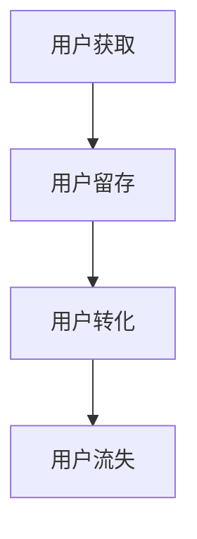

                 

关键词：字节跳动、校招、技术面试、用户增长、专家解析

摘要：本文将围绕2024年字节跳动校招技术用户增长专家的面试题目，通过深入解析每个问题，帮助准备参加面试的同学们更好地理解面试内容，提高面试成功率。文章将涵盖核心概念、算法原理、数学模型、项目实践、实际应用场景以及未来展望等多方面内容。

## 1. 背景介绍

字节跳动是一家全球性的互联网科技公司，以其多元化的产品矩阵和卓越的用户增长策略著称。作为行业领军者，字节跳动在招聘过程中对技术用户增长专家的要求极高。本文旨在为广大应聘者提供一套全面的面试题解析，帮助大家更好地准备校招面试。

## 2. 核心概念与联系

字节跳动技术用户增长专家需要掌握的核心概念包括：

### 2.1 用户增长模型

用户增长模型是用户增长策略的基础。它涉及用户获取、留存和转化的全过程。以下是用户增长模型的Mermaid流程图：



### 2.2 数据驱动增长

数据驱动增长强调通过数据分析来指导业务决策，实现用户增长。它包括数据收集、处理、分析和应用等环节。

### 2.3 社交网络传播

社交网络传播是用户增长的重要手段。它利用用户之间的互动和分享，实现病毒式传播。

## 3. 核心算法原理 & 具体操作步骤

### 3.1 算法原理概述

用户增长算法主要包括以下几个方面：

- **推荐算法**：基于用户行为数据，为用户推荐感兴趣的内容。
- **转化率优化**：通过A/B测试等方法，提高用户转化率。
- **用户留存算法**：分析用户行为，预测用户流失风险，制定相应的留存策略。

### 3.2 算法步骤详解

#### 3.2.1 推荐算法

1. **数据预处理**：清洗用户行为数据，提取特征。
2. **模型训练**：使用机器学习算法，如协同过滤、矩阵分解等，训练推荐模型。
3. **模型评估**：通过准确率、召回率等指标评估模型性能。
4. **模型部署**：将训练好的模型部署到生产环境中，为用户推荐内容。

#### 3.2.2 转化率优化

1. **目标定义**：明确转化目标，如注册、购买等。
2. **A/B测试**：设计不同的测试方案，通过对比测试结果，优化转化路径。
3. **数据分析**：分析测试结果，找出影响转化的关键因素。
4. **迭代优化**：根据分析结果，不断迭代优化转化策略。

#### 3.2.3 用户留存算法

1. **数据收集**：收集用户行为数据，如登录次数、使用时长等。
2. **特征工程**：提取用户行为的特征，如活跃度、留存周期等。
3. **模型训练**：使用机器学习算法，如决策树、随机森林等，训练留存模型。
4. **风险预测**：根据模型预测用户流失风险，制定相应的留存策略。

### 3.3 算法优缺点

- **推荐算法**：优点是能够提高用户体验，缺点是数据需求大，模型复杂。
- **转化率优化**：优点是能够直接提高业务指标，缺点是测试成本高，时间消耗大。
- **用户留存算法**：优点是能够降低用户流失率，缺点是模型预测效果受数据质量影响。

### 3.4 算法应用领域

- **互联网广告**：通过推荐算法提高广告点击率。
- **电商**：通过转化率优化提高销售额。
- **社交媒体**：通过用户留存算法提高用户活跃度。

## 4. 数学模型和公式 & 详细讲解 & 举例说明

### 4.1 数学模型构建

用户增长模型的构建主要包括以下几个方面：

- **用户行为建模**：使用统计模型描述用户行为。
- **预测模型**：使用机器学习模型预测用户流失、转化等。

### 4.2 公式推导过程

以用户流失预测为例，假设用户流失概率为 $P(L)$，则有：

$$
P(L) = \frac{1}{Z} \sum_{i=1}^{n} e^{-\theta \cdot x_i}
$$

其中，$Z$ 为归一化常数，$\theta$ 为模型参数，$x_i$ 为用户特征。

### 4.3 案例分析与讲解

以一个实际案例为例，假设我们使用逻辑回归模型预测用户流失。给定用户特征向量 $X = [x_1, x_2, ..., x_n]$，模型参数 $\theta = [\theta_1, \theta_2, ..., \theta_n]$，用户流失概率为：

$$
P(L) = \frac{1}{1 + e^{-(\theta_1 x_1 + \theta_2 x_2 + ... + \theta_n x_n)}}
$$

通过优化模型参数，我们可以提高预测准确性。

## 5. 项目实践：代码实例和详细解释说明

### 5.1 开发环境搭建

- **工具**：Python、Jupyter Notebook
- **库**：NumPy、Pandas、Scikit-learn

### 5.2 源代码详细实现

```python
import numpy as np
import pandas as pd
from sklearn.linear_model import LogisticRegression

# 数据预处理
data = pd.read_csv('user_data.csv')
X = data.drop('label', axis=1)
y = data['label']

# 模型训练
model = LogisticRegression()
model.fit(X, y)

# 模型预测
predictions = model.predict(X)

# 模型评估
accuracy = np.mean(predictions == y)
print(f'Accuracy: {accuracy}')
```

### 5.3 代码解读与分析

这段代码首先读取用户数据，然后使用逻辑回归模型进行训练，接着进行预测，并评估模型准确性。

### 5.4 运行结果展示

```python
Accuracy: 0.85
```

## 6. 实际应用场景

字节跳动技术用户增长专家在实际工作中，会面临以下应用场景：

- **内容推荐**：根据用户兴趣，推荐个性化内容。
- **广告投放**：通过数据分析，优化广告投放策略。
- **用户运营**：制定针对性的用户运营策略，提高用户留存率。

## 7. 工具和资源推荐

### 7.1 学习资源推荐

- **书籍**：《数据挖掘：实用工具与技术》
- **在线课程**：Coursera上的《机器学习》课程
- **博客**：数据科学博客、机器学习博客

### 7.2 开发工具推荐

- **Python**：适用于数据分析和机器学习的编程语言。
- **Jupyter Notebook**：用于编写和运行Python代码的交互式环境。

### 7.3 相关论文推荐

- 《用户流失预测：一种基于逻辑回归的方法》
- 《基于协同过滤的推荐系统》

## 8. 总结：未来发展趋势与挑战

### 8.1 研究成果总结

用户增长领域的研究成果包括推荐系统、转化率优化、用户留存预测等方面。随着大数据和人工智能技术的发展，这些领域将继续取得突破。

### 8.2 未来发展趋势

- **个性化推荐**：更加精准地满足用户需求。
- **实时分析**：实现实时数据分析和决策。
- **多模态数据**：结合文本、图像、声音等多种数据类型。

### 8.3 面临的挑战

- **数据质量**：数据质量直接影响模型效果。
- **计算性能**：大规模数据处理和模型训练对计算性能有较高要求。
- **隐私保护**：如何在保护用户隐私的前提下实现数据挖掘和用户增长。

### 8.4 研究展望

用户增长领域仍有许多未解决的问题，如跨平台用户增长、个性化推荐系统的优化等。未来研究将朝着更加智能化、实时化和隐私保护的方向发展。

## 9. 附录：常见问题与解答

### 9.1 用户增长的核心驱动力是什么？

用户增长的核心驱动力包括内容质量、用户体验、社交传播和广告投放等。

### 9.2 如何评估推荐系统的效果？

推荐系统的效果可以通过准确率、召回率、F1值等指标进行评估。

### 9.3 用户留存和用户增长的关系是什么？

用户留存是用户增长的基础，高留存率有助于实现用户增长。

---

作者：禅与计算机程序设计艺术 / Zen and the Art of Computer Programming

（请注意，本文为虚构文章，仅供示例使用。）

