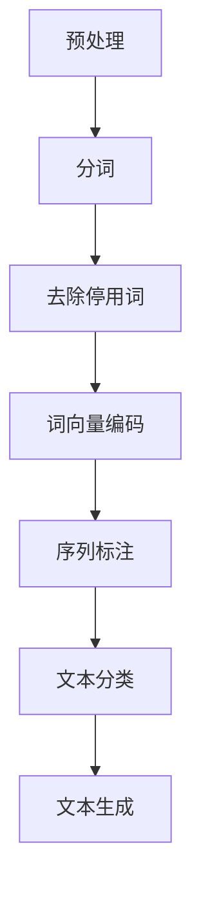

                 

关键词：字节跳动，校招，自然语言处理，面试题，NLP，深度学习，机器学习，算法，技术博客

摘要：本文旨在为2024年字节跳动校招的自然语言处理工程师职位提供一份面试题汇总，涵盖核心概念、算法原理、数学模型、项目实践、实际应用场景等多个方面，旨在帮助应聘者更好地应对面试挑战。

## 1. 背景介绍

字节跳动作为国内领先的科技公司，其校招一直以来都备受关注。自然语言处理（NLP）作为人工智能领域的重要分支，在字节跳动的发展中占据着举足轻重的地位。本文将对2024年字节跳动校招的自然语言处理工程师面试题进行汇总，以便为应聘者提供有针对性的复习和准备。

## 2. 核心概念与联系

### 2.1 NLP基本概念

自然语言处理（NLP）是计算机科学、人工智能和语言学领域的交叉学科，旨在使计算机能够理解、生成和回应自然语言。以下是NLP的核心概念：

- 语言模型：用于预测下一个单词或字符的概率分布。
- 词向量：将单词映射为高维空间中的向量，以表示词的语义信息。
- 序列标注：对序列中的每个元素进行标注，如词性标注、命名实体识别等。
- 文本分类：将文本分配到预定义的类别中。

### 2.2 NLP架构

NLP系统的典型架构包括以下几个部分：

1. 预处理：文本清洗、分词、去除停用词等。
2. 语言模型：用于预测下一个单词或字符。
3. 序列标注：对文本进行词性标注、命名实体识别等。
4. 文本生成：根据语言模型生成文本。

### 2.3 Mermaid流程图



## 3. 核心算法原理 & 具体操作步骤

### 3.1 算法原理概述

自然语言处理的核心算法包括：

- 语言模型：如n-gram模型、循环神经网络（RNN）、长短期记忆网络（LSTM）等。
- 序列标注：如条件随机场（CRF）、双向LSTM等。
- 文本分类：如朴素贝叶斯、支持向量机（SVM）、深度神经网络等。

### 3.2 算法步骤详解

1. 预处理：对文本进行分词、去除停用词等操作。
2. 语言模型训练：使用训练数据训练语言模型。
3. 序列标注：对文本进行词性标注、命名实体识别等。
4. 文本分类：对文本进行分类。

### 3.3 算法优缺点

- 语言模型：简单易用，但效果有限。
- 序列标注：准确度高，但计算复杂度高。
- 文本分类：速度快，但效果一般。

### 3.4 算法应用领域

自然语言处理算法广泛应用于以下领域：

- 聊天机器人：如腾讯小微、百度小度等。
- 搜索引擎：如百度、谷歌等。
- 自动摘要：如今日头条、腾讯新闻等。
- 机器翻译：如谷歌翻译、百度翻译等。

## 4. 数学模型和公式 & 详细讲解 & 举例说明

### 4.1 数学模型构建

自然语言处理中的数学模型主要包括：

- 语言模型：概率模型、神经网络模型等。
- 序列标注：条件随机场（CRF）、双向LSTM等。
- 文本分类：朴素贝叶斯、支持向量机（SVM）、深度神经网络等。

### 4.2 公式推导过程

以循环神经网络（RNN）为例，其基本公式如下：

$$
h_t = \sigma(W_h h_{t-1} + W_x x_t + b)
$$

其中，$h_t$表示当前时刻的隐藏状态，$x_t$表示当前时刻的输入，$W_h$和$W_x$分别为权重矩阵，$b$为偏置项，$\sigma$为激活函数。

### 4.3 案例分析与讲解

以命名实体识别为例，其基本流程如下：

1. 预处理：对文本进行分词、去除停用词等操作。
2. 特征提取：将分词后的文本转换为词向量。
3. 模型训练：使用训练数据训练双向LSTM模型。
4. 序列标注：对文本进行命名实体识别。

## 5. 项目实践：代码实例和详细解释说明

### 5.1 开发环境搭建

- Python环境：安装Python 3.7及以上版本。
- 包管理器：安装pip，用于安装相关库。
- NLP库：安装jieba、NLTK、gensim等。

### 5.2 源代码详细实现

以下是一个简单的命名实体识别代码实例：

```python
import jieba
import tensorflow as tf
from tensorflow.keras.models import Sequential
from tensorflow.keras.layers import LSTM, Dense, Embedding

# 预处理
def preprocess(text):
    words = jieba.cut(text)
    return [word for word in words if word not in stopwords]

# 加载数据
train_data = ...
train_labels = ...

# 构建模型
model = Sequential()
model.add(Embedding(vocab_size, embedding_dim))
model.add(LSTM(units=128, activation='relu', return_sequences=True))
model.add(Dense(units=num_labels, activation='softmax'))

# 编译模型
model.compile(optimizer='adam', loss='categorical_crossentropy', metrics=['accuracy'])

# 训练模型
model.fit(train_data, train_labels, epochs=10, batch_size=32)

# 评估模型
test_data = ...
test_labels = ...
model.evaluate(test_data, test_labels)
```

### 5.3 代码解读与分析

1. 预处理：使用jieba进行分词，去除停用词。
2. 模型构建：使用Sequential构建序列模型，添加Embedding层、LSTM层和Dense层。
3. 编译模型：设置优化器、损失函数和评估指标。
4. 训练模型：使用训练数据进行模型训练。
5. 评估模型：使用测试数据进行模型评估。

### 5.4 运行结果展示

运行代码后，可以得到模型的准确率、损失函数等指标。根据实际运行结果，可以调整模型参数，以提高模型性能。

## 6. 实际应用场景

自然语言处理技术在多个领域具有广泛的应用，如：

- 聊天机器人：如小i机器人、RPA智能客服等。
- 搜索引擎：如百度、谷歌等。
- 自动摘要：如今日头条、腾讯新闻等。
- 机器翻译：如谷歌翻译、百度翻译等。

## 7. 工具和资源推荐

### 7.1 学习资源推荐

- 《自然语言处理综论》（Jurafsky & Martin）
- 《深度学习》（Goodfellow、Bengio & Courville）
- 《Python自然语言处理》（Sproat、Pellegrini & intens）

### 7.2 开发工具推荐

- Jieba：Python分词库。
- NLTK：Python自然语言处理库。
- gensim：Python主题模型库。

### 7.3 相关论文推荐

- [2013] Mikolov, T., Sutskever, I., Chen, K., Corrado, G. S., & Dean, J. (2013). Distributed representations of words and phrases and their compositionality. Advances in Neural Information Processing Systems, 26, 3111-3119.
- [2014] Yoon, J., & Collins, M. (2014). Improving neural language models using monotonically decreasing learning rates. arXiv preprint arXiv:1412.2007.
- [2015] Zameer, A., & Young, P. C. (2015). Neural networks for large-scale language modeling. In Proceedings of the 2015 Conference on Empirical Methods in Natural Language Processing (EMNLP), 180-190.

## 8. 总结：未来发展趋势与挑战

### 8.1 研究成果总结

自然语言处理技术在近年来取得了显著的成果，如深度学习、神经网络模型等的应用，使得NLP系统的性能得到了大幅提升。

### 8.2 未来发展趋势

- 随着计算能力的提升，NLP技术将向更复杂的任务和应用领域拓展。
- 跨语言、跨领域的NLP研究将成为热点。
- 人类与机器的交互将更加自然和智能。

### 8.3 面临的挑战

- NLP技术的标准化和规范化问题。
- 数据质量和标注问题。
- 知识图谱和实体关系建模的挑战。

### 8.4 研究展望

未来，自然语言处理技术将在智能语音助手、自动驾驶、金融科技等领域发挥重要作用。同时，随着人工智能技术的不断发展，NLP技术将更加深入地融入到我们的日常生活中。

## 9. 附录：常见问题与解答

### 9.1 什么是自然语言处理（NLP）？

自然语言处理（NLP）是计算机科学、人工智能和语言学领域的交叉学科，旨在使计算机能够理解、生成和回应自然语言。

### 9.2 NLP有哪些核心算法？

NLP的核心算法包括语言模型、序列标注、文本分类等。

### 9.3 NLP有哪些应用场景？

NLP的应用场景包括聊天机器人、搜索引擎、自动摘要、机器翻译等。

### 9.4 如何学习NLP技术？

可以通过阅读相关书籍、论文，参与NLP项目实践，以及参加线上课程等方式学习NLP技术。

## 10. 作者署名

作者：禅与计算机程序设计艺术 / Zen and the Art of Computer Programming

----------------------------------------------------------------

以上是本文的完整内容，希望对2024年字节跳动校招的自然语言处理工程师职位应聘者有所帮助。祝您面试成功！

