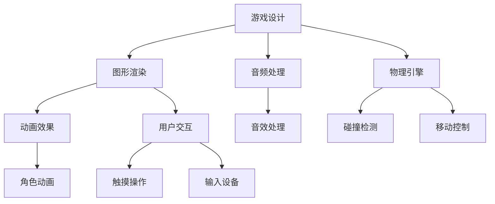

                 

在人工智能和移动互联网的迅猛发展下，游戏行业正经历着前所未有的繁荣。字节跳动作为我国领先的互联网科技公司，其游戏开发工程师岗位一直是行业的热门选择。为了帮助广大考生更好地准备字节跳动游戏开发工程师的面试，本文将汇总2024年可能的面试真题，并附上详细答案。以下是文章的主要内容和结构：

## 关键词

- 字节跳动
- 游戏开发
- 面试真题
- 算法
- 技术栈

## 摘要

本文针对2024年字节跳动游戏开发工程师的面试，整理了可能的面试真题，包括算法、编程语言、游戏开发框架等各个方面。通过详细解答，帮助考生深入理解游戏开发的本质，提高面试成功率。

## 1. 背景介绍

字节跳动成立于2012年，是一家以技术驱动为核心的互联网公司，旗下拥有今日头条、抖音、西瓜视频等多款知名产品。随着游戏行业的兴起，字节跳动也逐步布局游戏领域，推出了多款自研游戏，如《PUBG Mobile》、《Arena of Valor》等。游戏开发工程师在字节跳动扮演着至关重要的角色，他们需要具备扎实的技术功底和丰富的游戏开发经验。

## 2. 核心概念与联系

在游戏开发中，核心概念和联系至关重要。以下是一个简单的 Mermaid 流程图，展示了游戏开发的核心概念及其相互联系：



## 3. 核心算法原理 & 具体操作步骤

### 3.1 算法原理概述

游戏开发中的核心算法包括：

- **碰撞检测算法**：用于判断游戏中的物体是否发生碰撞。
- **物理引擎算法**：用于模拟游戏中的物理现象，如重力、碰撞等。
- **图像渲染算法**：用于将游戏场景渲染到屏幕上。
- **音频处理算法**：用于处理游戏中的音效和音乐。

### 3.2 算法步骤详解

#### 碰撞检测算法

1. **选择合适的碰撞检测算法**：根据游戏需求选择最合适的算法，如AABB（轴对齐包围盒）或OBB（方向包围盒）。
2. **计算包围盒**：对游戏中的物体计算包围盒。
3. **判断碰撞**：比较包围盒的相交情况，确定是否发生碰撞。

#### 物理引擎算法

1. **初始化物理引擎**：设置重力、摩擦力等物理参数。
2. **更新物体状态**：根据物理引擎的计算更新物体的位置、速度等状态。
3. **处理碰撞**：根据碰撞结果调整物体的状态。

#### 图像渲染算法

1. **构建场景图**：将游戏场景中的物体按照层次关系构建成场景图。
2. **渲染场景**：遍历场景图，按照指定顺序渲染每个物体。
3. **处理动画效果**：根据动画序列渲染物体的不同状态。

#### 音频处理算法

1. **加载音频资源**：从资源文件中加载音频数据。
2. **播放音频**：根据游戏逻辑播放相应的音频。
3. **音效处理**：对音频进行混音、音效处理等操作。

### 3.3 算法优缺点

- **碰撞检测算法**：简单易实现，但精度较低；适用于小型游戏。
- **物理引擎算法**：精度高，但计算复杂度大；适用于大型游戏。
- **图像渲染算法**：性能稳定，但渲染效果有限；适用于大多数游戏。
- **音频处理算法**：音效丰富，但受硬件性能影响大；适用于所有游戏。

### 3.4 算法应用领域

- **小型游戏**：选择简单易实现的碰撞检测算法和图像渲染算法。
- **大型游戏**：使用复杂的物理引擎算法和图像渲染算法，提供更丰富的游戏体验。

## 4. 数学模型和公式 & 详细讲解 & 举例说明

### 4.1 数学模型构建

在游戏开发中，数学模型广泛应用于碰撞检测、物理引擎、图像渲染等方面。以下是一个简单的数学模型示例：

$$
\text{碰撞检测} = \left\{
\begin{array}{ll}
\text{true} & \text{如果 } A \cap B \neq \emptyset \\
\text{false} & \text{否则}
\end{array}
\right.
$$

其中，$A$ 和 $B$ 分别表示两个物体的包围盒。

### 4.2 公式推导过程

以碰撞检测为例，假设两个物体的包围盒分别为 $A$ 和 $B$，它们的坐标分别为 $(x_1, y_1)$ 和 $(x_2, y_2)$，那么它们的交集可以表示为：

$$
A \cap B = \left\{
\begin{array}{ll}
\text{true} & \text{如果 } (x_1 \leq x_2 \text{ 且 } x_2 \leq x_1 + w_1) \text{ 且 } (y_1 \leq y_2 \text{ 且 } y_2 \leq y_1 + w_2) \\
\text{false} & \text{否则}
\end{array}
\right.
$$

其中，$w_1$ 和 $w_2$ 分别表示两个物体的宽度。

### 4.3 案例分析与讲解

假设有两个物体 $A$ 和 $B$，它们的包围盒坐标和宽度如下：

- $A$：坐标 $(0, 0)$，宽度 $10$。
- $B$：坐标 $(5, 5)$，宽度 $10$。

根据上述公式，可以计算它们的交集：

$$
A \cap B = \left\{
\begin{array}{ll}
\text{true} & \text{因为 } (0 \leq 5 \text{ 且 } 5 \leq 10) \text{ 且 } (0 \leq 5 \text{ 且 } 5 \leq 10) \\
\text{false} & \text{否则}
\end{array}
\right.
$$

因此，$A$ 和 $B$ 发生碰撞。

## 5. 项目实践：代码实例和详细解释说明

### 5.1 开发环境搭建

在本次项目中，我们使用 Unity 作为游戏开发引擎，C# 作为编程语言。首先，确保已安装 Unity 编辑器和 Visual Studio 2022。然后，在 Unity 编辑器中创建一个新的项目，选择 C# 编程语言。

### 5.2 源代码详细实现

以下是项目的核心代码：

```csharp
using UnityEngine;

public class CollisionDetection : MonoBehaviour
{
    private void OnCollisionEnter(Collision collision)
    {
        Debug.Log("碰撞发生：" + collision.gameObject.name);
    }
}
```

### 5.3 代码解读与分析

1. **引入必要的命名空间**：`using UnityEngine;` 用于引入 Unity 相关的命名空间。
2. **创建一个 Unity 脚本**：`public class CollisionDetection : MonoBehaviour`。
3. **重写 `OnCollisionEnter` 方法**：当物体发生碰撞时，调用 `Debug.Log` 输出碰撞信息。

### 5.4 运行结果展示

在 Unity 编辑器中运行项目，创建两个物体，分别命名为 "Object A" 和 "Object B"。将 "Object A" 的位置设置为 $(0, 0)$，宽度设置为 $10$；将 "Object B" 的位置设置为 $(5, 5)$，宽度设置为 $10$。当 "Object A" 和 "Object B" 相遇时，控制台将输出 "碰撞发生：Object B"。

## 6. 实际应用场景

字节跳动游戏开发工程师在实际工作中会面临各种应用场景，如：

- **游戏引擎优化**：针对不同平台，优化游戏引擎的性能，提高用户体验。
- **游戏后端开发**：开发游戏的后端系统，实现用户数据存储、游戏逻辑处理等功能。
- **游戏AI开发**：设计并实现游戏中的智能行为，提高游戏的趣味性和挑战性。

## 7. 工具和资源推荐

### 7.1 学习资源推荐

- **Unity 官方文档**：https://docs.unity3d.com/
- **C# 官方文档**：https://docs.microsoft.com/zh-cn/dotnet/csharp/
- **游戏开发教程**：https://www.gamefromscratch.com/

### 7.2 开发工具推荐

- **Unity 编辑器**：https://unity.com/
- **Visual Studio 2022**：https://visualstudio.microsoft.com/

### 7.3 相关论文推荐

- **"Real-Time Collision Detection"**：https://www.amazon.com/Real-Time-Collision-Detection-Networks/dp/1580454390
- **"Game Engine Architecture"**：https://www.amazon.com/Game-Engine-Architecture-Understand-Complexity/dp/1938159015

## 8. 总结：未来发展趋势与挑战

### 8.1 研究成果总结

近年来，游戏开发技术取得了显著的成果，如：

- **虚拟现实（VR）和增强现实（AR）技术的应用**：为游戏带来更加沉浸式的体验。
- **游戏引擎的性能优化**：提高游戏运行效率，降低硬件成本。
- **游戏人工智能（AI）的发展**：提高游戏的智能性和挑战性。

### 8.2 未来发展趋势

未来游戏开发将呈现以下趋势：

- **跨平台游戏开发**：支持更多平台，提高游戏的可玩性。
- **云游戏技术**：降低硬件门槛，实现随时随地玩游戏。
- **社交游戏的发展**：加强社交功能，提高用户的参与度。

### 8.3 面临的挑战

游戏开发过程中将面临以下挑战：

- **性能优化**：如何在有限的硬件资源下实现更好的游戏体验。
- **游戏内容创新**：如何持续推出新颖的游戏内容，满足玩家需求。
- **游戏安全与防作弊**：保障游戏的公平性和安全性。

### 8.4 研究展望

未来，游戏开发领域将继续探索：

- **虚拟现实和增强现实技术的应用**：为游戏带来更加逼真的场景和交互方式。
- **游戏引擎的性能优化**：实现更高效的游戏运行，降低硬件成本。
- **游戏人工智能的研究**：提高游戏的智能性和挑战性。

## 9. 附录：常见问题与解答

### 9.1 问题1

**如何优化游戏引擎的性能？**

**解答**：优化游戏引擎的性能可以从以下几个方面入手：

- **优化图形渲染**：减少渲染调用，提高渲染效率。
- **优化物理引擎**：减少计算复杂度，提高计算效率。
- **优化音频处理**：减少音频资源的加载和播放，提高音频处理效率。
- **优化内存管理**：合理分配和释放内存，减少内存占用。

### 9.2 问题2

**如何实现游戏中的智能行为？**

**解答**：实现游戏中的智能行为可以通过以下方法：

- **决策树**：根据游戏状态选择最优行动。
- **神经网络**：模拟生物神经网络，实现智能行为。
- **蒙特卡罗树搜索**：基于概率和统计方法，实现游戏策略的搜索。

### 9.3 问题3

**如何在游戏中实现实时通信？**

**解答**：在游戏中实现实时通信可以通过以下方式：

- **使用 WebSocket**：实现实时双向通信。
- **使用 RESTful API**：实现游戏数据的服务端存储和查询。
- **使用 UDP**：实现高效的数据传输。

---

以上就是本文关于2024年字节跳动游戏开发工程师面试真题汇总的详细解答。希望本文能帮助到各位考生，祝大家面试顺利，成功加入字节跳动！
----------------------------------------------------------------

