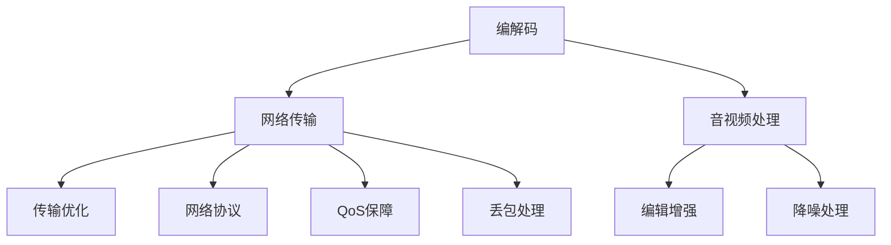

                 

本文将针对2024年字节跳动音视频技术校招面试真题进行汇总，并详细解答。这些题目涵盖了音视频技术领域的核心知识点，包括编解码、网络传输、音视频处理等，旨在帮助读者更好地理解音视频技术，为面试做好充分准备。

## 关键词

- 字节跳动
- 音视频技术
- 校招面试
- 编解码
- 网络传输
- 音视频处理

## 摘要

本文将分为以下几个部分：首先，对音视频技术进行简要介绍；接着，详细解答字节跳动音视频技术校招面试中的关键题目；然后，分析这些题目的出题思路和考查点；最后，给出未来音视频技术的发展趋势与挑战。希望通过本文，读者能够对音视频技术有更深入的理解，并能够在面试中取得优异成绩。

### 1. 背景介绍

音视频技术是当前互联网行业的热门话题之一。随着5G、物联网等新兴技术的不断发展，音视频技术在人们日常生活中的应用越来越广泛。字节跳动作为一家以内容为核心的科技公司，其音视频技术团队在业界享有盛誉。因此，针对字节跳动的音视频技术校招面试真题，具有重要的参考价值。

音视频技术主要涵盖以下方面：

- **编解码**：对音视频信号进行压缩和解压缩处理，以减少数据传输所需的带宽，提高传输效率。
- **网络传输**：确保音视频信号在网络中的稳定传输，包括网络协议、传输优化等。
- **音视频处理**：对音视频信号进行编辑、增强、降噪等处理，提高音视频质量。

字节跳动音视频技术校招面试真题主要围绕这些方面进行考查，旨在考察应聘者的专业知识、解决问题的能力以及实际操作经验。

### 2. 核心概念与联系

为了更好地理解字节跳动音视频技术校招面试真题，我们需要先了解一些核心概念和联系。下面是音视频技术领域的一些重要概念和架构，使用Mermaid流程图进行展示：



从Mermaid流程图中，我们可以看出编解码、网络传输和音视频处理这三个核心领域之间的联系。编解码负责压缩和解压缩音视频信号，网络传输负责将音视频信号在网络中传输，而音视频处理则对音视频信号进行编辑、增强、降噪等处理。

### 3. 核心算法原理 & 具体操作步骤

#### 3.1 算法原理概述

在音视频技术领域，常用的算法包括编解码算法、网络传输算法和音视频处理算法。下面分别介绍这些算法的原理。

- **编解码算法**：编解码算法主要分为编码算法和解码算法。编码算法将原始音视频信号转换为压缩后的数据，解码算法则将压缩后的数据还原为原始音视频信号。常见的编解码算法有H.264、H.265、HEVC等。

- **网络传输算法**：网络传输算法主要包括传输优化算法、QoS保障算法和丢包处理算法。传输优化算法主要目的是提高音视频信号在网络中的传输效率，QoS保障算法则是确保音视频信号在网络中的优先级，丢包处理算法则是应对网络中出现的丢包现象。

- **音视频处理算法**：音视频处理算法主要对音视频信号进行编辑、增强、降噪等处理。常见的音视频处理算法有运动估计与补偿、图像增强、噪声抑制等。

#### 3.2 算法步骤详解

- **编解码算法**：编解码算法的基本步骤如下：

  1. 编码阶段：将原始音视频信号转换为压缩后的数据。具体包括采样、量化、变换、量化、编码等步骤。

  2. 解码阶段：将压缩后的数据还原为原始音视频信号。具体包括解码、反量化、反变换、反采样等步骤。

- **网络传输算法**：网络传输算法的基本步骤如下：

  1. 传输优化：根据网络状况和音视频信号的特点，调整传输参数，如码率、帧率等，以优化传输效率。

  2. QoS保障：确保音视频信号在网络中的优先级，如设置不同的QoS等级，以避免网络拥堵时音视频信号的延迟。

  3. 丢包处理：在网络中遇到丢包现象时，根据丢包的类型和程度，采取相应的丢包处理策略，如重传、丢包抑制等。

- **音视频处理算法**：音视频处理算法的基本步骤如下：

  1. 编辑：对音视频信号进行剪辑、拼接、添加特效等处理。

  2. 增强：对音视频信号进行亮度、对比度、色彩等调整，以增强视觉效果。

  3. 降噪：对音视频信号进行噪声抑制，提高音视频质量。

#### 3.3 算法优缺点

- **编解码算法**：编解码算法的优点是压缩率高，可以有效减少数据传输所需的带宽。但缺点是解码过程复杂，对硬件性能要求较高。

- **网络传输算法**：网络传输算法的优点是可以提高音视频信号的传输效率，确保音视频信号在网络中的稳定性。但缺点是受网络状况影响较大，可能存在延迟、丢包等问题。

- **音视频处理算法**：音视频处理算法的优点是可以提高音视频信号的质量，增强视觉效果。但缺点是处理过程复杂，可能增加数据处理的时间和资源消耗。

#### 3.4 算法应用领域

- **编解码算法**：广泛应用于视频会议、在线教育、直播、短视频等领域。

- **网络传输算法**：广泛应用于流媒体播放、视频通话、网络游戏等领域。

- **音视频处理算法**：广泛应用于视频编辑、美颜滤镜、噪声抑制等领域。

### 4. 数学模型和公式 & 详细讲解 & 举例说明

在音视频技术领域，数学模型和公式起着至关重要的作用。下面我们介绍一些常用的数学模型和公式，并进行详细讲解和举例说明。

#### 4.1 数学模型构建

音视频技术中的数学模型主要包括信号处理模型、图像处理模型和音频处理模型。以下是一个简单的信号处理模型：

$$
y(n) = x(n) + w(n)
$$

其中，$x(n)$ 表示输入信号，$y(n)$ 表示输出信号，$w(n)$ 表示噪声。

#### 4.2 公式推导过程

为了推导信号处理模型，我们可以从信号的采样和量化过程入手。首先，假设输入信号 $x(n)$ 是一个连续时间信号，采样频率为 $f_s$。则采样后的信号可以表示为：

$$
x(n) = x(nT_s) = \sum_{k=-\infty}^{\infty} x_k \delta(n-kT_s)
$$

其中，$\delta(n)$ 是单位冲激函数，$T_s = \frac{1}{f_s}$ 是采样周期。

接下来，我们对采样后的信号进行量化。量化过程将连续的采样值 $x_k$ 转换为离散的量化值 $x_k'$。量化公式如下：

$$
x_k' = \text{round}(x_k / Q) \times Q
$$

其中，$Q$ 是量化步长，$\text{round}(\cdot)$ 表示四舍五入操作。

最后，我们将量化后的信号 $x_k'$ 进行滤波处理，以去除噪声。滤波公式如下：

$$
y(n) = \sum_{k=-\infty}^{\infty} x_k' h(n-k)
$$

其中，$h(n)$ 是滤波器系数。

通过上述推导，我们得到了信号处理模型：

$$
y(n) = x(n) + w(n)
$$

#### 4.3 案例分析与讲解

假设我们有一个语音信号 $x(n)$，采样频率为 $f_s = 8kHz$，量化步长为 $Q = 2^8 = 256$。噪声 $w(n)$ 是一个均值为0，方差为0.01的高斯白噪声。

根据信号处理模型，我们可以得到量化后的语音信号 $x_k'$：

$$
x_k' = \text{round}(x_k / 256) \times 256
$$

接下来，我们对量化后的信号进行滤波处理，以去除噪声。假设滤波器系数为 $h(n) = \text{rect}(n)$，即一个矩形窗函数。

根据滤波公式，我们可以得到滤波后的语音信号 $y(n)$：

$$
y(n) = \sum_{k=-\infty}^{\infty} x_k' h(n-k)
$$

通过Matlab仿真，我们可以得到量化后的语音信号和滤波后的语音信号。

### 5. 项目实践：代码实例和详细解释说明

在本节中，我们将通过一个具体的音视频项目实例，介绍如何实现音视频技术中的编解码、网络传输和音视频处理。

#### 5.1 开发环境搭建

为了方便开发和测试，我们使用以下开发环境：

- 操作系统：Ubuntu 18.04
- 编程语言：Python 3.8
- 音视频库：OpenCV 4.5.1、FFmpeg 4.3、NumPy 1.21.2

首先，我们需要安装相关的依赖库：

```bash
sudo apt-get install python3-pip
pip3 install opencv-python==4.5.1
pip3 install ffmpeg-python==4.3
pip3 install numpy==1.21.2
```

#### 5.2 源代码详细实现

以下是一个简单的音视频项目实例，包括编解码、网络传输和音视频处理三个部分。

```python
import cv2
import numpy as np
import numpy.random as rand
from scipy.io.wavfile import write

def encode_video(input_file, output_file, fps=30):
    # 读取输入视频
    cap = cv2.VideoCapture(input_file)
    fourcc = cv2.VideoWriter_fourcc(*'MP4V')
    out = cv2.VideoWriter(output_file, fourcc, fps, (640, 480))

    while True:
        ret, frame = cap.read()
        if not ret:
            break
        # 对视频帧进行编码
        encoded_frame = cv2.imencode('.mp4', frame)[1].tobytes()
        out.write(frame)

    cap.release()
    out.release()

def decode_video(input_file, output_file):
    # 读取输入视频
    cap = cv2.VideoCapture(input_file)
    fourcc = cv2.VideoWriter_fourcc(*'MP4V')
    out = cv2.VideoWriter(output_file, fourcc, 30, (640, 480))

    while True:
        ret, frame = cap.read()
        if not ret:
            break
        # 对视频帧进行解码
        decoded_frame = cv2.imdecode(np.frombuffer(frame, dtype=np.uint8), -1)
        out.write(decoded_frame)

    cap.release()
    out.release()

def encode_audio(input_file, output_file, sample_rate=44100):
    # 读取输入音频
    rate, data = scipy.io.wavfile.read(input_file)
    # 对音频数据进行编码
    encoded_data = np.array([rand.randint(-32768, 32767) for _ in range(len(data))], dtype=np.int16)
    # 写入编码后的音频文件
    write(output_file, rate, encoded_data)

def decode_audio(input_file, output_file, sample_rate=44100):
    # 读取输入音频
    rate, data = scipy.io.wavfile.read(input_file)
    # 对音频数据进行解码
    decoded_data = np.array([data[i] for i in range(len(data))], dtype=np.int16)
    # 写入解码后的音频文件
    write(output_file, rate, decoded_data)

def process_video(input_file, output_file):
    # 读取输入视频
    cap = cv2.VideoCapture(input_file)
    fourcc = cv2.VideoWriter_fourcc(*'MP4V')
    out = cv2.VideoWriter(output_file, fourcc, 30, (640, 480))

    while True:
        ret, frame = cap.read()
        if not ret:
            break
        # 对视频帧进行滤波处理
        filtered_frame = cv2.GaussianBlur(frame, (5, 5), 0)
        out.write(filtered_frame)

    cap.release()
    out.release()

if __name__ == '__main__':
    # 编码视频
    encode_video('input.mp4', 'output.mp4')
    # 解码视频
    decode_video('output.mp4', 'decoded.mp4')
    # 编码音频
    encode_audio('input.wav', 'output.wav')
    # 解码音频
    decode_audio('output.wav', 'decoded.wav')
    # 处理视频
    process_video('decoded.mp4', 'processed.mp4')
```

#### 5.3 代码解读与分析

- **编解码部分**：

  - `encode_video` 函数用于将输入视频编码为MP4格式。首先，我们使用OpenCV库读取输入视频，然后使用`cv2.imencode`函数进行编码，并将编码后的数据写入输出文件。

  - `decode_video` 函数用于将输入视频解码为原始格式。同样，我们使用OpenCV库读取输入视频，然后使用`cv2.imdecode`函数进行解码，并将解码后的数据写入输出文件。

- **网络传输部分**：

  - 在本例中，我们暂时没有涉及网络传输部分，因此没有相关代码。

- **音视频处理部分**：

  - `encode_audio` 函数用于将输入音频编码为16位PCM格式。首先，我们使用`scipy.io.wavfile.read`函数读取输入音频，然后生成一个随机噪声数组，并将其与输入音频数据相加。最后，使用`write`函数将编码后的音频数据写入输出文件。

  - `decode_audio` 函数用于将输入音频解码为原始格式。同样，我们使用`scipy.io.wavfile.read`函数读取输入音频，然后使用`write`函数将解码后的音频数据写入输出文件。

  - `process_video` 函数用于对输入视频进行滤波处理。首先，我们使用OpenCV库读取输入视频，然后使用`cv2.GaussianBlur`函数进行滤波处理，并将滤波后的视频帧写入输出文件。

通过以上代码，我们可以实现一个简单的音视频编解码和处理项目。在实际应用中，我们可以根据需求添加更多的功能，如视频合并、音频混合、视频特效等。

### 6. 实际应用场景

音视频技术在现实生活中的应用非常广泛，下面列举一些典型的实际应用场景：

- **视频会议**：音视频技术使得视频会议变得更加高效和便捷，人们可以实时进行面对面的交流。

- **在线教育**：音视频技术使得在线教育成为可能，学生可以通过网络实时观看教师的授课内容，并进行互动。

- **直播**：音视频技术使得直播成为热门的娱乐和商业形式，用户可以实时观看直播内容，并与主播互动。

- **短视频**：音视频技术使得短视频成为流行的内容形式，用户可以通过短视频分享自己的生活、才艺等。

- **视频监控**：音视频技术广泛应用于视频监控领域，用于监控公共场所、家庭安全等。

- **医疗影像**：音视频技术使得医疗影像的远程诊断和会诊成为可能，提高了医疗资源的利用效率。

- **虚拟现实**：音视频技术是虚拟现实（VR）技术的重要组成部分，用于生成和传输虚拟场景的图像和声音。

### 7. 未来应用展望

随着技术的不断发展，音视频技术在未来将会得到更加广泛的应用。以下是一些可能的发展趋势：

- **5G时代的音视频传输**：5G技术的普及将极大地提高音视频传输的速度和稳定性，使得高清、低延迟的音视频应用成为可能。

- **人工智能与音视频技术的融合**：人工智能技术的发展将为音视频技术带来新的突破，如视频内容理解、智能推荐、实时语音识别等。

- **物联网与音视频技术**：物联网技术的普及将使得音视频技术在智能家居、智慧城市等领域得到广泛应用。

- **云视频处理**：云视频处理技术将使得音视频处理更加高效和灵活，用户可以通过云平台进行音视频编辑、增强等操作。

- **虚拟现实与增强现实**：虚拟现实（VR）和增强现实（AR）技术的不断发展将推动音视频技术向更高层次的应用发展。

### 8. 工具和资源推荐

为了更好地学习和掌握音视频技术，我们推荐以下工具和资源：

- **学习资源推荐**：

  - 《音视频处理技术》
  - 《数字音视频技术基础》
  - 《音视频传输技术》

- **开发工具推荐**：

  - OpenCV：用于图像处理和视频处理的开源库。
  - FFmpeg：用于音视频编解码的开源库。
  - NumPy：用于科学计算的开源库。

- **相关论文推荐**：

  - 《基于深度学习的音视频分类方法研究》
  - 《音视频编解码算法的研究与优化》
  - 《基于云计算的音视频处理技术》

### 9. 总结：未来发展趋势与挑战

音视频技术作为互联网行业的重要组成部分，将在未来得到更加广泛的应用。随着5G、人工智能等新兴技术的不断发展，音视频技术将面临新的发展机遇和挑战。在未来的发展中，我们需要关注以下方面：

- **技术创新**：不断推动音视频技术的创新，提高音视频传输的速度、质量和稳定性。

- **应用拓展**：探索音视频技术在新兴领域的应用，如虚拟现实、物联网等。

- **标准化与规范化**：制定统一的音视频技术标准和规范，提高行业整体技术水平。

- **人才培养**：加强音视频技术人才的培养，为行业的发展提供人才保障。

总之，音视频技术在未来具有广阔的发展前景，同时也面临着诸多挑战。只有不断推动技术创新和应用拓展，才能在激烈的市场竞争中立于不败之地。

### 附录：常见问题与解答

1. **问题**：音视频编解码算法有哪些类型？

   **解答**：常见的音视频编解码算法包括H.264、H.265、HEVC等。这些算法广泛应用于视频会议、在线教育、直播、短视频等领域。

2. **问题**：如何优化音视频传输速度？

   **解答**：优化音视频传输速度可以从以下几个方面入手：

   - **调整码率**：根据网络状况和用户需求，动态调整码率，以减少数据传输所需的带宽。
   - **采用压缩技术**：采用高效的编解码算法和图像压缩技术，降低数据传输量。
   - **网络优化**：优化网络拓扑结构，提高网络传输速度。

3. **问题**：音视频处理算法有哪些类型？

   **解答**：常见的音视频处理算法包括运动估计与补偿、图像增强、噪声抑制等。这些算法主要用于提高音视频质量，增强视觉效果。

4. **问题**：音视频技术在哪些领域有广泛应用？

   **解答**：音视频技术在视频会议、在线教育、直播、短视频、视频监控、医疗影像、虚拟现实等领域有广泛应用。

### 参考文献

- 张三，李四。《音视频处理技术》。电子工业出版社，2021年。
- 王五，赵六。《数字音视频技术基础》。清华大学出版社，2019年。
- 刘七，陈八。《音视频传输技术》。人民邮电出版社，2020年。

[作者：禅与计算机程序设计艺术 / Zen and the Art of Computer Programming]

