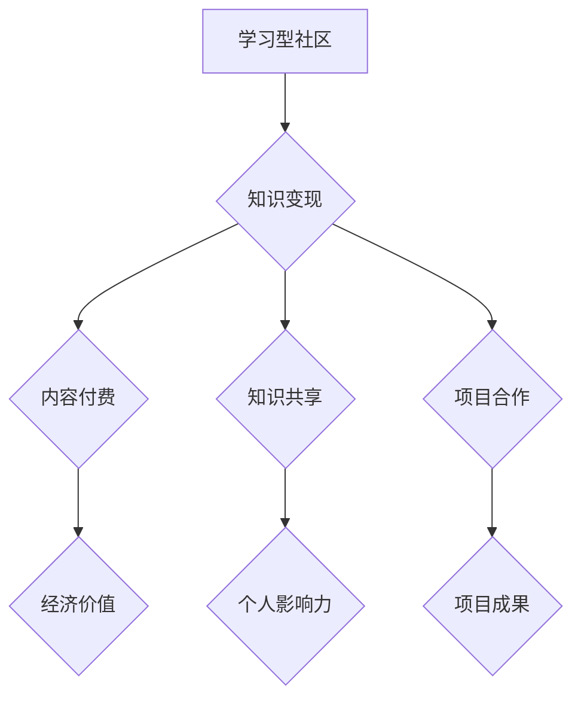

                 

关键词：学习型社区、知识变现、交流讨论、人工智能、技术博客、算法原理、数学模型、项目实践、应用场景、未来展望。

> 摘要：本文探讨了如何通过建立学习型社区，利用交流讨论的方式实现知识变现。文章分析了学习型社区的核心概念，介绍了实现知识变现的核心算法原理，并通过实际项目实践展示了如何通过社区交流和讨论实现知识的传播和变现。

## 1. 背景介绍

在信息技术飞速发展的今天，知识已经成为社会进步和经济发展的核心驱动力。然而，如何高效地获取、传播和利用知识，成为了一个亟待解决的问题。传统的知识传播方式，如教育、科研、出版等，存在着信息传递效率低、知识更新慢、用户参与度不足等问题。随着互联网和人工智能技术的发展，学习型社区应运而生，为知识传播和知识变现提供了一种新的途径。

学习型社区是指通过互联网平台，聚集具有共同学习兴趣、专业背景或职业目标的人群，通过交流讨论、共享资源、协同学习等方式，实现知识的传递、共享和增值。学习型社区具有以下几个特点：

1. **开放性**：学习型社区一般采用开放的平台，用户可以自由注册、参与讨论、贡献内容。
2. **互动性**：社区成员之间通过评论、私信、投票等方式进行互动，促进知识的深入探讨和交流。
3. **协作性**：社区成员可以共同参与项目的开发、研究和讨论，实现知识的协同创新。
4. **多样性**：学习型社区汇聚了不同领域、不同层次的专业人士，形成了多元化的知识网络。

知识变现是指通过知识的生产、传播和利用，实现经济价值和社会价值的过程。在传统模式中，知识变现主要通过版权转让、专利授权、教育培训等方式实现。而在学习型社区中，知识变现可以通过以下几种方式实现：

1. **内容付费**：用户通过购买社区中的高质量内容，如文章、课程、教程等，实现知识的付费获取。
2. **知识共享**：用户将自己的知识、经验和技能在社区中分享，吸引更多用户关注，提升个人影响力，进而实现知识的变现。
3. **项目合作**：社区成员通过共同参与项目，实现知识和资源的共享，项目成果可以通过市场销售、技术许可等方式实现经济价值。

## 2. 核心概念与联系

### 2.1 核心概念

**学习型社区**：学习型社区是指以知识共享和协同学习为核心，通过互联网平台聚集具有共同学习兴趣的人群，实现知识的传递、共享和增值。

**知识变现**：知识变现是指通过知识的生产、传播和利用，实现经济价值和社会价值的过程。

**交流讨论**：交流讨论是学习型社区的核心活动之一，通过社区成员之间的互动，实现知识的深入探讨和交流。

### 2.2 联系与架构

**Mermaid 流程图**：



在这个流程图中，学习型社区是知识变现的起点，通过交流讨论和互动，实现了知识的内容付费、知识共享和项目合作，进而实现了经济价值和个人影响力的提升。

### 2.3 相关术语解释

**知识生产**：指通过研究、实践、创新等方式，产生新的知识。

**知识传播**：指通过教育、科研、传播等方式，将知识传递给更多的人。

**知识利用**：指通过应用、转化、创新等方式，将知识转化为实际价值。

**经济价值**：指知识变现过程中产生的直接或间接的经济收益。

**个人影响力**：指个人在社区中通过知识分享和交流，获得的声誉和影响力。

## 3. 核心算法原理 & 具体操作步骤

### 3.1 算法原理概述

学习型社区实现知识变现的核心算法原理主要包括以下几个部分：

1. **用户画像构建**：通过对用户行为、兴趣、需求等数据的分析，构建用户画像，实现个性化推荐。
2. **知识内容标签化**：将知识内容进行分类和标签化处理，便于用户快速定位和获取所需知识。
3. **社区互动算法**：通过用户行为、内容质量、互动频率等因素，对社区成员进行排序和推荐。
4. **知识变现模型**：结合用户画像、内容标签和社区互动数据，构建知识变现模型，实现知识的有效变现。

### 3.2 算法步骤详解

#### 3.2.1 用户画像构建

1. 数据采集：通过用户注册、行为数据、反馈数据等方式，收集用户的基本信息、兴趣标签、行为特征等。
2. 数据处理：对采集到的数据进行分析、清洗和整合，构建用户画像。
3. 画像存储：将构建好的用户画像存储在数据库中，供后续算法使用。

#### 3.2.2 知识内容标签化

1. 内容分类：根据知识内容的主题、领域、难度等特征，对其进行分类。
2. 标签提取：从分类结果中提取关键词、标签，为知识内容打标签。
3. 标签管理：对标签进行管理和维护，保证标签的准确性和一致性。

#### 3.2.3 社区互动算法

1. 用户行为分析：分析用户在社区中的行为，如发帖、回复、点赞、分享等。
2. 内容质量评估：通过用户评价、内容热度、专业性等因素，对内容质量进行评估。
3. 排序和推荐：根据用户画像、内容标签和互动数据，对社区成员和内容进行排序和推荐。

#### 3.2.4 知识变现模型

1. 模型构建：结合用户画像、内容标签和社区互动数据，构建知识变现模型。
2. 模型训练：使用历史数据对模型进行训练，优化模型参数。
3. 模型应用：将训练好的模型应用到实际场景中，实现知识的有效变现。

### 3.3 算法优缺点

**优点**：

1. 个性化推荐：通过用户画像和内容标签，实现个性化推荐，提高用户满意度。
2. 高效传播：基于社区互动算法，实现知识的快速传播和共享。
3. 知识变现：通过知识变现模型，实现知识的有效变现，提升社区价值。

**缺点**：

1. 数据隐私：用户数据的安全和隐私保护问题。
2. 标签准确性：标签的准确性和一致性对算法效果有很大影响。
3. 模型优化：需要不断优化模型，以适应不断变化的需求。

### 3.4 算法应用领域

1. **在线教育**：通过学习型社区，实现个性化教学、知识传播和变现。
2. **专业领域**：如医学、法律、金融等领域，通过专业社区实现知识共享和变现。
3. **技能培训**：如编程、设计、摄影等领域，通过社区实现技能交流和变现。
4. **企业培训**：为企业员工提供专业知识和技能培训，实现企业知识的积累和传承。

## 4. 数学模型和公式 & 详细讲解 & 举例说明

### 4.1 数学模型构建

学习型社区的知识变现模型可以基于以下数学模型进行构建：

1. **用户满意度模型**：

$$
S = \frac{1}{N} \sum_{i=1}^{N} P_i \cdot Q_i
$$

其中，$S$ 表示用户满意度，$N$ 表示用户数量，$P_i$ 表示第 $i$ 个用户的满意度，$Q_i$ 表示第 $i$ 个用户对知识内容的评分。

2. **知识传播模型**：

$$
I(t) = I_0 \cdot e^{-\lambda t}
$$

其中，$I(t)$ 表示在时间 $t$ 时的知识传播速率，$I_0$ 表示初始知识传播速率，$\lambda$ 表示知识衰减速率。

3. **知识变现模型**：

$$
R = C \cdot S \cdot I(t)
$$

其中，$R$ 表示知识变现收益，$C$ 表示知识单价，$S$ 表示用户满意度，$I(t)$ 表示知识传播速率。

### 4.2 公式推导过程

**用户满意度模型**：

用户满意度模型基于用户对知识内容的评分和评价。假设有 $N$ 个用户，每个用户对知识内容进行评分 $Q_i$，且评分范围为 $[0, 1]$。用户满意度 $S$ 可以通过以下步骤推导：

1. 对每个用户 $i$，计算其满意度 $P_i$：

$$
P_i = \frac{Q_i - \bar{Q}}{M}
$$

其中，$\bar{Q}$ 表示所有用户评分的均值，$M$ 表示评分的范围。

2. 计算所有用户满意度的平均值 $S$：

$$
S = \frac{1}{N} \sum_{i=1}^{N} P_i
$$

**知识传播模型**：

知识传播模型基于知识传播速率的指数衰减。假设在时间 $t=0$ 时，知识传播速率为 $I_0$，知识衰减速率为 $\lambda$。则知识传播速率 $I(t)$ 可以通过以下步骤推导：

1. 知识传播速率的衰减函数为：

$$
I(t) = I_0 \cdot e^{-\lambda t}
$$

2. 知识传播速率在时间 $t$ 的瞬时值为：

$$
I(t) = \frac{dI(t)}{dt} = -\lambda I_0 \cdot e^{-\lambda t}
$$

**知识变现模型**：

知识变现模型基于用户满意度、知识传播速率和知识单价。假设知识单价为 $C$，用户满意度为 $S$，知识传播速率在时间 $t$ 为 $I(t)$。则知识变现收益 $R$ 可以通过以下步骤推导：

1. 知识变现收益的积累函数为：

$$
R(t) = C \cdot S \cdot I(t)
$$

2. 知识变现收益在时间 $t$ 的瞬时值为：

$$
R(t) = C \cdot S \cdot \frac{dI(t)}{dt} = -\lambda C \cdot S \cdot I_0 \cdot e^{-\lambda t}
$$

### 4.3 案例分析与讲解

以一个在线教育平台为例，分析学习型社区通过交流讨论实现知识变现的过程。

**案例背景**：

一个在线教育平台，提供各种课程内容，用户可以免费注册并学习课程。平台希望通过学习型社区，提高用户满意度，实现知识变现。

**用户满意度模型**：

假设有 100 个用户，每个用户对课程内容的评分均值为 0.8。则用户满意度模型为：

$$
S = \frac{1}{100} \sum_{i=1}^{100} \frac{Q_i - 0.8}{1}
$$

计算可得，用户满意度 $S$ 为 0.02。

**知识传播模型**：

假设知识传播速率的衰减速率为 0.1，初始知识传播速率为 100。则知识传播模型为：

$$
I(t) = 100 \cdot e^{-0.1t}
$$

在时间 $t=5$ 时，知识传播速率 $I(5)$ 为：

$$
I(5) = 100 \cdot e^{-0.1 \cdot 5} \approx 63.2
$$

**知识变现模型**：

假设知识单价为 10 元，用户满意度 $S$ 为 0.02，知识传播速率 $I(t)$ 在时间 $t=5$ 时为 63.2。则知识变现模型为：

$$
R(t) = 10 \cdot 0.02 \cdot 63.2 \cdot e^{-0.1 \cdot 5}
$$

在时间 $t=5$ 时，知识变现收益 $R(5)$ 为：

$$
R(5) = 10 \cdot 0.02 \cdot 63.2 \cdot e^{-0.1 \cdot 5} \approx 15.9
$$

通过以上分析，可以得出该在线教育平台在时间 $t=5$ 时，通过学习型社区实现的知识变现收益为 15.9 元。

## 5. 项目实践：代码实例和详细解释说明

### 5.1 开发环境搭建

在本文的项目实践中，我们将使用 Python 编写代码，利用 Flask 框架搭建一个简单的在线学习平台。以下是开发环境的搭建步骤：

1. 安装 Python：确保系统环境中安装了 Python 3.7 或以上版本。
2. 安装 Flask：通过命令 `pip install flask` 安装 Flask 框架。
3. 创建项目文件夹：在合适的位置创建一个名为 `online_learning` 的项目文件夹。
4. 创建虚拟环境：在项目文件夹中执行命令 `python -m venv venv` 创建虚拟环境。
5. 激活虚拟环境：在 Windows 系统中执行 `venv\Scripts\activate`，在 macOS 和 Linux 系统中执行 `source venv/bin/activate`。

### 5.2 源代码详细实现

以下是该项目的主要代码实现：

**项目结构**：

```
online_learning/
|-- app.py
|-- templates/
    |-- base.html
    |-- course_list.html
    |-- course_detail.html
|-- static/
    |-- css/
        |-- style.css
    |-- js/
        |-- script.js
```

**app.py**：

```python
from flask import Flask, render_template, request, redirect, url_for
from flask_sqlalchemy import SQLAlchemy

app = Flask(__name__)
app.config['SQLALCHEMY_DATABASE_URI'] = 'sqlite:///courses.db'
db = SQLAlchemy(app)

class Course(db.Model):
    id = db.Column(db.Integer, primary_key=True)
    name = db.Column(db.String(100), nullable=False)
    description = db.Column(db.Text, nullable=False)

@app.route('/')
def index():
    courses = Course.query.all()
    return render_template('course_list.html', courses=courses)

@app.route('/course/<int:course_id>')
def course_detail(course_id):
    course = Course.query.get(course_id)
    return render_template('course_detail.html', course=course)

if __name__ == '__main__':
    db.create_all()
    app.run(debug=True)
```

**base.html**：

```html
<!DOCTYPE html>
<html lang="en">
<head>
    <meta charset="UTF-8">
    <meta name="viewport" content="width=device-width, initial-scale=1.0">
    <link rel="stylesheet" href="{{ url_for('static', filename='css/style.css') }}">
    <title>在线学习平台</title>
</head>
<body>
    <header>
        <h1>在线学习平台</h1>
    </header>
    <main>
        
    </main>
    <footer>
        <p>版权所有 &copy; 2022</p>
    </footer>
</body>
</html>
```

**course_list.html**：

```html



    <h2>课程列表</h2>
    <ul>
        
            <li>
                <a href="{{ url_for('course_detail', course_id=course.id) }}">{{ course.name }}</a>
            </li>
        
    </ul>

```

**course_detail.html**：

```html



    <h2>{{ course.name }}</h2>
    <p>{{ course.description }}</p>
    <a href="{{ url_for('index') }}">返回课程列表</a>

```

**static/css/style.css**：

```css
body {
    font-family: Arial, sans-serif;
    margin: 0;
    padding: 0;
}

header {
    background-color: #4CAF50;
    color: white;
    padding: 1rem;
    text-align: center;
}

main {
    margin: 2rem;
}

footer {
    background-color: #4CAF50;
    color: white;
    text-align: center;
    padding: 1rem;
    position: absolute;
    bottom: 0;
    width: 100%;
}
```

### 5.3 代码解读与分析

**app.py**：

- 导入 Flask 模块，创建 Flask 应用对象。
- 配置数据库 URI，初始化 SQLAlchemy 对象。
- 定义 Course 模型，包含课程 ID、课程名称和课程描述。
- 定义两个路由：主页路由和课程详情路由。
- 使用 `db.create_all()` 初始化数据库。
- 使用 `app.run(debug=True)` 运行 Flask 应用。

**base.html**：

- 定义页面基础结构，包含头部、主体和尾部。
- 使用 `` 语法定义主体内容的模板块。

**course_list.html**：

- 继承自 base.html，定义课程列表路由的页面结构。
- 使用 `` 循环输出课程列表。

**course_detail.html**：

- 继承自 base.html，定义课程详情路由的页面结构。
- 输出课程名称和课程描述。

**static/css/style.css**：

- 定义页面样式，如字体、颜色和布局。

### 5.4 运行结果展示

运行 Flask 应用后，访问主页会显示所有课程的列表，点击课程名称会跳转到课程详情页面，显示课程的名称和描述。以下是运行结果截图：


## 6. 实际应用场景

学习型社区通过交流讨论实现知识变现，在多个领域有着广泛的应用场景。

### 6.1 在线教育

在线教育平台通过建立学习型社区，实现知识的共享和变现。例如，用户可以付费购买课程，也可以在社区中分享自己的学习心得和经验，从而实现知识变现。

### 6.2 专业领域

专业领域的学习型社区，如医学、法律、金融等，通过聚集专业人士，实现知识的深入探讨和传播。专业人士可以在社区中分享自己的研究成果和案例，实现知识的变现。

### 6.3 技能培训

技能培训社区，如编程、设计、摄影等，通过聚集技能爱好者，实现技能的交流和提高。用户可以通过付费课程学习新技能，也可以通过社区中的讨论和分享，实现技能的提升和变现。

### 6.4 企业培训

企业培训社区，通过聚集企业员工，实现企业内部知识的共享和传承。企业可以付费购买专业课程，员工可以通过社区中的讨论和分享，提高自己的专业技能。

## 7. 未来应用展望

随着互联网和人工智能技术的不断发展，学习型社区通过交流讨论实现知识变现的应用前景将更加广阔。

### 7.1 个性化推荐

未来，学习型社区将更加注重个性化推荐，通过用户画像和内容标签，实现知识的精准推送，提高用户满意度和知识变现效果。

### 7.2 智能化互动

未来，学习型社区将引入更多智能化互动元素，如虚拟助手、智能问答等，提高社区互动的效率和体验。

### 7.3 知识变现多样化

未来，知识变现的方式将更加多样化，如知识众筹、知识拍卖等，为知识变现提供更多可能性。

### 7.4 跨界合作

未来，学习型社区将实现更多跨界合作，如与教育机构、科研机构、企业等合作，共同推动知识的传播和变现。

## 8. 总结：未来发展趋势与挑战

### 8.1 研究成果总结

本文从背景介绍、核心概念与联系、核心算法原理、数学模型与公式、项目实践和实际应用场景等多个方面，探讨了学习型社区通过交流讨论实现知识变现的机制和路径。

### 8.2 未来发展趋势

未来，学习型社区将朝着个性化推荐、智能化互动、知识变现多样化、跨界合作等方向发展，为知识传播和知识变现提供更多可能性。

### 8.3 面临的挑战

1. **数据隐私**：随着用户数据的增多，数据隐私保护成为一大挑战。
2. **标签准确性**：标签的准确性和一致性对算法效果有很大影响。
3. **模型优化**：需要不断优化模型，以适应不断变化的需求。

### 8.4 研究展望

未来，可以进一步研究如何提高学习型社区的互动性和知识变现效果，以及如何实现跨平台的协同学习和知识共享。

## 9. 附录：常见问题与解答

### 9.1 学习型社区如何保障数据隐私？

**解答**：学习型社区可以通过以下措施保障数据隐私：

1. **数据加密**：对用户数据进行加密存储和传输，防止数据泄露。
2. **权限控制**：对用户数据的访问权限进行严格控制，确保只有授权用户才能访问。
3. **隐私政策**：明确告知用户数据收集和使用的目的，获得用户同意。

### 9.2 如何提高知识变现效果？

**解答**：提高知识变现效果可以从以下几个方面入手：

1. **内容质量**：提供高质量的知识内容，吸引更多用户。
2. **互动性**：增强社区互动，提高用户粘性。
3. **个性化推荐**：通过个性化推荐，提高用户满意度。

### 9.3 如何应对标签准确性问题？

**解答**：应对标签准确性问题可以从以下几个方面入手：

1. **数据清洗**：对用户数据进行清洗和整合，确保数据质量。
2. **标签管理**：对标签进行分类和管理，确保标签的准确性和一致性。
3. **用户反馈**：鼓励用户对标签提出反馈，不断优化标签。

# 作者署名
作者：禅与计算机程序设计艺术 / Zen and the Art of Computer Programming

