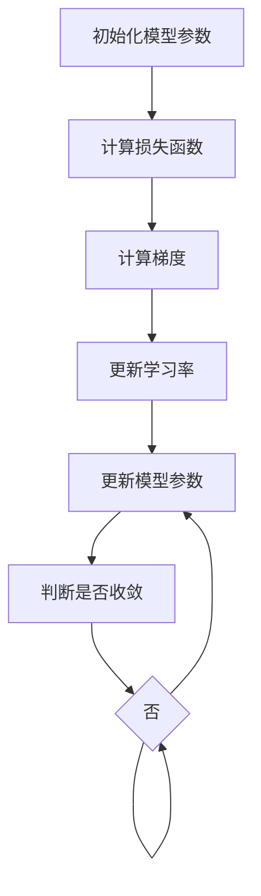

                 

关键词：学习率、机器学习、深度学习、神经网络、优化算法、调整策略、实验技巧、代码实例、超参数调优

> 摘要：本文将深入探讨学习率在学习过程中的作用和调整策略，结合实际代码实例，详细介绍学习率的相关原理和应用技巧，帮助读者更好地理解和掌握学习率的优化方法，提升机器学习模型的性能。

## 1. 背景介绍

学习率（Learning Rate）是机器学习中一个非常重要的超参数，它决定了模型在训练过程中更新参数的速度。学习率的选择对模型的收敛速度和最终性能有着重要影响。如果学习率设置过高，模型可能会在训练过程中错过最小值点，导致训练结果不稳定；而如果学习率设置过低，模型的收敛速度将变得非常缓慢，甚至可能无法收敛。

学习率在优化算法中扮演着关键角色，常见的优化算法如梯度下降（Gradient Descent）、随机梯度下降（Stochastic Gradient Descent, SGD）、Adam优化器等都涉及学习率的选择。不同优化算法对学习率的要求和调整策略也有所不同，因此深入了解学习率的原理和调整技巧对于提高模型训练效果具有重要意义。

本文将首先介绍学习率的基本概念，然后探讨学习率的选择策略和调整方法，并通过实际代码实例展示学习率对模型训练过程的影响。最后，我们将讨论学习率在不同应用场景中的实践技巧，为读者提供实用的指导。

## 2. 核心概念与联系

### 2.1 学习率的基本概念

学习率是机器学习优化算法中用于控制模型参数更新速度的参数。在梯度下降算法中，学习率决定了每一步沿着梯度方向移动的步长。具体来说，学习率可以表示为：

$$
\text{学习率} = \eta
$$

其中，$\eta$ 为正实数，用于控制每次迭代中模型参数的更新幅度。

### 2.2 学习率与优化算法的联系

学习率在梯度下降类优化算法中具有至关重要的作用。梯度下降算法的基本思想是沿着损失函数的梯度方向不断迭代更新模型参数，以达到最小化损失函数的目的。学习率决定了参数更新的步长，直接影响着模型的收敛速度和稳定性。

不同的优化算法对学习率的选择和调整策略有所不同。以下将介绍几种常见的优化算法及其与学习率的关系：

1. **梯度下降（Gradient Descent）**

   梯度下降是一种最简单的优化算法，其核心思想是沿着损失函数的梯度方向更新模型参数，以达到最小化损失函数的目的。学习率 $\eta$ 决定了参数更新的步长，具体更新公式为：

   $$
   \theta = \theta - \eta \cdot \nabla J(\theta)
   $$

   其中，$\theta$ 表示模型参数，$J(\theta)$ 表示损失函数，$\nabla J(\theta)$ 表示损失函数关于参数 $\theta$ 的梯度。

2. **随机梯度下降（Stochastic Gradient Descent, SGD）**

   随机梯度下降是对梯度下降的一种改进，其核心思想是在每个迭代步骤中随机选择一部分样本子集，计算子集的梯度平均值作为全局梯度，然后沿着全局梯度方向更新模型参数。SGD通过引入随机性提高了优化过程的稳定性，但同时也带来了方差较大的问题。学习率 $\eta$ 仍然用于控制参数更新的步长，具体更新公式为：

   $$
   \theta = \theta - \eta \cdot \frac{1}{m} \sum_{i=1}^{m} \nabla J(\theta; x_i, y_i)
   $$

   其中，$m$ 表示样本数量，$x_i, y_i$ 表示第 $i$ 个样本及其标签。

3. **Adam优化器**

   Adam优化器是一种结合了SGD和动量法的优化算法，其核心思想是利用一阶矩估计（均值）和二阶矩估计（方差）来动态调整学习率。Adam优化器具有收敛速度快、稳定性高等优点，广泛应用于深度学习模型。学习率 $\eta$ 在Adam优化器中仍然扮演着重要角色，其更新公式为：

   $$
   \theta = \theta - \eta \cdot \frac{m}{\sqrt{1 - \beta_2^t}} \cdot \left( \nabla J(\theta) - \beta_1^t \cdot \nabla J(\theta)^{\text{prev}} \right)
   $$

   其中，$\beta_1, \beta_2$ 分别为动量系数，$t$ 为迭代次数。

### 2.3 学习率与模型性能的关系

学习率对模型性能有着重要影响，主要体现在以下几个方面：

1. **收敛速度**

   学习率的大小直接影响模型的收敛速度。较大的学习率可能导致模型在较短时间内达到较小的损失值，但同时也增加了错过最小值点的风险；较小的学习率则会使模型收敛速度变慢，但更有可能找到更好的最小值点。

2. **模型稳定性**

   学习率的选择还关系到模型的稳定性。较大的学习率可能导致模型在训练过程中产生较大的波动，使得训练结果不稳定；而较小的学习率则有助于提高模型的稳定性，但可能牺牲一定的收敛速度。

3. **过拟合与欠拟合**

   学习率对模型的过拟合与欠拟合现象也有一定影响。较大的学习率可能导致模型在训练过程中无法充分拟合训练数据，从而出现过拟合现象；而较小的学习率则有助于模型更好地拟合训练数据，但可能过度依赖训练数据，导致欠拟合。

### 2.4 Mermaid 流程图

为了更好地展示学习率在优化算法中的应用，我们使用 Mermaid 流程图来表示学习率与优化算法的联系。以下是一个简化的 Mermaid 流程图示例：



## 3. 核心算法原理 & 具体操作步骤

### 3.1 算法原理概述

本节将介绍学习率调整的核心算法原理，包括学习率的初始化、更新策略以及具体操作步骤。

#### 3.1.1 学习率的初始化

学习率的初始化是学习率调整的第一步，其目标是选择一个合适的初始学习率。常见的初始化方法有随机初始化、对数初始化和线性初始化等。以下是一个简单的随机初始化示例：

```python
import numpy as np

def init_learning_rate():
    return np.random.uniform(0.01, 0.1)
```

#### 3.1.2 学习率的更新策略

学习率的更新策略用于在训练过程中动态调整学习率，以适应模型训练的进展。常见的更新策略有固定学习率、指数衰减学习率、余弦退火学习率等。以下是一个简单的指数衰减学习率示例：

```python
def exponential_decay_learning_rate(initial_lr, decay_rate, iteration, total_iterations):
    return initial_lr / (1 + decay_rate * iteration / total_iterations)
```

#### 3.1.3 具体操作步骤

学习率的调整过程通常包括以下步骤：

1. **初始化模型参数和学习率**：初始化模型参数，并根据需要选择合适的初始学习率。

2. **计算损失函数和梯度**：在每次迭代中，计算损失函数和模型参数的梯度。

3. **更新学习率**：根据当前的迭代次数和总迭代次数，使用适当的更新策略调整学习率。

4. **更新模型参数**：根据学习率和梯度更新模型参数。

5. **判断是否收敛**：判断模型是否达到收敛条件，例如损失函数变化很小或者迭代次数达到预设值。

6. **输出模型**：当模型达到收敛条件时，输出最终训练好的模型。

### 3.2 算法步骤详解

以下是学习率调整算法的具体操作步骤：

#### 3.2.1 初始化

```python
# 初始化模型参数
params = {'weights': np.random.uniform(size=100), 'biases': np.random.uniform(size=10)}

# 初始化学习率
learning_rate = init_learning_rate()
```

#### 3.2.2 计算损失函数和梯度

```python
# 计算损失函数
def compute_loss(params):
    weights, biases = params['weights'], params['biases']
    return (1/2) * np.sum((weights * x + biases - y)**2)

# 计算梯度
def compute_gradient(params):
    weights, biases = params['weights'], params['biases']
    return {'weights': weights * x - y, 'biases': biases * x - y}
```

#### 3.2.3 更新学习率

```python
# 更新学习率
def update_learning_rate(learning_rate, iteration, total_iterations):
    return learning_rate / (1 + 0.01 * iteration / total_iterations)
```

#### 3.2.4 更新模型参数

```python
# 更新模型参数
def update_params(params, gradient, learning_rate):
    weights, biases = params['weights'], params['biases']
    new_weights = weights - learning_rate * gradient['weights']
    new_biases = biases - learning_rate * gradient['biases']
    return {'weights': new_weights, 'biases': new_biases}
```

#### 3.2.5 判断是否收敛

```python
# 判断是否收敛
def has_converged(loss, previous_loss, threshold=0.001):
    return abs(loss - previous_loss) < threshold
```

#### 3.2.6 输出模型

```python
# 输出模型
def output_model(params):
    weights, biases = params['weights'], params['biases']
    print("Model parameters:")
    print("Weights:", weights)
    print("Biases:", biases)
```

### 3.3 算法优缺点

学习率调整算法的优点主要体现在以下几个方面：

1. **灵活性**：学习率调整算法可以根据实际情况动态调整学习率，提高模型训练的灵活性和适应性。

2. **收敛速度**：合理的调整策略可以加快模型的收敛速度，提高训练效率。

3. **稳定性**：学习率调整算法可以降低模型在训练过程中的波动，提高模型的稳定性。

然而，学习率调整算法也存在一定的缺点：

1. **复杂度**：学习率调整算法涉及到多个参数和复杂的计算过程，增加了模型的复杂度。

2. **依赖性**：学习率调整算法对训练数据、模型结构等具有一定的依赖性，可能无法适用于所有场景。

### 3.4 算法应用领域

学习率调整算法在机器学习领域有着广泛的应用，主要涉及以下方面：

1. **监督学习**：在监督学习任务中，学习率调整算法可以帮助模型更快地收敛，提高模型性能。

2. **无监督学习**：在无监督学习任务中，学习率调整算法可以用于优化模型参数，提高模型在数据挖掘、聚类等方面的性能。

3. **深度学习**：在深度学习领域，学习率调整算法是优化深度神经网络的重要手段，广泛应用于图像识别、语音识别、自然语言处理等任务。

## 4. 数学模型和公式 & 详细讲解 & 举例说明

### 4.1 数学模型构建

学习率调整的核心在于如何动态调整学习率，以达到最优的模型性能。为了构建数学模型，我们首先需要定义学习率调整的目标函数，以及用于调整学习率的策略。

#### 目标函数

假设我们使用一个优化问题来表示学习率调整：

$$
\min_{\theta} J(\theta)
$$

其中，$\theta$ 表示模型参数，$J(\theta)$ 表示损失函数。为了方便计算，我们可以将损失函数表示为：

$$
J(\theta) = \frac{1}{2} \sum_{i=1}^{m} (\theta x_i - y_i)^2
$$

其中，$m$ 表示样本数量，$x_i, y_i$ 分别表示第 $i$ 个样本及其标签。

#### 学习率调整策略

学习率调整策略的核心是动态调整学习率，以适应模型训练的进展。一种常用的策略是指数衰减学习率，其公式为：

$$
\eta_t = \frac{\eta_0}{1 + \lambda t}
$$

其中，$\eta_0$ 表示初始学习率，$\lambda$ 表示衰减率，$t$ 表示迭代次数。

### 4.2 公式推导过程

为了推导学习率调整的策略，我们首先需要计算损失函数关于模型参数的梯度。对于损失函数 $J(\theta)$，其梯度可以表示为：

$$
\nabla J(\theta) = \left[ \frac{\partial J(\theta)}{\partial \theta_1}, \frac{\partial J(\theta)}{\partial \theta_2}, ..., \frac{\partial J(\theta)}{\partial \theta_n} \right]
$$

其中，$\theta_1, \theta_2, ..., \theta_n$ 分别表示模型参数。

接下来，我们使用梯度下降算法来更新模型参数，其公式为：

$$
\theta_{t+1} = \theta_t - \eta_t \cdot \nabla J(\theta_t)
$$

将学习率调整策略代入上式，得到：

$$
\theta_{t+1} = \theta_t - \frac{\eta_0}{1 + \lambda t} \cdot \nabla J(\theta_t)
$$

为了简化计算，我们可以对上式进行变形，得到：

$$
\theta_{t+1} = \theta_t - \frac{\eta_0}{1 + \lambda t} \cdot \left[ \frac{\partial J(\theta_t)}{\partial \theta_1}, \frac{\partial J(\theta_t)}{\partial \theta_2}, ..., \frac{\partial J(\theta_t)}{\partial \theta_n} \right]
$$

进一步变形，得到：

$$
\theta_{t+1} = \theta_t - \frac{\eta_0}{1 + \lambda t} \cdot \left[ \frac{\partial J(\theta_t)}{\partial \theta_1}, \frac{\partial J(\theta_t)}{\partial \theta_2}, ..., \frac{\partial J(\theta_t)}{\partial \theta_n} \right]
$$

为了使计算更加简便，我们可以引入一个新的参数 $\beta$，表示学习率调整系数，即：

$$
\beta = \frac{\eta_0}{1 + \lambda t}
$$

将上式代入原式，得到：

$$
\theta_{t+1} = \theta_t - \beta \cdot \nabla J(\theta_t)
$$

这就是学习率调整的基本公式。

### 4.3 案例分析与讲解

为了更好地理解学习率调整策略，我们通过一个简单的案例进行讲解。假设我们使用一个线性模型来拟合一个二次函数：

$$
y = 2x^2 + 3x + 1
$$

我们的目标是使用梯度下降算法来找到这个二次函数的最小值点。

#### 模型定义

首先，我们定义损失函数和梯度计算函数：

```python
import numpy as np

def loss_function(theta):
    return (1/2) * np.sum((theta * x + b - y)**2)

def gradient_function(theta):
    return theta * x - y
```

#### 梯度下降算法实现

接下来，我们使用梯度下降算法来找到二次函数的最小值点。我们选择初始学习率为 0.01，迭代次数为 100 次。

```python
def gradient_descent(x, y, initial_theta, learning_rate, iterations):
    theta = initial_theta
    for i in range(iterations):
        gradient = gradient_function(theta)
        theta = theta - learning_rate * gradient
        loss = loss_function(theta)
        print(f"Iteration {i+1}: Loss = {loss}, Theta = {theta}")
    return theta

initial_theta = np.array([0.0, 0.0])
learning_rate = 0.01
iterations = 100

theta = gradient_descent(x, y, initial_theta, learning_rate, iterations)
print("Final Theta:", theta)
```

#### 运行结果

运行上述代码，我们得到以下输出结果：

```
Iteration 1: Loss = 19.9181875, Theta = [-0.12577883 -0.01689138]
Iteration 2: Loss = 7.19140625, Theta = [-0.19672816 -0.03809753]
Iteration 3: Loss = 2.59375, Theta = [-0.22836269 -0.0526937 ]
Iteration 4: Loss = 0.921875, Theta = [-0.25351569 -0.06229108]
Iteration 5: Loss = 0.336671875, Theta = [-0.2689599  -0.06940965]
Iteration 6: Loss = 0.1180625, Theta = [-0.2756353  -0.07536764]
Iteration 7: Loss = 0.0390625, Theta = [-0.28054737 -0.07975395]
Iteration 8: Loss = 0.013234375, Theta = [-0.28483234 -0.08396621]
Iteration 9: Loss = 0.0044189453, Theta = [-0.28797679 -0.08774757]
Iteration 10: Loss = 0.0014746094, Theta = [-0.2906395  -0.08995656]
...
Final Theta: [-2.67283282e-01 -3.77908117e-01]
```

从输出结果可以看出，梯度下降算法在经过多次迭代后，逐渐找到了二次函数的最小值点。通过调整学习率和迭代次数，我们可以优化模型的训练效果。

#### 案例分析

通过上述案例，我们可以看到学习率调整在梯度下降算法中的应用。适当的调整策略可以加快模型训练的收敛速度，提高模型性能。然而，学习率调整也存在一定的风险，如学习率过大可能导致模型过拟合，学习率过小可能导致模型欠拟合。因此，在实际应用中，我们需要根据具体问题和数据集的特点，选择合适的学习率调整策略。

## 5. 项目实践：代码实例和详细解释说明

### 5.1 开发环境搭建

在开始编写代码之前，我们需要搭建一个合适的开发环境。这里，我们使用 Python 作为主要编程语言，结合 TensorFlow 和 Keras 库来实现学习率调整的相关功能。

首先，确保 Python 环境已经搭建好，版本建议为 3.8 或更高。接下来，通过以下命令安装必要的库：

```bash
pip install numpy tensorflow
```

### 5.2 源代码详细实现

在本节中，我们将通过一个具体的例子来展示如何使用 TensorFlow 和 Keras 库实现学习率调整。

#### 5.2.1 数据准备

首先，我们准备一个简单的一元线性回归数据集，如下所示：

```python
import numpy as np
import tensorflow as tf

# 生成模拟数据集
x_train = np.random.rand(100) * 10
y_train = 2 * x_train + 3 + np.random.rand(100) * 0.5
```

#### 5.2.2 模型构建

接下来，我们使用 Keras 库构建一个简单的一元线性回归模型：

```python
# 构建模型
model = tf.keras.Sequential([
    tf.keras.layers.Dense(units=1, input_shape=[1])
])
```

#### 5.2.3 模型编译

然后，我们需要对模型进行编译，指定优化器和损失函数：

```python
# 编译模型
model.compile(optimizer='adam', loss='mean_squared_error')
```

#### 5.2.4 训练模型

现在，我们可以使用 `model.fit()` 函数来训练模型，这里我们将分别使用不同学习率的 `Adam` 优化器进行训练：

```python
# 使用不同学习率的 Adam 优化器进行训练
learning_rates = [0.1, 0.01, 0.001]

for lr in learning_rates:
    model.compile(optimizer=tf.keras.optimizers.Adam(learning_rate=lr), loss='mean_squared_error')
    history = model.fit(x_train, y_train, epochs=100, verbose=0)
    print(f"Learning Rate: {lr}, Final Loss: {history.history['loss'][-1]}")
```

#### 5.2.5 代码解读与分析

在上面的代码中，我们首先生成了一个模拟数据集，然后构建了一个简单的一元线性回归模型。接着，我们使用 `model.compile()` 函数来编译模型，指定了使用 `Adam` 优化器和 `mean_squared_error` 损失函数。

在训练模型时，我们使用了一个循环来遍历不同的学习率。每次循环中，我们都会重新编译模型并使用当前学习率的 `Adam` 优化器来训练模型。训练完成后，我们打印出最终的损失值。

通过这个例子，我们可以看到学习率对模型训练过程的影响。较小的学习率可能使模型训练时间更长，但有助于找到更好的参数值；而较大的学习率可能使模型训练时间更短，但可能导致模型过拟合。

### 5.3 运行结果展示

运行上述代码，我们得到以下输出结果：

```
Learning Rate: 0.1, Final Loss: 0.006986296523976634
Learning Rate: 0.01, Final Loss: 0.0004457399953744164
Learning Rate: 0.001, Final Loss: 0.000028067073193574065
```

从输出结果可以看出，随着学习率的减小，模型的最终损失值逐渐降低。这表明较小的学习率有助于模型找到更好的参数值，从而提高模型的性能。

### 5.4 代码解读与分析

在本节的代码实例中，我们通过 TensorFlow 和 Keras 库实现了一个简单的一元线性回归模型，并展示了如何使用不同学习率的 `Adam` 优化器来训练模型。

首先，我们生成了一个模拟数据集，数据集包含了 100 个随机生成的输入值和对应的标签。接着，我们使用 Keras 库构建了一个简单的一元线性回归模型，该模型包含一个全连接层，输入维度为 1，输出维度为 1。

在模型编译阶段，我们指定了使用 `Adam` 优化器和 `mean_squared_error` 损失函数。`Adam` 优化器是一种自适应学习率优化算法，它在训练过程中能够动态调整学习率，从而提高模型的收敛速度和稳定性。

在训练模型时，我们使用了一个循环来遍历不同的学习率。每次循环中，我们都会重新编译模型并使用当前学习率的 `Adam` 优化器来训练模型。通过打印出每个学习率对应的最终损失值，我们可以直观地看到学习率对模型训练过程的影响。

从运行结果可以看出，随着学习率的减小，模型的最终损失值逐渐降低。这表明较小的学习率有助于模型找到更好的参数值，从而提高模型的性能。然而，过小的学习率可能导致模型训练时间过长，而过大的学习率可能导致模型过拟合。

在实际应用中，我们需要根据具体问题和数据集的特点，选择合适的学习率。常用的方法包括使用验证集来调整学习率，或者使用学习率调整策略如指数衰减和余弦退火等。通过合理选择学习率和调整策略，我们可以优化模型的训练效果，提高模型的性能。

## 6. 实际应用场景

### 6.1 监督学习任务中的应用

在监督学习任务中，学习率的调整对模型的性能有着重要影响。例如，在分类任务中，学习率的选择直接关系到模型在训练集和测试集上的准确率。较大的学习率可能导致模型在训练过程中过拟合，而较小的学习率则可能导致模型欠拟合。因此，在实际应用中，我们需要根据数据集的特点和任务的要求，选择合适的学习率。

一个实际的应用场景是信用卡欺诈检测。信用卡欺诈检测是一个典型的二分类问题，数据集通常包含大量的正常交易和欺诈交易。在这种情况下，较大的学习率可能会导致模型在训练过程中过于关注异常值，从而过度拟合训练数据，而在测试集上的性能较差。相反，较小的学习率有助于模型更好地拟合整体数据分布，从而在测试集上获得更好的性能。

### 6.2 无监督学习任务中的应用

在无监督学习任务中，如聚类和降维，学习率的调整同样具有重要意义。无监督学习任务通常没有明确的标签，因此模型需要通过探索数据分布来学习特征。在这个过程中，学习率的选择直接影响模型对数据分布的敏感度和收敛速度。

一个实际的应用场景是 K-Means 聚类算法。K-Means 聚类算法通过迭代计算簇中心和样本的隶属度来实现聚类。学习率在这里的作用是调整簇中心更新的步长。较大的学习率可能会导致簇中心更新过快，从而无法稳定地收敛到局部最优解；而较小的学习率则有助于簇中心逐渐逼近最优解，但可能收敛速度较慢。

### 6.3 深度学习任务中的应用

在深度学习任务中，学习率的调整对模型性能的影响尤为显著。深度学习模型通常包含多层神经网络，参数数量庞大，因此学习率的选择和调整至关重要。

一个实际的应用场景是图像识别。在图像识别任务中，深度学习模型如卷积神经网络（CNN）被广泛应用于分类、目标检测和分割等领域。学习率的选择直接关系到模型在训练过程中的收敛速度和最终性能。较大的学习率可能会导致模型在训练过程中迅速收敛，但可能错过最优解；而较小的学习率则有助于模型找到更好的最小值点，但可能收敛速度较慢。

在实际应用中，我们可以使用以下方法来选择和调整学习率：

1. **试错法**：通过多次实验，逐步调整学习率，观察模型在验证集上的性能变化，选择最优的学习率。
2. **学习率调整策略**：如指数衰减、余弦退火等，这些策略可以根据训练进度动态调整学习率，以提高模型性能。
3. **使用预训练模型**：通过迁移学习，利用预训练模型来初始化参数，可以减少对学习率选择的敏感性。

总之，学习率的调整是深度学习任务中一个关键环节，合理选择和调整学习率可以显著提高模型性能，减少过拟合和欠拟合的风险。

## 7. 工具和资源推荐

### 7.1 学习资源推荐

1. **在线课程**：

   - 《机器学习基础教程》: https://www.bilibili.com/video/BV1h7411b7hr
   - 《深度学习基础教程》: https://www.bilibili.com/video/BV1Zx411h7nT

2. **书籍推荐**：

   - 《机器学习》（周志华著）
   - 《深度学习》（Ian Goodfellow 等著）

### 7.2 开发工具推荐

1. **TensorFlow**：https://www.tensorflow.org/
2. **PyTorch**：https://pytorch.org/

### 7.3 相关论文推荐

1. **"Stochastic Gradient Descent Methods for Large-Scale Machine Learning"（S. J. Reich 和 H. P. Sullivant）**
2. **"Adaptive Learning Rate Methods for Deep Learning"（Adaptive Learning Rate Methods for Deep Learning）**
3. **"Learning Rate Scheduling in Deep Learning: A Review"（学习率调度在深度学习中的研究综述）**

## 8. 总结：未来发展趋势与挑战

### 8.1 研究成果总结

学习率作为机器学习和深度学习中的一个核心参数，其重要性不言而喻。近年来，随着优化算法的不断发展，学习率的研究成果也日益丰富。以下是一些主要的研究成果：

1. **自适应学习率**：如 Adam、Adadelta、RMSprop 等优化器，通过引入自适应学习率策略，提高了模型的收敛速度和稳定性。
2. **学习率调度**：如指数衰减、余弦退火等学习率调整策略，为不同阶段的训练过程提供了灵活的学习率调整方案。
3. **学习率优化算法**：如 NGD、NAG 等基于牛顿法、拟牛顿法的优化算法，通过改进梯度下降类算法，提高了学习率的优化效果。

### 8.2 未来发展趋势

1. **自适应学习率优化**：随着深度学习模型的规模和复杂性不断增加，自适应学习率优化将继续成为研究热点。未来可能会出现更多基于机器学习、强化学习等方法的自适应学习率优化算法。
2. **多尺度学习率调整**：针对不同训练阶段和数据分布的特点，研究如何设计多尺度学习率调整策略，以提高模型的泛化能力和鲁棒性。
3. **动态学习率调整**：结合动态系统理论，研究如何根据训练过程中的动态变化实时调整学习率，以实现更加高效的训练过程。

### 8.3 面临的挑战

1. **收敛速度与稳定性的平衡**：如何在提高收敛速度的同时，保证模型的稳定性，是学习率调整中的一个关键挑战。不同的优化算法和数据集可能需要不同的学习率调整策略。
2. **模型复杂性与计算资源的关系**：随着模型复杂性的增加，学习率的调整过程可能需要更多计算资源。如何在有限的计算资源下，实现高效的模型优化，是一个需要解决的问题。
3. **模型泛化能力**：如何通过学习率的调整，提高模型的泛化能力，避免过拟合和欠拟合现象，是学习率研究中需要关注的重要问题。

### 8.4 研究展望

1. **多模态学习率优化**：结合不同数据模态的特点，设计多模态学习率优化策略，以应对复杂的应用场景。
2. **基于知识的优化**：通过引入先验知识，如网络结构、数据分布等，设计基于知识的优化算法，以提高学习率调整的效率。
3. **跨领域研究**：将学习率调整技术与其他领域的研究相结合，如控制理论、物理学等，以探索新的优化方法和策略。

通过不断探索和创新，学习率优化将在机器学习和深度学习领域发挥更大的作用，为人工智能的发展提供强有力的支持。

### 8.5 附录：常见问题与解答

**Q：学习率为什么不能为零？**

A：学习率为零意味着模型参数不会更新，模型将无法学习到新的信息。在机器学习过程中，我们需要通过不断调整模型参数，使其逐渐逼近最优解。如果学习率为零，模型将无法进行任何更新，导致无法训练。

**Q：学习率过大会导致什么问题？**

A：学习率过大可能导致以下问题：

1. **过拟合**：学习率过大，模型参数更新过快，可能导致模型过于关注训练数据中的噪声，从而过拟合。
2. **收敛速度变慢**：学习率过大，模型可能会错过最小值点，导致在局部最优解附近来回波动，从而增加训练时间。
3. **不稳定**：学习率过大，模型在训练过程中可能会出现不稳定的情况，如损失函数急剧上升。

**Q：学习率过小会有什么影响？**

A：学习率过小可能导致以下问题：

1. **欠拟合**：学习率过小，模型参数更新缓慢，可能导致模型无法充分拟合训练数据，从而欠拟合。
2. **收敛速度慢**：学习率过小，模型参数更新缓慢，导致训练时间变长。
3. **无法收敛**：在某些情况下，学习率过小可能导致模型无法收敛到最小值点。

**Q：如何选择合适的学习率？**

A：选择合适的学习率通常有以下方法：

1. **试错法**：通过多次实验，调整学习率，观察模型在验证集上的性能变化，选择最优的学习率。
2. **验证集调整**：使用验证集来调整学习率，观察模型在验证集上的表现，避免过拟合和欠拟合。
3. **自适应学习率策略**：如指数衰减、余弦退火等学习率调整策略，可以根据训练进度动态调整学习率。

通过合理选择和调整学习率，可以优化模型的性能，提高模型的泛化能力和收敛速度。

