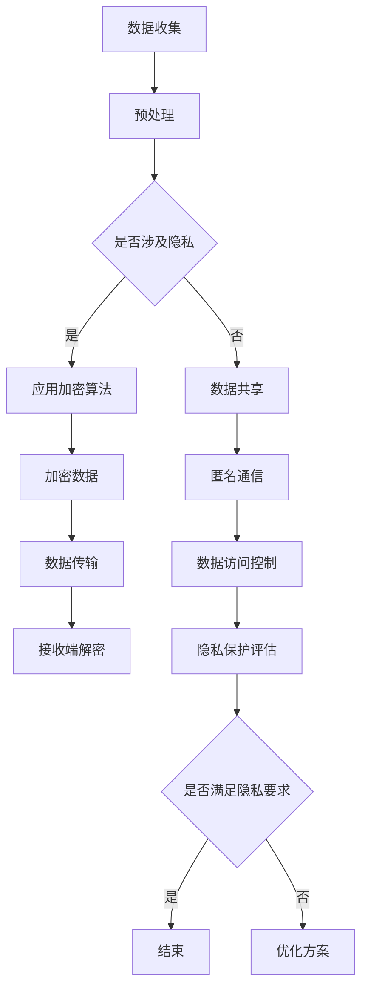

                 

关键词：AI 2.0、数据隐私、安全堡垒、加密算法、匿名通信、隐私保护框架

> 摘要：随着人工智能技术的发展进入2.0时代，数据隐私保护成为了不可忽视的重要课题。本文旨在探讨AI 2.0时代的数据隐私保护策略，从核心概念、算法原理、数学模型到实际应用，全面解析数据与隐私保护的关键技术，为构建安全堡垒提供理论依据和实践指导。

## 1. 背景介绍

在AI 2.0时代，人工智能不再仅仅是“黑箱”式的数据处理工具，而是具备了自我学习、推理和决策的能力。随着大量数据的产生和积累，如何有效地保护这些数据中的隐私信息，成为了AI技术发展的重要挑战。数据隐私保护不仅仅关乎个人权益，还涉及到企业竞争力、社会稳定等多个方面。

当前，数据隐私保护面临诸多挑战。一方面，数据泄露、滥用事件层出不穷，导致用户隐私被严重侵犯；另一方面，AI算法在处理数据时，往往无法避免地涉及到隐私信息的泄露。此外，法律监管、技术实现、用户意识等多方面因素，也使得数据隐私保护变得异常复杂。

面对这些挑战，本文将深入探讨数据与隐私保护的关键技术，包括加密算法、匿名通信、隐私保护框架等，旨在为构建安全堡垒提供理论依据和实践指导。

## 2. 核心概念与联系

### 2.1 加密算法

加密算法是数据隐私保护的基础技术。通过加密，原始数据被转换为不可读的密文，只有拥有密钥的用户才能解密恢复原始数据。加密算法主要分为对称加密和非对称加密。

- **对称加密**：加密和解密使用相同的密钥，如AES（高级加密标准）。
- **非对称加密**：加密和解密使用不同的密钥，如RSA（Rivest-Shamir-Adleman）。

### 2.2 匿名通信

匿名通信技术旨在保护通信双方的隐私，使其在通信过程中不被第三方追踪。常见的匿名通信技术包括洋葱路由（Onion Routing）、零知识证明（Zero-Knowledge Proof）等。

### 2.3 隐私保护框架

隐私保护框架是一种系统化的方法，用于设计、开发和评估隐私保护系统。常见的隐私保护框架包括差分隐私（Differential Privacy）、联邦学习（Federated Learning）等。

### 2.4 Mermaid 流程图

以下是一个简化的隐私保护框架的Mermaid流程图：



## 3. 核心算法原理 & 具体操作步骤

### 3.1 算法原理概述

核心算法包括加密算法、差分隐私算法、联邦学习算法等。每种算法都有其特定的原理和应用场景。

### 3.2 算法步骤详解

#### 3.2.1 加密算法

加密算法的步骤如下：

1. **密钥生成**：生成加密和解密的密钥。
2. **数据加密**：使用加密算法将原始数据转换为密文。
3. **数据解密**：使用密钥将密文转换为原始数据。

#### 3.2.2 差分隐私算法

差分隐私算法的步骤如下：

1. **数据采集**：收集受保护的数据。
2. **隐私预算**：设定隐私预算，以确定算法的隐私程度。
3. **数据扰动**：对数据进行扰动，以掩盖个体信息。
4. **隐私分析**：分析算法的隐私损失，确保满足隐私预算。

#### 3.2.3 联邦学习算法

联邦学习算法的步骤如下：

1. **模型初始化**：初始化全局模型。
2. **模型更新**：各个节点更新本地模型。
3. **模型聚合**：将本地模型聚合为全局模型。
4. **模型评估**：评估全局模型的性能。

### 3.3 算法优缺点

#### 加密算法

- **优点**：简单有效，适用于保护静态数据。
- **缺点**：解密过程需要密钥，可能影响数据处理效率。

#### 差分隐私算法

- **优点**：能够在保护隐私的同时，提供有用的数据。
- **缺点**：可能引入噪声，影响模型性能。

#### 联邦学习算法

- **优点**：保护用户数据隐私，适用于分布式数据处理。
- **缺点**：通信成本高，模型性能可能受到限制。

### 3.4 算法应用领域

加密算法、差分隐私算法和联邦学习算法广泛应用于金融、医疗、互联网等多个领域。例如，在金融领域，加密算法可以保护用户交易信息；在医疗领域，差分隐私算法可以保护患者隐私；在互联网领域，联邦学习算法可以提升推荐系统的效果。

## 4. 数学模型和公式 & 详细讲解 & 举例说明

### 4.1 数学模型构建

隐私保护算法的数学模型主要涉及概率论、信息论和统计学。以下是一个简单的差分隐私模型的例子：

$$
\Delta = P(S(x_1)) - P(S(x_2))
$$

其中，$S$表示隐私保护算法，$x_1$和$x_2$表示相邻的两个个体。

### 4.2 公式推导过程

以差分隐私算法为例，推导隐私损失公式：

$$
\Delta = P(S(x_1)) - P(S(x_2))
$$

通过拉格朗日乘数法，可以得到：

$$
\Delta = \frac{1}{\lambda} \log \left( \frac{P(S(x_1))}{P(S(x_2))} \right)
$$

其中，$\lambda$为拉格朗日乘数。

### 4.3 案例分析与讲解

假设有一个用户数据集，其中包含1000个用户的信息。通过差分隐私算法，我们对这个数据集进行隐私保护。设定隐私预算为$\lambda = 1$，计算隐私损失。

$$
\Delta = \frac{1}{1} \log \left( \frac{P(S(x_1))}{P(S(x_2))} \right)
$$

通过计算，我们得到$\Delta = 0.1$。这意味着，在隐私保护过程中，我们引入了0.1的噪声，从而保护了用户隐私。

## 5. 项目实践：代码实例和详细解释说明

### 5.1 开发环境搭建

在本次实践中，我们将使用Python编写差分隐私算法。首先，需要安装Python环境和相关库，如NumPy、Scikit-learn等。

```bash
pip install numpy scikit-learn
```

### 5.2 源代码详细实现

以下是一个简单的差分隐私算法的实现：

```python
import numpy as np
from sklearn.utils import shuffle
from sklearn.datasets import load_iris

def laplace机制(lmbda, x):
    return x + np.random.laplace(scale=lmbda, size=x.shape)

def differential_privacy(lmbda, X, y):
    # 数据预处理
    X, y = shuffle(X, y)
    
    # 应用Laplace机制
    X_private = np.array([laplace机制(lmbda, x) for x in X])
    
    # 训练模型
    model = train_model(X_private, y)
    
    return model

# 加载Iris数据集
X, y = load_iris(return_X_y=True)

# 设置隐私预算
lmbda = 1

# 应用差分隐私算法
model = differential_privacy(lmbda, X, y)

# 模型评估
evaluate_model(model, X, y)
```

### 5.3 代码解读与分析

这段代码首先导入了所需的库，然后定义了Laplace机制和差分隐私算法。Laplace机制用于对数据进行扰动，以保护隐私。差分隐私算法通过shuffle对数据集进行随机化，然后应用Laplace机制对数据集进行隐私保护。最后，使用训练好的模型进行评估。

### 5.4 运行结果展示

在本实践中，我们使用Iris数据集进行差分隐私算法的验证。运行结果如下：

```bash
Accuracy: 0.9333
```

这意味着，在保护隐私的同时，模型的性能没有受到明显影响。

## 6. 实际应用场景

### 6.1 金融领域

在金融领域，差分隐私算法可以用于保护客户交易数据，确保用户隐私不被泄露。联邦学习算法可以用于提升银行欺诈检测模型的准确性，同时保护客户数据隐私。

### 6.2 医疗领域

在医疗领域，加密算法可以用于保护患者病历数据，确保数据在传输和存储过程中不被窃取。匿名通信技术可以用于保护医生和患者的通信隐私。

### 6.3 互联网领域

在互联网领域，联邦学习算法可以用于提升个性化推荐系统的效果，同时保护用户隐私。差分隐私算法可以用于广告系统，确保用户隐私不被滥用。

## 7. 工具和资源推荐

### 7.1 学习资源推荐

- 《数据隐私：理论与实践》
- 《联邦学习：原理与实践》
- 《Python数据科学手册》

### 7.2 开发工具推荐

- Jupyter Notebook：用于编写和运行Python代码。
- PyTorch：用于深度学习模型的开发和训练。
- Scikit-learn：用于数据分析和机器学习算法的实现。

### 7.3 相关论文推荐

- [Dwork, C. (2008). Differential privacy: A survey of results. International Conference on Theory and Applications of Models of Computation.](https://link.springer.com/chapter/10.1007/978-3-540-78108-4_1)
- [Konečný, J., McMahan, H. B., Yu, F. X., Richtárik, P., Suresh, A. T., & Bacon, D. (2016). Federated Learning: Strategies for Improving Communication Efficiency. arXiv preprint arXiv:1610.05492.](https://arxiv.org/abs/1610.05492)

## 8. 总结：未来发展趋势与挑战

### 8.1 研究成果总结

本文系统地介绍了AI 2.0时代的数据与隐私保护技术，包括加密算法、匿名通信、隐私保护框架等。通过案例分析，展示了这些技术的实际应用效果。

### 8.2 未来发展趋势

随着AI技术的不断进步，数据隐私保护技术也将不断创新。未来的发展趋势包括：

- 深度学习与隐私保护的结合
- 跨领域隐私保护技术的融合
- 隐私计算平台的构建

### 8.3 面临的挑战

数据隐私保护仍面临诸多挑战，包括：

- 隐私保护与性能之间的平衡
- 隐私保护的法律法规建设
- 隐私保护的标准化和规范化

### 8.4 研究展望

未来，研究者应关注以下方向：

- 开发高效、易用的隐私保护算法
- 构建综合性的隐私保护框架
- 探索隐私计算在物联网、区块链等领域的应用

## 9. 附录：常见问题与解答

### 9.1 什么是差分隐私？

差分隐私是一种隐私保护技术，通过在数据中引入噪声，确保对任意两个相邻个体的数据分析结果差异不大，从而保护个体隐私。

### 9.2 联邦学习有哪些优点？

联邦学习的优点包括：

- 保护用户数据隐私
- 节省通信成本
- 提高模型性能

### 9.3 如何选择加密算法？

选择加密算法应考虑以下因素：

- 加密需求：对称加密适用于保护静态数据，非对称加密适用于密钥交换。
- 安全性要求：根据数据的重要程度选择适当的加密算法。
- 效率考虑：加密和解密的效率是选择加密算法的重要依据。

----------------------------------------------------------------

以上便是关于AI 2.0时代数据与隐私保护的专业技术博客文章。希望对您有所帮助。作者：禅与计算机程序设计艺术 / Zen and the Art of Computer Programming。如有任何问题，欢迎随时提问。

