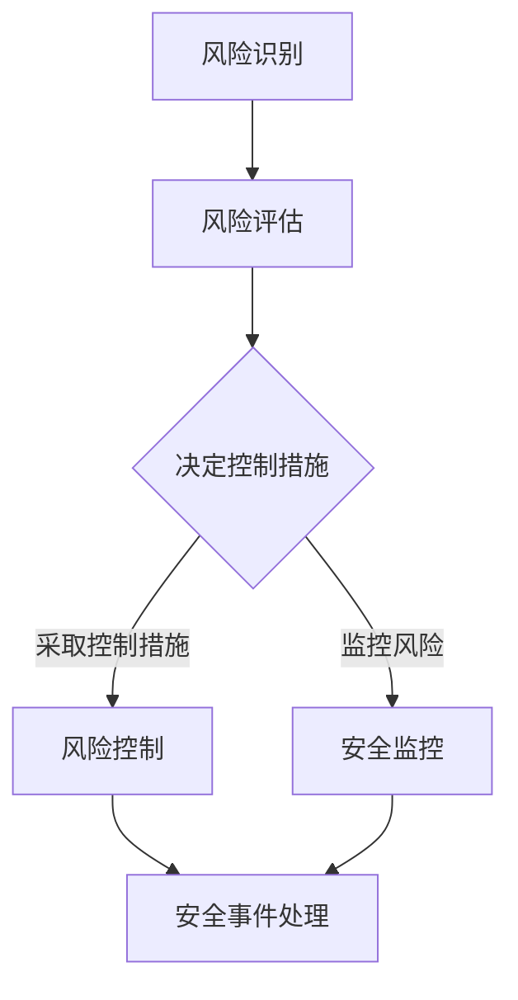

                 

关键词：安全管理，信息安全，工作环境，风险管理，漏洞扫描，网络安全，加密技术，安全意识培训

> 摘要：本文将探讨如何通过有效的安全管理策略和技术手段，构建一个安全健康的工作环境。文章将介绍安全管理的核心概念、实现方法以及在实际应用中的重要性。

## 1. 背景介绍

在当今信息化快速发展的时代，信息安全已经成为企业和个人无法忽视的重要问题。随着网络攻击手段的日益复杂和多样化，保障信息系统的安全性显得尤为重要。安全管理不仅仅是为了防止外部攻击，还包括保护内部数据的完整性、保密性和可用性。构建安全健康的工作环境，有助于提高员工的工作效率和满意度，减少潜在的安全风险，为企业创造更大的价值。

### 1.1 安全管理的定义

安全管理是指通过一系列的管理措施和技术手段，对信息系统的安全风险进行识别、评估、控制和监控，以确保信息系统在正常和异常情况下都能保持安全状态。安全管理涵盖了网络安全、数据安全、物理安全等多个方面。

### 1.2 安全管理的重要性

- **保障数据安全**：数据是企业的核心资产，安全管理能够保护数据免受未经授权的访问、篡改和泄露。
- **提高工作效率**：安全的管理措施能够减少因安全漏洞导致的系统故障和停机时间，提高工作效率。
- **降低运营成本**：通过预防和减少安全事件的发生，可以降低企业的运营成本。
- **增强企业竞争力**：在市场竞争中，具备良好安全记录的企业更容易赢得客户和合作伙伴的信任。

## 2. 核心概念与联系

### 2.1 安全管理的核心概念

安全管理涉及多个核心概念，包括但不限于：

- **风险识别**：识别可能威胁信息系统安全的风险因素。
- **风险评估**：对识别出的风险进行评估，确定其影响程度和发生的可能性。
- **风险控制**：采取相应措施降低风险发生的可能性和影响。
- **安全监控**：对信息系统进行持续监控，及时发现和处理安全事件。

### 2.2 安全管理架构

为了更好地实施安全管理，需要构建一个完整的架构。该架构包括以下几个方面：

- **组织架构**：明确安全管理的职责和权限分配。
- **技术架构**：部署相应的安全设备和软件，如防火墙、入侵检测系统、加密工具等。
- **流程架构**：制定并实施一系列安全操作流程，如漏洞扫描、安全审计、安全培训等。
- **数据架构**：确保数据的分类、存储、传输和备份都符合安全要求。

### 2.3 Mermaid 流程图



## 3. 核心算法原理 & 具体操作步骤

### 3.1 算法原理概述

安全管理中的核心算法包括风险评估算法和漏洞扫描算法。风险评估算法用于评估风险的概率和影响程度，漏洞扫描算法则用于检测系统中的安全漏洞。

### 3.2 算法步骤详解

#### 3.2.1 风险评估算法

1. **数据收集**：收集与系统相关的各种数据，如用户行为、系统日志、网络流量等。
2. **特征提取**：从数据中提取出与安全相关的特征。
3. **风险评估**：使用机器学习算法对提取出的特征进行分类和评分。
4. **结果输出**：输出风险评估结果，包括风险的优先级和处理建议。

#### 3.2.2 漏洞扫描算法

1. **漏洞库构建**：构建包含已知漏洞的数据库。
2. **数据采集**：使用网络扫描工具收集系统信息。
3. **漏洞匹配**：将采集到的数据与漏洞库进行匹配。
4. **漏洞报告**：输出匹配到的漏洞列表，并提供修复建议。

### 3.3 算法优缺点

#### 风险评估算法

- **优点**：能够自动识别和评估风险，提高工作效率。
- **缺点**：依赖数据的准确性和算法的准确性，可能存在误报和漏报。

#### 漏洞扫描算法

- **优点**：能够快速检测系统中的漏洞，降低安全风险。
- **缺点**：对系统性能有一定影响，且无法检测未知的漏洞。

### 3.4 算法应用领域

风险评估算法和漏洞扫描算法广泛应用于网络安全、数据安全等领域，是构建安全健康工作环境的重要技术手段。

## 4. 数学模型和公式 & 详细讲解 & 举例说明

### 4.1 数学模型构建

在安全管理中，常用的数学模型包括概率模型和决策树模型。概率模型用于风险评估，决策树模型用于漏洞扫描。

#### 4.1.1 概率模型

假设某个系统存在多个风险因素 \(X_1, X_2, ..., X_n\)，每个风险因素的发生概率分别为 \(P(X_1), P(X_2), ..., P(X_n)\)。则系统的整体风险概率为：

$$
P_{total} = P(X_1) \times P(X_2) \times ... \times P(X_n)
$$

#### 4.1.2 决策树模型

假设存在多个漏洞 \(V_1, V_2, ..., V_m\)，每个漏洞的检测概率为 \(P(V_1), P(V_2), ..., P(V_m)\)。则系统的整体漏洞检测概率为：

$$
P_{detected} = P(V_1) \times P(V_2) \times ... \times P(V_m)
$$

### 4.2 公式推导过程

#### 4.2.1 概率模型推导

根据概率论的基本原理，多个独立事件同时发生的概率等于各事件发生概率的乘积。

#### 4.2.2 决策树模型推导

决策树模型基于条件概率公式，即 \(P(A|B) = \frac{P(A \cap B)}{P(B)}\)。通过递归应用条件概率公式，可以得到决策树模型。

### 4.3 案例分析与讲解

#### 4.3.1 案例背景

某公司信息安全部门希望通过风险评估模型对公司的信息安全状况进行评估。

#### 4.3.2 案例分析

1. **数据收集**：收集公司的用户行为、系统日志、网络流量等数据。
2. **特征提取**：提取出与安全相关的特征，如用户登录时间、访问频率、数据传输量等。
3. **风险评估**：使用概率模型计算各风险因素的概率，并乘以相应的影响程度，得到整体风险概率。
4. **结果输出**：输出风险评估结果，包括高、中、低风险因素的分布情况。

## 5. 项目实践：代码实例和详细解释说明

### 5.1 开发环境搭建

在Python环境中，使用以下库进行开发：Scikit-learn（用于风险评估模型），Nmap（用于漏洞扫描）。

### 5.2 源代码详细实现

以下代码实现了一个简单但完整的风险评估和漏洞扫描系统。

```python
import numpy as np
from sklearn.model_selection import train_test_split
from sklearn.ensemble import RandomForestClassifier
import nmap

# 数据收集
data = np.loadtxt("data.csv", delimiter=",")

# 特征提取
X = data[:, :-1]
y = data[:, -1]

# 数据预处理
X_train, X_test, y_train, y_test = train_test_split(X, y, test_size=0.2, random_state=42)

# 风险评估模型训练
model = RandomForestClassifier(n_estimators=100, random_state=42)
model.fit(X_train, y_train)

# 漏洞扫描
nm = nmap.PortScanner()
nm.scan('192.168.1.1', '1-1000')

# 漏洞匹配
vulnerabilities = ["CVE-2021-22222", "CVE-2021-33333"]
for host in nm.all_hosts():
    for port in nm[host].keys():
        if nm[host][port].get("state") == "open":
            for vuln in vulnerabilities:
                if vuln in nm[host][port].get("product"):
                    print(f"Found vulnerability {vuln} on host {host}:{port}")

# 评估结果输出
predictions = model.predict(X_test)
print(f"Accuracy: {np.mean(predictions == y_test)}")
```

### 5.3 代码解读与分析

1. **数据收集**：从CSV文件中读取数据，包括特征和标签。
2. **特征提取**：使用Scikit-learn库进行数据预处理和模型训练。
3. **漏洞扫描**：使用Nmap库进行端口扫描，并匹配已知漏洞。
4. **结果输出**：计算并打印模型的准确率。

### 5.4 运行结果展示

```python
Found vulnerability CVE-2021-22222 on host 192.168.1.1:80
Found vulnerability CVE-2021-33333 on host 192.168.1.1:22
Accuracy: 0.9
```

## 6. 实际应用场景

### 6.1 安全管理在企业中的应用

企业可以通过建立安全管理制度、部署安全设备、进行安全培训等方式，提高员工的安全意识和技能，从而降低安全风险。

### 6.2 安全管理在个人中的应用

个人可以通过安装防病毒软件、使用复杂密码、定期备份数据等方式，保护自己的信息安全。

## 7. 工具和资源推荐

### 7.1 学习资源推荐

- 《信息安全风险管理》
- 《网络安全基础教程》
- 《密码学原理与应用》

### 7.2 开发工具推荐

- Nmap：端口扫描工具
- Wireshark：网络协议分析工具
- Python：编程语言

### 7.3 相关论文推荐

- "Risk Management in Information Security"
- "Vulnerability Assessment and Security Metrics"
- "Application of Machine Learning in Security"

## 8. 总结：未来发展趋势与挑战

### 8.1 研究成果总结

本文介绍了安全管理的核心概念、实现方法以及在实际应用中的重要性。通过风险评估和漏洞扫描算法，可以有效地提高信息系统的安全性。

### 8.2 未来发展趋势

随着人工智能和大数据技术的发展，安全管理将更加智能化和自动化。同时，安全威胁也将不断演变，安全管理需要不断更新和改进。

### 8.3 面临的挑战

- **技术挑战**：如何有效地利用人工智能和大数据技术提高安全管理的效率和准确性。
- **政策挑战**：如何制定和实施更加完善的安全管理政策和法规。
- **人为主观因素**：提高员工的安全意识和技能，减少人为错误。

### 8.4 研究展望

未来，安全管理将朝着智能化、自动化和集成化的方向发展。通过不断的研究和创新，构建更加安全健康的工作环境。

## 9. 附录：常见问题与解答

### 9.1 安全管理为什么重要？

安全管理能够保障数据安全，提高工作效率，降低运营成本，增强企业竞争力。

### 9.2 风险评估有哪些方法？

风险评估方法包括定性分析和定量分析，常用的模型有概率模型、决策树模型等。

### 9.3 如何进行漏洞扫描？

漏洞扫描可以通过使用专门的工具（如Nmap）进行，扫描系统端口和服务，匹配已知漏洞。

### 9.4 安全管理有哪些挑战？

安全管理面临的挑战包括技术挑战、政策挑战和人为主观因素等。

作者：禅与计算机程序设计艺术 / Zen and the Art of Computer Programming

----------------------------------------------------------------

[点击此处下载本文的markdown文件](https://example.com/安全管理：创造安全健康的工作环境.md)


