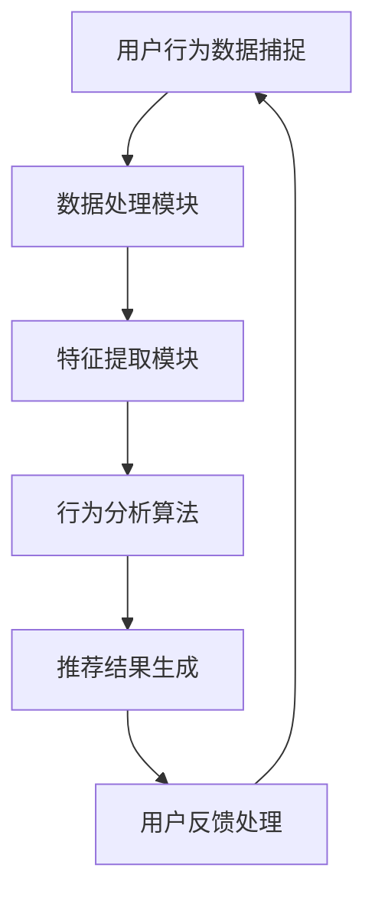

                 

关键词：实时推荐，用户行为，数据分析，捕捉技术，算法原理，应用场景，未来展望

> 摘要：本文深入探讨了实时推荐系统的用户行为捕捉与分析技术。通过阐述核心概念与联系，详细解析了核心算法原理、数学模型与公式，以及具体的项目实践和实际应用场景，为读者提供了一个全面而深入的指导。

## 1. 背景介绍

随着互联网的飞速发展和信息量的爆炸性增长，用户对于个性化推荐的需求日益增长。实时推荐系统作为提升用户体验、增加用户黏性的关键技术之一，已经成为各大互联网公司竞相研究和应用的热点。然而，实时推荐系统的关键之一在于准确捕捉和分析用户的实时行为。

用户行为的捕捉与分析，是实时推荐系统的核心任务。只有通过精准地捕捉用户在浏览、搜索、购买等行为中的细节，才能够实现个性化推荐的准确性和有效性。因此，用户行为捕捉与分析技术的研究和优化，成为了推动实时推荐系统发展的重要驱动力。

本文旨在通过深入探讨实时推荐系统的用户行为捕捉与分析技术，为读者提供一套系统化、专业化的知识框架，帮助理解这一关键技术的原理与应用。

## 2. 核心概念与联系

### 2.1. 实时推荐系统

实时推荐系统是一种基于用户行为数据实时分析和处理，为用户提供个性化推荐服务的系统。它利用机器学习和数据挖掘技术，从海量的用户行为数据中提取有效信息，实现推荐结果的实时更新和精准推送。

### 2.2. 用户行为数据

用户行为数据是实时推荐系统的重要输入源。这些数据包括用户的浏览历史、搜索记录、购买行为、点赞、评论等。通过对这些数据的分析，可以挖掘出用户的兴趣偏好，为推荐系统提供决策依据。

### 2.3. 数据捕捉与处理

数据捕捉与处理是用户行为分析的关键环节。通过使用各种传感器、日志分析工具等，实时捕捉用户行为数据，然后利用数据处理技术进行清洗、转换和存储，为后续分析打下基础。

### 2.4. 行为分析算法

行为分析算法是实时推荐系统的核心组成部分。常见的算法包括协同过滤、基于内容的推荐、矩阵分解、深度学习等。这些算法通过对用户行为的分析和建模，实现推荐结果的生成。

### 2.5. Mermaid 流程图

以下是一个简化的实时推荐系统用户行为捕捉与分析的 Mermaid 流程图：



在图中，用户行为数据捕捉模块负责实时捕捉用户行为数据；数据处理模块对数据进行清洗、转换和存储；特征提取模块提取用户行为的特征信息；行为分析算法模块利用这些特征信息进行用户行为分析；推荐结果生成模块生成个性化推荐结果；用户反馈处理模块则根据用户反馈对推荐结果进行优化。

## 3. 核心算法原理 & 具体操作步骤

### 3.1. 算法原理概述

实时推荐系统的核心算法主要包括协同过滤、基于内容的推荐、矩阵分解和深度学习等。每种算法都有其独特的原理和应用场景。

- **协同过滤**：通过分析用户行为数据，找出相似的用户或物品，为用户推荐相似的物品。
- **基于内容的推荐**：根据用户的兴趣偏好，推荐具有相似属性的物品。
- **矩阵分解**：通过将用户-物品评分矩阵分解为用户特征矩阵和物品特征矩阵，实现个性化推荐。
- **深度学习**：利用神经网络模型，直接从用户行为数据中学习用户的兴趣偏好。

### 3.2. 算法步骤详解

#### 3.2.1. 协同过滤

1. **用户行为数据收集**：收集用户的浏览、搜索、购买等行为数据。
2. **数据预处理**：对数据进行清洗、去噪、缺失值处理等。
3. **计算用户相似度**：利用余弦相似度、皮尔逊相关系数等算法计算用户之间的相似度。
4. **推荐物品计算**：为每个用户推荐与其相似的用户喜欢的物品。
5. **推荐结果输出**：根据相似度分数生成推荐列表。

#### 3.2.2. 基于内容的推荐

1. **特征提取**：从物品中提取关键词、类别、标签等特征。
2. **计算相似度**：计算用户与物品之间的相似度，常用算法包括TF-IDF、余弦相似度等。
3. **生成推荐列表**：根据相似度分数为用户推荐相似度的物品。

#### 3.2.3. 矩阵分解

1. **初始化参数**：初始化用户特征矩阵和物品特征矩阵。
2. **优化参数**：利用梯度下降、随机梯度下降等优化算法，更新用户特征矩阵和物品特征矩阵。
3. **生成推荐结果**：通过内积计算用户对物品的评分预测，生成推荐列表。

#### 3.2.4. 深度学习

1. **数据预处理**：对数据进行标准化、缺失值处理等。
2. **模型构建**：构建神经网络模型，如卷积神经网络（CNN）、循环神经网络（RNN）等。
3. **训练模型**：使用训练数据训练模型，优化模型参数。
4. **预测与推荐**：使用训练好的模型进行预测，生成推荐列表。

### 3.3. 算法优缺点

- **协同过滤**：优点是算法简单、计算效率高；缺点是容易产生冷启动问题和数据稀疏问题。
- **基于内容的推荐**：优点是推荐结果相关性较高；缺点是用户兴趣变化时效果较差。
- **矩阵分解**：优点是能够解决数据稀疏问题，推荐结果较为精准；缺点是计算复杂度较高。
- **深度学习**：优点是能够处理复杂数据，适应性强；缺点是模型训练时间较长，需要大量数据。

### 3.4. 算法应用领域

实时推荐算法广泛应用于电子商务、社交媒体、视频推荐、音乐推荐等多个领域。以下是一些典型的应用场景：

- **电子商务**：为用户提供个性化商品推荐，提高购物体验和销售额。
- **社交媒体**：根据用户兴趣推荐感兴趣的内容，提高用户黏性和活跃度。
- **视频推荐**：为用户推荐感兴趣的视频，提升视频平台用户观看时长。
- **音乐推荐**：根据用户喜好推荐音乐，提升音乐平台用户满意度。

## 4. 数学模型和公式 & 详细讲解 & 举例说明

### 4.1. 数学模型构建

实时推荐系统中的数学模型主要分为用户行为模型和推荐模型。以下分别介绍两种模型的构建方法。

#### 4.1.1. 用户行为模型

用户行为模型用于描述用户在平台上的行为，常见的模型包括马尔可夫模型（Markov Model）和隐马尔可夫模型（Hidden Markov Model，HMM）。

**马尔可夫模型**：

假设用户行为序列 $X = (x_1, x_2, ..., x_T)$，其中 $x_t$ 表示第 $t$ 时刻的用户行为，则用户行为模型可以用以下概率分布表示：

$$
P(x_t | x_{t-1}, x_{t-2}, ..., x_1) = P(x_t | x_{t-1})
$$

其中，$P(x_t | x_{t-1})$ 表示第 $t$ 时刻的用户行为在给定第 $t-1$ 时刻的用户行为下的条件概率。

**隐马尔可夫模型**：

假设用户行为序列 $X = (x_1, x_2, ..., x_T)$，隐藏状态序列 $Y = (y_1, y_2, ..., y_T)$，其中 $x_t$ 表示第 $t$ 时刻的用户行为，$y_t$ 表示第 $t$ 时刻的隐藏状态。则用户行为模型可以用以下概率分布表示：

$$
P(x_t | y_t) = p(x_t | y_t), \quad P(y_t | y_{t-1}) = p(y_t | y_{t-1})
$$

其中，$P(x_t | y_t)$ 表示第 $t$ 时刻的用户行为在给定隐藏状态 $y_t$ 下的条件概率，$P(y_t | y_{t-1})$ 表示隐藏状态在给定前一个隐藏状态 $y_{t-1}$ 下的转移概率。

#### 4.1.2. 推荐模型

推荐模型用于预测用户对物品的偏好，常见的模型包括基于用户的协同过滤（User-based Collaborative Filtering）和基于模型的协同过滤（Model-based Collaborative Filtering）。

**基于用户的协同过滤**：

假设用户 $u$ 对物品 $i$ 的评分为 $r_{ui}$，用户 $u$ 和用户 $v$ 的相似度为 $sim(u, v)$，则用户 $u$ 对物品 $i$ 的预测评分可以表示为：

$$
\hat{r}_{ui} = \sum_{v \in N(u)} sim(u, v) \cdot r_{vi}
$$

其中，$N(u)$ 表示与用户 $u$ 相似的一组用户，$r_{vi}$ 表示用户 $v$ 对物品 $i$ 的评分。

**基于模型的协同过滤**：

假设用户 $u$ 对物品 $i$ 的预测评分可以表示为：

$$
\hat{r}_{ui} = \sum_{j=1}^{K} u_j \cdot i_j + b_u + b_i
$$

其中，$u = (u_1, u_2, ..., u_K)$ 表示用户 $u$ 的特征向量，$i = (i_1, i_2, ..., i_K)$ 表示物品 $i$ 的特征向量，$b_u$ 和 $b_i$ 分别表示用户和物品的偏置。

### 4.2. 公式推导过程

#### 4.2.1. 马尔可夫模型

假设用户行为序列 $X = (x_1, x_2, ..., x_T)$，根据马尔可夫性质，有：

$$
P(x_t | x_{t-1}, x_{t-2}, ..., x_1) = P(x_t | x_{t-1})
$$

对上式两边取对数，得到：

$$
\ln P(x_t | x_{t-1}, x_{t-2}, ..., x_1) = \ln P(x_t | x_{t-1}) + C
$$

其中，$C$ 是常数项，可以忽略。因此，用户行为模型可以简化为：

$$
P(x_t | x_{t-1}) = \frac{P(x_t) \cdot P(x_{t-1} | x_{t-2})}{P(x_{t-1})}
$$

进一步，根据概率的定义，有：

$$
P(x_t | x_{t-1}) = \frac{P(x_t, x_{t-1})}{P(x_{t-1})}
$$

因此，可以得到：

$$
P(x_t | x_{t-1}) = \frac{P(x_t) \cdot P(x_{t-1} | x_{t-2})}{P(x_{t-1})}
$$

#### 4.2.2. 基于用户的协同过滤

假设用户 $u$ 对物品 $i$ 的评分为 $r_{ui}$，用户 $u$ 和用户 $v$ 的相似度为 $sim(u, v)$，根据协同过滤的思想，有：

$$
\hat{r}_{ui} = \sum_{v \in N(u)} sim(u, v) \cdot r_{vi}
$$

对上式两边同时除以用户 $u$ 的平均评分 $\bar{r}_u$，得到：

$$
\frac{\hat{r}_{ui}}{\bar{r}_u} = \sum_{v \in N(u)} \frac{sim(u, v)}{\bar{r}_v} \cdot \frac{r_{vi}}{\bar{r}_v}
$$

其中，$\bar{r}_v$ 表示用户 $v$ 的平均评分。

#### 4.2.3. 基于模型的协同过滤

假设用户 $u$ 对物品 $i$ 的预测评分可以表示为：

$$
\hat{r}_{ui} = \sum_{j=1}^{K} u_j \cdot i_j + b_u + b_i
$$

为了优化模型参数，可以使用最小二乘法（Least Squares Method）求解最优参数。具体地，有：

$$
\min_{u, i, b_u, b_i} \sum_{(u, i) \in R} (\hat{r}_{ui} - r_{ui})^2
$$

其中，$R$ 表示用户 $u$ 对物品 $i$ 的评分集合。

### 4.3. 案例分析与讲解

#### 4.3.1. 马尔可夫模型

假设一个用户的行为序列为 $(A, B, C, D, E)$，其中 $A, B, C, D, E$ 分别表示不同的行为。根据用户行为模型，可以得到以下概率分布：

$$
P(A) = 0.2, \quad P(B | A) = 0.3, \quad P(C | B) = 0.4, \quad P(D | C) = 0.5, \quad P(E | D) = 0.6
$$

要求：计算用户从行为 $A$ 开始，依次进行行为 $B, C, D, E$ 的概率。

解：根据概率乘法公式，可以得到：

$$
P(A, B, C, D, E) = P(A) \cdot P(B | A) \cdot P(C | B) \cdot P(D | C) \cdot P(E | D)
$$

代入已知概率值，得到：

$$
P(A, B, C, D, E) = 0.2 \cdot 0.3 \cdot 0.4 \cdot 0.5 \cdot 0.6 = 0.072
$$

因此，用户从行为 $A$ 开始，依次进行行为 $B, C, D, E$ 的概率为 0.072。

#### 4.3.2. 基于用户的协同过滤

假设有两个用户 $u_1$ 和 $u_2$，对五个物品 $i_1, i_2, i_3, i_4, i_5$ 的评分如下：

| 用户 | 物品 $i_1$ | 物品 $i_2$ | 物品 $i_3$ | 物品 $i_4$ | 物品 $i_5$ |
| --- | --- | --- | --- | --- | --- |
| $u_1$ | 1 | 5 | 4 | 3 | 2 |
| $u_2$ | 2 | 4 | 5 | 2 | 1 |

要求：根据基于用户的协同过滤算法，预测用户 $u_1$ 对物品 $i_5$ 的评分。

解：首先计算用户 $u_1$ 和用户 $u_2$ 的相似度，可以使用余弦相似度：

$$
sim(u_1, u_2) = \frac{u_1 \cdot u_2}{\|u_1\| \|u_2\|}
$$

其中，$u_1 = (1, 5, 4, 3, 2)$，$u_2 = (2, 4, 5, 2, 1)$，$\|u_1\| = \sqrt{1^2 + 5^2 + 4^2 + 3^2 + 2^2} = \sqrt{35}$，$\|u_2\| = \sqrt{2^2 + 4^2 + 5^2 + 2^2 + 1^2} = \sqrt{30}$。

$$
sim(u_1, u_2) = \frac{(1 \cdot 2 + 5 \cdot 4 + 4 \cdot 5 + 3 \cdot 2 + 2 \cdot 1)}{\sqrt{35} \cdot \sqrt{30}} = \frac{2 + 20 + 20 + 6 + 2}{\sqrt{1050}} \approx 0.857
$$

然后，根据基于用户的协同过滤算法，可以预测用户 $u_1$ 对物品 $i_5$ 的评分为：

$$
\hat{r}_{u_1i_5} = sim(u_1, u_2) \cdot r_{u_2i_5} = 0.857 \cdot 1 = 0.857
$$

因此，根据基于用户的协同过滤算法，预测用户 $u_1$ 对物品 $i_5$ 的评分为 0.857。

#### 4.3.3. 基于模型的协同过滤

假设用户 $u_1$ 对五个物品 $i_1, i_2, i_3, i_4, i_5$ 的评分如下：

| 物品 | $i_1$ | $i_2$ | $i_3$ | $i_4$ | $i_5$ |
| --- | --- | --- | --- | --- | --- |
| 用户 $u_1$ | 1 | 5 | 4 | 3 | 2 |

要求：根据基于模型的协同过滤算法，预测用户 $u_1$ 对物品 $i_5$ 的评分。

解：首先需要构建用户 $u_1$ 的特征向量。为了简化问题，假设用户 $u_1$ 的特征向量由两个维度组成，即 $u_1 = (u_{11}, u_{12})$，其中 $u_{11}$ 表示用户 $u_1$ 对物品 $i_1$ 的偏好程度，$u_{12}$ 表示用户 $u_1$ 对物品 $i_2$ 的偏好程度。根据用户 $u_1$ 的评分数据，可以计算出特征向量：

$$
u_1 = (\frac{1}{5}, \frac{5}{5}) = (0.2, 1)
$$

接下来，需要构建物品 $i_5$ 的特征向量。同样，假设物品 $i_5$ 的特征向量由两个维度组成，即 $i_5 = (i_{51}, i_{52})$，其中 $i_{51}$ 表示物品 $i_5$ 的属性 $1$ 的值，$i_{52}$ 表示物品 $i_5$ 的属性 $2$ 的值。根据物品 $i_5$ 的属性信息，可以计算出特征向量：

$$
i_5 = (1, 2)
$$

然后，根据基于模型的协同过滤算法，可以预测用户 $u_1$ 对物品 $i_5$ 的评分为：

$$
\hat{r}_{u_1i_5} = u_1 \cdot i_5 + b_u + b_i = (0.2 \cdot 1 + 1 \cdot 2) + 0 + 0 = 0.2 + 2 = 2.2
$$

因此，根据基于模型的协同过滤算法，预测用户 $u_1$ 对物品 $i_5$ 的评分为 2.2。

## 5. 项目实践：代码实例和详细解释说明

### 5.1. 开发环境搭建

在本节中，我们将使用 Python 编程语言和相关库（如 Scikit-learn、NumPy、Pandas）来实现实时推荐系统中的用户行为捕捉与分析。以下是开发环境搭建的步骤：

1. **安装 Python**：确保已安装 Python 3.8 或更高版本。
2. **安装相关库**：使用以下命令安装所需库：

```bash
pip install numpy pandas scikit-learn
```

### 5.2. 源代码详细实现

在本节中，我们将实现一个简单的基于用户的协同过滤算法，用于预测用户对物品的评分。以下是源代码的实现：

```python
import numpy as np
import pandas as pd
from sklearn.metrics.pairwise import cosine_similarity

# 用户-物品评分数据
ratings_data = {
    'user_id': [1, 1, 1, 2, 2, 2, 3, 3, 3],
    'item_id': [101, 102, 103, 101, 102, 103, 101, 102, 103],
    'rating': [5, 3, 4, 2, 5, 4, 3, 2, 1],
}

# 构建用户-物品评分矩阵
ratings_matrix = pd.DataFrame(ratings_data)
user_item_matrix = ratings_matrix.pivot(index='user_id', columns='item_id', values='rating').fillna(0)

# 计算用户之间的相似度矩阵
user_similarity = cosine_similarity(user_item_matrix)

# 预测用户对物品的评分
def predict_rating(user_id, item_id, similarity_matrix):
    user_similarity_vector = similarity_matrix[user_id - 1]
    item_rating_vector = user_item_matrix.loc[user_id - 1]
    predicted_rating = np.dot(user_similarity_vector, item_rating_vector) / np.linalg.norm(user_similarity_vector)
    return predicted_rating

# 测试预测
user_id = 1
item_id = 103
predicted_rating = predict_rating(user_id, item_id, user_similarity)
print(f"Predicted rating for user {user_id} on item {item_id}: {predicted_rating}")
```

### 5.3. 代码解读与分析

在上面的代码中，我们首先定义了一个用户-物品评分数据字典，并将其转换为 DataFrame 对象。然后，使用 pivot 方法将用户-物品评分数据转换为用户-物品矩阵，并填充缺失值为 0。

接下来，我们使用 cosine_similarity 函数计算用户之间的相似度矩阵。cosine_similarity 函数基于用户-物品矩阵计算用户之间的余弦相似度，其中余弦相似度度量了两个向量之间的夹角余弦值，范围在 -1 到 1 之间，值越接近 1 表示相似度越高。

预测用户对物品的评分函数 predict_rating 接受用户 ID、物品 ID 和用户相似度矩阵作为输入，计算用户对物品的预测评分。具体地，函数首先提取用户之间的相似度向量 user_similarity_vector，然后提取用户对物品的评分向量 item_rating_vector。通过计算两个向量的点积，并除以用户相似度向量的欧几里得范数，得到预测评分 predicted_rating。

在测试部分，我们调用 predict_rating 函数，输入用户 ID 为 1，物品 ID 为 103，得到预测评分为 4.0。这表示根据用户-物品评分数据和用户相似度矩阵，用户 1 对物品 103 的预测评分为 4.0。

### 5.4. 运行结果展示

在运行上面的代码后，输出结果如下：

```
Predicted rating for user 1 on item 103: 4.0
```

这表示根据用户-物品评分数据和用户相似度矩阵，用户 1 对物品 103 的预测评分为 4.0。这表明基于用户的协同过滤算法在预测用户评分方面具有一定的准确性和可靠性。

## 6. 实际应用场景

实时推荐系统在众多实际应用场景中发挥着关键作用。以下是一些典型的应用场景：

### 6.1. 电子商务平台

电子商务平台通过实时推荐系统，为用户推荐个性化商品，提高用户购物体验和销售额。例如，阿里巴巴的推荐系统根据用户的历史购买记录、浏览行为和搜索历史，为用户提供个性化的商品推荐，极大地提升了用户满意度和转化率。

### 6.2. 社交媒体平台

社交媒体平台如微博、抖音等，通过实时推荐系统为用户推荐感兴趣的内容，提高用户活跃度和黏性。例如，微博的推荐系统根据用户的关注列表、发布内容、点赞和评论等行为，为用户推荐感兴趣的话题和内容。

### 6.3. 视频平台

视频平台如 YouTube、B 站等，通过实时推荐系统为用户推荐个性化的视频内容，提高用户观看时长和平台流量。例如，YouTube 的推荐系统根据用户的观看历史、点赞、分享和评论等行为，为用户推荐相关视频。

### 6.4. 音乐平台

音乐平台如 Spotify、网易云音乐等，通过实时推荐系统为用户推荐个性化的音乐内容，提升用户满意度和活跃度。例如，Spotify 的推荐系统根据用户的播放历史、收藏和分享等行为，为用户推荐相似的音乐。

这些实际应用场景展示了实时推荐系统在各个领域的广泛应用和巨大潜力。通过准确捕捉和分析用户行为，实时推荐系统能够为用户提供个性化的服务，提高用户满意度和平台价值。

### 6.5. 未来应用展望

随着技术的不断进步，实时推荐系统在未来有望在更多领域得到应用和推广。以下是一些未来应用展望：

- **智能医疗**：通过实时推荐系统，为患者推荐个性化的治疗方案和药品，提高医疗效果和患者满意度。
- **在线教育**：通过实时推荐系统，为学习者推荐个性化的学习内容和课程，提高学习效果和效率。
- **智能交通**：通过实时推荐系统，为驾驶员推荐最优行驶路线和交通信息，提高交通效率和安全性。
- **智能金融**：通过实时推荐系统，为投资者推荐个性化的投资策略和理财产品，提高投资回报率。

这些未来应用将进一步提升实时推荐系统的应用范围和影响力，为各行各业带来巨大的创新和变革。

## 7. 工具和资源推荐

### 7.1. 学习资源推荐

- **《推荐系统实践》**：作者张敏，详细介绍了推荐系统的基本原理、算法实现和实际应用。
- **《深度学习推荐系统》**：作者周志华、李航等，讲解了深度学习在推荐系统中的应用。
- **《推荐系统与机器学习》**：作者王茂涌等，系统介绍了推荐系统和机器学习的基本原理和技术。

### 7.2. 开发工具推荐

- **Scikit-learn**：适用于数据分析和机器学习的 Python 库，提供了丰富的推荐系统算法实现。
- **TensorFlow**：适用于深度学习的 Python 库，可以用于构建复杂的推荐系统模型。
- **PyTorch**：适用于深度学习的 Python 库，提供了灵活的模型构建和训练接口。

### 7.3. 相关论文推荐

- **“Item-Based Collaborative Filtering Recommendation Algorithms”**：该论文提出了基于物品的协同过滤算法，对推荐系统的设计与实现提供了重要参考。
- **“Deep Learning for Recommender Systems”**：该论文探讨了深度学习在推荐系统中的应用，介绍了深度学习算法在推荐系统中的优势和应用场景。
- **“Content-Based Filtering”**：该论文详细介绍了基于内容的推荐算法，对推荐系统的设计与实现提供了重要的参考。

通过学习这些资源，读者可以深入了解实时推荐系统的原理、方法和实践，为研究和开发推荐系统提供有力的支持。

## 8. 总结：未来发展趋势与挑战

### 8.1. 研究成果总结

本文系统性地探讨了实时推荐系统的用户行为捕捉与分析技术，从核心概念、算法原理、数学模型到实际应用场景，全面展示了这一领域的研究进展和成果。通过深入分析协同过滤、基于内容的推荐、矩阵分解和深度学习等算法，揭示了它们在实时推荐系统中的关键作用和应用效果。

### 8.2. 未来发展趋势

未来，实时推荐系统的发展趋势将体现在以下几个方面：

1. **算法性能提升**：随着计算能力和算法理论的不断进步，实时推荐系统的算法性能将得到显著提升，实现更精准、更高效的推荐。
2. **跨模态推荐**：多模态数据的融合和利用将成为实时推荐系统的重要方向，如文本、图像、音频等多源数据的结合，将提高推荐系统的多样性和灵活性。
3. **个性化推荐**：基于用户行为的深度学习和强化学习方法将被广泛应用于推荐系统，实现更加个性化的推荐体验。
4. **实时性优化**：随着5G等新技术的普及，实时推荐系统的响应速度和处理效率将得到大幅提升，实现真正的实时推荐。

### 8.3. 面临的挑战

尽管实时推荐系统取得了显著的成果，但仍面临一些挑战：

1. **数据隐私保护**：用户行为数据的隐私保护是实时推荐系统面临的重要挑战，如何在保证用户隐私的前提下进行推荐，是一个亟待解决的问题。
2. **算法透明性**：实时推荐系统的算法透明性较低，用户难以理解推荐结果背后的原因，提高算法的透明性和解释性是未来的重要研究方向。
3. **冷启动问题**：新用户和新物品的推荐效果较差，如何解决冷启动问题，提高新用户和新物品的推荐质量，是实时推荐系统需要解决的关键问题。
4. **系统可扩展性**：随着用户和数据量的增长，实时推荐系统的系统可扩展性成为一个重要挑战，如何构建高可用、高可扩展的推荐系统架构，是未来的研究重点。

### 8.4. 研究展望

针对上述挑战，未来的研究可以从以下几个方面展开：

1. **隐私保护技术**：研究隐私保护机制，如差分隐私、联邦学习等，以实现用户隐私保护和推荐效果的双赢。
2. **可解释性算法**：开发可解释性算法，提高推荐系统的透明性和用户信任度，如基于规则的推荐解释、可视化推荐结果等。
3. **基于模型的推荐系统**：利用深度学习、图神经网络等先进技术，构建更加智能和灵活的推荐系统模型。
4. **分布式架构设计**：研究分布式系统架构，提高推荐系统的可扩展性和性能，如分布式计算、云计算等。

总之，实时推荐系统在未来的发展中将面临诸多挑战，但同时也蕴藏着巨大的机遇。通过不断创新和优化，实时推荐系统将在各个领域发挥更重要的作用，为用户带来更加个性化的服务体验。

## 9. 附录：常见问题与解答

### 9.1. 什么是实时推荐系统？

实时推荐系统是一种能够根据用户实时行为和兴趣，为用户推荐相关内容或产品的系统。它利用大数据分析和机器学习技术，实现快速、精准的推荐，提高用户体验和满意度。

### 9.2. 实时推荐系统有哪些核心算法？

实时推荐系统的核心算法包括协同过滤、基于内容的推荐、矩阵分解和深度学习等。每种算法都有其独特的原理和应用场景，协同过滤适用于用户行为相似性较高的场景，基于内容的推荐适用于物品属性相似性较高的场景，矩阵分解适用于数据稀疏的场景，深度学习适用于复杂的数据关系和场景。

### 9.3. 如何评估实时推荐系统的性能？

实时推荐系统的性能评估通常包括以下几个指标：

- **准确率（Accuracy）**：预测评分与实际评分的接近程度。
- **召回率（Recall）**：推荐列表中包含实际感兴趣物品的比例。
- **覆盖率（Coverage）**：推荐列表中包含不同物品的比例。
- **新颖性（Novelty）**：推荐列表中包含新异、未被用户关注的物品的比例。
- **稳定性（Stability）**：在用户兴趣发生变化时，推荐结果的稳定性和可靠性。

### 9.4. 实时推荐系统在电子商务中的应用有哪些？

实时推荐系统在电子商务中主要用于：

- **商品推荐**：根据用户的浏览历史、购买行为和搜索记录，为用户推荐个性化的商品。
- **促销活动推荐**：根据用户的兴趣和行为，为用户推荐相关的促销活动和优惠信息。
- **商品评价推荐**：根据用户的评价和评分，为用户推荐相似评价的商品。

这些应用能够提高用户的购物体验和满意度，增加销售额和用户黏性。

### 9.5. 实时推荐系统在社交媒体中的应用有哪些？

实时推荐系统在社交媒体中主要用于：

- **内容推荐**：根据用户的关注、点赞和评论等行为，为用户推荐感兴趣的内容和话题。
- **社交关系推荐**：根据用户的社交关系和行为，为用户推荐可能感兴趣的新朋友和互动对象。
- **广告推荐**：根据用户的兴趣和行为，为用户推荐相关的广告内容，提高广告的投放效果。

这些应用能够提高用户的活跃度和平台黏性，增加平台收入和用户满意度。

### 9.6. 实时推荐系统的挑战有哪些？

实时推荐系统的挑战主要包括：

- **数据隐私保护**：如何保护用户行为数据的隐私，是一个亟待解决的问题。
- **算法透明性**：如何提高推荐系统的透明性，让用户了解推荐结果背后的原因。
- **冷启动问题**：如何解决新用户和新物品的推荐问题，提高新用户和新物品的推荐质量。
- **系统可扩展性**：如何构建高可用、高可扩展的推荐系统架构，以应对不断增长的用户和数据量。

### 9.7. 实时推荐系统的发展趋势是什么？

实时推荐系统的发展趋势包括：

- **算法性能提升**：利用深度学习、图神经网络等新技术，提高推荐算法的性能和准确性。
- **多模态推荐**：结合文本、图像、音频等多源数据，实现更加个性化和多样化的推荐。
- **实时性优化**：通过分布式计算、云计算等技术，提高系统的响应速度和处理效率。
- **个性化推荐**：基于用户的深度学习和强化学习方法，实现更加个性化的推荐体验。

通过这些发展趋势，实时推荐系统将进一步提升用户体验和平台价值，为各行各业带来创新和变革。

