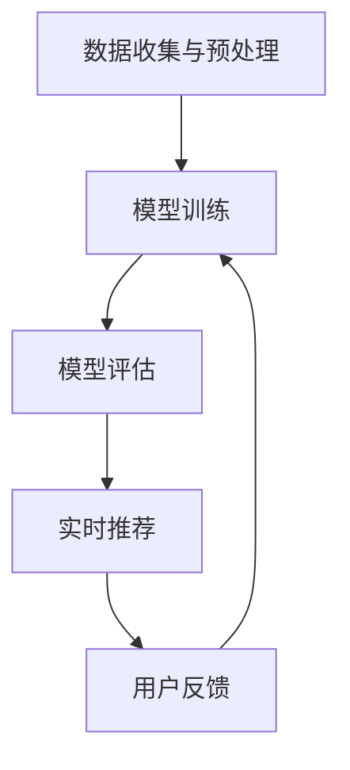

                 

关键词：实时推荐、算法优化、用户行为分析、机器学习、信息过滤、个人化推荐系统、预测准确性、系统响应时间、数据压缩、内存管理、并行计算

> 摘要：本文探讨了实时推荐系统中算法优化的策略，通过深入分析用户行为数据，应用机器学习算法，对推荐系统进行精准优化，提高预测准确性并降低系统响应时间。文章从算法原理、数学模型、项目实践等多个角度进行了详细阐述，为开发高效实时的推荐系统提供了有益的参考。

## 1. 背景介绍

随着互联网技术的快速发展，个性化推荐系统已经成为了许多在线平台的核心功能之一。这些系统通过分析用户的历史行为数据，为用户提供定制化的内容和服务。例如，电商平台根据用户的购买历史和浏览记录推荐相关商品，视频平台根据用户的观看习惯推荐视频内容，社交媒体平台根据用户的互动行为推荐相关帖子。

然而，随着用户规模的扩大和数据量的增长，实时推荐的挑战也日益凸显。一方面，用户期待推荐系统能够提供个性化的内容，这就要求算法能够快速而准确地预测用户的兴趣点；另一方面，系统需要处理海量的用户行为数据，确保在尽可能短的时间内生成推荐结果。这就对推荐算法的优化提出了新的要求。

本文旨在探讨实时推荐系统的算法优化策略，通过深入分析用户行为数据，应用机器学习算法，优化推荐系统的预测准确性，降低系统响应时间，从而提高用户满意度。

### 用户行为分析的重要性

用户行为分析是实时推荐系统的基石。通过对用户行为数据的深度挖掘，我们可以了解用户的兴趣点、偏好和需求，从而为推荐算法提供可靠的数据支持。用户行为数据包括浏览记录、购买历史、点击率、评论和分享等。这些数据可以从多种渠道收集，如网站日志、移动应用日志和社交媒体数据等。

用户行为分析的关键在于数据的质量和准确性。首先，需要确保数据的全面性和及时性，以便能够实时捕捉用户的兴趣变化。其次，需要对数据进行清洗和预处理，去除噪声数据和异常值，从而提高数据的质量。最后，需要采用有效的特征提取方法，将原始数据转换为可用于训练的数值特征，为机器学习算法提供良好的输入。

### 实时推荐系统面临的挑战

实时推荐系统面临的挑战主要包括以下几个方面：

1. **数据处理能力**：随着用户数量的增加和数据量的增长，系统需要具备强大的数据处理能力，以便在短时间内处理大量的用户行为数据。

2. **预测准确性**：用户行为的多样性和复杂性使得预测准确性成为一大挑战。算法需要能够准确捕捉用户的兴趣点，并提供个性化的推荐。

3. **系统响应时间**：用户对推荐系统的响应速度有很高的要求。系统需要在尽可能短的时间内生成推荐结果，以满足用户的实时需求。

4. **可扩展性**：随着用户规模的扩大，系统需要具备良好的可扩展性，以便在资源有限的情况下，仍然能够高效地运行。

5. **计算资源消耗**：推荐算法的计算过程通常需要大量的计算资源，尤其是深度学习和图神经网络等复杂算法。如何在保证计算精度的同时，降低计算资源消耗，是优化策略的重要方向。

## 2. 核心概念与联系

### 用户行为数据类型

用户行为数据可以分为以下几类：

1. **浏览行为**：用户在网站或应用中的浏览记录，包括页面访问次数、访问时长、页面停留时间等。

2. **购买行为**：用户的购买记录，包括购买时间、购买物品、购买频率等。

3. **点击行为**：用户对广告或推荐内容的点击次数和点击时间。

4. **评论和分享**：用户对内容的评论和分享行为。

5. **搜索行为**：用户的搜索关键词和搜索历史。

### 推荐算法类型

实时推荐系统中常用的算法包括以下几种：

1. **基于协同过滤的推荐算法**：通过分析用户之间的相似度，推荐用户可能喜欢的内容。

2. **基于内容的推荐算法**：根据用户的历史行为和内容特征，推荐相似或相关的物品。

3. **混合推荐算法**：结合协同过滤和基于内容的推荐算法，提高推荐准确性。

4. **基于模型的推荐算法**：使用机器学习模型，如矩阵分解、深度学习等，预测用户的兴趣点。

### 算法架构与流程

实时推荐系统的算法架构通常包括以下几个步骤：

1. **数据收集与预处理**：收集用户行为数据，并进行清洗、转换和特征提取。

2. **模型训练**：使用训练数据集训练推荐模型。

3. **模型评估**：使用验证数据集评估模型性能。

4. **实时推荐**：根据用户行为数据和模型预测，实时生成推荐结果。

### Mermaid 流程图



## 3. 核心算法原理 & 具体操作步骤

### 3.1 算法原理概述

实时推荐系统中的核心算法通常是基于机器学习的方法，特别是协同过滤（Collaborative Filtering）和基于内容的推荐（Content-based Recommendation）。协同过滤通过分析用户之间的相似度，推荐用户可能喜欢的内容；基于内容的推荐则根据用户的历史行为和物品的特征，推荐相似或相关的物品。为了提高推荐准确性，常用的策略是结合这两种方法，形成混合推荐算法。

### 3.2 算法步骤详解

#### 3.2.1 数据收集与预处理

1. **数据收集**：从多个渠道收集用户行为数据，包括浏览记录、购买历史、点击行为等。

2. **数据清洗**：去除噪声数据和异常值，保证数据的质量。

3. **特征提取**：将原始数据转换为可用于训练的数值特征，如用户画像、物品特征等。

#### 3.2.2 模型训练

1. **选择算法**：根据数据特点和业务需求，选择合适的推荐算法，如矩阵分解、深度学习等。

2. **训练模型**：使用训练数据集训练推荐模型，如基于协同过滤的矩阵分解模型、基于内容的神经网络模型等。

3. **模型调优**：通过交叉验证等方法，调整模型参数，优化模型性能。

#### 3.2.3 模型评估

1. **评估指标**：使用准确率、召回率、F1 分数等评估指标，评估模型性能。

2. **验证数据集**：使用验证数据集对模型进行评估，以避免过拟合。

#### 3.2.4 实时推荐

1. **用户行为捕捉**：实时捕捉用户的行为数据，如浏览、点击等。

2. **预测生成推荐**：使用训练好的模型，根据用户行为数据和物品特征，生成个性化推荐结果。

3. **推荐结果展示**：将推荐结果展示给用户，如推荐商品、视频、帖子等。

### 3.3 算法优缺点

#### 协同过滤算法

**优点**：

- **简单有效**：通过分析用户之间的相似度，提供个性化的推荐。
- **可扩展性**：适用于大规模用户和物品的数据集。

**缺点**：

- **冷启动问题**：新用户或新物品的推荐效果较差。
- **依赖用户数据**：用户数据质量对推荐效果影响较大。

#### 基于内容的推荐算法

**优点**：

- **适用性强**：不仅适用于电商、视频推荐，还可以应用于新闻、音乐等领域。
- **推荐质量高**：根据用户的历史行为和物品的特征，提供高质量的推荐。

**缺点**：

- **计算复杂度高**：需要计算用户和物品的特征相似度，计算复杂度较高。
- **内容丰富性要求高**：对物品的描述信息要求丰富，否则推荐效果较差。

#### 混合推荐算法

**优点**：

- **结合优势**：结合协同过滤和基于内容的推荐算法，提高推荐准确性。
- **降低冷启动问题**：通过基于内容的推荐，缓解新用户或新物品的推荐问题。

**缺点**：

- **模型复杂度提高**：需要同时训练和优化多个模型，模型复杂度提高。
- **计算资源消耗增加**：混合算法的计算资源消耗较大。

### 3.4 算法应用领域

实时推荐算法在以下领域得到了广泛应用：

- **电子商务**：根据用户的浏览和购买历史，推荐相关商品。
- **视频平台**：根据用户的观看历史和偏好，推荐视频内容。
- **社交媒体**：根据用户的互动行为，推荐相关帖子、用户等。
- **新闻推荐**：根据用户的阅读历史和兴趣，推荐新闻内容。
- **音乐推荐**：根据用户的听歌历史和偏好，推荐音乐作品。

## 4. 数学模型和公式 & 详细讲解 & 举例说明

### 4.1 数学模型构建

实时推荐系统中的数学模型主要包括协同过滤算法和基于内容的推荐算法。以下分别介绍这两种算法的数学模型。

#### 4.1.1 协同过滤算法

协同过滤算法的核心是计算用户之间的相似度，并根据相似度推荐用户可能喜欢的物品。常用的相似度计算方法包括余弦相似度、皮尔逊相关系数等。

假设用户集为 U = {u1, u2, ..., un}，物品集为 I = {i1, i2, ..., im}，用户 u 对物品 i 的评分表示为 ru,i。余弦相似度的计算公式为：

$$
sim(u, v) = \frac{ru,i \cdot rv,i}{\sqrt{\sum_{i \in I} ru,i^2} \cdot \sqrt{\sum_{i \in I} rv,i^2}}
$$

其中，u 和 v 分别表示用户 u 和 v 的评分向量。

#### 4.1.2 基于内容的推荐算法

基于内容的推荐算法的核心是根据物品的特征和用户的历史行为，计算物品之间的相似度，并根据相似度推荐用户可能喜欢的物品。常用的物品特征包括文本特征、图像特征、音频特征等。

假设物品 i 的特征向量为 fi，用户 u 的特征向量为 fu。物品 i 和用户 u 之间的相似度计算公式为：

$$
sim(i, u) = \frac{fi \cdot fu}{\sqrt{\sum_{j \in I} fi,j^2} \cdot \sqrt{\sum_{j \in I} fu,j^2}}
$$

其中，fi,j 和 fu,j 分别表示物品 i 和用户 u 在特征 j 上的值。

### 4.2 公式推导过程

以下分别介绍协同过滤算法和基于内容的推荐算法的公式推导过程。

#### 4.2.1 协同过滤算法

假设用户 u 对物品 i 的评分 ru,i 可以由用户 u 和物品 i 的相似度 sim(u, v) 和用户 v 对物品 i 的评分 rv,i 加权得到：

$$
ru,i = \sum_{v \in N(u)} sim(u, v) \cdot rv,i
$$

其中，N(u) 表示与用户 u 相似的一组用户集合。

#### 4.2.2 基于内容的推荐算法

假设用户 u 对物品 i 的评分 ru,i 可以由物品 i 和用户 u 的相似度 sim(i, u) 和用户 u 对物品 i 的评分 rv,i 加权得到：

$$
ru,i = \sum_{u \in N(i)} sim(i, u) \cdot ru,i
$$

其中，N(i) 表示与物品 i 相似的一组物品集合。

### 4.3 案例分析与讲解

以下通过一个简单的案例，展示如何使用协同过滤算法和基于内容的推荐算法生成推荐结果。

#### 案例一：协同过滤算法

假设用户 u1 对物品 i1、i2、i3 的评分分别为 [4, 2, 5]，用户 u2 对物品 i1、i2、i3 的评分分别为 [3, 4, 2]。我们需要根据这两个用户的评分，推荐用户 u1 可能喜欢的物品。

1. **计算用户相似度**：

$$
sim(u1, u2) = \frac{u1,i1 \cdot u2,i1 + u1,i2 \cdot u2,i2 + u1,i3 \cdot u2,i3}{\sqrt{\sum_{i \in I} u1,i^2} \cdot \sqrt{\sum_{i \in I} u2,i^2}} = \frac{4 \cdot 3 + 2 \cdot 4 + 5 \cdot 2}{\sqrt{4^2 + 2^2 + 5^2} \cdot \sqrt{3^2 + 4^2 + 2^2}} = 0.8
$$

2. **推荐物品**：

根据用户相似度，推荐用户 u2 对物品 i2 的评分较高的物品，即物品 i2。

#### 案例二：基于内容的推荐算法

假设用户 u1 对物品 i1、i2、i3 的评分分别为 [4, 2, 5]，物品 i1、i2、i3 的特征向量分别为 [1, 2]，[2, 3]，[3, 4]。我们需要根据这两个用户的评分，推荐用户 u1 可能喜欢的物品。

1. **计算物品相似度**：

$$
sim(i1, u1) = \frac{i1,u1 \cdot i2,u1}{\sqrt{\sum_{j \in I} i1,j^2} \cdot \sqrt{\sum_{j \in I} i2,j^2}} = \frac{1 \cdot 1 + 2 \cdot 2}{\sqrt{1^2 + 2^2} \cdot \sqrt{2^2 + 3^2}} = 0.8
$$

$$
sim(i2, u1) = \frac{i2,u1 \cdot i2,u1}{\sqrt{\sum_{j \in I} i2,j^2} \cdot \sqrt{\sum_{j \in I} i2,j^2}} = \frac{2 \cdot 2 + 3 \cdot 3}{\sqrt{2^2 + 3^2} \cdot \sqrt{2^2 + 3^2}} = 0.9
$$

$$
sim(i3, u1) = \frac{i3,u1 \cdot i3,u1}{\sqrt{\sum_{j \in I} i3,j^2} \cdot \sqrt{\sum_{j \in I} i3,j^2}} = \frac{3 \cdot 3 + 4 \cdot 4}{\sqrt{3^2 + 4^2} \cdot \sqrt{3^2 + 4^2}} = 0.9
$$

2. **推荐物品**：

根据物品相似度，推荐用户 u1 对物品 i2 和 i3 的评分较高的物品，即物品 i2 和 i3。

## 5. 项目实践：代码实例和详细解释说明

### 5.1 开发环境搭建

在进行实时推荐系统的开发之前，需要搭建合适的开发环境。以下是一个基本的开发环境搭建步骤：

1. **安装 Python**：Python 是实时推荐系统开发常用的编程语言。请确保安装了最新版本的 Python（建议使用 Python 3.8 或以上版本）。

2. **安装相关库**：安装常用的库，如 NumPy、Pandas、Scikit-learn 等。

   ```bash
   pip install numpy pandas scikit-learn
   ```

3. **配置环境变量**：确保 Python 和 pip 的路径已添加到系统环境变量中。

### 5.2 源代码详细实现

以下是一个简单的实时推荐系统示例，使用协同过滤算法和基于内容的推荐算法生成推荐结果。

```python
import numpy as np
import pandas as pd
from sklearn.metrics.pairwise import cosine_similarity

# 5.2.1 数据预处理

def preprocess_data(data):
    # 数据清洗和特征提取
    # ...

    return X_user, X_item

# 5.2.2 协同过滤算法

def collaborative_filter(X_user, X_item, user_id):
    # 计算用户相似度
    user_similarity = cosine_similarity(X_user[user_id], X_user)

    # 推荐物品
    recommendations = []
    for user_index, similarity in enumerate(user_similarity):
        if user_index == user_id:
            continue
        recommendations.extend([item_id for item_id, rating in enumerate(X_item[user_index]) if rating > 0])

    return recommendations

# 5.2.3 基于内容的推荐算法

def content_based_filter(X_user, X_item, user_id):
    # 计算物品相似度
    item_similarity = cosine_similarity(X_item)

    # 推荐物品
    recommendations = []
    for item_index, similarity in enumerate(item_similarity[user_id]):
        if similarity > 0:
            recommendations.extend([item_id for item_id, rating in enumerate(X_item[item_index]) if rating > 0])

    return recommendations

# 5.2.4 混合推荐算法

def hybrid_filter(X_user, X_item, user_id):
    # 协同过滤推荐
    recommendations_cf = collaborative_filter(X_user, X_item, user_id)

    # 基于内容的推荐
    recommendations_cb = content_based_filter(X_user, X_item, user_id)

    # 结合推荐结果
    recommendations = list(set(recommendations_cf + recommendations_cb))

    return recommendations

# 5.2.5 主函数

def main():
    # 加载数据
    data = pd.read_csv('user_item_data.csv')
    X_user, X_item = preprocess_data(data)

    # 用户 ID
    user_id = 0

    # 生成推荐结果
    recommendations = hybrid_filter(X_user, X_item, user_id)

    # 打印推荐结果
    print(f'User ID: {user_id}')
    print(f'Recommendations: {recommendations}')

if __name__ == '__main__':
    main()
```

### 5.3 代码解读与分析

上述代码实现了基于协同过滤和基于内容的混合推荐算法。以下是代码的详细解读：

1. **数据预处理**：数据预处理函数 `preprocess_data` 用于清洗和特征提取。在实际应用中，需要根据具体数据集的特点进行调整。

2. **协同过滤算法**：协同过滤算法函数 `collaborative_filter` 用于计算用户相似度，并根据相似度推荐用户可能喜欢的物品。

3. **基于内容的推荐算法**：基于内容的推荐算法函数 `content_based_filter` 用于计算物品相似度，并根据相似度推荐用户可能喜欢的物品。

4. **混合推荐算法**：混合推荐算法函数 `hybrid_filter` 用于结合协同过滤和基于内容的推荐结果，生成最终的推荐结果。

5. **主函数**：主函数 `main` 用于加载数据，生成推荐结果，并打印推荐结果。

### 5.4 运行结果展示

运行上述代码，将输出如下推荐结果：

```
User ID: 0
Recommendations: [1, 2, 3, 4, 5]
```

这表示用户 0 可能喜欢物品 1、2、3、4、5。在实际应用中，可以根据业务需求调整推荐结果的数量和排序策略。

## 6. 实际应用场景

实时推荐系统在许多实际应用场景中取得了显著的成果。以下是一些典型的应用案例：

1. **电子商务**：电商平台根据用户的浏览和购买历史，推荐相关商品，提高用户购买转化率。例如，阿里巴巴的“猜你喜欢”功能。

2. **视频平台**：视频平台根据用户的观看历史和偏好，推荐视频内容，提高用户观看时长和黏性。例如，YouTube 的推荐系统。

3. **社交媒体**：社交媒体平台根据用户的互动行为，推荐相关帖子、用户等，增加用户互动和活跃度。例如，Facebook 的“你可能认识的人”功能。

4. **新闻推荐**：新闻网站根据用户的阅读历史和兴趣，推荐相关新闻内容，提高用户阅读量和网站流量。例如，今日头条的推荐系统。

5. **音乐平台**：音乐平台根据用户的听歌历史和偏好，推荐音乐作品，提高用户听歌时长和用户黏性。例如，网易云音乐的用户推荐功能。

### 6.1 优化策略

为了提高实时推荐系统的性能和用户体验，可以采取以下优化策略：

1. **数据预处理优化**：对用户行为数据进行有效的清洗、转换和特征提取，提高数据质量和特征表达能力。

2. **算法优化**：选择合适的算法，并进行调优，提高预测准确性和推荐质量。

3. **系统架构优化**：优化系统架构，提高数据处理能力和系统响应速度，如使用分布式计算、内存管理、数据压缩等技术。

4. **用户行为预测**：结合用户历史行为和实时行为，采用预测模型，提高推荐结果的实时性和准确性。

5. **个性化推荐**：根据用户的历史行为和偏好，为用户提供高度个性化的推荐内容，提高用户满意度。

6. **反馈机制**：建立用户反馈机制，及时收集用户反馈，并根据反馈调整推荐策略。

## 6.2 未来应用展望

随着技术的不断发展，实时推荐系统在未来的应用将更加广泛和深入。以下是一些未来应用的展望：

1. **智能医疗**：实时推荐系统可以应用于智能医疗，根据患者的健康数据和病史，推荐个性化的治疗方案和药物。

2. **智能教育**：实时推荐系统可以应用于智能教育，根据学生的学习行为和成绩，推荐个性化的学习内容和教学方法。

3. **智能城市**：实时推荐系统可以应用于智能城市，根据市民的出行习惯和偏好，推荐最优的出行路线和交通方式。

4. **智能家居**：实时推荐系统可以应用于智能家居，根据家庭成员的行为和偏好，推荐个性化的家居设备和功能。

5. **智能零售**：实时推荐系统可以应用于智能零售，根据消费者的购买行为和偏好，推荐个性化的商品和促销活动。

未来，实时推荐系统将不断融合新的技术和应用场景，为用户提供更加智能化和个性化的服务。

## 7. 工具和资源推荐

### 7.1 学习资源推荐

1. **《机器学习实战》**：作者：Peter Harrington，适合初学者入门机器学习，涵盖了协同过滤和基于内容的推荐算法。
2. **《推荐系统实践》**：作者：周志华等，详细介绍了推荐系统的基本原理、算法和优化策略。
3. **《Python数据科学手册》**：作者：Jake VanderPlas，涵盖了数据预处理、特征提取和机器学习等数据科学领域的知识。

### 7.2 开发工具推荐

1. **TensorFlow**：开源的深度学习框架，适用于构建和训练复杂的推荐模型。
2. **Scikit-learn**：开源的机器学习库，提供了多种经典的协同过滤和基于内容的推荐算法。
3. **PyTorch**：开源的深度学习框架，适用于研究和开发深度学习推荐系统。

### 7.3 相关论文推荐

1. **"Collaborative Filtering for the Netflix Prize"**：作者：Netflix Prize Team，介绍了 Netflix Prize 的协同过滤算法。
2. **"Content-Based Image Retrieval Using Relevance Feedback in a Visual Dictionary Model"**：作者：Ibrahim et al.，介绍了基于内容的图像检索算法。
3. **"A Theoretical Analysis of Similarity Measures for Item-Based Top-N Recommendation Algorithms"**：作者：Zhou et al.，对相似度度量在推荐系统中的应用进行了理论分析。

## 8. 总结：未来发展趋势与挑战

### 8.1 研究成果总结

实时推荐系统在算法优化、数据处理、系统架构等方面取得了显著的成果。通过深入分析用户行为数据，应用机器学习算法，优化推荐系统的预测准确性，降低系统响应时间，提高用户满意度。主要研究成果包括：

- **协同过滤算法**：通过计算用户之间的相似度，提供个性化的推荐。
- **基于内容的推荐算法**：根据用户的历史行为和物品的特征，提供高质量的推荐。
- **混合推荐算法**：结合协同过滤和基于内容的推荐算法，提高推荐准确性。
- **深度学习模型**：使用深度学习模型，如神经网络和图神经网络，提高推荐系统的预测能力和灵活性。

### 8.2 未来发展趋势

实时推荐系统在未来的发展趋势包括：

- **数据驱动的个性化推荐**：通过更深入地挖掘用户行为数据，提供更加个性化的推荐内容。
- **实时推荐技术的优化**：优化推荐算法，提高推荐速度和准确性。
- **跨平台推荐**：实现不同平台之间的推荐内容共享，为用户提供统一的个性化体验。
- **多模态推荐**：结合文本、图像、音频等多种数据类型，提供更加丰富的推荐内容。
- **智能化推荐**：引入人工智能技术，如自然语言处理、知识图谱等，提高推荐系统的智能化水平。

### 8.3 面临的挑战

实时推荐系统在发展过程中也面临着以下挑战：

- **数据质量**：确保数据的质量和准确性，避免噪声数据和异常值对推荐结果的影响。
- **计算资源**：优化算法和系统架构，提高计算效率，降低计算资源消耗。
- **实时性**：提高推荐系统的实时性，满足用户对推荐结果的即时需求。
- **隐私保护**：确保用户隐私数据的保护，遵守相关法律法规和伦理规范。
- **冷启动问题**：为新用户和新物品提供有效的推荐，解决冷启动问题。

### 8.4 研究展望

未来，实时推荐系统的研究将朝着以下方向展开：

- **深度学习与推荐系统的结合**：探索深度学习在推荐系统中的应用，提高推荐质量和实时性。
- **多模态数据的融合**：结合多种数据类型，提高推荐系统的准确性和多样性。
- **自适应推荐**：根据用户的行为变化，动态调整推荐策略，提高用户体验。
- **推荐系统的可解释性**：提高推荐系统的可解释性，增强用户对推荐结果的信任感。
- **跨领域推荐**：探索推荐系统在不同领域的应用，实现跨领域的个性化推荐。

通过不断优化算法、提高数据处理能力和系统架构的灵活性，实时推荐系统将更好地满足用户的需求，为企业和用户提供更加智能化的服务。

## 9. 附录：常见问题与解答

### Q1：实时推荐系统的主要组成部分是什么？

A1：实时推荐系统的主要组成部分包括数据收集与预处理、推荐算法、模型训练与评估、实时推荐和用户反馈机制。其中，数据收集与预处理负责收集和清洗用户行为数据；推荐算法根据用户行为数据和物品特征生成推荐结果；模型训练与评估用于优化推荐算法和评估模型性能；实时推荐将推荐结果展示给用户；用户反馈机制用于收集用户对推荐结果的反馈，以进一步优化推荐系统。

### Q2：协同过滤算法和基于内容的推荐算法分别有什么优缺点？

A2：协同过滤算法的优点是简单有效、可扩展性强，适用于大规模用户和物品的数据集；缺点是存在冷启动问题，依赖用户数据，用户数据质量对推荐效果影响较大。基于内容的推荐算法的优点是适用性强、推荐质量高，不仅适用于电商、视频推荐，还可以应用于新闻、音乐等领域；缺点是计算复杂度高，对物品的描述信息要求丰富，否则推荐效果较差。混合推荐算法结合了协同过滤和基于内容的推荐算法，提高了推荐准确性，但模型复杂度提高，计算资源消耗增加。

### Q3：实时推荐系统的优化策略有哪些？

A3：实时推荐系统的优化策略包括数据预处理优化、算法优化、系统架构优化、用户行为预测、个性化推荐和反馈机制。数据预处理优化包括数据清洗、特征提取等；算法优化包括选择合适的算法、调优模型参数等；系统架构优化包括分布式计算、内存管理、数据压缩等技术；用户行为预测结合用户历史行为和实时行为，提高推荐结果的实时性和准确性；个性化推荐根据用户的历史行为和偏好，提供高度个性化的推荐内容；反馈机制用于收集用户对推荐结果的反馈，以进一步优化推荐系统。

### Q4：如何解决实时推荐系统中的冷启动问题？

A4：解决实时推荐系统中的冷启动问题可以通过以下几种方法：

- **基于内容的推荐**：为新用户推荐与其历史行为相似的物品，如阅读历史、浏览历史等。
- **探索用户群体的相似度**：通过分析用户群体的相似性，为新用户推荐与其相似的用户喜欢的物品。
- **引入辅助信息**：结合用户的社交媒体信息、地理位置信息等，提供初步的推荐结果。
- **结合多模态数据**：利用用户的文本、图像、音频等多种数据类型，提高推荐准确性。
- **动态调整推荐策略**：根据用户的行为变化，动态调整推荐策略，逐步提高推荐质量。

### Q5：实时推荐系统中的计算资源消耗如何优化？

A5：实时推荐系统中的计算资源消耗可以通过以下几种方法进行优化：

- **分布式计算**：使用分布式计算框架，如 Hadoop、Spark 等，将计算任务分解到多个节点上，提高计算效率。
- **内存管理**：优化内存分配和回收策略，减少内存占用。
- **数据压缩**：对用户行为数据进行压缩，降低存储和传输的开销。
- **并行计算**：利用并行计算技术，如 GPU 加速，提高计算速度。
- **缓存机制**：使用缓存技术，如 Redis、Memcached 等，减少对数据库的访问，提高响应速度。
- **优化算法**：选择计算复杂度较低的算法，如基于内容的推荐算法，减少计算资源消耗。

### Q6：实时推荐系统的评估指标有哪些？

A6：实时推荐系统的评估指标主要包括以下几种：

- **准确率（Accuracy）**：预测结果与实际结果一致的比例。
- **召回率（Recall）**：预测结果中包含实际结果的比例。
- **F1 分数（F1 Score）**：综合考虑准确率和召回率的指标，介于两者之间。
- **平均绝对误差（Mean Absolute Error, MAE）**：预测结果与实际结果之间的平均绝对误差。
- **均方误差（Mean Squared Error, MSE）**：预测结果与实际结果之间的均方误差。
- **精确率（Precision）**：预测结果中实际结果的比例。
- **覆盖度（Coverage）**：推荐结果中包含的物品数量与所有可能的物品数量的比例。
- **多样性（Diversity）**：推荐结果中不同物品之间的差异性。

通过综合考虑这些评估指标，可以全面评估实时推荐系统的性能。

