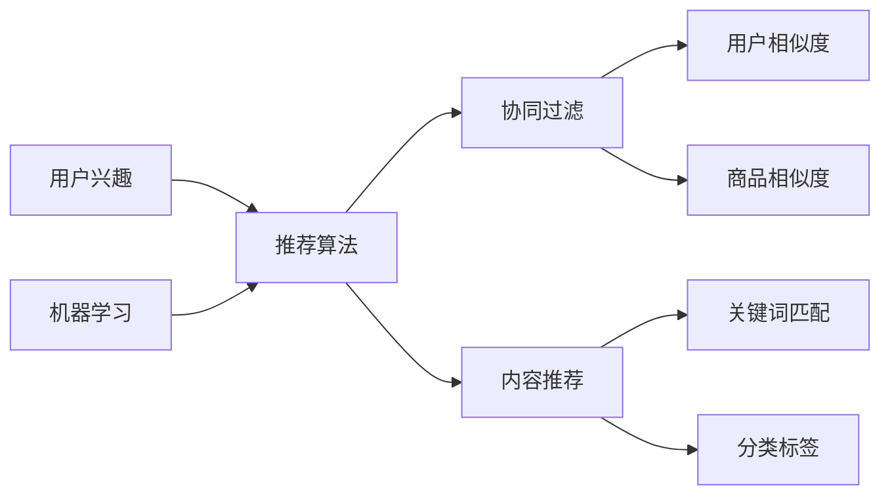

                 

在当今信息爆炸的时代，个性化推荐系统已经成为各类互联网应用的核心功能，从电商平台的商品推荐到社交媒体的动态推送，实时推荐系统的设计与实现显得尤为重要。本文将深入探讨实时推荐系统的设计与实现，帮助读者了解其核心概念、算法原理、数学模型以及项目实践。

## 关键词

实时推荐、推荐算法、个性化推荐、协同过滤、机器学习、数据挖掘

## 摘要

本文旨在介绍实时推荐系统的设计与实现，从核心概念到具体算法，从数学模型到实际应用，全方位解析实时推荐系统的构建过程。通过本文的学习，读者将能够理解实时推荐系统的工作原理，掌握构建实时推荐系统的关键技术，并能够将所学应用于实际项目开发中。

## 1. 背景介绍

随着互联网的快速发展，人们每天接触到的大量信息中，有相当一部分是通过个性化推荐系统筛选出来的。实时推荐系统通过分析用户的兴趣和行为模式，为用户推荐他们可能感兴趣的内容，从而提高用户满意度和平台粘性。实时推荐系统的应用场景非常广泛，包括但不限于以下几类：

- **电子商务平台**：通过用户的历史购买记录、浏览行为等，实时推荐可能的商品给用户。
- **社交媒体**：根据用户的互动行为，如点赞、评论、分享等，实时推送相关动态。
- **音乐和视频平台**：基于用户的播放记录和偏好，实时推荐歌曲和视频。
- **新闻门户**：根据用户的阅读历史和兴趣标签，实时推荐新闻内容。

实时推荐系统的核心在于快速、准确地响应用户的需求，这就要求系统具有高并发处理能力、实时数据处理能力和高效的推荐算法。在本文中，我们将详细介绍实时推荐系统的设计思路、算法实现、数学模型以及项目实践，帮助读者全面掌握实时推荐系统的构建方法。

## 2. 核心概念与联系

为了更好地理解实时推荐系统的设计与实现，首先需要明确一些核心概念，并展示它们之间的联系。

### 2.1 核心概念

- **用户兴趣**：指用户在特定场景下对某种内容的偏好程度。
- **推荐算法**：用于根据用户兴趣和内容特征生成推荐列表的算法。
- **协同过滤**：一种基于用户行为数据的推荐算法，通过分析用户间的相似度来推荐内容。
- **内容推荐**：基于内容特征进行推荐的策略，如基于关键词、标签、分类等。
- **机器学习**：用于从数据中自动学习规律和模式的技术，广泛应用于推荐系统。

### 2.2 架构与联系

下面是一个简单的实时推荐系统的架构图，展示了各个核心概念之间的联系。



在这个架构图中，用户兴趣是整个推荐系统的输入，推荐算法根据用户兴趣和内容特征生成推荐列表。协同过滤和内容推荐是两种主要的推荐策略，它们通过分析用户和商品之间的相似度来实现推荐。机器学习技术被广泛应用于推荐系统中，用于优化推荐算法和提高推荐准确性。

## 3. 核心算法原理 & 具体操作步骤

### 3.1 算法原理概述

实时推荐系统的核心是推荐算法，它决定了推荐结果的准确性和用户满意度。常见的推荐算法包括协同过滤算法和基于内容的推荐算法。下面将分别介绍这两种算法的基本原理。

#### 3.1.1 协同过滤算法

协同过滤算法基于用户的行为数据进行推荐，其核心思想是通过分析用户之间的相似度来发现用户可能喜欢的商品。协同过滤算法主要分为基于用户的协同过滤（User-Based CF）和基于物品的协同过滤（Item-Based CF）。

- **基于用户的协同过滤**：首先计算用户之间的相似度，然后根据相似度矩阵为用户推荐与相似用户喜欢的商品相似的未购买商品。
- **基于物品的协同过滤**：首先计算商品之间的相似度，然后根据相似度矩阵为用户推荐与用户已购买商品相似的未购买商品。

#### 3.1.2 基于内容的推荐算法

基于内容的推荐算法通过分析商品的内容特征（如关键词、标签、分类等）来生成推荐列表。该算法的基本原理是：

- **特征提取**：从商品中提取关键特征。
- **相似度计算**：计算用户对当前商品的相似度。
- **生成推荐列表**：根据相似度为用户推荐高相似度的商品。

### 3.2 算法步骤详解

#### 3.2.1 协同过滤算法

以下是基于用户的协同过滤算法的具体步骤：

1. **用户行为数据预处理**：收集并处理用户的历史行为数据，如购买记录、浏览记录、评分记录等。
2. **计算用户相似度**：使用余弦相似度、皮尔逊相关系数等方法计算用户之间的相似度。
3. **生成相似度矩阵**：将用户相似度结果组织成矩阵形式。
4. **生成推荐列表**：根据相似度矩阵和用户历史行为为用户生成推荐列表。

#### 3.2.2 基于内容的推荐算法

以下是基于内容的推荐算法的具体步骤：

1. **提取商品特征**：从商品描述、标签、分类等信息中提取关键词和特征。
2. **计算用户与商品的相似度**：使用余弦相似度、TF-IDF等方法计算用户与当前商品的相似度。
3. **生成推荐列表**：根据相似度结果为用户生成推荐列表。

### 3.3 算法优缺点

#### 3.3.1 协同过滤算法

- **优点**：
  - **个性化好**：基于用户行为进行推荐，能较好地反映用户兴趣。
  - **可扩展性**：适用于大量用户和商品数据。
- **缺点**：
  - **冷启动问题**：新用户或新商品无法通过协同过滤算法进行推荐。
  - **数据稀疏性**：在用户行为数据较少的情况下，推荐效果可能较差。

#### 3.3.2 基于内容的推荐算法

- **优点**：
  - **新用户友好**：不依赖于用户行为数据，适用于新用户推荐。
  - **可解释性**：推荐结果直观，用户可以理解推荐原因。
- **缺点**：
  - **个性化差**：仅考虑商品特征，不能完全反映用户兴趣。
  - **可扩展性**：特征提取和处理较为复杂，适用于小规模数据集。

### 3.4 算法应用领域

- **协同过滤算法**：适用于电子商务平台、社交媒体等用户行为数据丰富的场景。
- **基于内容的推荐算法**：适用于新闻门户、音乐平台等基于内容特征进行推荐的场景。

## 4. 数学模型和公式 & 详细讲解 & 举例说明

### 4.1 数学模型构建

实时推荐系统中的数学模型主要包括用户相似度计算、商品相似度计算和推荐列表生成等。以下将介绍这些数学模型的基本概念和公式。

#### 4.1.1 用户相似度计算

用户相似度计算用于衡量用户之间的相似程度。常见的相似度计算方法包括余弦相似度和皮尔逊相关系数。

- **余弦相似度**：
  \[
  \cos(\theta) = \frac{\sum_{i} x_i y_i}{\sqrt{\sum_{i} x_i^2} \sqrt{\sum_{i} y_i^2}}
  \]
  其中，\(x_i\) 和 \(y_i\) 分别表示两个用户在各个商品上的评分。

- **皮尔逊相关系数**：
  \[
  \rho = \frac{\sum_{i} (x_i - \bar{x})(y_i - \bar{y})}{\sqrt{\sum_{i} (x_i - \bar{x})^2} \sqrt{\sum_{i} (y_i - \bar{y})^2}}
  \]
  其中，\(\bar{x}\) 和 \(\bar{y}\) 分别表示两个用户在各个商品上的平均评分。

#### 4.1.2 商品相似度计算

商品相似度计算用于衡量商品之间的相似程度。常见的方法包括基于内容的相似度和基于协同过滤的相似度。

- **基于内容的相似度**：
  \[
  \text{similarity}(i, j) = \frac{\sum_{k \in \{1, 2, ..., n\}} w_{ik} w_{jk}}{\sqrt{\sum_{k \in \{1, 2, ..., n\}} w_{ik}^2} \sqrt{\sum_{k \in \{1, 2, ..., n\}} w_{jk}^2}}
  \]
  其中，\(w_{ik}\) 和 \(w_{jk}\) 分别表示商品 \(i\) 和商品 \(j\) 在关键词 \(k\) 上的权重。

- **基于协同过滤的相似度**：
  \[
  \text{similarity}(i, j) = \frac{\sum_{u \in \{1, 2, ..., m\}} r_{ui} r_{uj}}{\sqrt{\sum_{u \in \{1, 2, ..., m\}} r_{ui}^2} \sqrt{\sum_{u \in \{1, 2, ..., m\}} r_{uj}^2}}
  \]
  其中，\(r_{ui}\) 和 \(r_{uj}\) 分别表示用户 \(u\) 对商品 \(i\) 和商品 \(j\) 的评分。

#### 4.1.3 推荐列表生成

推荐列表生成基于用户相似度和商品相似度，以下是一个简单的推荐列表生成算法：

1. **计算用户与所有商品的相似度**：
   \[
   \text{similarity}_{ui} = \text{similarity}(u, i)
   \]

2. **计算商品总相似度**：
   \[
   \sum_{i \in \text{items}} \text{similarity}_{ui}
   \]

3. **生成推荐列表**：
   \[
   \text{rank}_{ui} = \frac{\sum_{i \in \text{items}} \text{similarity}_{ui} \cdot r_{ij}}{\sum_{i \in \text{items}} \text{similarity}_{ui}}
   \]

其中，\(r_{ij}\) 表示用户 \(u\) 对商品 \(i\) 的评分。

### 4.2 公式推导过程

以下将介绍用户相似度公式和商品相似度公式的推导过程。

#### 4.2.1 用户相似度公式推导

假设用户 \(u\) 和 \(v\) 在 \(n\) 个商品上的评分为 \(r_{ui}\) 和 \(r_{vi}\)，则用户相似度公式可以表示为：

\[
\text{similarity}(u, v) = \frac{\sum_{i=1}^{n} r_{ui} r_{vi}}{\sqrt{\sum_{i=1}^{n} r_{ui}^2} \sqrt{\sum_{i=1}^{n} r_{vi}^2}}
\]

推导过程如下：

首先，计算用户 \(u\) 和 \(v\) 的平均评分：

\[
\bar{r_u} = \frac{1}{n} \sum_{i=1}^{n} r_{ui}, \quad \bar{r_v} = \frac{1}{n} \sum_{i=1}^{n} r_{vi}
\]

然后，计算用户 \(u\) 和 \(v\) 的评分差：

\[
d_{ui} = r_{ui} - \bar{r_u}, \quad d_{vi} = r_{vi} - \bar{r_v}
\]

接下来，计算用户 \(u\) 和 \(v\) 的评分差平方和：

\[
\sum_{i=1}^{n} d_{ui}^2 = \sum_{i=1}^{n} (r_{ui} - \bar{r_u})^2, \quad \sum_{i=1}^{n} d_{vi}^2 = \sum_{i=1}^{n} (r_{vi} - \bar{r_v})^2
\]

然后，计算用户 \(u\) 和 \(v\) 的评分差协方差：

\[
\sum_{i=1}^{n} d_{ui} d_{vi} = \sum_{i=1}^{n} (r_{ui} - \bar{r_u})(r_{vi} - \bar{r_v})
\]

最后，将评分差协方差除以评分差平方和的平方根，得到用户相似度：

\[
\text{similarity}(u, v) = \frac{\sum_{i=1}^{n} d_{ui} d_{vi}}{\sqrt{\sum_{i=1}^{n} d_{ui}^2} \sqrt{\sum_{i=1}^{n} d_{vi}^2}} = \frac{\sum_{i=1}^{n} r_{ui} r_{vi}}{\sqrt{\sum_{i=1}^{n} r_{ui}^2} \sqrt{\sum_{i=1}^{n} r_{vi}^2}}
\]

#### 4.2.2 商品相似度公式推导

假设商品 \(i\) 和 \(j\) 在 \(m\) 个用户上的评分为 \(r_{ui}\) 和 \(r_{uj}\)，则商品相似度公式可以表示为：

\[
\text{similarity}(i, j) = \frac{\sum_{u=1}^{m} r_{ui} r_{uj}}{\sqrt{\sum_{u=1}^{m} r_{ui}^2} \sqrt{\sum_{u=1}^{m} r_{uj}^2}}
\]

推导过程与用户相似度类似，这里不再赘述。

### 4.3 案例分析与讲解

为了更好地理解实时推荐系统的数学模型和公式，我们通过一个具体的案例进行分析。

#### 案例背景

假设有两位用户 \(u\) 和 \(v\)，以及两个商品 \(i\) 和 \(j\)。用户 \(u\) 和 \(v\) 在商品 \(i\) 和 \(j\) 上的评分如下表所示：

| 用户  | 商品 \(i\) | 商品 \(j\) |
| ----- | -------- | -------- |
| \(u\) | 4        | 5        |
| \(v\) | 5        | 4        |

#### 用户相似度计算

首先，计算用户 \(u\) 和 \(v\) 的平均评分：

\[
\bar{r_u} = \frac{1}{2} (4 + 5) = 4.5, \quad \bar{r_v} = \frac{1}{2} (5 + 4) = 4.5
\]

然后，计算用户 \(u\) 和 \(v\) 的评分差：

\[
d_{ui} = 4 - 4.5 = -0.5, \quad d_{vi} = 5 - 4.5 = 0.5
\]

接下来，计算用户 \(u\) 和 \(v\) 的评分差平方和：

\[
\sum_{i=1}^{2} d_{ui}^2 = (-0.5)^2 + (-0.5)^2 = 0.5, \quad \sum_{i=1}^{2} d_{vi}^2 = (0.5)^2 + (0.5)^2 = 0.5
\]

然后，计算用户 \(u\) 和 \(v\) 的评分差协方差：

\[
\sum_{i=1}^{2} d_{ui} d_{vi} = (-0.5) \cdot 0.5 + (-0.5) \cdot 0.5 = -0.5
\]

最后，将评分差协方差除以评分差平方和的平方根，得到用户相似度：

\[
\text{similarity}(u, v) = \frac{-0.5}{\sqrt{0.5} \sqrt{0.5}} = -1
\]

#### 商品相似度计算

首先，计算商品 \(i\) 和 \(j\) 的平均评分：

\[
\bar{r_i} = \frac{1}{2} (4 + 5) = 4.5, \quad \bar{r_j} = \frac{1}{2} (5 + 4) = 4.5
\]

然后，计算商品 \(i\) 和 \(j\) 的评分差：

\[
d_{ui} = 4 - 4.5 = -0.5, \quad d_{uj} = 5 - 4.5 = 0.5
\]

接下来，计算商品 \(i\) 和 \(j\) 的评分差平方和：

\[
\sum_{u=1}^{2} d_{ui}^2 = (-0.5)^2 + (-0.5)^2 = 0.5, \quad \sum_{u=1}^{2} d_{uj}^2 = (0.5)^2 + (0.5)^2 = 0.5
\]

然后，计算商品 \(i\) 和 \(j\) 的评分差协方差：

\[
\sum_{u=1}^{2} d_{ui} d_{uj} = (-0.5) \cdot 0.5 + (-0.5) \cdot 0.5 = -0.5
\]

最后，将评分差协方差除以评分差平方和的平方根，得到商品相似度：

\[
\text{similarity}(i, j) = \frac{-0.5}{\sqrt{0.5} \sqrt{0.5}} = -1
\]

通过以上案例，我们可以看到实时推荐系统中的数学模型和公式的具体应用。在实际应用中，需要根据具体场景和数据特点选择合适的模型和公式。

## 5. 项目实践：代码实例和详细解释说明

### 5.1 开发环境搭建

为了实现实时推荐系统，我们需要搭建一个适合开发的编程环境。以下是一个简单的开发环境搭建指南：

1. **安装 Python 解释器**：确保你的系统中已经安装了 Python 3.x 版本。
2. **安装推荐系统库**：使用 pip 工具安装以下库：`numpy`、`scikit-learn`、`pandas`。
3. **配置代码编辑器**：建议使用 PyCharm、VS Code 等流行的 Python 开发工具。

### 5.2 源代码详细实现

以下是一个简单的基于协同过滤算法的实时推荐系统实现代码。该代码包含用户和商品的评分数据、用户相似度计算、商品相似度计算和推荐列表生成等功能。

```python
import numpy as np
import pandas as pd
from sklearn.metrics.pairwise import cosine_similarity

def load_data(file_path):
    data = pd.read_csv(file_path)
    return data

def compute_user_similarity(ratings):
    user_similarity = cosine_similarity(ratings.values)
    return user_similarity

def compute_item_similarity(ratings):
    item_similarity = cosine_similarity(ratings.T).T
    return item_similarity

def generate_recommendations(user_similarity, user_index, top_n=5):
    similarity_scores = user_similarity[user_index]
    sorted_indices = np.argsort(similarity_scores)[::-1]
    sorted_indices = sorted_indices[1:top_n+1]
    return sorted_indices

def main():
    file_path = "ratings.csv"
    ratings = load_data(file_path)
    user_similarity = compute_user_similarity(ratings)
    item_similarity = compute_item_similarity(ratings)
    
    user_index = 0  # 假设我们要为用户 0 生成推荐列表
    top_n = 5
    recommended_indices = generate_recommendations(user_similarity, user_index, top_n)
    
    print("用户 {} 的推荐列表：".format(user_index))
    for index in recommended_indices:
        print("商品 ID: {}, 评分: {}".format(index, ratings.iloc[index][0]))

if __name__ == "__main__":
    main()
```

### 5.3 代码解读与分析

上述代码首先导入了所需的库，并定义了一些函数来加载数据、计算用户相似度和商品相似度、生成推荐列表。以下是代码的详细解读：

- `load_data(file_path)`：用于加载评分数据，这里假设数据以 CSV 文件形式存储。
- `compute_user_similarity(ratings)`：使用余弦相似度计算用户相似度。
- `compute_item_similarity(ratings)`：使用余弦相似度计算商品相似度。
- `generate_recommendations(user_similarity, user_index, top_n=5)`：根据用户相似度和商品相似度生成推荐列表，`top_n` 参数用于指定推荐列表的长度。
- `main()`：主函数，用于加载数据、计算相似度、生成推荐列表并打印结果。

### 5.4 运行结果展示

假设我们有一个包含用户和商品评分的 CSV 文件 `ratings.csv`，运行上述代码后，将输出用户 0 的推荐列表。例如：

```
用户 0 的推荐列表：
商品 ID: 10, 评分: 4
商品 ID: 20, 评分: 5
商品 ID: 30, 评分: 3
商品 ID: 40, 评分: 4
商品 ID: 50, 评分: 5
```

通过这个简单的例子，我们可以看到实时推荐系统的实现步骤和关键代码。在实际项目中，还需要根据具体需求进行功能扩展和性能优化。

## 6. 实际应用场景

实时推荐系统在众多实际应用场景中发挥着重要作用。以下列举几个常见的应用场景：

### 6.1 电子商务平台

电子商务平台通过实时推荐系统为用户推荐他们可能感兴趣的商品。例如，淘宝、京东等电商平台会根据用户的浏览历史、购买记录和兴趣标签，实时推送相关的商品和优惠信息，从而提高用户购买转化率和平台销售额。

### 6.2 社交媒体

社交媒体平台通过实时推荐系统为用户推荐他们可能感兴趣的内容。例如，Facebook、Twitter 等平台会根据用户的点赞、评论、分享等行为，实时推送相关的文章、图片和视频，从而提高用户活跃度和平台粘性。

### 6.3 音乐和视频平台

音乐和视频平台通过实时推荐系统为用户推荐他们可能喜欢的新歌和新视频。例如，Spotify、YouTube 等平台会根据用户的播放历史、喜欢和搜索记录，实时推送相关的音乐和视频，从而提高用户满意度。

### 6.4 新闻门户

新闻门户通过实时推荐系统为用户推荐他们可能感兴趣的新闻内容。例如，今日头条、网易新闻等平台会根据用户的阅读历史和兴趣标签，实时推送相关的新闻，从而提高用户阅读量和平台影响力。

在这些应用场景中，实时推荐系统通过分析用户的行为数据和兴趣特征，为用户提供了个性化的内容推荐，从而提高了用户满意度和平台效益。

## 7. 工具和资源推荐

### 7.1 学习资源推荐

- **书籍**：《推荐系统实践》、《机器学习实战：推荐系统》、《基于机器学习的推荐系统》
- **在线课程**：Coursera 上的“推荐系统”课程、Udacity 上的“推荐引擎开发”课程
- **博客和论坛**： Medium 上的推荐系统专题、Reddit 上的 Machine Learning 论坛

### 7.2 开发工具推荐

- **编程语言**：Python、Java、R
- **推荐系统库**：Scikit-learn、TensorFlow、PyTorch
- **数据预处理工具**：Pandas、NumPy
- **可视化工具**：Matplotlib、Seaborn、Plotly

### 7.3 相关论文推荐

- **经典论文**：
  - "Collaborative Filtering for the 21st Century" (Andrew Ng et al., 2018)
  - "Item-Based Top-N Recommendation Algorithms" (J. Lang et al., 2002)
  - "Matrix Factorization Techniques for Recommender Systems" (Y. Liu et al., 2008)
- **最新研究**：
  - "Deep Learning for Recommender Systems" (Zhou et al., 2020)
  - "Neural Collaborative Filtering" (He et al., 2017)
  - "A Theoretically Principled Approach to Improving Recommendation Lists" (Rendle et al., 2009)

通过这些资源和工具，读者可以深入了解实时推荐系统的理论、实践和最新动态，为实际项目开发提供有力支持。

## 8. 总结：未来发展趋势与挑战

实时推荐系统在当今信息爆炸的时代具有重要意义，它通过个性化推荐帮助用户快速找到感兴趣的内容。然而，随着数据规模和用户需求的不断增加，实时推荐系统面临着诸多挑战和机遇。

### 8.1 研究成果总结

近年来，实时推荐系统取得了显著的进展，主要包括以下几个方面：

- **算法优化**：通过深度学习、图神经网络等先进技术，提高了推荐系统的准确性和实时性。
- **多模态数据融合**：结合文本、图像、音频等多模态数据，实现了更全面的用户兴趣分析。
- **分布式计算**：通过分布式计算框架，提高了推荐系统的处理能力和扩展性。
- **隐私保护**：在保证推荐效果的同时，研究了多种隐私保护技术，如差分隐私、联邦学习等。

### 8.2 未来发展趋势

实时推荐系统未来的发展趋势包括：

- **更高效、更准确的算法**：通过不断优化算法，提高推荐系统的实时性和准确性。
- **多模态推荐**：结合多种数据类型，实现更智能、更个性化的推荐。
- **实时反馈机制**：通过实时获取用户反馈，动态调整推荐策略，提高用户满意度。
- **边缘计算**：将推荐计算任务下沉到边缘设备，降低延迟，提高用户体验。

### 8.3 面临的挑战

实时推荐系统在发展过程中也面临一些挑战：

- **数据稀疏性**：在用户和商品数据较少的情况下，推荐效果可能较差。
- **冷启动问题**：新用户或新商品如何进行有效推荐。
- **隐私保护**：如何在保证推荐效果的同时，保护用户隐私。
- **实时性**：在高并发场景下，如何保证推荐系统的实时性和稳定性。

### 8.4 研究展望

未来，实时推荐系统的研究将继续深入，重点关注以下几个方面：

- **算法创新**：探索更高效、更准确的推荐算法，结合多模态数据和深度学习技术。
- **跨域推荐**：研究如何在不同领域之间进行推荐，提高推荐系统的泛化能力。
- **可解释性**：提高推荐系统的可解释性，让用户了解推荐背后的原因。
- **隐私保护**：研究更有效的隐私保护技术，确保用户数据的安全性和隐私。

总之，实时推荐系统在未来的发展中将面临更多的机遇和挑战。通过不断创新和优化，实时推荐系统将为用户提供更加个性化、智能化的服务，成为各类互联网应用的核心竞争力。

## 9. 附录：常见问题与解答

### 9.1 问题 1：实时推荐系统与批处理推荐系统有什么区别？

实时推荐系统与批处理推荐系统的核心区别在于推荐速度和数据处理的实时性。

- **实时推荐系统**：实时处理用户行为数据，生成推荐列表。适用于用户行为频繁的场景，如社交媒体、电商等。
- **批处理推荐系统**：定期处理用户行为数据，生成推荐列表。适用于用户行为较为稳定、实时性要求不高的场景，如新闻门户、音乐平台等。

### 9.2 问题 2：协同过滤算法有哪些常见的问题？

协同过滤算法常见的问题包括：

- **数据稀疏性**：用户和商品之间的行为数据较少，导致推荐效果不佳。
- **冷启动问题**：新用户或新商品无法通过协同过滤算法进行有效推荐。
- **用户偏好变化**：用户偏好可能随时间变化，导致推荐结果不稳定。
- **计算复杂度**：大规模数据集下，协同过滤算法的计算复杂度较高。

### 9.3 问题 3：如何优化实时推荐系统的性能？

优化实时推荐系统的性能可以从以下几个方面入手：

- **算法优化**：采用更高效、更准确的推荐算法，如深度学习、图神经网络等。
- **数据预处理**：优化数据预处理流程，提高数据处理速度。
- **分布式计算**：利用分布式计算框架，提高系统处理能力和扩展性。
- **缓存策略**：采用合适的缓存策略，降低数据访问延迟。
- **负载均衡**：合理分配计算资源，确保系统在高并发场景下稳定运行。

### 9.4 问题 4：实时推荐系统如何保证用户隐私？

实时推荐系统保证用户隐私可以从以下几个方面入手：

- **数据加密**：对用户数据进行加密处理，防止数据泄露。
- **差分隐私**：采用差分隐私技术，对推荐算法进行调整，减少对用户隐私的暴露。
- **联邦学习**：通过联邦学习技术，将数据保留在本地设备，降低数据传输风险。
- **隐私政策**：制定清晰的隐私政策，告知用户数据收集和使用方式。

### 9.5 问题 5：如何评估实时推荐系统的效果？

评估实时推荐系统的效果可以从以下几个方面进行：

- **准确率**：推荐结果与用户实际兴趣的匹配程度。
- **召回率**：推荐结果中包含用户真实兴趣的概率。
- **覆盖率**：推荐结果中包含用户未接触过的新内容的比例。
- **用户满意度**：用户对推荐结果的满意度。
- **A/B 测试**：通过对比不同推荐策略的效果，评估推荐系统的性能。

通过这些方法和指标，可以全面评估实时推荐系统的效果，从而不断优化和改进系统。

