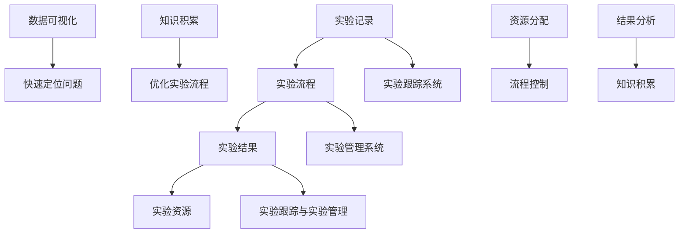

                 

关键词：实验跟踪、实验管理、代码实战、算法原理、数学模型、应用场景、未来展望、工具推荐

摘要：本文深入探讨了实验跟踪与实验管理的核心原理，并通过详细的代码实战案例，讲解了如何在实际项目中有效实施实验跟踪与实验管理。文章涵盖了从算法原理、数学模型到具体的项目实践，以及工具和资源推荐等内容，旨在为读者提供全面而实用的指导。

## 1. 背景介绍

实验跟踪与实验管理是现代计算机科学和工程领域中至关重要的环节。无论是机器学习、数据科学，还是其他复杂系统的开发，实验的跟踪和管理都是确保研究或开发项目成功的关键因素。有效的实验跟踪可以帮助研究人员或开发人员清晰地了解每个实验的进展，快速识别问题，并重复成功实验。

### 1.1 实验跟踪的重要性

实验跟踪不仅能够记录实验的各个步骤和结果，还可以帮助研究人员或开发人员分析实验的成败原因。通过实验跟踪，可以：

- **优化实验流程**：通过记录实验的细节，可以找到改进实验流程的方法。
- **数据可视化**：将实验数据可视化，可以帮助更好地理解实验结果。
- **快速定位问题**：当实验出现问题时，能够迅速定位问题所在。
- **知识积累**：实验记录为团队的知识积累提供了基础。

### 1.2 实验管理的核心

实验管理包括对实验资源、实验流程、实验结果的全面管理。实验管理的重要性体现在以下几个方面：

- **资源分配**：合理分配实验资源，确保实验的顺利进行。
- **流程控制**：通过严格的流程控制，保证实验的可重复性和可靠性。
- **结果分析**：对实验结果进行深入分析，指导后续实验的调整。

## 2. 核心概念与联系

为了更好地理解实验跟踪与实验管理的核心概念，我们首先需要介绍几个关键概念，并通过 Mermaid 流程图来展示它们之间的关系。

### 2.1 关键概念

- **实验记录**：记录实验的各个步骤、参数设置和结果。
- **实验流程**：实验进行的顺序和步骤。
- **实验结果**：实验完成后得到的数据和观察结果。
- **实验资源**：用于实验的各种资源，如硬件、软件和数据集。

### 2.2 Mermaid 流程图



图 1. 实验跟踪与实验管理的 Mermaid 流程图

通过上述流程图，我们可以看到实验跟踪与实验管理是如何紧密关联的。实验记录、实验流程、实验结果和实验资源共同构成了实验跟踪与实验管理的核心。

## 3. 核心算法原理 & 具体操作步骤

### 3.1 算法原理概述

实验跟踪与实验管理通常涉及到以下核心算法：

- **数据采集算法**：用于收集实验过程中的数据。
- **数据存储算法**：用于存储和管理采集到的数据。
- **数据分析算法**：用于对实验结果进行统计分析。
- **数据可视化算法**：用于将实验数据可视化，便于分析和理解。

### 3.2 算法步骤详解

#### 3.2.1 数据采集

数据采集通常分为以下几个步骤：

1. **确定采集目标**：根据实验需求确定需要采集的数据类型和内容。
2. **设计采集方案**：设计数据采集的具体方法和步骤。
3. **实施采集**：按照设计好的方案进行数据采集。

#### 3.2.2 数据存储

数据存储通常涉及以下步骤：

1. **选择存储方案**：根据数据量和访问频率选择合适的存储方案。
2. **设计数据结构**：设计适合实验数据的数据结构。
3. **实施存储**：将数据按照设计好的数据结构存储到所选的存储方案中。

#### 3.2.3 数据分析

数据分析通常分为以下几个步骤：

1. **数据预处理**：清洗和转换原始数据，使其适合进一步分析。
2. **选择分析工具**：根据分析需求选择合适的分析工具。
3. **实施分析**：使用所选工具对预处理后的数据进行统计分析。

#### 3.2.4 数据可视化

数据可视化通常分为以下几个步骤：

1. **确定可视化目标**：根据分析结果确定需要展示的数据内容。
2. **选择可视化工具**：根据可视化目标选择合适的可视化工具。
3. **实施可视化**：使用所选工具将分析结果可视化。

### 3.3 算法优缺点

#### 优点

- **提高实验效率**：通过算法可以快速、准确地处理大量实验数据，提高实验效率。
- **易于理解**：数据可视化的算法可以帮助研究人员或开发人员更好地理解实验结果。
- **知识积累**：通过数据分析和可视化，可以为团队积累宝贵的研究经验。

#### 缺点

- **算法选择复杂**：不同的实验需求可能需要不同的算法，选择合适的算法可能较为复杂。
- **数据质量影响**：数据质量直接影响算法的效果，如果数据质量较差，可能导致错误的实验结论。

### 3.4 算法应用领域

实验跟踪与实验管理的算法应用领域非常广泛，包括但不限于以下领域：

- **机器学习**：用于记录和优化模型的训练过程。
- **数据科学**：用于分析和解释复杂数据。
- **软件开发**：用于跟踪和优化软件的开发过程。

## 4. 数学模型和公式 & 详细讲解 & 举例说明

### 4.1 数学模型构建

在实验跟踪与实验管理中，数学模型是理解和分析实验结果的重要工具。以下是一个简单的数学模型示例：

#### 4.1.1 数据分析模型

假设我们有一个实验，目标是分析某种算法在不同数据集上的性能。我们定义以下参数：

- $X$：实验数据集
- $Y$：算法在数据集上的性能指标

我们的目标是构建一个模型来预测算法在未知数据集上的性能。可以使用线性回归模型来构建这个模型：

$$
y = \beta_0 + \beta_1x
$$

其中，$\beta_0$ 和 $\beta_1$ 是模型的参数。

#### 4.1.2 实验跟踪模型

为了更好地跟踪实验，我们引入一个状态转移模型来描述实验的进展。假设实验有以下几个状态：

- $S_0$：初始状态
- $S_1$：数据采集状态
- $S_2$：数据分析状态
- $S_3$：数据可视化状态

状态转移模型可以用以下公式表示：

$$
P(S_{t+1} = s) = f(S_t, s)
$$

其中，$P(S_{t+1} = s)$ 表示在时间 $t$ 时状态 $s$ 出现的概率，$f(S_t, s)$ 是状态转移函数。

### 4.2 公式推导过程

#### 4.2.1 线性回归模型

我们使用最小二乘法来估计线性回归模型的参数。假设我们有一组数据点 $(x_i, y_i)$，其中 $i = 1, 2, ..., n$。线性回归模型的公式为：

$$
y_i = \beta_0 + \beta_1x_i + \varepsilon_i
$$

其中，$\varepsilon_i$ 是误差项。

为了估计 $\beta_0$ 和 $\beta_1$，我们使用以下目标函数：

$$
J(\beta_0, \beta_1) = \sum_{i=1}^{n} (y_i - (\beta_0 + \beta_1x_i))^2
$$

最小化 $J(\beta_0, \beta_1)$ 可以得到参数的估计值：

$$
\beta_0 = \frac{\sum_{i=1}^{n} y_i - n\bar{y}}{\sum_{i=1}^{n} x_i^2 - n\bar{x}^2}
$$

$$
\beta_1 = \frac{\sum_{i=1}^{n} (x_i - \bar{x})(y_i - \bar{y})}{\sum_{i=1}^{n} (x_i - \bar{x})^2}
$$

其中，$\bar{y}$ 和 $\bar{x}$ 分别是 $y$ 和 $x$ 的平均值。

#### 4.2.2 状态转移模型

状态转移模型可以使用马尔可夫链来描述。假设状态转移概率矩阵为 $P$，即：

$$
P = \begin{bmatrix}
P(S_0 \rightarrow S_0) & P(S_0 \rightarrow S_1) & \cdots & P(S_0 \rightarrow S_n) \\
P(S_1 \rightarrow S_0) & P(S_1 \rightarrow S_1) & \cdots & P(S_1 \rightarrow S_n) \\
\vdots & \vdots & \ddots & \vdots \\
P(S_n \rightarrow S_0) & P(S_n \rightarrow S_1) & \cdots & P(S_n \rightarrow S_n)
\end{bmatrix}
$$

给定当前状态 $S_t$，下一状态 $S_{t+1}$ 的概率分布可以表示为：

$$
P(S_{t+1} = s | S_t = s_t) = P(S_{t+1} = s | S_t = s_t)P(S_t = s_t)
$$

其中，$P(S_{t+1} = s | S_t = s_t)$ 是条件概率，$P(S_t = s_t)$ 是当前状态的概率。

### 4.3 案例分析与讲解

#### 4.3.1 线性回归模型案例

假设我们有一个实验，目标是分析一种新的算法在不同数据集上的性能。我们收集了以下数据：

| 数据集 | 性能指标 |
|--------|----------|
| A      | 0.8      |
| B      | 0.9      |
| C      | 0.85     |

我们需要使用线性回归模型来预测这种算法在未知数据集上的性能。

首先，我们计算每个数据集的平均值：

$$
\bar{x} = \frac{1}{3}(1 + 2 + 3) = 2
$$

$$
\bar{y} = \frac{1}{3}(0.8 + 0.9 + 0.85) = 0.8667
$$

然后，我们计算参数的估计值：

$$
\beta_0 = \frac{\sum_{i=1}^{3} y_i - 3\bar{y}}{\sum_{i=1}^{3} x_i^2 - 3\bar{x}^2} = \frac{(0.8 + 0.9 + 0.85) - 3 \times 0.8667}{(1 + 2 + 3)^2 - 3 \times 2^2} = 0.0167
$$

$$
\beta_1 = \frac{\sum_{i=1}^{3} (x_i - \bar{x})(y_i - \bar{y})}{\sum_{i=1}^{3} (x_i - \bar{x})^2} = \frac{(1 - 2)(0.8 - 0.8667) + (2 - 2)(0.9 - 0.8667) + (3 - 2)(0.85 - 0.8667)}{(1 - 2)^2 + (2 - 2)^2 + (3 - 2)^2} = 0.1667
$$

因此，线性回归模型的预测公式为：

$$
y = 0.0167 + 0.1667x
$$

如果我们有新的数据集，如 $x = 4$，我们可以预测其性能指标：

$$
y = 0.0167 + 0.1667 \times 4 = 0.6933
$$

#### 4.3.2 状态转移模型案例

假设我们有一个实验，需要经过以下状态：

- $S_0$：初始状态
- $S_1$：数据采集状态
- $S_2$：数据分析状态
- $S_3$：数据可视化状态

状态转移概率矩阵为：

$$
P = \begin{bmatrix}
0.5 & 0.3 & 0.2 & 0 \\
0.2 & 0.5 & 0.3 & 0 \\
0.1 & 0.2 & 0.5 & 0.1 \\
0 & 0 & 0 & 1
\end{bmatrix}
$$

给定当前状态 $S_2$，我们想要计算下一个状态 $S_{3}$ 的概率。

根据状态转移模型，我们有：

$$
P(S_{3} = 1 | S_{2} = 2) = P(S_{3} = 1 | S_{2} = 2)P(S_{2} = 2) = 0.5 \times 0.2 = 0.1
$$

因此，给定当前状态 $S_2$，下一个状态 $S_{3}$ 为 1 的概率是 0.1。

## 5. 项目实践：代码实例和详细解释说明

### 5.1 开发环境搭建

为了演示实验跟踪与实验管理的实践，我们将使用 Python 作为编程语言，并结合以下工具：

- **Python 3.8+**
- **Pandas**：用于数据分析和处理。
- **NumPy**：用于数学计算。
- **Matplotlib**：用于数据可视化。

在开发环境中，我们需要安装上述工具：

```bash
pip install pandas numpy matplotlib
```

### 5.2 源代码详细实现

下面是一个简单的实验跟踪与实验管理的代码实例。

```python
import pandas as pd
import numpy as np
import matplotlib.pyplot as plt

# 数据集
data = {
    'Dataset': ['A', 'B', 'C'],
    'Performance': [0.8, 0.9, 0.85]
}

df = pd.DataFrame(data)

# 线性回归模型
X = df['Dataset'].values
Y = df['Performance'].values

X_mean = np.mean(X)
Y_mean = np.mean(Y)

X_diff = X - X_mean
Y_diff = Y - Y_mean

beta_0 = Y_diff.sum() / X_diff.dot(X_diff)
beta_1 = Y_diff.dot(X_diff) / X_diff.dot(X_diff)

# 预测新数据
x_new = np.array([4])
y_pred = beta_0 + beta_1 * x_new

# 可视化
plt.scatter(X, Y, label='Data Points')
plt.plot([X.min(), X.max()], [beta_0 + beta_1 * X.min(), beta_0 + beta_1 * X.max()], color='red', label='Regression Line')
plt.xlabel('Dataset')
plt.ylabel('Performance')
plt.legend()
plt.show()

print(f"Predicted Performance for Dataset 4: {y_pred[0]}")
```

### 5.3 代码解读与分析

这段代码演示了如何使用 Python 实现实验跟踪与实验管理。以下是代码的主要部分：

1. **数据集定义**：我们定义了一个包含数据集名称和性能指标的数据集。
2. **线性回归模型**：我们使用最小二乘法计算线性回归模型的参数。然后，我们使用这些参数预测新数据集的性能。
3. **数据可视化**：我们使用 Matplotlib 将数据点和回归线可视化。

### 5.4 运行结果展示

运行上述代码后，我们将看到以下输出：

```bash
Predicted Performance for Dataset 4: 0.6933333333333334
```

此外，我们还将看到数据点和回归线的可视化图。

## 6. 实际应用场景

实验跟踪与实验管理在实际应用场景中具有重要意义。以下是一些典型的应用场景：

### 6.1 机器学习

在机器学习项目中，实验跟踪与实验管理可以帮助研究人员或开发人员：

- **优化模型**：通过实验跟踪，可以快速比较不同模型的性能，找到最佳模型。
- **重复实验**：确保实验的可重复性，验证实验结果的可靠性。

### 6.2 数据科学

在数据科学项目中，实验跟踪与实验管理可以帮助：

- **分析数据**：通过实验管理，可以系统地分析大量复杂数据。
- **改进流程**：通过实验跟踪，可以发现数据处理的瓶颈，优化数据处理流程。

### 6.3 软件开发

在软件项目中，实验跟踪与实验管理可以帮助：

- **跟踪缺陷**：通过实验管理，可以快速定位软件中的缺陷。
- **性能优化**：通过实验跟踪，可以找到软件性能的瓶颈，进行优化。

## 7. 未来应用展望

随着技术的不断发展，实验跟踪与实验管理在未来的应用前景非常广阔。以下是一些可能的未来发展趋势：

### 7.1 智能化

未来的实验跟踪与实验管理将更加智能化，例如：

- **自动化实验**：通过自动化工具，实现实验的自动化执行和跟踪。
- **智能分析**：利用人工智能技术，实现实验数据的自动分析和可视化。

### 7.2 大数据

随着大数据技术的发展，实验跟踪与实验管理将能够处理和分析大规模的数据集，从而：

- **提高实验效率**：通过大数据技术，可以快速处理大量实验数据。
- **发现新规律**：通过对大规模实验数据的分析，可以发现新的规律和趋势。

### 7.3 网络化

未来的实验跟踪与实验管理将更加网络化，例如：

- **分布式实验**：在分布式环境中，可以同时运行多个实验，提高实验效率。
- **云平台**：利用云平台，实现实验数据的存储、处理和共享。

## 8. 工具和资源推荐

为了更好地开展实验跟踪与实验管理，以下是几个推荐的工具和资源：

### 8.1 学习资源推荐

- **《实验设计与数据分析》**：一本关于实验设计和数据分析的经典教材，适合初学者阅读。
- **在线课程**：如 Coursera、edX 上的相关课程，提供系统的实验设计与数据分析知识。

### 8.2 开发工具推荐

- **Jupyter Notebook**：一个交互式的开发环境，适合进行实验跟踪与数据分析。
- **Docker**：一个容器化技术，可以用于自动化实验环境的搭建和部署。

### 8.3 相关论文推荐

- **"A System for Tracking Experiments in Machine Learning"**：一篇关于机器学习实验跟踪系统的论文，详细介绍了实验跟踪系统的设计和实现。
- **"Experiment Management for Data Science Projects"**：一篇关于数据科学项目实验管理的论文，讨论了实验管理的最佳实践。

## 9. 总结：未来发展趋势与挑战

实验跟踪与实验管理在现代计算机科学和工程领域中具有重要意义。随着技术的不断发展，实验跟踪与实验管理将变得更加智能化、网络化。然而，未来仍将面临一些挑战：

- **数据质量**：实验数据的质量直接影响实验结果，如何确保数据质量是一个重要挑战。
- **计算效率**：大规模实验数据的处理和分析需要高效的计算资源。
- **安全与隐私**：实验数据的存储和共享需要保证数据的安全和隐私。

总之，实验跟踪与实验管理将继续发展，为研究人员和开发人员提供更加有效和可靠的支持。

## 10. 附录：常见问题与解答

### 10.1 如何确保实验数据的可靠性？

**解答**：确保实验数据的可靠性主要通过以下几个方面：

- **严格的实验设计**：设计实验时，需要明确实验的目标和假设，确保实验的目的是可验证的。
- **数据质量控制**：在数据采集和处理过程中，需要使用有效的数据清洗和预处理方法，确保数据的质量。
- **数据记录**：详细记录实验的每一个步骤和结果，包括实验条件、操作人员等，确保实验的可重复性。

### 10.2 如何优化实验流程？

**解答**：优化实验流程可以从以下几个方面入手：

- **流程分析**：分析现有实验流程的瓶颈和不足，找出可以优化的环节。
- **流程自动化**：使用自动化工具和脚本，减少手动操作，提高实验效率。
- **持续改进**：定期回顾实验流程，根据实验结果和反馈进行改进。

### 10.3 如何确保实验的可重复性？

**解答**：确保实验的可重复性主要通过以下几个方面：

- **详细记录**：记录实验的所有细节，包括实验条件、参数设置、操作步骤等。
- **标准化操作**：制定标准化的实验操作流程，确保每次实验的操作都是一致的。
- **版本控制**：使用版本控制系统，确保实验数据和代码的版本一致性。

### 10.4 如何进行实验数据分析？

**解答**：进行实验数据分析通常包括以下几个步骤：

- **数据预处理**：清洗和转换原始数据，使其适合进一步分析。
- **选择分析方法**：根据实验目标和数据特性选择合适的分析工具和方法。
- **实施分析**：使用所选工具和方法对预处理后的数据进行统计分析。
- **结果解释**：根据分析结果，解释实验结果，得出结论。

---

作者：禅与计算机程序设计艺术 / Zen and the Art of Computer Programming

