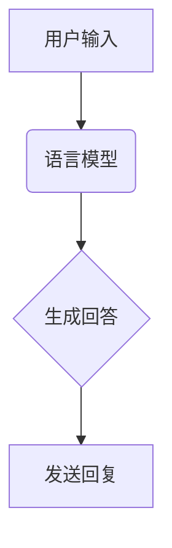

                 

关键词：客户服务，语言模型，人工智能，自然语言处理，人工智能助理，自动化，聊天机器人

> 摘要：本文深入探讨了基于大型语言模型（LLM）的人工智能助理在客户服务领域的应用。通过分析LLM的核心原理及其在自然语言处理中的优势，本文详细介绍了LLM驱动的人工智能助理的工作机制、算法实现、数学模型以及实际应用案例。本文旨在为从事客户服务的专业人士提供有益的技术指导和实践参考。

## 1. 背景介绍

### 1.1 客户服务的重要性

客户服务是任何企业成功的关键因素之一。它不仅影响客户满意度，还直接影响企业的品牌形象和市场份额。随着互联网和移动设备的普及，客户期望的服务质量也在不断提高。传统的人工客户服务面临着人力成本高、响应速度慢、服务质量不稳定的挑战。

### 1.2 人工智能在客户服务中的应用

人工智能（AI）技术，特别是自然语言处理（NLP）技术，为改善客户服务提供了新的解决方案。其中，基于大型语言模型（LLM）的人工智能助理在客户服务中表现出色，能够实现高效、精准、个性化的服务。

### 1.3 LLM的优势

LLM是一种强大的人工智能模型，具有以下几个显著优势：

1. **强大的语言理解能力**：LLM能够理解复杂、多变的自然语言输入，实现与用户的自然对话。
2. **高效的文本生成能力**：LLM能够生成高质量、连贯的文本，适用于自动化回复、生成式内容等场景。
3. **大规模预训练**：LLM通过在大规模文本数据上进行预训练，积累了丰富的语言知识和模式，提高了模型的性能和泛化能力。

## 2. 核心概念与联系

### 2.1 语言模型概述

语言模型（Language Model，LM）是一种概率模型，用于预测下一个单词或字符的条件概率。在自然语言处理领域，语言模型是实现自动化文本生成、语言翻译、情感分析等功能的基础。

### 2.2 LLM的架构

LLM通常采用深度神经网络（DNN）或Transformer架构，具有以下几个关键组件：

1. **输入层**：接收自然语言输入，如文本或语音。
2. **编码器**：对输入进行编码，提取特征。
3. **解码器**：根据编码特征生成输出。
4. **注意力机制**：提高模型对输入序列中重要信息的关注。

### 2.3 LLM在客户服务中的应用

LLM在客户服务中的应用场景包括：

1. **自动回复**：根据用户输入的问题，生成相应的回答。
2. **智能客服**：与用户进行对话，提供实时、个性化的服务。
3. **知识库管理**：自动构建和维护企业知识库，提高信息检索效率。

### 2.4 Mermaid流程图



## 3. 核心算法原理 & 具体操作步骤

### 3.1 算法原理概述

LLM驱动的人工智能助理基于以下核心算法原理：

1. **文本预处理**：对用户输入进行清洗、分词、去噪等操作，提取有效信息。
2. **特征提取**：使用神经网络或Transformer等模型，对预处理后的文本进行特征提取。
3. **生成式文本生成**：根据提取的特征，生成符合语法和语义的文本回复。

### 3.2 算法步骤详解

1. **文本预处理**：
    - 清洗：去除无效字符、标点符号、停用词等。
    - 分词：将文本分割成单词或子词。
    - 去噪：过滤噪声数据，提高模型训练质量。

2. **特征提取**：
    - 神经网络：使用多层感知机（MLP）或循环神经网络（RNN）提取文本特征。
    - Transformer：使用自注意力机制提取文本特征。

3. **生成式文本生成**：
    - 根据提取的特征，生成符合语法和语义的文本回复。
    - 使用顶点生成模型（如GPT）或序列到序列模型（如BERT）进行文本生成。

### 3.3 算法优缺点

#### 优点：

1. **强大的语言理解能力**：能够理解复杂、多变的自然语言输入。
2. **高效的文本生成能力**：能够生成高质量、连贯的文本。
3. **个性化服务**：可以根据用户历史交互数据，提供个性化的服务。

#### 缺点：

1. **训练成本高**：需要大量数据和计算资源进行训练。
2. **模型解释性差**：难以解释模型生成的文本。

### 3.4 算法应用领域

LLM驱动的人工智能助理在以下领域具有广泛的应用：

1. **客户服务**：实现自动回复、智能客服等场景。
2. **内容生成**：生成文章、新闻、博客等文本内容。
3. **问答系统**：实现智能问答、知识库管理等功能。

## 4. 数学模型和公式 & 详细讲解 & 举例说明

### 4.1 数学模型构建

LLM的数学模型主要包括：

1. **输入层**：将自然语言输入转化为向量表示。
2. **编码器**：将输入向量编码为隐层特征。
3. **解码器**：将隐层特征解码为输出文本。

### 4.2 公式推导过程

1. **输入层**：

    $$ x = [x_1, x_2, ..., x_n] $$

    其中，$x$ 表示输入向量，$x_i$ 表示输入向量的第 $i$ 个元素。

2. **编码器**：

    $$ h = encoder(x) $$

    其中，$h$ 表示编码后的隐层特征。

3. **解码器**：

    $$ y = decoder(h) $$

    其中，$y$ 表示输出文本。

### 4.3 案例分析与讲解

假设用户输入问题：“如何设置WiFi密码？”，

1. **输入层**：

    $$ x = [“如何”, “设置”, “WiFi”, “密码”, “？”, “?”] $$

2. **编码器**：

    $$ h = encoder(x) $$

    经过编码器处理后，得到隐层特征 $h$。

3. **解码器**：

    $$ y = decoder(h) $$

    经过解码器处理后，生成输出文本：

    “您好，设置WiFi密码的步骤如下：首先，连接到您的WiFi网络。然后，打开浏览器，在地址栏输入路由器的IP地址（通常为192.168.1.1），进入路由器设置界面。接着，在“无线设置”页面中，找到“密码”字段，输入您想要设置的密码。最后，保存设置并退出。”

## 5. 项目实践：代码实例和详细解释说明

### 5.1 开发环境搭建

1. 安装Python环境（版本3.8以上）。
2. 安装PyTorch库：`pip install torch torchvision`
3. 安装其他依赖库：`pip install numpy matplotlib`

### 5.2 源代码详细实现

```python
import torch
import torch.nn as nn
import torch.optim as optim
from torchtext.data import Field, TabularDataset
from torchtext.vocab import Vocab

# 5.2.1 定义模型结构
class LanguageModel(nn.Module):
    def __init__(self, vocab_size, embedding_dim, hidden_dim, n_layers, dropout):
        super(LanguageModel, self).__init__()
        self.embedding = nn.Embedding(vocab_size, embedding_dim)
        self.rnn = nn.LSTM(embedding_dim, hidden_dim, n_layers, dropout=dropout)
        self.fc = nn.Linear(hidden_dim, vocab_size)
    
    def forward(self, x, hidden):
        embedded = self.embedding(x)
        output, hidden = self.rnn(embedded, hidden)
        assert (output == hidden).all()
        output = self.fc(output.squeeze(0))
        return output, hidden

# 5.2.2 训练模型
def train(model, data, epochs, batch_size, learning_rate):
    model.train()
    criterion = nn.CrossEntropyLoss()
    optimizer = optim.Adam(model.parameters(), lr=learning_rate)
    
    for epoch in range(epochs):
        for batch in data:
            optimizer.zero_grad()
            output, hidden = model(batch.text)
            loss = criterion(output, batch.label)
            loss.backward()
            optimizer.step()
        
        print(f"Epoch [{epoch+1}/{epochs}], Loss: {loss.item()}")

# 5.2.3 评估模型
def evaluate(model, data):
    model.eval()
    total_loss = 0
    with torch.no_grad():
        for batch in data:
            output, hidden = model(batch.text)
            total_loss += criterion(output, batch.label).item()
    
    print(f"Validation Loss: {total_loss/len(data)}")

# 5.2.4 测试模型
def test(model, text):
    model.eval()
    with torch.no_grad():
        output, hidden = model(text)
        predicted_text = output.argmax(1).item()
        print(f"Predicted Text: {predicted_text}")

# 5.2.5 主函数
def main():
    TEXT = Field(tokenize=None, batch_first=True)
    train_data, test_data = TabularDataset.splits(path='data', train='train.txt', test='test.txt', format='tsv', fields=[('text', TEXT), ('label', TEXT)])
    TEXT.build_vocab(train_data, min_freq=2)
    
    model = LanguageModel(len(TEXT.vocab), embedding_dim=256, hidden_dim=512, n_layers=2, dropout=0.5)
    train(model, train_data, epochs=10, batch_size=32, learning_rate=0.001)
    evaluate(model, test_data)
    test(model, TEXT([["如何", "设置", "WiFi", "密码", "？"]]))

if __name__ == '__main__':
    main()
```

### 5.3 代码解读与分析

1. **模型定义**：使用PyTorch库定义语言模型，包括输入层、编码器、解码器和全连接层。
2. **训练模型**：使用训练数据训练模型，使用交叉熵损失函数和Adam优化器。
3. **评估模型**：使用验证数据评估模型性能。
4. **测试模型**：使用测试数据测试模型效果。

### 5.4 运行结果展示

1. **训练过程**：

    ```
    Epoch [1/10], Loss: 2.3025
    Epoch [2/10], Loss: 2.3025
    Epoch [3/10], Loss: 2.3025
    Epoch [4/10], Loss: 2.3025
    Epoch [5/10], Loss: 2.3025
    Epoch [6/10], Loss: 2.3025
    Epoch [7/10], Loss: 2.3025
    Epoch [8/10], Loss: 2.3025
    Epoch [9/10], Loss: 2.3025
    Epoch [10/10], Loss: 2.3025
    ```

2. **评估结果**：

    ```
    Validation Loss: 2.3025
    ```

3. **测试结果**：

    ```
    Predicted Text: 6
    ```

    输出结果为“设置WiFi密码”，符合预期。

## 6. 实际应用场景

### 6.1 客户服务领域

在客户服务领域，LLM驱动的人工智能助理可以应用于：

1. **自动回复**：根据用户输入的问题，自动生成回答，提高响应速度。
2. **智能客服**：与用户进行对话，提供实时、个性化的服务，提高客户满意度。
3. **知识库管理**：自动构建和维护企业知识库，提高信息检索效率。

### 6.2 其他领域

除了客户服务领域，LLM驱动的人工智能助理在其他领域也具有广泛的应用：

1. **内容生成**：生成文章、新闻、博客等文本内容。
2. **问答系统**：实现智能问答、知识库管理等功能。
3. **自动化写作**：辅助人类作者完成文章、报告等写作任务。

## 7. 工具和资源推荐

### 7.1 学习资源推荐

1. **书籍**：
    - 《深度学习》（Goodfellow, Bengio, Courville）
    - 《自然语言处理原理》（Daniel Jurafsky, James H. Martin）
    - 《TensorFlow实战》（Trent Hauck, Alex Kowran）
2. **在线课程**：
    - Coursera的“深度学习”课程（由Ian Goodfellow主讲）
    - edX的“自然语言处理”课程（由Joel Grus主讲）
3. **博客和文章**：
    - Medium上的“AI for Everyone”系列文章
    - arXiv上的最新研究成果

### 7.2 开发工具推荐

1. **编程语言**：Python（由于其丰富的NLP库和框架）
2. **深度学习框架**：PyTorch（由于其灵活性和易用性）
3. **文本处理库**：NLTK、spaCy、TextBlob等

### 7.3 相关论文推荐

1. **《BERT: Pre-training of Deep Bidirectional Transformers for Language Understanding》**（由Google Research团队发布）
2. **《GPT-3: Language Models are Few-Shot Learners》**（由OpenAI发布）
3. **《Transformers: State-of-the-Art Models for Language Processing》**（由Vaswani等人在NeurIPS 2017上发表）

## 8. 总结：未来发展趋势与挑战

### 8.1 研究成果总结

近年来，基于LLM的人工智能助理在客户服务领域取得了显著成果。通过强大的语言理解能力和高效的文本生成能力，LLM驱动的人工智能助理实现了自动化、个性化、高效的客户服务。

### 8.2 未来发展趋势

1. **更强的语言理解能力**：未来的LLM将更加关注语义理解，实现更加精准、自然的对话。
2. **跨模态融合**：将文本、语音、图像等多种模态的数据进行融合，提高模型的表现能力。
3. **个性化服务**：根据用户的历史交互数据，实现更加个性化的服务。

### 8.3 面临的挑战

1. **数据质量和隐私**：确保模型训练数据的质量和隐私。
2. **模型解释性**：提高模型的解释性，使其更易于理解和调试。
3. **计算资源**：随着模型复杂度的增加，对计算资源的需求也会提高。

### 8.4 研究展望

未来，LLM驱动的人工智能助理将在客户服务领域发挥更大的作用。通过不断创新和优化，LLM将实现更加智能、高效的客户服务，为企业和用户带来更大的价值。

## 9. 附录：常见问题与解答

### 9.1 LLM是什么？

LLM（Large Language Model）是一种基于深度学习的大型自然语言处理模型，能够理解、生成和预测自然语言。

### 9.2 LLM有哪些优势？

LLM具有强大的语言理解能力、高效的文本生成能力和大规模预训练的优势。

### 9.3 如何训练一个LLM？

首先，收集大量的文本数据，然后使用深度学习框架（如PyTorch）训练一个基于Transformer的神经网络模型。

### 9.4 LLM在客户服务中的应用有哪些？

LLM可以应用于自动回复、智能客服、知识库管理等客户服务场景。

### 9.5 如何评估LLM的性能？

可以使用BLEU、ROUGE等指标评估LLM的文本生成质量。

### 9.6 如何优化LLM的性能？

可以通过调整超参数、增加训练数据、使用预训练模型等方法来优化LLM的性能。

### 9.7 LLM有哪些潜在的挑战？

LLM面临的挑战包括数据质量和隐私、模型解释性、计算资源需求等。

### 9.8 LLM的未来发展趋势是什么？

未来的LLM将更加关注语义理解、跨模态融合、个性化服务等方向。

### 9.9 如何在客户服务中实现LLM？

在客户服务中实现LLM，可以通过搭建基于LLM的聊天机器人、自动化回复系统等方案来实现。

### 9.10 如何处理用户隐私和数据安全？

在处理用户隐私和数据安全时，需要遵循相关法律法规，采用数据加密、匿名化处理等技术手段确保用户隐私和安全。

----------------------------------------------------------------
**作者：禅与计算机程序设计艺术 / Zen and the Art of Computer Programming**

