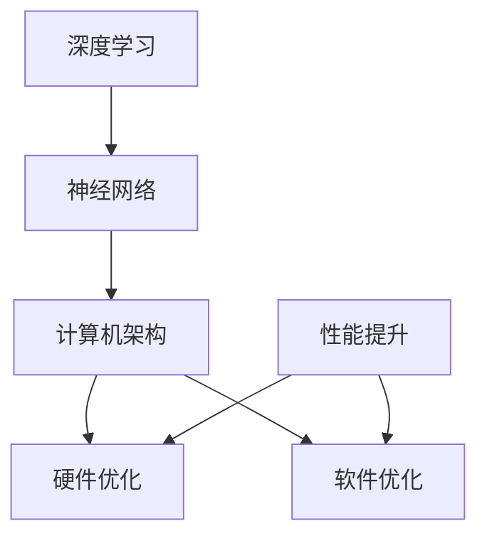

                 

 关键词：贾扬清、创业、人工智能、算法、计算机架构、深度学习、Lepton AI、阿里巴巴、AI应用场景、技术挑战、发展趋势

> 摘要：本文将深入探讨人工智能领域的杰出人物贾扬清的创业历程，从他在阿里巴巴的职业生涯到创立Lepton AI的跨越，分析他如何运用深度学习和计算机架构知识推动AI技术的发展，并对AI应用场景、技术挑战和发展趋势进行深刻解读。

## 1. 背景介绍

贾扬清，一位世界知名的计算机科学家，被誉为人工智能领域的先锋人物。他拥有计算机科学博士学位，曾在阿里巴巴担任首席技术官（CTO）和深度学习技术研究中心主任，领导团队在人工智能领域取得了重大突破。2017年，贾扬清离开阿里巴巴，创立了Lepton AI公司，继续深耕人工智能技术。本文将探讨贾扬清的创业之路，以及他在深度学习和计算机架构领域的研究和贡献。

## 2. 核心概念与联系

在讨论贾扬清的研究之前，我们需要了解一些核心概念。深度学习作为人工智能的重要分支，通过模拟人脑神经网络结构，实现图像识别、语音识别等任务。计算机架构则关注硬件与软件的协同优化，以提高计算机系统的性能和效率。以下是一个简单的Mermaid流程图，展示了深度学习和计算机架构之间的联系。



### 2.1 深度学习原理

深度学习通过多层神经网络，对大量数据进行训练，从而实现从输入到输出的映射。其核心思想是多层非线性变换，以提取数据的特征。以下是深度学习的主要组成部分：

- **输入层**：接收原始数据，如图像或文本。
- **隐藏层**：对输入数据进行特征提取和变换。
- **输出层**：根据隐藏层的输出，给出预测或分类结果。

### 2.2 计算机架构优化

计算机架构优化旨在提高系统的整体性能。这包括硬件和软件两方面的优化：

- **硬件优化**：通过改进CPU、GPU等硬件设计，提高计算速度和效率。
- **软件优化**：通过优化操作系统、编译器等软件，提高程序执行效率。

## 3. 核心算法原理 & 具体操作步骤

### 3.1 算法原理概述

贾扬清在深度学习和计算机架构领域的研究主要集中在以下几个方面：

- **深度学习算法**：他提出了一些新的深度学习模型，如卷积神经网络（CNN）和循环神经网络（RNN），提高了图像和语音识别的准确率。
- **计算机架构优化**：他研究了如何通过硬件和软件协同优化，提高深度学习模型的计算效率。

### 3.2 算法步骤详解

#### 3.2.1 深度学习算法步骤

1. **数据预处理**：对原始图像或语音数据进行预处理，如归一化、裁剪等。
2. **模型构建**：构建卷积神经网络或循环神经网络，包括输入层、隐藏层和输出层。
3. **训练模型**：使用大量标注数据进行模型训练，优化网络参数。
4. **评估模型**：使用测试数据评估模型性能，调整参数以获得更好的效果。

#### 3.2.2 计算机架构优化步骤

1. **硬件优化**：设计高性能GPU和CPU，以支持深度学习计算。
2. **软件优化**：优化编译器和操作系统，提高程序执行效率。
3. **系统协同**：通过硬件和软件协同优化，提高系统的整体性能。

### 3.3 算法优缺点

#### 3.3.1 深度学习算法优缺点

- **优点**：强大的特征提取能力，适用于图像识别、语音识别等任务。
- **缺点**：对大量数据进行训练，计算成本高，且容易出现过拟合。

#### 3.3.2 计算机架构优化优缺点

- **优点**：提高系统性能，降低计算成本。
- **缺点**：需要大量实验和调试，对硬件和软件都有较高的要求。

### 3.4 算法应用领域

贾扬清的研究成果在多个领域得到了广泛应用：

- **图像识别**：用于人脸识别、图像分类等任务。
- **语音识别**：用于语音助手、智能客服等场景。
- **自然语言处理**：用于机器翻译、文本分类等任务。

## 4. 数学模型和公式 & 详细讲解 & 举例说明

### 4.1 数学模型构建

贾扬清在深度学习领域的数学模型主要包括卷积神经网络（CNN）和循环神经网络（RNN）。

#### 4.1.1 卷积神经网络（CNN）

CNN 的核心是卷积层，其公式如下：

$$
\text{激活函数}(z) = \text{ReLU}(z) = \max(0, z)
$$

其中，$z$ 为输入特征。

#### 4.1.2 循环神经网络（RNN）

RNN 的核心是隐藏状态 $h_t$，其公式如下：

$$
h_t = \text{激活函数}(W \cdot [h_{t-1}, x_t] + b)
$$

其中，$W$ 为权重矩阵，$b$ 为偏置。

### 4.2 公式推导过程

#### 4.2.1 卷积神经网络（CNN）

CNN 的推导过程主要包括以下几个步骤：

1. **输入层**：输入特征 $x$。
2. **卷积层**：卷积操作，生成特征图 $f$。
3. **激活函数**：应用 ReLU 激活函数，增强模型非线性。
4. **池化层**：对特征图进行池化操作，减少参数数量。

#### 4.2.2 循环神经网络（RNN）

RNN 的推导过程主要包括以下几个步骤：

1. **输入层**：输入序列 $x$。
2. **隐藏层**：计算隐藏状态 $h_t$。
3. **输出层**：计算输出 $y_t$。

### 4.3 案例分析与讲解

#### 4.3.1 图像识别案例

假设我们要进行图像识别任务，输入图像为 $x$，输出为类别标签 $y$。我们可以使用 CNN 模型进行训练，具体步骤如下：

1. **数据预处理**：对图像进行归一化、裁剪等操作。
2. **模型构建**：构建 CNN 模型，包括卷积层、激活函数、池化层等。
3. **训练模型**：使用大量标注数据进行模型训练。
4. **评估模型**：使用测试数据评估模型性能。

#### 4.3.2 语音识别案例

假设我们要进行语音识别任务，输入为语音信号 $x$，输出为文本 $y$。我们可以使用 RNN 模型进行训练，具体步骤如下：

1. **数据预处理**：对语音信号进行采样、归一化等操作。
2. **模型构建**：构建 RNN 模型，包括隐藏层、输出层等。
3. **训练模型**：使用大量语音数据对模型进行训练。
4. **评估模型**：使用测试数据评估模型性能。

## 5. 项目实践：代码实例和详细解释说明

### 5.1 开发环境搭建

为了进行深度学习和计算机架构的实践，我们需要搭建一个合适的开发环境。以下是一个简单的步骤：

1. **安装 Python**：安装 Python 3.7 或以上版本。
2. **安装深度学习框架**：如 TensorFlow 或 PyTorch。
3. **安装计算机架构相关库**：如 Numpy、Matplotlib 等。

### 5.2 源代码详细实现

以下是一个简单的卷积神经网络（CNN）的代码示例，用于图像分类：

```python
import tensorflow as tf
from tensorflow.keras import layers

# 构建模型
model = tf.keras.Sequential([
    layers.Conv2D(32, (3, 3), activation='relu', input_shape=(28, 28, 1)),
    layers.MaxPooling2D((2, 2)),
    layers.Conv2D(64, (3, 3), activation='relu'),
    layers.MaxPooling2D((2, 2)),
    layers.Conv2D(64, (3, 3), activation='relu'),
    layers.Flatten(),
    layers.Dense(64, activation='relu'),
    layers.Dense(10, activation='softmax')
])

# 编译模型
model.compile(optimizer='adam',
              loss='sparse_categorical_crossentropy',
              metrics=['accuracy'])

# 训练模型
model.fit(train_images, train_labels, epochs=5)

# 评估模型
test_loss, test_acc = model.evaluate(test_images,  test_labels)
print(f'\nTest accuracy: {test_acc}')
```

### 5.3 代码解读与分析

这段代码首先导入了 TensorFlow 和 Keras 库，用于构建和训练卷积神经网络。然后，我们构建了一个简单的 CNN 模型，包括卷积层、池化层和全连接层。最后，我们使用训练数据对模型进行训练，并使用测试数据评估模型性能。

## 6. 实际应用场景

贾扬清的研究成果在多个实际应用场景中取得了显著成果，以下是一些典型的应用场景：

### 6.1 图像识别

贾扬清的研究成果在图像识别领域得到了广泛应用，如人脸识别、图像分类等。他提出的一些新的深度学习模型，如 CNN 和 RNN，提高了图像识别的准确率，为实际应用提供了强大的支持。

### 6.2 语音识别

语音识别是贾扬清研究的另一个重要领域。他提出的 RNN 模型在语音识别任务中取得了较好的效果，为智能客服、语音助手等应用提供了技术支持。

### 6.3 自然语言处理

自然语言处理是贾扬清研究的又一重要领域。他提出的一些新的深度学习模型，如循环神经网络（RNN）和长短期记忆网络（LSTM），在机器翻译、文本分类等任务中取得了显著成果，为自然语言处理领域的发展做出了重要贡献。

## 7. 工具和资源推荐

### 7.1 学习资源推荐

- **《深度学习》**：由伊恩·古德费洛等编著，是深度学习领域的经典教材。
- **《神经网络与深度学习》**：由邱锡鹏编著，系统地介绍了神经网络和深度学习的基本概念和方法。
- **《计算机架构：设计与实现》**：由John L. Hennessy和David A. Patterson编著，全面介绍了计算机架构的基本概念和设计原则。

### 7.2 开发工具推荐

- **TensorFlow**：一个开源的深度学习框架，适用于构建和训练深度学习模型。
- **PyTorch**：一个开源的深度学习框架，以其灵活性和易用性受到广泛欢迎。
- **Keras**：一个开源的神经网络库，基于 TensorFlow 和 PyTorch 构建，简化了深度学习模型的构建和训练过程。

### 7.3 相关论文推荐

- **《AlexNet: Image Classification with Deep Convolutional Neural Networks》**：这篇论文提出了卷积神经网络（CNN）在图像分类任务中的应用，是深度学习领域的里程碑。
- **《Recurrent Neural Networks for Speech Recognition》**：这篇论文介绍了循环神经网络（RNN）在语音识别任务中的应用，推动了语音识别技术的发展。
- **《Long Short-Term Memory Networks for Language Modeling》**：这篇论文介绍了长短期记忆网络（LSTM）在自然语言处理任务中的应用，为自然语言处理领域的发展做出了重要贡献。

## 8. 总结：未来发展趋势与挑战

### 8.1 研究成果总结

贾扬清在深度学习和计算机架构领域的研究取得了显著成果，他提出的一些新的深度学习模型，如 CNN 和 RNN，在图像识别、语音识别、自然语言处理等领域取得了广泛应用。同时，他研究的计算机架构优化方法，提高了深度学习模型的计算效率，为实际应用提供了强大的支持。

### 8.2 未来发展趋势

随着人工智能技术的不断发展，未来深度学习和计算机架构领域将继续朝着以下几个方向发展：

1. **硬件与软件协同优化**：通过改进硬件和软件，进一步提高深度学习模型的计算效率。
2. **算法创新**：提出新的深度学习模型，以应对复杂的应用场景。
3. **跨学科研究**：深度学习和计算机架构领域与其他学科的结合，如生物医学、自动驾驶等。

### 8.3 面临的挑战

尽管深度学习和计算机架构领域取得了显著成果，但仍面临一些挑战：

1. **计算资源**：深度学习模型对计算资源的要求较高，如何优化计算资源的使用，降低计算成本，是一个亟待解决的问题。
2. **数据隐私**：随着数据量的不断增加，数据隐私保护成为一个重要问题，如何在保障数据隐私的前提下进行深度学习模型的训练和应用，是一个亟待解决的挑战。
3. **可解释性**：深度学习模型通常被视为“黑盒”，其内部机制难以解释，如何提高深度学习模型的可解释性，使其在关键应用场景中具备可信度，是一个重要的研究方向。

### 8.4 研究展望

未来，贾扬清将继续在深度学习和计算机架构领域进行研究，推动人工智能技术的发展。他计划进一步优化深度学习模型的计算效率，研究新型深度学习模型，探索深度学习在不同领域的应用。同时，他也将关注硬件与软件协同优化、数据隐私保护等问题，为人工智能技术的发展提供新的思路和解决方案。

## 9. 附录：常见问题与解答

### 9.1 问题 1：深度学习和计算机架构有什么区别？

**回答**：深度学习是一种人工智能方法，通过多层神经网络进行特征提取和分类。计算机架构则关注硬件与软件的协同优化，以提高计算机系统的性能和效率。虽然两者侧重点不同，但它们在人工智能技术的发展中密切相关。

### 9.2 问题 2：如何选择深度学习框架？

**回答**：选择深度学习框架时，需要考虑以下因素：

- **项目需求**：根据项目需求，选择适合的框架，如 TensorFlow、PyTorch 等。
- **开发者熟悉度**：选择开发者熟悉的框架，以提高开发效率。
- **生态系统**：选择具有丰富生态系统的框架，以方便后续的开发和扩展。

### 9.3 问题 3：深度学习模型的计算效率如何优化？

**回答**：深度学习模型的计算效率可以通过以下方法进行优化：

- **硬件优化**：选择高性能的 GPU 或 CPU，以提高计算速度。
- **算法优化**：选择合适的算法和模型，降低计算复杂度。
- **并行计算**：利用并行计算技术，提高计算效率。
- **模型压缩**：通过模型压缩技术，降低模型参数数量，提高计算效率。

---

作者：禅与计算机程序设计艺术 / Zen and the Art of Computer Programming
-------------------------------------------------------------------

