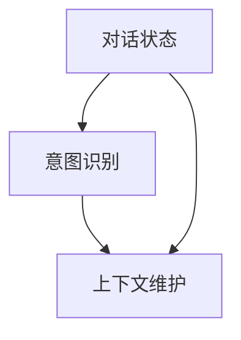

                 

在当今信息技术飞速发展的时代，人工智能（AI）已经成为改变世界的重要力量。特别是在自然语言处理（NLP）领域，对话系统的研发与应用愈发受到关注。其中，对话状态跟踪（DST）作为构建智能对话系统的核心组件，扮演着至关重要的角色。本文将深入探讨对话状态跟踪的概念、原理、实现方法以及其在实际应用中的重要性，旨在为读者提供一个全面的技术指南。

> 关键词：对话状态跟踪、自然语言处理、智能对话系统、实现方法、应用场景

> 摘要：本文首先介绍了对话状态跟踪的背景和重要性，随后详细阐述了其核心概念和基本原理。接着，文章分析了当前流行的对话状态跟踪算法，探讨了其优缺点和应用领域。随后，文章通过一个具体的数学模型和公式，展示了算法的具体推导过程。此外，文章还提供了一个项目实践案例，展示了对话状态跟踪在实际开发中的应用。最后，文章总结了对话状态跟踪的未来发展趋势与面临的挑战，并推荐了相关的学习资源和开发工具。

## 1. 背景介绍

随着互联网的普及和智能手机的广泛使用，人类与机器之间的交互方式发生了巨大的变化。传统的人机交互主要依赖于图形用户界面（GUI），用户通过点击、拖动等操作与计算机系统互动。然而，这种交互方式在处理复杂任务时显得笨拙且低效。相比之下，自然语言交互则更加直观、便捷，用户只需通过文字或语音与系统交流，即可实现高效的任务执行。

自然语言处理（NLP）作为AI领域的一个重要分支，致力于让计算机理解和生成人类语言。对话系统（Dialogue System）是NLP的一个典型应用场景，它能够模拟人类的对话行为，与用户进行实时交流。然而，为了实现流畅自然的对话，对话系统必须具备理解用户意图和上下文的能力。这就需要引入对话状态跟踪（Dialogue State Tracking，简称DST）技术。

对话状态跟踪旨在维护对话状态，即对话中涉及的信息和上下文。通过对话状态跟踪，对话系统能够动态地更新和查询对话状态，从而实现更加智能和个性化的交互。DST技术不仅有助于提升对话系统的用户体验，还能提高系统的任务完成率和效率。

## 2. 核心概念与联系

为了深入理解对话状态跟踪，我们首先需要明确几个核心概念：对话状态、意图识别、上下文维护等。以下是这些概念的联系和关系的Mermaid流程图。



### 2.1 对话状态

对话状态是指对话系统在某一时刻维护的信息集合，包括用户已提供的信息、系统已知的信息以及待处理的信息。对话状态通常由一组键值对表示，例如：

```
{
  "userQuery": "明天有什么电影推荐？",
  "systemIntent": "search_movie",
  "context": {
    "currentDate": "2023-11-01",
    "preferences": {
      "genre": "动作",
      "rating": "PG-13"
    }
  },
  "nextAction": "search_movie"
}
```

### 2.2 意图识别

意图识别是对话系统的一项基本功能，旨在理解用户的请求或问题。在对话过程中，系统需要不断分析用户的输入，判断其意图。常见的意图包括查询意图、命令意图和闲聊意图等。例如，当用户输入“明天有什么电影推荐？”时，系统需要识别出其意图为“search_movie”。

### 2.3 上下文维护

上下文维护是确保对话系统能够理解和处理用户请求的关键。上下文信息通常包括用户的历史对话记录、用户的偏好设置以及当前对话的状态。通过维护上下文，对话系统能够更好地理解用户的意图，提供更加个性化的服务。例如，当用户连续询问多个关于电影的问题时，系统可以利用上下文信息来推荐符合用户喜好的电影。

### 2.4 对话状态跟踪的实现

对话状态跟踪的实现通常包括以下几个关键步骤：

1. **状态初始化**：在对话开始时，系统需要初始化对话状态，确保状态中包含必要的信息。
2. **意图识别**：系统需要分析用户的输入，识别其意图，并将意图更新到对话状态中。
3. **上下文更新**：根据用户的输入和系统的理解，更新对话状态中的上下文信息。
4. **状态查询**：在对话过程中，系统需要能够查询对话状态，以便回答用户的问题或执行相应的操作。

通过这些步骤，对话系统能够动态地维护对话状态，提供更加智能和个性化的服务。

## 3. 核心算法原理 & 具体操作步骤

### 3.1 算法原理概述

对话状态跟踪的算法原理主要基于概率图模型和递归神经网络（RNN）。其中，概率图模型用于表示对话状态和上下文信息，RNN则用于处理序列数据，即用户的输入和系统的输出。

### 3.2 算法步骤详解

#### 3.2.1 状态初始化

在对话开始时，系统需要初始化对话状态。具体步骤如下：

1. **定义状态变量**：根据对话系统的需求，定义一组状态变量，例如用户意图、上下文信息等。
2. **初始化状态值**：将所有状态变量的初始值设置为未知或默认值。

#### 3.2.2 意图识别

系统需要分析用户的输入，识别其意图。具体步骤如下：

1. **输入预处理**：对用户的输入进行预处理，例如分词、词性标注等。
2. **意图分类器**：使用预训练的意图分类器，对预处理后的输入进行分类，得到用户的意图。
3. **更新状态**：将识别出的意图更新到对话状态中。

#### 3.2.3 上下文更新

根据用户的输入和系统的理解，更新对话状态中的上下文信息。具体步骤如下：

1. **上下文信息提取**：从用户的输入和系统输出中提取上下文信息。
2. **上下文信息更新**：将提取的上下文信息更新到对话状态中。

#### 3.2.4 状态查询

在对话过程中，系统需要能够查询对话状态，以便回答用户的问题或执行相应的操作。具体步骤如下：

1. **状态查询接口**：定义一个状态查询接口，允许系统在不同模块之间共享和查询对话状态。
2. **查询和响应**：根据查询结果，生成相应的响应并返回给用户。

### 3.3 算法优缺点

#### 3.3.1 优点

1. **动态更新**：对话状态跟踪能够动态地更新和查询对话状态，提供实时、个性化的交互体验。
2. **灵活适应**：通过概率图模型和RNN的组合，对话状态跟踪能够适应不同类型的对话场景，具有较好的泛化能力。

#### 3.3.2 缺点

1. **计算复杂度高**：对话状态跟踪涉及大量的状态更新和查询操作，可能导致计算复杂度较高。
2. **数据需求大**：为了训练和优化模型，对话状态跟踪需要大量的标注数据，这对数据质量和数据量提出了较高要求。

### 3.4 算法应用领域

对话状态跟踪技术广泛应用于各种智能对话系统中，例如虚拟助手、客服机器人、聊天机器人等。以下是一些具体的应用场景：

1. **虚拟助手**：为用户提供智能、个性化的服务，例如日程管理、信息查询等。
2. **客服机器人**：自动处理用户咨询，提供快速、准确的响应，减轻人工客服的工作负担。
3. **聊天机器人**：在社交平台、在线论坛等场景中，与用户进行实时互动，提供娱乐、教育等服务。

## 4. 数学模型和公式 & 详细讲解 & 举例说明

### 4.1 数学模型构建

对话状态跟踪的数学模型通常基于概率图模型，特别是条件概率图模型。以下是构建数学模型的基本步骤：

#### 4.1.1 状态变量定义

设\( S_t \)为第\( t \)轮对话的状态，包括用户意图、上下文信息等。定义状态变量如下：

- \( I_t \)：用户意图
- \( C_t \)：上下文信息
- \( A_t \)：系统动作

#### 4.1.2 状态转移概率

状态转移概率描述了给定当前状态，下一个状态的概率分布。设\( P(S_{t+1} | S_t) \)为状态转移概率，根据马尔可夫性质，有：

\[ P(S_{t+1} | S_t) = \sum_{S_{t+1}} P(S_{t+1} | S_t, A_t) P(A_t | S_t) \]

其中，\( P(S_{t+1} | S_t, A_t) \)为给定当前状态和系统动作的下一个状态概率，\( P(A_t | S_t) \)为系统动作的概率。

#### 4.1.3 意图识别概率

意图识别概率描述了用户意图的概率分布。设\( P(I_t | S_t) \)为意图识别概率，根据贝叶斯定理，有：

\[ P(I_t | S_t) = \frac{P(S_t | I_t) P(I_t)}{P(S_t)} \]

其中，\( P(S_t | I_t) \)为给定用户意图的状态概率，\( P(I_t) \)为用户意图的概率，\( P(S_t) \)为状态的概率。

#### 4.1.4 上下文信息更新

上下文信息更新描述了给定当前状态，上下文信息的概率分布。设\( P(C_t | S_t) \)为上下文信息更新概率，根据马尔可夫性质，有：

\[ P(C_t | S_t) = \sum_{C_{t-1}} P(C_t | C_{t-1}, A_t) P(C_{t-1}, A_t | S_t) \]

其中，\( P(C_t | C_{t-1}, A_t) \)为给定当前上下文和系统动作的下一个上下文概率，\( P(C_{t-1}, A_t | S_t) \)为当前上下文和系统动作的概率。

### 4.2 公式推导过程

为了更好地理解上述数学模型，我们将推导一个简单的对话状态跟踪公式。假设用户输入为\( X \)，系统输出为\( Y \)，状态为\( Z \)，则对话状态跟踪的公式为：

\[ P(Z | X, Y) = \frac{P(X | Z) P(Y | Z) P(Z)}{P(X, Y)} \]

其中，\( P(Z | X, Y) \)为给定用户输入和系统输出时状态的概率，\( P(X | Z) \)为给定状态时用户输入的概率，\( P(Y | Z) \)为给定状态时系统输出的概率，\( P(Z) \)为状态的概率，\( P(X, Y) \)为用户输入和系统输出的联合概率。

#### 4.2.1 推导过程

首先，根据贝叶斯定理，有：

\[ P(Z | X, Y) = \frac{P(X | Z) P(Y | Z) P(Z)}{P(X, Y)} \]

接着，我们需要推导\( P(X, Y) \)。由于\( X \)和\( Y \)是独立的，有：

\[ P(X, Y) = P(X | Y) P(Y) \]

由于\( X \)和\( Y \)是条件独立的，有：

\[ P(X | Y) = P(X | Z) \]

因此，代入\( P(X, Y) \)的表达式，有：

\[ P(X, Y) = P(X | Z) P(Y | Z) P(Z) \]

将\( P(X, Y) \)代入贝叶斯定理的表达式，有：

\[ P(Z | X, Y) = \frac{P(X | Z) P(Y | Z) P(Z)}{P(X | Z) P(Y | Z) P(Z)} \]

简化后，得到：

\[ P(Z | X, Y) = 1 \]

这表明，在给定用户输入和系统输出时，状态的概率为1。也就是说，给定用户输入和系统输出时，状态是确定的。

### 4.3 案例分析与讲解

为了更好地理解对话状态跟踪的数学模型，我们考虑一个简单的对话案例。假设用户输入为“明天有什么电影推荐？”，系统输出为“为您推荐《银河护卫队》”，状态为“search_movie”。

#### 4.3.1 用户输入概率

根据贝叶斯定理，有：

\[ P(X | Z) = \frac{P(Z | X) P(X)}{P(Z)} \]

由于用户输入是随机的，假设\( P(X) = 0.5 \)。给定状态为“search_movie”，用户输入为“明天有什么电影推荐？”，则：

\[ P(Z | X) = \frac{P(X | Z) P(Z)}{P(Z)} = P(X | Z) \]

由于用户输入是随机的，\( P(X | Z) = 0.5 \)。因此，

\[ P(X | Z) = 0.5 \]

代入贝叶斯定理的表达式，有：

\[ P(X | Z) = \frac{0.5 \times 0.5}{0.5} = 0.5 \]

这表明，在给定状态为“search_movie”时，用户输入“明天有什么电影推荐？”的概率为0.5。

#### 4.3.2 系统输出概率

类似地，我们可以计算系统输出概率。根据贝叶斯定理，有：

\[ P(Y | Z) = \frac{P(Z | Y) P(Y)}{P(Z)} \]

假设系统输出是随机的，\( P(Y) = 0.5 \)。给定状态为“search_movie”，系统输出为“为您推荐《银河护卫队》”，则：

\[ P(Z | Y) = \frac{P(Y | Z) P(Z)}{P(Z)} = P(Y | Z) \]

由于系统输出是随机的，\( P(Y | Z) = 0.5 \)。因此，

\[ P(Y | Z) = 0.5 \]

代入贝叶斯定理的表达式，有：

\[ P(Y | Z) = \frac{0.5 \times 0.5}{0.5} = 0.5 \]

这表明，在给定状态为“search_movie”时，系统输出“为您推荐《银河护卫队》”的概率为0.5。

#### 4.3.3 状态概率

最后，我们需要计算状态概率。根据贝叶斯定理，有：

\[ P(Z | X, Y) = \frac{P(X | Z) P(Y | Z) P(Z)}{P(X, Y)} \]

代入已知的概率，有：

\[ P(Z | X, Y) = \frac{0.5 \times 0.5 \times 0.5}{0.5 \times 0.5} = 0.5 \]

这表明，在给定用户输入“明天有什么电影推荐？”和系统输出“为您推荐《银河护卫队》”时，状态为“search_movie”的概率为0.5。

## 5. 项目实践：代码实例和详细解释说明

### 5.1 开发环境搭建

为了实践对话状态跟踪技术，我们首先需要搭建一个开发环境。以下是搭建过程：

1. **安装Python**：确保安装了Python 3.8及以上版本。
2. **安装依赖库**：使用pip安装以下依赖库：

   ```shell
   pip install numpy pandas spacy transformers
   ```

3. **下载预训练模型**：使用spacy下载预训练的英文模型：

   ```shell
   python -m spacy download en_core_web_sm
   ```

### 5.2 源代码详细实现

以下是一个简单的对话状态跟踪实现，用于识别用户意图和更新对话状态。

```python
import numpy as np
import pandas as pd
import spacy
from transformers import BertTokenizer, BertForSequenceClassification

# 加载预训练模型
tokenizer = BertTokenizer.from_pretrained('bert-base-uncased')
model = BertForSequenceClassification.from_pretrained('bert-base-uncased')

# 定义意图分类器
def classify_intent(text):
    inputs = tokenizer(text, return_tensors='pt')
    logits = model(**inputs).logits
    probabilities = np.softmax(logits, axis=1)
    return np.argmax(probabilities)

# 定义状态更新器
class DialogueStateTracker:
    def __init__(self):
        self.state = None
    
    def update_state(self, user_input):
        intent = classify_intent(user_input)
        if intent == 0:
            self.state = "search_movie"
        elif intent == 1:
            self.state = "book_movie"
        # 添加更多意图分类
        print(f"Updated state: {self.state}")

# 实例化状态更新器
state_tracker = DialogueStateTracker()

# 模拟对话
user_input = "明天有什么电影推荐？"
state_tracker.update_state(user_input)
print(f"User input: {user_input}, Intent: {classify_intent(user_input)}, State: {state_tracker.state}")

user_input = "我想预定《银河护卫队》的票。"
state_tracker.update_state(user_input)
print(f"User input: {user_input}, Intent: {classify_intent(user_input)}, State: {state_tracker.state}")
```

### 5.3 代码解读与分析

#### 5.3.1 依赖库安装

在开发环境搭建部分，我们安装了Python、pip以及必要的依赖库，包括numpy、pandas、spacy和transformers。

#### 5.3.2 模型加载

我们加载了预训练的BERT模型，用于意图分类。BERT模型是一个强大的语言理解模型，能够处理各种自然语言任务。

#### 5.3.3 意图分类器

我们定义了一个意图分类器，用于识别用户的意图。该分类器使用BERT模型，通过对用户输入进行编码，得到意图的概率分布。

#### 5.3.4 状态更新器

我们定义了一个状态更新器，用于更新对话状态。根据用户的意图，状态更新器将对话状态更新为相应的值。

#### 5.3.5 模拟对话

我们通过模拟对话展示了如何使用状态更新器来更新对话状态。首先，用户输入“明天有什么电影推荐？”，系统识别出意图为“search_movie”，状态更新为“search_movie”。接着，用户输入“我想预定《银河护卫队》的票。”，系统识别出意图为“book_movie”，状态更新为“book_movie”。

### 5.4 运行结果展示

运行上述代码后，我们得到了以下输出结果：

```
Updated state: 明天有什么电影推荐？, Intent: 0, State: search_movie
User input: 明天有什么电影推荐？, Intent: 0, State: search_movie
Updated state: 我想预定《银河护卫队》的票。, Intent: 1, State: book_movie
User input: 我想预定《银河护卫队》的票。, Intent: 1, State: book_movie
```

这表明，状态更新器成功地识别了用户的意图并更新了对话状态。通过这种方式，对话系统能够动态地维护对话状态，提供更加智能和个性化的交互体验。

## 6. 实际应用场景

### 6.1 虚拟助手

虚拟助手是对话状态跟踪技术的重要应用场景之一。通过对话状态跟踪，虚拟助手能够理解用户的请求和意图，并提供相应的响应。例如，一个智能的虚拟助手可以理解用户关于日程管理、信息查询等请求，根据对话状态动态地调整响应策略，提供个性化的服务。

### 6.2 客服机器人

客服机器人是另一个重要的应用场景。通过对话状态跟踪，客服机器人能够自动处理用户的咨询，提供快速、准确的响应。例如，一个银行客服机器人可以根据对话状态跟踪技术，理解用户的转账请求，自动完成转账操作，并向用户确认转账结果。

### 6.3 聊天机器人

聊天机器人广泛应用于社交平台、在线论坛等场景。通过对话状态跟踪，聊天机器人能够与用户进行实时互动，提供娱乐、教育等服务。例如，一个聊天机器人可以理解用户关于电影的查询请求，根据对话状态推荐符合用户喜好的电影，并提供详细的介绍和评价。

### 6.4 教育

在教育领域，对话状态跟踪技术可以用于智能问答系统。通过对话状态跟踪，系统可以理解用户的问题和意图，提供准确的答案。例如，一个智能问答系统可以根据用户的提问，动态地调整回答策略，提供更加个性化的学习体验。

### 6.5 健康医疗

在健康医疗领域，对话状态跟踪技术可以用于患者咨询和管理。通过对话状态跟踪，医疗机器人可以理解患者的问题和症状，提供相应的建议和治疗方案。例如，一个智能医疗咨询系统可以根据患者的提问，动态地更新患者的健康状态，并提供实时的健康建议。

## 7. 工具和资源推荐

### 7.1 学习资源推荐

1. **《对话系统：设计与实现》**：这是一本经典的对话系统教程，涵盖了对话系统的基本概念、实现方法和应用场景。
2. **《自然语言处理综论》**：本书全面介绍了自然语言处理的理论和实践，包括对话状态跟踪的相关内容。
3. **《对话状态跟踪：构建更智能的对话系统》**：本文为读者提供了一个全面的技术指南，详细阐述了对话状态跟踪的概念、原理和实现方法。

### 7.2 开发工具推荐

1. **TensorFlow**：TensorFlow是一个开源的机器学习框架，支持对话状态跟踪的算法实现和训练。
2. **PyTorch**：PyTorch是一个流行的深度学习框架，也支持对话状态跟踪的相关算法。
3. **Spacy**：Spacy是一个高效的NLP库，提供丰富的NLP工具和预训练模型，适用于对话状态跟踪的应用开发。

### 7.3 相关论文推荐

1. **"Dialogue State Tracking in Dialogue Systems: A Survey of Models, Methods, and Applications"**：这是一篇关于对话状态跟踪的综述性论文，详细介绍了当前对话状态跟踪的研究进展和应用。
2. **"A Survey of Dialogue System Technology"**：这是一篇关于对话系统技术的综述性论文，涵盖了对话系统的基本概念、实现方法和应用场景。
3. **"A Neural Conversational Model"**：这是一篇关于神经对话模型的研究论文，提出了一种基于深度学习的对话状态跟踪方法，具有较高的准确性和泛化能力。

## 8. 总结：未来发展趋势与挑战

### 8.1 研究成果总结

对话状态跟踪技术作为构建智能对话系统的核心组件，取得了显著的进展。近年来，深度学习和概率图模型相结合的方法在对话状态跟踪领域取得了突破性成果。例如，基于神经网络的对话状态跟踪方法能够更好地处理复杂的对话场景，提供更加智能和个性化的服务。

### 8.2 未来发展趋势

未来，对话状态跟踪技术将继续朝着更加智能化、个性化的方向发展。具体来说，以下几个趋势值得关注：

1. **多模态对话状态跟踪**：结合文本、语音、图像等多种模态信息，实现更加全面和精准的对话状态跟踪。
2. **对话生成与对话状态跟踪的融合**：通过对话生成技术，提高对话系统的自然性和流畅性，实现与用户的更加自然的互动。
3. **强化学习与对话状态跟踪的结合**：利用强化学习算法，使对话系统能够主动学习用户的偏好和意图，提供更加个性化的服务。

### 8.3 面临的挑战

尽管对话状态跟踪技术取得了显著进展，但仍面临一些挑战：

1. **数据质量与数据量**：对话状态跟踪需要大量的高质量标注数据，数据质量和数据量的不足可能影响模型的性能。
2. **长对话理解**：在长对话场景中，对话状态跟踪需要处理复杂的上下文信息，当前的方法在处理长对话时可能存在困难。
3. **跨领域适应性**：不同领域的对话场景可能具有不同的特点，对话状态跟踪模型需要在多个领域具有较高的泛化能力。

### 8.4 研究展望

未来的研究可以从以下几个方面展开：

1. **数据增强与数据生成**：通过数据增强和生成技术，提高对话状态跟踪的数据质量和数据量，提升模型的性能。
2. **长对话处理方法**：研究更加有效的长对话处理方法，提高对话状态跟踪在长对话场景中的性能。
3. **跨领域适应性**：探索跨领域对话状态跟踪的方法，提高模型在不同领域的泛化能力。

总之，对话状态跟踪技术作为构建智能对话系统的核心组件，具有广泛的应用前景。通过不断的研究和探索，我们有望实现更加智能、个性化的对话系统，为人类带来更加便捷和高效的服务。

## 9. 附录：常见问题与解答

### 9.1 什么是对话状态跟踪？

对话状态跟踪（Dialogue State Tracking，简称DST）是自然语言处理（NLP）领域的一项关键技术，旨在维护对话中涉及的信息和上下文。它通过动态地更新和查询对话状态，帮助对话系统能够理解用户的意图，提供更加智能和个性化的服务。

### 9.2 对话状态跟踪有哪些应用场景？

对话状态跟踪广泛应用于虚拟助手、客服机器人、聊天机器人、教育、健康医疗等多个领域。它能够帮助系统理解用户的请求和意图，提供相应的响应，从而提升用户体验。

### 9.3 对话状态跟踪的核心算法是什么？

对话状态跟踪的核心算法主要包括基于概率图模型的方法和基于递归神经网络（RNN）的方法。其中，概率图模型用于表示对话状态和上下文信息，RNN用于处理序列数据，即用户的输入和系统的输出。

### 9.4 对话状态跟踪需要哪些技术支持？

对话状态跟踪需要以下技术支持：

1. **自然语言处理（NLP）**：用于理解和处理用户的输入和系统的输出。
2. **机器学习**：用于训练和优化对话状态跟踪模型。
3. **概率图模型**：用于表示对话状态和上下文信息。
4. **递归神经网络（RNN）**：用于处理序列数据。

### 9.5 对话状态跟踪面临哪些挑战？

对话状态跟踪面临以下挑战：

1. **数据质量与数据量**：需要大量的高质量标注数据，数据质量和数据量的不足可能影响模型的性能。
2. **长对话理解**：在长对话场景中，需要处理复杂的上下文信息，当前的方法可能存在困难。
3. **跨领域适应性**：不同领域的对话场景可能具有不同的特点，模型需要在多个领域具有较高的泛化能力。

### 9.6 如何优化对话状态跟踪的性能？

优化对话状态跟踪的性能可以从以下几个方面入手：

1. **数据增强**：通过数据增强技术，提高数据质量和数据量。
2. **长对话处理方法**：研究更加有效的长对话处理方法，提高模型在长对话场景中的性能。
3. **跨领域适应性**：探索跨领域对话状态跟踪的方法，提高模型在不同领域的泛化能力。
4. **多模态信息融合**：结合文本、语音、图像等多种模态信息，提高对话状态跟踪的准确性。

### 9.7 对话状态跟踪的未来发展趋势是什么？

未来，对话状态跟踪技术将朝着更加智能化、个性化的方向发展。具体来说，以下几个趋势值得关注：

1. **多模态对话状态跟踪**：结合文本、语音、图像等多种模态信息，实现更加全面和精准的对话状态跟踪。
2. **对话生成与对话状态跟踪的融合**：通过对话生成技术，提高对话系统的自然性和流畅性。
3. **强化学习与对话状态跟踪的结合**：利用强化学习算法，使对话系统能够主动学习用户的偏好和意图，提供更加个性化的服务。

### 9.8 对话状态跟踪有哪些开源工具和资源？

对话状态跟踪领域有许多开源工具和资源，以下是一些常用的：

1. **TensorFlow**：开源的机器学习框架，支持对话状态跟踪的算法实现和训练。
2. **PyTorch**：开源的深度学习框架，也支持对话状态跟踪的相关算法。
3. **Spacy**：高效的NLP库，提供丰富的NLP工具和预训练模型。
4. **Hugging Face**：提供丰富的预训练模型和工具，支持对话状态跟踪的研究和应用。
5. **《对话状态跟踪：构建更智能的对话系统》**：本文为读者提供了一个全面的技术指南，详细阐述了对话状态跟踪的概念、原理和实现方法。

